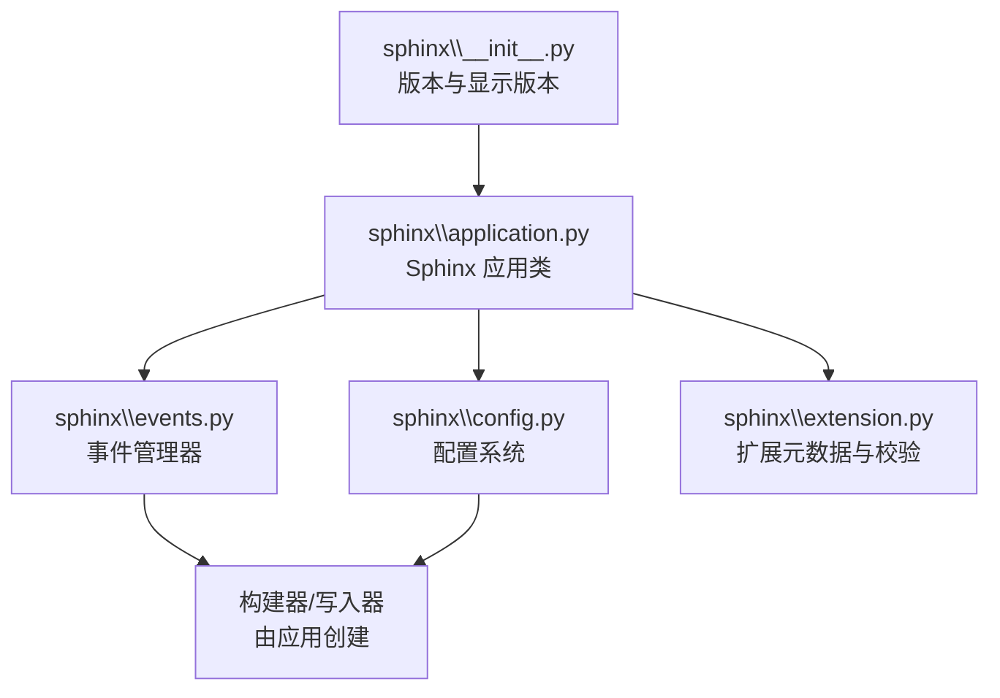
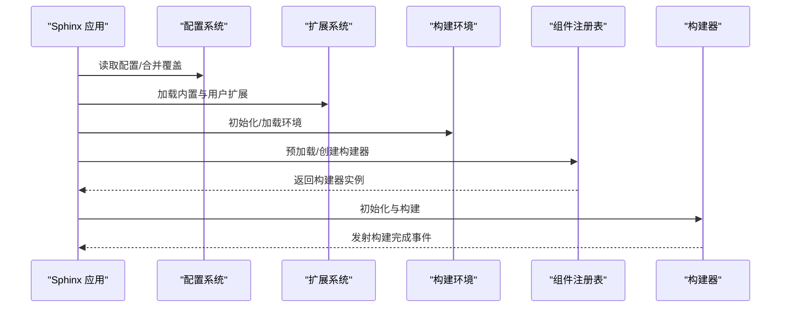
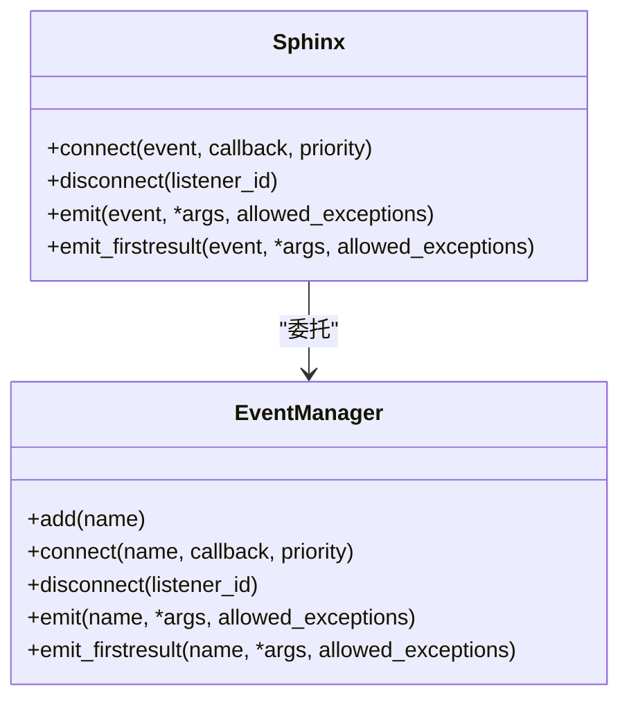
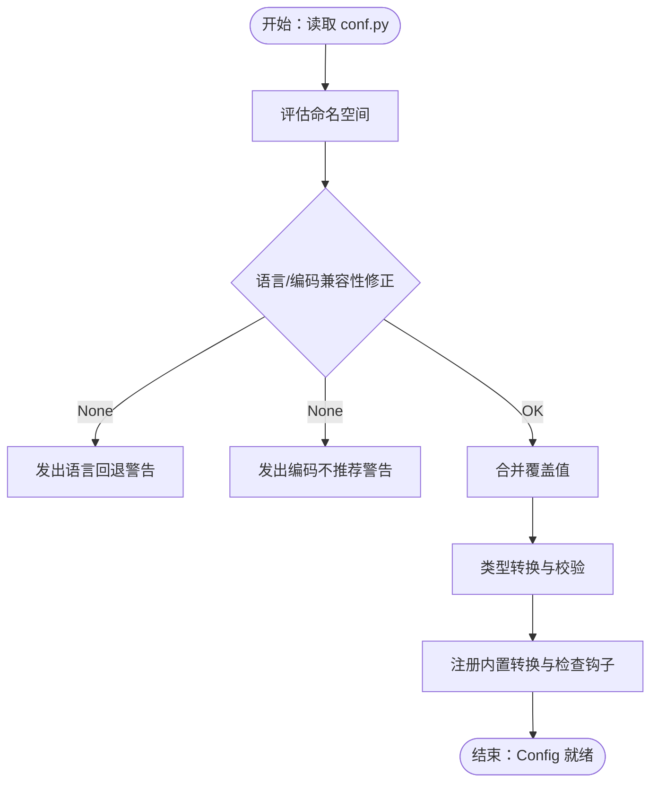
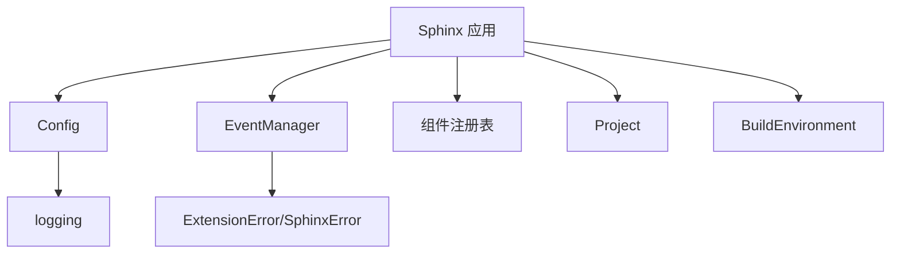

# API 参考

<cite>
**本文引用的文件**
- [sphinx\__init__.py](file://sphinx\__init__.py)
- [sphinx\application.py](file://sphinx\application.py)
- [sphinx\events.py](file://sphinx\events.py)
- [sphinx\config.py](file://sphinx\config.py)
- [sphinx\extension.py](file://sphinx\extension.py)
</cite>

## 目录
1. [简介](#简介)
2. [项目结构](#项目结构)
3. [核心组件](#核心组件)
4. [架构总览](#架构总览)
5. [详细组件分析](#详细组件分析)
6. [依赖分析](#依赖分析)
7. [性能考虑](#性能考虑)
8. [故障排查指南](#故障排查指南)
9. [结论](#结论)
10. [附录](#附录)

## 简介
本文件为 Sphinx 核心 API 的权威参考，覆盖以下方面：
- 应用程序 API：Sphinx 类的构造与生命周期、事件接口、扩展注册与配置注入、构建器创建与初始化等。
- 事件系统 API：事件注册、回调签名、优先级与传播机制、错误处理策略。
- 配置 API：配置项定义、类型校验、动态覆盖、合并与序列化。
- 扩展 API：扩展元数据、版本要求校验、扩展加载流程。
- 构建器 API：构建器注册、创建与初始化、构建阶段状态。
- 实际使用模式与最佳实践。

## 项目结构
Sphinx 的核心 API 主要集中在如下模块：
- sphinx\__init__.py：版本号与显示版本导出。
- sphinx\application.py：Sphinx 应用类、扩展注册、事件接口、配置注入、构建器管理。
- sphinx\events.py：事件管理器、事件注册与发射、优先级排序与异常传播。
- sphinx\config.py：配置对象、配置项类型系统、配置读取与校验、内置转换与检查钩子。
- sphinx\extension.py：扩展元数据模型、扩展版本要求校验、扩展初始化钩子。

图表来源
- [sphinx\application.py:148-341](file://sphinx\application.py#L148-L341)
- [sphinx\events.py:72-101](file://sphinx\events.py#L72-L101)
- [sphinx\config.py:196-214](file://sphinx\config.py#L196-L214)
- [sphinx\extension.py:23-41](file://sphinx\extension.py#L23-L41)

章节来源
- [sphinx\application.py:148-341](file://sphinx\application.py#L148-L341)
- [sphinx\events.py:72-101](file://sphinx\events.py#L72-L101)
- [sphinx\config.py:196-214](file://sphinx\config.py#L196-L214)
- [sphinx\extension.py:23-41](file://sphinx\extension.py#L23-L41)

## 核心组件
- Sphinx 应用类：负责初始化、配置读取、扩展加载、环境与构建器创建、构建执行与收尾。
- EventManager：统一管理事件注册、优先级排序、回调执行与异常传播。
- Config：集中管理配置项、默认值、类型校验、覆盖与序列化。
- Extension：扩展元数据与版本要求校验工具。
- 内置扩展集合：包含构建器、域、指令、变换、收集器等。

章节来源
- [sphinx\application.py:148-341](file://sphinx\application.py#L148-L341)
- [sphinx\events.py:72-101](file://sphinx\events.py#L72-L101)
- [sphinx\config.py:196-214](file://sphinx\config.py#L196-L214)
- [sphinx\extension.py:23-41](file://sphinx\extension.py#L23-L41)

## 架构总览
Sphinx 的核心运行时由应用层驱动，贯穿“配置—扩展—环境—构建器”的主干流程；事件系统贯穿各阶段，用于插件化扩展与定制。

图表来源
- [sphinx\application.py:263-341](file://sphinx\application.py#L263-L341)
- [sphinx\config.py:338-353](file://sphinx\config.py#L338-L353)
- [sphinx\events.py:405-457](file://sphinx\events.py#L405-L457)

## 详细组件分析

### Sphinx 应用 API
- 构造函数
  - 参数要点：源目录、配置目录、输出目录、doctree 目录、构建器名称、配置覆盖字典、日志流、并行度、标签、警告策略等。
  - 行为：校验目录合法性、设置日志、读取配置、初始化国际化、加载内置与用户扩展、预加载构建器、创建项目与环境、创建并初始化构建器。
- 关键属性
  - srcdir/confdir/outdir/doctreedir：路径属性，支持字符串或 PathLike。
  - extensions：已加载扩展映射。
  - config：配置对象。
  - project/env/builder/events：项目、环境、构建器与事件管理器。
- 关键方法
  - build：根据参数选择全量、指定文件或增量构建，并在完成后发射事件。
  - setup_extension：按名称导入并初始化扩展。
  - require_sphinx：校验运行时 Sphinx 版本。
  - connect/disconnect/emit/emit_firstresult：事件接口委托至 EventManager。
  - add_* 系列：注册构建器、配置值、事件、节点、指令、角色、域、变换、静态资源等。
  - preload_builder/create_builder/_init_builder：构建器生命周期管理。

章节来源
- [sphinx\application.py:165-341](file://sphinx\application.py#L165-L341)
- [sphinx\application.py:497-870](file://sphinx\application.py#L497-L870)
- [sphinx\application.py:874-1599](file://sphinx\application.py#L874-L1599)

### 事件系统 API
- EventManager
  - 事件注册：支持多重重载签名，按事件名注册回调，返回监听器 ID。
  - 事件发射：emit 返回所有回调结果列表；emit_firstresult 返回首个非空结果。
  - 优先级：按 priority 升序执行；允许指定 allowed_exceptions 白名单。
  - 错误传播：捕获回调异常，结合 reraise/pdb 策略决定是否抛出或包装为 ExtensionError。
- 核心事件（节选）
  - config-inited、builder-inited、env-*、source-read/include-read、doctree-read/doctree-resolved、missing-reference/warn-missing-reference、write-started、build-finished 等。
- 使用建议
  - 自定义事件需先通过 add 注册名称，再 connect。
  - 回调函数应尽量幂等、轻量，避免阻塞。

图表来源
- [sphinx\events.py:72-101](file://sphinx\events.py#L72-L101)
- [sphinx\application.py:792-870](file://sphinx\application.py#L792-L870)

章节来源
- [sphinx\events.py:72-101](file://sphinx\events.py#L72-L101)
- [sphinx\events.py:363-485](file://sphinx\events.py#L363-L485)
- [sphinx\application.py:792-870](file://sphinx\application.py#L792-L870)

### 配置 API
- Config 对象
  - 配置项：以 _Opt(default, rebuild, valid_types, description) 描述，含默认值、重建条件、有效类型集合与描述。
  - 读取：从 conf.py 评估命名空间，进行兼容性修正与类型转换。
  - 覆盖：支持命令行/外部覆盖，按类型安全转换。
  - 动态添加：add(name, default, rebuild, types, description) 注册新配置项。
  - 过滤：filter(rebuild) 按重建条件筛选。
  - 序列化：__getstate__/__setstate__ 支持缓存与持久化。
- 类型系统
  - ENUM：限定候选集合。
  - _Opt：不可变配置选项描述对象。
- 内置转换与检查
  - convert_source_suffix、convert_highlight_options、init_numfig_format、evaluate_copyright_placeholders、correct_copyright_year、check_confval_types、check_primary_domain 等。
- 异常与警告
  - ConfigError：配置语法/编程错误、非法覆盖、缺失 conf.py。
  - 警告：未知配置值、类型不匹配、编码不推荐等。

图表来源
- [sphinx\config.py:565-613](file://sphinx\config.py#L565-L613)
- [sphinx\config.py:636-774](file://sphinx\config.py#L636-L774)
- [sphinx\config.py:899-914](file://sphinx\config.py#L899-L914)

章节来源
- [sphinx\config.py:196-214](file://sphinx\config.py#L196-L214)
- [sphinx\config.py:338-401](file://sphinx\config.py#L338-L401)
- [sphinx\config.py:494-517](file://sphinx\config.py#L494-L517)
- [sphinx\config.py:565-613](file://sphinx\config.py#L565-L613)
- [sphinx\config.py:636-774](file://sphinx\config.py#L636-L774)
- [sphinx\config.py:777-852](file://sphinx\config.py#L777-L852)
- [sphinx\config.py:899-914](file://sphinx\config.py#L899-L914)

### 扩展 API
- Extension 元数据
  - name/module/metadata/version/parallel_read_safe/parallel_write_safe。
- 扩展版本要求校验
  - verify_needs_extensions：检查 needs_extensions 中声明的扩展版本满足度，未加载则警告，不满足则抛出版本错误。
- 初始化钩子
  - setup：注册上述校验钩子，返回扩展元数据。

章节来源
- [sphinx\extension.py:23-41](file://sphinx\extension.py#L23-L41)
- [sphinx\extension.py:41-84](file://sphinx\extension.py#L41-L84)
- [sphinx\extension.py:87-95](file://sphinx\extension.py#L87-L95)

### 构建器 API 与自定义构建器
- 预加载与创建
  - preload_builder：预加载构建器模块（注册表负责）。
  - create_builder：根据名称与环境创建构建器实例。
- 生命周期
  - _init_builder：初始化构建器并发射 builder-inited 事件。
- 自定义构建器
  - 通过 add_builder 注册自定义构建器类，可选择覆盖同名构建器。
  - 构建器需实现必要的接口（如 init/build_*），并在应用中被创建与使用。

章节来源
- [sphinx\application.py:418-430](file://sphinx\application.py#L418-L430)
- [sphinx\application.py:874-884](file://sphinx\application.py#L874-L884)
- [sphinx\application.py:1389-1422](file://sphinx\application.py#L1389-L1422)

## 依赖分析
- 组件耦合
  - Sphinx 依赖 Config、EventManager、Project、BuildEnvironment、SphinxComponentRegistry、Theme、SearchLanguage 等。
  - EventManager 仅持有对 Sphinx 的弱引用（内部 app 属性已弃用）。
  - Config 依赖 logging 与错误类型，提供序列化支持。
- 外部依赖
  - docutils、pygments、packaging、typing_extensions（类型注解）等。

图表来源
- [sphinx\application.py:18-36](file://sphinx\application.py#L18-L36)
- [sphinx\events.py:12-16](file://sphinx\events.py#L12-L16)
- [sphinx\config.py:13-15](file://sphinx\config.py#L13-L15)

章节来源
- [sphinx\application.py:18-36](file://sphinx\application.py#L18-L36)
- [sphinx\events.py:12-16](file://sphinx\events.py#L12-L16)
- [sphinx\config.py:13-15](file://sphinx\config.py#L13-L15)

## 性能考虑
- 并行构建：通过 parallel 参数控制读写并行度，合理设置可提升吞吐。
- 环境复用：doctreedir 缓存可避免重复解析；freshenv 强制重建会增加开销。
- 事件回调：避免在高频事件（如 doctree-read）中执行重任务；必要时使用 allowed_exceptions 与优先级控制。
- 配置校验：尽量在早期完成配置校验与转换，减少运行期开销。

## 故障排查指南
- 配置错误
  - 缺少 conf.py 或语法错误：抛出 ConfigError；检查 conf.py 文件存在与语法。
  - 未知配置值：记录警告；确认拼写与可用配置项。
  - 类型不匹配：记录警告；修正为有效类型或候选值。
- 事件异常
  - 回调抛出异常：若启用 reraise/pdb，则直接抛出；否则包装为 ExtensionError 并携带模块名。
- 版本与扩展
  - Sphinx 版本过低：require_sphinx 抛出 VersionRequirementError。
  - 扩展版本不满足 needs_extensions：verify_needs_extensions 抛出 VersionRequirementError 或警告。

章节来源
- [sphinx\config.py:349-351](file://sphinx\config.py#L349-L351)
- [sphinx\config.py:376-400](file://sphinx\config.py#L376-L400)
- [sphinx\events.py:445-456](file://sphinx\events.py#L445-L456)
- [sphinx\application.py:508-528](file://sphinx\application.py#L508-L528)
- [sphinx\extension.py:76-84](file://sphinx\extension.py#L76-L84)

## 结论
Sphinx 的核心 API 以 Sphinx 应用为中心，围绕配置、事件与扩展三大支柱展开，辅以构建器与环境管理，形成高度可扩展的文档生成框架。遵循本文的参数类型、返回值与异常约定，配合事件优先级与配置类型系统，可实现稳定、可维护且高性能的扩展与构建流程。

## 附录
- 版本信息
  - 版本号与显示版本由 sphinx\__init__.py 提供，用于 CLI 与日志展示。
- 常用使用模式
  - 在扩展 setup 中注册事件、配置值、节点、指令、角色与域。
  - 在配置初始化后进行类型与兼容性检查。
  - 在构建前/后通过事件钩子注入自定义逻辑。

章节来源
- [sphinx\__init__.py:14-25](file://sphinx\__init__.py#L14-L25)