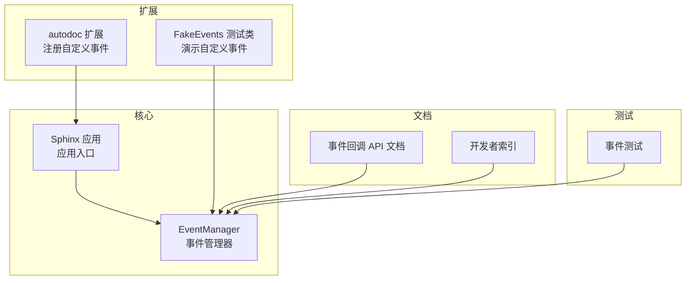
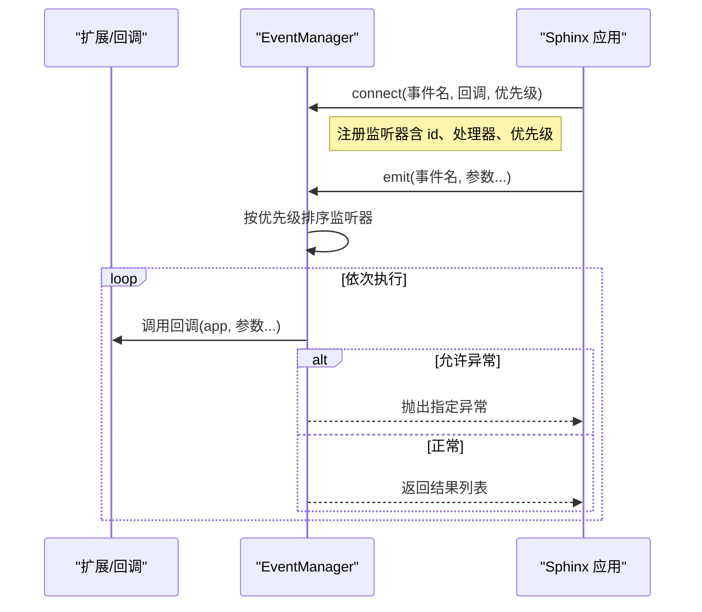
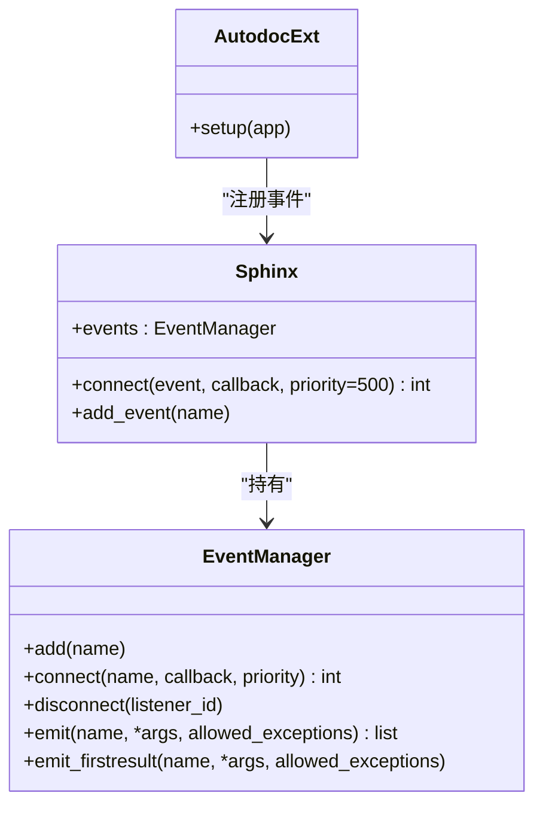
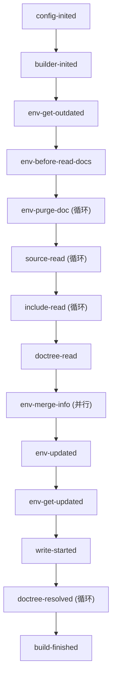

# 事件系统 API

<cite>
**本文引用的文件**
- [sphinx/events.py](file://sphinx/events.py)
- [sphinx/application.py](file://sphinx/application.py)
- [doc/extdev/event_callbacks.rst](file://doc/extdev/event_callbacks.rst)
- [doc/extdev/index.rst](file://doc/extdev/index.rst)
- [tests/test_events.py](file://tests/test_events.py)
- [sphinx/ext/autodoc/__init__.py](file://sphinx/ext/autodoc/__init__.py)
- [tests/test_ext_autodoc/autodoc_util.py](file://tests/test_ext_autodoc/autodoc_util.py)
</cite>

## 目录
1. [简介](#简介)
2. [项目结构](#项目结构)
3. [核心组件](#核心组件)
4. [架构总览](#架构总览)
5. [详细组件分析](#详细组件分析)
6. [依赖分析](#依赖分析)
7. [性能考虑](#性能考虑)
8. [故障排查指南](#故障排查指南)
9. [结论](#结论)
10. [附录](#附录)

## 简介
本文件为 Sphinx 事件系统 API 的权威参考，聚焦于事件管理器 EventManager 的设计与用法，涵盖：
- 事件注册与注销（connect/disconnect）
- 内置事件的名称、触发时机与回调参数
- 事件优先级与执行顺序
- 事件在构建流程中的作用与最佳实践
- 自定义事件与事件处理器的创建方法
- 常见使用模式与完整示例路径

## 项目结构
事件系统位于核心模块 sphinx/events.py 中，并通过应用对象 sphinx/application.py 暴露给扩展与构建器使用。官方文档在 doc/extdev 下提供了事件回调 API 的详细说明；测试用例 tests/test_events.py 展示了优先级与异常处理的行为。

图表来源
- [sphinx/events.py](file://sphinx/events.py)
- [sphinx/application.py](file://sphinx/application.py)
- [sphinx/ext/autodoc/__init__.py](file://sphinx/ext/autodoc/__init__.py)
- [tests/test_ext_autodoc/autodoc_util.py](file://tests/test_ext_autodoc/autodoc_util.py)
- [doc/extdev/event_callbacks.rst](file://doc/extdev/event_callbacks.rst)
- [doc/extdev/index.rst](file://doc/extdev/index.rst)
- [tests/test_events.py](file://tests/test_events.py)

章节来源
- [sphinx/events.py](file://sphinx/events.py)
- [sphinx/application.py](file://sphinx/application.py)
- [doc/extdev/event_callbacks.rst](file://doc/extdev/event_callbacks.rst)
- [doc/extdev/index.rst](file://doc/extdev/index.rst)
- [tests/test_events.py](file://tests/test_events.py)
- [sphinx/ext/autodoc/__init__.py](file://sphinx/ext/autodoc/__init__.py)
- [tests/test_ext_autodoc/autodoc_util.py](file://tests/test_ext_autodoc/autodoc_util.py)

## 核心组件
- EventManager：负责事件的注册、排序、触发与结果收集；支持优先级与允许的异常类型。
- Sphinx.connect：应用层对 EventManager 的便捷封装，提供默认优先级与类型化重载。
- 内置事件：覆盖配置初始化、环境读取、解析、写入到完成阶段的完整构建流程。
- 自定义事件：扩展可通过 app.add_event 注册新事件名，再由 EventManager.emit 或 emit_firstresult 触发。

章节来源
- [sphinx/events.py](file://sphinx/events.py)
- [sphinx/application.py](file://sphinx/application.py)

## 架构总览
事件系统围绕 EventManager 展开，Sphinx 在关键生命周期节点发出事件，扩展通过 connect 订阅并处理。事件回调按优先级升序执行，异常可被允许透传或统一转换为 ExtensionError。

图表来源
- [sphinx/events.py](file://sphinx/events.py)
- [sphinx/application.py](file://sphinx/application.py)

## 详细组件分析

### EventManager 类与接口
- 事件注册
  - add(name)：注册自定义事件名，避免重复。
  - connect(name, callback, priority)：注册回调，返回监听器 id，用于后续断开。
  - disconnect(listener_id)：根据 id 移除监听器。
- 事件触发
  - emit(name, *args, allowed_exceptions=())：按优先级顺序调用回调，收集返回值列表；支持允许透传的异常类型。
  - emit_firstresult(name, *args, allowed_exceptions=())：返回第一个非 None 结果，否则返回 None。
- 优先级与排序
  - 监听器按 priority 升序执行；数值越小越早执行。
- 异常处理
  - 默认将回调异常包装为 ExtensionError；若 app.pdb 为真则直接抛出异常。
  - allowed_exceptions 可指定允许透传的异常类型，便于调试或特定场景。

章节来源
- [sphinx/events.py](file://sphinx/events.py)

### Sphinx.connect 与类型化重载
- 应用层提供多重重载签名，覆盖所有内置事件的回调参数类型与返回值约束。
- 默认优先级为 500；扩展可在 setup 中调用 app.connect 进行订阅。
- 该接口是对 EventManager.connect 的便捷封装，保持一致的优先级语义。

章节来源
- [sphinx/application.py](file://sphinx/application.py)

### 内置事件清单与触发时机
以下事件来自官方文档与源码注释，涵盖从配置初始化到构建完成的完整流程。每个事件均标注了回调参数与典型用途。

- 配置与构建器
  - config-inited(app, config)：配置对象初始化完成后触发。
  - builder-inited(app)：构建器创建后触发。
  - build-finished(app, exception)：构建结束时触发，无论是否发生异常。
- 环境与文档读取
  - env-get-outdated(app, env, added, changed, removed)：确定过期文档集合时触发，可返回额外需要重新读取的文档名序列。
  - env-before-read-docs(app, env, docnames)：即将读取文档前触发，可用于重排或追加 docnames。
  - env-purge-doc(app, env, docname)：清理某文档残留信息时触发，适合扩展清理自定义缓存。
  - source-read(app, docname, content)：读取源文件后触发，可修改 content 实现源级转换。
  - include-read(app, relative_path, parent_docname, content)：include 指令读取子文件后触发。
  - doctree-read(app, doctree)：doctree 读取后、序列化前触发，可就地修改 doctree。
  - env-merge-info(app, env, docnames, other)：并行读取时，各子进程合并环境信息时触发。
  - env-updated(app, env)：环境更新完成后触发，可返回需再次更新的文档集合。
  - env-get-updated(app, env)：获取应更新的文档集合时触发。
  - env-check-consistency(app, env)：一致性检查阶段触发。
  - write-started(app, builder)：构建器开始解析与写入文档前触发。
  - doctree-resolved(app, doctree, docname)：doctree 解析完成后触发，可替换不支持的自定义节点。
  - missing-reference(app, env, node, contnode)：无法解析交叉引用时触发，可返回新节点或抛出 NoUri。
  - warn-missing-reference(app, domain, node)：交叉引用解析失败后仍无法解析时触发，可返回是否已发出警告。
- 构建器特定事件
  - html-collect-pages(app)：HTML 构建器开始写入非文档页面时触发，可返回待生成的页面元组。
  - html-page-context(app, pagename, templatename, context, doctree)：生成页面上下文时触发，可修改 context 或返回新的模板名。
  - linkcheck-process-uri(app, uri)：链接检查收集超链接时触发，可修改 uri。
- 第三方扩展事件（autodoc）
  - autodoc-process-docstring(app, what, name, obj, options, lines)
  - autodoc-before-process-signature(app, what, name, obj, options, args, retann)
  - autodoc-process-signature(app, what, name, obj, options, args, retann)
  - autodoc-process-bases(app, what, name, obj, options, bases)
  - autodoc-skip-member(app, what, name, obj, options, flag)
  - object-description-transform(app, domain, objtype, contentnode)
  - todo-defined(app, node)
  - viewcode-find-source(app, objname)
  - viewcode-follow-imported(app, objname, imported)

章节来源
- [doc/extdev/event_callbacks.rst](file://doc/extdev/event_callbacks.rst)
- [sphinx/events.py](file://sphinx/events.py)

### 事件优先级与使用指南
- 优先级规则
  - 数值越小越先执行；默认优先级为 500。
  - 同一事件中，相同优先级的回调顺序取决于注册顺序。
- 最佳实践
  - 将“前置处理”放在较低优先级（更小数值），如 100~499。
  - 将“后置处理”放在较高优先级（501~999）。
  - 对需要最早执行的处理器使用极低优先级（例如 0），但要谨慎避免与其他扩展冲突。
- 行为验证
  - 测试用例展示了不同优先级的执行顺序与 allowed_exceptions 的透传行为。

章节来源
- [tests/test_events.py](file://tests/test_events.py)
- [sphinx/events.py](file://sphinx/events.py)

### 自定义事件与事件处理器
- 注册自定义事件
  - 使用 app.add_event('your-event-name') 注册事件名，确保唯一性。
  - 仅能通过 EventManager.emit 或 emit_firstresult 触发自定义事件。
- 示例路径
  - autodoc 扩展在初始化时注册多个自定义事件，并在后续流程中触发。
  - 测试中通过继承 EventManager 并调用 add 注册一组自定义事件，演示了扩展侧的事件管理方式。

章节来源
- [sphinx/ext/autodoc/__init__.py](file://sphinx/ext/autodoc/__init__.py)
- [tests/test_ext_autodoc/autodoc_util.py](file://tests/test_ext_autodoc/autodoc_util.py)
- [sphinx/events.py](file://sphinx/events.py)

### 事件在构建流程中的作用
- 事件贯穿整个构建周期：从配置初始化、文档读取、doctree 解析、引用解析、写入输出到最终完成清理。
- 扩展通过事件钩子参与或改变构建过程，如：
  - 在 source-read 修改源内容
  - 在 doctree-resolved 替换自定义节点
  - 在 html-page-context 注入页面上下文
  - 在 build-finished 执行清理逻辑

章节来源
- [doc/extdev/event_callbacks.rst](file://doc/extdev/event_callbacks.rst)
- [doc/extdev/index.rst](file://doc/extdev/index.rst)

## 依赖分析
- EventManager 依赖
  - 类型与工具：NamedTuple、attrgetter、defaultdict、logging、inspect.safe_getattr、ExtensionError 等。
  - 与 Sphinx 的耦合体现在回调的第一个参数始终是 app（Sphinx 实例）。
- Sphinx 与 EventManager
  - Sphinx 在初始化过程中创建 EventManager，并在关键阶段触发事件（如 config-inited、builder-inited、build-finished）。
- 扩展与事件
  - 扩展通过 app.connect 订阅事件；autodoc 扩展在 setup 中注册自定义事件并在运行时触发。

图表来源
- [sphinx/events.py](file://sphinx/events.py)
- [sphinx/application.py](file://sphinx/application.py)
- [sphinx/ext/autodoc/__init__.py](file://sphinx/ext/autodoc/__init__.py)

章节来源
- [sphinx/events.py](file://sphinx/events.py)
- [sphinx/application.py](file://sphinx/application.py)
- [sphinx/ext/autodoc/__init__.py](file://sphinx/ext/autodoc/__init__.py)

## 性能考虑
- 事件数量与回调复杂度
  - 回调过多或单个回调耗时较长会显著影响构建时间；建议将重任务异步化或延迟到必要阶段。
- 优先级与排序成本
  - 每次触发都会对监听器按优先级排序；尽量减少同一事件的监听器数量或合并相似逻辑。
- 异常处理
  - 允许透传的异常可避免包装开销，但需谨慎评估风险；默认异常包装有助于快速定位问题。

## 故障排查指南
- 事件未触发
  - 确认事件名拼写正确且已注册（自定义事件需先 add）。
  - 检查 connect 是否在正确的生命周期阶段调用。
- 回调未按预期顺序执行
  - 检查优先级设置；数值越小越早执行。
- 回调异常导致构建中断
  - 默认会将异常包装为 ExtensionError；若需调试，可启用 app.pdb 或在 emit 时指定 allowed_exceptions。
- 多扩展冲突
  - 同一事件的多个处理器可能互相影响；建议通过明确的优先级策略或条件判断避免副作用。

章节来源
- [tests/test_events.py](file://tests/test_events.py)
- [sphinx/events.py](file://sphinx/events.py)

## 结论
Sphinx 事件系统以 EventManager 为核心，提供类型化重载、优先级控制与灵活的异常处理策略。通过内置事件与自定义事件，扩展可以在构建流程的关键节点介入，实现强大的可扩展能力。遵循优先级约定与异常处理策略，可获得稳定、可维护的扩展行为。

## 附录

### 常见使用模式与示例路径
- 监听配置初始化
  - 使用 app.connect('config-inited', ...) 在配置可用时进行初始化。
  - 示例路径：[doc/extdev/event_callbacks.rst](file://doc/extdev/event_callbacks.rst)
- 修改源内容
  - 使用 app.connect('source-read', ...) 修改 content 实现源级转换。
  - 示例路径：[doc/extdev/event_callbacks.rst](file://doc/extdev/event_callbacks.rst)
- 替换自定义节点
  - 使用 app.connect('doctree-resolved', ...) 就地替换不支持的节点。
  - 示例路径：[doc/extdev/event_callbacks.rst](file://doc/extdev/event_callbacks.rst)
- 注入 HTML 页面上下文
  - 使用 app.connect('html-page-context', ...) 修改模板上下文。
  - 示例路径：[doc/extdev/event_callbacks.rst](file://doc/extdev/event_callbacks.rst)
- 自定义事件与处理器
  - 扩展通过 app.add_event 注册事件，随后在合适时机触发。
  - 示例路径：[sphinx/ext/autodoc/__init__.py](file://sphinx/ext/autodoc/__init__.py)
  - 测试演示：[tests/test_ext_autodoc/autodoc_util.py](file://tests/test_ext_autodoc/autodoc_util.py)

### 事件触发时序图（概念示意）

图表来源
- [doc/extdev/event_callbacks.rst](file://doc/extdev/event_callbacks.rst)