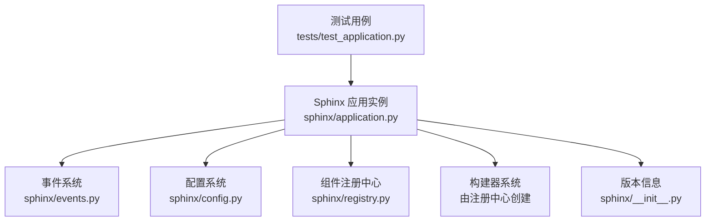
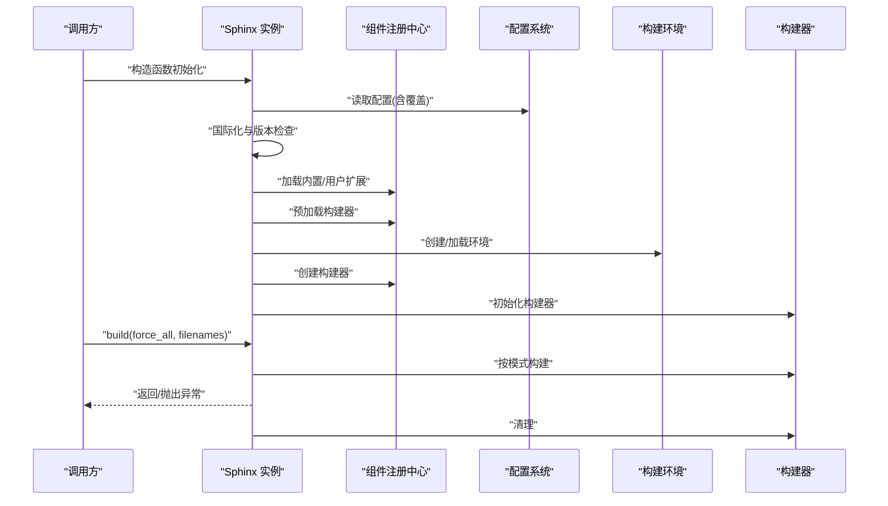
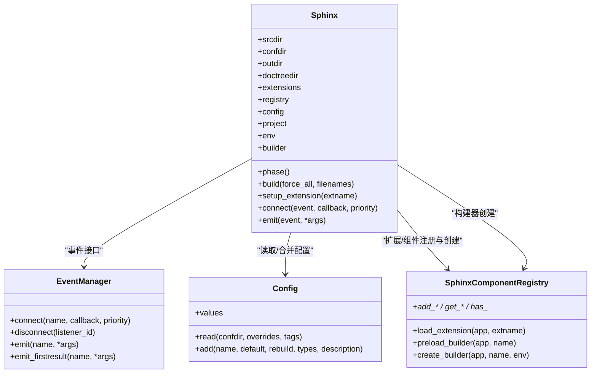

# 应用程序 API

<cite>
**本文引用的文件**
- [sphinx/application.py](file://sphinx/application.py)
- [sphinx/events.py](file://sphinx/events.py)
- [sphinx/config.py](file://sphinx/config.py)
- [sphinx/registry.py](file://sphinx/registry.py)
- [sphinx/__init__.py](file://sphinx/__init__.py)
- [tests/test_application.py](file://tests/test_application.py)
</cite>

## 目录
1. [简介](#简介)
2. [项目结构](#项目结构)
3. [核心组件](#核心组件)
4. [架构总览](#架构总览)
5. [详细组件分析](#详细组件分析)
6. [依赖关系分析](#依赖关系分析)
7. [性能考虑](#性能考虑)
8. [故障排查指南](#故障排查指南)
9. [结论](#结论)
10. [附录：使用示例与最佳实践](#附录使用示例与最佳实践)

## 简介
本参考文档聚焦于 Sphinx 应用程序 API 的核心类 Sphinx，系统阐述其构造函数参数、初始化流程、生命周期管理、主要方法（尤其是 build()）、扩展加载机制（setup_extension()）、关键属性（如 srcdir、confdir、outdir 等）以及与事件系统、配置系统、构建器系统的交互关系。文档同时给出参数类型注解、返回值说明、异常处理策略与可操作的使用示例路径，帮助读者在不同场景下正确地创建、配置与扩展 Sphinx 应用实例。

## 项目结构
围绕应用程序 API 的核心文件与职责如下：
- sphinx/application.py：定义 Sphinx 主类及其生命周期、事件接口、扩展注册与加载、构建器创建与初始化等。
- sphinx/events.py：事件管理器 EventManager 及核心事件清单，提供事件连接、断开与发射能力。
- sphinx/config.py：配置对象 Config 的实现，负责从 conf.py 读取配置、类型校验、默认值与覆盖处理。
- sphinx/registry.py：组件注册中心 SphinxComponentRegistry，统一管理扩展、构建器、解析器、翻译器、域与节点等。
- sphinx/__init__.py：版本信息与包目录定位。
- tests/test_application.py：对应用实例化、事件、扩展加载、并行安全等进行测试验证。

图表来源
- [sphinx/application.py:148-341](file://sphinx/application.py#L148-L341)
- [sphinx/events.py:72-486](file://sphinx/events.py#L72-L486)
- [sphinx/config.py:196-493](file://sphinx/config.py#L196-L493)
- [sphinx/registry.py:72-628](file://sphinx/registry.py#L72-L628)
- [sphinx/__init__.py:14-28](file://sphinx/__init__.py#L14-L28)
- [tests/test_application.py:26-179](file://tests/test_application.py#L26-L179)

章节来源
- [sphinx/application.py:148-341](file://sphinx/application.py#L148-L341)
- [sphinx/events.py:72-486](file://sphinx/events.py#L72-L486)
- [sphinx/config.py:196-493](file://sphinx/config.py#L196-L493)
- [sphinx/registry.py:72-628](file://sphinx/registry.py#L72-L628)
- [sphinx/__init__.py:14-28](file://sphinx/__init__.py#L14-L28)
- [tests/test_application.py:26-179](file://tests/test_application.py#L26-L179)

## 核心组件
- Sphinx 类：应用程序主入口，负责初始化、扩展加载、配置读取、环境与构建器创建、构建执行与清理。
- EventManager：事件管理器，提供事件注册、回调优先级、异常传播与调试支持。
- Config：配置抽象，负责从 conf.py 加载、类型转换、覆盖合并与默认值回退。
- SphinxComponentRegistry：组件注册中心，集中管理扩展、构建器、解析器、域、节点、翻译器、变换等。
- 版本信息：提供显示版本与内部版本元组，用于版本要求检查与日志输出。

章节来源
- [sphinx/application.py:148-341](file://sphinx/application.py#L148-L341)
- [sphinx/events.py:72-486](file://sphinx/events.py#L72-L486)
- [sphinx/config.py:196-493](file://sphinx/config.py#L196-L493)
- [sphinx/registry.py:72-628](file://sphinx/registry.py#L72-L628)
- [sphinx/__init__.py:14-28](file://sphinx/__init__.py#L14-L28)

## 架构总览
Sphinx 应用实例的生命周期大致如下：
- 初始化阶段：校验路径、设置日志、读取配置、国际化、版本要求检查、内置与用户扩展加载、预加载构建器、创建项目与环境、创建并初始化构建器。
- 运行阶段：根据参数选择构建模式（全量/增量/指定文件），触发构建完成事件。
- 清理阶段：输出统计信息、清理构建器资源。

图表来源
- [sphinx/application.py:165-341](file://sphinx/application.py#L165-L341)
- [sphinx/registry.py:173-196](file://sphinx/registry.py#L173-L196)
- [sphinx/config.py:339-352](file://sphinx/config.py#L339-L352)

章节来源
- [sphinx/application.py:165-341](file://sphinx/application.py#L165-L341)
- [sphinx/registry.py:173-196](file://sphinx/registry.py#L173-L196)
- [sphinx/config.py:339-352](file://sphinx/config.py#L339-L352)

## 详细组件分析

### Sphinx 类：构造函数与初始化
- 关键参数
  - srcdir：源码目录（必需）
  - confdir：配置目录（可选，默认与 srcdir 相同）
  - outdir：输出目录（必需）
  - doctreedir：文档树缓存目录（必需）
  - buildername：构建器名称（必需）
  - confoverrides：配置覆盖字典（可选）
  - status/warning：状态与警告输出流（可选，默认 stdout/stderr 或 StringIO）
  - freshenv：是否强制刷新环境（可选）
  - warningiserror：警告转错误（可选）
  - tags：标签序列（可选）
  - verbosity：详细程度（可选）
  - parallel：并行作业数（可选）
  - keep_going：保留字段（可选）
  - pdb：异常时启用调试器（可选）
  - exception_on_warning：警告即抛异常（可选）

- 初始化流程要点
  - 路径校验与规范化（源目录存在性、输出目录合法性、源与输出目录不相同）
  - 日志系统初始化（基于 verbosity）
  - 配置读取（confdir 存在则从 conf.py 读取；否则使用空配置）
  - 国际化与翻译编译（mo 文件更新与加载）
  - 版本要求检查（needs_sphinx）
  - 内置扩展与用户扩展加载（setup_extension）
  - 预加载构建器（preload_builder）
  - 输出目录确保存在
  - conf.py 中的 setup 回调（若存在且可调用）
  - 报告覆盖警告、发出 config-inited 事件
  - 创建 Project 与 BuildEnvironment（按 freshenv 决定新建或加载）
  - 创建并初始化构建器（create_builder/_init_builder）

- 异常处理
  - ApplicationError：路径非法、源与输出目录相同等
  - VersionRequirementError：版本不满足 needs_sphinx
  - ExtensionError：扩展加载失败、未知事件名等
  - ConfigError：conf.py 语法/运行时错误、setup 不是可调用对象等

章节来源
- [sphinx/application.py:165-341](file://sphinx/application.py#L165-L341)
- [sphinx/config.py:339-352](file://sphinx/config.py#L339-L352)
- [sphinx/registry.py:531-595](file://sphinx/registry.py#L531-L595)

### Sphinx 类：build() 方法
- 参数
  - force_all：布尔，为真时执行全量构建
  - filenames：序列，指定需构建的文件列表（相对 srcdir 的路径）

- 行为
  - 设置构建阶段为“读取”
  - 根据参数选择构建策略：
    - force_all：构建全部
    - filenames：仅构建指定文件
    - 否则：增量更新
  - 触发 build-finished 事件（无论成功与否）
  - 若发生异常，删除已保存的环境文件以强制下次全量构建
  - 输出构建结果摘要（成功/警告数量/问题提示）
  - 调用构建器 cleanup

- 返回值
  - 无（None）

- 异常
  - 任何构建过程中抛出的异常均会传播，并在必要时清理环境缓存

章节来源
- [sphinx/application.py:434-494](file://sphinx/application.py#L434-L494)

### Sphinx 类：扩展加载机制（setup_extension）
- 功能
  - 导入并设置扩展模块，调用其 setup(app) 并接收元数据
  - 支持版本要求检查（VersionRequirementError）
  - 忽略黑名单扩展
  - 记录扩展加载上下文前缀，便于定位问题

- 典型调用点
  - 构造函数中加载内置扩展与用户扩展
  - 用户自定义 conf.py 中的 setup 回调

章节来源
- [sphinx/application.py:497-506](file://sphinx/application.py#L497-L506)
- [sphinx/registry.py:531-595](file://sphinx/registry.py#L531-L595)

### Sphinx 类：事件系统集成
- 事件接口
  - connect(event, callback, priority)：注册事件回调，支持优先级
  - disconnect(listener_id)：注销回调
  - emit(event, *args, allowed_exceptions=...)：发射事件并收集所有回调返回值
  - emit_firstresult(event, *args, allowed_exceptions=...)：返回首个非 None 结果

- 核心事件（节选）
  - config-inited：配置初始化后
  - builder-inited：构建器初始化后
  - env-get-outdated/env-before-read-docs/env-purge-doc 等：环境阶段事件
  - source-read/include-read/doctree-read 等：文档阶段事件
  - write-started/doctree-resolved 等：写入阶段事件
  - missing-reference/warn-missing-reference：引用阶段事件
  - build-finished：构建完成（含异常参数）

- 测试验证
  - 事件名未知时抛出 ExtensionError
  - 自定义事件可通过 add_event 注册
  - 回调优先级影响执行顺序

章节来源
- [sphinx/application.py:792-870](file://sphinx/application.py#L792-L870)
- [sphinx/events.py:50-486](file://sphinx/events.py#L50-L486)
- [tests/test_application.py:52-77](file://tests/test_application.py#L52-L77)

### Sphinx 类：配置系统集成
- 配置读取
  - 从 confdir 下的 conf.py 读取命名空间
  - 合并 confoverrides（字符串值自动类型转换）
  - 默认值回退与别名映射（如 master_doc/root_doc、copyright/project_copyright）

- 配置变更重建策略
  - rebuild 字段指示变更对哪些阶段生效（env/html/epub/gettext/applehelp/devhelp 等）

- 测试验证
  - 未知覆盖项会记录警告
  - 源后缀类型转换与兼容处理

章节来源
- [sphinx/config.py:196-493](file://sphinx/config.py#L196-L493)
- [tests/test_application.py:99-111](file://tests/test_application.py#L99-L111)

### Sphinx 类：构建器系统集成
- 预加载与创建
  - preload_builder：通过注册中心预加载构建器（支持入口点）
  - create_builder：根据名称创建构建器实例
  - _init_builder：初始化构建器并发出 builder-inited 事件

- 注册中心职责
  - 维护构建器映射、域、解析器、翻译器、变换、节点处理器等
  - 提供扩展注册 API（add_* 系列方法）

章节来源
- [sphinx/application.py:418-431](file://sphinx/application.py#L418-L431)
- [sphinx/registry.py:173-196](file://sphinx/registry.py#L173-L196)

### Sphinx 类：属性与路径
- srcdir/confdir/outdir/doctreedir
  - 均为路径属性，使用 StrPathProperty 包装，支持字符串与 PathLike 输入并规范化为 Path
  - 作用：分别指向源文档目录、配置目录、输出目录、文档树缓存目录
- 其他重要属性
  - extensions：已加载扩展映射
  - registry：组件注册中心实例
  - config：配置对象
  - project：项目对象
  - env：构建环境
  - builder：当前构建器
  - phase：当前构建阶段（基于构建器）
  - fresh_env_used：本次构建是否新建了环境（None 表示尚未初始化）

章节来源
- [sphinx/application.py:160-164](file://sphinx/application.py#L160-L164)
- [sphinx/application.py:342-354](file://sphinx/application.py#L342-L354)

### Sphinx 类：扩展注册与加载 API（节选）
- add_builder/add_directive/add_role/add_node/add_domain 等
- add_config_value：注册配置项（含类型与重建策略）
- add_event：注册自定义事件
- set_translator/add_translator：注册/替换翻译器
- add_source_suffix/add_source_parser：注册源后缀与解析器
- add_transform/add_post_transform：注册变换
- add_js_file/add_css_file：注册前端资源
- add_latex_package：注册 LaTeX 宏包
- add_autodocumenter/add_autodoc_attrgetter：注册 autodoc 组件
- add_search_language/add_message_catalog：注册搜索语言与消息目录
- add_env_collector：注册环境收集器
- add_html_theme/add_html_math_renderer：注册主题与数学渲染器
- add_static_dir：注册静态目录
- is_parallel_allowed：检查扩展并行安全性
- set_html_assets_policy：设置 HTML 资源包含策略

章节来源
- [sphinx/application.py:874-1850](file://sphinx/application.py#L874-L1850)

## 依赖关系分析
- Sphinx 对事件系统、配置系统、注册中心与构建器的强耦合体现在初始化与构建阶段
- 注册中心承担“组件注册+装配”的职责，避免应用层直接耦合具体实现
- 版本信息用于版本要求检查与日志输出

图表来源
- [sphinx/application.py:148-341](file://sphinx/application.py#L148-L341)
- [sphinx/events.py:72-486](file://sphinx/events.py#L72-L486)
- [sphinx/config.py:196-493](file://sphinx/config.py#L196-L493)
- [sphinx/registry.py:72-628](file://sphinx/registry.py#L72-L628)

章节来源
- [sphinx/application.py:148-341](file://sphinx/application.py#L148-L341)
- [sphinx/events.py:72-486](file://sphinx/events.py#L72-L486)
- [sphinx/config.py:196-493](file://sphinx/config.py#L196-L493)
- [sphinx/registry.py:72-628](file://sphinx/registry.py#L72-L628)

## 性能考虑
- 并行处理：通过 is_parallel_allowed 检查扩展声明的并行安全属性，避免不安全的并行读/写
- 环境复用：freshenv 控制是否新建环境；增量构建减少重复工作
- 输出目录预创建：避免构建过程中频繁 IO
- 事件回调优先级：合理安排回调顺序，减少不必要的重复处理

章节来源
- [sphinx/application.py:1800-1837](file://sphinx/application.py#L1800-L1837)

## 故障排查指南
- 路径问题
  - 源目录不存在或输出目录不是目录：抛出 ApplicationError
  - 源与输出目录相同：抛出 ApplicationError
- 配置问题
  - conf.py 缺失或语法错误：抛出 ConfigError
  - setup 不是可调用对象：抛出 ConfigError
  - 未知覆盖项：记录警告
- 扩展问题
  - 扩展导入失败：抛出 ExtensionError
  - 扩展版本不满足需求：抛出 VersionRequirementError
  - 黑名单扩展：记录警告并忽略
- 事件问题
  - 未知事件名：抛出 ExtensionError
- 构建问题
  - 构建异常：删除环境缓存文件以强制下次全量构建
  - 警告转错误：由 warningiserror 控制

章节来源
- [sphinx/application.py:216-230](file://sphinx/application.py#L216-L230)
- [sphinx/config.py:349-351](file://sphinx/config.py#L349-L351)
- [sphinx/registry.py:551-555](file://sphinx/registry.py#L551-L555)
- [sphinx/events.py:385-387](file://sphinx/events.py#L385-L387)
- [sphinx/application.py:446-451](file://sphinx/application.py#L446-L451)

## 结论
Sphinx 应用程序 API 通过清晰的生命周期与分层设计，将事件、配置、扩展与构建器有机整合。开发者应重点关注构造函数参数与初始化流程、扩展加载机制、构建模式选择与事件回调的使用方式。遵循本文档的参数类型、返回值与异常说明，结合测试用例中的使用模式，可在多种场景下稳定地创建与扩展 Sphinx 应用实例。

## 附录：使用示例与最佳实践
- 创建与配置应用实例
  - 示例路径：[tests/test_application.py:26-50](file://tests/test_application.py#L26-L50)
  - 关键点：传入 srcdir、confdir/outdir/doctreedir、buildername、confoverrides、日志流等
- 事件与扩展
  - 注册自定义事件与回调：[tests/test_application.py:52-77](file://tests/test_application.py#L52-L77)
  - 扩展加载与黑名单处理：[tests/test_application.py:85-97](file://tests/test_application.py#L85-L97)
- 指定文件构建
  - 使用 build(force_all=False, filenames=...)：[tests/test_application.py:158-179](file://tests/test_application.py#L158-L179)
- 并行安全检查
  - is_parallel_allowed('read'|'write')：[tests/test_application.py:113-156](file://tests/test_application.py#L113-L156)
- 配置与源解析
  - add_source_suffix/add_source_parser 的效果验证：[tests/test_application.py:99-111](file://tests/test_application.py#L99-L111)

章节来源
- [tests/test_application.py:26-179](file://tests/test_application.py#L26-L179)