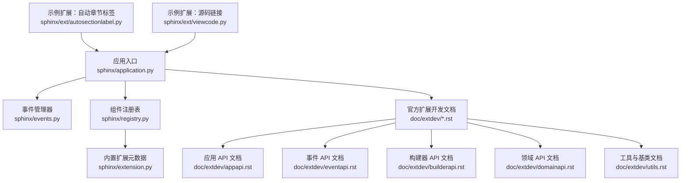
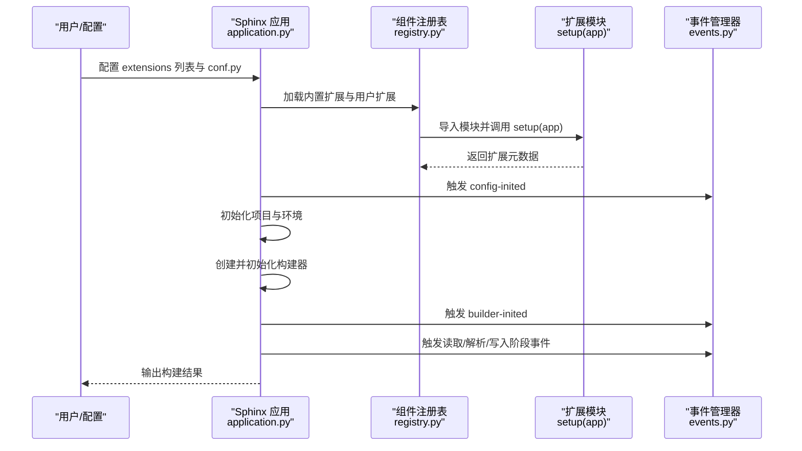
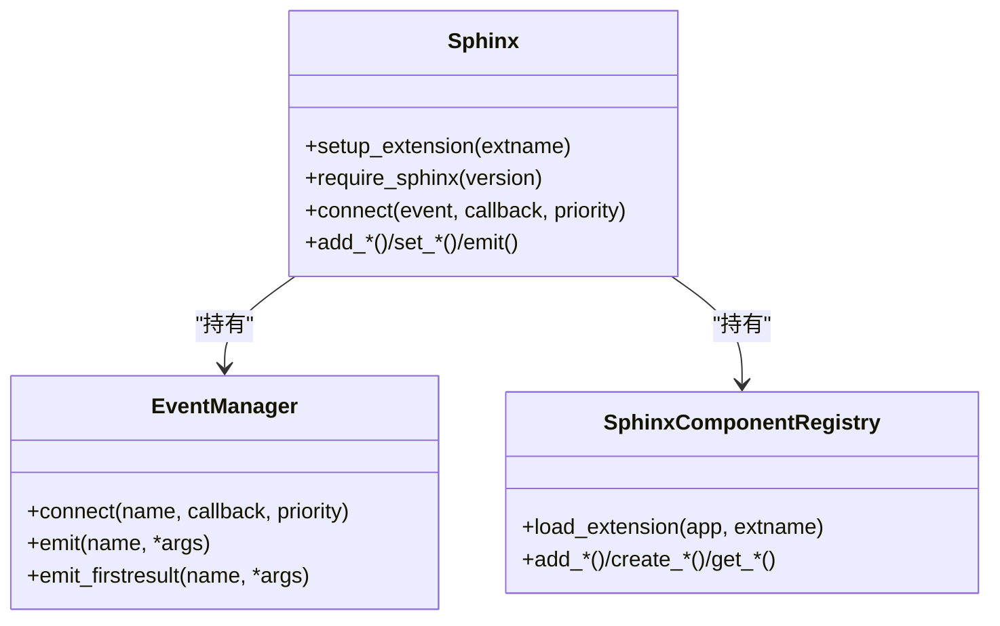
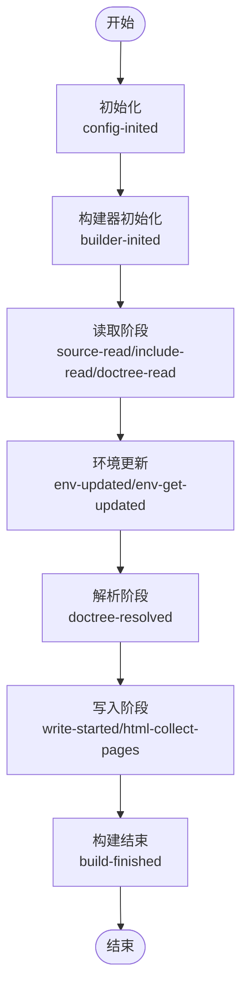
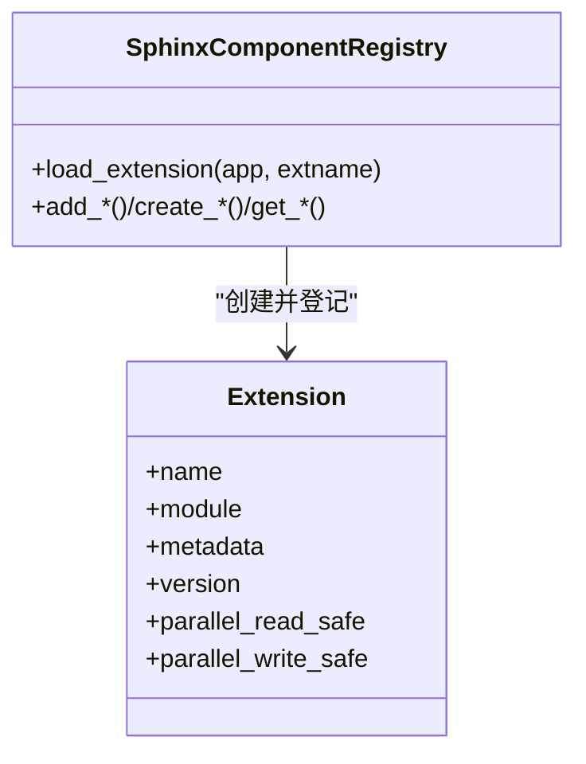
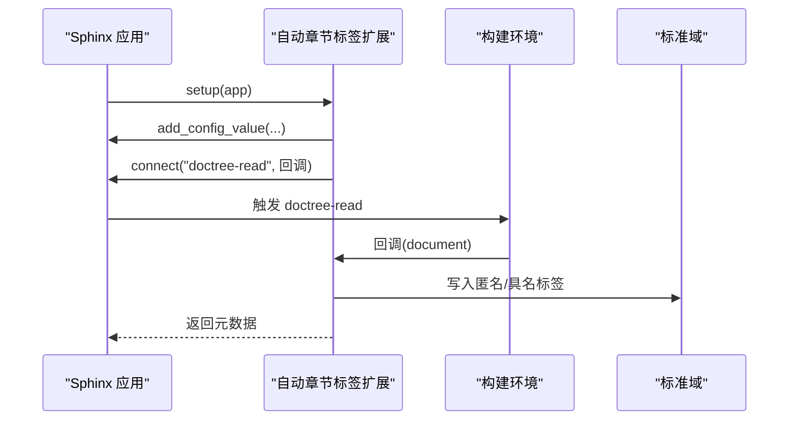
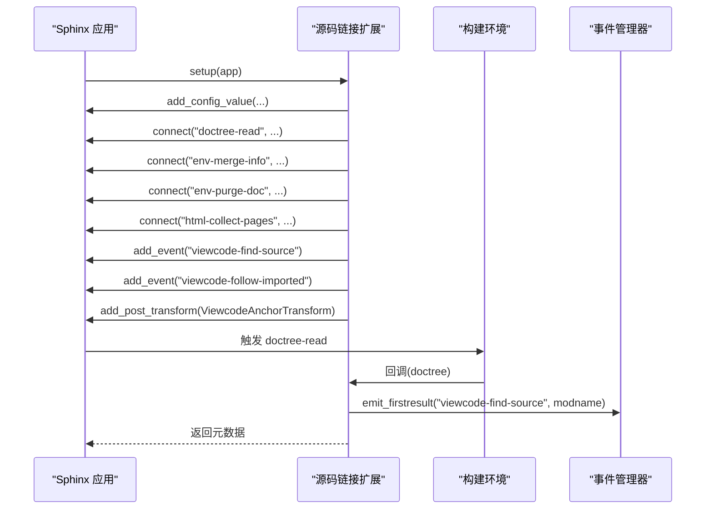
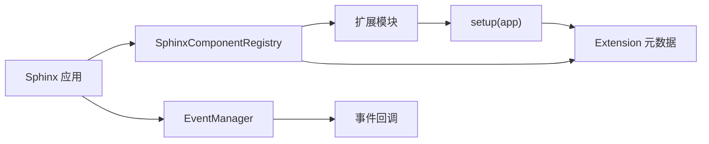

# 扩展开发 API

<cite>
**本文引用的文件**
- [application.py](file://sphinx/application.py)
- [events.py](file://sphinx/events.py)
- [registry.py](file://sphinx/registry.py)
- [extension.py](file://sphinx/extension.py)
- [appapi.rst](file://doc/extdev/appapi.rst)
- [eventapi.rst](file://doc/extdev/eventapi.rst)
- [builderapi.rst](file://doc/extdev/builderapi.rst)
- [domainapi.rst](file://doc/extdev/domainapi.rst)
- [utils.rst](file://doc/extdev/utils.rst)
- [index.rst](file://doc/extdev/index.rst)
- [testing.rst](file://doc/extdev/testing.rst)
- [autosectionlabel.py](file://sphinx/ext/autosectionlabel.py)
- [viewcode.py](file://sphinx/ext/viewcode.py)
</cite>

## 目录
1. [简介](#简介)
2. [项目结构](#项目结构)
3. [核心组件](#核心组件)
4. [架构总览](#架构总览)
5. [详细组件分析](#详细组件分析)
6. [依赖分析](#依赖分析)
7. [性能考虑](#性能考虑)
8. [故障排查指南](#故障排查指南)
9. [结论](#结论)
10. [附录](#附录)

## 简介
本文件面向 Sphinx 扩展开发者，系统性梳理扩展开发 API 的结构、setup() 函数实现要求、扩展注册与生命周期、可使用的应用接口与工具函数、扩展类型与特点、与核心系统的交互方式、标准开发流程与最佳实践、完整示例（简单与复杂）、配置项与用户界面、调试与测试方法，以及打包、分发与安装流程。内容基于 Sphinx 源码与官方扩展开发文档整理而成，力求对新手友好、对资深开发者有参考价值。

## 项目结构
围绕扩展开发的关键代码与文档主要分布在以下位置：
- 核心运行时与应用接口：sphinx/application.py
- 事件系统：sphinx/events.py
- 组件注册与加载：sphinx/registry.py
- 内置扩展元数据与版本检查：sphinx/extension.py
- 官方扩展开发文档：doc/extdev/*.rst
- 典型扩展示例：sphinx/ext/autosectionlabel.py、sphinx/ext/viewcode.py

图表来源
- [application.py:148-506](file://sphinx/application.py#L148-L506)
- [events.py:72-486](file://sphinx/events.py#L72-L486)
- [registry.py:72-628](file://sphinx/registry.py#L72-L628)
- [extension.py:23-95](file://sphinx/extension.py#L23-L95)
- [appapi.rst:1-206](file://doc/extdev/appapi.rst#L1-L206)
- [eventapi.rst:1-10](file://doc/extdev/eventapi.rst#L1-L10)
- [builderapi.rst:1-92](file://doc/extdev/builderapi.rst#L1-L92)
- [domainapi.rst:1-37](file://doc/extdev/domainapi.rst#L1-L37)
- [utils.rst:1-46](file://doc/extdev/utils.rst#L1-L46)
- [autosectionlabel.py:73-87](file://sphinx/ext/autosectionlabel.py#L73-L87)
- [viewcode.py:393-418](file://sphinx/ext/viewcode.py#L393-L418)

章节来源
- [application.py:148-506](file://sphinx/application.py#L148-L506)
- [events.py:72-486](file://sphinx/events.py#L72-L486)
- [registry.py:72-628](file://sphinx/registry.py#L72-L628)
- [extension.py:23-95](file://sphinx/extension.py#L23-L95)
- [index.rst:1-256](file://doc/extdev/index.rst#L1-L256)

## 核心组件
- 应用对象 Sphinx：扩展通过 setup(app) 获取应用实例，用于注册配置、事件、节点、指令、角色、域、转换、资源等，并控制构建生命周期。
- 事件管理器 EventManager：提供事件注册、触发与结果收集能力；扩展通过 app.connect(...) 订阅核心事件或自定义事件。
- 组件注册表 SphinxComponentRegistry：负责导入与加载扩展模块、注册构建器、域、指令、角色、索引、对象类型、转换、翻译处理器、源解析器、LaTeX 包、HTML 主题、数学渲染器等。
- 内置扩展 extension：提供 Extension 类与版本需求校验工具，规范扩展元数据返回格式。

章节来源
- [application.py:148-506](file://sphinx/application.py#L148-L506)
- [events.py:72-486](file://sphinx/events.py#L72-L486)
- [registry.py:72-628](file://sphinx/registry.py#L72-L628)
- [extension.py:23-95](file://sphinx/extension.py#L23-L95)

## 架构总览
下图展示了从初始化到构建完成的扩展参与路径，以及关键对象之间的交互。

图表来源
- [application.py:292-341](file://sphinx/application.py#L292-L341)
- [registry.py:531-595](file://sphinx/registry.py#L531-L595)
- [events.py:405-457](file://sphinx/events.py#L405-L457)

## 详细组件分析

### 应用对象与扩展注册机制
- setup_extension(extname)：按名称导入并执行扩展模块的 setup(app)，注册扩展元数据。
- require_sphinx(version)：在扩展中声明所需最低 Sphinx 版本，若不满足则抛出版本异常。
- connect(event, callback, priority)：订阅核心事件或扩展事件，支持优先级排序。
- 生命周期钩子：应用在初始化、构建器创建、读取、解析、写入等阶段发出事件，扩展可在合适阶段注册处理逻辑。

图表来源
- [application.py:497-800](file://sphinx/application.py#L497-L800)
- [events.py:72-486](file://sphinx/events.py#L72-L486)
- [registry.py:72-628](file://sphinx/registry.py#L72-L628)

章节来源
- [application.py:497-800](file://sphinx/application.py#L497-L800)
- [events.py:405-486](file://sphinx/events.py#L405-L486)
- [registry.py:531-595](file://sphinx/registry.py#L531-L595)

### 事件系统与生命周期
- 核心事件：config-inited、builder-inited、env-*、source-read、include-read、doctree-read、doctree-resolved、missing-reference、warn-missing-reference、build-finished 等。
- 自定义事件：扩展可通过 app.add_event(name) 注册事件名，再通过 events.emit(name, ...) 触发。
- 事件回调：支持优先级排序，允许第一个非空结果返回；异常处理遵循统一策略。

图表来源
- [events.py:51-69](file://sphinx/events.py#L51-L69)
- [application.py:434-494](file://sphinx/application.py#L434-L494)

章节来源
- [events.py:51-69](file://sphinx/events.py#L51-L69)
- [application.py:434-494](file://sphinx/application.py#L434-L494)

### 组件注册与扩展元数据
- 扩展元数据：version、env_version、parallel_read_safe、parallel_write_safe 等，用于版本校验、增量环境兼容与并行安全提示。
- 注册接口：add_builder、add_domain、add_directive_to_domain、add_role_to_domain、add_index_to_domain、add_object_type、add_crossref_type、add_transform、add_post_transform、add_node、add_enumerable_node、add_js_file、add_css_file、add_static_dir、add_latex_package、add_source_suffix、add_source_parser、add_env_collector、add_html_theme、add_html_math_renderer、add_autodocumenter、add_autodoc_attrgetter、add_search_language、add_message_catalog、set_translator、set_html_assets_policy 等。
- 扩展加载：registry.load_extension(app, extname) 负责导入模块、调用 setup 并记录扩展信息。

图表来源
- [extension.py:23-40](file://sphinx/extension.py#L23-L40)
- [registry.py:531-595](file://sphinx/registry.py#L531-L595)

章节来源
- [extension.py:41-95](file://sphinx/extension.py#L41-L95)
- [registry.py:531-595](file://sphinx/registry.py#L531-L595)

### 扩展类型与特点
- 构建器扩展：新增输出格式或处理动作，需实现 Builder 抽象方法并设置 name、format 等属性。
- 域扩展：为特定语言/主题添加对象类型、索引与交叉引用能力。
- 指令/角色扩展：扩展标记语法，提供新的语义节点与渲染行为。
- 转换扩展：在解析后、写入前进行树转换，修正或增强节点。
- 资源扩展：注册静态目录、CSS/JS 文件、LaTeX 包、HTML 数学渲染器、主题等。
- 配置扩展：通过 add_config_value 注册配置项，影响构建行为。

章节来源
- [builderapi.rst:1-92](file://doc/extdev/builderapi.rst#L1-L92)
- [domainapi.rst:1-37](file://doc/extdev/domainapi.rst#L1-L37)
- [appapi.rst:28-101](file://doc/extdev/appapi.rst#L28-L101)

### 扩展与核心系统的交互
- 通过 app 对象访问 config、env、builder、events 等核心对象。
- 在不同构建阶段订阅事件，参与读取、解析、写入等流程。
- 使用注册表提供的 add_* 方法向系统注入新能力。

章节来源
- [index.rst:44-98](file://doc/extdev/index.rst#L44-L98)
- [appapi.rst:1-206](file://doc/extdev/appapi.rst#L1-L206)

### 扩展开发标准流程与最佳实践
- 明确扩展目标与类型，选择合适的注册接口。
- 在 setup() 中：
  - 注册配置值（必要时指定作用域与类型）。
  - 订阅事件（注意优先级与异常处理）。
  - 注册节点、指令、角色、域、转换、资源等。
  - 返回扩展元数据（含 version、env_version、并行安全标志）。
- 遵循并行安全约束：若使用 env 存储状态，需实现 env-merge-info 与 env-purge-doc 处理。
- 使用官方测试工具链进行单元测试与集成测试。

章节来源
- [index.rst:165-228](file://doc/extdev/index.rst#L165-L228)
- [appapi.rst:28-101](file://doc/extdev/appapi.rst#L28-L101)
- [testing.rst:1-33](file://doc/extdev/testing.rst#L1-L33)

### 扩展配置选项与用户界面
- 配置项注册：使用 app.add_config_value(name, default, rebuild, types=...)，其中 rebuild 可为 'env'/'app'/'html' 等，types 指定允许类型集合。
- 用户界面：通过 conf.py 设置 extensions 列表与各扩展配置项；部分扩展还提供额外的 CLI 或模板变量。

章节来源
- [appapi.rst:38-39](file://doc/extdev/appapi.rst#L38-L39)
- [index.rst:19-36](file://doc/extdev/index.rst#L19-L36)

### 完整扩展开发示例

#### 示例一：简单扩展（自动章节标签）
- 功能：为每个章节生成匿名标签，支持前缀与深度限制。
- 关键点：
  - 在 setup() 中注册两个配置值（布尔与整数/None）。
  - 订阅 doctree-read 事件，在文档树中扫描 section 节点并写入标准域标签。
  - 返回元数据，声明并行读取安全。

图表来源
- [autosectionlabel.py:73-87](file://sphinx/ext/autosectionlabel.py#L73-L87)

章节来源
- [autosectionlabel.py:73-87](file://sphinx/ext/autosectionlabel.py#L73-L87)

#### 示例二：复杂扩展（源码链接）
- 功能：在 Python 对象描述旁添加“源码”锚点，支持多构建器、并行读取合并与清理。
- 关键点：
  - 注册多个配置值（布尔、列表/元组等）。
  - 订阅 doctree-read、env-merge-info、env-purge-doc、html-collect-pages 等事件。
  - 注册自定义事件（viewcode-find-source、viewcode-follow-imported）。
  - 添加后处理转换以在不同构建器间适配锚点节点。
  - 返回元数据，包含 env_version 与并行读取安全。

图表来源
- [viewcode.py:393-418](file://sphinx/ext/viewcode.py#L393-L418)

章节来源
- [viewcode.py:393-418](file://sphinx/ext/viewcode.py#L393-L418)

### 调试与测试
- 调试建议：
  - 使用 app.connect(...) 订阅关键事件，打印上下文信息定位问题。
  - 合理设置日志级别，利用 logger.debug/verbose 控制输出。
  - 在事件回调中捕获并记录异常，避免中断构建。
- 测试建议：
  - 使用 sphinx.testing 提供的 pytest 插件与夹具，编写单元测试与集成测试。
  - 参考 tests/ 目录中的测试组织方式，覆盖不同构建阶段与边界条件。

章节来源
- [testing.rst:1-33](file://doc/extdev/testing.rst#L1-L33)

### 打包、分发与安装
- 打包：遵循 Python 包规范，提供 setup.cfg/pyproject.toml 与入口点声明（如适用）。
- 分发：上传至 PyPI，确保版本号与元数据正确。
- 安装与启用：pip 安装后在 conf.py 的 extensions 列表中加入扩展模块名；若扩展需要配置，按需在 conf.py 中设置相应配置项。

章节来源
- [index.rst:19-36](file://doc/extdev/index.rst#L19-L36)

## 依赖分析
- 扩展加载依赖于组件注册表的 load_extension 流程，后者负责导入模块、调用 setup 并记录扩展元数据。
- 事件系统贯穿扩展生命周期，扩展通过 connect 订阅事件并在 emit 时被调用。
- 应用对象聚合了事件管理器与注册表，形成扩展与核心系统的桥接。

图表来源
- [registry.py:531-595](file://sphinx/registry.py#L531-L595)
- [extension.py:23-40](file://sphinx/extension.py#L23-L40)
- [events.py:405-457](file://sphinx/events.py#L405-L457)

章节来源
- [registry.py:531-595](file://sphinx/registry.py#L531-L595)
- [events.py:405-457](file://sphinx/events.py#L405-L457)

## 性能考虑
- 并行安全：合理设置 parallel_read_safe 与 parallel_write_safe，避免不必要的串行化。
- 环境缓存：使用 env_version 与 env-merge-info/env-purge-doc 协作，确保增量构建一致性。
- 事件优先级：将高频回调置于较低优先级，减少阻塞；仅在必要时使用 emit_firstresult。
- 资源管理：静态资源与数学渲染器应按需注册，避免冗余开销。

## 故障排查指南
- 版本不匹配：使用 require_sphinx 或在扩展元数据中声明 needs_extensions，结合 verify_needs_extensions 进行版本校验。
- 事件未触发：确认事件名拼写与注册顺序，检查回调签名与参数传递。
- 扩展重复加载：避免重复注册同一组件，使用覆盖开关或幂等判断。
- 异常处理：在事件回调中捕获预期异常，必要时允许通过 allowed_exceptions 白名单传递。

章节来源
- [extension.py:41-95](file://sphinx/extension.py#L41-L95)
- [events.py:405-457](file://sphinx/events.py#L405-L457)

## 结论
Sphinx 扩展开发围绕应用对象、事件系统与组件注册表三大支柱展开。通过规范的 setup() 实现、合理的生命周期参与与严格的元数据声明，开发者可以构建从简单到复杂的各类扩展。遵循并行安全与增量构建约束、采用官方测试工具链、配合清晰的配置与文档，是高质量扩展交付的关键。

## 附录
- 官方扩展开发文档索引：参见 doc/extdev/index.rst 与各子文档。
- 常用工具与基类：参见 doc/extdev/utils.rst。
- 构建器与领域 API：参见 doc/extdev/builderapi.rst、doc/extdev/domainapi.rst。
- 事件 API：参见 doc/extdev/eventapi.rst。