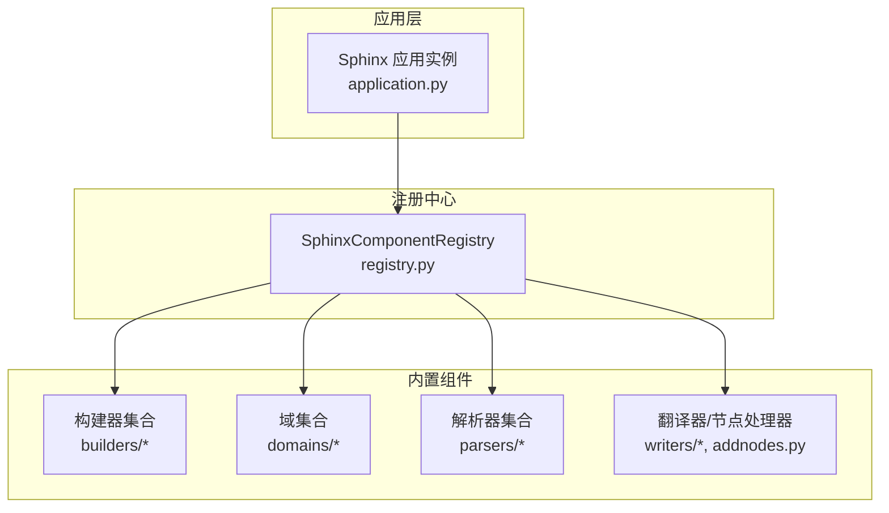
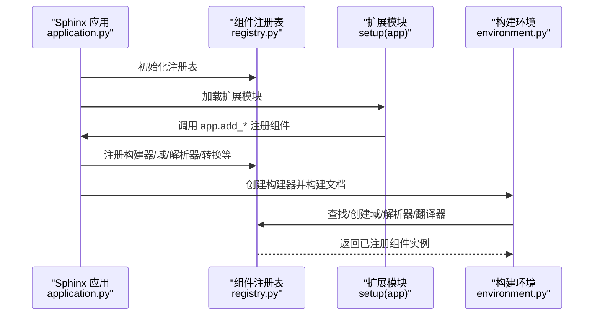
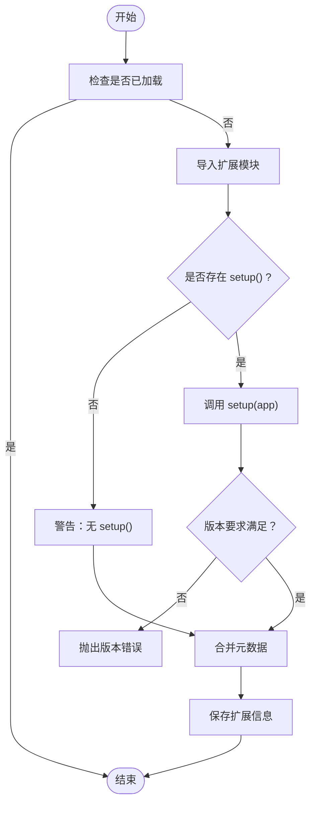
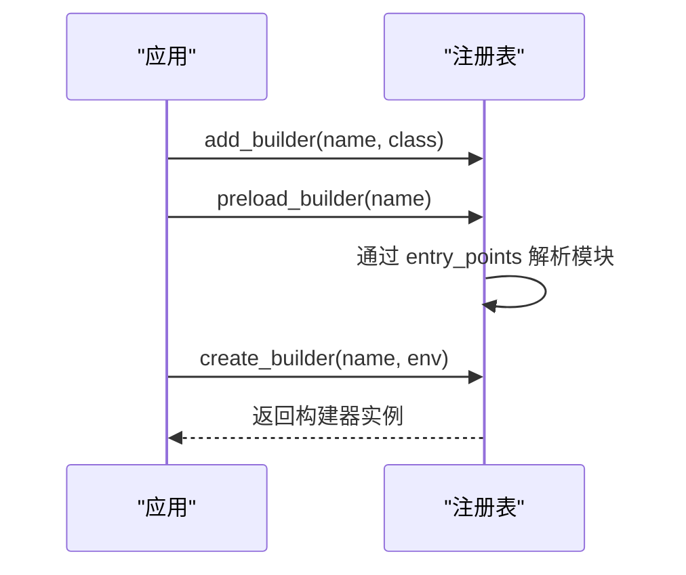
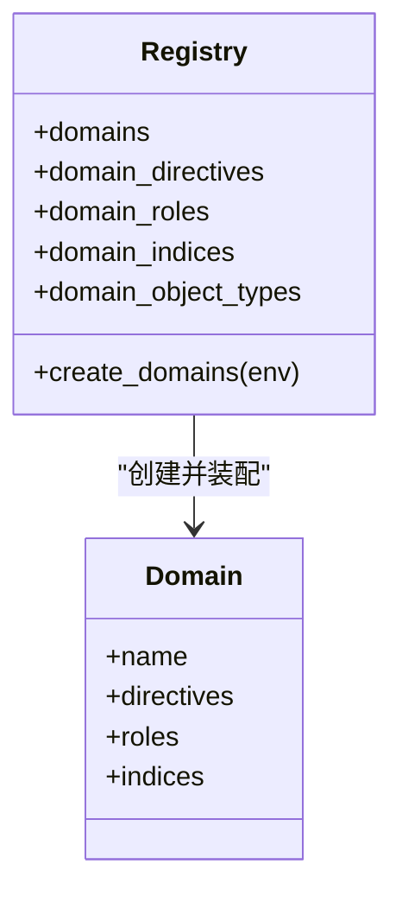
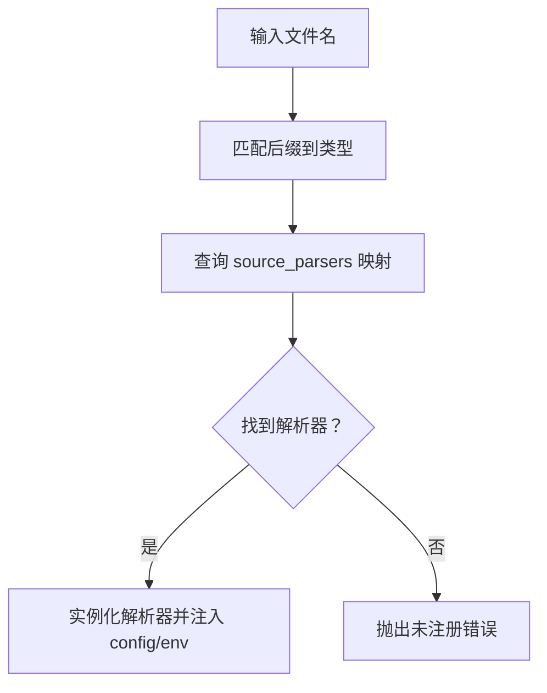
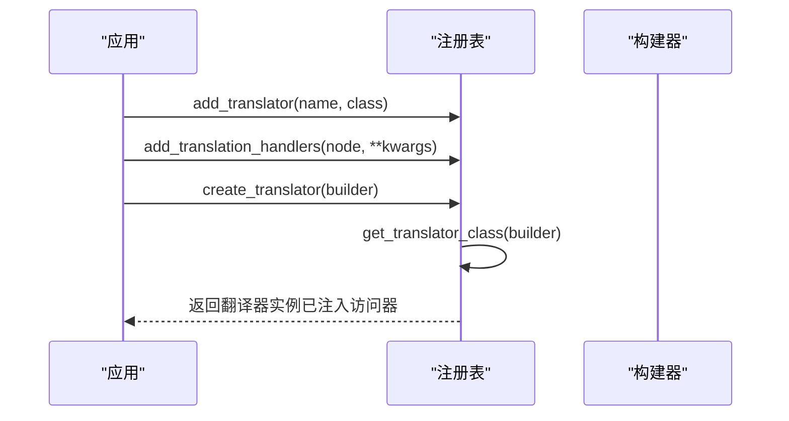
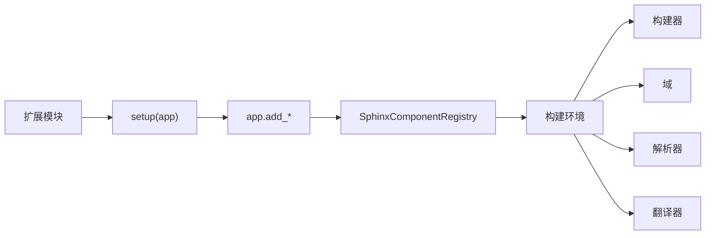

# 组件注册 API

<cite>
**本文引用的文件**
- [sphinx/registry.py](file://sphinx/registry.py)
- [sphinx/application.py](file://sphinx/application.py)
- [doc/development/tutorials/examples/recipe.py](file://doc/development/tutorials/examples/recipe.py)
- [sphinx/domains/std/__init__.py](file://sphinx/domains/std/__init__.py)
- [sphinx/parsers/__init__.py](file://sphinx/parsers/__init__.py)
- [sphinx/builders/html/__init__.py](file://sphinx/builders/html/__init__.py)
- [sphinx/writers/html.py](file://sphinx/writers/html.py)
- [sphinx/extension.py](file://sphinx/extension.py)
- [sphinx/errors.py](file://sphinx/errors.py)
</cite>

## 目录
1. [简介](#简介)
2. [项目结构](#项目结构)
3. [核心组件](#核心组件)
4. [架构总览](#架构总览)
5. [详细组件分析](#详细组件分析)
6. [依赖分析](#依赖分析)
7. [性能考虑](#性能考虑)
8. [故障排查指南](#故障排查指南)
9. [结论](#结论)
10. [附录：完整示例与最佳实践](#附录完整示例与最佳实践)

## 简介
本文件系统性阐述 Sphinx 组件注册 API，聚焦于 SphinxComponentRegistry 类的职责、组件管理机制与生命周期。内容涵盖扩展注册、构建器注册、域注册、源解析器与后处理注册、翻译器与节点处理、数学渲染器、主题与静态资源等能力；并给出组件查找与加载流程、依赖关系与加载顺序、自定义组件开发接口规范、以及在应用启动过程中的作用与最佳实践。

## 项目结构
围绕组件注册的核心代码位于 sphinx/registry.py，应用层通过 sphinx/application.py 提供统一入口方法（如 add_builder、add_domain、add_node 等）委托给注册表完成注册；具体内置组件（如标准域、HTML 构建器、解析器等）在各自模块中通过 app.add_* 进行注册。

图表来源
- [sphinx/application.py](file://sphinx/application.py)
- [sphinx/registry.py](file://sphinx/registry.py)

章节来源
- [sphinx/application.py](file://sphinx/application.py)
- [sphinx/registry.py](file://sphinx/registry.py)

## 核心组件
- SphinxComponentRegistry：集中管理所有可扩展组件的注册与查找，包括构建器、域、指令/角色/索引、源解析器、转换、翻译器、节点枚举、数学渲染器、主题与静态资源等。
- Sphinx 应用类：提供高层 API（如 add_builder、add_domain、add_node、add_transform 等），内部调用注册表完成注册或创建实例。
- 扩展模块：每个扩展以模块形式存在，提供 setup(app) 函数，通过 app 调用注册 API 完成组件注册。

章节来源
- [sphinx/registry.py](file://sphinx/registry.py)
- [sphinx/application.py](file://sphinx/application.py)

## 架构总览
下图展示了从应用初始化到组件注册与使用的整体流程，强调注册表在组件生命周期中的核心地位。

图表来源
- [sphinx/application.py](file://sphinx/application.py)
- [sphinx/registry.py](file://sphinx/registry.py)

## 详细组件分析

### SphinxComponentRegistry 类
- 职责：集中维护各类组件映射与列表，提供注册、查找、创建与合并配置的能力。
- 关键数据结构：
  - builders：名称到构建器类的映射
  - domains：名称到域类的映射
  - domain_directives/roles/indices/object_types：按域组织的附加组件
  - source_parsers/source_suffix：文件类型到解析器/后缀映射
  - transforms/post_transforms：转换列表
  - translators/translation_handlers：翻译器与节点访问器
  - enumerable_nodes：可编号节点
  - html_inline_math_renderers/html_block_math_renderers：HTML 数学渲染器
  - html_themes/js_files/css_files/static_dirs/latex_packages：主题与静态资源
- 关键方法族：
  - 扩展注册：load_extension
  - 构建器注册：add_builder、preload_builder、create_builder
  - 域注册：add_domain、has_domain、create_domains、add_*_to_domain
  - 源解析器注册：add_source_suffix、add_source_parser、get_source_parser、create_source_parser
  - 转换注册：add_transform、get_transforms、add_post_transform、get_post_transforms
  - 翻译器与节点：add_translator、get_translator_class、create_translator、add_translation_handlers、add_node（委托）
  - 可编号节点：add_enumerable_node
  - 数学渲染器：add_html_math_renderer
  - 主题与静态资源：add_html_theme、add_js_file、add_css_files、add_static_dir、add_latex_package
  - 配置合并：merge_source_suffix（由注册表扩展触发）

章节来源
- [sphinx/registry.py](file://sphinx/registry.py)

### 扩展注册流程
- 入口：Sphinx.setup_extension 调用注册表 load_extension
- 步骤：
  1) 检查黑名单与重复加载
  2) 导入模块并获取 setup
  3) 调用 setup(app) 获取元数据
  4) 将扩展信息存入 app.extensions
- 错误处理：导入失败、setup 返回值不合法、版本要求不满足时抛出异常

图表来源
- [sphinx/registry.py](file://sphinx/registry.py)

章节来源
- [sphinx/registry.py](file://sphinx/registry.py)

### 构建器注册与创建
- 注册：add_builder 支持覆盖策略
- 预加载：preload_builder 通过 entry_points 解析并按需加载模块
- 实例化：create_builder 根据名称创建构建器实例

图表来源
- [sphinx/registry.py](file://sphinx/registry.py)

章节来源
- [sphinx/registry.py](file://sphinx/registry.py)

### 域注册与组件装配
- 注册域：add_domain
- 查询域：has_domain
- 创建域：create_domains 会将扩展注入的指令、角色、索引、对象类型装配到域实例
- 向域添加组件：add_directive_to_domain、add_role_to_domain、add_index_to_domain、add_object_type、add_crossref_type

图表来源
- [sphinx/registry.py](file://sphinx/registry.py)

章节来源
- [sphinx/registry.py](file://sphinx/registry.py)

### 源解析器注册与选择
- 注册后缀：add_source_suffix
- 注册解析器：add_source_parser（基于解析器支持的文件类型）
- 选择解析器：get_source_parser（根据文件类型）
- 创建解析器：create_source_parser（注入配置与环境）

图表来源
- [sphinx/registry.py](file://sphinx/registry.py)

章节来源
- [sphinx/registry.py](file://sphinx/registry.py)

### 翻译器与节点处理
- 注册翻译器：add_translator
- 获取翻译器类：get_translator_class（优先注册表，其次构建器默认）
- 创建翻译器：create_translator 并将自定义节点访问器注入实例
- 注册节点访问器：add_translation_handlers（按构建器名分组）

图表来源
- [sphinx/registry.py](file://sphinx/registry.py)

章节来源
- [sphinx/registry.py](file://sphinx/registry.py)

### 转换与后处理
- 注册转换：add_transform/get_transforms
- 注册后处理：add_post_transform/get_post_transforms
- 优先级与阶段：应用层对转换优先级有明确范围说明

章节来源
- [sphinx/application.py](file://sphinx/application.py)
- [sphinx/registry.py](file://sphinx/registry.py)

### 自定义组件开发接口规范
- 扩展模块必须提供 setup(app) 函数，返回扩展元数据字典或 None
- 可通过 app.add_* 方法注册组件（构建器、域、指令/角色/索引、解析器、转换、翻译器、节点、数学渲染器、主题与静态资源等）
- 域开发要点：实现 Domain 基类，设置 name/label/roles/directives/indices 等；必要时使用 add_object_type/add_crossref_type 快速生成指令与角色
- 指令/角色/索引开发：遵循 docutils 接口，通过 app.add_* 注册到标准域或其他域
- 翻译器与节点：实现 NodeVisitor 子类并通过 add_translator 注册；自定义节点通过 add_node 注册并提供各构建器的访问器

章节来源
- [doc/development/tutorials/examples/recipe.py](file://doc/development/tutorials/examples/recipe.py)
- [sphinx/application.py](file://sphinx/application.py)

## 依赖分析
- 内置组件注册：大量内置扩展在初始化时通过 app.add_* 完成注册（如内置构建器、域、解析器、转换等）
- 注册表依赖：依赖扩展模块的 setup 返回值进行元数据合并；依赖导入机制加载扩展模块
- 组件间耦合：域依赖标准对象类型与索引；构建器依赖翻译器与解析器；解析器依赖源后缀映射

图表来源
- [sphinx/registry.py](file://sphinx/registry.py)
- [sphinx/application.py](file://sphinx/application.py)

章节来源
- [sphinx/registry.py](file://sphinx/registry.py)
- [sphinx/application.py](file://sphinx/application.py)

## 性能考虑
- 注册表采用字典与列表存储组件，查找与插入为平均 O(1)/O(n)，开销可忽略
- 预加载构建器通过 entry_points 按需加载，避免一次性导入全部扩展
- 源解析器映射按文件类型直接查询，时间复杂度低
- 转换与后处理列表在构建前统一排序，避免运行时重复计算

## 故障排查指南
- 扩展导入失败：检查模块路径与依赖；查看日志中的原始异常堆栈
- 版本要求不满足：确认扩展所需最低 Sphinx 版本与当前版本匹配
- 组件重复注册：检查 override 参数或避免重复调用注册方法
- 未注册的构建器/域/解析器：确认扩展已正确加载且注册顺序正确
- 翻译器缺失：确保已注册翻译器或构建器提供默认翻译器

章节来源
- [sphinx/registry.py](file://sphinx/registry.py)
- [sphinx/errors.py](file://sphinx/errors.py)

## 结论
SphinxComponentRegistry 是扩展生态的核心枢纽，通过统一的注册、查找与创建机制，支撑了构建器、域、解析器、转换、翻译器与静态资源等多类组件的灵活扩展。应用层通过高层 API 将这些能力暴露给扩展作者，形成清晰的生命周期与依赖关系。遵循本文接口规范与最佳实践，可高效实现自定义组件并融入 Sphinx 生态。

## 附录：完整示例与最佳实践

### 示例：自定义域与对象类型注册
- 参考示例：recipe 域与索引、对象类型注册
- 关键步骤：
  - 定义 Domain 子类，设置 name/label/roles/directives/indices
  - 在 setup 中调用 app.add_domain 注册域
  - 使用 app.add_object_type 或 app.add_crossref_type 快速生成指令与角色
  - 如需索引，实现 Index 子类并通过 app.add_index_to_domain 注册

章节来源
- [doc/development/tutorials/examples/recipe.py](file://doc/development/tutorials/examples/recipe.py)
- [sphinx/application.py](file://sphinx/application.py)

### 示例：注册自定义构建器
- 在扩展的 setup 中调用 app.add_builder 注册构建器类
- 确保构建器类具有 name 属性
- 如需预加载，可在构建前调用 app.preload_builder

章节来源
- [sphinx/application.py](file://sphinx/application.py)
- [sphinx/registry.py](file://sphinx/registry.py)

### 示例：注册源解析器与后缀
- 使用 app.add_source_suffix 注册新后缀到文件类型映射
- 使用 app.add_source_parser 注册解析器类（解析器需声明 supported 列表）
- 在构建过程中自动选择解析器

章节来源
- [sphinx/application.py](file://sphinx/application.py)
- [sphinx/registry.py](file://sphinx/registry.py)

### 示例：注册翻译器与节点访问器
- 使用 app.set_translator 或 app.add_translator 注册翻译器
- 使用 app.add_node 注册自定义节点，并提供各构建器的访问器元组
- 在 create_translator 时，注册表会将访问器注入翻译器实例

章节来源
- [sphinx/application.py](file://sphinx/application.py)
- [sphinx/registry.py](file://sphinx/registry.py)

### 示例：注册主题与静态资源
- 使用 app.add_html_theme 注册主题
- 使用 app.add_css_files/app.add_js_file 注册样式与脚本
- 使用 app.add_static_dir 注册静态目录

章节来源
- [sphinx/application.py](file://sphinx/application.py)
- [sphinx/registry.py](file://sphinx/registry.py)

### 示例：注册数学渲染器
- 使用 app.add_html_math_renderer 注册内联与块级数学渲染器
- 渲染器名称需唯一，避免重复注册

章节来源
- [sphinx/application.py](file://sphinx/application.py)
- [sphinx/registry.py](file://sphinx/registry.py)

### 示例：注册转换与后处理
- 使用 app.add_transform/app.get_transforms 注册与获取转换
- 使用 app.add_post_transform/app.get_post_transforms 注册与获取后处理

章节来源
- [sphinx/application.py](file://sphinx/application.py)
- [sphinx/registry.py](file://sphinx/registry.py)

### 最佳实践
- 明确组件命名与覆盖策略：合理使用 override 参数，避免冲突
- 保持扩展模块最小化：仅在 setup 中执行必要的注册
- 严格版本要求：在扩展中声明最低 Sphinx 版本，防止不兼容
- 优先使用高层 API：通过 app.add_* 完成注册，减少直接操作注册表
- 分离职责：域、指令、角色、索引、解析器、转换等按功能拆分，便于维护
- 文档与测试：为自定义组件编写文档与测试，确保可维护性