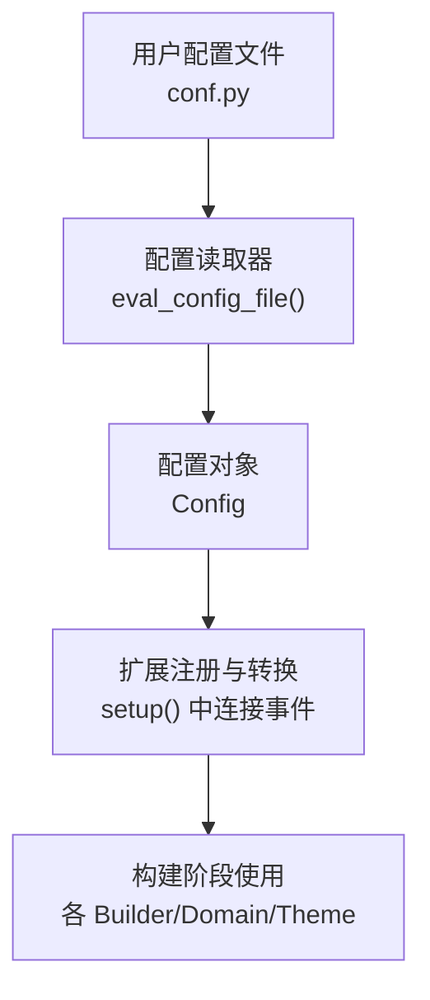
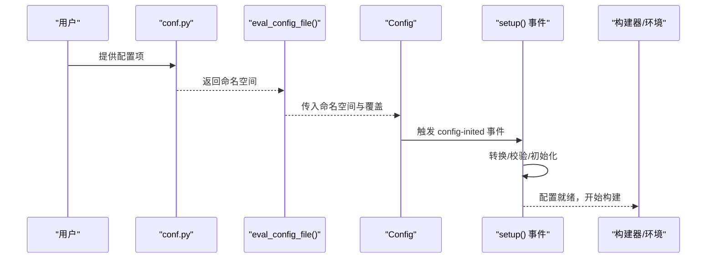
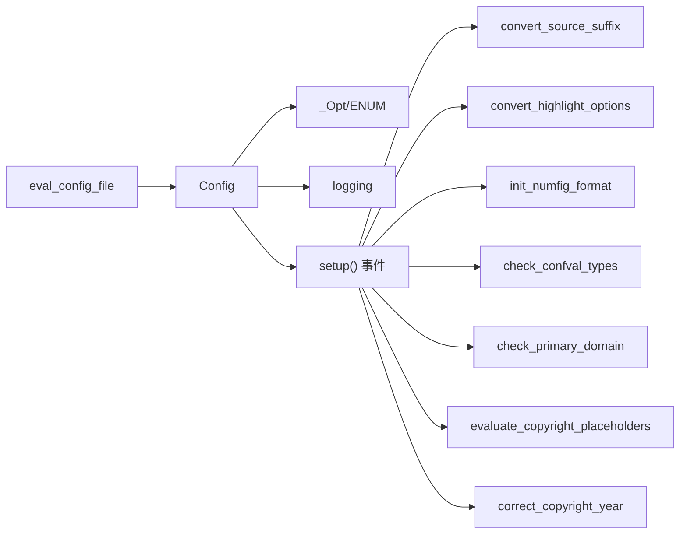

# 配置系统 API

<cite>
**本文引用的文件**
- [sphinx/config.py](file://sphinx/config.py)
- [doc/usage/configuration.rst](file://doc/usage/configuration.rst)
- [tests/test_config/test_config.py](file://tests/test_config/test_config.py)
- [tests/test_environment/test_environment.py](file://tests/test_environment/test_environment.py)
</cite>

## 目录
1. [简介](#简介)
2. [项目结构](#项目结构)
3. [核心组件](#核心组件)
4. [架构总览](#架构总览)
5. [详细组件分析](#详细组件分析)
6. [依赖分析](#依赖分析)
7. [性能考虑](#性能考虑)
8. [故障排查指南](#故障排查指南)
9. [结论](#结论)
10. [附录](#附录)

## 简介
本文件为 Sphinx 配置系统 API 的权威参考文档，围绕 Config 类与其配套工具函数，系统阐述以下主题：
- 构造方法与初始化流程
- 配置读取机制（conf.py 执行、覆盖参数解析）
- 配置项类型、默认值与校验规则
- 配置合并策略与优先级顺序
- 配置文件结构与语法要点
- 动态配置修改与注意事项
- 配置验证与错误处理机制
- 完整配置项参考表
- 实际配置示例与最佳实践
- 配置在不同构建阶段的作用与影响

## 项目结构
与配置系统直接相关的代码与文档主要分布在如下位置：
- 核心实现：sphinx/config.py
- 用户文档：doc/usage/configuration.rst
- 单元测试：tests/test_config/test_config.py、tests/test_environment/test_environment.py

图表来源
- [sphinx/config.py:585-613](file://sphinx/config.py#L585-L613)
- [sphinx/config.py:565-582](file://sphinx/config.py#L565-L582)
- [sphinx/config.py:899-915](file://sphinx/config.py#L899-L915)

章节来源
- [sphinx/config.py:196-582](file://sphinx/config.py#L196-L582)
- [doc/usage/configuration.rst:23-72](file://doc/usage/configuration.rst#L23-L72)

## 核心组件
- Config 类：封装所有配置项，提供属性访问、覆盖解析、序列化支持与重建标记。
- _Opt：描述单个配置项的默认值、重建需求、有效类型集合或枚举约束。
- ENUM：用于限定配置项候选值集合。
- 配置读取器：从 conf.py 评估命名空间，兼容历史语言设置与异常处理。
- 配置转换器：在配置初始化阶段对旧式配置进行迁移（如 source_suffix、highlight_options）。
- 配置校验器：在配置初始化后检查类型一致性并发出警告。

章节来源
- [sphinx/config.py:44-194](file://sphinx/config.py#L44-L194)
- [sphinx/config.py:196-582](file://sphinx/config.py#L196-L582)
- [sphinx/config.py:636-775](file://sphinx/config.py#L636-L775)
- [sphinx/config.py:777-852](file://sphinx/config.py#L777-L852)

## 架构总览
下图展示配置系统在构建生命周期中的关键交互：

图表来源
- [sphinx/config.py:585-613](file://sphinx/config.py#L585-L613)
- [sphinx/config.py:565-582](file://sphinx/config.py#L565-L582)
- [sphinx/config.py:899-915](file://sphinx/config.py#L899-L915)

## 详细组件分析

### Config 类与构造方法
- 构造签名与职责
  - 接收原始配置字典与覆盖字典；内部复制默认配置项模板，解析覆盖键名（支持“分组.键”形式），提取 setup/扩展列表等。
  - 提供 values、overrides、verbosity 属性；支持序列化与反序列化。
- 关键行为
  - 属性访问时按“覆盖 → 原始配置 → 默认值”的顺序解析；对布尔/整数/列表等类型进行字符串到类型的转换。
  - 支持别名同步（如 master_doc 与 root_doc、copyright 与 project_copyright）。
  - 过滤与迭代：filter/rebuild 字段决定哪些配置影响特定阶段重建。

章节来源
- [sphinx/config.py:299-489](file://sphinx/config.py#L299-L489)
- [sphinx/config.py:434-477](file://sphinx/config.py#L434-L477)

### 配置读取机制
- 读取入口
  - Config.read：要求 conf.py 存在，否则抛出配置错误；内部调用 _read_conf_py。
- 执行 conf.py
  - eval_config_file：切换到配置目录执行 conf.py，捕获语法/系统退出/其他异常并包装为配置错误。
- 兼容性处理
  - 若 language 为 None，自动回退为 'en' 并记录警告。

章节来源
- [sphinx/config.py:338-353](file://sphinx/config.py#L338-L353)
- [sphinx/config.py:565-582](file://sphinx/config.py#L565-L582)
- [sphinx/config.py:585-613](file://sphinx/config.py#L585-L613)
- [sphinx/config.py:573-581](file://sphinx/config.py#L573-L581)

### 配置项类型、默认值与校验规则
- 类型系统
  - 默认值可为任意可哈希对象、可调用对象（延迟求值）、None 或复杂容器。
  - 有效类型通过 frozenset[type] 或 ENUM 指定；特殊 Any 表示接受任意类型。
- 校验规则
  - check_confval_types：比较当前值与默认值类型，若不匹配则生成警告；对序列/元组/集合等做兼容转换；对枚举类型进行成员校验。
  - ENUM：提供 match 方法判断值是否属于候选集合。

章节来源
- [sphinx/config.py:777-852](file://sphinx/config.py#L777-L852)
- [sphinx/config.py:75-94](file://sphinx/config.py#L75-L94)

### 配置合并策略与优先级顺序
- 优先级（从高到低）
  1) 命令行覆盖（overrides）：字符串值会尝试转换为期望类型，失败则记录警告并忽略。
  2) conf.py 命名空间：直接赋值到配置对象。
  3) 默认值：来自内置模板 config_values。
- 特殊处理
  - 分组覆盖键名（如 “group.key”）会被拆分为嵌套字典再注入。
  - extensions 支持逗号分隔字符串转列表。
  - 未识别的覆盖键会记录未知配置警告。

章节来源
- [sphinx/config.py:309-322](file://sphinx/config.py#L309-L322)
- [sphinx/config.py:446-471](file://sphinx/config.py#L446-L471)
- [sphinx/config.py:354-400](file://sphinx/config.py#L354-L400)
- [sphinx/config.py:417-423](file://sphinx/config.py#L417-L423)

### 配置文件结构与语法
- 结构要求
  - 必须存在 conf.py；文件内容为 Python 代码，构建时在配置目录上下文中执行。
  - 可选 docutils.conf 用于 Docutils 配置（若未被 Sphinx 显式覆盖）。
- 重要约定
  - 仅简单类型（字符串、数字、列表/字典的简单值）适合放入配置命名空间；模块对象会被自动剔除；含不可pickle对象的配置将被警告且可能影响缓存。
  - 支持 tags 对象以条件化配置。
- 语法要点
  - 使用字符串、数字、列表、字典等简单数据结构；避免函数、类、模块等不可pickle对象。
  - 可通过 setup 函数将 conf.py 作为扩展使用。

章节来源
- [doc/usage/configuration.rst:23-72](file://doc/usage/configuration.rst#L23-L72)
- [doc/usage/configuration.rst:79-91](file://doc/usage/configuration.rst#L79-L91)

### 动态配置修改与注意事项
- 动态修改方式
  - 通过属性或字典式接口设置配置项；别名会同步更新。
  - 可通过命令行覆盖键名（如 “group.key=value”）实现细粒度覆盖。
- 注意事项
  - 不同配置项对重建的影响不同（由 rebuild 标记决定）；修改后需关注对应构建阶段的增量更新。
  - 对于不可pickle对象，将触发缓存相关警告；建议避免在配置中放置函数、类、模块等。
  - 某些配置项（如 language=None）有兼容性回退逻辑，应显式设置为合法语言码。

章节来源
- [sphinx/config.py:434-444](file://sphinx/config.py#L434-L444)
- [sphinx/config.py:309-322](file://sphinx/config.py#L309-L322)
- [sphinx/config.py:518-553](file://sphinx/config.py#L518-L553)
- [sphinx/config.py:573-581](file://sphinx/config.py#L573-L581)

### 配置验证与错误处理机制
- 读取期错误
  - 语法错误、调用 sys.exit()、其他异常均包装为配置错误并抛出。
- 初始化期校验
  - 类型不匹配警告、枚举值不在候选集合警告、序列/元组/集合兼容转换提示。
- 缓存与序列化
  - 不可pickle对象将被跳过并记录缓存相关警告；pickle 时会过滤掉以“_”开头的私有属性及不可pickle值。

章节来源
- [sphinx/config.py:597-611](file://sphinx/config.py#L597-L611)
- [sphinx/config.py:777-852](file://sphinx/config.py#L777-L852)
- [sphinx/config.py:518-553](file://sphinx/config.py#L518-L553)

### 配置项参考表（节选）
以下为常用配置项的用途与默认值概览（详见用户文档获取完整条目与版本说明）：
- 项目与版权
  - project、author、project_copyright/copyright、version、release、today、today_fmt
- 国际化与本地化
  - language、locale_dirs、gettext_allow_fuzzy_translations、translation_progress_classes、figure_language_filename
- 源文件与文档树
  - master_doc/root_doc、source_suffix、source_encoding、exclude_patterns、include_patterns、default_role
- 高亮与代码
  - highlight_language、highlight_options、pygments_style
- 数学与编号
  - math_number_all、math_eqref_format、math_numfig、math_numsep、numfig、numfig_format、numfig_secnum_depth
- HTTP 请求
  - tls_verify、tls_cacerts、user_agent
- 智能引号
  - smartquotes、smartquotes_action、smartquotes_excludes
- 警告控制
  - keep_warnings、suppress_warnings、show_warning_types
- 扩展与版本要求
  - extensions、needs_sphinx、needs_extensions、manpages_url
- 主题与模板
  - templates_path、template_bridge、html_theme、html_theme_options、html_static_path、html_extra_path 等

章节来源
- [doc/usage/configuration.rst:95-200](file://doc/usage/configuration.rst#L95-L200)
- [doc/usage/configuration.rst:482-760](file://doc/usage/configuration.rst#L482-L760)
- [doc/usage/configuration.rst:1200-1600](file://doc/usage/configuration.rst#L1200-L1600)
- [doc/usage/configuration.rst:1600-2000](file://doc/usage/configuration.rst#L1600-L2000)
- [doc/usage/configuration.rst:2000-2400](file://doc/usage/configuration.rst#L2000-L2400)

### 实际配置示例与最佳实践
- 示例路径
  - 项目信息与版权示例：[doc/usage/configuration.rst:102-149](file://doc/usage/configuration.rst#L102-L149)
  - 扩展与版本要求示例：[doc/usage/configuration.rst:211-238](file://doc/usage/configuration.rst#L211-L238)
  - 智能引号与排除规则示例：[doc/usage/configuration.rst:1276-1282](file://doc/usage/configuration.rst#L1276-L1282)
  - 模板与静态资源示例：[doc/usage/configuration.rst:1668-1703](file://doc/usage/configuration.rst#L1668-L1703)
- 最佳实践
  - 将复杂配置迁移到新式格式（如 source_suffix 为字典、highlight_options 为多语言映射）。
  - 使用 ENUM 限定可选值集合，避免拼写错误。
  - 保持 conf.py 仅包含简单可pickle对象，必要时在 setup 中动态装配。
  - 在 CI 中启用 nitpicky 模式以尽早发现无效引用。

章节来源
- [doc/usage/configuration.rst:102-149](file://doc/usage/configuration.rst#L102-L149)
- [doc/usage/configuration.rst:211-238](file://doc/usage/configuration.rst#L211-L238)
- [doc/usage/configuration.rst:1276-1282](file://doc/usage/configuration.rst#L1276-L1282)
- [doc/usage/configuration.rst:1668-1703](file://doc/usage/configuration.rst#L1668-L1703)

### 配置在不同构建阶段的作用与影响
- 初始化阶段
  - setup() 连接多项事件：源文件后缀转换、高亮选项迁移、编号格式初始化、版权占位符替换与年份修正、类型校验、主文档检查、源编码弃用提示等。
- 构建阶段
  - 各构建器（HTML/LaTeX/Manpage 等）根据配置项渲染输出；模板与静态资源路径、主题选项、国际化目录等直接影响最终产物。
- 增量构建
  - rebuild 标记决定某配置变更是否触发特定阶段的重建（如 env/html/gettext/applehelp/devhelp 等）。

章节来源
- [sphinx/config.py:899-915](file://sphinx/config.py#L899-L915)
- [sphinx/config.py:636-667](file://sphinx/config.py#L636-L667)
- [sphinx/config.py:670-680](file://sphinx/config.py#L670-L680)
- [sphinx/config.py:682-693](file://sphinx/config.py#L682-L693)
- [sphinx/config.py:696-709](file://sphinx/config.py#L696-L709)
- [sphinx/config.py:711-740](file://sphinx/config.py#L711-L740)
- [sphinx/config.py:861-883](file://sphinx/config.py#L861-L883)
- [sphinx/config.py:886-897](file://sphinx/config.py#L886-L897)

## 依赖分析
- 组件耦合
  - Config 依赖 _Opt/ENUM 描述类型与候选值；依赖日志模块输出警告；依赖应用事件系统在初始化阶段执行转换与校验。
  - 配置读取器依赖当前目录切换与异常包装。
- 外部依赖
  - requests 库用于 TLS 验证与证书配置（当设置 tls_cacerts/tls_verify）。
  - docutils 与智能引号（smartquotes）在特定构建器上生效。

图表来源
- [sphinx/config.py:899-915](file://sphinx/config.py#L899-L915)
- [sphinx/config.py:636-775](file://sphinx/config.py#L636-L775)

章节来源
- [sphinx/config.py:899-915](file://sphinx/config.py#L899-L915)

## 性能考虑
- 配置序列化与缓存
  - 避免在配置中放置不可pickle对象，减少缓存失效与重建开销。
- 类型校验与警告
  - 类型不匹配会触发警告，建议在开发阶段开启 nitpicky 模式以提前发现潜在问题。
- 源编码
  - 非 UTF-8 源编码已弃用，建议统一使用 UTF-8 以提升跨平台一致性与性能。

## 故障排查指南
- 常见问题与定位
  - conf.py 不存在：Config.read 抛出配置错误。
  - 语法错误/系统退出/异常：eval_config_file 包装为配置错误。
  - 未知覆盖键：记录未知配置警告。
  - 类型不匹配：check_confval_types 输出警告，建议核对默认类型与实际值。
  - 不可pickle对象：pickle 时跳过并记录缓存相关警告。
- 相关测试参考
  - 配置读取与覆盖行为：[tests/test_config/test_config.py:98-148](file://tests/test_config/test_config.py#L98-L148)
  - 配置差异检测：[tests/test_environment/test_environment.py:208-233](file://tests/test_environment/test_environment.py#L208-L233)
  - 类型校验与枚举校验：[tests/test_config/test_config.py:454-539](file://tests/test_config/test_config.py#L454-L539)

章节来源
- [sphinx/config.py:338-353](file://sphinx/config.py#L338-L353)
- [sphinx/config.py:585-613](file://sphinx/config.py#L585-L613)
- [sphinx/config.py:417-423](file://sphinx/config.py#L417-L423)
- [sphinx/config.py:777-852](file://sphinx/config.py#L777-L852)
- [sphinx/config.py:518-553](file://sphinx/config.py#L518-L553)
- [tests/test_config/test_config.py:98-148](file://tests/test_config/test_config.py#L98-L148)
- [tests/test_environment/test_environment.py:208-233](file://tests/test_environment/test_environment.py#L208-L233)
- [tests/test_config/test_config.py:454-539](file://tests/test_config/test_config.py#L454-L539)

## 结论
Sphinx 配置系统通过 Config 类与事件驱动的初始化流程，提供了灵活、可扩展且具备强健校验能力的配置管理机制。遵循本文档的优先级策略、类型规范与最佳实践，可在保证构建质量的同时获得更高效的增量构建体验。

## 附录
- 配置项完整参考请参阅用户文档对应章节，涵盖各配置项的类型、默认值、版本变更与使用示例。
- 如需进一步了解各构建器如何消费配置，请参考相应构建器文档与主题配置说明。