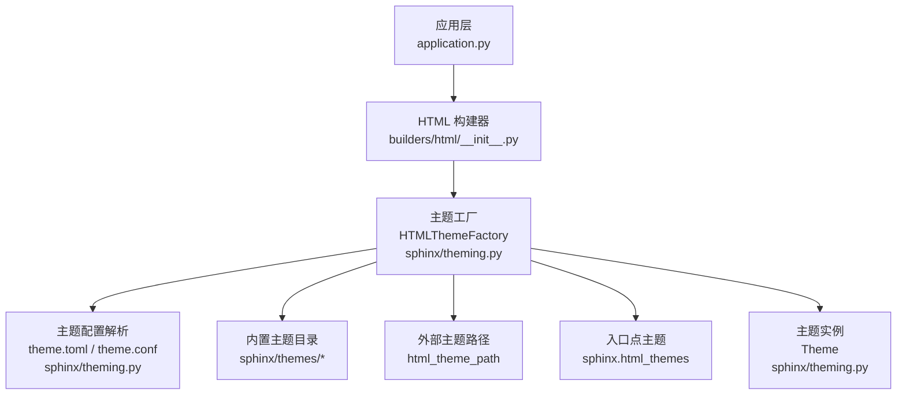
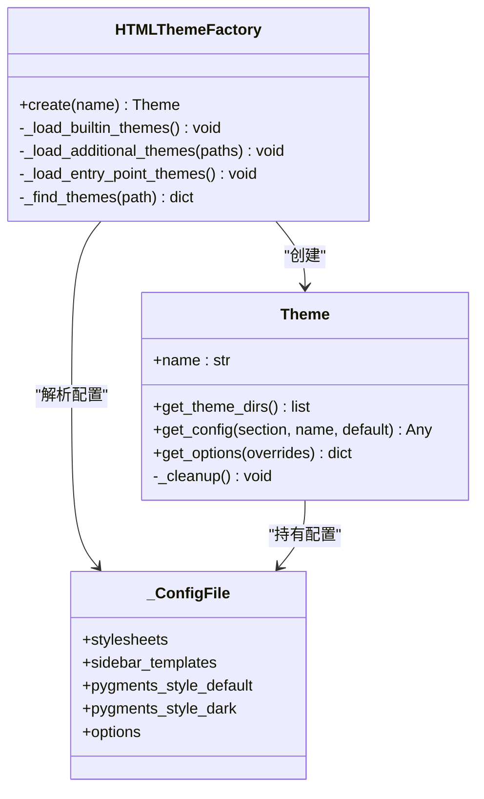
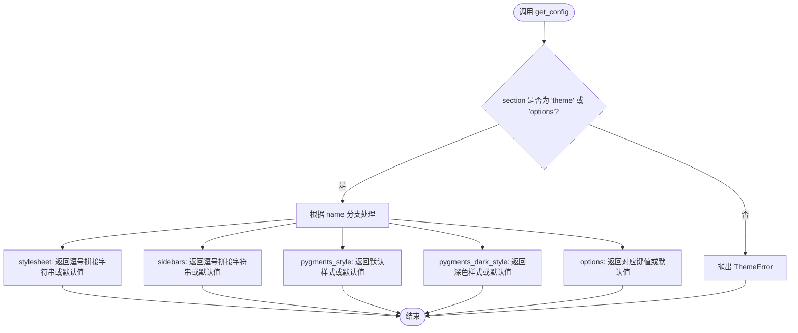
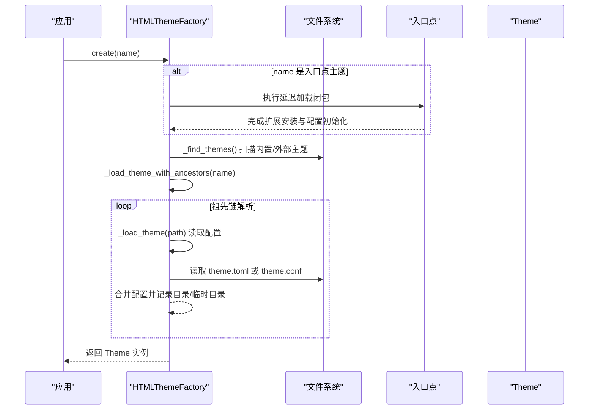
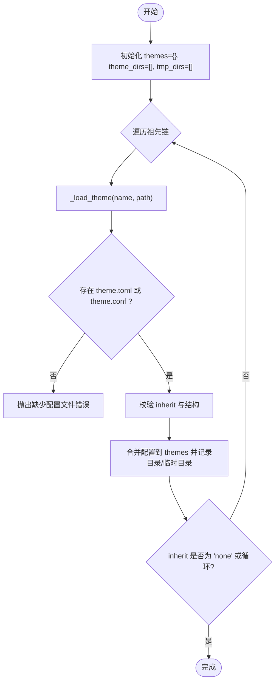
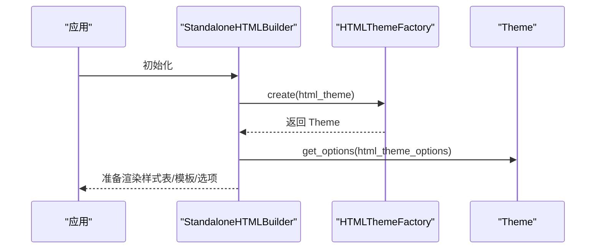
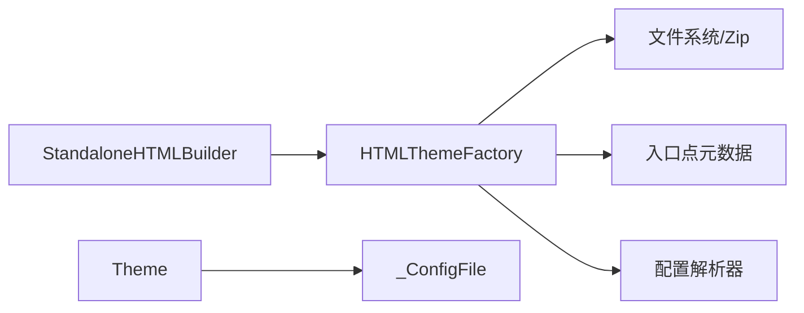

# 主题架构设计

<cite>
**本文引用的文件**
- [sphinx/theming.py](file://sphinx/theming.py)
- [sphinx/themes/basic/theme.toml](file://sphinx/themes/basic/theme.toml)
- [sphinx/themes/classic/theme.toml](file://sphinx/themes/classic/theme.toml)
- [sphinx/themes/default/theme.toml](file://sphinx/themes/default/theme.toml)
- [sphinx/themes/agogo/theme.toml](file://sphinx/themes/agogo/theme.toml)
- [sphinx/themes/scrolls/theme.toml](file://sphinx/themes/scrolls/theme.toml)
- [tests/test_theming/test_theming.py](file://tests/test_theming/test_theming.py)
- [tests/test_theming/theme.toml](file://tests/test_theming/theme.toml)
- [tests/test_theming/theme.conf](file://tests/test_theming/theme.conf)
- [sphinx/builders/html/__init__.py](file://sphinx/builders/html/__init__.py)
- [sphinx/application.py](file://sphinx/application.py)
</cite>

## 目录
1. [引言](#引言)
2. [项目结构](#项目结构)
3. [核心组件](#核心组件)
4. [架构总览](#架构总览)
5. [详细组件分析](#详细组件分析)
6. [依赖分析](#依赖分析)
7. [性能考虑](#性能考虑)
8. [故障排查指南](#故障排查指南)
9. [结论](#结论)
10. [附录](#附录)

## 引言
本文件系统性阐述 Sphinx 的主题架构设计与实现，重点覆盖以下方面：
- 主题系统的核心理念：以“主题配置 + 模板与静态资源”为核心，通过可组合的主题继承链实现配置与外观的分层管理。
- Theme 类的设计原则：统一抽象主题目录与归档主题，提供配置查询与选项合并能力。
- HTMLThemeFactory 工厂模式：负责内置主题发现、外部主题路径扫描、入口点主题加载与延迟加载。
- 主题配置文件格式：theme.toml（推荐）与 theme.conf（兼容）的结构、字段与迁移工具。
- 主题继承机制：祖先链解析、循环继承检测、合并策略与错误处理。
- 主题目录结构规范与文件组织方式。
- 主题加载流程：从应用初始化到构建器使用主题的完整链路。
- 配置验证规则与错误处理机制。
- 扩展点与自定义机制：如何编写自定义主题、如何通过入口点扩展主题生态。

## 项目结构
围绕主题相关的关键位置如下：
- 核心实现：sphinx/theming.py 提供 Theme 类、HTMLThemeFactory 以及主题配置解析与加载逻辑。
- 内置主题样例：sphinx/themes/* 下包含多个主题的 theme.toml 示例，展示继承与配置写法。
- 构建器集成：sphinx/builders/html/__init__.py 在 HTML 构建过程中使用主题工厂创建主题实例。
- 应用层注册：sphinx/application.py 中内置扩展列表包含主题相关扩展，便于默认主题加载。
- 测试与示例：tests/test_theming/* 包含主题 API、配置转换、继承与打包主题等测试用例与示例配置。

图表来源
- [sphinx/application.py:136-141](file://sphinx/application.py#L136-L141)
- [sphinx/builders/html/__init__.py:43](file://sphinx/builders/html/__init__.py#L43)
- [sphinx/theming.py:152-266](file://sphinx/theming.py#L152-L266)

章节来源
- [sphinx/application.py:136-141](file://sphinx/application.py#L136-L141)
- [sphinx/builders/html/__init__.py:43](file://sphinx/builders/html/__init__.py#L43)
- [sphinx/theming.py:152-266](file://sphinx/theming.py#L152-L266)

## 核心组件
- Theme 类：封装主题名称、主题目录链、临时目录清理、配置查询与选项合并。
- HTMLThemeFactory：负责内置主题扫描、外部主题路径扫描、入口点主题加载与延迟加载；创建 Theme 实例。
- 配置文件解析器：支持 theme.toml（推荐）与 theme.conf（兼容），并提供从 theme.conf 迁移到 theme.toml 的工具。
- 继承链解析器：解析祖先主题、检测循环继承、限制最大祖先层数，并按“后继承者优先”的策略合并配置。

章节来源
- [sphinx/theming.py:58-150](file://sphinx/theming.py#L58-L150)
- [sphinx/theming.py:152-266](file://sphinx/theming.py#L152-L266)
- [sphinx/theming.py:278-342](file://sphinx/theming.py#L278-L342)
- [sphinx/theming.py:358-451](file://sphinx/theming.py#L358-L451)

## 架构总览
主题架构采用“工厂 + 配置解析 + 继承合并”的分层设计：
- 工厂层：负责主题发现与加载，支持多种来源（内置、外部路径、入口点）。
- 解析层：读取并校验主题配置文件，生成标准化的配置对象。
- 合并层：沿祖先链收集配置，进行字段级合并与覆盖。
- 使用层：构建器在渲染阶段访问 Theme 实例，获取样式表、侧边栏模板、配色方案与主题选项。

图表来源
- [sphinx/theming.py:58-150](file://sphinx/theming.py#L58-L150)
- [sphinx/theming.py:152-266](file://sphinx/theming.py#L152-L266)
- [sphinx/theming.py:454-497](file://sphinx/theming.py#L454-L497)

## 详细组件分析

### Theme 类设计原理
- 角色定位：统一抽象主题目录与归档主题（解压至临时目录），维护主题目录链与临时目录集合。
- 配置查询：
  - theme 段：支持 stylesheet、sidebars、pygments_style、pygments_dark_style 等键的查询。
  - options 段：直接返回主题选项字典。
  - 未找到时抛出 ThemeError，或返回默认值。
- 选项合并：get_options 将主题默认选项与用户覆盖项合并，对未知选项发出警告。
- 资源清理：_cleanup 清理临时目录，避免磁盘占用。

图表来源
- [sphinx/theming.py:100-129](file://sphinx/theming.py#L100-L129)

章节来源
- [sphinx/theming.py:58-150](file://sphinx/theming.py#L58-L150)

### HTMLThemeFactory 工厂模式实现机制
- 初始化阶段：
  - 加载内置主题：扫描 sphinx/themes 目录，注册主题名与路径。
  - 外部主题路径：读取 html_theme_path，扫描指定目录中的主题。
  - 入口点主题：枚举 importlib.metadata 的 sphinx.html_themes 组，记录延迟加载闭包。
- 创建主题：
  - 若目标主题为入口点主题且尚未加载，则执行延迟加载闭包。
  - 调用内部函数 _load_theme_with_ancestors 获取祖先链、主题目录与临时目录。
  - 构造 Theme 实例并返回。

图表来源
- [sphinx/theming.py:152-266](file://sphinx/theming.py#L152-L266)
- [sphinx/theming.py:278-342](file://sphinx/theming.py#L278-L342)

章节来源
- [sphinx/theming.py:152-266](file://sphinx/theming.py#L152-L266)

### 主题配置文件格式与字段含义
- theme.toml（推荐）
  - [theme] 表：必须包含 inherit 字段；可选 stylesheets、sidebars、pygments_style。
  - [options] 表：键值对形式的主题选项。
- theme.conf（兼容）
  - [theme] 段：必须包含 inherit；可选 stylesheet、sidebars、pygments_style、pygments_dark_style。
  - [options] 段：键值对形式的主题选项。
- 迁移工具：提供将 theme.conf 转换为 theme.toml 的命令行工具，自动处理字段映射与注释。

章节来源
- [sphinx/theming.py:358-451](file://sphinx/theming.py#L358-L451)
- [tests/test_theming/theme.toml:1-11](file://tests/test_theming/theme.toml#L1-L11)
- [tests/test_theming/theme.conf:1-8](file://tests/test_theming/theme.conf#L1-L8)

### 主题继承机制与合并策略
- 祖先链解析：
  - 从当前主题开始，逐层向上查找 inherit 指向的主题，直到 inherit = "none" 或达到最大深度。
  - 检测循环继承：若祖先中出现重复主题名则报错。
  - 延迟加载：当祖先主题来自入口点且尚未加载时，先执行入口点加载。
- 合并策略：
  - stylesheets、sidebar_templates：后继承者优先覆盖。
  - pygments_style_default、pygments_style_dark：后继承者优先覆盖。
  - options：字典合并，后继承者键值覆盖前代同名键。
- 目录顺序：Theme.get_theme_dirs 返回目录列表，顺序为“当前主题 → 祖先主题 → … → 基础主题”。

图表来源
- [sphinx/theming.py:278-342](file://sphinx/theming.py#L278-L342)
- [sphinx/theming.py:318-342](file://sphinx/theming.py#L318-L342)

章节来源
- [sphinx/theming.py:278-342](file://sphinx/theming.py#L278-L342)

### 主题目录结构规范与文件组织
- 主题根目录下需包含：
  - theme.toml 或 theme.conf（二选一，推荐 theme.toml）。
  - 可选的模板文件（如 layout.html、*.html）与静态资源（CSS、JS、图片等）。
- 归档主题（zip）：
  - zip 文件内包含 theme.toml 或 theme.conf 即可被识别为有效主题。
- 外部主题路径：
  - 通过 html_theme_path 指定额外搜索路径，支持相对路径（相对于 confdir）。

章节来源
- [sphinx/theming.py:224-249](file://sphinx/theming.py#L224-L249)
- [sphinx/theming.py:318-356](file://sphinx/theming.py#L318-L356)

### 主题加载过程
- 应用初始化：内置扩展列表包含主题相关扩展，确保默认主题可用。
- 构建器初始化：StandaloneHTMLBuilder 在 init 阶段使用 HTMLThemeFactory 创建主题实例。
- 主题选择：根据配置中的 html_theme 与 html_theme_options，Theme.get_options 合并用户覆盖项。
- 渲染阶段：Theme 提供样式表、侧边栏模板、配色方案等信息，用于页面渲染与静态资源注入。

图表来源
- [sphinx/application.py:136-141](file://sphinx/application.py#L136-L141)
- [sphinx/builders/html/__init__.py:43](file://sphinx/builders/html/__init__.py#L43)
- [sphinx/theming.py:152-266](file://sphinx/theming.py#L152-L266)

章节来源
- [sphinx/application.py:136-141](file://sphinx/application.py#L136-L141)
- [sphinx/builders/html/__init__.py:43](file://sphinx/builders/html/__init__.py#L43)
- [sphinx/theming.py:152-266](file://sphinx/theming.py#L152-L266)

### 主题配置验证规则与错误处理
- 必填字段：
  - theme.toml：必须存在 [theme] 表与 inherit 键；[options] 必须为表类型。
  - theme.conf：必须存在 [theme] 段且包含 inherit。
- 结构校验：
  - pygments_style 在 theme.toml 中必须为表类型，否则提示迁移写法。
- 继承链校验：
  - 循环继承：若祖先中重复出现同一主题名则报错。
  - 祖先缺失：若祖先主题未被加载则报错。
  - 最大祖先层数：超过阈值（例如 10 层）时报错。
- 文件校验：
  - 归档主题：仅当 zip 包含 theme.toml 或 theme.conf 时视为有效主题。
  - 缺少配置文件：抛出“未找到主题配置文件”错误。

章节来源
- [sphinx/theming.py:363-422](file://sphinx/theming.py#L363-L422)
- [sphinx/theming.py:288-313](file://sphinx/theming.py#L288-L313)
- [sphinx/theming.py:268-276](file://sphinx/theming.py#L268-L276)

### 扩展点与自定义机制
- 自定义主题开发：
  - 在主题根目录提供 theme.toml（或 theme.conf），设置 inherit 与所需字段。
  - 放置模板与静态资源，确保布局与样式满足需求。
- 外部主题路径：
  - 通过 html_theme_path 添加自定义主题目录，使工厂扫描并注册。
- 入口点主题：
  - 通过 importlib.metadata 的 sphinx.html_themes 组注册主题模块，工厂支持延迟加载。
- 配置迁移：
  - 使用内置迁移工具将旧版 theme.conf 迁移到 theme.toml，保持向后兼容。

章节来源
- [sphinx/theming.py:190-222](file://sphinx/theming.py#L190-L222)
- [sphinx/theming.py:509-575](file://sphinx/theming.py#L509-L575)

## 依赖分析
- 组件耦合：
  - HTMLThemeFactory 依赖文件系统扫描、zip 解压、入口点元数据与配置解析器。
  - Theme 依赖合并后的配置对象，不直接依赖文件系统。
- 外部依赖：
  - importlib.metadata 用于入口点主题加载。
  - toml 与 configparser 用于配置文件解析。
- 潜在循环依赖：
  - 主题继承链在解析阶段进行循环检测，避免运行时循环。

图表来源
- [sphinx/theming.py:152-266](file://sphinx/theming.py#L152-L266)
- [sphinx/builders/html/__init__.py:43](file://sphinx/builders/html/__init__.py#L43)

章节来源
- [sphinx/theming.py:152-266](file://sphinx/theming.py#L152-L266)
- [sphinx/builders/html/__init__.py:43](file://sphinx/builders/html/__init__.py#L43)

## 性能考虑
- 主题扫描与缓存：
  - 工厂在初始化时完成主题扫描与注册，后续创建主题无需重复扫描。
- 归档主题解压：
  - 仅在需要时解压到临时目录，完成后清理，避免长期占用磁盘。
- 继承链深度控制：
  - 限制最大祖先层数，防止深层继承导致的解析开销与潜在栈溢出。
- 配置合并：
  - 采用就地覆盖与浅拷贝策略，降低内存与时间复杂度。

## 故障排查指南
- “未找到主题”：
  - 检查 html_theme 名称是否正确，确认主题根目录包含 theme.toml 或 theme.conf。
- “缺少配置文件”：
  - 确认主题目录包含有效的 theme.toml 或 theme.conf。
- “循环继承”：
  - 检查祖先链是否存在重复主题名，修正 theme.toml 中的 inherit。
- “祖先主题未加载”：
  - 确认祖先主题已通过内置扫描、外部路径或入口点正确注册。
- “pygments_style 类型错误”：
  - 在 theme.toml 中将 pygments_style 改为表类型，如 pygments_style = { default = "..." }。
- “入口点主题未生效”：
  - 确认入口点模块已被加载，且延迟加载闭包已执行。

章节来源
- [sphinx/theming.py:298-313](file://sphinx/theming.py#L298-L313)
- [sphinx/theming.py:394-398](file://sphinx/theming.py#L394-L398)
- [tests/test_theming/test_theming.py:103-107](file://tests/test_theming/test_theming.py#L103-L107)

## 结论
Sphinx 的主题架构通过清晰的职责分离与严格的配置校验，实现了主题的可组合、可扩展与易维护。Theme 类提供统一的配置访问接口，HTMLThemeFactory 则承担了主题发现与加载的复杂逻辑。配合 theme.toml 的推荐格式与完善的迁移工具，开发者可以快速构建与发布高质量主题，同时保证构建流程的稳定性与可预测性。

## 附录

### 主题配置示例与字段对照
- theme.toml（示例）
  - [theme] inherit：继承的基础主题名称。
  - [theme] stylesheets：样式表列表。
  - [theme] sidebars：侧边栏模板列表。
  - [theme] pygments_style：配色方案（default/dark）。
  - [options]：键值对主题选项。
- theme.conf（示例）
  - [theme] inherit：继承的基础主题名称。
  - [theme] stylesheet：逗号分隔的样式表列表。
  - [theme] sidebars：逗号分隔的侧边栏模板列表。
  - [theme] pygments_style / pygments_dark_style：默认与深色配色方案。
  - [options]：键值对主题选项。

章节来源
- [sphinx/themes/basic/theme.toml:1-24](file://sphinx/themes/basic/theme.toml#L1-L24)
- [sphinx/themes/classic/theme.toml:1-35](file://sphinx/themes/classic/theme.toml#L1-L35)
- [sphinx/themes/default/theme.toml:1-3](file://sphinx/themes/default/theme.toml#L1-L3)
- [sphinx/themes/agogo/theme.toml:1-23](file://sphinx/themes/agogo/theme.toml#L1-L23)
- [sphinx/themes/scrolls/theme.toml:1-16](file://sphinx/themes/scrolls/theme.toml#L1-L16)
- [tests/test_theming/theme.toml:1-11](file://tests/test_theming/theme.toml#L1-L11)
- [tests/test_theming/theme.conf:1-8](file://tests/test_theming/theme.conf#L1-L8)