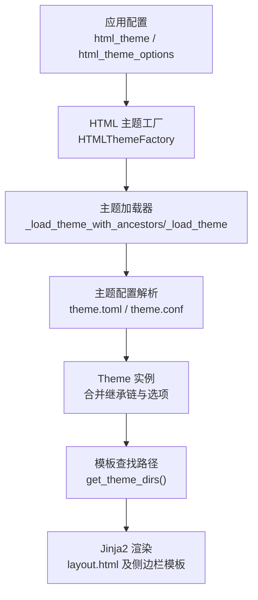
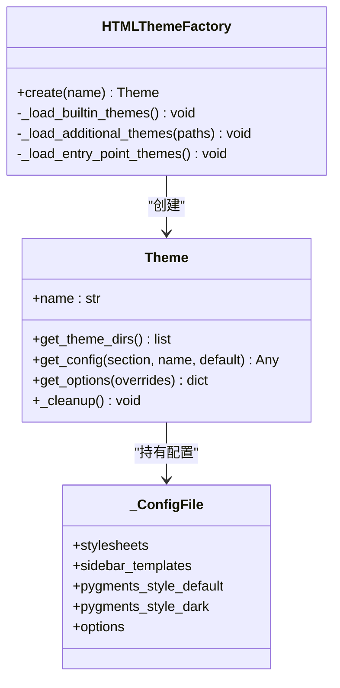
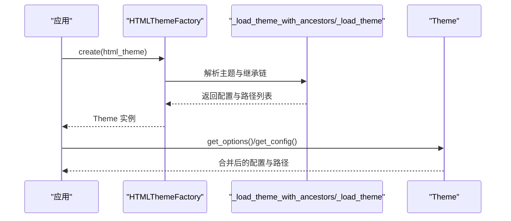
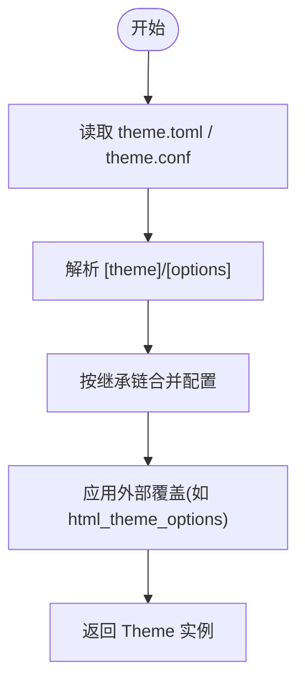
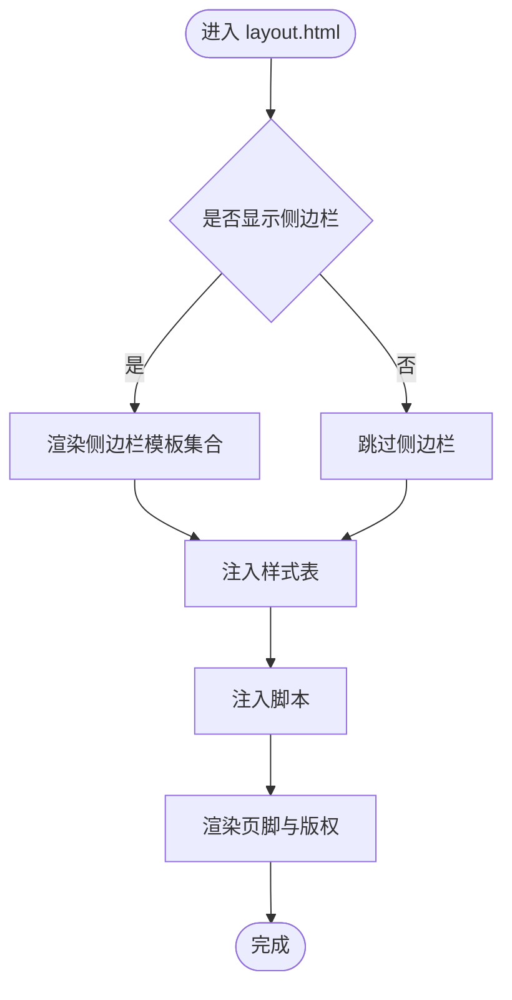
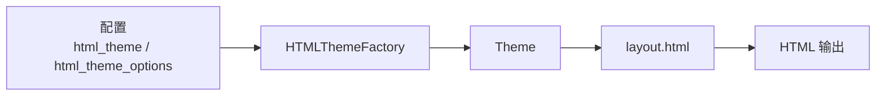

# 主题系统

<cite>
**本文引用的文件**
- [sphinx/theming.py](file://sphinx/theming.py)
- [doc/usage/theming.rst](file://doc/usage/theming.rst)
- [sphinx/themes/basic/theme.toml](file://sphinx/themes/basic/theme.toml)
- [sphinx/themes/classic/theme.toml](file://sphinx/themes/classic/theme.toml)
- [sphinx/themes/sphinxdoc/theme.toml](file://sphinx/themes/sphinxdoc/theme.toml)
- [sphinx/themes/agogo/theme.toml](file://sphinx/themes/agogo/theme.toml)
- [sphinx/themes/scrolls/theme.toml](file://sphinx/themes/scrolls/theme.toml)
- [sphinx/themes/nature/theme.toml](file://sphinx/themes/nature/theme.toml)
- [sphinx/themes/pyramid/theme.toml](file://sphinx/themes/pyramid/theme.toml)
- [sphinx/themes/haiku/theme.toml](file://sphinx/themes/haiku/theme.toml)
- [sphinx/themes/bizstyle/theme.toml](file://sphinx/themes/bizstyle/theme.toml)
- [sphinx/themes/traditional/theme.toml](file://sphinx/themes/traditional/theme.toml)
- [sphinx/themes/basic/layout.html](file://sphinx/themes/basic/layout.html)
- [tests/test_theming/test_theming.py](file://tests/test_theming/test_theming.py)
</cite>

## 目录
1. [简介](#简介)
2. [项目结构](#项目结构)
3. [核心组件](#核心组件)
4. [架构总览](#架构总览)
5. [详细组件分析](#详细组件分析)
6. [依赖关系分析](#依赖关系分析)
7. [性能考量](#性能考量)
8. [故障排查指南](#故障排查指南)
9. [结论](#结论)
10. [附录](#附录)

## 简介
本章节面向 Sphinx 主题系统的使用者与开发者，系统化阐述主题架构、CSS/HTML 模板机制、内置主题特性与用法、自定义主题开发流程（模板继承、静态资源管理、响应式设计）、主题配置与样式定制、主题打包与分发、最佳实践与性能优化，以及兼容性检查与测试方法。内容基于仓库中的主题实现与官方文档，帮助读者快速理解并高效使用或扩展 Sphinx 的 HTML 主题体系。

## 项目结构
围绕主题系统的关键文件与目录如下：
- 主题运行时与工厂：sphinx/theming.py
- 官方主题配置示例：sphinx/themes/*/theme.toml
- 基础布局模板：sphinx/themes/basic/layout.html
- 使用文档：doc/usage/theming.rst
- 测试用例：tests/test_theming/test_theming.py

**图表来源**
- [sphinx/theming.py:152-266](file://sphinx/theming.py#L152-L266)
- [sphinx/themes/basic/theme.toml:1-24](file://sphinx/themes/basic/theme.toml#L1-L24)
- [sphinx/themes/basic/layout.html:1-200](file://sphinx/themes/basic/layout.html#L1-L200)

**章节来源**
- [sphinx/theming.py:152-266](file://sphinx/theming.py#L152-L266)
- [doc/usage/theming.rst:36-84](file://doc/usage/theming.rst#L36-L84)

## 核心组件
- 主题类 Theme：封装主题配置、样式表、侧边栏模板、Pygments 颜色方案，并支持选项覆盖与继承链查询。
- 主题工厂 HTMLThemeFactory：负责内置主题加载、额外主题路径扫描、入口点主题发现与延迟加载、主题归档解压与配置解析。
- 配置文件格式：theme.toml（推荐）与 theme.conf（兼容），统一描述继承关系、样式表列表、侧边栏模板、Pygments 风格等。
- 基础布局模板 layout.html：定义页面骨架、关系栏、侧边栏、脚本与样式注入、版权信息等可插拔区块。

关键职责与交互：
- 主题工厂在构建前根据配置选择主题并解析其继承链，生成 Theme 实例。
- Theme 实例提供查询接口，允许按需读取样式表、侧边栏模板与主题选项。
- HTML 构建器通过 Jinja2 渲染 layout.html 与侧边栏模板，输出最终页面。

**章节来源**
- [sphinx/theming.py:58-150](file://sphinx/theming.py#L58-L150)
- [sphinx/theming.py:152-266](file://sphinx/theming.py#L152-L266)
- [sphinx/themes/basic/layout.html:1-200](file://sphinx/themes/basic/layout.html#L1-L200)

## 架构总览
主题系统采用“配置驱动 + 模板继承 + 工厂加载”的架构：
- 配置驱动：theme.toml 决定继承、样式表、侧边栏与 Pygments 风格；options 节提供可定制项。
- 模板继承：子主题通过 inherit 继承父主题，形成从子到父的配置合并链。
- 工厂加载：扫描内置主题、用户主题路径与入口点，支持目录与归档主题，解析配置后实例化 Theme。
- 渲染输出：Theme 提供样式与模板路径，构建器渲染基础布局与侧边栏模板，注入脚本与样式。

**图表来源**
- [sphinx/theming.py:58-150](file://sphinx/theming.py#L58-L150)
- [sphinx/theming.py:152-266](file://sphinx/theming.py#L152-L266)
- [sphinx/theming.py:454-507](file://sphinx/theming.py#L454-L507)

## 详细组件分析

### 主题工厂与加载流程
- 内置主题：从 sphinx/themes 目录自动发现并注册。
- 用户主题：通过 html_theme_path 指定的相对路径解析绝对路径，扫描目录与 zip 归档。
- 入口点主题：通过 sphinx.html_themes 入口点动态延迟加载。
- 归档主题：对 zip 文件进行校验与解压，提取 theme.toml 或 theme.conf 并解析。
- 继承链：沿 inherit 向上遍历，最多限制层级，避免循环与过深继承。

**图表来源**
- [sphinx/theming.py:251-266](file://sphinx/theming.py#L251-L266)
- [sphinx/theming.py:278-342](file://sphinx/theming.py#L278-L342)
- [sphinx/theming.py:318-342](file://sphinx/theming.py#L318-L342)

**章节来源**
- [sphinx/theming.py:190-266](file://sphinx/theming.py#L190-L266)
- [sphinx/theming.py:278-342](file://sphinx/theming.py#L278-L342)

### 主题配置与选项
- theme.toml 结构要点：
  - [theme] 继承关系、样式表列表、侧边栏模板、Pygments 风格（默认/暗色）。
  - [options] 键值对，作为主题可定制项。
- Theme.get_config 支持从 theme 与 options 两节读取，支持默认值与异常抛出。
- Theme.get_options 支持外部覆盖（如 html_theme_options），并给出不支持选项的警告。

**图表来源**
- [sphinx/theming.py:358-451](file://sphinx/theming.py#L358-L451)
- [sphinx/theming.py:100-143](file://sphinx/theming.py#L100-L143)

**章节来源**
- [sphinx/theming.py:358-451](file://sphinx/theming.py#L358-L451)
- [sphinx/theming.py:100-143](file://sphinx/theming.py#L100-L143)

### 基础布局与模板机制
- 基础布局 layout.html 定义了 doctype、relbar、侧边栏、脚本与样式注入、版权区块等。
- 侧边栏模板通过 sidebars 列表或旧式区块 include，支持 logo、localtoc、relations、sourcelink、searchbox 等。
- 渲染时会注入 css_files 与 script_files，确保样式与脚本正确加载。

**图表来源**
- [sphinx/themes/basic/layout.html:1-200](file://sphinx/themes/basic/layout.html#L1-L200)

**章节来源**
- [sphinx/themes/basic/layout.html:1-200](file://sphinx/themes/basic/layout.html#L1-L200)

### 内置主题概览与适用场景
- basic：无样式的基础布局，作为其他主题的父主题，提供通用侧边栏模板与基础选项。
- classic：经典风格，适合传统文档外观，支持丰富的颜色与字体选项。
- sphinxdoc：Sphinx 官方历史主题，右侧侧边栏，简洁实用。
- agogo：强调排版与色彩，适合长文档与重视视觉层次的项目。
- scrolls：轻量风格，强调可读性与空间利用。
- nature：绿色系自然风格，适合科技类文档。
- pyramid：来自 Pyramid 项目的主题，适合 Web 框架类文档。
- haiku：无侧边栏风格，适合追求极简与清晰阅读体验的项目。
- bizstyle：商务蓝风格，适合企业级文档。
- traditional：复古风格，适合历史或学术类文档。
- epub：电子书专用主题，注重节省空间与可读性。

以上主题均通过 theme.toml 指定继承关系、样式表与 Pygments 风格，并可在 options 中进行微调。

**章节来源**
- [doc/usage/theming.rst:86-365](file://doc/usage/theming.rst#L86-L365)
- [sphinx/themes/basic/theme.toml:1-24](file://sphinx/themes/basic/theme.toml#L1-L24)
- [sphinx/themes/classic/theme.toml:1-35](file://sphinx/themes/classic/theme.toml#L1-L35)
- [sphinx/themes/sphinxdoc/theme.toml:1-7](file://sphinx/themes/sphinxdoc/theme.toml#L1-L7)
- [sphinx/themes/agogo/theme.toml:1-23](file://sphinx/themes/agogo/theme.toml#L1-L23)
- [sphinx/themes/scrolls/theme.toml:1-16](file://sphinx/themes/scrolls/theme.toml#L1-L16)
- [sphinx/themes/nature/theme.toml:1-7](file://sphinx/themes/nature/theme.toml#L1-L7)
- [sphinx/themes/pyramid/theme.toml:1-7](file://sphinx/themes/pyramid/theme.toml#L1-L7)
- [sphinx/themes/haiku/theme.toml:1-17](file://sphinx/themes/haiku/theme.toml#L1-L17)
- [sphinx/themes/bizstyle/theme.toml:1-13](file://sphinx/themes/bizstyle/theme.toml#L1-L13)
- [sphinx/themes/traditional/theme.toml:1-10](file://sphinx/themes/traditional/theme.toml#L1-L10)

### 自定义主题开发指南
- 主题结构
  - 必备：theme.toml（推荐）或 theme.conf，声明 inherit、stylesheets、sidebars、pygments_style。
  - 建议：layout.html 与常用侧边栏模板（如 localtoc.html、searchbox.html）。
- 模板继承
  - 子主题通过 inherit 指向父主题，配置按链路合并；若父主题缺失，将报错。
- 静态资源管理
  - 将 CSS/JS/PNG 等静态文件放入主题目录，通过 stylesheets 注入；也可通过入口点或 html_theme_path 引入。
- 响应式设计
  - 在 CSS 中使用媒体查询与弹性布局；基础模板已包含 viewport meta 与基本结构，便于适配移动端。
- 主题配置与样式定制
  - 在 [options] 中提供键值对，Theme.get_options 支持外部覆盖；注意不支持的选项会记录警告。
- 打包与分发
  - 支持目录主题与 zip 归档主题；归档中必须包含 theme.toml 或 theme.conf。
  - 也可通过 Python 包的入口点 sphinx.html_themes 动态加载。

**章节来源**
- [sphinx/theming.py:190-266](file://sphinx/theming.py#L190-L266)
- [sphinx/themes/basic/theme.toml:1-24](file://sphinx/themes/basic/theme.toml#L1-L24)
- [sphinx/themes/basic/layout.html:1-200](file://sphinx/themes/basic/layout.html#L1-L200)

### 主题配置选项与样式定制方法
- 常见主题选项（示例）
  - classic：rightsidebar、stickysidebar、collapsiblesidebar、externalrefs、颜色与字体系列等。
  - sphinxdoc：nosidebar、sidebarwidth。
  - scrolls：headerbordercolor、subheadlinecolor、linkcolor、visitedlinkcolor、admonitioncolor。
  - agogo：bodyfont、headerfont、pagewidth、documentwidth、sidebarwidth、rightsidebar、背景与链接色等。
  - nature、pyramid、bizstyle：基础选项为主，部分主题提供额外颜色或布局参数。
  - haiku：full_logo、textcolor、headingcolor、linkcolor、visitedlinkcolor、hoverlinkcolor。
  - traditional：body_min_width、body_max_width。
- 定制方式
  - 在 conf.py 中设置 html_theme_options，Theme.get_options 会合并并覆盖默认选项。
  - 若需要全局样式，可在主题 CSS 中调整；或通过额外样式表注入。

**章节来源**
- [doc/usage/theming.rst:136-365](file://doc/usage/theming.rst#L136-L365)
- [sphinx/themes/classic/theme.toml:8-35](file://sphinx/themes/classic/theme.toml#L8-L35)
- [sphinx/themes/sphinxdoc/theme.toml:1-7](file://sphinx/themes/sphinxdoc/theme.toml#L1-L7)
- [sphinx/themes/scrolls/theme.toml:8-16](file://sphinx/themes/scrolls/theme.toml#L8-L16)
- [sphinx/themes/agogo/theme.toml:8-23](file://sphinx/themes/agogo/theme.toml#L8-L23)
- [sphinx/themes/haiku/theme.toml:8-17](file://sphinx/themes/haiku/theme.toml#L8-L17)
- [sphinx/themes/traditional/theme.toml:7-10](file://sphinx/themes/traditional/theme.toml#L7-L10)

### 主题打包与分发机制
- 目录主题：直接放置 theme.toml 与模板、静态资源。
- 归档主题：zip 文件内含 theme.toml 或 theme.conf，工厂会校验并解压。
- 入口点主题：通过 Python 包元数据的 sphinx.html_themes 分组动态加载。
- 主题路径：通过 html_theme_path 指定额外搜索路径，支持相对路径解析。

**章节来源**
- [sphinx/theming.py:196-222](file://sphinx/theming.py#L196-L222)
- [sphinx/theming.py:268-276](file://sphinx/theming.py#L268-L276)
- [doc/usage/theming.rst:57-84](file://doc/usage/theming.rst#L57-L84)

### 主题开发最佳实践与性能优化
- 最佳实践
  - 以 basic 为父主题，复用通用侧边栏与布局；仅在子主题中覆盖必要配置。
  - 使用 theme.toml 明确声明继承与样式表，保持配置一致性。
  - 将静态资源命名规范、版本化与缓存策略纳入主题结构。
  - 在 CSS 中优先使用语义化类名与可维护的变量体系。
- 性能优化
  - 合理拆分与压缩 CSS/JS，减少请求数与体积。
  - 使用媒体查询与按需加载，避免在移动端加载不必要的大图。
  - 控制侧边栏模板数量与复杂度，减少 DOM 体积。
  - 利用浏览器缓存与 CDN 加速静态资源。

[本节为通用指导，无需特定文件引用]

## 依赖关系分析
- 主题工厂依赖应用配置与注册表，扫描内置与外部主题源。
- 主题实例依赖配置文件解析结果，提供查询接口。
- 渲染阶段依赖 Jinja2 模板引擎与 Theme 提供的样式/模板路径。

**图表来源**
- [sphinx/theming.py:152-266](file://sphinx/theming.py#L152-L266)
- [sphinx/themes/basic/layout.html:1-200](file://sphinx/themes/basic/layout.html#L1-L200)

**章节来源**
- [sphinx/theming.py:152-266](file://sphinx/theming.py#L152-L266)
- [sphinx/themes/basic/layout.html:1-200](file://sphinx/themes/basic/layout.html#L1-L200)

## 性能考量
- 主题加载
  - 避免过深的继承链，减少配置合并成本。
  - 优先使用目录主题以便于本地调试，归档主题用于分发。
- 渲染与资源
  - 控制样式表与脚本数量，避免重复与冗余。
  - 使用相对路径与缓存友好的静态资源命名。
- 移动端体验
  - 在 CSS 中启用弹性布局与断点，避免横向滚动。
  - 适度压缩图片与图标，使用矢量资源提升缩放质量。

[本节为通用指导，无需特定文件引用]

## 故障排查指南
- 常见错误与定位
  - 缺少 theme.toml 或 theme.conf：工厂在解析主题时会报错，确认主题根目录包含有效配置文件。
  - 继承链错误：循环继承或不存在的父主题会导致异常；检查 inherit 与已注册主题列表。
  - 不支持的选项：Theme.get_options 对未知选项发出警告；核对主题 options 键名。
- 测试验证
  - 使用测试套件验证主题加载、选项合并、侧边栏模板、暗色高亮样式注入等行为。
  - 通过构建输出检查样式表注入顺序与媒体属性（如暗色模式）。

**章节来源**
- [sphinx/theming.py:298-313](file://sphinx/theming.py#L298-L313)
- [tests/test_theming/test_theming.py:33-101](file://tests/test_theming/test_theming.py#L33-L101)
- [tests/test_theming/test_theming.py:150-186](file://tests/test_theming/test_theming.py#L150-L186)

## 结论
Sphinx 主题系统以配置驱动与模板继承为核心，结合灵活的主题加载与工厂化管理，既满足内置主题的即开即用，也支持第三方与自定义主题的扩展。通过规范的 theme.toml、合理的模板组织与静态资源管理，开发者可以快速构建符合项目风格的高质量文档站点。配合测试与性能优化实践，可进一步提升主题的稳定性与用户体验。

## 附录
- 使用建议
  - 新项目优先考虑 scrolls、classic、sphinxdoc 等易用主题，再根据品牌需求选择 agogo、nature、bizstyle 等。
  - 自定义主题时，遵循 basic 的布局与侧边栏约定，最小化改动以降低维护成本。
- 进一步阅读
  - 官方主题使用文档与各主题选项说明。

**章节来源**
- [doc/usage/theming.rst:36-84](file://doc/usage/theming.rst#L36-L84)
- [doc/usage/theming.rst:86-365](file://doc/usage/theming.rst#L86-L365)