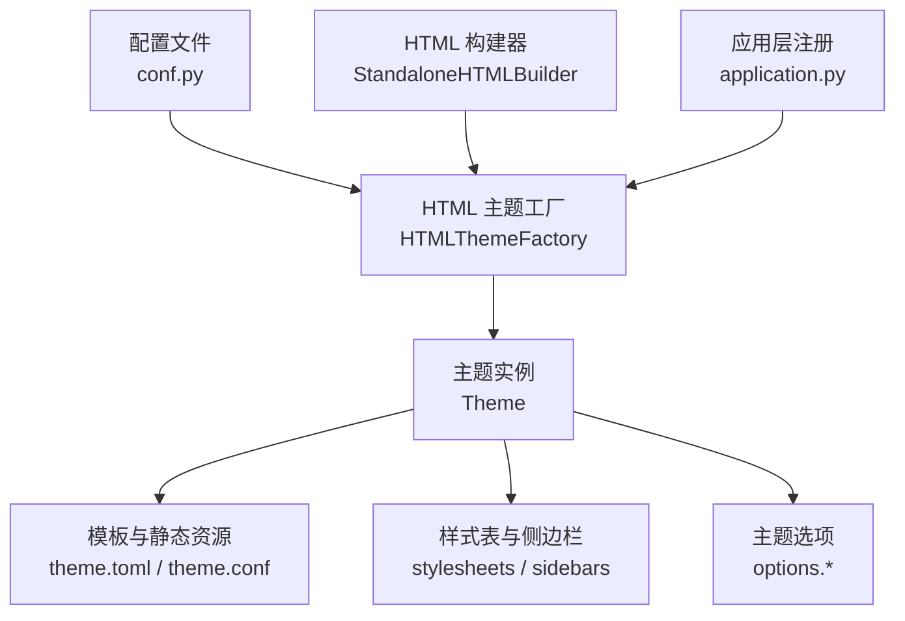
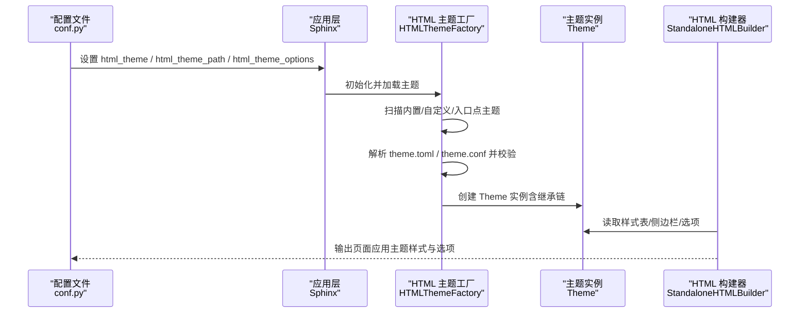
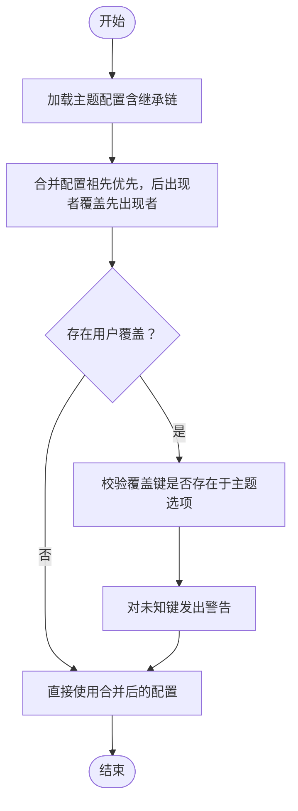
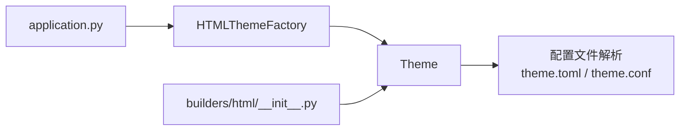

# 主题配置管理

<cite>
**本文引用的文件**
- [sphinx/theming.py](file://sphinx/theming.py)
- [doc/usage/theming.rst](file://doc/usage/theming.rst)
- [sphinx/themes/basic/theme.toml](file://sphinx/themes/basic/theme.toml)
- [sphinx/themes/classic/theme.toml](file://sphinx/themes/classic/theme.toml)
- [sphinx/themes/default/theme.toml](file://sphinx/themes/default/theme.toml)
- [tests/test_theming/test_theming.py](file://tests/test_theming/test_theming.py)
- [tests/test_theming/test_html_theme.py](file://tests/test_theming/test_html_theme.py)
- [tests/test_theming/theme.toml](file://tests/test_theming/theme.toml)
- [tests/roots/test-theming/conf.py](file://tests/roots/test-theming/conf.py)
- [sphinx/builders/html/__init__.py](file://sphinx/builders/html/__init__.py)
- [sphinx/application.py](file://sphinx/application.py)
- [sphinx/errors.py](file://sphinx/errors.py)
</cite>

## 目录
1. [简介](#简介)
2. [项目结构](#项目结构)
3. [核心组件](#核心组件)
4. [架构总览](#架构总览)
5. [详细组件分析](#详细组件分析)
6. [依赖分析](#依赖分析)
7. [性能考量](#性能考量)
8. [故障排除指南](#故障排除指南)
9. [结论](#结论)
10. [附录](#附录)

## 简介
本文件系统化阐述 Sphinx 的主题配置管理，围绕以下目标展开：
- 完整的主题配置项清单与用法：html_theme、html_theme_path、html_style（以及与之等价的 theme 配置）、主题选项与继承链。
- 主题选项的覆盖机制与优先级规则：如何在 theme.toml 与用户配置之间进行合并与覆盖。
- 动态修改与运行时更新：如何在构建过程中读取与应用主题配置。
- 兼容性检查与配置验证：主题配置文件格式、继承链校验、错误处理。
- 常见问题排查与最佳实践：路径、权限、循环继承、无效配置等。
- 与全局配置的关系：主题配置如何与全局配置协同工作。

## 项目结构
与主题配置管理直接相关的代码与文档分布如下：
- 核心实现：sphinx/theming.py（主题类、工厂、配置加载与校验）
- 文档说明：doc/usage/theming.rst（内置主题与使用方式）
- 内置主题样例：sphinx/themes/*/theme.toml（展示 theme.toml 结构与继承）
- 测试用例：tests/test_theming/*（覆盖主题 API、选项合并、多样式表等）
- 构建器集成：sphinx/builders/html/__init__.py（HTML 构建器初始化主题）
- 应用层注册：sphinx/application.py（内置主题注册与扩展点）

图表来源
- [sphinx/theming.py:152-266](file://sphinx/theming.py#L152-L266)
- [sphinx/builders/html/__init__.py:139-175](file://sphinx/builders/html/__init__.py#L139-L175)
- [sphinx/application.py:136-141](file://sphinx/application.py#L136-L141)

章节来源
- [sphinx/theming.py:152-266](file://sphinx/theming.py#L152-L266)
- [doc/usage/theming.rst:36-84](file://doc/usage/theming.rst#L36-L84)
- [sphinx/application.py:136-141](file://sphinx/application.py#L136-L141)

## 核心组件
- 主题类 Theme：封装主题目录、样式表、侧边栏模板、Pygments 颜色方案、主题选项，并支持按继承链查询配置与合并用户覆盖选项。
- HTML 主题工厂 HTMLThemeFactory：负责加载内置主题、扫描自定义主题路径、解析入口点主题、构建主题继承链并创建 Theme 实例。
- 配置文件解析：支持 theme.toml（推荐）与 theme.conf（遗留），并提供从 conf 迁移到 toml 的工具函数。
- 错误类型：ThemeError 用于主题配置相关的错误，统一由 SphinxError 派生。

章节来源
- [sphinx/theming.py:58-150](file://sphinx/theming.py#L58-L150)
- [sphinx/theming.py:152-266](file://sphinx/theming.py#L152-L266)
- [sphinx/theming.py:358-451](file://sphinx/theming.py#L358-L451)
- [sphinx/errors.py:93-97](file://sphinx/errors.py#L93-L97)

## 架构总览
主题配置的生命周期从配置文件读取到构建期应用，关键流程如下：

图表来源
- [sphinx/builders/html/__init__.py:139-175](file://sphinx/builders/html/__init__.py#L139-L175)
- [sphinx/theming.py:152-266](file://sphinx/theming.py#L152-L266)
- [sphinx/application.py:136-141](file://sphinx/application.py#L136-L141)

## 详细组件分析

### 主题配置项与用法
- html_theme：指定使用的主题名称（如 classic、alabaster 等）。参见内置主题文档与使用示例。
- html_theme_path：指定额外主题目录或压缩包所在路径，可为相对路径（相对于 conf.py 所在目录）。
- html_style：在旧版中用于指定样式表；当前推荐通过 theme.toml 中的 stylesheets 字段声明，或在主题选项中控制样式行为。
- 主题选项 html_theme_options：用于覆盖主题 options.* 项，例如导航键启用、搜索快捷键、侧边栏宽度等。

章节来源
- [doc/usage/theming.rst:36-84](file://doc/usage/theming.rst#L36-L84)
- [tests/test_theming/test_html_theme.py:11-38](file://tests/test_theming/test_html_theme.py#L11-L38)

### 主题选项的覆盖机制与优先级
- 继承链合并：Theme 在构造时会将祖先主题的配置逐层合并，后出现的祖先覆盖先前值，最终得到完整的配置集。
- 用户覆盖：Theme.get_options 支持传入 overrides，仅对存在的主题选项生效，不存在的键会发出警告但不写入结果。
- 查询策略：Theme.get_config 支持两类 section：
  - theme：读取 stylesheet、sidebars、pygments_style、pygments_dark_style 等主题元数据。
  - options：读取主题 options.* 项。
- 默认值与缺失处理：未找到键时返回默认值或抛出 ThemeError。

图表来源
- [sphinx/theming.py:76-93](file://sphinx/theming.py#L76-L93)
- [sphinx/theming.py:131-143](file://sphinx/theming.py#L131-L143)

章节来源
- [sphinx/theming.py:76-93](file://sphinx/theming.py#L76-L93)
- [sphinx/theming.py:131-143](file://sphinx/theming.py#L131-L143)

### 主题配置的动态修改与运行时更新
- 构建期读取：StandaloneHTMLBuilder 在 init 阶段初始化模板、高亮、CSS/JS 资源，并读取主题配置。
- 主题选项注入：测试用例表明，通过 html_theme_options 可在构建前注入主题选项，构建后这些选项会体现在输出中（如 documentation_options.js）。
- 注意：主题配置在应用初始化阶段确定，运行时动态切换主题需重新初始化应用。

章节来源
- [sphinx/builders/html/__init__.py:162-175](file://sphinx/builders/html/__init__.py#L162-L175)
- [tests/test_theming/test_html_theme.py:11-38](file://tests/test_theming/test_html_theme.py#L11-L38)

### 主题兼容性检查与配置验证
- 文件格式支持：优先解析 theme.toml；若不存在则回退到 theme.conf。
- TOML 校验：必须包含 [theme] 表，且 inherit 必填；[options] 可选。
- CONF 校验：必须包含 [theme]，且 inherit 必填；支持 stylesheet、sidebars、pygments_style、pygments_dark_style 等键。
- 继承链检查：最多允许 10 层祖先，防止过深继承；检测循环继承并报错。
- 错误类型：ThemeError 用于主题配置错误，统一由 SphinxError 派生。

章节来源
- [sphinx/theming.py:358-451](file://sphinx/theming.py#L358-L451)
- [sphinx/theming.py:278-315](file://sphinx/theming.py#L278-L315)
- [sphinx/errors.py:93-97](file://sphinx/errors.py#L93-L97)

### 主题配置与全局配置的关系
- 全局配置参与：HTMLThemeFactory 在初始化时读取 config.html_theme_path 等全局配置，决定主题搜索范围。
- 主题选项与全局配置协同：html_theme_options 与主题 options.* 协同，后者由主题作者定义，前者由用户覆盖。
- 构建器集成：StandaloneHTMLBuilder 在 init 中读取主题配置并准备静态资源，确保输出符合主题设定。

章节来源
- [sphinx/theming.py:186-188](file://sphinx/theming.py#L186-L188)
- [sphinx/builders/html/__init__.py:162-175](file://sphinx/builders/html/__init__.py#L162-L175)

### 配置示例与最佳实践
- 使用内置主题：设置 html_theme 即可。
- 自定义主题路径：设置 html_theme_path，支持相对路径与压缩包。
- 主题选项：通过 html_theme_options 覆盖主题选项，避免直接修改主题源码。
- 多样式表：在 theme.toml 中声明多个 stylesheets，构建器会正确引入。
- 最佳实践：
  - 优先使用 theme.toml；如需迁移，可使用内置转换工具。
  - 避免循环继承与深层继承链。
  - 将第三方主题作为包安装并通过入口点加载，减少路径配置复杂度。

章节来源
- [doc/usage/theming.rst:36-84](file://doc/usage/theming.rst#L36-L84)
- [tests/test_theming/test_html_theme.py:40-51](file://tests/test_theming/test_html_theme.py#L40-L51)
- [sphinx/theming.py:509-576](file://sphinx/theming.py#L509-L576)

## 依赖分析
- 主题工厂依赖应用层配置与注册表，以确定可用主题集合与搜索路径。
- 主题实例依赖配置文件解析模块，生成样式表、侧边栏与选项集合。
- 构建器依赖主题实例提供的样式与选项，完成静态资源与页面渲染。

图表来源
- [sphinx/application.py:136-141](file://sphinx/application.py#L136-L141)
- [sphinx/theming.py:152-266](file://sphinx/theming.py#L152-L266)
- [sphinx/builders/html/__init__.py:139-175](file://sphinx/builders/html/__init__.py#L139-L175)

章节来源
- [sphinx/application.py:136-141](file://sphinx/application.py#L136-L141)
- [sphinx/theming.py:152-266](file://sphinx/theming.py#L152-L266)
- [sphinx/builders/html/__init__.py:139-175](file://sphinx/builders/html/__init__.py#L139-L175)

## 性能考量
- 主题加载：扫描主题路径与解压压缩包会产生 I/O 开销，建议将常用主题放置在本地路径或使用入口点主题减少路径查找。
- 继承链深度：过深的继承链会增加配置合并成本，应保持合理层级。
- 样式表数量：过多样式表会增加页面加载时间，建议合并与按需加载。

## 故障排除指南
- 无法找到主题：确认 html_theme 名称正确，且主题位于 html_theme_path 或已通过入口点加载。
- 循环继承：检查 theme.toml 的 inherit 链路，避免相互引用。
- 缺少配置文件：确保主题目录包含 theme.toml 或 theme.conf，并满足必需字段。
- 未知主题选项：Theme.get_options 对未知键会发出警告，检查键名是否存在于主题 options.*。
- 多样式表未生效：确认 theme.toml 中 stylesheets 列表正确，构建器会按顺序引入。

章节来源
- [sphinx/theming.py:278-315](file://sphinx/theming.py#L278-L315)
- [sphinx/theming.py:131-143](file://sphinx/theming.py#L131-L143)
- [tests/test_theming/test_html_theme.py:40-51](file://tests/test_theming/test_html_theme.py#L40-L51)

## 结论
Sphinx 的主题配置管理以 Theme 与 HTMLThemeFactory 为核心，通过 theme.toml（推荐）与 theme.conf（兼容）两种配置格式，结合继承链与用户覆盖机制，实现了灵活而可控的主题外观定制。遵循本文的配置清单、优先级规则、验证与排错指南，可有效提升主题配置的稳定性与可维护性。

## 附录

### 主题配置文件结构要点
- theme.toml（推荐）：
  - [theme]：inherit 必填；可选 stylesheets、sidebars、pygments_style（default/dark）。
  - [options]：键值对，供 html_theme_options 覆盖。
- theme.conf（兼容）：
  - [theme]：inherit 必填；可选 stylesheet、sidebars、pygments_style、pygments_dark_style。
  - [options]：键值对。

章节来源
- [sphinx/themes/basic/theme.toml:1-24](file://sphinx/themes/basic/theme.toml#L1-L24)
- [sphinx/themes/classic/theme.toml:1-35](file://sphinx/themes/classic/theme.toml#L1-L35)
- [sphinx/themes/default/theme.toml:1-3](file://sphinx/themes/default/theme.toml#L1-L3)
- [tests/test_theming/theme.toml:1-11](file://tests/test_theming/theme.toml#L1-L11)

### 内置主题与选项参考
- basic：基础布局，提供 nosidebar、sidebarwidth、body_min_width、body_max_width、navigation_with_keys、enable_search_shortcuts、globaltoc_* 等选项。
- classic：继承 basic，提供颜色与字体选项，如 sidebarbgcolor、relbarbgcolor、bodyfont、headfont 等。
- default：指向 classic 的别名（历史遗留）。

章节来源
- [doc/usage/theming.rst:136-347](file://doc/usage/theming.rst#L136-L347)
- [sphinx/themes/basic/theme.toml:14-24](file://sphinx/themes/basic/theme.toml#L14-L24)
- [sphinx/themes/classic/theme.toml:8-35](file://sphinx/themes/classic/theme.toml#L8-L35)
- [sphinx/themes/default/theme.toml:1-3](file://sphinx/themes/default/theme.toml#L1-L3)