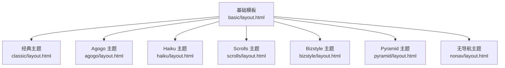
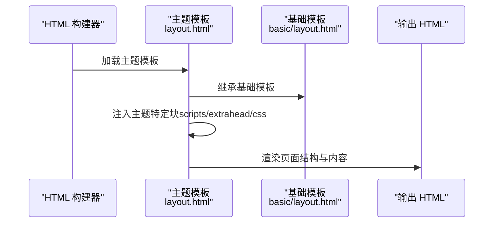
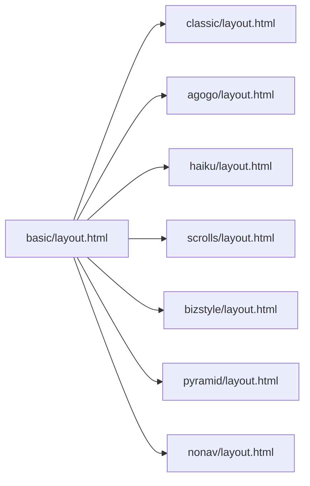

# 内置主题介绍

<cite>
**本文引用的文件**
- [doc/usage/theming.rst](file://doc/usage/theming.rst)
- [sphinx/themes/basic/layout.html](file://sphinx/themes/basic/layout.html)
- [sphinx/themes/classic/layout.html](file://sphinx/themes/classic/layout.html)
- [sphinx/themes/agogo/layout.html](file://sphinx/themes/agogo/layout.html)
- [sphinx/themes/haiku/layout.html](file://sphinx/themes/haiku/layout.html)
- [sphinx/themes/nonav/layout.html](file://sphinx/themes/nonav/layout.html)
- [sphinx/themes/pyramid/layout.html](file://sphinx/themes/pyramid/layout.html)
- [sphinx/themes/scrolls/layout.html](file://sphinx/themes/scrolls/layout.html)
- [sphinx/themes/bizstyle/layout.html](file://sphinx/themes/bizstyle/layout.html)
</cite>

## 目录
1. [简介](#简介)
2. [项目结构](#项目结构)
3. [核心组件](#核心组件)
4. [架构总览](#架构总览)
5. [详细组件分析](#详细组件分析)
6. [依赖分析](#依赖分析)
7. [性能考虑](#性能考虑)
8. [故障排查指南](#故障排查指南)
9. [结论](#结论)
10. [附录](#附录)

## 简介
本文件系统性介绍 Sphinx 的内置 HTML 主题，覆盖 classic、sphinxdoc、agogo、basic、bizstyle、haiku、nature、nonav、pyramid、scrolls、traditional 等主题。内容包括各主题的设计风格与视觉特色、布局与功能特性、主题配置示例与使用方法、主题间的差异与选择建议、浏览器兼容性与响应式支持现状、以及主题切换与基础自定义方法。文末提供主题预览截图与在线演示链接指引。

## 项目结构
Sphinx 将内置主题组织在 sphinx/themes 目录下，每个主题由一组模板与静态资源组成，其中 layout.html 是主题的核心模板，继承自基础模板 basic/layout.html，并按需扩展或替换块（blocks）以实现不同的布局与交互行为。主题的样式与脚本通过模板中的块注入，如 extrahead、scripts、css 等。

图表来源
- [sphinx/themes/basic/layout.html](file://sphinx/themes/basic/layout.html)
- [sphinx/themes/classic/layout.html](file://sphinx/themes/classic/layout.html)
- [sphinx/themes/agogo/layout.html](file://sphinx/themes/agogo/layout.html)
- [sphinx/themes/haiku/layout.html](file://sphinx/themes/haiku/layout.html)
- [sphinx/themes/scrolls/layout.html](file://sphinx/themes/scrolls/layout.html)
- [sphinx/themes/bizstyle/layout.html](file://sphinx/themes/bizstyle/layout.html)
- [sphinx/themes/pyramid/layout.html](file://sphinx/themes/pyramid/layout.html)
- [sphinx/themes/nonav/layout.html](file://sphinx/themes/nonav/layout.html)

章节来源
- [doc/usage/theming.rst](file://doc/usage/theming.rst)

## 核心组件
- 基础模板 basic/layout.html：提供通用的 HTML 结构、元信息、样式与脚本注入点，以及侧边栏、导航条、页脚等区块的默认实现。它是所有内置主题的父模板。
- 各内置主题的 layout.html：通过继承基础模板并重写关键块（如 header、content、footer、scripts、extrahead 等），实现各自的布局与交互。
- 主题配置：通过 html_theme 指定主题名；通过 html_theme_options 配置主题选项；通过 html_theme_path 指定自定义主题的查找路径。

章节来源
- [doc/usage/theming.rst](file://doc/usage/theming.rst)
- [sphinx/themes/basic/layout.html](file://sphinx/themes/basic/layout.html)

## 架构总览
下图展示 Sphinx HTML 输出的主题渲染流程：构建器生成页面 → 应用主题模板 → 注入样式与脚本 → 渲染最终 HTML。

图表来源
- [sphinx/themes/basic/layout.html](file://sphinx/themes/basic/layout.html)
- [sphinx/themes/classic/layout.html](file://sphinx/themes/classic/layout.html)
- [sphinx/themes/agogo/layout.html](file://sphinx/themes/agogo/layout.html)
- [sphinx/themes/haiku/layout.html](file://sphinx/themes/haiku/layout.html)
- [sphinx/themes/scrolls/layout.html](file://sphinx/themes/scrolls/layout.html)
- [sphinx/themes/bizstyle/layout.html](file://sphinx/themes/bizstyle/layout.html)
- [sphinx/themes/pyramid/layout.html](file://sphinx/themes/pyramid/layout.html)
- [sphinx/themes/nonav/layout.html](file://sphinx/themes/nonav/layout.html)

## 详细组件分析

### Basic 主题
- 角色与定位：作为其他主题的基础，提供最小可用布局与通用区块（relbar、sidebar、content、footer）。适合二次开发或自定义主题。
- 关键特性
  - 支持隐藏侧边栏（nosidebar）、设置侧边栏宽度（sidebarwidth）、限制正文最小/最大宽度（body_min_width、body_max_width）。
  - 键盘快捷键：左右箭头导航上一页/下一页（navigation_with_keys）。
  - 搜索快捷键：启用“跳转到搜索框”和“移除高亮”（enable_search_shortcuts）。
  - 全局目录树控制：全局 toctree 的展开深度、是否显示隐藏项、最大深度等（globaltoc_*）。
- 使用建议：若需要从零开始定制外观，可直接基于 basic 开发；若追求简洁与可扩展性，也可直接使用。

章节来源
- [doc/usage/theming.rst](file://doc/usage/theming.rst)
- [sphinx/themes/basic/layout.html](file://sphinx/themes/basic/layout.html)

### Classic 主题
- 设计风格：经典外观，类似早期 Python 文档风格；支持右侧侧边栏、粘性侧边栏、可折叠侧边栏、外部链接样式区分等。
- 主要选项
  - rightsidebar：右侧侧边栏。
  - stickysidebar：固定侧边栏（可能与部分浏览器存在兼容性问题）。
  - collapsiblesidebar：实验性的侧边栏折叠按钮与脚本。
  - externalrefs：区分内外部链接。
  - 色彩与字体：页脚背景/文字、侧边栏背景/文字/链接、关系栏背景/文字/链接、正文背景/文字/链接、标题背景/文字/链接、代码块背景/文字、正文/标题字体族。
- 适用场景：追求经典风格、需要灵活色彩与字体定制的文档站点。

章节来源
- [doc/usage/theming.rst](file://doc/usage/theming.rst)
- [sphinx/themes/classic/layout.html](file://sphinx/themes/classic/layout.html)

### Sphinxdoc 主题
- 设计风格：原 Sphinx 文档使用的主题，右侧侧边栏；当前官方文档已改用 sphinx13 主题变体。
- 选项：nosidebar、sidebarwidth。
- 适用场景：与官方文档风格保持一致的项目文档。

章节来源
- [doc/usage/theming.rst](file://doc/usage/theming.rst)

### Agogo 主题
- 设计风格：由 Andi Albrecht 创建，强调标题与正文的对比，支持多种字体、宽度与颜色配置。
- 主要选项
  - 正文字体、标题字体、页面宽度、文档宽度、侧边栏宽度、右侧侧边栏。
  - 页面背景、头部/页脚背景（渐变）、链接颜色、标题颜色、回参考链接颜色、文本对齐。
- 适用场景：对排版细节有较高要求的文档站点。

章节来源
- [doc/usage/theming.rst](file://doc/usage/theming.rst)
- [sphinx/themes/agogo/layout.html](file://sphinx/themes/agogo/layout.html)

### Nature 主题
- 设计风格：绿色系主题，简洁自然。
- 选项：nosidebar、sidebarwidth。
- 适用场景：偏自然/科技感的文档风格需求。

章节来源
- [doc/usage/theming.rst](file://doc/usage/theming.rst)

### Pyramid 主题
- 设计风格：来自 Pyramid Web 框架项目，注重可读性与一致性。
- 选项：nosidebar、sidebarwidth。
- 适用场景：Web 框架或技术文档的统一风格。

章节来源
- [doc/usage/theming.rst](file://doc/usage/theming.rst)
- [sphinx/themes/pyramid/layout.html](file://sphinx/themes/pyramid/layout.html)

### Haiku 主题
- 设计风格：无侧边栏，灵感来自 Haiku OS 用户指南；强调顶部导航与简洁正文。
- 主要选项
  - full_logo：仅显示大尺寸 logo（用于大 logo 场景）。
  - 文本/标题/链接/已访问链接/悬停链接颜色。
- 适用场景：极简风格、强调内容阅读体验的文档。

章节来源
- [doc/usage/theming.rst](file://doc/usage/theming.rst)
- [sphinx/themes/haiku/layout.html](file://sphinx/themes/haiku/layout.html)

### Scrolls 主题
- 设计风格：轻量级主题，受 Jinja 文档启发；提供打印样式与额外脚本。
- 主要选项：若干颜色相关选项（headerbordercolor、subheadlinecolor、linkcolor、visitedlinkcolor、admonitioncolor）。
- 适用场景：希望减少视觉负担、强调内容本身的文档。

章节来源
- [doc/usage/theming.rst](file://doc/usage/theming.rst)
- [sphinx/themes/scrolls/layout.html](file://sphinx/themes/scrolls/layout.html)

### Bizstyle 主题
- 设计风格：蓝色系简洁主题；提供响应式 meta 与媒体查询支持。
- 主要选项：nosidebar、sidebarwidth、右侧侧边栏。
- 适用场景：企业/商务风格文档。

章节来源
- [doc/usage/theming.rst](file://doc/usage/theming.rst)
- [sphinx/themes/bizstyle/layout.html](file://sphinx/themes/bizstyle/layout.html)

### Traditional 主题
- 设计风格：类似旧版 Python 文档风格。
- 选项：nosidebar、sidebarwidth。
- 适用场景：复古风格或历史文档迁移。

章节来源
- [doc/usage/theming.rst](file://doc/usage/theming.rst)

### Nonav 主题
- 设计风格：无导航系统，常用于帮助系统或特定输出格式。
- 特性：移除文档类型声明、侧边栏、导航条、链接标签、页脚等。
- 适用场景：不需要导航与页脚的纯内容输出。

章节来源
- [doc/usage/theming.rst](file://doc/usage/theming.rst)
- [sphinx/themes/nonav/layout.html](file://sphinx/themes/nonav/layout.html)

### 主题配置与使用方法
- 启用内置主题：在配置文件中设置 html_theme。
- 主题选项：通过 html_theme_options 设置主题参数。
- 自定义主题：将主题目录或压缩包放入 html_theme_path，再设置 html_theme 即可使用。

章节来源
- [doc/usage/theming.rst](file://doc/usage/theming.rst)

### 主题差异与选择标准
- 视觉风格：Nature/Traditional 偏自然/复古；Classic/Bizstyle 偏商务；Agogo 强调对比；Haiku 极简；Scrolls 轻量；Pyramid 统一；Sphinxdoc 与官方风格一致。
- 功能特性：Classic 支持粘性/折叠侧边栏；Bizstyle 提供响应式 meta；Scrolls 提供打印样式；Nonav 无导航。
- 选择建议：根据项目风格、目标受众与设备适配需求进行选择；如需快速上手且可扩展，优先考虑 basic 或 classic。

章节来源
- [doc/usage/theming.rst](file://doc/usage/theming.rst)

### 浏览器兼容性与响应式支持
- 移动端优化：官方文档指出 Alabaster 与 Scrolls 主题具备移动端优化，其他主题在屏幕过窄时可能采用横向滚动。
- 响应式支持：Bizstyle 在模板中显式添加 viewport meta 与媒体查询脚本；其他主题未见明确响应式声明。
- 建议：若面向移动端用户较多，优先选择 Alabaster 或 Scrolls；否则可在现有主题基础上自行引入响应式样式。

章节来源
- [doc/usage/theming.rst](file://doc/usage/theming.rst)
- [sphinx/themes/bizstyle/layout.html](file://sphinx/themes/bizstyle/layout.html)

### 主题切换与自定义
- 切换主题：修改 html_theme 即可即时切换内置主题。
- 自定义方式
  - 通过 html_theme_options 调整主题选项。
  - 继承基础模板并重写关键块，实现布局与交互定制。
  - 引入额外样式表与脚本（如 Bizstyle 中的媒体查询脚本）。
- 注意事项：某些主题选项（如粘性侧边栏）可能存在浏览器兼容性问题；建议在目标浏览器中进行验证。

章节来源
- [doc/usage/theming.rst](file://doc/usage/theming.rst)
- [sphinx/themes/basic/layout.html](file://sphinx/themes/basic/layout.html)
- [sphinx/themes/classic/layout.html](file://sphinx/themes/classic/layout.html)
- [sphinx/themes/bizstyle/layout.html](file://sphinx/themes/bizstyle/layout.html)

## 依赖分析
- 继承关系：各主题均继承基础模板 basic/layout.html，复用通用结构与区块。
- 扩展点：通过重写 header、content、footer、scripts、extrahead、css 等块实现差异化表现。
- 外部资源：部分主题引入外部字体与打印样式，或加载额外脚本以增强交互与兼容性。

图表来源
- [sphinx/themes/basic/layout.html](file://sphinx/themes/basic/layout.html)
- [sphinx/themes/classic/layout.html](file://sphinx/themes/classic/layout.html)
- [sphinx/themes/agogo/layout.html](file://sphinx/themes/agogo/layout.html)
- [sphinx/themes/haiku/layout.html](file://sphinx/themes/haiku/layout.html)
- [sphinx/themes/scrolls/layout.html](file://sphinx/themes/scrolls/layout.html)
- [sphinx/themes/bizstyle/layout.html](file://sphinx/themes/bizstyle/layout.html)
- [sphinx/themes/pyramid/layout.html](file://sphinx/themes/pyramid/layout.html)
- [sphinx/themes/nonav/layout.html](file://sphinx/themes/nonav/layout.html)

## 性能考虑
- 资源加载：尽量避免重复加载样式与脚本；合并与压缩静态资源可降低带宽占用。
- 交互脚本：仅在必要时加载交互脚本（如折叠侧边栏），减少首屏渲染压力。
- 响应式策略：在移动端优先采用媒体查询与相对单位，减少重排与重绘成本。

## 故障排查指南
- 主题不生效
  - 检查 html_theme 是否拼写正确。
  - 若使用自定义主题，确认 html_theme_path 指向正确位置。
- 侧边栏异常
  - Classic 的粘性/折叠侧边栏可能与部分浏览器存在兼容性问题；可尝试关闭相关选项或更换主题。
- 移动端显示问题
  - 非移动端优化主题在窄屏下可能出现横向滚动；可切换至 Alabaster 或 Scrolls，或自行引入响应式样式。
- 导航缺失
  - Nonav 主题默认移除导航条与页脚；如需导航，请切换到其他主题。

章节来源
- [doc/usage/theming.rst](file://doc/usage/theming.rst)
- [sphinx/themes/classic/layout.html](file://sphinx/themes/classic/layout.html)
- [sphinx/themes/nonav/layout.html](file://sphinx/themes/nonav/layout.html)

## 结论
Sphinx 内置主题覆盖了从极简到丰富、从商务到自然等多种风格，既可直接使用，也便于二次开发。选择主题时应综合考虑项目风格、目标受众与设备适配需求；对于移动端用户较多的场景，建议优先采用具备移动端优化的主题或引入响应式样式。通过 html_theme 与 html_theme_options 的组合使用，可快速实现外观与交互的定制化。

## 附录
- 主题预览截图与在线演示
  - 官方文档提供了多主题的预览图片与在线演示链接，可作为直观参考与对比依据。
- 相关文件路径
  - 主题配置与选项说明：参见 [doc/usage/theming.rst](file://doc/usage/theming.rst)
  - 基础模板与各主题模板：
    - [sphinx/themes/basic/layout.html](file://sphinx/themes/basic/layout.html)
    - [sphinx/themes/classic/layout.html](file://sphinx/themes/classic/layout.html)
    - [sphinx/themes/agogo/layout.html](file://sphinx/themes/agogo/layout.html)
    - [sphinx/themes/haiku/layout.html](file://sphinx/themes/haiku/layout.html)
    - [sphinx/themes/scrolls/layout.html](file://sphinx/themes/scrolls/layout.html)
    - [sphinx/themes/bizstyle/layout.html](file://sphinx/themes/bizstyle/layout.html)
    - [sphinx/themes/pyramid/layout.html](file://sphinx/themes/pyramid/layout.html)
    - [sphinx/themes/nonav/layout.html](file://sphinx/themes/nonav/layout.html)