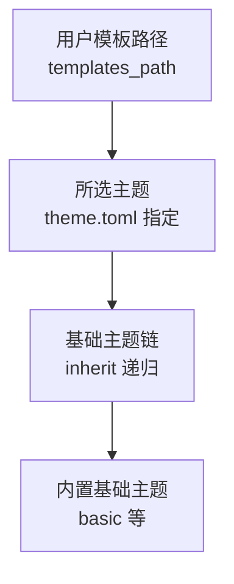
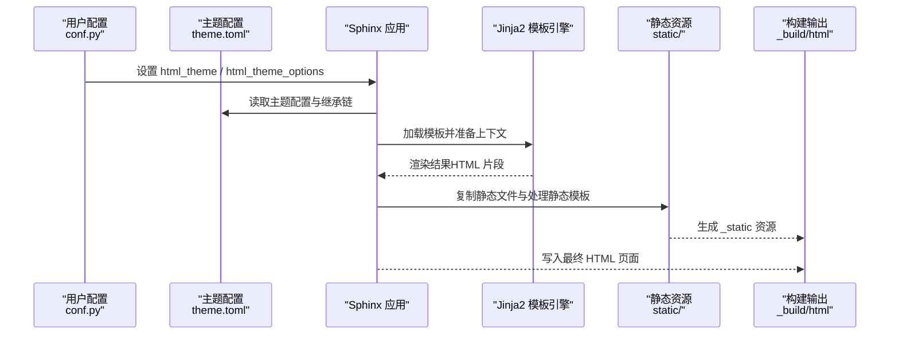
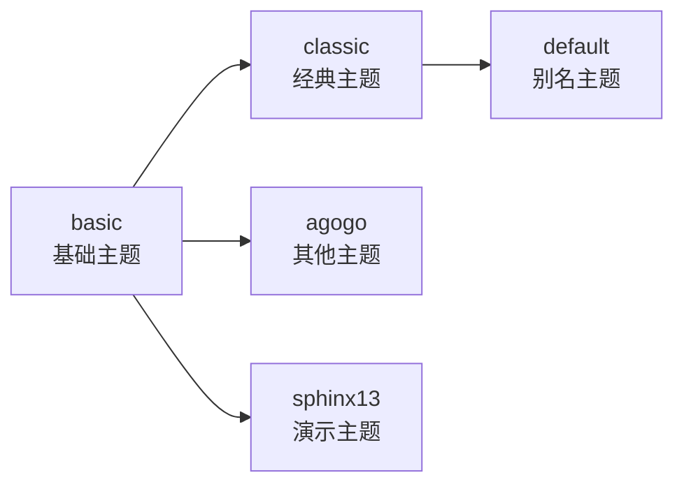

# 自定义主题开发

<cite>
**本文档引用的文件**
- [doc/usage/theming.rst](file://doc/usage/theming.rst)
- [doc/development/html_themes/index.rst](file://doc/development/html_themes/index.rst)
- [doc/development/html_themes/templating.rst](file://doc/development/html_themes/templating.rst)
- [sphinx/themes/basic/layout.html](file://sphinx/themes/basic/layout.html)
- [sphinx/themes/basic/theme.toml](file://sphinx/themes/basic/theme.toml)
- [sphinx/themes/classic/theme.toml](file://sphinx/themes/classic/theme.toml)
- [sphinx/themes/agogo/theme.toml](file://sphinx/themes/agogo/theme.toml)
- [sphinx/themes/default/theme.toml](file://sphinx/themes/default/theme.toml)
- [tests/test_theming/theme.toml](file://tests/test_theming/theme.toml)
- [tests/roots/test-build-html-theme-having-multiple-stylesheets/_themes/mytheme/theme.conf](file://tests/roots/test-build-html-theme-having-multiple-stylesheets/_themes/mytheme/theme.conf)
- [doc/_themes/sphinx13/theme.toml](file://doc/_themes/sphinx13/theme.toml)
</cite>

## 目录
1. [简介](#简介)
2. [项目结构](#项目结构)
3. [核心组件](#核心组件)
4. [架构总览](#架构总览)
5. [详细组件分析](#详细组件分析)
6. [依赖关系分析](#依赖关系分析)
7. [性能考量](#性能考量)
8. [故障排查指南](#故障排查指南)
9. [结论](#结论)
10. [附录](#附录)

## 简介
本指南面向希望基于 Sphinx 开发自定义 HTML 主题的工程师与文档作者。内容覆盖从主题目录结构、配置文件（theme.toml）编写、Jinja2 模板系统使用，到静态资源管理、响应式设计与跨浏览器兼容、主题打包与分发、调试与性能优化，以及完整示例路径指引。目标是帮助你在不深入阅读源码的前提下，快速搭建并交付高质量的 Sphinx 主题。

## 项目结构
一个可被 Sphinx 识别的主题通常由以下要素组成：
- 配置文件：theme.toml 或 theme.conf（推荐使用 theme.toml）
- HTML 模板：位于主题根目录或子目录中
- 静态资源：位于 static/ 目录下（支持 .jinja 静态模板）

主题在构建时遵循“用户模板路径 → 所选主题 → 基础主题（递归继承）”的查找顺序；若未找到对应模板，将回退到基础主题链。

**章节来源**
- [doc/development/html_themes/index.rst: 29–40:29-40](file://doc/development/html_themes/index.rst#L29-L40)
- [doc/development/html_themes/index.rst: 300–311:300-311](file://doc/development/html_themes/index.rst#L300-L311)

## 核心组件
- 主题配置文件（theme.toml）
  - [theme] 表：定义继承、样式表、侧边栏模板、Pygments 风格等
  - [options] 表：主题默认选项，可通过 html_theme_options 覆盖
- Jinja2 模板系统
  - 模板继承、块（block）、宏（macro）、全局变量与辅助函数
  - 支持静态模板（.jinja），用于在构建时注入主题选项
- 静态资源管理
  - CSS、JS、图片等放置于 static/，通过主题配置或模板自动引入
- 构建与输出
  - 模板渲染、静态文件复制、样式表与脚本链接生成

**章节来源**
- [doc/development/html_themes/index.rst: 40–110:40-110](file://doc/development/html_themes/index.rst#L40-L110)
- [doc/development/html_themes/templating.rst: 32–106:32-106](file://doc/development/html_themes/templating.rst#L32-L106)

## 架构总览
Sphinx 主题系统的核心流程如下：
- 解析主题配置（theme.toml），确定继承链、样式表、侧边栏模板
- 查找模板：优先用户 templates_path，其次主题，再递归基础主题
- 渲染页面：Jinja2 引擎将数据上下文与模板结合
- 复制静态资源：static/ 下的文件与静态模板产物进入 _build 输出

**图表来源**
- [doc/development/html_themes/index.rst: 300–311:300-311](file://doc/development/html_themes/index.rst#L300-L311)
- [doc/development/html_themes/index.rst: 320–346:320-346](file://doc/development/html_themes/index.rst#L320-L346)

**章节来源**
- [doc/development/html_themes/index.rst: 300–346:300-346](file://doc/development/html_themes/index.rst#L300-L346)

## 详细组件分析

### 主题配置文件（theme.toml）详解
- 继承设置（inherit）
  - 可指定基础主题名称或 "none"；支持多级继承形成链式结构
- 样式表配置（stylesheets）
  - 列表形式声明 CSS 文件名；可被 html_style 覆盖
- 侧边栏模板（sidebars）
  - 列表形式声明侧边栏模板文件名；可被 html_sidebars 覆盖
- Pygments 配色方案（pygments_style）
  - 支持 default 与 dark 两套风格，dark 在 prefers-color-scheme: dark 条件下生效
- 主题选项（[options]）
  - 键值对作为默认主题参数，可在模板中以 theme_<name> 访问

参考示例路径（不含代码内容）：
- [示例：basic 主题配置:1-24](file://sphinx/themes/basic/theme.toml#L1-L24)
- [示例：classic 主题配置:1-35](file://sphinx/themes/classic/theme.toml#L1-L35)
- [示例：agogo 主题配置:1-23](file://sphinx/themes/agogo/theme.toml#L1-L23)
- [示例：default 主题配置（继承 classic）:1-3](file://sphinx/themes/default/theme.toml#L1-L3)
- [示例：测试主题配置（多样式表）:1-11](file://tests/test_theming/theme.toml#L1-L11)
- [示例：theme.conf（历史格式，含多样式表）:1-4](file://tests/roots/test-build-html-theme-having-multiple-stylesheets/_themes/mytheme/theme.conf#L1-L4)

**章节来源**
- [doc/development/html_themes/index.rst: 40–110:40-110](file://doc/development/html_themes/index.rst#L40-L110)
- [doc/development/html_themes/index.rst: 111–177:111-177](file://doc/development/html_themes/index.rst#L111-L177)
- [doc/usage/theming.rst: 57–84:57-84](file://doc/usage/theming.rst#L57-L84)

### Jinja2 模板系统
- 模板继承与块（block）
  - 子模板通过  继承父模板，仅覆盖所需块
  - 使用 {{ super() }} 保留父模板内容
- 宏（macro）
  - 可在布局模板中定义如 relbar()、sidebar()、script()、css() 等复用片段
- 全局变量与辅助函数
  - 如 builder、docstitle、language、pathto()、hasdoc()、sidebar()、relbar() 等
- 静态模板（.jinja）
  - static/ 下以 .jinja 结尾的文件在构建时被模板引擎处理，后缀移除

参考示例路径（不含代码内容）：
- [基础布局模板（含宏与块）:1-210](file://sphinx/themes/basic/layout.html#L1-L210)
- [模板继承与块覆盖示例（文档说明）:88-105](file://doc/development/html_themes/templating.rst#L88-L105)
- [静态模板说明与示例:315-346](file://doc/development/html_themes/index.rst#L315-L346)

**章节来源**
- [doc/development/html_themes/templating.rst: 32–106:32-106](file://doc/development/html_themes/templating.rst#L32-L106)
- [doc/development/html_themes/templating.rst: 107–210:107-210](file://doc/development/html_themes/templating.rst#L107-L210)
- [doc/development/html_themes/templating.rst: 211–499:211-499](file://doc/development/html_themes/templating.rst#L211-L499)
- [doc/development/html_themes/index.rst: 315–346:315-346](file://doc/development/html_themes/index.rst#L315-L346)

### 静态资源管理
- static/ 目录
  - 存放 CSS、JS、图片等静态文件
  - 支持 .jinja 静态模板，在构建时处理并移除后缀
- 样式表与脚本注入
  - 通过 theme.toml 的 stylesheets 注入
  - 也可在模板中使用 css()、script() 宏或手动添加 link/script 标签
- 自定义静态文件与 JS 注入
  - 可通过扩展在构建完成后复制额外静态文件
  - 可通过 add_js_file 注入内联 JS 变量或脚本

参考示例路径（不含代码内容）：
- [静态模板处理规则:315-346](file://doc/development/html_themes/index.rst#L315-L346)
- [自定义静态文件复制示例（事件钩子）:432-452](file://doc/development/html_themes/index.rst#L432-L452)
- [基于配置注入 JS 变量示例:454-518](file://doc/development/html_themes/index.rst#L454-L518)

**章节来源**
- [doc/development/html_themes/index.rst: 315–346:315-346](file://doc/development/html_themes/index.rst#L315-L346)
- [doc/development/html_themes/index.rst: 432–518:432-518](file://doc/development/html_themes/index.rst#L432-L518)

### 响应式设计与跨浏览器兼容
- viewport 与语义化标签
  - 基础布局模板已包含 viewport 设置与 role 属性，便于无障碍与移动端适配
- 样式选择器与搜索结果分类
  - 可利用 Sphinx 生成的搜索结果 CSS 类进行差异化样式处理
- 字体与颜色
  - 通过主题选项控制字体族与颜色，避免硬编码

参考示例路径（不含代码内容）：
- [基础布局模板中的 viewport 与 role:96-143](file://sphinx/themes/basic/layout.html#L96-L143)
- [搜索结果分类样式说明:236-290](file://doc/development/html_themes/index.rst#L236-L290)

**章节来源**
- [sphinx/themes/basic/layout.html: 96–143:96-143](file://sphinx/themes/basic/layout.html#L96-L143)
- [doc/development/html_themes/index.rst: 236–290:236-290](file://doc/development/html_themes/index.rst#L236-L290)

### 主题打包与分发
- 目录或 ZIP 分发
  - 将主题目录或包含相同内容的 ZIP 文件置于 html_theme_path 指定的路径中
- Python 包分发
  - 在 pyproject.toml 中注册入口点 sphinx.html_themes，使用 add_html_theme 注册主题
- 使用第三方主题
  - 可通过 pip 安装第三方主题并在 conf.py 中启用

参考示例路径（不含代码内容）：
- [主题分发与安装说明:57-84](file://doc/usage/theming.rst#L57-L84)
- [Python 包分发与入口点示例:185-222](file://doc/development/html_themes/index.rst#L185-L222)

**章节来源**
- [doc/usage/theming.rst: 57–84:57-84](file://doc/usage/theming.rst#L57-L84)
- [doc/development/html_themes/index.rst: 185–222:185-222](file://doc/development/html_themes/index.rst#L185-L222)

### 主题开发调试与性能优化
- 调试技巧
  - 逐步替换模板块，确认渲染效果
  - 使用静态模板（.jinja）验证主题选项注入
  - 检查样式表加载顺序与冲突
- 性能优化
  - 合理拆分样式表，按需加载
  - 减少不必要的 DOM 结构与重复选择器
  - 使用缓存友好的静态资源命名策略

（本节为通用指导，无需特定文件引用）

## 依赖关系分析
主题的继承链决定了模板与静态资源的可用性。以下图展示了常见继承关系与配置要点：

**图表来源**
- [sphinx/themes/basic/theme.toml: 1-L24:1-24](file://sphinx/themes/basic/theme.toml#L1-L24)
- [sphinx/themes/classic/theme.toml: 1-L35:1-35](file://sphinx/themes/classic/theme.toml#L1-L35)
- [sphinx/themes/default/theme.toml: 1-L3:1-3](file://sphinx/themes/default/theme.toml#L1-L3)
- [sphinx/themes/agogo/theme.toml: 1-L23:1-23](file://sphinx/themes/agogo/theme.toml#L1-L23)
- [doc/_themes/sphinx13/theme.toml: 1-L5:1-5](file://doc/_themes/sphinx13/theme.toml#L1-L5)

**章节来源**
- [sphinx/themes/basic/theme.toml: 1-L24:1-24](file://sphinx/themes/basic/theme.toml#L1-L24)
- [sphinx/themes/classic/theme.toml: 1-L35:1-35](file://sphinx/themes/classic/theme.toml#L1-L35)
- [sphinx/themes/default/theme.toml: 1-L3:1-3](file://sphinx/themes/default/theme.toml#L1-L3)
- [sphinx/themes/agogo/theme.toml: 1-L23:1-23](file://sphinx/themes/agogo/theme.toml#L1-L23)
- [doc/_themes/sphinx13/theme.toml: 1-L5:1-5](file://doc/_themes/sphinx13/theme.toml#L1-L5)

## 性能考量
- 样式表与脚本合并与压缩
- 按需加载侧边栏与搜索框
- 避免在模板中进行复杂计算，尽量在 Python 扩展中预处理
- 使用静态模板而非运行时拼接大量字符串

（本节为通用指导，无需特定文件引用）

## 故障排查指南
- 主题未生效
  - 检查 html_theme 与 html_theme_path 是否正确
  - 确认 theme.toml 存在且语法正确
- 模板未覆盖
  - 确认用户 templates_path 中的同名模板优先级高于主题模板
  - 若覆盖基础模板，使用显式基础主题路径进行继承
- 静态资源缺失
  - 确认 static/ 下文件存在，必要时使用静态模板（.jinja）
  - 若需在构建后复制额外文件，检查扩展事件钩子是否正确连接
- 样式冲突
  - 检查 stylesheets 列表顺序与来源
  - 使用浏览器开发者工具定位具体样式来源

**章节来源**
- [doc/usage/theming.rst: 57–84:57-84](file://doc/usage/theming.rst#L57-L84)
- [doc/development/html_themes/index.rst: 300–311:300-311](file://doc/development/html_themes/index.rst#L300-L311)
- [doc/development/html_themes/index.rst: 315–346:315-346](file://doc/development/html_themes/index.rst#L315-L346)
- [doc/development/html_themes/index.rst: 432–518:432-518](file://doc/development/html_themes/index.rst#L432-L518)

## 结论
通过合理规划主题目录结构、规范编写 theme.toml、善用 Jinja2 模板与静态模板、有序管理静态资源，并结合响应式与兼容性最佳实践，你可以高效地开发出可维护、可分发、可定制的 Sphinx 主题。建议从基础主题（basic）开始，逐步增加样式与交互，最终形成稳定的主题包并通过 Python 包或目录/ZIP 形式分发给他人使用。

## 附录
- 快速开始步骤
  - 创建主题目录与 theme.toml
  - 编写基础布局模板（layout.html）与侧边栏模板
  - 在 static/ 中放置 CSS/JS/图片，并按需使用 .jinja 静态模板
  - 在 conf.py 中设置 html_theme 与 html_theme_options
  - 构建并预览，逐步迭代
- 参考示例路径（不含代码内容）
  - [基础布局模板:1-210](file://sphinx/themes/basic/layout.html#L1-L210)
  - [基础主题配置:1-24](file://sphinx/themes/basic/theme.toml#L1-L24)
  - [经典主题配置:1-35](file://sphinx/themes/classic/theme.toml#L1-L35)
  - [Agogo 主题配置:1-23](file://sphinx/themes/agogo/theme.toml#L1-L23)
  - [默认主题配置（继承）:1-3](file://sphinx/themes/default/theme.toml#L1-L3)
  - [测试主题配置（多样式表）:1-11](file://tests/test_theming/theme.toml#L1-L11)
  - [theme.conf 示例（历史格式）:1-4](file://tests/roots/test-build-html-theme-having-multiple-stylesheets/_themes/mytheme/theme.conf#L1-L4)
  - [演示主题配置（无侧边栏）:1-5](file://doc/_themes/sphinx13/theme.toml#L1-L5)