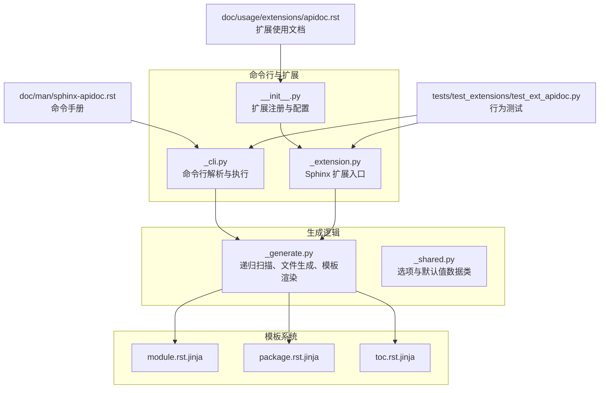
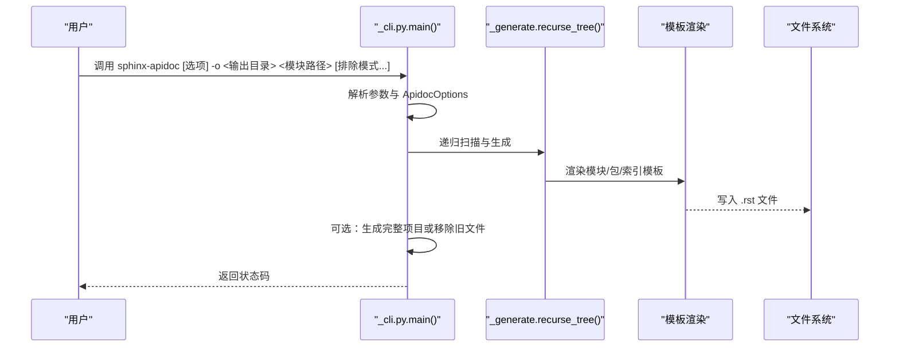
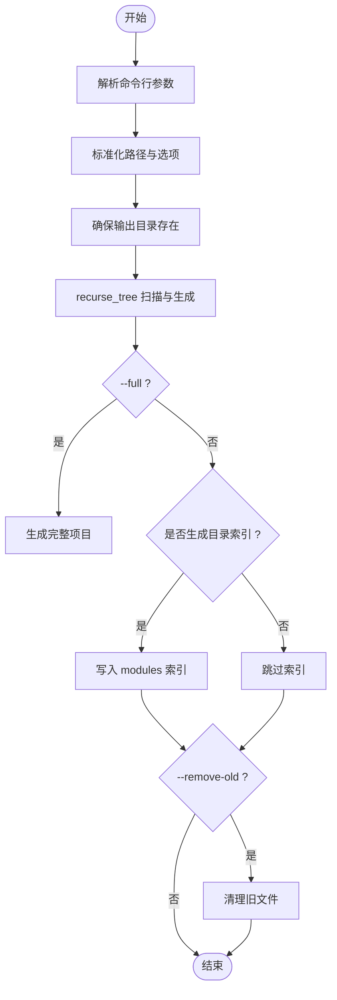
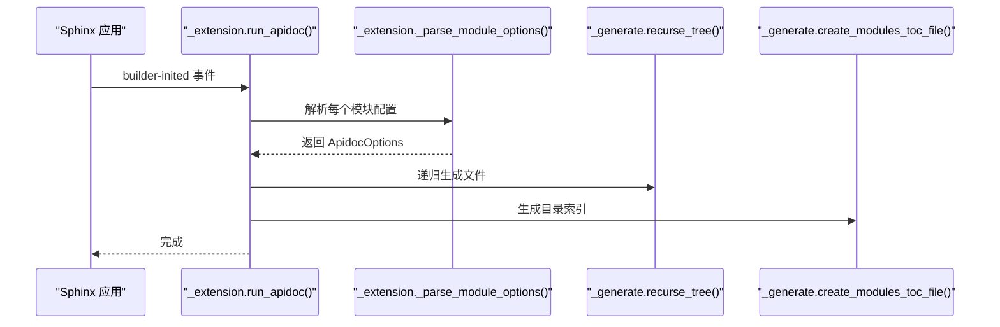
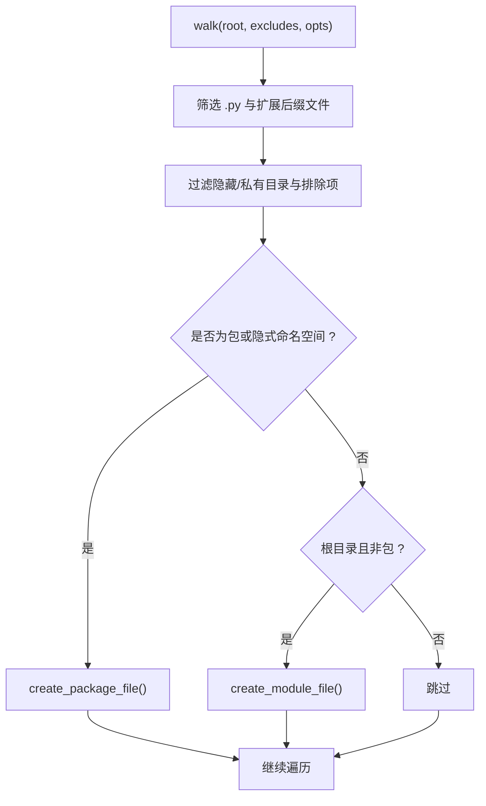
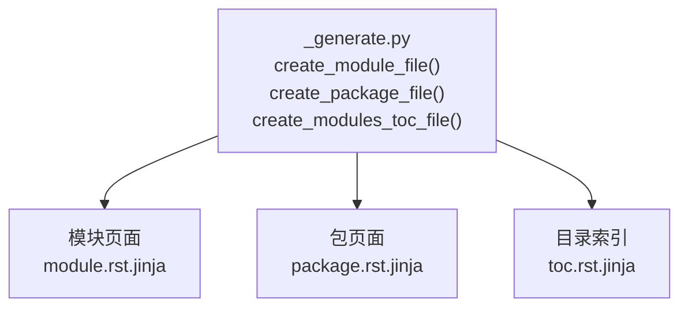
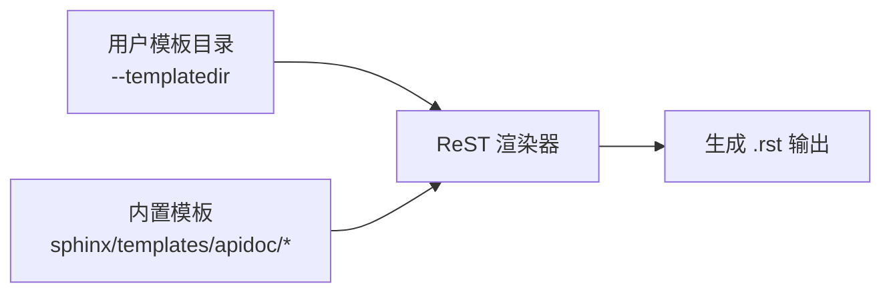
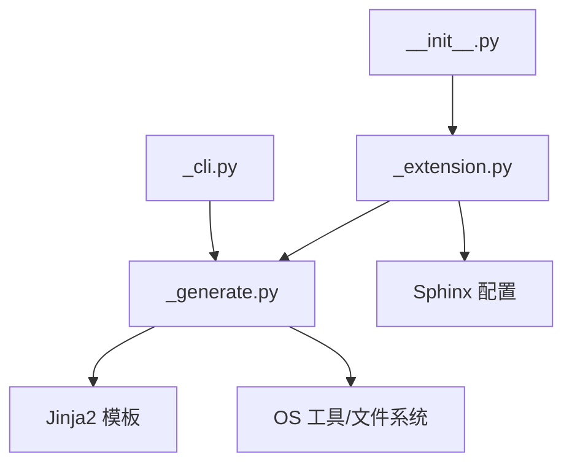

# sphinx-apidoc API 文档生成

<cite>
**本文引用的文件**
- [sphinx/ext/apidoc/__init__.py](file://sphinx/ext/apidoc/__init__.py)
- [sphinx/ext/apidoc/_cli.py](file://sphinx/ext/apidoc/_cli.py)
- [sphinx/ext/apidoc/_generate.py](file://sphinx/ext/apidoc/_generate.py)
- [sphinx/ext/apidoc/_shared.py](file://sphinx/ext/apidoc/_shared.py)
- [sphinx/ext/apidoc/_extension.py](file://sphinx/ext/apidoc/_extension.py)
- [doc/man/sphinx-apidoc.rst](file://doc/man/sphinx-apidoc.rst)
- [doc/usage/extensions/apidoc.rst](file://doc/usage/extensions/apidoc.rst)
- [tests/test_extensions/test_ext_apidoc.py](file://tests/test_extensions/test_ext_apidoc.py)
- [sphinx/templates/apidoc/module.rst.jinja](file://sphinx/templates/apidoc/module.rst.jinja)
- [sphinx/templates/apidoc/package.rst.jinja](file://sphinx/templates/apidoc/package.rst.jinja)
- [sphinx/templates/apidoc/toc.rst.jinja](file://sphinx/templates/apidoc/toc.rst.jinja)
- [tests/roots/test-ext-apidoc-custom-templates/_templates/module.rst.jinja](file://tests/roots/test-ext-apidoc-custom-templates/_templates/module.rst.jinja)
</cite>

## 目录
1. [简介](#简介)
2. [项目结构](#项目结构)
3. [核心组件](#核心组件)
4. [架构总览](#架构总览)
5. [详细组件分析](#详细组件分析)
6. [依赖分析](#依赖分析)
7. [性能考虑](#性能考虑)
8. [故障排除指南](#故障排除指南)
9. [结论](#结论)
10. [附录](#附录)

## 简介
本文件面向 sphinx-apidoc 命令，系统性阐述其自动 API 文档生成功能。该工具从 Python 包结构中扫描模块与包，生成 reStructuredText（.rst）文件，并通过 sphinx.ext.autodoc 扩展实现自动化 API 文档渲染。文档覆盖以下主题：
- 包扫描与模块发现、包结构分析、导入路径处理
- 生成文档结构：模块页面、包页面、子包页面的组织方式
- 关键选项：输出目录、包路径、排除模式、标题深度、缩进、符号链接跟随、干运行、强制覆盖、移除旧文件、生成完整项目、模板目录等
- 模板系统：内置模板与自定义模板的使用与修改
- 与 autodoc 的集成：生成的文档如何与自动文档功能配合
- 不同项目结构的处理示例：包式、模块式、隐式命名空间（PEP 420）
- 最佳实践：命名约定、文档注释规范、版本控制集成
- 故障排除与性能优化建议

## 项目结构
围绕 sphinx-apidoc 的核心代码位于 sphinx/ext/apidoc 下，命令行入口、扩展入口、生成逻辑与共享数据结构分别由独立模块承担；用户手册与使用文档位于 doc 目录；测试用例覆盖了多种项目结构与行为验证。

**图表来源**
- [sphinx/ext/apidoc/_cli.py:24-252](file://sphinx/ext/apidoc/_cli.py#L24-L252)
- [sphinx/ext/apidoc/_extension.py:43-91](file://sphinx/ext/apidoc/_extension.py#L43-L91)
- [sphinx/ext/apidoc/_generate.py:36-357](file://sphinx/ext/apidoc/_generate.py#L36-L357)
- [sphinx/ext/apidoc/_shared.py:36-100](file://sphinx/ext/apidoc/_shared.py#L36-L100)
- [sphinx/ext/apidoc/__init__.py:28-66](file://sphinx/ext/apidoc/__init__.py#L28-L66)
- [doc/man/sphinx-apidoc.rst:1-179](file://doc/man/sphinx-apidoc.rst#L1-L179)
- [doc/usage/extensions/apidoc.rst:1-173](file://doc/usage/extensions/apidoc.rst#L1-L173)
- [tests/test_extensions/test_ext_apidoc.py:1-800](file://tests/test_extensions/test_ext_apidoc.py#L1-L800)

**章节来源**
- [sphinx/ext/apidoc/_cli.py:24-252](file://sphinx/ext/apidoc/_cli.py#L24-L252)
- [sphinx/ext/apidoc/_extension.py:43-91](file://sphinx/ext/apidoc/_extension.py#L43-L91)
- [sphinx/ext/apidoc/_generate.py:36-357](file://sphinx/ext/apidoc/_generate.py#L36-L357)
- [sphinx/ext/apidoc/_shared.py:36-100](file://sphinx/ext/apidoc/_shared.py#L36-L100)
- [sphinx/ext/apidoc/__init__.py:28-66](file://sphinx/ext/apidoc/__init__.py#L28-L66)
- [doc/man/sphinx-apidoc.rst:1-179](file://doc/man/sphinx-apidoc.rst#L1-L179)
- [doc/usage/extensions/apidoc.rst:1-173](file://doc/usage/extensions/apidoc.rst#L1-L173)
- [tests/test_extensions/test_ext_apidoc.py:1-800](file://tests/test_extensions/test_ext_apidoc.py#L1-L800)

## 核心组件
- 命令行接口：解析参数、构建 ApidocOptions、调用递归扫描与文件生成、可选地生成完整项目与移除旧文件。
- 扩展接口：在 Sphinx 构建阶段自动运行，支持多模块配置、相对路径解析、默认配置合并。
- 生成器：遍历目录树、识别包与模块、过滤排除项、生成模块/包/索引文件、渲染模板。
- 共享数据结构：统一的 ApidocOptions 与 ApidocDefaults，便于 CLI 与扩展共享配置。
- 模板系统：内置模块、包、目录索引模板，支持用户自定义模板目录覆盖。

**章节来源**
- [sphinx/ext/apidoc/_cli.py:255-307](file://sphinx/ext/apidoc/_cli.py#L255-L307)
- [sphinx/ext/apidoc/_extension.py:43-91](file://sphinx/ext/apidoc/_extension.py#L43-L91)
- [sphinx/ext/apidoc/_generate.py:274-346](file://sphinx/ext/apidoc/_generate.py#L274-L346)
- [sphinx/ext/apidoc/_shared.py:36-100](file://sphinx/ext/apidoc/_shared.py#L36-L100)

## 架构总览
sphinx-apidoc 的工作流分为两条主线：
- 命令行模式：解析参数后直接执行生成与可选的完整项目生成。
- Sphinx 扩展模式：在 builder-inited 阶段读取配置，按模块列表逐个生成并写入目标目录。

**图表来源**
- [sphinx/ext/apidoc/_cli.py:255-279](file://sphinx/ext/apidoc/_cli.py#L255-L279)
- [sphinx/ext/apidoc/_generate.py:274-346](file://sphinx/ext/apidoc/_generate.py#L274-L346)

**章节来源**
- [sphinx/ext/apidoc/_cli.py:255-279](file://sphinx/ext/apidoc/_cli.py#L255-L279)
- [sphinx/ext/apidoc/_generate.py:274-346](file://sphinx/ext/apidoc/_generate.py#L274-L346)

## 详细组件分析

### 命令行接口与参数解析
- 支持的选项涵盖输出目录、最大深度、强制覆盖、符号链接跟随、干运行、分离模块、私有模块、目录索引文件名、禁用标题、模块优先、隐式命名空间、automodule 选项、文件后缀、移除旧文件、生成完整项目、追加 sys.path、项目信息、扩展启用、模板目录等。
- 参数解析后标准化路径、确保输出目录存在、处理 automodule 选项环境变量、构造 ApidocOptions 并交由生成器处理。
- 完整项目模式会基于生成的模块列表生成 conf.py、index.rst 等文件。

**图表来源**
- [sphinx/ext/apidoc/_cli.py:282-307](file://sphinx/ext/apidoc/_cli.py#L282-L307)
- [sphinx/ext/apidoc/_cli.py:309-357](file://sphinx/ext/apidoc/_cli.py#L309-L357)
- [sphinx/ext/apidoc/_generate.py:177-204](file://sphinx/ext/apidoc/_generate.py#L177-L204)

**章节来源**
- [sphinx/ext/apidoc/_cli.py:24-252](file://sphinx/ext/apidoc/_cli.py#L24-L252)
- [sphinx/ext/apidoc/_cli.py:255-357](file://sphinx/ext/apidoc/_cli.py#L255-L357)
- [doc/man/sphinx-apidoc.rst:33-179](file://doc/man/sphinx-apidoc.rst#L33-L179)

### 扩展接口与 Sphinx 集成
- 在扩展 setup 中注册配置项与事件监听，在 builder-inited 时运行 apidoc。
- 支持 apidoc_modules 列表，逐项解析路径、目标目录、排除模式、布尔选项与 automodule 选项，默认值来自配置。
- 路径解析遵循：模块路径可绝对或相对 confdir；目标目录相对 srcdir；排除模式相对 confdir 展开为绝对正则。

**图表来源**
- [sphinx/ext/apidoc/__init__.py:28-66](file://sphinx/ext/apidoc/__init__.py#L28-L66)
- [sphinx/ext/apidoc/_extension.py:43-91](file://sphinx/ext/apidoc/_extension.py#L43-L91)
- [sphinx/ext/apidoc/_extension.py:93-230](file://sphinx/ext/apidoc/_extension.py#L93-L230)
- [sphinx/ext/apidoc/_generate.py:177-204](file://sphinx/ext/apidoc/_generate.py#L177-L204)

**章节来源**
- [sphinx/ext/apidoc/__init__.py:28-66](file://sphinx/ext/apidoc/__init__.py#L28-L66)
- [sphinx/ext/apidoc/_extension.py:43-230](file://sphinx/ext/apidoc/_extension.py#L43-L230)
- [doc/usage/extensions/apidoc.rst:38-173](file://doc/usage/extensions/apidoc.rst#L38-L173)

### 包扫描与模块发现
- 递归遍历模块路径，支持符号链接跟随；仅处理 Python 源文件与扩展模块后缀；根据是否包含 __init__ 文件判断包。
- 隐式命名空间（PEP 420）模式下允许非包层级的模块被识别为命名空间包。
- 排除策略：支持隐藏目录（.）、私有目录（_）以及用户提供的模式；模块级排除还考虑私有模块开关。
- 生成顺序：包先于模块，可选“模块优先”。

**图表来源**
- [sphinx/ext/apidoc/_generate.py:236-264](file://sphinx/ext/apidoc/_generate.py#L236-L264)
- [sphinx/ext/apidoc/_generate.py:274-346](file://sphinx/ext/apidoc/_generate.py#L274-L346)
- [sphinx/ext/apidoc/_generate.py:207-234](file://sphinx/ext/apidoc/_generate.py#L207-L234)

**章节来源**
- [sphinx/ext/apidoc/_generate.py:236-346](file://sphinx/ext/apidoc/_generate.py#L236-L346)

### 文档结构与生成规则
- 模块页面：为每个可文档化的模块生成单独 .rst 文件，内容包含 automodule 指令与可选标题。
- 包页面：为每个包生成 .rst 文件，列出子包与子模块，并包含包级 automodule 指令；可选“分离模块”模式为每个子模块生成独立页面。
- 目录索引：生成 modules 索引文件，按模块名排序并去重，控制最大深度。
- 标题与布局：可通过 no-headings 控制是否生成标题；module-first 控制包内模块与包级文档的顺序。

**图表来源**
- [sphinx/ext/apidoc/_generate.py:82-107](file://sphinx/ext/apidoc/_generate.py#L82-L107)
- [sphinx/ext/apidoc/_generate.py:109-174](file://sphinx/ext/apidoc/_generate.py#L109-L174)
- [sphinx/ext/apidoc/_generate.py:177-204](file://sphinx/ext/apidoc/_generate.py#L177-L204)
- [sphinx/templates/apidoc/module.rst.jinja](file://sphinx/templates/apidoc/module.rst.jinja)
- [sphinx/templates/apidoc/package.rst.jinja](file://sphinx/templates/apidoc/package.rst.jinja)
- [sphinx/templates/apidoc/toc.rst.jinja](file://sphinx/templates/apidoc/toc.rst.jinja)

**章节来源**
- [sphinx/ext/apidoc/_generate.py:82-204](file://sphinx/ext/apidoc/_generate.py#L82-L204)

### 模板系统与自定义
- 内置模板位于 sphinx/templates/apidoc，包含模块、包、目录索引模板。
- 用户可通过 --templatedir 指定自定义模板目录，优先级高于内置模板。
- 测试中展示了自定义模块模板与包模板的覆盖行为，验证新旧文件名兼容。

**图表来源**
- [sphinx/ext/apidoc/_generate.py:82-107](file://sphinx/ext/apidoc/_generate.py#L82-L107)
- [sphinx/ext/apidoc/_generate.py:109-174](file://sphinx/ext/apidoc/_generate.py#L109-L174)
- [sphinx/ext/apidoc/_generate.py:177-204](file://sphinx/ext/apidoc/_generate.py#L177-L204)
- [doc/man/sphinx-apidoc.rst:146-163](file://doc/man/sphinx-apidoc.rst#L146-L163)
- [tests/roots/test-ext-apidoc-custom-templates/_templates/module.rst.jinja:1-3](file://tests/roots/test-ext-apidoc-custom-templates/_templates/module.rst.jinja#L1-L3)

**章节来源**
- [sphinx/ext/apidoc/_generate.py:82-204](file://sphinx/ext/apidoc/_generate.py#L82-L204)
- [doc/man/sphinx-apidoc.rst:146-163](file://doc/man/sphinx-apidoc.rst#L146-L163)
- [tests/roots/test-ext-apidoc-custom-templates/_templates/module.rst.jinja:1-3](file://tests/roots/test-ext-apidoc-custom-templates/_templates/module.rst.jinja#L1-L3)

### 与 autodoc 的集成
- 生成的 .rst 文件使用 automodule 指令，autodoc 在构建时动态导入模块以提取签名、文档字符串与成员信息。
- 若模块导入有副作用，autodoc 在构建时会执行这些副作用；应确保脚本入口受保护。
- 环境变量 SPHINX_APIDOC_OPTIONS 可为 automodule 默认附加选项。

**章节来源**
- [doc/man/sphinx-apidoc.rst:24-32](file://doc/man/sphinx-apidoc.rst#L24-L32)
- [sphinx/ext/apidoc/_generate.py:24-32](file://sphinx/ext/apidoc/_generate.py#L24-L32)
- [doc/usage/extensions/apidoc.rst:26-36](file://doc/usage/extensions/apidoc.rst#L26-L36)

### 不同项目结构的处理示例
- 包式结构：包含 __init__.py 的目录被视为包，生成包页面与子模块/子包索引。
- 模块式结构：顶层直接包含 .py 文件，生成模块页面。
- 隐式命名空间（PEP 420）：无需 __init__.py，支持 foo/bar/module.py 或 foo/bar/baz/__init__.py 的布局；可通过 --implicit-namespaces 启用。
- 分离模块：--separate 将子模块生成独立页面，便于细粒度导航。
- 私有模块：默认忽略以 _ 开头的模块，可通过 --private 包含。
- 排除模式：支持文件与目录的 fnmatch 风格模式，可排除特定子包或模块。

**章节来源**
- [tests/test_extensions/test_ext_apidoc.py:52-84](file://tests/test_extensions/test_ext_apidoc.py#L52-L84)
- [tests/test_extensions/test_ext_apidoc.py:99-145](file://tests/test_extensions/test_ext_apidoc.py#L99-L145)
- [tests/test_extensions/test_ext_apidoc.py:147-195](file://tests/test_extensions/test_ext_apidoc.py#L147-L195)
- [tests/test_extensions/test_ext_apidoc.py:229-245](file://tests/test_extensions/test_ext_apidoc.py#L229-L245)
- [tests/test_extensions/test_ext_apidoc.py:247-312](file://tests/test_extensions/test_ext_apidoc.py#L247-L312)
- [tests/test_extensions/test_ext_apidoc.py:461-478](file://tests/test_extensions/test_ext_apidoc.py#L461-L478)
- [tests/test_extensions/test_ext_apidoc.py:500-599](file://tests/test_extensions/test_ext_apidoc.py#L500-L599)
- [tests/test_extensions/test_ext_apidoc.py:601-642](file://tests/test_extensions/test_ext_apidoc.py#L601-L642)
- [tests/test_extensions/test_ext_apidoc.py:644-672](file://tests/test_extensions/test_ext_apidoc.py#L644-L672)
- [tests/test_extensions/test_ext_apidoc.py:674-694](file://tests/test_extensions/test_ext_apidoc.py#L674-L694)
- [tests/test_extensions/test_ext_apidoc.py:696-726](file://tests/test_extensions/test_ext_apidoc.py#L696-L726)
- [tests/test_extensions/test_ext_apidoc.py:728-753](file://tests/test_extensions/test_ext_apidoc.py#L728-L753)
- [tests/test_extensions/test_ext_apidoc.py:755-777](file://tests/test_extensions/test_ext_apidoc.py#L755-L777)
- [tests/test_extensions/test_ext_apidoc.py:779-800](file://tests/test_extensions/test_ext_apidoc.py#L779-L800)

## 依赖分析
- 组件耦合：CLI 与扩展均依赖生成器；生成器依赖模板渲染与 OS 工具；扩展依赖配置与日志。
- 外部依赖：autodoc 扩展在扩展模式下被显式加载；模板系统依赖 Jinja2 渲染器；文件系统操作通过 FileAvoidWrite 避免不必要的写入。

**图表来源**
- [sphinx/ext/apidoc/_cli.py:14-17](file://sphinx/ext/apidoc/_cli.py#L14-L17)
- [sphinx/ext/apidoc/_extension.py:10-17](file://sphinx/ext/apidoc/_extension.py#L10-L17)
- [sphinx/ext/apidoc/_generate.py:13-14](file://sphinx/ext/apidoc/_generate.py#L13-L14)
- [sphinx/ext/apidoc/__init__.py:31-32](file://sphinx/ext/apidoc/__init__.py#L31-L32)

**章节来源**
- [sphinx/ext/apidoc/_cli.py:14-17](file://sphinx/ext/apidoc/_cli.py#L14-L17)
- [sphinx/ext/apidoc/_extension.py:10-17](file://sphinx/ext/apidoc/_extension.py#L10-L17)
- [sphinx/ext/apidoc/_generate.py:13-14](file://sphinx/ext/apidoc/_generate.py#L13-L14)
- [sphinx/ext/apidoc/__init__.py:31-32](file://sphinx/ext/apidoc/__init__.py#L31-L32)

## 性能考虑
- 符号链接跟随：--follow-links 可能扩大扫描范围，谨慎使用以避免不必要的 IO。
- 排除模式：合理配置排除项可显著减少扫描与生成的工作量。
- 干运行：--dry-run 可在不写文件的情况下预览生成结果，辅助调试与规划。
- 自动化构建：在 CI 中缓存构建产物，避免重复生成；结合 --remove-old 与 FileAvoidWrite 减少增量构建成本。
- 模块数量与深度：--maxdepth 控制目录索引深度，避免过深导致索引膨胀。

[本节为通用建议，无需特定文件来源]

## 故障排除指南
- 导入副作用：若模块导入触发副作用，建议在模块入口处保护主程序逻辑，或在文档中明确警告。
- 路径问题：扩展模式下模块路径相对 confdir，目标目录相对 srcdir；请确认路径拼接正确。
- 权限与磁盘：移除旧文件失败时会记录警告，请检查权限与磁盘空间。
- 模板冲突：自定义模板与内置模板同名时，用户模板优先；如需回退，请删除或调整用户模板。
- 重复模块：某些平台后缀（如 .so）可能与 .py 重复出现，测试覆盖了去重逻辑，确保不会重复列出。

**章节来源**
- [doc/man/sphinx-apidoc.rst:24-32](file://doc/man/sphinx-apidoc.rst#L24-L32)
- [sphinx/ext/apidoc/_extension.py:105-162](file://sphinx/ext/apidoc/_extension.py#L105-L162)
- [sphinx/ext/apidoc/_shared.py:19-34](file://sphinx/ext/apidoc/_shared.py#L19-L34)
- [tests/test_extensions/test_ext_apidoc.py:728-753](file://tests/test_extensions/test_ext_apidoc.py#L728-L753)

## 结论
sphinx-apidoc 提供了从 Python 包结构自动生成 API 文档的完整链路：从包扫描、模块发现到 reStructuredText 文件生成，并通过 autodoc 实现高质量的 API 文档渲染。通过灵活的选项与模板系统，它能够适配多种项目结构与工作流；结合扩展模式可在 Sphinx 构建过程中无缝集成，提升自动化程度与一致性。

[本节为总结，无需特定文件来源]

## 附录

### 关键选项速查
- 输出目录：-o/--output-dir
- 最大深度：-d/--maxdepth
- 强制覆盖：-f/--force
- 符号链接：-l/--follow-links
- 干运行：-n/--dry-run
- 分离模块：-e/--separate
- 私有模块：-P/--private
- 目录索引文件名：--tocfile
- 禁用标题：-E/--no-headings
- 模块优先：-M/--module-first
- 隐式命名空间：--implicit-namespaces
- automodule 选项：--automodule-options
- 文件后缀：-s/--suffix
- 移除旧文件：--remove-old
- 生成完整项目：-F/--full
- 追加 sys.path：-a/--append-syspath
- 项目信息：-H/-A/-V/-R
- 模板目录：-t/--templatedir

**章节来源**
- [doc/man/sphinx-apidoc.rst:33-179](file://doc/man/sphinx-apidoc.rst#L33-L179)
- [sphinx/ext/apidoc/_cli.py:24-252](file://sphinx/ext/apidoc/_cli.py#L24-L252)

### 最佳实践
- 命名约定：模块与包名清晰表达职责；避免以 _ 开头的公共模块；使用稳定且可读的模块层次。
- 文档注释：为模块、类、函数与方法编写清晰的 docstring；必要时使用领域标记与字段列表。
- 版本控制：将生成的 .rst 文件纳入版本控制，以便追踪 API 变更；对生成脚本与模板进行版本管理。
- CI 集成：在 CI 中运行 apidoc 与构建，确保文档与代码同步更新。
- 模板维护：自定义模板应保持与内置模板的兼容性；定期审查与更新模板以适配新版本。

[本节为通用建议，无需特定文件来源]