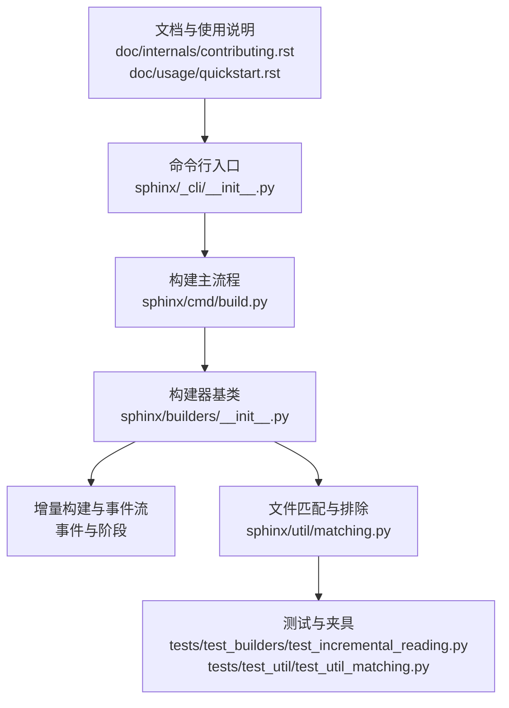
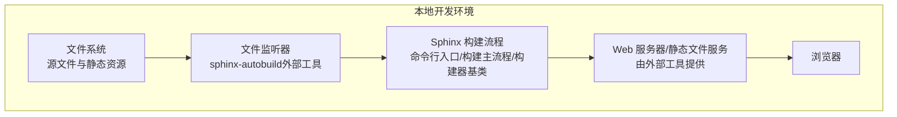
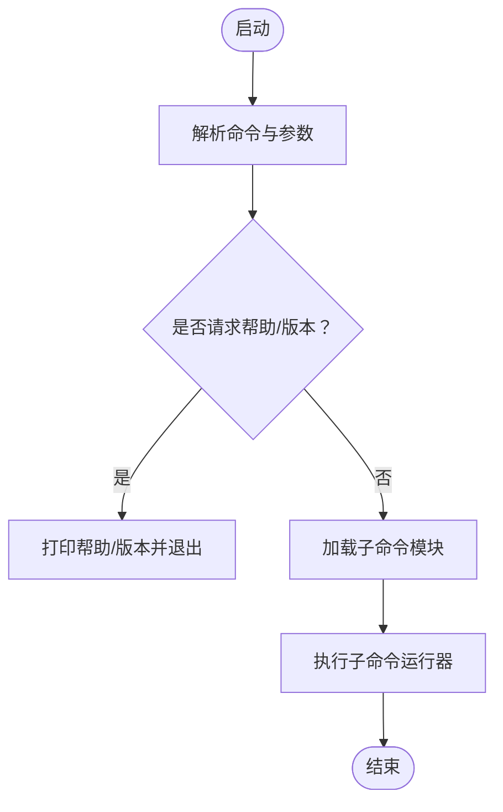
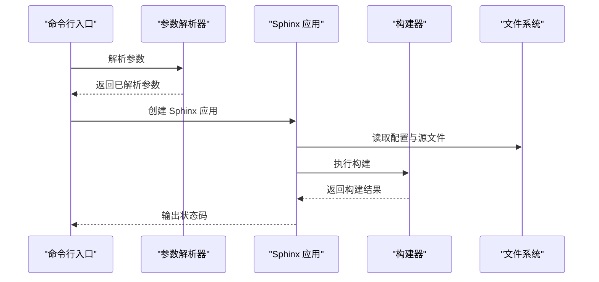
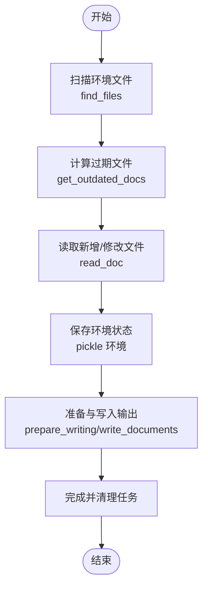
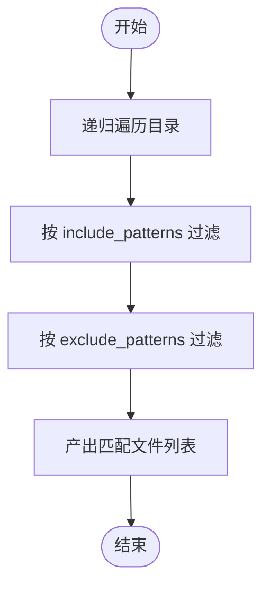

# sphinx-autobuild 实时构建工具

<cite>
**本文档引用的文件**
- [doc/internals/contributing.rst](file://doc/internals/contributing.rst)
- [doc/usage/quickstart.rst](file://doc/usage/quickstart.rst)
- [sphinx/_cli/__init__.py](file://sphinx/_cli/__init__.py)
- [sphinx/cmd/build.py](file://sphinx/cmd/build.py)
- [sphinx/builders/__init__.py](file://sphinx/builders/__init__.py)
- [sphinx/util/matching.py](file://sphinx/util/matching.py)
- [doc/usage/configuration.rst](file://doc/usage/configuration.rst)
- [tests/test_builders/test_incremental_reading.py](file://tests/test_builders/test_incremental_reading.py)
- [tests/roots/test-root/subdir/excluded.txt](file://tests/roots/test-root/subdir/excluded.txt)
- [tests/test_util/test_util_matching.py](file://tests/test_util/test_util_matching.py)
- [package-lock.json](file://package-lock.json)
</cite>

## 目录
1. [简介](#简介)
2. [项目结构](#项目结构)
3. [核心组件](#核心组件)
4. [架构总览](#架构总览)
5. [详细组件分析](#详细组件分析)
6. [依赖分析](#依赖分析)
7. [性能考虑](#性能考虑)
8. [故障排除指南](#故障排除指南)
9. [结论](#结论)
10. [附录](#附录)

## 简介
本文件面向 sphinx-autobuild 命令的使用者与维护者，系统化阐述其在 Sphinx 文档体系中的定位与工作机制。sphinx-autobuild 并非 Sphinx 核心的一部分，而是社区提供的独立工具，用于在本地实时监听源文件变化并自动触发构建与浏览器刷新，从而提升文档编写效率。

根据仓库文档，sphinx-autobuild 可以对文档进行“实时构建”，并在编辑时自动检测更改并刷新页面，适用于本地开发预览场景。该能力通过外部工具与 Sphinx 的标准构建流程协同实现：Sphinx 负责解析与生成，sphinx-autobuild 负责监听与刷新。

章节来源
- [doc/internals/contributing.rst:279-300](file://doc/internals/contributing.rst#L279-L300)
- [doc/usage/quickstart.rst:151-160](file://doc/usage/quickstart.rst#L151-L160)

## 项目结构
围绕 sphinx-autobuild 的相关线索主要分布在以下区域：
- 使用说明与示例：位于文档目录的贡献指南与快速开始文档中，明确给出命令用法与预期行为。
- 构建子系统：Sphinx 的命令行入口、构建主流程与构建器基类，体现标准构建路径与增量更新机制。
- 文件匹配与排除：提供 glob 风格的包含/排除模式，支撑增量扫描与过滤。
- 测试与夹具：验证增量读取、排除模式与匹配逻辑的行为一致性。

图表来源
- [doc/internals/contributing.rst:279-300](file://doc/internals/contributing.rst#L279-L300)
- [doc/usage/quickstart.rst:151-160](file://doc/usage/quickstart.rst#L151-L160)
- [sphinx/_cli/__init__.py:174-231](file://sphinx/_cli/__init__.py#L174-L231)
- [sphinx/cmd/build.py:70-288](file://sphinx/cmd/build.py#L70-L288)
- [sphinx/builders/__init__.py:64-120](file://sphinx/builders/__init__.py#L64-L120)
- [sphinx/util/matching.py:115-179](file://sphinx/util/matching.py#L115-L179)

章节来源
- [doc/internals/contributing.rst:279-300](file://doc/internals/contributing.rst#L279-L300)
- [doc/usage/quickstart.rst:151-160](file://doc/usage/quickstart.rst#L151-L160)
- [sphinx/_cli/__init__.py:174-231](file://sphinx/_cli/__init__.py#L174-L231)
- [sphinx/cmd/build.py:70-288](file://sphinx/cmd/build.py#L70-L288)
- [sphinx/builders/__init__.py:64-120](file://sphinx/builders/__init__.py#L64-L120)
- [sphinx/util/matching.py:115-179](file://sphinx/util/matching.py#L115-L179)

## 核心组件
- 命令行入口与帮助系统：负责解析主命令与子命令、格式化帮助输出，并处理版本与帮助请求。
- 构建主流程：解析参数、初始化应用与环境、执行构建并返回状态码。
- 构建器基类：定义构建阶段、增量更新策略、读写流程与事件钩子，是增量构建与文件扫描的基础。
- 文件匹配与排除：提供 glob 风格的包含/排除模式，支持递归遍历与优先级控制。
- 配置项：提供 include_patterns 与 exclude_patterns，用于控制源文件集合与静态资源扫描范围。

章节来源
- [sphinx/_cli/__init__.py:174-231](file://sphinx/_cli/__init__.py#L174-L231)
- [sphinx/cmd/build.py:70-288](file://sphinx/cmd/build.py#L70-L288)
- [sphinx/builders/__init__.py:64-120](file://sphinx/builders/__init__.py#L64-L120)
- [sphinx/util/matching.py:115-179](file://sphinx/util/matching.py#L115-L179)
- [doc/usage/configuration.rst:1094-1129](file://doc/usage/configuration.rst#L1094-L1129)

## 架构总览
下图展示了 sphinx-autobuild 在本地开发中的典型工作流：外部工具监听源文件变化，调用 Sphinx 的构建流程，最终由浏览器或刷新机制呈现最新内容。

图表来源
- [doc/internals/contributing.rst:291-299](file://doc/internals/contributing.rst#L291-L299)
- [doc/usage/quickstart.rst:151-159](file://doc/usage/quickstart.rst#L151-L159)
- [sphinx/_cli/__init__.py:174-231](file://sphinx/_cli/__init__.py#L174-L231)
- [sphinx/cmd/build.py:70-288](file://sphinx/cmd/build.py#L70-L288)
- [sphinx/builders/__init__.py:64-120](file://sphinx/builders/__init__.py#L64-L120)

## 详细组件分析

### 组件一：命令行入口与帮助系统
- 功能要点
  - 解析主命令与子命令，支持版本与帮助输出。
  - 格式化帮助文本，按组展示选项与描述。
  - 处理颜色输出与国际化。
- 关键行为
  - 当传入版本或帮助标志时，直接输出并退出。
  - 对未知命令抛出错误并提示可用命令列表。
- 与实时构建的关系
  - 提供统一的命令行入口，sphinx-autobuild 作为外部工具可复用或参考其参数解析与日志输出风格。

图表来源
- [sphinx/_cli/__init__.py:174-231](file://sphinx/_cli/__init__.py#L174-L231)
- [sphinx/_cli/__init__.py:270-277](file://sphinx/_cli/__init__.py#L270-L277)
- [sphinx/_cli/__init__.py:293-307](file://sphinx/_cli/__init__.py#L293-L307)

章节来源
- [sphinx/_cli/__init__.py:174-231](file://sphinx/_cli/__init__.py#L174-L231)
- [sphinx/_cli/__init__.py:270-277](file://sphinx/_cli/__init__.py#L270-L277)
- [sphinx/_cli/__init__.py:293-307](file://sphinx/_cli/__init__.py#L293-L307)

### 组件二：构建主流程（参数解析与执行）
- 功能要点
  - 定义构建所需的参数组：通用选项、路径选项、构建配置、控制台输出、警告控制等。
  - 解析 confdir/doctreedir，校验参数组合合法性。
  - 初始化应用与环境，执行构建并处理异常。
- 关键行为
  - 支持并行构建（jobs 参数），支持强制全量构建与新鲜环境。
  - 将警告输出到指定文件，支持将异常转为调试器或堆栈追踪。
- 与实时构建的关系
  - sphinx-autobuild 可以复用该流程，仅在监听循环中重复调用构建主流程。

图表来源
- [sphinx/cmd/build.py:70-288](file://sphinx/cmd/build.py#L70-L288)
- [sphinx/cmd/build.py:395-453](file://sphinx/cmd/build.py#L395-L453)

章节来源
- [sphinx/cmd/build.py:70-288](file://sphinx/cmd/build.py#L70-L288)
- [sphinx/cmd/build.py:395-453](file://sphinx/cmd/build.py#L395-L453)

### 组件三：构建器基类（增量构建与事件）
- 功能要点
  - 定义构建阶段（初始化、一致性检查、解析、写入、完成）。
  - 提供 build_all/build_specific/build_update 三种构建策略。
  - 通过事件钩子（如 env-get-outdated、env-before-read-docs、env-updated）扩展构建过程。
- 关键行为
  - build_update 基于 get_outdated_docs 计算过期文档集合。
  - read 阶段扫描环境文件，识别新增/修改/删除的文件并触发相应事件。
  - write 阶段准备与复制资产，按需并行写入。
- 与实时构建的关系
  - 增量构建的核心在于“只重建过期目标”，sphinx-autobuild 可基于此策略减少不必要的刷新。

图表来源
- [sphinx/builders/__init__.py:371-387](file://sphinx/builders/__init__.py#L371-L387)
- [sphinx/builders/__init__.py:469-577](file://sphinx/builders/__init__.py#L469-L577)
- [sphinx/builders/__init__.py:705-763](file://sphinx/builders/__init__.py#L705-L763)

章节来源
- [sphinx/builders/__init__.py:371-387](file://sphinx/builders/__init__.py#L371-L387)
- [sphinx/builders/__init__.py:469-577](file://sphinx/builders/__init__.py#L469-L577)
- [sphinx/builders/__init__.py:705-763](file://sphinx/builders/__init__.py#L705-L763)

### 组件四：文件匹配与排除（包含/排除模式）
- 功能要点
  - 提供 glob 风格的 include_patterns 与 exclude_patterns。
  - translate_pattern 将通配符转换为正则表达式，支持单星不跨斜杠、双星跨斜杠等语义。
  - get_matching_files 递归遍历目录，先包含后排除，优先级明确。
- 关键行为
  - DOTFILES 等内置匹配器用于过滤隐藏文件。
  - Matcher 类支持多模式匹配与缓存，提高性能。
- 与实时构建的关系
  - 排除规则直接影响监听范围与扫描开销；合理配置可避免无关文件干扰。

图表来源
- [sphinx/util/matching.py:115-179](file://sphinx/util/matching.py#L115-L179)
- [sphinx/util/matching.py:69-86](file://sphinx/util/matching.py#L69-L86)

章节来源
- [sphinx/util/matching.py:115-179](file://sphinx/util/matching.py#L115-L179)
- [sphinx/util/matching.py:69-86](file://sphinx/util/matching.py#L69-L86)
- [doc/usage/configuration.rst:1094-1129](file://doc/usage/configuration.rst#L1094-L1129)

### 组件五：配置项与排除规则
- 关键配置
  - exclude_patterns：默认为空，支持 glob 语法，优先于 include_patterns。
  - include_patterns：默认包含所有文件，可限制扫描范围。
- 行为验证
  - 测试覆盖了多种包含/排除组合与不存在模式的情形，确保行为一致。

章节来源
- [doc/usage/configuration.rst:1094-1129](file://doc/usage/configuration.rst#L1094-L1129)
- [tests/test_util/test_util_matching.py:141-183](file://tests/test_util/test_util_matching.py#L141-L183)
- [tests/test_util/test_util_matching.py:186-223](file://tests/test_util/test_util_matching.py#L186-L223)
- [tests/test_builders/test_incremental_reading.py:26-38](file://tests/test_builders/test_incremental_reading.py#L26-L38)

## 依赖分析
- 外部依赖线索
  - 仓库内包含 Node.js 生态相关依赖（如 serve-static、fresh、ws 等），这些通常与本地开发服务器或浏览器刷新机制有关联，可用于理解实时预览的实现背景。
- 与 sphinx-autobuild 的关系
  - 本仓库未直接包含 sphinx-autobuild 的实现代码；上述依赖表明本地开发环境可能借助 Node 工具链实现热重载与刷新。

章节来源
- [package-lock.json:1166-1201](file://package-lock.json#L1166-L1201)
- [package-lock.json:1635-1656](file://package-lock.json#L1635-L1656)

## 性能考虑
- 并行构建
  - 通过 jobs 参数启用多进程并行，显著缩短大型项目的构建时间。
- 增量构建
  - 仅重建过期目标，减少不必要的写入与渲染。
- 文件扫描优化
  - 合理配置 include_patterns 与 exclude_patterns，缩小扫描范围。
- 日志与输出
  - 控制台输出级别与警告文件可降低 I/O 开销，便于 CI 或自动化场景。

章节来源
- [sphinx/cmd/build.py:123-134](file://sphinx/cmd/build.py#L123-L134)
- [sphinx/builders/__init__.py:371-387](file://sphinx/builders/__init__.py#L371-L387)
- [sphinx/util/matching.py:115-179](file://sphinx/util/matching.py#L115-L179)

## 故障排除指南
- 端口冲突
  - 若本地开发服务器占用端口，需调整端口或释放占用进程。
- 权限问题
  - 确保输出目录具有写权限；在受限环境中使用管理员权限或切换到有权限的目录。
- 内存不足
  - 减少并行度（jobs 参数）、关闭不必要的扩展或清理缓存后再试。
- 构建失败
  - 使用 -W/--fail-on-warning 将警告视为错误，便于早期发现与修复。
  - 检查 conf.py 中的 include_patterns 与 exclude_patterns 是否导致关键文件被排除。
- 监听无效
  - 确认 sphinx-autobuild 正确监听源目录；检查 exclude_patterns 与文件系统权限。

章节来源
- [sphinx/cmd/build.py:252-284](file://sphinx/cmd/build.py#L252-L284)
- [doc/usage/configuration.rst:1094-1129](file://doc/usage/configuration.rst#L1094-L1129)

## 结论
sphinx-autobuild 通过与 Sphinx 标准构建流程的协作，实现了本地文档的实时预览与自动刷新。其核心依赖于：
- Sphinx 的命令行入口与构建主流程，保证构建的稳定性与一致性；
- 构建器基类的增量构建机制，确保只重建必要的目标；
- 文件匹配与排除规则，控制扫描范围与性能；
- 配置项（include_patterns/exclude_patterns）与测试用例，保障行为可预测。

对于实际使用，建议结合合理的排除规则、适度的并行度与严格的警告策略，以获得最佳的开发体验。

## 附录
- 使用示例（来自仓库文档）
  - 快速开始示例：使用 sphinx-autobuild 在本地实时预览文档。
  - 贡献指南示例：在文档构建章节中提供 sphinx-autobuild 的命令用法与预期行为。

章节来源
- [doc/usage/quickstart.rst:151-159](file://doc/usage/quickstart.rst#L151-L159)
- [doc/internals/contributing.rst:291-299](file://doc/internals/contributing.rst#L291-L299)