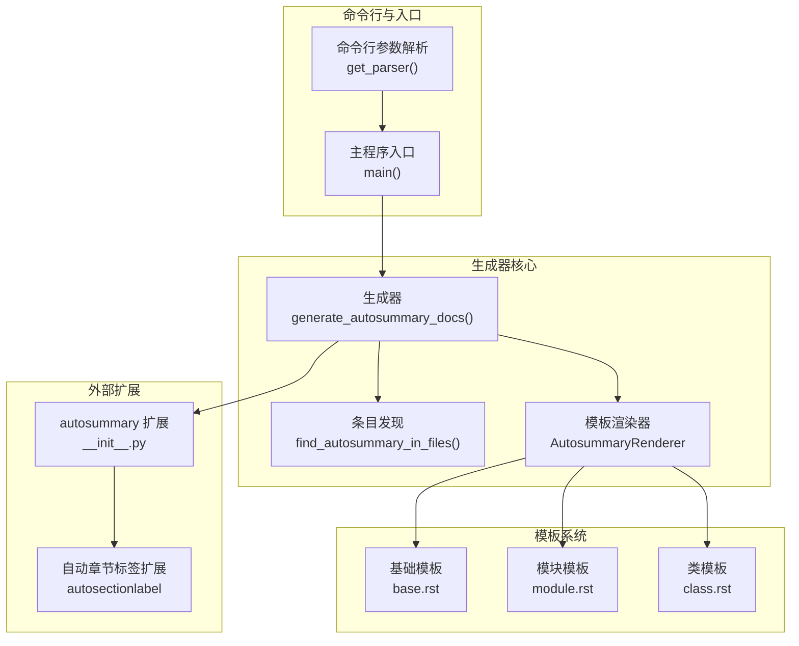
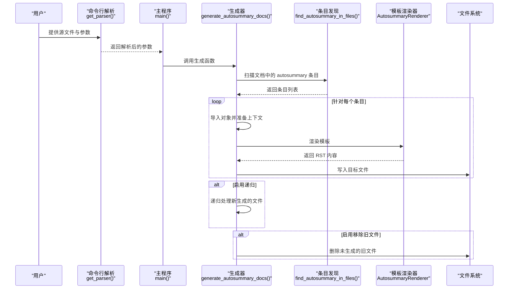
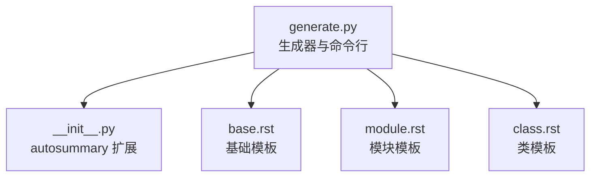

# sphinx-autogen 文档模板生成

<cite>
**本文引用的文件**
- [sphinx-autogen.rst](file://doc/man/sphinx-autogen.rst)
- [generate.py](file://sphinx/ext/autosummary/generate.py)
- [__init__.py](file://sphinx/ext/autosummary/__init__.py)
- [base.rst](file://sphinx/ext/autosummary/templates/autosummary/base.rst)
- [module.rst](file://sphinx/ext/autosummary/templates/autosummary/module.rst)
- [class.rst](file://sphinx/ext/autosummary/templates/autosummary/class.rst)
- [test_ext_autosummary.py](file://tests/test_ext_autosummary/test_ext_autosummary.py)
- [autosectionlabel.rst](file://doc/usage/extensions/autosectionlabel.rst)
- [test_ext_autosectionlabel.py](file://tests/test_extensions/test_ext_autosectionlabel.py)
</cite>

## 目录
1. [简介](#简介)
2. [项目结构](#项目结构)
3. [核心组件](#核心组件)
4. [架构总览](#架构总览)
5. [详细组件分析](#详细组件分析)
6. [依赖分析](#依赖分析)
7. [性能考虑](#性能考虑)
8. [故障排除指南](#故障排除指南)
9. [结论](#结论)
10. [附录](#附录)

## 简介
sphinx-autogen 是一个命令行工具，用于根据 reStructuredText 文档中的 autosummary 指令自动生成标准的文档模板文件。它通过扫描源文档中的 autosummary 条目，导入对应的 Python 对象，利用 autosummary 模板系统渲染出包含相应 autodoc 指令的 RST 模板文件，从而为后续构建生成完整的 API 文档。

该工具与 autosummary 扩展紧密协作，能够自动识别模块、类、函数、属性等对象类型，并根据模板生成相应的 autodoc 指令（如 automodule、autoclass、autoattribute 等）。同时支持自定义模板目录、成员过滤策略（是否包含导入成员、是否严格遵循 __all__）、输出后缀名以及批量清理旧文件等功能。

## 项目结构
sphinx-autogen 的实现位于 autosummary 子系统中，核心逻辑集中在 generate.py 中，配合 autosummary 模板系统完成模板渲染。命令行入口解析参数并调用生成流程，最终输出标准的 reStructuredText 模板文件。

**图表来源**
- [generate.py:873-954](file://sphinx/ext/autosummary/generate.py#L873-L954)
- [generate.py:957-993](file://sphinx/ext/autosummary/generate.py#L957-L993)
- [generate.py:610-733](file://sphinx/ext/autosummary/generate.py#L610-L733)
- [generate.py:739-870](file://sphinx/ext/autosummary/generate.py#L739-L870)
- [__init__.py:192-264](file://sphinx/ext/autosummary/__init__.py#L192-L264)
- [base.rst:1-6](file://sphinx/ext/autosummary/templates/autosummary/base.rst#L1-L6)
- [module.rst:1-61](file://sphinx/ext/autosummary/templates/autosummary/module.rst#L1-L61)
- [class.rst:1-30](file://sphinx/ext/autosummary/templates/autosummary/class.rst#L1-L30)

**章节来源**
- [sphinx-autogen.rst:1-103](file://doc/man/sphinx-autogen.rst#L1-L103)
- [generate.py:1-13](file://sphinx/ext/autosummary/generate.py#L1-L13)
- [generate.py:873-954](file://sphinx/ext/autosummary/generate.py#L873-L954)

## 核心组件
- 命令行参数解析：负责解析输出目录、模板目录、成员过滤、后缀名、移除旧文件等选项。
- 生成器：扫描源文档中的 autosummary 条目，导入对应对象，渲染模板并写入目标文件。
- 模板渲染器：基于 Jinja2 环境加载模板，注入上下文变量并渲染输出。
- 模板系统：提供基础模板与针对不同对象类型的专用模板（模块、类等）。
- autosummary 扩展：提供 autosummary 指令、签名提取、摘要提取等能力，与 autogen 协同工作。
- 自动章节标签扩展：为文档生成稳定的章节标签，便于交叉引用。

**章节来源**
- [generate.py:957-993](file://sphinx/ext/autosummary/generate.py#L957-L993)
- [generate.py:610-733](file://sphinx/ext/autosummary/generate.py#L610-L733)
- [generate.py:116-154](file://sphinx/ext/autosummary/generate.py#L116-L154)
- [__init__.py:192-264](file://sphinx/ext/autosummary/__init__.py#L192-L264)
- [base.rst:1-6](file://sphinx/ext/autosummary/templates/autosummary/base.rst#L1-L6)
- [module.rst:1-61](file://sphinx/ext/autosummary/templates/autosummary/module.rst#L1-L61)
- [class.rst:1-30](file://sphinx/ext/autosummary/templates/autosummary/class.rst#L1-L30)

## 架构总览
sphinx-autogen 的执行流程从命令行开始，解析参数后构造一个简化的应用环境，然后扫描源文档中的 autosummary 条目，导入对应的 Python 对象，使用模板渲染器生成 RST 内容，并写入到指定输出目录。对于模块对象，还会递归生成子模块的模板文件。

**图表来源**
- [generate.py:873-954](file://sphinx/ext/autosummary/generate.py#L873-L954)
- [generate.py:957-993](file://sphinx/ext/autosummary/generate.py#L957-L993)
- [generate.py:610-733](file://sphinx/ext/autosummary/generate.py#L610-L733)
- [generate.py:739-870](file://sphinx/ext/autosummary/generate.py#L739-L870)

## 详细组件分析

### 命令行接口与参数
- 输出目录：-o/--output-dir，指定生成文件的放置路径，默认使用 autosummary 指令的 :toctree: 选项值。
- 后缀名：-s/--suffix，设置生成文件的默认后缀，默认为 rst。
- 模板目录：-t/--templates，自定义模板目录，优先于系统模板。
- 成员过滤：
  - -i/--imported-members：包含导入的成员。
  - -a/--respect-module-all：严格遵循模块的 __all__ 属性，仅文档列出的成员。
- 移除旧文件：--remove-old，在输出目录中删除不再生成的旧文件。

这些参数在命令行解析器中定义，并在主程序中传递给生成流程。

**章节来源**
- [sphinx-autogen.rst:20-50](file://doc/man/sphinx-autogen.rst#L20-L50)
- [generate.py:873-954](file://sphinx/ext/autosummary/generate.py#L873-L954)
- [generate.py:957-993](file://sphinx/ext/autosummary/generate.py#L957-L993)

### 模板生成规则与渲染
模板渲染器使用 Jinja2 环境加载模板，支持系统模板与自定义模板目录。模板名称优先使用条目指定的 :template: 选项，否则根据对象类型选择对应的模板（如 module、class 等），若都不可用则回退到基础模板 base.rst。

- 基础模板：为所有对象类型提供通用的标题与当前模块声明，以及对应的 autodoc 指令占位。
- 模块模板：为模块对象生成包含属性、函数、类、异常与子模块的结构化模板，并可递归生成子模块的模板。
- 类模板：为类对象生成包含方法与属性的模板，自动添加 __init__ 方法。

渲染时会注入上下文变量，如 fullname、module、objname、name、objtype、members、functions、classes、exceptions、attributes、modules 等，确保模板可以按需展示各类成员。

**章节来源**
- [generate.py:116-154](file://sphinx/ext/autosummary/generate.py#L116-L154)
- [base.rst:1-6](file://sphinx/ext/autosummary/templates/autosummary/base.rst#L1-L6)
- [module.rst:1-61](file://sphinx/ext/autosummary/templates/autosummary/module.rst#L1-L61)
- [class.rst:1-30](file://sphinx/ext/autosummary/templates/autosummary/class.rst#L1-L30)

### 自动章节标签扩展（autosectionlabel）集成
sphinx-autogen 生成的模板文件遵循标准的 reStructuredText 结构，其中包含由 autosummary 扩展生成的 autodoc 指令。当启用 autosectionlabel 扩展时，文档中的章节标题会被自动赋予稳定的标签，便于跨文档引用。

- autosectionlabel 可通过配置项控制标签前缀与最大深度，避免重复标题导致的歧义。
- 在 CI/CD 流水线中，建议先运行 sphinx-autogen 生成模板，再运行 sphinx-build 构建文档，以确保 autosectionlabel 能正确解析生成的章节标签。

**章节来源**
- [autosectionlabel.rst:1-63](file://doc/usage/extensions/autosectionlabel.rst#L1-L63)
- [test_ext_autosectionlabel.py:14-87](file://tests/test_extensions/test_ext_autosectionlabel.py#L14-L87)

### 批量处理与最佳实践
- 批量处理：通过通配符或文件列表一次性传入多个源文件，生成器会扫描所有文件中的 autosummary 条目并统一处理。
- 成员过滤：在大型项目中，建议结合 -a/--respect-module-all 与 -i/--imported-members 控制生成范围，减少冗余文件。
- 模板定制：通过 -t/--templates 指定自定义模板目录，覆盖系统模板以满足特定格式需求。
- 清理旧文件：在迭代生成过程中，使用 --remove-old 定期清理不再需要的旧模板文件，保持输出目录整洁。

**章节来源**
- [sphinx-autogen.rst:51-98](file://doc/man/sphinx-autogen.rst#L51-L98)
- [generate.py:957-993](file://sphinx/ext/autosummary/generate.py#L957-L993)

### 与其他自动化工具的集成
- CI/CD 流水线：在构建步骤中先执行 sphinx-autogen 生成模板，再执行 sphinx-build 进行文档构建，确保模板与最终文档一致。
- 版本控制：将生成的模板纳入版本控制，以便追踪模板变更；同时保留 --remove-old 选项在构建脚本中定期清理过时文件。
- 多语言与国际化：结合 autosummary 的国际化支持与 autosectionlabel 的标签生成，确保多语言文档的交叉引用稳定可靠。

**章节来源**
- [generate.py:957-993](file://sphinx/ext/autosummary/generate.py#L957-L993)
- [autosectionlabel.rst:34-55](file://doc/usage/extensions/autosectionlabel.rst#L34-L55)

## 依赖分析
sphinx-autogen 的核心依赖关系如下：

**图表来源**
- [generate.py:1-13](file://sphinx/ext/autosummary/generate.py#L1-L13)
- [__init__.py:1-47](file://sphinx/ext/autosummary/__init__.py#L1-L47)
- [base.rst:1-6](file://sphinx/ext/autosummary/templates/autosummary/base.rst#L1-L6)
- [module.rst:1-61](file://sphinx/ext/autosummary/templates/autosummary/module.rst#L1-L61)
- [class.rst:1-30](file://sphinx/ext/autosummary/templates/autosummary/class.rst#L1-L30)

**章节来源**
- [generate.py:1-13](file://sphinx/ext/autosummary/generate.py#L1-L13)
- [__init__.py:1-47](file://sphinx/ext/autosummary/__init__.py#L1-L47)

## 性能考虑
- 批量扫描：生成器会一次性扫描所有源文件中的 autosummary 条目，建议合理组织源文件结构，避免过多无关文件参与扫描。
- 递归生成：启用递归时会对新生成的文件再次扫描，注意控制递归深度与生成范围，防止无限循环或过度生成。
- 模板渲染：自定义模板可能增加渲染开销，建议优化模板复杂度，减少不必要的条件判断与循环。
- 文件 I/O：频繁的文件读写会影响性能，建议在 CI 环境中使用缓存与增量构建策略。

[本节为通用指导，无需具体文件分析]

## 故障排除指南
- 导入失败：当 autosummary 条目无法导入时，生成器会记录警告信息并跳过该条目。检查 Python 路径与模块可见性，确保依赖已安装且可被导入。
- 模板缺失：若指定的模板不存在，渲染器会回退到基础模板。确认 -t/--templates 指向正确的模板目录。
- 旧文件残留：启用 --remove-old 后，未生成的旧文件会被删除。若误删，请在版本控制中恢复。
- 成员过滤不生效：检查 -a/--respect-module-all 与 -i/--imported-members 的组合使用，确保符合预期的成员筛选策略。

**章节来源**
- [generate.py:664-717](file://sphinx/ext/autosummary/generate.py#L664-L717)
- [generate.py:141-153](file://sphinx/ext/autosummary/generate.py#L141-L153)
- [generate.py:977-988](file://sphinx/ext/autosummary/generate.py#L977-L988)
- [test_ext_autosummary.py:987-1000](file://tests/test_ext_autosummary/test_ext_autosummary.py#L987-L1000)

## 结论
sphinx-autogen 通过与 autosummary 扩展的紧密协作，实现了从现有 reStructuredText 文档到标准模板文件的自动化生成。其灵活的参数配置、可定制的模板系统以及与 autosectionlabel 的良好集成，使其成为构建高质量 API 文档的重要工具。结合 CI/CD 流水线与最佳实践，可以高效地维护大规模项目的文档模板与最终输出。

[本节为总结性内容，无需具体文件分析]

## 附录
- 示例与用法参考：参见官方手册页面中的示例与说明。
- 模板定制：通过 -t/--templates 指定自定义模板目录，覆盖系统模板以满足特定格式需求。
- 批量处理：支持通配符与文件列表，适合大规模文档的自动化处理。

**章节来源**
- [sphinx-autogen.rst:51-98](file://doc/man/sphinx-autogen.rst#L51-L98)
- [generate.py:917-924](file://sphinx/ext/autosummary/generate.py#L917-L924)