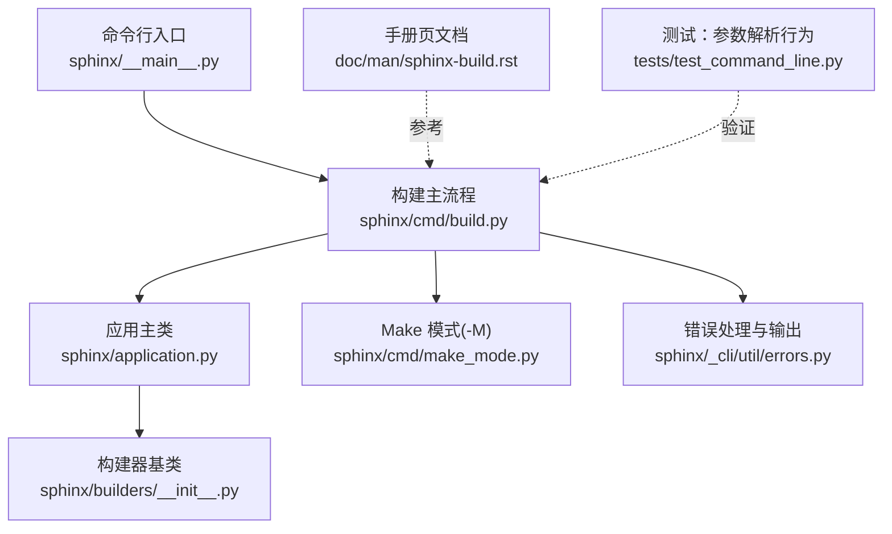
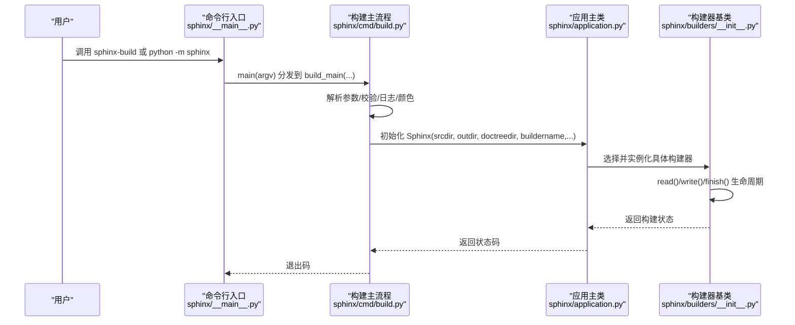
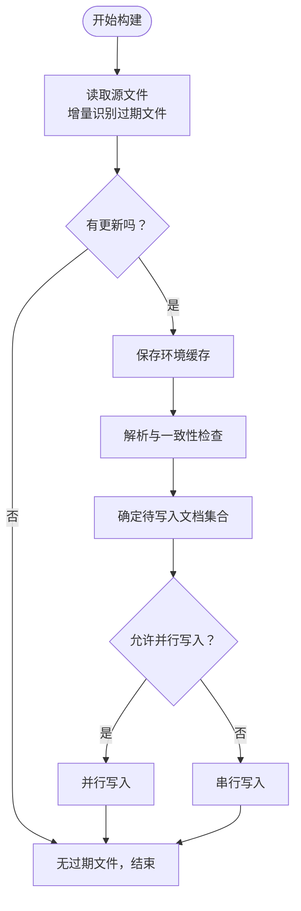
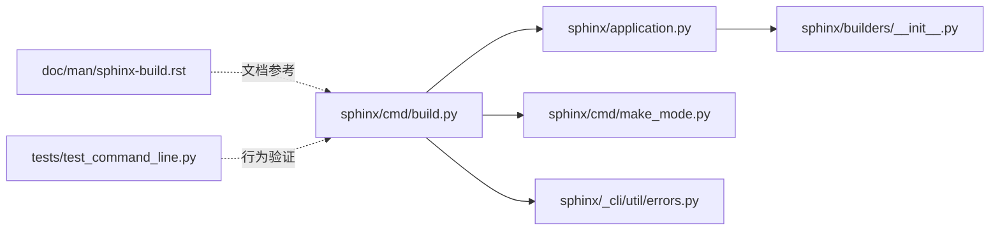

# sphinx-build 构建工具

<cite>
**本文引用的文件**
- [sphinx/cmd/build.py](file://sphinx/cmd/build.py)
- [sphinx/cmd/make_mode.py](file://sphinx/cmd/make_mode.py)
- [sphinx/_cli/util/errors.py](file://sphinx/_cli/util/errors.py)
- [sphinx/application.py](file://sphinx/application.py)
- [sphinx/builders/__init__.py](file://sphinx/builders/__init__.py)
- [doc/man/sphinx-build.rst](file://doc/man/sphinx-build.rst)
- [sphinx/__main__.py](file://sphinx/__main__.py)
- [tests/test_command_line.py](file://tests/test_command_line.py)
</cite>

## 目录
1. [简介](#简介)
2. [项目结构](#项目结构)
3. [核心组件](#核心组件)
4. [架构总览](#架构总览)
5. [详细组件分析](#详细组件分析)
6. [依赖分析](#依赖分析)
7. [性能考虑](#性能考虑)
8. [故障排查指南](#故障排查指南)
9. [结论](#结论)
10. [附录](#附录)

## 简介
sphinx-build 是 Sphinx 文档生成工具链中的核心命令行工具，用于从源文件生成多种格式的文档输出。它支持多种构建器（如 HTML、LaTeX、Manpage 等），可进行增量构建、并行处理、严格模式与警告控制，并提供丰富的配置覆盖与输出控制能力。本文面向使用者与运维人员，系统讲解其语法、选项、工作流程、常见用法与排障建议。

## 项目结构
围绕 sphinx-build 的关键实现与文档分布在以下模块：
- 命令行入口与解析：sphinx/cmd/build.py
- Make 模式（-M）：sphinx/cmd/make_mode.py
- 异常与错误输出：sphinx/_cli/util/errors.py
- 应用主类（Sphinx）：sphinx/application.py
- 构建器基类与并行写入：sphinx/builders/__init__.py
- 手册页文档：doc/man/sphinx-build.rst
- 主入口脚本：sphinx/__main__.py
- 行为验证与参数解析测试：tests/test_command_line.py

图表来源
- [sphinx/__main__.py:1-10](file://sphinx/__main__.py#L1-L10)
- [sphinx/cmd/build.py:1-498](file://sphinx/cmd/build.py#L1-L498)
- [sphinx/cmd/make_mode.py:1-224](file://sphinx/cmd/make_mode.py#L1-L224)
- [sphinx/_cli/util/errors.py:1-250](file://sphinx/_cli/util/errors.py#L1-L250)
- [sphinx/application.py:148-200](file://sphinx/application.py#L148-L200)
- [sphinx/builders/__init__.py:64-120](file://sphinx/builders/__init__.py#L64-L120)
- [doc/man/sphinx-build.rst:1-410](file://doc/man/sphinx-build.rst#L1-L410)
- [tests/test_command_line.py:1-200](file://tests/test_command_line.py#L1-L200)

章节来源
- [sphinx/cmd/build.py:70-288](file://sphinx/cmd/build.py#L70-L288)
- [sphinx/cmd/make_mode.py:27-56](file://sphinx/cmd/make_mode.py#L27-L56)
- [doc/man/sphinx-build.rst:7-32](file://doc/man/sphinx-build.rst#L7-L32)

## 核心组件
- 命令行解析与参数校验：负责解析基本语法、路径选项、构建配置、输出控制与警告控制等。
- 构建主流程：根据解析结果初始化 Sphinx 应用，执行构建并返回状态码。
- 应用主类（Sphinx）：封装构建生命周期、并行策略、警告与异常处理。
- 构建器基类（Builder）：定义构建阶段、并行读写、过期检测与一致性检查。
- Make 模式：兼容传统 Makefile 的目标别名（如 latexpdf、info 等）。
- 错误处理：统一格式化异常、保存完整堆栈、可选启动调试器。

章节来源
- [sphinx/cmd/build.py:395-453](file://sphinx/cmd/build.py#L395-L453)
- [sphinx/application.py:148-200](file://sphinx/application.py#L148-L200)
- [sphinx/builders/__init__.py:388-467](file://sphinx/builders/__init__.py#L388-L467)

## 架构总览
sphinx-build 的调用链路如下：

图表来源
- [sphinx/__main__.py:7-9](file://sphinx/__main__.py#L7-L9)
- [sphinx/cmd/build.py:475-493](file://sphinx/cmd/build.py#L475-L493)
- [sphinx/cmd/build.py:414-433](file://sphinx/cmd/build.py#L414-L433)
- [sphinx/application.py:165-200](file://sphinx/application.py#L165-L200)
- [sphinx/builders/__init__.py:388-467](file://sphinx/builders/__init__.py#L388-L467)

## 详细组件分析

### 基本语法与位置参数
- 语法：sphinx-build [OPTIONS] SOURCEDIR OUTPUTDIR [FILENAMES...]
- 位置参数：
  - SOURCEDIR：源文件所在目录（需包含 conf.py）
  - OUTPUTDIR：输出目录
  - FILENAMES：可选，指定需要重建的特定文件列表（与 -a 冲突时会报错）

章节来源
- [sphinx/cmd/build.py:100-112](file://sphinx/cmd/build.py#L100-L112)
- [doc/man/sphinx-build.rst:7-26](file://doc/man/sphinx-build.rst#L7-L26)

### 构建器选择（-b/--builder）
- 默认值：html
- 作用：选择输出格式对应的构建器（如 html、latex、manpage、text、epub 等）
- Make 模式（-M）：通过 -M <builder> 使用，兼容传统 Makefile 目标

章节来源
- [sphinx/cmd/build.py:116-122](file://sphinx/cmd/build.py#L116-L122)
- [sphinx/cmd/make_mode.py:27-56](file://sphinx/cmd/make_mode.py#L27-L56)
- [doc/man/sphinx-build.rst:74-83](file://doc/man/sphinx-build.rst#L74-L83)

### 并行构建（-j/--jobs）
- 作用：多进程并行构建，提升多核机器的构建效率
- 支持值：
  - 正整数：使用指定进程数
  - auto：自动使用 CPU 核心数
- 限制：仅在支持 fork 的系统上有效；并非所有部分/构建器均可并行

章节来源
- [sphinx/cmd/build.py:124-134](file://sphinx/cmd/build.py#L124-L134)
- [doc/man/sphinx-build.rst:129-145](file://doc/man/sphinx-build.rst#L129-L145)

### 强制重建（-a/--write-all）
- 作用：总是写出所有输出文件（默认仅重建新增或变更的文件）
- 注意：不会重新读取源文件；如需完全重读，使用 -E/--fresh-env

章节来源
- [sphinx/cmd/build.py:136-141](file://sphinx/cmd/build.py#L136-L141)
- [doc/man/sphinx-build.rst:84-95](file://doc/man/sphinx-build.rst#L84-L95)

### 新环境构建（-E/--fresh-env）
- 作用：不使用已保存的环境（交叉引用缓存），每次都重新读取所有文件
- 适用场景：配置变化、依赖结构变化后的全量重建

章节来源
- [sphinx/cmd/build.py:143-148](file://sphinx/cmd/build.py#L143-L148)
- [doc/man/sphinx-build.rst:97-104](file://doc/man/sphinx-build.rst#L97-L104)

### 配置目录指定（-c/--conf-dir）
- 作用：指定 conf.py 所在目录（默认为 SOURCEDIR）
- 影响：其他相对路径均以该目录为基准

章节来源
- [sphinx/cmd/build.py:162-167](file://sphinx/cmd/build.py#L162-L167)
- [doc/man/sphinx-build.rst:147-158](file://doc/man/sphinx-build.rst#L147-L158)

### Doctree 目录设置（-d/--doctree-dir）
- 作用：指定 doctree 和环境文件的缓存目录（默认为 OUTPUTDIR/.doctrees）
- 价值：多构建器共享缓存，加速增量构建

章节来源
- [sphinx/cmd/build.py:152-160](file://sphinx/cmd/build.py#L152-L160)
- [doc/man/sphinx-build.rst:118-128](file://doc/man/sphinx-build.rst#L118-L128)

### 配置覆盖选项（-D/--define）
- 作用：覆盖 conf.py 中的配置项
- 语法：-D setting=value；支持数字、字符串、列表、字典
- 示例：-D html_theme_path=path1,path2；-D latex_elements.docclass=scrartcl；-D latex_engine=pdflatex

章节来源
- [sphinx/cmd/build.py:178-185](file://sphinx/cmd/build.py#L178-L185)
- [sphinx/cmd/build.py:364-392](file://sphinx/cmd/build.py#L364-L392)
- [doc/man/sphinx-build.rst:169-189](file://doc/man/sphinx-build.rst#L169-L189)

### HTML 上下文传递（-A/--html-define）
- 作用：向 HTML 模板注入键值对（如 -A slumber=42）
- 值会被转换为整数（若可解析）后写入 html_context

章节来源
- [sphinx/cmd/build.py:187-194](file://sphinx/cmd/build.py#L187-L194)
- [sphinx/cmd/build.py:364-392](file://sphinx/cmd/build.py#L364-L392)
- [doc/man/sphinx-build.rst:191-198](file://doc/man/sphinx-build.rst#L191-L198)

### 标签系统（-t/--tag）
- 作用：定义构建标签，影响仅在特定标签下才包含的内容（only 指令）
- 多次使用可叠加多个标签

章节来源
- [sphinx/cmd/build.py:196-203](file://sphinx/cmd/build.py#L196-L203)
- [doc/man/sphinx-build.rst:106-117](file://doc/man/sphinx-build.rst#L106-L117)

### 严格模式（-n/--nitpicky）
- 作用：开启“挑剔模式”，对缺失引用发出警告（可配合 -W 转为错误）
- 常配合 nitpick_ignore 排除已知缺失项

章节来源
- [sphinx/cmd/build.py:205-210](file://sphinx/cmd/build.py#L205-L210)
- [doc/man/sphinx-build.rst:200-207](file://doc/man/sphinx-build.rst#L200-L207)

### 输出控制选项（-v/-q/-Q）
- -v/--verbose：增加详细程度（可重复，最多三级）
- -q/--quiet：仅输出警告与错误到标准错误
- -Q/--silent：完全静默（连警告也不输出）

章节来源
- [sphinx/cmd/build.py:214-234](file://sphinx/cmd/build.py#L214-L234)
- [doc/man/sphinx-build.rst:222-246](file://doc/man/sphinx-build.rst#L222-L246)

### 颜色输出控制（--color/--no-color）
- --color：强制启用彩色输出
- --no-color/-N：禁用彩色输出
- 自动检测：终端不支持时自动降级

章节来源
- [sphinx/cmd/build.py:236-250](file://sphinx/cmd/build.py#L236-L250)
- [doc/man/sphinx-build.rst:209-218](file://doc/man/sphinx-build.rst#L209-L218)

### 警告文件（-w/--warning-file）
- 作用：将警告与错误同时写入指定文件（并保留到标准错误）
- 文件写入前会确保父目录存在

章节来源
- [sphinx/cmd/build.py:254-259](file://sphinx/cmd/build.py#L254-L259)
- [doc/man/sphinx-build.rst:248-257](file://doc/man/sphinx-build.rst#L248-L257)

### 警告控制：转为错误（-W/--fail-on-warning）
- 作用：将警告视为错误，构建失败（退出码 1）
- 行为：自 8.1 起改为运行完整构建并在最后以 1 退出（而非遇第一个警告即停）

章节来源
- [sphinx/cmd/build.py:261-266](file://sphinx/cmd/build.py#L261-L266)
- [doc/man/sphinx-build.rst:259-271](file://doc/man/sphinx-build.rst#L259-L271)

### 异常处理（--show-traceback/-T）
- 作用：显示完整堆栈跟踪（而非摘要）
- 与 -v 协同：-v 会隐含启用此选项

章节来源
- [sphinx/cmd/build.py:269-274](file://sphinx/cmd/build.py#L269-L274)
- [doc/man/sphinx-build.rst:291-300](file://doc/man/sphinx-build.rst#L291-L300)

### 异常调试（--pdb/-P）
- 作用：遇到未捕获异常时启动 Python 调试器（pdb）

章节来源
- [sphinx/cmd/build.py:276-277](file://sphinx/cmd/build.py#L276-L277)
- [doc/man/sphinx-build.rst:302-308](file://doc/man/sphinx-build.rst#L302-L308)

### 异常警告（--exception-on-warning）
- 作用：在产生任何警告时抛出异常（便于定位问题）
- 常与 --pdb 组合使用

章节来源
- [sphinx/cmd/build.py:279-283](file://sphinx/cmd/build.py#L279-L283)
- [doc/man/sphinx-build.rst:310-315](file://doc/man/sphinx-build.rst#L310-L315)

### Make 模式（-M）
- 语法：sphinx-build -M <builder> <sourcedir> <builddir> [opts]
- 兼容目标：html、latex、latexpdf、latexpdfja、text、man、texinfo、info、gettext、changes、xml、pseudoxml、linkcheck、doctest、coverage、clean 等
- 特性：自动设置 doctrees 与各构建器输出目录；支持 PAPER 环境变量传入 latex papersize

章节来源
- [doc/man/sphinx-build.rst:35-73](file://doc/man/sphinx-build.rst#L35-L73)
- [sphinx/cmd/make_mode.py:27-56](file://sphinx/cmd/make_mode.py#L27-L56)
- [sphinx/cmd/make_mode.py:188-206](file://sphinx/cmd/make_mode.py#L188-L206)

### 构建流程与并行机制
- 读取阶段：增量识别过期文件，按需并行读取（受 parallel 与 allow_parallel 控制）
- 环境持久化：pickle 缓存 doctree 与环境，供后续增量构建复用
- 写入阶段：按文档排序并行写入（若允许并行），否则串行
- 完成阶段：收尾任务（静态资源、索引等）

图表来源
- [sphinx/builders/__init__.py:388-467](file://sphinx/builders/__init__.py#L388-L467)
- [sphinx/builders/__init__.py:705-762](file://sphinx/builders/__init__.py#L705-L762)

章节来源
- [sphinx/builders/__init__.py:388-467](file://sphinx/builders/__init__.py#L388-L467)
- [sphinx/builders/__init__.py:705-762](file://sphinx/builders/__init__.py#L705-L762)

### 实际使用示例
- 选择构建器：sphinx-build -b latex source build
- 并行构建：sphinx-build -j auto source build
- 严格模式：sphinx-build -n -W source build
- CI/CD 集成：sphinx-build -b html -q -W source build
- Make 模式：sphinx-build -M latexpdf source build
- 配置覆盖：sphinx-build -D latex_engine=xelatex -D latex_elements.papersize=a4paper source build

章节来源
- [doc/man/sphinx-build.rst:74-189](file://doc/man/sphinx-build.rst#L74-L189)
- [doc/man/sphinx-build.rst:259-315](file://doc/man/sphinx-build.rst#L259-L315)
- [sphinx/cmd/make_mode.py:188-206](file://sphinx/cmd/make_mode.py#L188-L206)

## 依赖分析
- 命令行入口与构建主流程耦合度低，便于独立扩展与测试
- Sphinx 应用主类集中管理构建生命周期、并行策略与异常处理
- 构建器基类抽象了读取、写入、收尾等阶段，便于扩展新构建器
- Make 模式作为独立模块，避免导入重型组件，提高启动速度

图表来源
- [sphinx/cmd/build.py:1-50](file://sphinx/cmd/build.py#L1-L50)
- [sphinx/application.py:148-200](file://sphinx/application.py#L148-L200)
- [sphinx/builders/__init__.py:64-120](file://sphinx/builders/__init__.py#L64-L120)
- [sphinx/cmd/make_mode.py:1-20](file://sphinx/cmd/make_mode.py#L1-L20)
- [sphinx/_cli/util/errors.py:1-20](file://sphinx/_cli/util/errors.py#L1-L20)

章节来源
- [sphinx/cmd/build.py:1-50](file://sphinx/cmd/build.py#L1-L50)
- [sphinx/application.py:148-200](file://sphinx/application.py#L148-L200)
- [sphinx/builders/__init__.py:64-120](file://sphinx/builders/__init__.py#L64-L120)
- [sphinx/cmd/make_mode.py:1-20](file://sphinx/cmd/make_mode.py#L1-L20)
- [sphinx/_cli/util/errors.py:1-20](file://sphinx/_cli/util/errors.py#L1-L20)

## 性能考虑
- 合理使用 -j/--jobs：在多核环境下显著缩短构建时间；注意系统 fork 支持与构建器并行能力
- 使用 -E/--fresh-env 与 -a/--write-all 的权衡：前者保证一致性但耗时较长，后者仅重建变更但不重读源
- 共享 doctrees：通过 -d 指定 doctreedir，避免重复解析
- 严格模式与警告控制：-n 与 -W 有助于早期发现问题，减少后期返工成本
- 输出静默：在 CI 环境中使用 -q/-Q 提升吞吐，配合 -w 将警告落盘以便审计

## 故障排查指南
- 参数冲突：-a 与 FILENAMES 不能同时使用，解析阶段会报错
- 颜色输出：终端不支持时自动降级；可通过 --no-color 强制关闭
- 异常定位：使用 --show-traceback/-T 获取完整堆栈；结合 --pdb 在异常时进入调试器
- 异常警告：--exception-on-warning 可在出现警告时立即中断，便于定位
- Make 模式限制：-M 必须在其他选项之前且紧随目录参数，否则解析失败
- 退出码：-W 触发的警告错误会返回非零退出码，便于 CI 判定

章节来源
- [sphinx/cmd/build.py:319-326](file://sphinx/cmd/build.py#L319-L326)
- [sphinx/cmd/build.py:328-331](file://sphinx/cmd/build.py#L328-L331)
- [sphinx/cmd/build.py:434-448](file://sphinx/cmd/build.py#L434-L448)
- [doc/man/sphinx-build.rst:259-315](file://doc/man/sphinx-build.rst#L259-L315)
- [tests/test_command_line.py:160-200](file://tests/test_command_line.py#L160-L200)

## 结论
sphinx-build 提供了灵活、可控且高性能的文档构建能力。通过合理选择构建器、并行策略与严格模式，可在本地开发与 CI/CD 环境中获得一致的构建体验。建议在团队内统一使用 Make 模式或固定参数组合，以减少环境差异带来的不确定性。

## 附录
- 参考手册页：doc/man/sphinx-build.rst
- 参数解析行为测试：tests/test_command_line.py
- 错误输出与调试：sphinx/_cli/util/errors.py