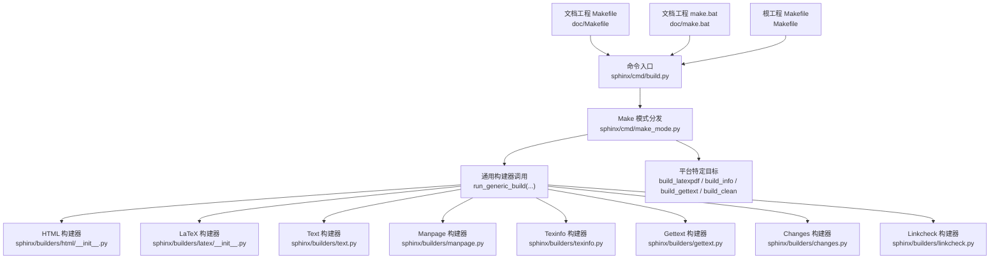
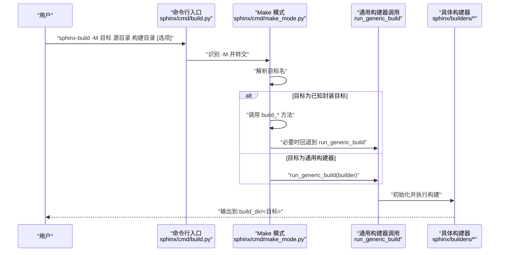
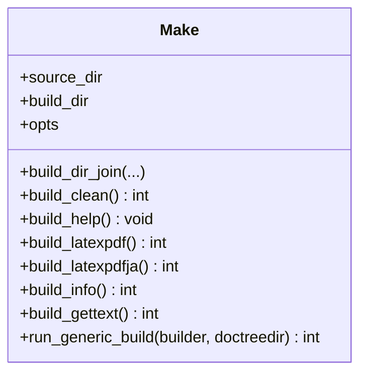
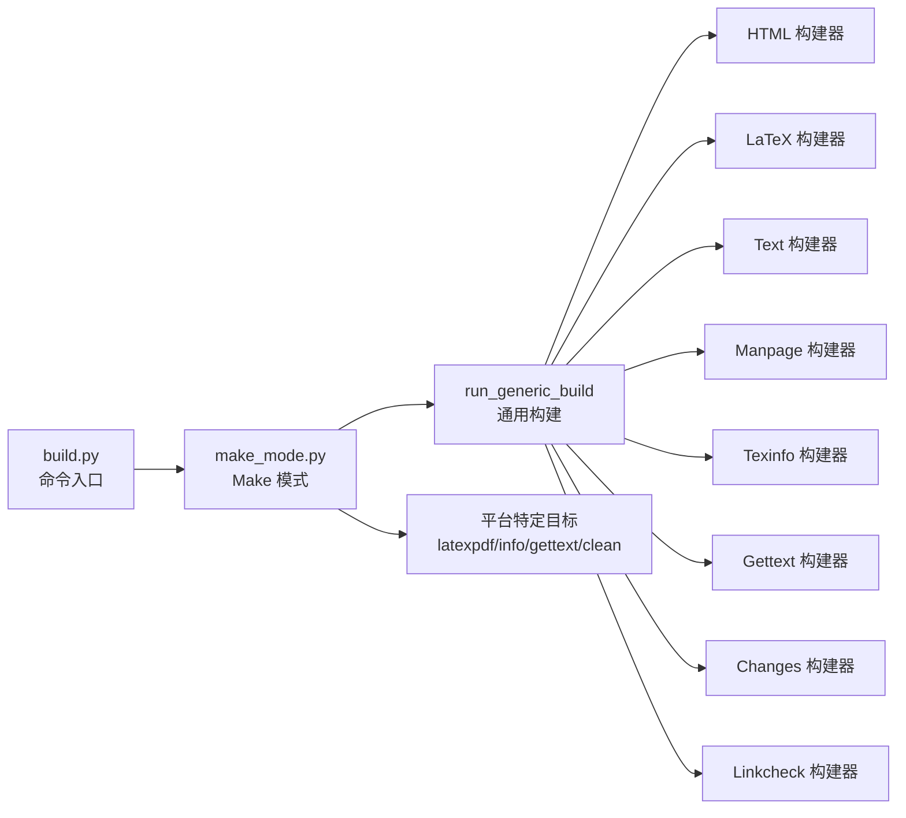

# sphinx-make 模式

<cite>
**本文引用的文件**
- [sphinx\cmd\make_mode.py](file://sphinx\cmd\make_mode.py)
- [sphinx\cmd\build.py](file://sphinx\cmd\build.py)
- [doc\Makefile](file://doc\Makefile)
- [doc\make.bat](file://doc\make.bat)
- [Makefile](file://Makefile)
- [sphinx\builders\html\__init__.py](file://sphinx\builders\html\__init__.py)
- [sphinx\builders\latex\__init__.py](file://sphinx\builders\latex\__init__.py)
- [sphinx\builders\text.py](file://sphinx\builders\text.py)
- [sphinx\builders\manpage.py](file://sphinx\builders\manpage.py)
- [sphinx\builders\texinfo.py](file://sphinx\builders\texinfo.py)
- [sphinx\builders\gettext.py](file://sphinx\builders\gettext.py)
- [sphinx\builders\changes.py](file://sphinx\builders\changes.py)
- [sphinx\builders\linkcheck.py](file://sphinx\builders\linkcheck.py)
</cite>

## 目录
1. [简介](#简介)
2. [项目结构](#项目结构)
3. [核心组件](#核心组件)
4. [架构总览](#架构总览)
5. [详细组件分析](#详细组件分析)
6. [依赖分析](#依赖分析)
7. [性能考虑](#性能考虑)
8. [故障排除指南](#故障排除指南)
9. [结论](#结论)
10. [附录](#附录)

## 简介
本文件系统性阐述 Sphinx 的 Makefile 风格“构建模式”（-M 模式），即通过命令行参数 -M 调用 sphinx-build 的 Makefile 兼容接口。该模式以 Python 实现替代传统平台相关的 Makefile 和 make.bat，统一了跨平台构建体验，同时保留与经典 Sphinx Makefile 的目标兼容性。本文将深入解析 -M 选项的使用方式、可用目标及其行为差异、与传统 Makefile 的兼容与迁移策略、跨平台配置要点、并行与性能优化建议，以及常见问题排查方法。

## 项目结构
围绕 Make 模式的关键文件与职责如下：
- 命令入口与模式分发：sphinx\cmd\build.py 提供主入口，识别 -M 并转交至 make_mode.py
- Make 模式实现：sphinx\cmd\make_mode.py 定义 Make 类与各目标的执行逻辑
- 文档样例工程的 Makefile/批处理：doc\Makefile、doc\make.bat 展示如何在文档工程中使用 -M
- 根目录工程 Makefile：Makefile 展示仓库级构建任务（非 Sphinx 构建）
- 各构建器：对应 html、latex、text、man、texinfo、gettext、changes、linkcheck 等目标的实际实现位于 sphinx\builders\* 子模块

**图表来源**
- [sphinx\cmd\build.py](file://sphinx\cmd\build.py)
- [sphinx\cmd\make_mode.py](file://sphinx\cmd\make_mode.py)
- [doc\Makefile](file://doc\Makefile)
- [doc\make.bat](file://doc\make.bat)
- [Makefile](file://Makefile)
- [sphinx\builders\html\__init__.py](file://sphinx\builders\html\__init__.py)
- [sphinx\builders\latex\__init__.py](file://sphinx\builders\latex\__init__.py)
- [sphinx\builders\text.py](file://sphinx\builders\text.py)
- [sphinx\builders\manpage.py](file://sphinx\builders\manpage.py)
- [sphinx\builders\texinfo.py](file://sphinx\builders\texinfo.py)
- [sphinx\builders\gettext.py](file://sphinx\builders\gettext.py)
- [sphinx\builders\changes.py](file://sphinx\builders\changes.py)
- [sphinx\builders\linkcheck.py](file://sphinx\builders\linkcheck.py)

**章节来源**
- [sphinx\cmd\build.py](file://sphinx\cmd\build.py)
- [sphinx\cmd\make_mode.py](file://sphinx\cmd\make_mode.py)
- [doc\Makefile](file://doc\Makefile)
- [doc\make.bat](file://doc\make.bat)
- [Makefile](file://Makefile)

## 核心组件
- Make 类与目标映射
  - Make.BUILDERS 列表定义了所有受支持的目标名称、平台限定与描述，用于帮助输出与目标选择
  - Make.run_generic_build 将 -M 目标转换为标准构建器调用，自动注入 doctree 目录与通用参数
  - Make.build_latexpdf、build_latexpdfja、build_info、build_gettext、build_clean 等针对特定目标进行封装
- 命令入口与 -M 分发
  - build.main 识别 argv 中的 -M，转交给 make_mode.run_make_mode
  - make_mode.run_make_mode 解析目标名，动态调用 Make.build_* 或回退到通用构建器

关键行为与兼容点
- 传统 Makefile 变量兼容：如 PAPER=a4/letter 会被转换为 latex_elements.papersize 参数传入
- 并行构建：通过 run_generic_build 注入 parallel 参数，由底层构建器执行
- 输出目录：各目标输出到 build_dir/<目标名>，doctrees 默认在 build_dir/.doctrees

**章节来源**
- [sphinx\cmd\make_mode.py](file://sphinx\cmd\make_mode.py)
- [sphinx\cmd\build.py](file://sphinx\cmd\build.py)

## 架构总览
下图展示从命令行到具体构建器的调用链路，以及与传统 Makefile 的兼容路径。

**图表来源**
- [sphinx\cmd\build.py](file://sphinx\cmd\build.py)
- [sphinx\cmd\make_mode.py](file://sphinx\cmd\make_mode.py)
- [sphinx\builders\html\__init__.py](file://sphinx\builders\html\__init__.py)
- [sphinx\builders\latex\__init__.py](file://sphinx\builders\latex\__init__.py)
- [sphinx\builders\text.py](file://sphinx\builders\text.py)
- [sphinx\builders\manpage.py](file://sphinx\builders\manpage.py)
- [sphinx\builders\texinfo.py](file://sphinx\builders\texinfo.py)
- [sphinx\builders\gettext.py](file://sphinx\builders\gettext.py)
- [sphinx\builders\changes.py](file://sphinx\builders\changes.py)
- [sphinx\builders\linkcheck.py](file://sphinx\builders\linkcheck.py)

## 详细组件分析

### Make 模式类与目标映射
- 目标列表与平台限定
  - 目标以三元组形式给出：(平台限定, 目标名, 描述)，仅在匹配平台时显示
  - 已知封装目标包括：html、dirhtml、singlehtml、latex、latexpdf、latexpdfja、text、man、texinfo、info、gettext、changes、linkcheck、clean 等
- 通用构建流程
  - run_generic_build 自动处理 PAPER 环境变量、doctreedir 默认值、并调用 build_main 执行构建
- 平台特定目标
  - build_latexpdf：生成 LaTeX 后，通过 MAKE 环境变量或默认 make/make.bat 调用 all-pdf；支持 -Q/-q 选项输出日志位置
  - build_latexpdfja：与上类似，但不注入 halt-on-error/LATEXMKOPTS
  - build_info：在 texinfo 目录下运行 makeinfo
  - build_gettext：在 gettext/doctrees 下生成翻译目录树
  - build_clean：清理构建目录前进行安全检查（目录存在、非源目录、非包含关系）

**图表来源**
- [sphinx\cmd\make_mode.py](file://sphinx\cmd\make_mode.py)

**章节来源**
- [sphinx\cmd\make_mode.py](file://sphinx\cmd\make_mode.py)

### HTML 构建器（html/dirhtml/singlehtml）
- 功能概述
  - html：独立 HTML 文件
  - dirhtml：按目录命名 index.html
  - singlehtml：单一大型 HTML 文件
- 关键特性
  - 支持并行写入（allow_parallel = True）
  - 输出后缀与链接后缀可配置
  - 支持搜索索引、下载支持、图像处理等
- 常见配置项（来自构建器初始化与模板桥接）
  - file_suffix/link_suffix 控制文件与链接后缀
  - use_index 控制索引生成
  - 支持主题与静态资源复制

**章节来源**
- [sphinx\builders\html\__init__.py](file://sphinx\builders\html\__init__.py)

### LaTeX 构建器（latex/latexpdf/latexpdfja）
- 功能概述
  - latex：生成 LaTeX 源文件，提示在该目录执行 make/pdflatex/pdfTeX
  - latexpdf：先生成 LaTeX，再调用 make/all-pdf 产出 PDF
  - latexpdfja：面向日本语环境，使用 platex/dvipdfmx 流程
- 关键特性
  - 支持多语言、字体与表格样式配置
  - 支持 xindy、babel、引擎选择（pdflatex/xelatex/lualatex）
  - 生成文档数据与上下文，控制输出文件名与日期
- 与 Make 模式的交互
  - latexpdf/latexpdfja 通过子进程在 build_dir/latex 目录执行 make，遵循 MAKE 环境变量

**章节来源**
- [sphinx\builders\latex\__init__.py](file://sphinx\builders\latex\__init__.py)
- [sphinx\cmd\make_mode.py](file://sphinx\cmd\make_mode.py)

### Text 构建器（text）
- 功能概述
  - 生成纯文本文件，适合非 HTML 渠道或离线阅读
- 关键特性
  - 支持并行读取与写入
  - 可配置段落分隔符、换行风格、是否添加章节号等

**章节来源**
- [sphinx\builders\text.py](file://sphinx\builders\text.py)

### Manpage 构建器（man）
- 功能概述
  - 生成 groff 手册页（.1/.3/.5/.7 等）
- 关键特性
  - 通过 man_pages 配置生成多个手册页
  - 支持按章节目录组织输出
- 与 Make 模式的交互
  - 作为通用构建器被 run_generic_build 调用，输出到 build_dir/<目标>

**章节来源**
- [sphinx\builders\manpage.py](file://sphinx\builders\manpage.py)

### Texinfo 构建器（texinfo/info）
- 功能概述
  - 生成 Texinfo 源文件，提示在该目录执行 makeinfo
- 关键特性
  - 支持多文档组装、附件集合、图像复制
- 与 Make 模式的交互
  - info 目标通过 MAKE 环境变量在 texinfo 目录执行 makeinfo

**章节来源**
- [sphinx\builders\texinfo.py](file://sphinx\builders\texinfo.py)
- [sphinx\cmd\make_mode.py](file://sphinx\cmd\make_mode.py)

### Gettext 构建器（gettext）
- 功能概述
  - 生成 PO 消息目录，供翻译使用
- 关键特性
  - 支持按域（domain）聚合消息，记录来源位置与唯一标识
  - 可自定义模板路径与转义规则

**章节来源**
- [sphinx\builders\gettext.py](file://sphinx\builders\gettext.py)

### Changes 构建器（changes）
- 功能概述
  - 生成版本变更概览页面，汇总新增、变更、弃用与移除内容
- 关键特性
  - 使用 HTML 主题与模板渲染
  - 复制源文件并高亮当前版本相关行

**章节来源**
- [sphinx\builders\changes.py](file://sphinx\builders\changes.py)

### Linkcheck 构建器（linkcheck）
- 功能概述
  - 检查外部链接有效性，输出文本与 JSON 报告
- 关键特性
  - 多线程并发检查，支持重定向、速率限制、超时控制
  - 统计失败与超时数量，影响构建状态码

**章节来源**
- [sphinx\builders\linkcheck.py](file://sphinx\builders\linkcheck.py)

## 依赖分析
- 模块耦合
  - build.py 仅在识别到 -M 时导入 make_mode.py，避免常规构建引入额外开销
  - make_mode.py 仅依赖基础工具与 build_main，不直接导入具体构建器，降低启动成本
- 目标到构建器映射
  - 通用目标通过 run_generic_build 统一调度
  - 平台特定目标通过子进程调用 make/make.bat，保持与传统 Makefile 行为一致
- 外部依赖
  - LaTeX/PDF：需要 make 与 latex 引擎（pdflatex/xelatex/lualatex）
  - Texinfo：需要 makeinfo
  - 并行：依赖 Python 并行任务框架与底层构建器的并行能力

**图表来源**
- [sphinx\cmd\build.py](file://sphinx\cmd\build.py)
- [sphinx\cmd\make_mode.py](file://sphinx\cmd\make_mode.py)
- [sphinx\builders\html\__init__.py](file://sphinx\builders\html\__init__.py)
- [sphinx\builders\latex\__init__.py](file://sphinx\builders\latex\__init__.py)
- [sphinx\builders\text.py](file://sphinx\builders\text.py)
- [sphinx\builders\manpage.py](file://sphinx\builders\manpage.py)
- [sphinx\builders\texinfo.py](file://sphinx\builders\texinfo.py)
- [sphinx\builders\gettext.py](file://sphinx\builders\gettext.py)
- [sphinx\builders\changes.py](file://sphinx\builders\changes.py)
- [sphinx\builders\linkcheck.py](file://sphinx\builders\linkcheck.py)

**章节来源**
- [sphinx\cmd\build.py](file://sphinx\cmd\build.py)
- [sphinx\cmd\make_mode.py](file://sphinx\cmd\make_mode.py)

## 性能考虑
- 并行构建
  - 通过 run_generic_build 注入 parallel 参数，底层构建器根据 allow_parallel 决定是否并行写入
  - HTML、Text 等构建器明确支持并行写入
- I/O 与缓存
  - doctrees 默认保存在构建目录下的 .doctrees，避免重复解析
  - 链接检查可利用缓存与并发队列减少等待时间
- LaTeX/PDF 构建
  - latexpdf 会二次调用 make，建议在 CI 中预装 LaTeX 工具链并启用缓存
- 日志与静默
  - -Q/-q 选项分别控制完全静默与仅警告输出，有助于 CI 环境精简日志

[本节为通用指导，无需特定文件引用]

## 故障排除指南
- 构建目录清理错误
  - 若构建目录不存在或与源目录相同，将返回错误；请确认路径正确且不互相包含
- LaTeX/PDF 构建失败
  - 检查 MAKE 环境变量是否指向正确的 make 或 make.bat
  - -Q 模式下错误日志会写入 build_dir/latex/__LATEXSTDOUT__，便于定位
- Texinfo/info 构建失败
  - 确认 makeinfo 可用；MAKE 环境变量需指向 make
- 链接检查异常
  - 观察 output.txt 与 output.json，关注超时、重定向与被忽略的链接
  - 调整 linkcheck 配置（如允许的重定向、超时阈值）
- 并行导致的竞态
  - 某些构建器可能不支持并行写入，请在配置中调整 parallel 数量或禁用并行

**章节来源**
- [sphinx\cmd\make_mode.py](file://sphinx\cmd\make_mode.py)
- [sphinx\builders\linkcheck.py](file://sphinx\builders\linkcheck.py)

## 结论
Sphinx 的 -M 模式以 Python 实现统一了跨平台构建体验，既保留了传统 Makefile 的目标语义，又提供了更清晰的参数传递与错误处理。通过 Make 类与 run_generic_build 的解耦设计，开发者可以以最小代价扩展新目标或复用现有构建器。结合并行与缓存策略，可在保证质量的同时显著提升构建效率。

[本节为总结，无需特定文件引用]

## 附录

### -M 目标与输出格式对照
- html：独立 HTML 文件，输出到 build_dir/html
- dirhtml：目录化 HTML，输出到 build_dir/dirhtml
- singlehtml：单文件 HTML，输出到 build_dir/singlehtml
- latex：LaTeX 源文件，输出到 build_dir/latex
- latexpdf：LaTeX→PDF，输出到 build_dir/latex
- latexpdfja：LaTeX→PDF（日文流程），输出到 build_dir/latex
- text：纯文本，输出到 build_dir/text
- man：手册页，输出到 build_dir/man
- texinfo：Texinfo 源文件，输出到 build_dir/texinfo
- info：Texinfo→Info，输出到 build_dir/texinfo
- gettext：PO 目录，输出到 build_dir/gettext
- changes：版本变更概览，输出到 build_dir/changes
- linkcheck：链接检查报告，输出到 build_dir/linkcheck
- clean：清理构建目录

**章节来源**
- [sphinx\cmd\make_mode.py](file://sphinx\cmd\make_mode.py)
- [sphinx\builders\html\__init__.py](file://sphinx\builders\html\__init__.py)
- [sphinx\builders\latex\__init__.py](file://sphinx\builders\latex\__init__.py)
- [sphinx\builders\text.py](file://sphinx\builders\text.py)
- [sphinx\builders\manpage.py](file://sphinx\builders\manpage.py)
- [sphinx\builders\texinfo.py](file://sphinx\builders\texinfo.py)
- [sphinx\builders\gettext.py](file://sphinx\builders\gettext.py)
- [sphinx\builders\changes.py](file://sphinx\builders\changes.py)
- [sphinx\builders\linkcheck.py](file://sphinx\builders\linkcheck.py)

### 与传统 Sphinx Makefile 的兼容与迁移
- 兼容性
  - 目标名称与行为基本一致（如 html、latex、latexpdf、man、texinfo、gettext、changes、linkcheck）
  - 通过 -M 与 SPHINXOPTS 传递参数，无需手写 Makefile
- 迁移步骤
  - 在文档工程中使用 doc/Makefile 的 -M 模式示例，将目标改为 -M 目标
  - 将 SPHINXOPTS 等变量替换为命令行参数
  - 对于平台特定目标（latexpdf、info），确保本地安装 make 与相应工具链
- 保留的 Makefile 示例
  - doc/Makefile 展示了 help 与 catch-all 目标，便于过渡期并行使用

**章节来源**
- [doc\Makefile](file://doc\Makefile)
- [doc\make.bat](file://doc\make.bat)
- [sphinx\cmd\make_mode.py](file://sphinx\cmd\make_mode.py)

### 跨平台构建配置示例
- Windows
  - 使用 doc/make.bat 或直接调用 sphinx-build -M 目标
  - 设置 MAKE 指向 make.bat 或 MSYS2 make
- Linux/macOS
  - 使用 doc/Makefile 或直接调用 sphinx-build -M 目标
  - 确保已安装 make 与 LaTeX/Texinfo 工具链

**章节来源**
- [doc\make.bat](file://doc\make.bat)
- [doc\Makefile](file://doc\Makefile)
- [sphinx\cmd\make_mode.py](file://sphinx\cmd\make_mode.py)

### 并行构建与性能优化建议
- 启用并行
  - 通过 run_generic_build 注入 parallel 参数，底层构建器根据 allow_parallel 决定并行策略
  - HTML、Text 等构建器天然支持并行写入
- 缓存与增量
  - 利用 doctrees 缓存避免重复解析
  - linkcheck 可复用检查结果，减少网络请求
- CI 最佳实践
  - 预装 LaTeX/Texinfo 工具链并缓存依赖
  - 使用 -Q/-q 控制日志级别，加速流水线

**章节来源**
- [sphinx\builders\html\__init__.py](file://sphinx\builders\html\__init__.py)
- [sphinx\builders\text.py](file://sphinx\builders\text.py)
- [sphinx\cmd\make_mode.py](file://sphinx\cmd\make_mode.py)
- [sphinx\builders\linkcheck.py](file://sphinx\builders\linkcheck.py)