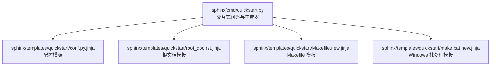
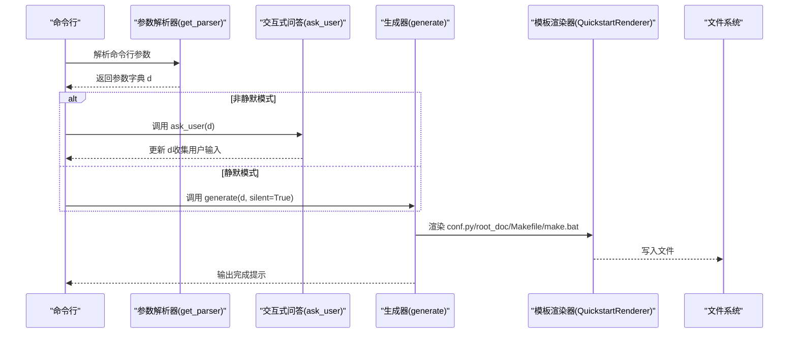
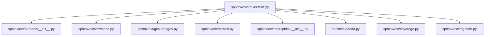

# sphinx-quickstart 项目初始化

<cite>
**本文引用的文件**
- [quickstart.py](file://sphinx/cmd/quickstart.py)
- [conf.py.jinja](file://sphinx/templates/quickstart/conf.py.jinja)
- [root_doc.rst.jinja](file://sphinx/templates/quickstart/root_doc.rst.jinja)
- [Makefile.new.jinja](file://sphinx/templates/quickstart/Makefile.new.jinja)
- [make.bat.new.jinja](file://sphinx/templates/quickstart/make.bat.new.jinja)
- [githubpages.py](file://sphinx/ext/githubpages.py)
- [viewcode.py](file://sphinx/ext/viewcode.py)
- [autodoc/__init__.py](file://sphinx/ext/autodoc/__init__.py)
- [doctest.py](file://sphinx/ext/doctest.py)
- [intersphinx/__init__.py](file://sphinx/ext/intersphinx/__init__.py)
- [todo.py](file://sphinx/ext/todo.py)
- [coverage.py](file://sphinx/ext/coverage.py)
- [imgmath.py](file://sphinx/ext/imgmath.py)
- [test_quickstart.py](file://tests/test_quickstart.py)
</cite>

## 目录
1. [简介](#简介)
2. [项目结构](#项目结构)
3. [核心组件](#核心组件)
4. [架构总览](#架构总览)
5. [详细组件分析](#详细组件分析)
6. [依赖分析](#依赖分析)
7. [性能考虑](#性能考虑)
8. [故障排查指南](#故障排查指南)
9. [结论](#结论)
10. [附录](#附录)

## 简介
本文件系统性阐述 sphinx-quickstart 命令的交互式项目初始化流程与非交互式用法，覆盖以下主题：
- 交互式选项：项目名称、作者、版本/发布、语言、源文件后缀、主文档名、扩展模块、是否分离源/构建目录、Makefile/批处理脚本生成等
- 配置文件生成：conf.py 的自动生成、关键配置项（如 extensions、templates_path、exclude_patterns、source_suffix、root_doc、language 等）的设置逻辑
- 模板系统：根文档模板、Makefile/批处理模板、配置模板的渲染与写入
- 扩展模块：autodoc、viewcode、githubpages、doctest、intersphinx、todo、coverage、imgmath 等的启用方式与影响
- 非交互模式：命令行参数与静默模式的使用
- 最佳实践：目录结构、版本控制、CI/CD 集成、模板变量定制等

## 项目结构
sphinx-quickstart 的核心实现位于命令模块中，配合模板系统生成项目骨架与配置文件。下图展示其在代码库中的位置与职责：

图表来源
- [quickstart.py:425-547](file://sphinx/cmd/quickstart.py#L425-L547)
- [conf.py.jinja:1-72](file://sphinx/templates/quickstart/conf.py.jinja#L1-L72)
- [root_doc.rst.jinja:1-19](file://sphinx/templates/quickstart/root_doc.rst.jinja#L1-L19)
- [Makefile.new.jinja:1-22](file://sphinx/templates/quickstart/Makefile.new.jinja#L1-L22)
- [make.bat.new.jinja:1-37](file://sphinx/templates/quickstart/make.bat.new.jinja#L1-L37)

章节来源
- [quickstart.py:425-547](file://sphinx/cmd/quickstart.py#L425-L547)

## 核心组件
- 交互式问答 ask_user：负责收集用户输入，校验路径与主文档冲突，处理扩展模块互斥（如 imgmath 与 mathjax），并决定是否生成 Makefile/批处理脚本
- 生成器 generate：根据收集到的字典 d 渲染模板，创建目录结构（_templates/_static、可选 _build 或 separate 源/构建目录）、写入 conf.py、主文档、Makefile/make.bat
- 模板渲染器 QuickstartRenderer：支持自定义模板覆盖，优先使用传入 templatedir 的同名模板，否则回退到内置 quickstart 模板
- 参数解析 get_parser：提供完整的命令行接口，支持静默模式与模板变量注入

章节来源
- [quickstart.py:210-424](file://sphinx/cmd/quickstart.py#L210-L424)
- [quickstart.py:425-547](file://sphinx/cmd/quickstart.py#L425-L547)
- [quickstart.py:575-738](file://sphinx/cmd/quickstart.py#L575-L738)

## 架构总览
sphinx-quickstart 的执行流程如下：

图表来源
- [quickstart.py:741-800](file://sphinx/cmd/quickstart.py#L741-L800)
- [quickstart.py:210-424](file://sphinx/cmd/quickstart.py#L210-L424)
- [quickstart.py:425-547](file://sphinx/cmd/quickstart.py#L425-L547)

## 详细组件分析

### 交互式问答 ask_user
- 路径与冲突检测：若目标路径已存在 conf.py 或 source/conf.py，会提示错误并允许重新输入或退出
- 分离/合并源/构建目录：sep 控制是否在根目录下创建 source/build 或独立 source 与 build
- 模板/静态目录前缀：dot 替换默认的下划线前缀
- 项目元信息：project、author、version、release（release 默认等于 version）
- 语言：language 支持国际化；当 language 为 'en' 时，配置中不显式设置
- 源文件后缀：suffix 控制 .rst 或 .txt 等
- 主文档名：master 控制 index.rst 或自定义文件名；若与现有文件重名，会提示改名
- 扩展模块：逐个询问是否启用，支持互斥处理（如 imgmath 与 mathjax）
- Makefile/批处理：按需生成，区分 Unix 与 Windows 行尾

章节来源
- [quickstart.py:210-424](file://sphinx/cmd/quickstart.py#L210-L424)

### 生成器 generate
- 目录创建：确保 srcdir 与 builddir 存在；在 sep 模式下分别创建 source 与 build；否则在 srcdir 下创建 dot_build 排除目录
- 模板渲染：读取内置 conf.py.jinja，渲染后写入 conf.py；根据是否存在自定义模板选择 root_doc 或 master_doc 模板写入主文档
- Makefile/make.bat：根据 sep 与 dot 前缀计算 rsrcdir/rbuilddir，渲染模板并写入
- 完成提示：输出使用 make 或 sphinx-build 的建议

章节来源
- [quickstart.py:425-547](file://sphinx/cmd/quickstart.py#L425-L547)
- [conf.py.jinja:1-72](file://sphinx/templates/quickstart/conf.py.jinja#L1-L72)
- [root_doc.rst.jinja:1-19](file://sphinx/templates/quickstart/root_doc.rst.jinja#L1-L19)
- [Makefile.new.jinja:1-22](file://sphinx/templates/quickstart/Makefile.new.jinja#L1-L22)
- [make.bat.new.jinja:1-37](file://sphinx/templates/quickstart/make.bat.new.jinja#L1-L37)

### 模板系统
- conf.py.jinja：根据 d 动态生成项目配置，包含路径插入、项目信息、扩展列表、模板/排除模式、源后缀、根文档、语言、HTML 主题与静态目录等
- root_doc.rst.jinja：生成根文档的标题与 toctree 结构
- Makefile.new.jinja/make.bat.new.jinja：生成跨平台构建脚本，自动识别 sphinx-build 并传递参数

章节来源
- [conf.py.jinja:1-72](file://sphinx/templates/quickstart/conf.py.jinja#L1-L72)
- [root_doc.rst.jinja:1-19](file://sphinx/templates/quickstart/root_doc.rst.jinja#L1-L19)
- [Makefile.new.jinja:1-22](file://sphinx/templates/quickstart/Makefile.new.jinja#L1-L22)
- [make.bat.new.jinja:1-37](file://sphinx/templates/quickstart/make.bat.new.jinja#L1-L37)

### 扩展模块与互斥处理
- 可用扩展：autodoc、doctest、intersphinx、todo、coverage、imgmath、mathjax、ifconfig、viewcode、githubpages
- 互斥处理：当同时启用 imgmath 与 mathjax 时，自动取消 imgmath
- 各扩展对 conf.py 的影响：
  - intersphinx：在启用时生成默认映射（如指向 Python 官方文档）
  - todo：在启用时生成 todo_include_todos 配置项
  - 其他扩展：在 extensions 列表中添加对应模块名

章节来源
- [quickstart.py:51-62](file://sphinx/cmd/quickstart.py#L51-L62)
- [quickstart.py:397-406](file://sphinx/cmd/quickstart.py#L397-L406)
- [conf.py.jinja:58-71](file://sphinx/templates/quickstart/conf.py.jinja#L58-L71)

### 非交互式模式与命令行参数
- 静默模式：-q/--quiet，要求提供 project 与 author；未满足则返回错误码
- 结构选项：--sep/--no-sep、--dot
- 项目基础选项：-p/--project、-a/--author、-v/--version、-r/--release、-l/--language、--suffix、--master、--epub
- 扩展选项：--ext-<name> 多次使用或 --extensions 以逗号分隔
- Makefile/批处理：--makefile/--no-makefile、--batchfile/--no-batchfile、-m/--use-make-mode
- 模板与变量：-t/--templatedir、-d/--define=name=value（多次）

章节来源
- [quickstart.py:575-738](file://sphinx/cmd/quickstart.py#L575-L738)

### 测试与行为验证
- 测试覆盖：交互式问答、默认值、分离源/构建目录、扩展启用、文件换行符、构建成功、默认文件名、扩展列表、已存在 conf.py 的退出行为等
- 关键断言：生成的 conf.py 中 extensions、templates_path、source_suffix、root_doc、copyright、version/release 等字段符合预期

章节来源
- [test_quickstart.py:99-186](file://tests/test_quickstart.py#L99-L186)
- [test_quickstart.py:188-206](file://tests/test_quickstart.py#L188-L206)
- [test_quickstart.py:208-225](file://tests/test_quickstart.py#L208-L225)
- [test_quickstart.py:227-242](file://tests/test_quickstart.py#L227-L242)
- [test_quickstart.py:245-262](file://tests/test_quickstart.py#L245-L262)
- [test_quickstart.py:264-275](file://tests/test_quickstart.py#L264-L275)

## 依赖分析
sphinx-quickstart 与扩展之间的依赖关系如下：

图表来源
- [quickstart.py:51-62](file://sphinx/cmd/quickstart.py#L51-L62)
- [autodoc/__init__.py:140-212](file://sphinx/ext/autodoc/__init__.py#L140-L212)
- [viewcode.py:393-417](file://sphinx/ext/viewcode.py#L393-L417)
- [githubpages.py:53-58](file://sphinx/ext/githubpages.py#L53-L58)
- [doctest.py:626-653](file://sphinx/ext/doctest.py#L626-L653)
- [intersphinx/__init__.py:66-88](file://sphinx/ext/intersphinx/__init__.py#L66-L88)
- [todo.py:226-250](file://sphinx/ext/todo.py#L226-L250)
- [coverage.py:523-557](file://sphinx/ext/coverage.py#L523-L557)
- [imgmath.py:390-422](file://sphinx/ext/imgmath.py#L390-L422)

章节来源
- [quickstart.py:51-62](file://sphinx/cmd/quickstart.py#L51-L62)

## 性能考虑
- 生成阶段仅进行模板渲染与文件写入，开销极低
- 互斥扩展检查在交互阶段完成，避免后续构建时的冲突
- 静默模式减少 I/O 与用户等待时间，适合 CI 环境

## 故障排查指南
- 已存在 conf.py：当所选路径或 source 子目录中已有 conf.py，quickstart 会报错并提示退出或重新输入路径
- 扩展互斥：同时启用 imgmath 与 mathjax 时，会自动取消 imgmath
- 静默模式缺少必要参数：指定 -q 但未提供 project 或 author 将直接返回错误码
- 路径无效：输入的路径不存在或不是目录，会触发验证失败

章节来源
- [quickstart.py:249-270](file://sphinx/cmd/quickstart.py#L249-L270)
- [quickstart.py:397-406](file://sphinx/cmd/quickstart.py#L397-L406)
- [quickstart.py:767-800](file://sphinx/cmd/quickstart.py#L767-L800)

## 结论
sphinx-quickstart 提供了从零开始搭建 Sphinx 项目的高效入口，通过交互式问答与模板渲染，快速生成标准项目结构与配置文件。结合丰富的扩展与命令行参数，既能满足初学者的快速上手，也能满足高级用户的定制化需求。

## 附录

### 常见项目类型与模板选择
- 普通文档：默认模板，生成 index.rst 作为根文档
- API 文档：启用 autodoc、viewcode、intersphinx 等扩展，结合自动化代码抽取与交叉引用
- 手册格式：通过主题与扩展组合实现长文档结构（如 LaTeX/Manual 主题）

### 扩展模块选择与安装建议
- autodoc：自动生成 API 文档，建议配合 viewcode 查看源码链接
- doctest：内联测试代码片段，适合教程与示例
- intersphinx：链接到外部文档（如 Python 官方文档）
- todo：管理待办事项，便于迭代跟踪
- coverage：检查文档覆盖率，定位缺失对象
- imgmath/mathjax：数学公式渲染，注意二选一（互斥）
- githubpages：生成 .nojekyll 与 CNAME 文件，适配 GitHub Pages

章节来源
- [quickstart.py:51-62](file://sphinx/cmd/quickstart.py#L51-L62)
- [conf.py.jinja:58-71](file://sphinx/templates/quickstart/conf.py.jinja#L58-L71)

### 非交互式模式最佳实践
- 使用 -q/--quiet 与必要的 -p/-a 参数，配合 CI 环境自动化
- 通过 --extensions 一次性启用多个扩展，或使用 --ext-<name> 逐个启用
- 使用 -t 指定自定义模板目录，-d 注入模板变量，实现统一风格

章节来源
- [quickstart.py:575-738](file://sphinx/cmd/quickstart.py#L575-L738)

### 目录结构组织与版本控制
- 推荐使用 --sep 分离源/构建目录，便于 Git 忽略构建产物
- 将 _templates/_static 放置于 dot 前缀目录（如 .templates/.static），保持命名一致性
- 在 .gitignore 中忽略 _build 或 dot_build 目录

章节来源
- [quickstart.py:448-467](file://sphinx/cmd/quickstart.py#L448-L467)

### CI/CD 配置建议
- 使用 Makefile/new make.bat 统一构建入口，简化流水线步骤
- 在 CI 中缓存 Python 依赖与 Sphinx 构建产物，提升速度
- 对 doctest/coverage 等扩展，可在 PR 中运行测试构建，确保示例与覆盖率达标

章节来源
- [Makefile.new.jinja:1-22](file://sphinx/templates/quickstart/Makefile.new.jinja#L1-L22)
- [make.bat.new.jinja:1-37](file://sphinx/templates/quickstart/make.bat.new.jinja#L1-L37)
- [doctest.py:292-378](file://sphinx/ext/doctest.py#L292-L378)
- [coverage.py:167-220](file://sphinx/ext/coverage.py#L167-L220)