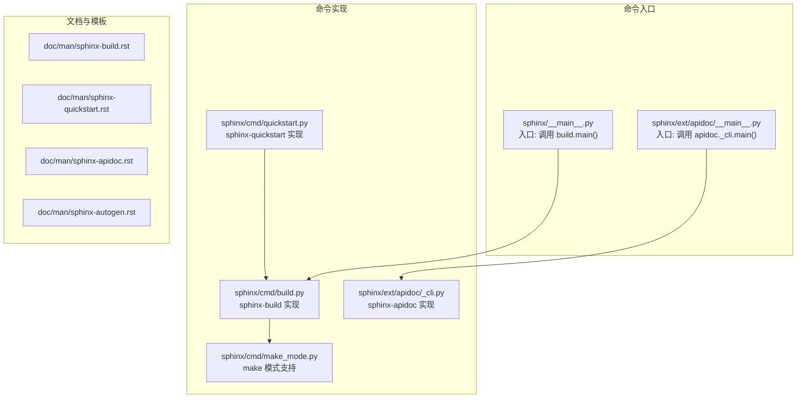
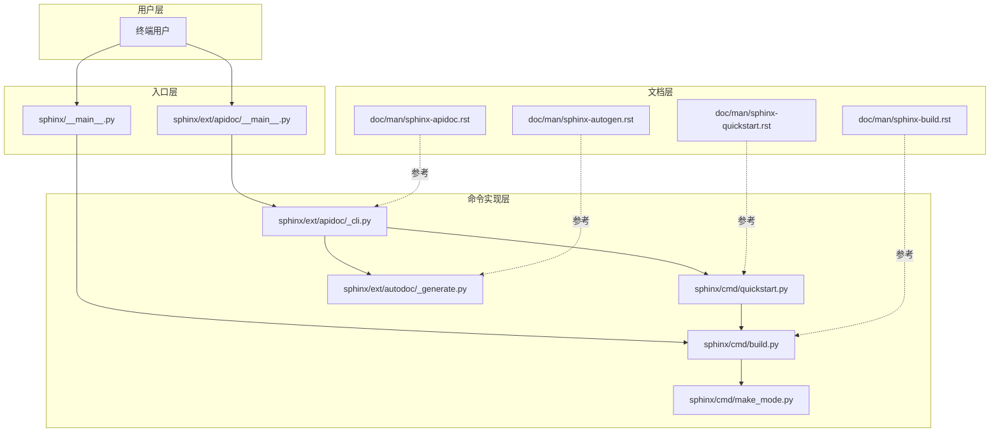
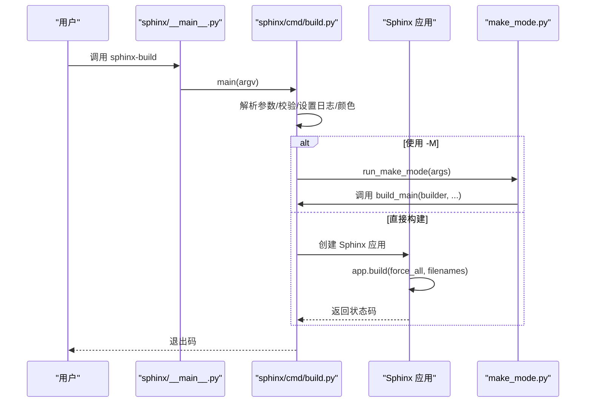
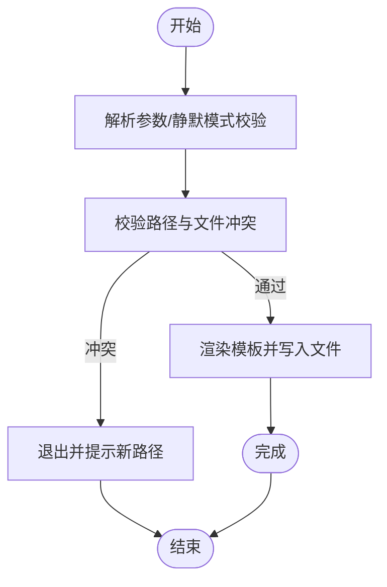
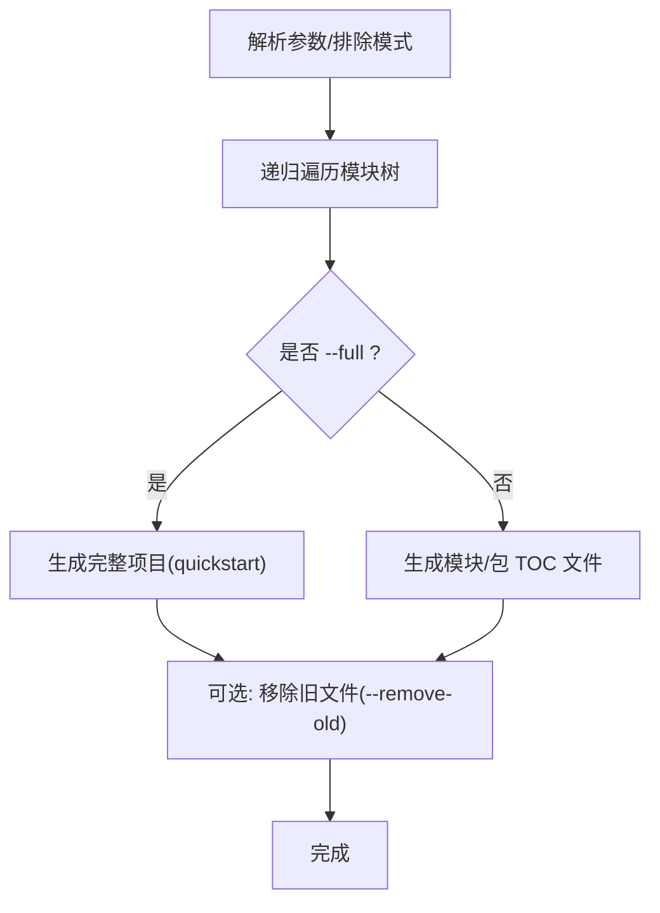
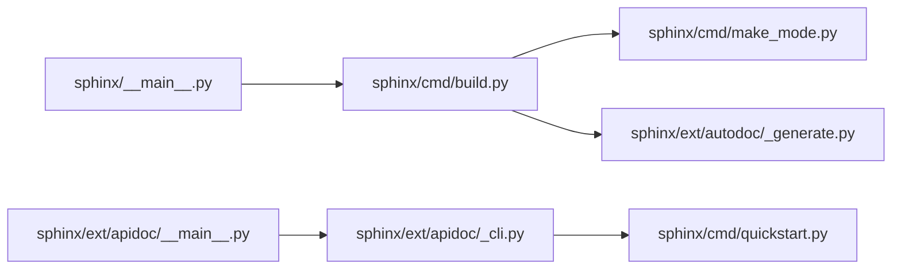

# 命令行工具

<cite>
**本文引用的文件**
- [sphinx-build 主入口](file://sphinx/__main__.py)
- [sphinx-build 命令实现](file://sphinx/cmd/build.py)
- [sphinx-quickstart 命令实现](file://sphinx/cmd/quickstart.py)
- [sphinx-apidoc 命令实现](file://sphinx/ext/apidoc/_cli.py)
- [sphinx-apidoc 入口模块](file://sphinx/ext/apidoc/__main__.py)
- [sphinx-autodoc 生成器](file://sphinx/ext/autodoc/_generate.py)
- [sphinx-build（手册页）](file://doc/man/sphinx-build.rst)
- [sphinx-quickstart（手册页）](file://doc/man/sphinx-quickstart.rst)
- [sphinx-apidoc（手册页）](file://doc/man/sphinx-apidoc.rst)
- [sphinx-autogen（手册页）](file://doc/man/sphinx-autogen.rst)
- [make 模式支持](file://sphinx/cmd/make_mode.py)
</cite>

## 目录
1. [简介](#简介)
2. [项目结构](#项目结构)
3. [核心组件](#核心组件)
4. [架构总览](#架构总览)
5. [详细组件分析](#详细组件分析)
6. [依赖分析](#依赖分析)
7. [性能考虑](#性能考虑)
8. [故障排查指南](#故障排查指南)
9. [结论](#结论)
10. [附录](#附录)

## 简介
本章节面向 Sphinx 命令行工具的使用者与维护者，系统性梳理以下工具的功能、用法与最佳实践：
- sphinx-build：文档构建主工具，支持多种输出格式、并行构建、构建模式等。
- sphinx-quickstart：交互式项目初始化工具，生成初始目录结构与配置。
- sphinx-apidoc：自动 API 文档生成工具，扫描 Python 包并生成 reST 源文件。
- sphinx-autogen：根据 autosummary 列表自动生成 stub 文件。
- make 模式：通过 sphinx-build -M 提供统一的构建目标与流程。

同时给出参数参考、CI/CD 集成建议、常见问题与排错方法，并展示工具链组合与工作流优化思路。

## 项目结构
围绕命令行工具的核心代码位于 sphinx/cmd 与 sphinx/ext 下，分别承载构建、快速初始化、API 文档生成与辅助生成逻辑；doc/man 下提供官方手册页文档。

图表来源
- [sphinx/__main__.py:1-10](file://sphinx/__main__.py#L1-L10)
- [sphinx/ext/apidoc/__main__.py:1-10](file://sphinx/ext/apidoc/__main__.py#L1-L10)
- [sphinx/cmd/build.py:1-498](file://sphinx/cmd/build.py#L1-L498)
- [sphinx/cmd/quickstart.py:1-822](file://sphinx/cmd/quickstart.py#L1-L822)
- [sphinx/ext/apidoc/_cli.py:1-357](file://sphinx/ext/apidoc/_cli.py#L1-L357)
- [sphinx/cmd/make_mode.py:1-224](file://sphinx/cmd/make_mode.py#L1-L224)
- [doc/man/sphinx-build.rst:1-410](file://doc/man/sphinx-build.rst#L1-L410)
- [doc/man/sphinx-quickstart.rst:1-177](file://doc/man/sphinx-quickstart.rst#L1-L177)
- [doc/man/sphinx-apidoc.rst:1-179](file://doc/man/sphinx-apidoc.rst#L1-L179)
- [doc/man/sphinx-autogen.rst:1-103](file://doc/man/sphinx-autogen.rst#L1-L103)

章节来源
- [sphinx/__main__.py:1-10](file://sphinx/__main__.py#L1-L10)
- [sphinx/ext/apidoc/__main__.py:1-10](file://sphinx/ext/apidoc/__main__.py#L1-L10)
- [sphinx/cmd/build.py:1-498](file://sphinx/cmd/build.py#L1-L498)
- [sphinx/cmd/quickstart.py:1-822](file://sphinx/cmd/quickstart.py#L1-L822)
- [sphinx/ext/apidoc/_cli.py:1-357](file://sphinx/ext/apidoc/_cli.py#L1-L357)
- [sphinx/cmd/make_mode.py:1-224](file://sphinx/cmd/make_mode.py#L1-L224)
- [doc/man/sphinx-build.rst:1-410](file://doc/man/sphinx-build.rst#L1-L410)
- [doc/man/sphinx-quickstart.rst:1-177](file://doc/man/sphinx-quickstart.rst#L1-L177)
- [doc/man/sphinx-apidoc.rst:1-179](file://doc/man/sphinx-apidoc.rst#L1-L179)
- [doc/man/sphinx-autogen.rst:1-103](file://doc/man/sphinx-autogen.rst#L1-L103)

## 核心组件
- sphinx-build：负责从源目录构建到输出目录，支持多 builder、并行、日志控制、警告与错误处理、环境隔离等。
- sphinx-quickstart：交互式生成项目骨架、配置文件与 Makefile/批处理脚本。
- sphinx-apidoc：扫描 Python 包，生成模块级或包级 reST 文件，并可一键生成完整 Sphinx 项目。
- sphinx-autogen：解析 autosummary 列表，自动生成 stub 文件。
- make 模式：通过 -M 以统一目标驱动构建，内置常用目标（如 latex、latexpdf、info 等），并兼容旧版 Makefile 变量。

章节来源
- [sphinx/cmd/build.py:70-288](file://sphinx/cmd/build.py#L70-L288)
- [sphinx/cmd/quickstart.py:575-738](file://sphinx/cmd/quickstart.py#L575-L738)
- [sphinx/ext/apidoc/_cli.py:24-252](file://sphinx/ext/apidoc/_cli.py#L24-L252)
- [sphinx/cmd/make_mode.py:27-56](file://sphinx/cmd/make_mode.py#L27-L56)

## 架构总览
下图展示了命令行工具之间的调用关系与职责边界：

图表来源
- [sphinx/__main__.py:1-10](file://sphinx/__main__.py#L1-L10)
- [sphinx/ext/apidoc/__main__.py:1-10](file://sphinx/ext/apidoc/__main__.py#L1-L10)
- [sphinx/cmd/build.py:1-498](file://sphinx/cmd/build.py#L1-L498)
- [sphinx/cmd/quickstart.py:1-822](file://sphinx/cmd/quickstart.py#L1-L822)
- [sphinx/ext/apidoc/_cli.py:1-357](file://sphinx/ext/apidoc/_cli.py#L1-L357)
- [sphinx/ext/autodoc/_generate.py:1-200](file://sphinx/ext/autodoc/_generate.py#L1-L200)
- [sphinx/cmd/make_mode.py:1-224](file://sphinx/cmd/make_mode.py#L1-L224)
- [doc/man/sphinx-build.rst:1-410](file://doc/man/sphinx-build.rst#L1-L410)
- [doc/man/sphinx-quickstart.rst:1-177](file://doc/man/sphinx-quickstart.rst#L1-L177)
- [doc/man/sphinx-apidoc.rst:1-179](file://doc/man/sphinx-apidoc.rst#L1-L179)
- [doc/man/sphinx-autogen.rst:1-103](file://doc/man/sphinx-autogen.rst#L1-L103)

## 详细组件分析

### sphinx-build：构建工具
- 功能要点
  - 支持多种 builder（HTML、LaTeX、manpage、gettext、linkcheck 等），默认 HTML。
  - 并行构建：通过 -j/--jobs 指定进程数，支持 'auto' 使用 CPU 数。
  - 输出控制：-a/--write-all 强制全量写入；-E/--fresh-env 强制重建环境。
  - 路径控制：-c/--conf-dir 指定配置目录；-d/--doctree-dir 指定 doctrees 目录。
  - 配置覆盖：-D/--define 覆盖配置项；-A/--html-define 注入 HTML 模板变量。
  - 标签与严格模式：-t/--tag 定义标签；-n/--nitpicky 严格检查缺失引用。
  - 日志与颜色：-v/-q/-Q 控制输出；--color/--no-color 控制彩色输出。
  - 警告与错误：-w/--warning-file 写入警告文件；-W/--fail-on-warning 将警告转为错误；-T/--show-traceback 显示完整堆栈；-P/--pdb 异常时进入调试器。
  - make 模式：-M buildername 统一目标入口，内置 latex、latexpdf、info 等目标。
- 关键流程
  - 参数解析与校验（含并行数、日志级别、颜色支持、警告文件等）。
  - 初始化应用对象（Sphinx），传入 builder、并行度、标签、覆盖配置等。
  - 执行构建（build），返回状态码。
  - 异常处理与清理（关闭警告文件句柄）。

图表来源
- [sphinx/__main__.py:1-10](file://sphinx/__main__.py#L1-L10)
- [sphinx/cmd/build.py:395-453](file://sphinx/cmd/build.py#L395-L453)
- [sphinx/cmd/make_mode.py:209-224](file://sphinx/cmd/make_mode.py#L209-L224)

章节来源
- [sphinx/cmd/build.py:70-288](file://sphinx/cmd/build.py#L70-L288)
- [sphinx/cmd/build.py:395-453](file://sphinx/cmd/build.py#L395-L453)
- [sphinx/cmd/make_mode.py:27-56](file://sphinx/cmd/make_mode.py#L27-L56)
- [doc/man/sphinx-build.rst:28-320](file://doc/man/sphinx-build.rst#L28-L320)

### sphinx-quickstart：项目初始化
- 功能要点
  - 交互式问答收集项目基础信息（根路径、分离/合并目录、前缀、项目名、作者、版本、语言、后缀、主文档名、扩展等）。
  - 生成 conf.py、主文档、模板目录、静态目录、Makefile 与 Windows 批处理脚本。
  - 支持静默模式（-q），但需显式提供项目名与作者。
  - 支持自定义模板目录与模板变量。
- 关键流程
  - 解析参数，必要时回退到交互输入。
  - 校验目标路径合法性与冲突（避免覆盖现有 conf.py）。
  - 渲染模板并写入文件，打印完成提示与后续使用建议。

图表来源
- [sphinx/cmd/quickstart.py:575-738](file://sphinx/cmd/quickstart.py#L575-L738)
- [sphinx/cmd/quickstart.py:425-547](file://sphinx/cmd/quickstart.py#L425-L547)

章节来源
- [sphinx/cmd/quickstart.py:210-424](file://sphinx/cmd/quickstart.py#L210-L424)
- [sphinx/cmd/quickstart.py:425-547](file://sphinx/cmd/quickstart.py#L425-L547)
- [doc/man/sphinx-quickstart.rst:16-177](file://doc/man/sphinx-quickstart.rst#L16-L177)

### sphinx-apidoc：API 文档生成
- 功能要点
  - 递归扫描模块路径，按包/模块生成 reST 文件。
  - 支持排除模式（fnmatch）、最大深度、私有模块、符号链接跟随、干跑、覆盖、移除旧文件等。
  - 可生成模块 TOC 文件或一键生成完整项目（结合 sphinx-quickstart）。
  - 自动注入 automodule 指令与选项（可通过环境变量 SPHINX_APIDOC_OPTIONS 控制）。
- 关键流程
  - 解析参数与正则化排除模式。
  - 递归遍历模块树，生成文件列表。
  - 可选：调用 quickstart 生成完整项目；可选：移除输出目录中未生成的旧文件。

图表来源
- [sphinx/ext/apidoc/_cli.py:255-279](file://sphinx/ext/apidoc/_cli.py#L255-L279)
- [sphinx/ext/apidoc/_cli.py:309-357](file://sphinx/ext/apidoc/_cli.py#L309-L357)

章节来源
- [sphinx/ext/apidoc/_cli.py:24-252](file://sphinx/ext/apidoc/_cli.py#L24-L252)
- [sphinx/ext/apidoc/_cli.py:255-279](file://sphinx/ext/apidoc/_cli.py#L255-L279)
- [doc/man/sphinx-apidoc.rst:33-179](file://doc/man/sphinx-apidoc.rst#L33-L179)

### sphinx-autogen：自动生成 autosummary stub
- 功能要点
  - 读取包含 autosummary 列表的 reST 文件，为每个条目生成 stub 文件。
  - 支持输出目录、后缀、模板目录、导入成员、尊重模块 __all__ 等选项。
- 关键流程
  - 解析参数，匹配源文件模式。
  - 逐个源文件解析 autosummary 列表，生成对应 stub 文件。

章节来源
- [doc/man/sphinx-autogen.rst:20-103](file://doc/man/sphinx-autogen.rst#L20-L103)

### make 模式：统一构建目标
- 功能要点
  - 通过 -M buildername 统一入口，内置常用目标（如 latex、latexpdf、info、gettext、clean 等）。
  - 对特定目标（如 latexpdf、info）封装子进程调用 make 或 makeinfo。
  - 支持环境变量（如 MAKE、PAPER）影响构建行为。
- 关键流程
  - 解析 -M 子命令，分派到对应 build_* 方法或通用构建方法。
  - 通用构建方法将参数转换为 sphinx-build 的标准调用。

章节来源
- [sphinx/cmd/make_mode.py:27-56](file://sphinx/cmd/make_mode.py#L27-L56)
- [sphinx/cmd/make_mode.py:188-207](file://sphinx/cmd/make_mode.py#L188-L207)
- [doc/man/sphinx-build.rst:34-73](file://doc/man/sphinx-build.rst#L34-L73)

## 依赖分析
- 入口与命令实现
  - sphinx/__main__.py 仅委托给 sphinx/cmd/build.py 的 main。
  - sphinx/ext/apidoc/__main__.py 委托给 sphinx.ext.apidoc._cli.main。
- 构建与 make 模式
  - sphinx/cmd/build.py 在 make 模式下调用 sphinx/cmd/make_mode.py。
  - make_mode 进一步调用 build_main，形成闭环。
- API 文档生成
  - sphinx/ext/apidoc/_cli.py 在 --full 时调用 sphinx/cmd/quickstart.generate。
  - autodoc 生成器在运行时被 sphinx-build 触发，用于生成 stub 内容。

图表来源
- [sphinx/__main__.py:1-10](file://sphinx/__main__.py#L1-L10)
- [sphinx/ext/apidoc/__main__.py:1-10](file://sphinx/ext/apidoc/__main__.py#L1-L10)
- [sphinx/cmd/build.py:1-498](file://sphinx/cmd/build.py#L1-L498)
- [sphinx/cmd/make_mode.py:1-224](file://sphinx/cmd/make_mode.py#L1-L224)
- [sphinx/ext/apidoc/_cli.py:1-357](file://sphinx/ext/apidoc/_cli.py#L1-L357)
- [sphinx/ext/autodoc/_generate.py:1-200](file://sphinx/ext/autodoc/_generate.py#L1-L200)

章节来源
- [sphinx/__main__.py:1-10](file://sphinx/__main__.py#L1-L10)
- [sphinx/ext/apidoc/__main__.py:1-10](file://sphinx/ext/apidoc/__main__.py#L1-L10)
- [sphinx/cmd/build.py:1-498](file://sphinx/cmd/build.py#L1-L498)
- [sphinx/cmd/make_mode.py:1-224](file://sphinx/cmd/make_mode.py#L1-L224)
- [sphinx/ext/apidoc/_cli.py:1-357](file://sphinx/ext/apidoc/_cli.py#L1-L357)
- [sphinx/ext/autodoc/_generate.py:1-200](file://sphinx/ext/autodoc/_generate.py#L1-L200)

## 性能考虑
- 并行构建
  - 使用 -j/--jobs 指定并行度，'auto' 可自动使用 CPU 数；注意并非所有部分都可并行。
- 环境复用
  - 默认增量构建（仅变更文件），-E/--fresh-env 可强制全量重建，适合修复缓存问题但会增加时间。
- 输出与日志
  - -q/-Q 可减少输出开销；-w 将警告写入文件，便于 CI 中收集。
- LaTeX/PDF 流水线
  - -M latexpdf 会触发外部 make/pdf 工具，受 MAKE 环境变量与引擎配置影响。

章节来源
- [sphinx/cmd/build.py:124-134](file://sphinx/cmd/build.py#L124-L134)
- [doc/man/sphinx-build.rst:129-146](file://doc/man/sphinx-build.rst#L129-L146)

## 故障排查指南
- 常见问题
  - 无法找到配置文件：确认 conf.py 位置或使用 -c 指定配置目录。
  - 并行构建失败：某些平台不支持 fork，尝试 -j1 或禁用并行。
  - 警告转错误：启用 -W 后构建会在出现任何警告时返回非零退出码；可配合 --keep-going（始终启用）与 -T 查看完整堆栈。
  - LaTeX 错误：-M latexpdf 失败时检查 MAKE 环境变量与引擎配置；查看生成的中间日志文件。
  - 自动文档生成副作用：确保被文档化的模块入口受保护，避免 import 时执行主程序逻辑。
- 排错建议
  - 使用 -v 增加详细日志；-T 显示完整异常堆栈；-P 在异常时进入调试器。
  - 将警告重定向到文件 -w，便于 CI 分析。
  - 使用 -Q 屏蔽一切输出，仅保留错误以便快速定位。

章节来源
- [sphinx/cmd/build.py:267-284](file://sphinx/cmd/build.py#L267-L284)
- [sphinx/cmd/build.py:434-448](file://sphinx/cmd/build.py#L434-L448)
- [doc/man/sphinx-build.rst:248-320](file://doc/man/sphinx-build.rst#L248-L320)

## 结论
Sphinx 命令行工具链提供了从项目初始化、API 文档生成到多格式构建与 CI 集成的完整能力。通过合理使用并行、严格模式、模板与 make 模式，可在保证质量的同时提升效率。建议在团队内统一使用 sphinx-quickstart 生成项目骨架，sphinx-apidoc 自动生成 API 文档，并通过 make 模式或 CI 脚本自动化构建与发布。

## 附录

### 命令行参数参考（摘要）
- sphinx-build
  - -b/--builder：选择构建器（默认 html）。
  - -M：使用 make 模式，支持 html/dirhtml/singlehtml/json/xml/pickle/htmlhelp/qthelp/devhelp/epub/latex/latexpdf/latexpdfja/text/man/texinfo/info/gettext/changes/xml/pseudoxml/linkcheck/doctest/coverage/clean 等。
  - -j/--jobs：并行进程数，支持 'auto'。
  - -a/--write-all：强制全量写入。
  - -E/--fresh-env：重建环境。
  - -c/--conf-dir：指定配置目录。
  - -d/--doctree-dir：指定 doctrees 目录。
  - -D/--define：覆盖配置项。
  - -A/--html-define：注入 HTML 模板变量。
  - -t/--tag：定义标签。
  - -n/--nitpicky：严格检查缺失引用。
  - -v/-q/-Q：控制输出级别。
  - -w/--warning-file：写入警告文件。
  - -W/--fail-on-warning：将警告转为错误。
  - -T/--show-traceback：显示完整堆栈。
  - -P/--pdb：异常时进入调试器。
- sphinx-quickstart
  - -q：静默模式（需提供项目名与作者）。
  - --sep/--no-sep：分离/合并源与构建目录。
  - --dot：替换模板/静态目录前缀。
  - -p/-a/-v/-r/-l/--suffix/--master：项目基本信息。
  - --ext-*：启用扩展。
  - --makefile/--no-makefile、--batchfile/--no-batchfile：生成 Makefile/批处理脚本。
  - -t/--templatedir、-d/--define 模板变量。
- sphinx-apidoc
  - -o：输出目录。
  - -q/-f/-l/-n/-s/-d/--tocfile/-T/--remove-old/-F/-e/-E/-P/--implicit-namespaces/-M/-a/-H/-A/-V/-R/-t/--templatedir。
- sphinx-autogen
  - -o/-s/-t/-i/-a/--remove-old。

章节来源
- [doc/man/sphinx-build.rst:28-320](file://doc/man/sphinx-build.rst#L28-L320)
- [doc/man/sphinx-quickstart.rst:16-177](file://doc/man/sphinx-quickstart.rst#L16-L177)
- [doc/man/sphinx-apidoc.rst:33-179](file://doc/man/sphinx-apidoc.rst#L33-L179)
- [doc/man/sphinx-autogen.rst:20-103](file://doc/man/sphinx-autogen.rst#L20-L103)

### CI/CD 集成示例（思路）
- 使用 make 模式
  - 示例：构建 HTML：-M html ./source ./build
  - 示例：构建 LaTeX 并生成 PDF：-M latexpdf ./source ./build
  - 示例：构建 gettext 并生成翻译：-M gettext ./source ./build
- 环境变量
  - MAKE：指定 make 命令。
  - PAPER：设置 LaTeX 纸张大小。
  - SPHINX_APIDOC_OPTIONS：控制 automodule 选项。
  - NO_COLOR/FORCE_COLOR：控制彩色输出。
- 常见流水线步骤
  - 安装依赖与 Sphinx。
  - 运行 sphinx-quickstart 初始化（如需要）。
  - 运行 sphinx-apidoc 生成 API 文档。
  - 运行 sphinx-build -M 目标 构建。
  - 将构建产物上传为工件或部署到托管服务。

章节来源
- [doc/man/sphinx-build.rst:327-388](file://doc/man/sphinx-build.rst#L327-L388)
- [sphinx/cmd/make_mode.py:103-180](file://sphinx/cmd/make_mode.py#L103-L180)

### 工具链组合与工作流优化
- 初始化阶段：sphinx-quickstart 生成项目骨架与 Makefile。
- 文档生成阶段：sphinx-apidoc 扫描包生成 API 文档；sphinx-autogen 生成 autosummary stub。
- 构建阶段：sphinx-build -M 统一目标入口，支持并行与严格模式；-W 在 CI 中作为质量门禁。
- 发布阶段：将构建产物（HTML/LaTeX/PDF 等）发布至静态站点或文档平台。

章节来源
- [sphinx/cmd/quickstart.py:425-547](file://sphinx/cmd/quickstart.py#L425-L547)
- [sphinx/ext/apidoc/_cli.py:255-279](file://sphinx/ext/apidoc/_cli.py#L255-L279)
- [sphinx/cmd/make_mode.py:27-56](file://sphinx/cmd/make_mode.py#L27-L56)