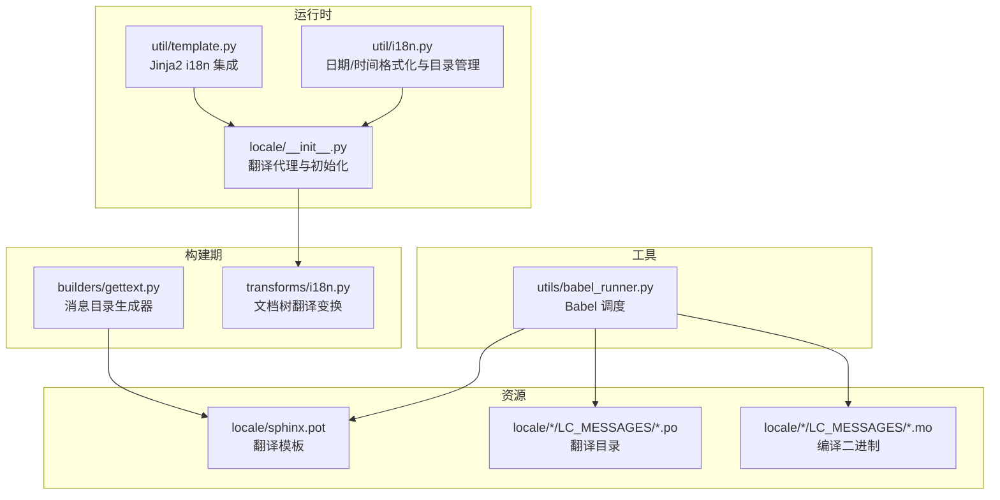
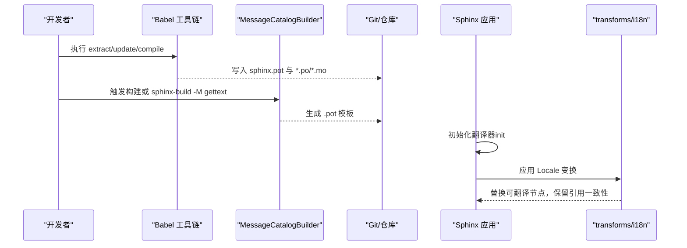
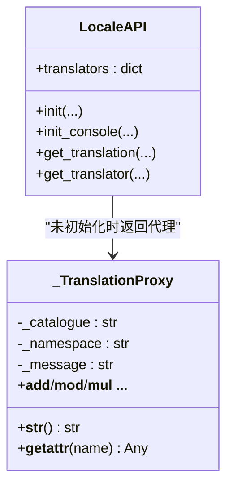
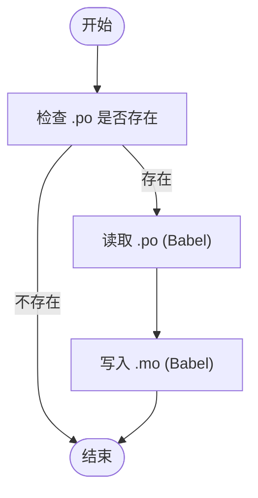
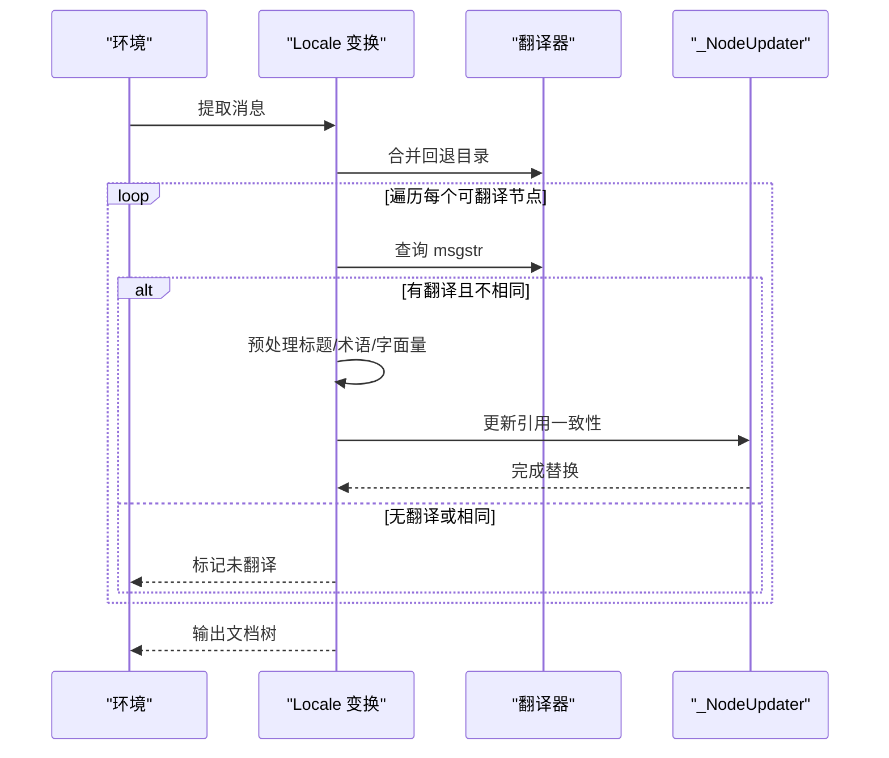
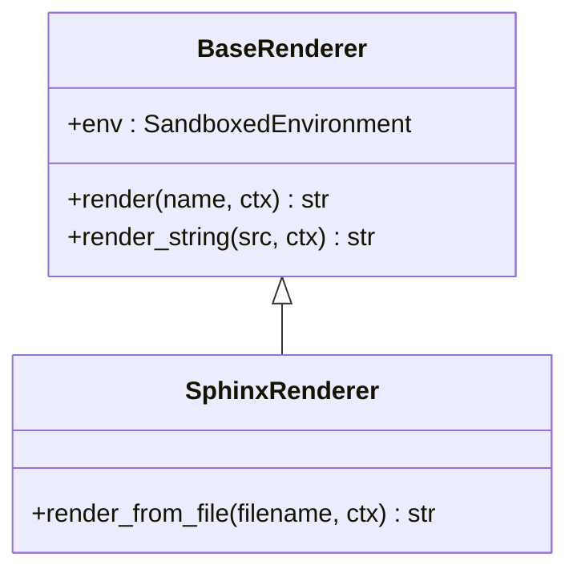
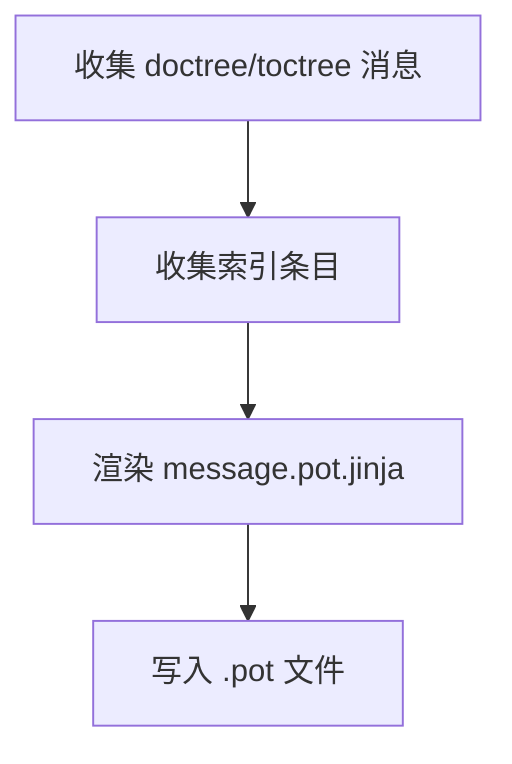
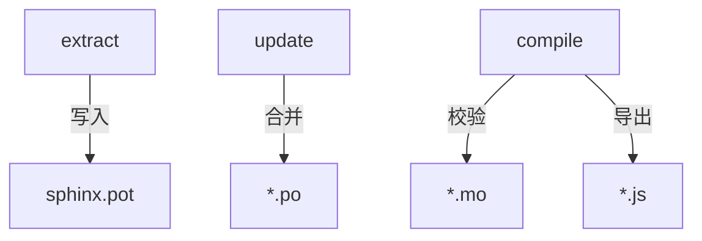
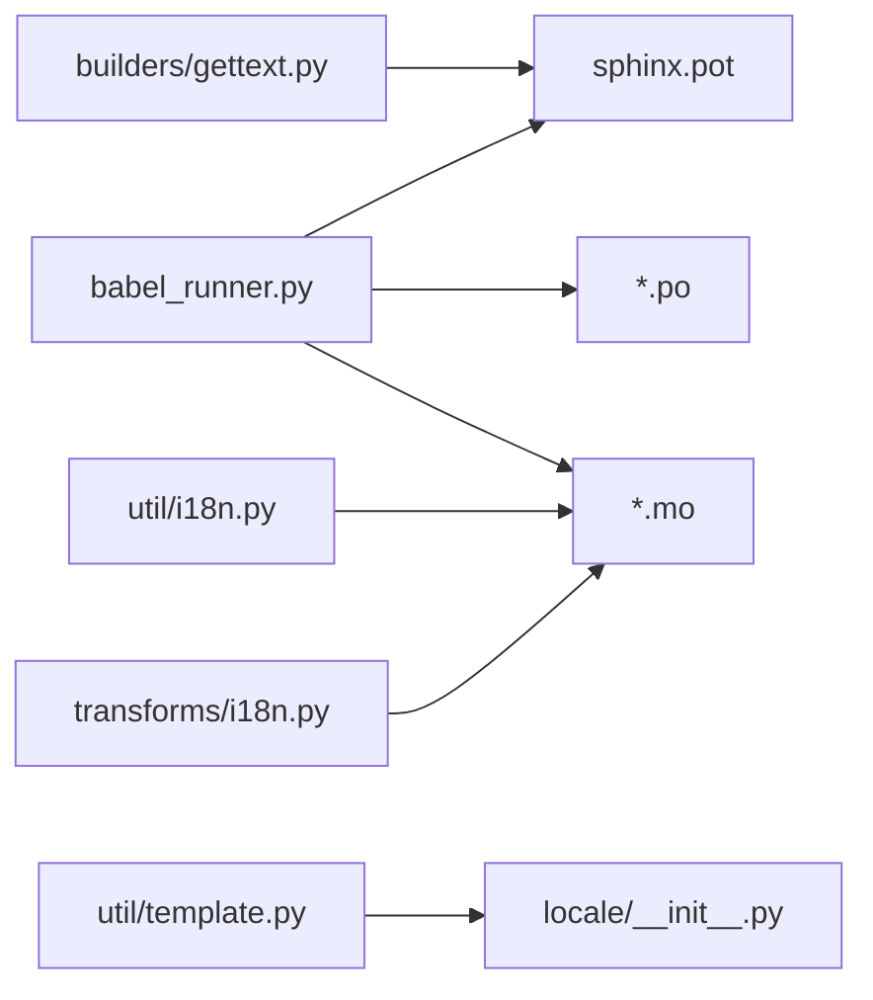

# 国际化

<cite>
**本文引用的文件**
- [sphinx\locale\__init__.py](file://sphinx/locale/__init__.py)
- [sphinx\util\i18n.py](file://sphinx/util/i18n.py)
- [sphinx\transforms\i18n.py](file://sphinx/transforms/i18n.py)
- [sphinx\builders\gettext.py](file://sphinx/builders/gettext.py)
- [sphinx\util\template.py](file://sphinx/util/template.py)
- [sphinx\locale\sphinx.pot](file://sphinx/locale/sphinx.pot)
- [utils\babel_runner.py](file://utils/babel_runner.py)
- [doc\usage\advanced\intl.rst](file://doc/usage/advanced/intl.rst)
- [doc\extdev\i18n.rst](file://doc/extdev/i18n.rst)
- [tests\test_intl\test_intl.py](file://tests/test_intl/test_intl.py)
- [tests\test_util\test_util_i18n.py](file://tests/test_util/test_util_i18n.py)
- [sphinx\config.py](file://sphinx/config.py)
</cite>

## 目录
1. [引言](#引言)
2. [项目结构](#项目结构)
3. [核心组件](#核心组件)
4. [架构总览](#架构总览)
5. [详细组件分析](#详细组件分析)
6. [依赖分析](#依赖分析)
7. [性能考虑](#性能考虑)
8. [故障排查指南](#故障排查指南)
9. [结论](#结论)
10. [附录](#附录)

## 引言
本文件系统性阐述 Sphinx 的国际化（i18n）与本地化（l10n）体系：从架构设计、多语言支持机制、翻译流程（消息提取、翻译文件格式与更新）、Babel 集成与编译、到翻译贡献规范、本地化最佳实践、模板与动态翻译、性能优化与缓存策略，以及工具链与自动化工作流。目标是帮助维护者与贡献者高效理解并参与 Sphinx 的国际化。

## 项目结构
围绕国际化的核心代码与资源分布如下：
- 运行时翻译代理与初始化：sphinx/locale
- 构建期消息目录生成：sphinx/builders/gettext.py
- 文档树翻译变换：sphinx/transforms/i18n.py
- 本地化工具与日期/时间格式化：sphinx/util/i18n.py
- 模板渲染与翻译集成：sphinx/util/template.py
- 翻译模板与多语言目录：sphinx/locale/*.po, sphinx/locale/sphinx.pot
- Babel 工具链脚本：utils/babel_runner.py
- 用户文档与扩展开发者指南：doc/usage/advanced/intl.rst, doc/extdev/i18n.rst
- 测试用例：tests/test_intl/*, tests/test_util/test_util_i18n.py

图表来源
- [sphinx/locale/__init__.py:101-144](file://sphinx/locale/__init__.py#L101-L144)
- [sphinx/util/template.py:29-41](file://sphinx/util/template.py#L29-L41)
- [sphinx/util/i18n.py:63-120](file://sphinx/util/i18n.py#L63-L120)
- [sphinx/builders/gettext.py:239-364](file://sphinx/builders/gettext.py#L239-L364)
- [sphinx/transforms/i18n.py:399-630](file://sphinx/transforms/i18n.py#L399-L630)
- [utils/babel_runner.py:82-127](file://utils/babel_runner.py#L82-L127)

章节来源
- [sphinx/locale/__init__.py:101-144](file://sphinx/locale/__init__.py#L101-L144)
- [sphinx/util/template.py:29-41](file://sphinx/util/template.py#L29-L41)
- [sphinx/util/i18n.py:63-120](file://sphinx/util/i18n.py#L63-L120)
- [sphinx/builders/gettext.py:239-364](file://sphinx/builders/gettext.py#L239-L364)
- [sphinx/transforms/i18n.py:399-630](file://sphinx/transforms/i18n.py#L399-L630)
- [utils/babel_runner.py:82-127](file://utils/babel_runner.py#L82-L127)

## 核心组件
- 翻译代理与初始化
  - 提供延迟翻译代理对象，支持字符串运算与比较；在未初始化时返回代理，初始化后委托给实际翻译器。
  - 支持按命名空间与目录域注册翻译器，并合并多个 .mo 文件。
- 消息目录与编译
  - 通过 CatalogInfo/CatalogRepository 管理 .po/.mo 生命周期，判断过期并写入 .mo。
  - 通过 Babel 读取 .po 并写入 .mo，同时进行校验与错误日志。
- 文档树翻译变换
  - 在解析阶段提取可翻译消息，加载翻译并替换节点内容，保持引用一致性与标题映射。
- 模板与渲染
  - Jinja2 环境安装 gettext 翻译函数，使模板内可直接使用翻译。
- 构建期消息目录生成
  - MessageCatalogBuilder 从源码与模板中抽取消息，生成 .pot 模板文件。
- Babel 工具链
  - 提供 extract/update/compile 命令，自动扫描 Python/Jinja2/JS 源码与模板，生成/更新/编译翻译目录。

章节来源
- [sphinx/locale/__init__.py:21-144](file://sphinx/locale/__init__.py#L21-L144)
- [sphinx/util/i18n.py:63-120](file://sphinx/util/i18n.py#L63-L120)
- [sphinx/transforms/i18n.py:103-630](file://sphinx/transforms/i18n.py#L103-L630)
- [sphinx/util/template.py:29-41](file://sphinx/util/template.py#L29-L41)
- [sphinx/builders/gettext.py:239-364](file://sphinx/builders/gettext.py#L239-L364)
- [utils/babel_runner.py:82-300](file://utils/babel_runner.py#L82-L300)

## 架构总览
Sphinx 的国际化由“构建期生成 + 运行时应用”两部分构成：
- 构建期：MessageCatalogBuilder 与 Babel 工具链负责从源码与模板抽取消息，生成 .pot 模板，并将 .po 更新与编译为 .mo。
- 运行时：transforms/i18n 将已编译的 .mo 加载到内存，对文档树中的可翻译节点进行替换，同时确保交叉引用与标题等结构一致。

图表来源
- [sphinx/builders/gettext.py:286-330](file://sphinx/builders/gettext.py#L286-L330)
- [utils/babel_runner.py:82-300](file://utils/babel_runner.py#L82-L300)
- [sphinx/transforms/i18n.py:399-630](file://sphinx/transforms/i18n.py#L399-L630)
- [sphinx/locale/__init__.py:104-144](file://sphinx/locale/__init__.py#L104-L144)

## 详细组件分析

### 组件 A：翻译代理与初始化（sphinx/locale）
- 设计要点
  - _TranslationProxy 实现惰性求值，避免在未初始化时抛异常。
  - translators 字典按 (namespace, catalog) 注册翻译器，支持回退链合并。
  - init/init_console 支持从多路径加载 .mo 并合并，保证幂等。
- 关键接口
  - init(locale_dirs, language, catalog, namespace)
  - get_translation(catalog, namespace) 返回可调用的 gettext 函数
  - _ 与 __ 分别用于文档与控制台翻译

图表来源
- [sphinx/locale/__init__.py:21-144](file://sphinx/locale/__init__.py#L21-L144)

章节来源
- [sphinx/locale/__init__.py:21-144](file://sphinx/locale/__init__.py#L21-L144)

### 组件 B：消息目录与编译（sphinx/util/i18n.py）
- CatalogInfo
  - 表示单个目录域的消息目录，提供 po/mo 路径与过期判断。
- CatalogRepository
  - 遍历 locale_dirs 与语言目录，枚举所有 .po 并产出 CatalogInfo。
- write_mo
  - 使用 Babel 读取 .po 并写入 .mo，记录读写错误。

图表来源
- [sphinx/util/i18n.py:94-119](file://sphinx/util/i18n.py#L94-L119)

章节来源
- [sphinx/util/i18n.py:63-120](file://sphinx/util/i18n.py#L63-L120)

### 组件 C：文档树翻译变换（sphinx/transforms/i18n.py）
- 主要流程
  - 提取可翻译消息（含索引条目），加载翻译器并合并多级回退。
  - 预处理阶段：标题映射、术语拆分、占位字面量处理。
  - 正式替换阶段：保持引用一致性（脚注、参考、待定交叉引用等），必要时重建字面量块。
  - 后处理：统计翻译进度、添加 CSS 类、移除翻译占位内联节点。
- 关键点
  - parse_noqa 支持在翻译文本末尾加 #noqa 忽略一致性警告。
  - 对 literal_blocks 与非 literal_blocks 的处理差异，避免解析警告。

图表来源
- [sphinx/transforms/i18n.py:408-630](file://sphinx/transforms/i18n.py#L408-L630)

章节来源
- [sphinx/transforms/i18n.py:103-721](file://sphinx/transforms/i18n.py#L103-L721)

### 组件 D：模板与动态翻译（sphinx/util/template.py）
- BaseRenderer 安装 gettext 翻译函数，使模板内可直接使用翻译。
- SphinxRenderer/ReSTRenderer/LaTeXRenderer 提供不同上下文的渲染器与过滤器。
- 与 locale.get_translator 协作，实现模板层的动态翻译。

图表来源
- [sphinx/util/template.py:29-106](file://sphinx/util/template.py#L29-L106)

章节来源
- [sphinx/util/template.py:29-106](file://sphinx/util/template.py#L29-L106)

### 组件 E：构建期消息目录生成（sphinx/builders/gettext.py）
- MessageCatalogBuilder
  - 从 doctree 与 toctree 中抽取消息，支持索引条目与附加目标。
  - 生成 .pot 模板，控制 POT/PO 头部信息与时间戳。
- GettextRenderer
  - 渲染模板 message.pot.jinja，注入版本、版权、最后翻译者、语言团队等元数据。
- 配置项
  - gettext_compact、gettext_location、gettext_uuid、gettext_auto_build、gettext_additional_targets、gettext_last_translator、gettext_language_team。

图表来源
- [sphinx/builders/gettext.py:179-330](file://sphinx/builders/gettext.py#L179-L330)

章节来源
- [sphinx/builders/gettext.py:239-364](file://sphinx/builders/gettext.py#L239-L364)

### 组件 F：Babel 集成与翻译编译（utils/babel_runner.py）
- extract：扫描 Python/Jinja2/JS 源码与模板，生成 sphinx/locale/sphinx.pot。
- update：将 sphinx.pot 合并到各语言的 *.po。
- compile：校验 *.po，生成 *.mo，并额外输出 *.js（包含 JS 中出现的消息与复数表达）。
- 支持 CI 下汇总错误信息至文件，便于 PR 审查。

图表来源
- [utils/babel_runner.py:82-300](file://utils/babel_runner.py#L82-L300)
- [sphinx/locale/sphinx.pot:1-50](file://sphinx/locale/sphinx.pot#L1-L50)

章节来源
- [utils/babel_runner.py:82-300](file://utils/babel_runner.py#L82-L300)
- [sphinx/locale/sphinx.pot:1-50](file://sphinx/locale/sphinx.pot#L1-L50)

## 依赖分析
- 组件耦合
  - transforms/i18n 依赖 locale 初始化与 util/i18n 的目录管理。
  - builders/gettext 与 util/i18n 共同维护 .pot/.po/.mo 生命周期。
  - util/template 依赖 locale 的翻译函数，实现模板层翻译。
  - utils/babel_runner 作为外部工具链，与 sphinx/locale 同步更新。
- 外部依赖
  - Babel：消息提取、读写 .po/.mo、校验与复数表达。
  - Jinja2：模板渲染与 i18n 扩展。

图表来源
- [utils/babel_runner.py:82-300](file://utils/babel_runner.py#L82-L300)
- [sphinx/builders/gettext.py:239-364](file://sphinx/builders/gettext.py#L239-L364)
- [sphinx/util/i18n.py:63-120](file://sphinx/util/i18n.py#L63-L120)
- [sphinx/transforms/i18n.py:399-630](file://sphinx/transforms/i18n.py#L399-L630)
- [sphinx/util/template.py:29-41](file://sphinx/util/template.py#L29-L41)
- [sphinx/locale/__init__.py:104-144](file://sphinx/locale/__init__.py#L104-L144)

章节来源
- [utils/babel_runner.py:82-300](file://utils/babel_runner.py#L82-L300)
- [sphinx/builders/gettext.py:239-364](file://sphinx/builders/gettext.py#L239-L364)
- [sphinx/util/i18n.py:63-120](file://sphinx/util/i18n.py#L63-L120)
- [sphinx/transforms/i18n.py:399-630](file://sphinx/transforms/i18n.py#L399-L630)
- [sphinx/util/template.py:29-41](file://sphinx/util/template.py#L29-L41)
- [sphinx/locale/__init__.py:104-144](file://sphinx/locale/__init__.py#L104-L144)

## 性能考虑
- 编译与缓存
  - .mo 文件由 Babel 编译，运行时直接加载，避免重复解析 .po。
  - CatalogInfo.is_outdated 仅在 .mo 不存在或早于 .po 时触发重新编译。
- 构建效率
  - MessageCatalogBuilder 仅在需要时写入 .pot，通过头部/修订时间比较避免不必要的覆盖。
  - gettext_compact 控制目录域命名，减少目录层级与 IO。
- 渲染性能
  - 模板翻译通过 Jinja2 i18n 扩展，按需翻译，避免全局替换。
- 本地化格式
  - format_date 使用 babel.dates.* 接口，支持多种 locale 与格式映射，避免自定义格式化开销。

章节来源
- [sphinx/util/i18n.py:89-119](file://sphinx/util/i18n.py#L89-L119)
- [sphinx/builders/gettext.py:210-228](file://sphinx/builders/gettext.py#L210-L228)
- [sphinx/util/i18n.py:263-314](file://sphinx/util/i18n.py#L263-L314)

## 故障排查指南
- 常见问题
  - 未找到翻译：确认 locale_dirs 与 language 设置正确，检查 .mo 是否生成。
  - 引用不一致警告：检查翻译文本是否删除/新增了引用，必要时在翻译末尾添加 #noqa。
  - 模板翻译无效：确认模板渲染器已安装 gettext 翻译函数。
  - 日期/时间格式异常：检查 format_date 的输入格式与 locale，必要时使用 %x/%X/%c。
- 日志与诊断
  - Babel 编译阶段会输出错误摘要，可在 CI 下汇总至文件。
  - transforms/i18n 在引用不一致时输出警告，定位原始与翻译的引用列表。

章节来源
- [sphinx/transforms/i18n.py:129-161](file://sphinx/transforms/i18n.py#L129-L161)
- [utils/babel_runner.py:194-262](file://utils/babel_runner.py#L194-L262)
- [sphinx/util/i18n.py:240-261](file://sphinx/util/i18n.py#L240-L261)

## 结论
Sphinx 的国际化体系以 GNU gettext 为核心，结合构建期的 MessageCatalogBuilder 与 Babel 工具链，形成“模板生成—目录更新—编译—运行时替换”的完整闭环。运行时通过 transforms/i18n 与模板层的 i18n 集成，确保文档树与模板均可获得一致的本地化体验。配合测试用例与配置项，该体系既满足大规模多语言需求，又具备良好的可维护性与可扩展性。

## 附录

### 翻译流程（消息提取、翻译文件格式与更新）
- 模板生成：MessageCatalogBuilder 从 doctree/toctree 与索引条目抽取消息，渲染 .pot 模板。
- 目录更新：Babel 将 .pot 合并到各语言 *.po。
- 编译：Babel 校验 *.po 并生成 *.mo；同时导出 *.js（含 JS 消息与复数表达）。
- 运行时应用：transforms/i18n 加载 .mo，替换文档树中的可翻译节点并保持引用一致性。

章节来源
- [sphinx/builders/gettext.py:286-330](file://sphinx/builders/gettext.py#L286-L330)
- [utils/babel_runner.py:129-252](file://utils/babel_runner.py#L129-L252)
- [sphinx/transforms/i18n.py:408-630](file://sphinx/transforms/i18n.py#L408-L630)

### Babel 集成与翻译编译过程
- 提取范围：Python、Jinja2 模板（HTML/XML/LaTeX）、JavaScript。
- 关键选项：编码、忽略标签、属性包含、LaTeX 特殊分隔符。
- 编译产物：*.mo（二进制）、*.js（JS 消息字典）。

章节来源
- [utils/babel_runner.py:45-79](file://utils/babel_runner.py#L45-L79)
- [utils/babel_runner.py:165-252](file://utils/babel_runner.py#L165-L252)

### 翻译贡献指南
- 扩展开发者
  - 使用 sphinx.locale.get_translation 获取翻译函数，标记扩展内的消息为可翻译。
  - 通过 Babel 生成/更新/编译扩展自身的 *.pot/*.po/*.mo。
- 项目维护者
  - 使用 sphinx-build -M gettext 或 make gettext 生成 .pot。
  - 使用 sphinx-intl 或 Babel 更新与编译 .po/.mo。
  - 在 CI 中执行 Babel 校验，汇总错误以便审查。

章节来源
- [doc/extdev/i18n.rst:19-98](file://doc/extdev/i18n.rst#L19-L98)
- [doc/usage/advanced/intl.rst:89-206](file://doc/usage/advanced/intl.rst#L89-L206)

### 本地化最佳实践
- 日期/时间格式
  - 使用 format_date，支持 %x/%X/%c 与本地化格式映射，自动回退到英文。
  - 支持本地时间与 UTC 时间切换，兼容 SOURCE_DATE_EPOCH。
- 数字与文本方向
  - 优先使用 Babel 的本地化格式化能力；文本方向（RTL）应通过主题与 CSS 处理。
- 图片与多语言资源
  - 使用 figure_language_filename 按语言选择图片文件名与路径。

章节来源
- [sphinx/util/i18n.py:176-314](file://sphinx/util/i18n.py#L176-L314)
- [sphinx/util/i18n.py:316-344](file://sphinx/util/i18n.py#L316-L344)

### 翻译模板系统与动态翻译机制
- 模板层翻译：BaseRenderer 安装 gettext 翻译函数，模板中可直接使用翻译。
- 动态翻译：locale.get_translation 返回可调用的 gettext，支持命名空间与目录域。

章节来源
- [sphinx/util/template.py:29-41](file://sphinx/util/template.py#L29-L41)
- [sphinx/locale/__init__.py:181-225](file://sphinx/locale/__init__.py#L181-L225)

### 翻译性能优化与缓存策略
- .mo 缓存：运行时直接加载二进制目录，避免 .po 解析。
- 目录过期检测：CatalogInfo.is_outdated 仅在 .mo 不存在或早于 .po 时重建。
- .pot 写入去重：should_write 比较头部与修订时间，避免重复写入。

章节来源
- [sphinx/util/i18n.py:89-119](file://sphinx/util/i18n.py#L89-L119)
- [sphinx/builders/gettext.py:210-228](file://sphinx/builders/gettext.py#L210-L228)

### 翻译工具链与自动化工作流
- 开发期：utils/babel_runner 提供 extract/update/compile/all。
- CI 集成：在 CI 环境下汇总 Babel 错误，便于 PR 审查。
- 文档侧：doc/usage/advanced/intl.rst 提供 sphinx-intl 与 Transifex/Weblate 的使用指引。

章节来源
- [utils/babel_runner.py:280-300](file://utils/babel_runner.py#L280-L300)
- [doc/usage/advanced/intl.rst:222-364](file://doc/usage/advanced/intl.rst#L222-L364)