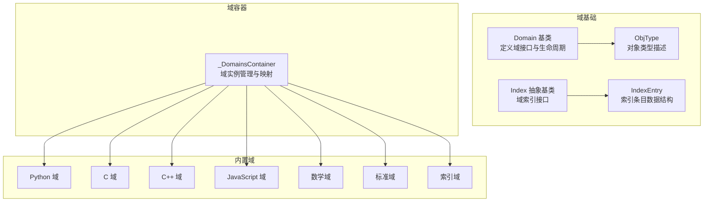
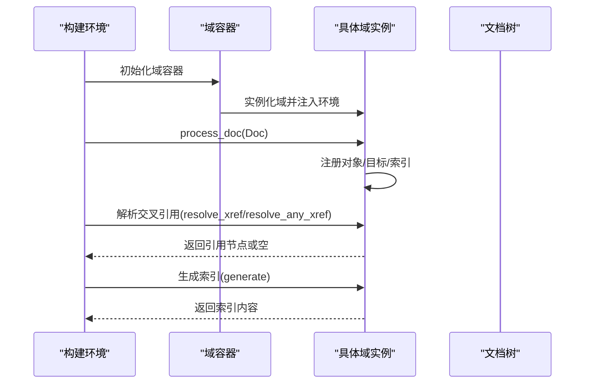
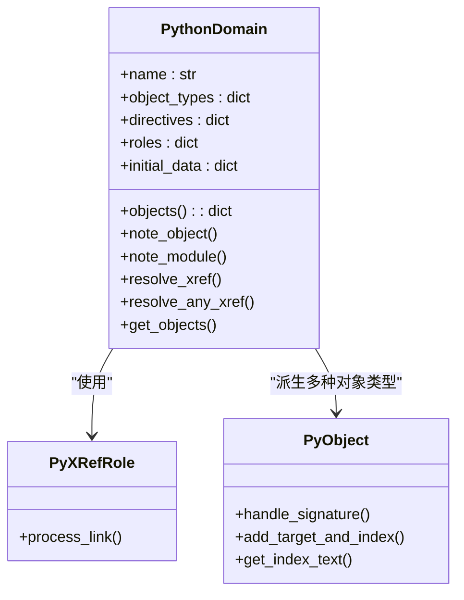
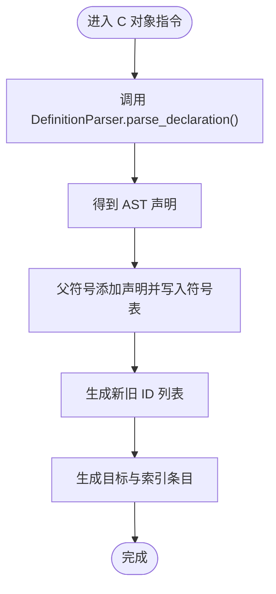
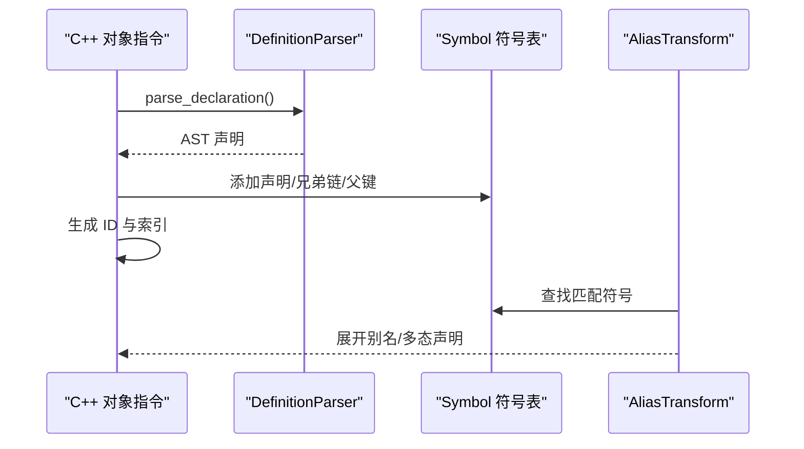
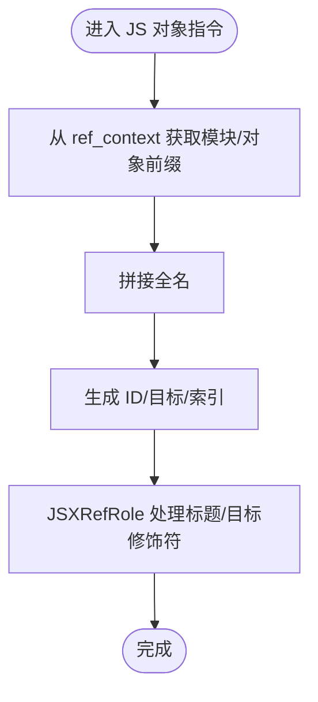
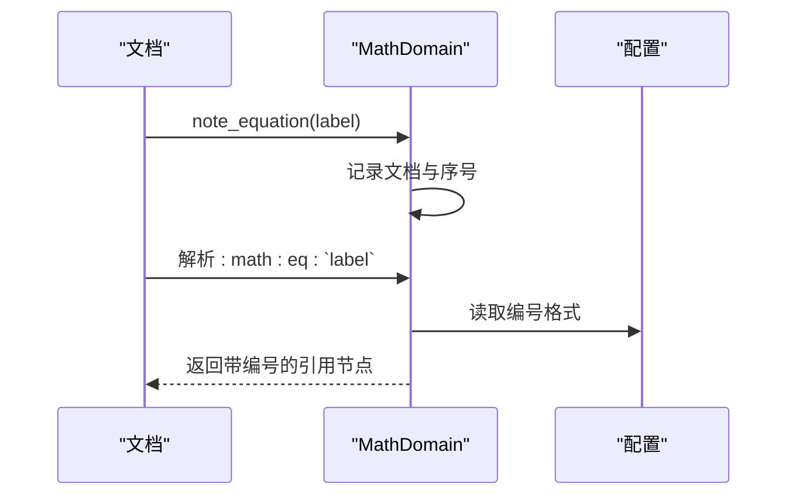
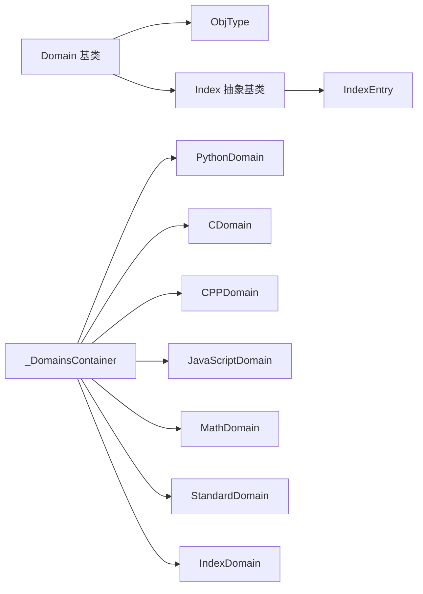

# 域系统

<cite>
**本文档引用的文件**
- [sphinx/domains/__init__.py](file://sphinx/domains/__init__.py)
- [sphinx/domains/_domains_container.py](file://sphinx/domains/_domains_container.py)
- [sphinx/domains/index.py](file://sphinx/domains/index.py)
- [sphinx/domains/_index.py](file://sphinx/domains/_index.py)
- [sphinx/domains/python/__init__.py](file://sphinx/domains/python/__init__.py)
- [sphinx/domains/c/__init__.py](file://sphinx/domains/c/__init__.py)
- [sphinx/domains/cpp/__init__.py](file://sphinx/domains/cpp/__init__.py)
- [sphinx/domains/javascript.py](file://sphinx/domains/javascript.py)
- [sphinx/domains/math.py](file://sphinx/domains/math.py)
- [sphinx/domains/std/__init__.py](file://sphinx/domains/std/__init__.py)
- [doc/usage/domains/index.rst](file://doc/usage/domains/index.rst)
- [doc/usage/domains/python.rst](file://doc/usage/domains/python.rst)
- [doc/usage/domains/c.rst](file://doc/usage/domains/c.rst)
- [doc/usage/domains/cpp.rst](file://doc/usage/domains/cpp.rst)
- [doc/usage/domains/javascript.rst](file://doc/usage/domains/javascript.rst)
- [doc/usage/domains/mathematics.rst](file://doc/usage/domains/mathematics.rst)
</cite>

## 目录
1. [引言](#引言)
2. [项目结构](#项目结构)
3. [核心组件](#核心组件)
4. [架构总览](#架构总览)
5. [详细组件分析](#详细组件分析)
6. [依赖关系分析](#依赖关系分析)
7. [性能考虑](#性能考虑)
8. [故障排除指南](#故障排除指南)
9. [结论](#结论)
10. [附录](#附录)

## 引言
本文件系统性阐述 Sphinx 域（Domain）体系的设计与实现，涵盖域的概念、语言特定对象分类机制、Python/C/C++/JavaScript/Math 等内置域的实现细节，以及数学公式渲染与交叉引用、标准域与索引机制、域配置选项与使用示例，并提供自定义域开发指南与最佳实践。

## 项目结构
域系统由“域基类”“域容器”“内置域实现”“索引与索引条目”等组成，采用“按语言/功能划分”的模块化组织方式。核心入口位于 sphinx/domains，各语言域在子目录中实现；文档层面通过 doc/usage/domains 提供使用说明与示例。

图表来源
- [sphinx/domains/__init__.py:38-332](file://sphinx/domains/__init__.py#L38-L332)
- [sphinx/domains/_domains_container.py:28-154](file://sphinx/domains/_domains_container.py#L28-L154)
- [sphinx/domains/_index.py:55-109](file://sphinx/domains/_index.py#L55-L109)

章节来源
- [sphinx/domains/__init__.py:1-332](file://sphinx/domains/__init__.py#L1-L332)
- [sphinx/domains/_domains_container.py:1-287](file://sphinx/domains/_domains_container.py#L1-L287)
- [sphinx/domains/_index.py:1-109](file://sphinx/domains/_index.py#L1-L109)

## 核心组件
- Domain 基类：统一域的生命周期、对象注册、索引生成、交叉引用解析、并行构建合并等接口。
- ObjType：描述对象类型及其角色映射、搜索优先级等属性。
- Index/IndexEntry：定义域索引的数据结构与生成流程。
- _DomainsContainer：域实例的集中管理与访问接口，支持默认域与第三方域扩展。

章节来源
- [sphinx/domains/__init__.py:38-332](file://sphinx/domains/__init__.py#L38-L332)
- [sphinx/domains/_index.py:17-109](file://sphinx/domains/_index.py#L17-L109)
- [sphinx/domains/_domains_container.py:28-154](file://sphinx/domains/_domains_container.py#L28-L154)

## 架构总览
域系统通过“域容器”聚合所有域实例，每个域维护自身对象存储与索引；在构建阶段，域负责处理文档、建立目标与索引、解析交叉引用；在输出阶段，域参与索引页生成与可枚举节点编号。

图表来源
- [sphinx/domains/__init__.py:218-282](file://sphinx/domains/__init__.py#L218-L282)
- [sphinx/domains/_domains_container.py:165-183](file://sphinx/domains/_domains_container.py#L165-L183)

## 详细组件分析

### Python 域
- 设计要点
  - 对象类型：函数、类、方法、属性、数据、异常、类型别名、模块等。
  - 角色：模块、函数、类、属性、类型等跨引用角色。
  - 指令：模块声明、当前模块上下文、各类对象描述指令。
  - 索引：模块索引。
- 自动识别与链接
  - 在 handle_signature/add_target_and_index 中生成唯一 ID、目标与索引条目。
  - 通过 note_object/note_module 维护对象与模块注册表。
  - 交叉引用解析通过 find_obj 与 make_refnode 完成。
- 配置与选项
  - 支持单行参数列表、类型参数行控制、模块名显示策略等。
- 使用示例
  - 参考文档中的模块、函数、类、方法、属性、装饰器、类型别名等指令与角色用法。

图表来源
- [sphinx/domains/python/__init__.py:720-800](file://sphinx/domains/python/__init__.py#L720-L800)
- [sphinx/domains/python/__init__.py:559-601](file://sphinx/domains/python/__init__.py#L559-L601)
- [sphinx/domains/python/__init__.py:75-131](file://sphinx/domains/python/__init__.py#L75-L131)

章节来源
- [sphinx/domains/python/__init__.py:1-1132](file://sphinx/domains/python/__init__.py#L1-L1132)
- [doc/usage/domains/python.rst:1-875](file://doc/usage/domains/python.rst#L1-L875)

### C 域
- 设计要点
  - 对象类型：成员/变量、函数、宏、结构体、联合体、枚举、枚举器、类型、函数参数等。
  - 符号表：基于命名空间栈与父符号指针，支持嵌套与兄弟声明链。
  - 语法解析：DefinitionParser 将 C 声明解析为 AST，再转换为签名节点。
  - 交叉引用：CXRefRole 处理标题与目标修饰符，AliasTransform 支持别名展开。
- 语法解析与符号表
  - handle_signature 调用 DefinitionParser.parse_declaration，生成 AST 并写入符号表。
  - add_target_and_index 生成多版本 ID 并写入索引。
- 配置与选项
  - 支持单行参数列表、最大签名长度等控制项。

图表来源
- [sphinx/domains/c/__init__.py:234-300](file://sphinx/domains/c/__init__.py#L234-L300)
- [sphinx/domains/c/__init__.py:163-201](file://sphinx/domains/c/__init__.py#L163-L201)

章节来源
- [sphinx/domains/c/__init__.py:1-999](file://sphinx/domains/c/__init__.py#L1-L999)
- [doc/usage/domains/c.rst:1-368](file://doc/usage/domains/c.rst#L1-L368)

### C++ 域
- 设计要点
  - 对象类型：类/结构体、函数、成员变量、类型别名、枚举、枚举器、概念、联合体等。
  - 语法解析：DefinitionParser 解析 C++ 声明，支持模板、约束、特化、作用域等。
  - 符号表：Symbol 树，支持匿名实体、嵌套作用域、兄弟链、父键查找。
  - 交叉引用：AliasTransform 支持别名与多态展开，Token 化表达式渲染。
- 语法解析与符号表
  - handle_signature 调用 DefinitionParser.parse_declaration，生成 AST 并写入符号表。
  - add_target_and_index 生成 ID 并写入索引，避免在 concept 内部重复索引。
- 配置与选项
  - 支持单行参数列表、模板参数行规范等。

图表来源
- [sphinx/domains/cpp/__init__.py:349-416](file://sphinx/domains/cpp/__init__.py#L349-L416)
- [sphinx/domains/cpp/__init__.py:651-800](file://sphinx/domains/cpp/__init__.py#L651-L800)

章节来源
- [sphinx/domains/cpp/__init__.py:1-1337](file://sphinx/domains/cpp/__init__.py#L1-L1337)
- [doc/usage/domains/cpp.rst:1-761](file://doc/usage/domains/cpp.rst#L1-L761)

### JavaScript 域
- 设计要点
  - 对象类型：函数、方法、类构造器、数据、属性、模块。
  - 嵌套命名：通过 ref_context 维护 js:object/js:module 前缀，支持嵌套前缀累积。
  - 交叉引用：JSXRefRole 处理标题与目标修饰符，支持“仅显示最后一段”等行为。
  - 模块索引：note_module/note_object 维护模块与对象注册表。
- 交叉引用解析
  - find_obj 按模块名+前缀+名称的顺序搜索，支持 refspecific 控制搜索优先级。

图表来源
- [sphinx/domains/javascript.py:64-144](file://sphinx/domains/javascript.py#L64-L144)
- [sphinx/domains/javascript.py:386-410](file://sphinx/domains/javascript.py#L386-L410)

章节来源
- [sphinx/domains/javascript.py:1-596](file://sphinx/domains/javascript.py#L1-L596)
- [doc/usage/domains/javascript.rst:1-133](file://doc/usage/domains/javascript.rst#L1-L133)

### 数学域
- 设计要点
  - 角色：eq（方程标签引用）、numref（编号引用）。
  - 可枚举节点：数学块 displaymath 编号。
  - 方程登记：note_equation 维护标签到文档与序号的映射。
  - 交叉引用：resolve_xref 根据标签返回带编号的引用节点。
- 公式渲染与交叉引用
  - 通过角色与编号格式配置生成可读的方程引用。

图表来源
- [sphinx/domains/math.py:69-134](file://sphinx/domains/math.py#L69-L134)

章节来源
- [sphinx/domains/math.py:1-171](file://sphinx/domains/math.py#L1-L171)
- [doc/usage/domains/mathematics.rst:1-23](file://doc/usage/domains/mathematics.rst#L1-L23)

### 标准域
- 设计要点
  - 通用对象：术语、令牌、标签、配置值、环境变量、程序选项、文档等。
  - 角色：option、confval、envvar、token、term、ref、numref、keyword、doc。
  - 索引：术语、令牌、标签、配置值、环境变量、程序选项、文档等。
  - 可枚举节点：figure 等编号支持。
- 术语与令牌
  - glossary 指令与 token_xrefs 将语法令牌转换为交叉引用。

章节来源
- [sphinx/domains/std/__init__.py:721-800](file://sphinx/domains/std/__init__.py#L721-L800)
- [doc/usage/domains/index.rst:1-242](file://doc/usage/domains/index.rst#L1-L242)

### 索引域
- 设计要点
  - Index/IndexEntry 定义索引条目结构与生成接口。
  - IndexDomain 负责收集与处理索引条目，提供索引指令与角色。

章节来源
- [sphinx/domains/_index.py:17-109](file://sphinx/domains/_index.py#L17-L109)
- [sphinx/domains/index.py:31-131](file://sphinx/domains/index.py#L31-L131)

## 依赖关系分析
域系统内部依赖清晰：Domain 基类定义统一接口；ObjType/Index 为域提供类型与索引抽象；_DomainsContainer 聚合域实例；各语言域实现具体解析与符号表逻辑；标准域提供通用对象与索引能力；数学域提供公式编号与引用。

图表来源
- [sphinx/domains/__init__.py:38-105](file://sphinx/domains/__init__.py#L38-L105)
- [sphinx/domains/_domains_container.py:28-154](file://sphinx/domains/_domains_container.py#L28-L154)
- [sphinx/domains/_index.py:55-109](file://sphinx/domains/_index.py#L55-L109)

章节来源
- [sphinx/domains/__init__.py:1-332](file://sphinx/domains/__init__.py#L1-L332)
- [sphinx/domains/_domains_container.py:1-287](file://sphinx/domains/_domains_container.py#L1-L287)
- [sphinx/domains/_index.py:1-109](file://sphinx/domains/_index.py#L1-L109)

## 性能考虑
- 符号表与查找
  - C/C++ 域通过符号树与父键/兄弟链减少全局扫描成本；注意避免在函数体内嵌套声明以降低查找复杂度。
- 交叉引用解析
  - Python/C/C++/JS 域均提供 refspecific 优化路径，优先在更具体的命名空间内查找，减少歧义。
- 并行构建
  - 域需实现 merge_domaindata 以支持并行构建时的数据合并；未实现将抛出 NotImplementedError。
- 索引生成
  - 合理使用 no-index/no-index-entry/no-contents-entry 控制索引规模，提升构建效率。

## 故障排除指南
- 域数据版本不匹配
  - 当域数据版本号与环境不一致时会触发 OSError，需清理缓存或升级版本。
- 重复声明
  - C/C++ 域在重复声明时记录警告并保留旧符号，检查重复定义与版本兼容 ID。
- 交叉引用缺失
  - 标准域与数学域提供 danging_warnings，检查目标是否正确定义与注册。
- C++ 函数体内声明
  - C++ 域禁止在函数体内声明对象，会在运行时记录警告并跳过该声明。

章节来源
- [sphinx/domains/__init__.py:128-129](file://sphinx/domains/__init__.py#L128-L129)
- [sphinx/domains/c/__init__.py:274-291](file://sphinx/domains/c/__init__.py#L274-L291)
- [sphinx/domains/cpp/__init__.py:332-342](file://sphinx/domains/cpp/__init__.py#L332-L342)
- [sphinx/domains/math.py:55-57](file://sphinx/domains/math.py#L55-L57)

## 结论
Sphinx 域系统通过统一的 Domain 接口与灵活的符号表/索引机制，实现了对多语言与多领域文档的统一建模与交叉引用。Python/C/C++/JavaScript/Math 等域分别针对各自语言的语法与语义提供了精确的解析与渲染能力；标准域与索引域则保证了跨域的一致性与可检索性。遵循本文档的配置与开发指南，可高效扩展新的域并集成到构建流程中。

## 附录

### 域配置选项与使用示例
- Python 域
  - 指令选项：async、canonical、module、single-line-parameter-list、single-line-type-parameter-list 等。
  - 示例参考：模块、函数、类、方法、属性、装饰器、类型别名等。
- C 域
  - 指令选项：single-line-parameter-list；命名空间指令：namespace/namespace-push/namespace-pop；别名指令：alias。
  - 示例参考：函数、宏、struct/union/enum/enumerator、type、匿名实体等。
- C++ 域
  - 指令选项：tparam-line-spec、single-line-parameter-list；别名指令：alias；概念与约束模板支持。
  - 示例参考：类/struct、函数、成员变量、类型别名、枚举、匿名实体、命名空间等。
- JavaScript 域
  - 指令选项：single-line-parameter-list；模块指令：module；对象类型：function/method/class/data/attribute。
  - 示例参考：模块、函数、方法、类构造器、数据、属性等。
- 数学域
  - 角色：math:numref；方程编号与格式可通过配置控制。
  - 示例参考：方程标签与编号引用。

章节来源
- [doc/usage/domains/index.rst:104-242](file://doc/usage/domains/index.rst#L104-L242)
- [doc/usage/domains/python.rst:1-875](file://doc/usage/domains/python.rst#L1-L875)
- [doc/usage/domains/c.rst:1-368](file://doc/usage/domains/c.rst#L1-L368)
- [doc/usage/domains/cpp.rst:1-761](file://doc/usage/domains/cpp.rst#L1-L761)
- [doc/usage/domains/javascript.rst:1-133](file://doc/usage/domains/javascript.rst#L1-L133)
- [doc/usage/domains/mathematics.rst:1-23](file://doc/usage/domains/mathematics.rst#L1-L23)