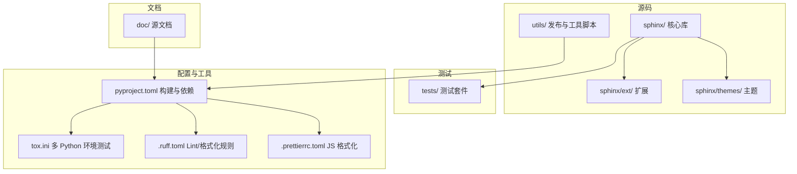
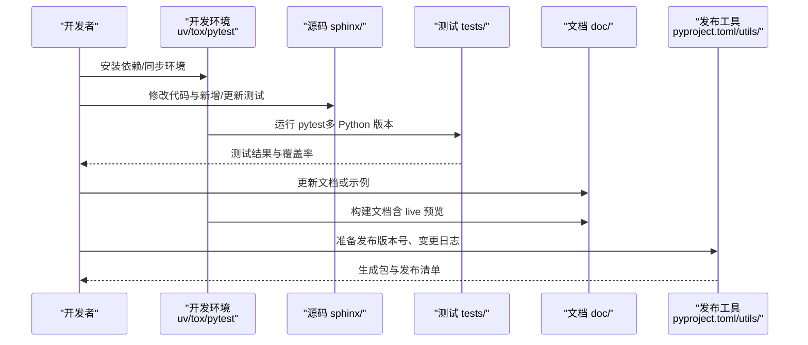
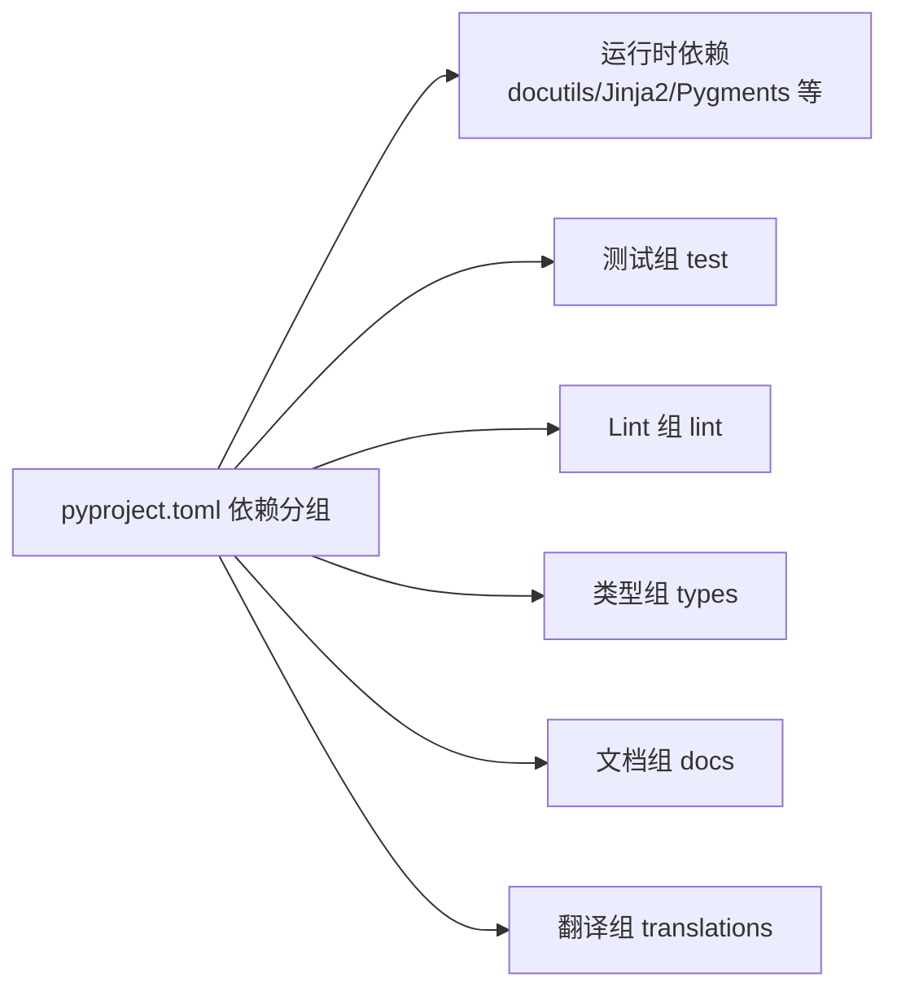

# 开发指南

<cite>
**本文引用的文件**
- [README.rst](file://README.rst)
- [CONTRIBUTING.rst](file://CONTRIBUTING.rst)
- [doc/internals/contributing.rst](file://doc/internals/contributing.rst)
- [doc/internals/release-process.rst](file://doc/internals/release-process.rst)
- [doc/extdev/testing.rst](file://doc/extdev/testing.rst)
- [doc/extdev/index.rst](file://doc/extdev/index.rst)
- [pyproject.toml](file://pyproject.toml)
- [tox.ini](file://tox.ini)
- [.ruff.toml](file://.ruff.toml)
- [.prettierrc.toml](file://.prettierrc.toml)
- [.github/PULL_REQUEST_TEMPLATE.md](file://.github/PULL_REQUEST_TEMPLATE.md)
- [.github/dependabot.yml](file://.github/dependabot.yml)
</cite>

## 目录
1. [简介](#简介)
2. [项目结构](#项目结构)
3. [核心组件](#核心组件)
4. [架构总览](#架构总览)
5. [详细组件分析](#详细组件分析)
6. [依赖分析](#依赖分析)
7. [性能考虑](#性能考虑)
8. [故障排查指南](#故障排查指南)
9. [结论](#结论)
10. [附录](#附录)

## 简介
本指南面向希望参与 Sphinx 开发的贡献者，覆盖开发环境搭建、依赖与虚拟环境配置、IDE 推荐设置、代码贡献流程（分支管理、提交规范、代码审查）、测试架构与策略（单元测试、集成测试、端到端测试）、调试与性能分析方法、发布流程与版本管理策略、文档编写规范与 API 设计原则，以及常见问题的解决方案与最佳实践。

## 项目结构
Sphinx 是一个大型 Python 文档生成器，采用模块化分层组织：核心库位于 sphinx/，扩展与主题位于 sphinx/ext/ 与 sphinx/themes/，测试用例集中在 tests/，文档位于 doc/，构建与质量工具配置在 pyproject.toml、tox.ini、.ruff.toml 等文件中。

图表来源
- [pyproject.toml:1-332](file://pyproject.toml#L1-L332)
- [tox.ini:1-93](file://tox.ini#L1-L93)
- [doc/extdev/index.rst:1-256](file://doc/extdev/index.rst#L1-L256)

章节来源
- [pyproject.toml:1-332](file://pyproject.toml#L1-L332)
- [tox.ini:1-93](file://tox.ini#L1-L93)

## 核心组件
- 构建系统与元数据：使用 flit 作为构建后端，定义项目元信息、依赖、脚本入口与分组依赖。
- 多 Python 版本测试：通过 tox 在 py312/py313/py314/py315 环境运行 pytest。
- 质量工具链：Ruff（lint/format）、mypy、pyright、Prettier（JS）。
- 文档与发布：doc/ 文档树，utils/ 发布检查清单与辅助脚本。
- 测试框架：pytest（Python），Jasmine（JavaScript）。

章节来源
- [pyproject.toml:1-332](file://pyproject.toml#L1-L332)
- [tox.ini:1-93](file://tox.ini#L1-L93)
- [.ruff.toml:1-401](file://.ruff.toml#L1-L401)
- [doc/extdev/testing.rst:1-33](file://doc/extdev/testing.rst#L1-L33)

## 架构总览
下图展示 Sphinx 的典型开发工作流：从本地环境准备、代码修改、测试执行，到文档构建与发布。

图表来源
- [doc/internals/contributing.rst:109-156](file://doc/internals/contributing.rst#L109-L156)
- [tox.ini:28-29](file://tox.ini#L28-L29)
- [pyproject.toml:104-145](file://pyproject.toml#L104-L145)

## 详细组件分析

### 开发环境与依赖管理
- Python 版本要求：>=3.12；支持多版本并行测试。
- 依赖管理：推荐使用 uv（uv sync），也可使用 pip venv 安装可编辑模式。
- 分组依赖：docs、lint、package、test、translations、types 等，便于按需安装。
- 构建后端：flit_core；脚本入口：sphinx-build、sphinx-quickstart、sphinx-apidoc、sphinx-autogen。

章节来源
- [pyproject.toml:20-87](file://pyproject.toml#L20-L87)
- [doc/internals/contributing.rst:96-119](file://doc/internals/contributing.rst#L96-L119)

### 虚拟环境与 IDE 设置
- 推荐使用 uv 进行依赖同步与隔离，避免全局污染。
- IDE 建议启用：
  - Python 解释器选择 uv 创建的虚拟环境。
  - 启用 Ruff、mypy、pyright 插件进行实时检查。
  - Prettier 对 JS/CSS/JSON 等前端资源进行格式化。
- 将 tests/roots 与 doc/_build 等目录加入 IDE 忽略列表，减少索引开销。

章节来源
- [doc/internals/contributing.rst:96-119](file://doc/internals/contributing.rst#L96-L119)
- [.ruff.toml:1-401](file://.ruff.toml#L1-L401)
- [.prettierrc.toml:1-3](file://.prettierrc.toml#L1-L3)

### 代码贡献流程
- 讨论与准备：先在 GitHub Discussions 或 Issue 中沟通，确认需求与范围。
- 分支策略：基于 master 新建功能分支（如 feature-xyz），遵循“小步快跑”。
- 提交规范：遵循 Ruff 格式化与类型检查；非 trivial 变更更新 CHANGES.rst；新增/修改配置变量需补充文档与 quickstart 更新。
- 代码审查：提交 PR，等待核心维护者评审；遵循 squash 合并策略，保持历史整洁。
- PR 模板：提供目的、参考链接、变更摘要等字段，便于审查。

章节来源
- [doc/internals/contributing.rst:69-156](file://doc/internals/contributing.rst#L69-L156)
- [.github/PULL_REQUEST_TEMPLATE.md:1-34](file://.github/PULL_REQUEST_TEMPLATE.md#L1-L34)

### 测试架构与策略
- 测试框架：pytest（Python），Jasmine（JavaScript）。
- 多版本测试：tox 在 py312/313/314/315 环境运行 pytest，并开启 -X dev 与默认警告为错误。
- 测试组织：按功能域划分模块（如 tests/test_builders、tests/test_ext_*），优先快速单元测试，必要时使用 app/构建夹具进行集成测试。
- 文档测试：doc/ 使用 sphinx-build 构建，支持 --fail-on-warning；sphinx-autobuild 支持热重载预览。
- 测试工具：Ruff、mypy、pyright 作为 lint/type 检查环节；覆盖率配置在 pyproject.toml。

章节来源
- [doc/internals/contributing.rst:187-263](file://doc/internals/contributing.rst#L187-L263)
- [tox.ini:28-29](file://tox.ini#L28-L29)
- [doc/extdev/testing.rst:1-33](file://doc/extdev/testing.rst#L1-L33)
- [pyproject.toml:264-329](file://pyproject.toml#L264-L329)

### 调试技巧与性能分析
- 清理缓存：构建前清理缓存或使用 fresh-env 选项。
- 异常调试：使用 --pdb 在异常处进入交互调试。
- 结构打印：利用节点的格式化输出方法查看 doctree 结构。
- 警告与严格模式：启用 nitpicky、keep_warnings，定位未知引用与潜在问题。
- 性能：避免在测试中使用重型 app/构建夹具；关注测试时长与并行度；对热点路径进行基准测试与剖析。

章节来源
- [doc/internals/contributing.rst:348-368](file://doc/internals/contributing.rst#L348-L368)

### 发布流程与版本管理
- 版本策略：PEP 440，主/次/微三段式；重大变更提升主版本并清零次/微；次要版本保持向后兼容。
- 降级策略：通过 RemovedInSphinxXXWarning 提前两主版本移除特性，期间在 A.x.x 全部可用、B.x.x 显示警告。
- Python 版本支持：遵循 SPEC 0，支持最近三年 Python 最少三个小版本。
- 发布步骤：参考 utils/release-checklist.rst，完成版本号更新、变更日志、翻译与包构建。

章节来源
- [doc/internals/release-process.rst:1-128](file://doc/internals/release-process.rst#L1-L128)

### 文档编写规范与 API 设计原则
- 文档风格：遵循 Sphinx 文档约定，使用 fail-on-warning 构建以保证质量。
- API 设计：扩展应提供 setup() 返回元数据（version/env_version/并行安全标记），并在事件钩子中正确处理环境合并与清理。
- 示例与用例：新增功能需包含示例与用例，尽量在生成输出中展示效果。

章节来源
- [doc/extdev/index.rst:165-228](file://doc/extdev/index.rst#L165-L228)
- [doc/internals/contributing.rst:158-186](file://doc/internals/contributing.rst#L158-L186)

## 依赖分析
Sphinx 的依赖分为运行时依赖与开发/测试/文档/类型检查等分组依赖。下图展示主要外部依赖与其用途概览。

图表来源
- [pyproject.toml:104-145](file://pyproject.toml#L104-L145)

章节来源
- [pyproject.toml:104-145](file://pyproject.toml#L104-L145)

## 性能考虑
- 测试性能：优先使用轻量级测试，避免 app/构建夹具；控制测试数量与时长。
- 并行与缓存：利用 tox 多环境并行测试；合理使用构建缓存与增量构建。
- 代码质量：Ruff 与 mypy/ pyright 提前发现潜在性能与类型问题。
- 文档构建：使用 sphinx-autobuild 实现热更新，减少重复全量构建。

章节来源
- [doc/internals/contributing.rst:244-256](file://doc/internals/contributing.rst#L244-L256)
- [tox.ini:28-29](file://tox.ini#L28-L29)

## 故障排查指南
- 依赖冲突：使用 uv sync 或 pip venv 安装可编辑模式，确保环境一致。
- 测试失败：结合 pytest 输出与 --pdb 定位异常；检查 nitpicky 与 keep_warnings 配置。
- 文档构建问题：删除缓存或使用 fresh-env；启用 --fail-on-warning；检查主题与扩展兼容性。
- 语言与翻译：通过 utils/babel_runner.py 更新/编译翻译；避免直接修改 .po 文件。
- 自动化依赖更新：依赖机器人每日扫描 GitHub Actions、pip、uv，及时升级。

章节来源
- [doc/internals/contributing.rst:348-368](file://doc/internals/contributing.rst#L348-L368)
- [doc/internals/release-process.rst:304-342](file://doc/internals/release-process.rst#L304-L342)
- [.github/dependabot.yml:1-19](file://.github/dependabot.yml#L1-L19)

## 结论
本指南提供了从环境准备到贡献、测试、调试、发布与文档规范的完整路径。建议新贡献者先通读贡献指南与测试文档，再结合 tox 与质量工具链开展迭代开发，确保代码质量与可维护性。

## 附录
- 快速命令参考
  - 依赖同步：uv sync
  - 多版本测试：tox -e py314
  - 单次测试：uv run pytest
  - 文档构建：sphinx-build -M html ./doc ./build/sphinx --fail-on-warning
  - 文档热预览：sphinx-autobuild ./doc ./build/sphinx/
  - Lint/格式化：uv run ruff check && uv run ruff format
  - 类型检查：uv run mypy && uv run pyright
  - JS 格式化：npx prettier --write

章节来源
- [doc/internals/contributing.rst:178-236](file://doc/internals/contributing.rst#L178-L236)
- [tox.ini:28-29](file://tox.ini#L28-L29)
- [pyproject.toml:104-145](file://pyproject.toml#L104-L145)