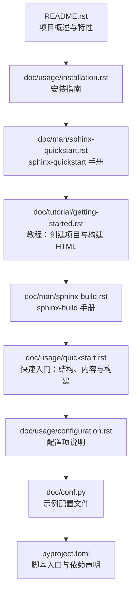
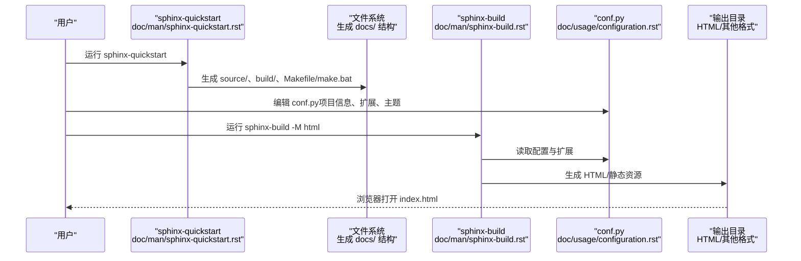
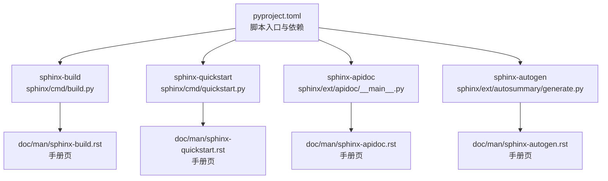

# 快速开始

<cite>
**本文档引用的文件**
- [README.rst](file://README.rst)
- [pyproject.toml](file://pyproject.toml)
- [doc/usage/quickstart.rst](file://doc/usage/quickstart.rst)
- [doc/tutorial/getting-started.rst](file://doc/tutorial/getting-started.rst)
- [doc/man/sphinx-quickstart.rst](file://doc/man/sphinx-quickstart.rst)
- [doc/man/sphinx-build.rst](file://doc/man/sphinx-build.rst)
- [doc/usage/installation.rst](file://doc/usage/installation.rst)
- [doc/usage/configuration.rst](file://doc/usage/configuration.rst)
- [doc/conf.py](file://doc/conf.py)
</cite>

## 目录
1. [简介](#简介)
2. [项目结构](#项目结构)
3. [核心组件](#核心组件)
4. [架构总览](#架构总览)
5. [详细组件分析](#详细组件分析)
6. [依赖分析](#依赖分析)
7. [性能考虑](#性能考虑)
8. [故障排除指南](#故障排除指南)
9. [结论](#结论)
10. [附录](#附录)

## 简介
本指南面向初学者与进阶用户，帮助你在最短时间内完成 Sphinx 的安装、初始化、构建与发布全流程。你将学会：
- 安装 Sphinx（支持多种操作系统与包管理器）
- 使用 sphinx-quickstart 初始化项目
- 编写第一个文档并生成 HTML 输出
- 掌握常用功能：多格式输出、智能交叉引用、代码高亮、主题与扩展
- 了解常见使用场景与最佳实践

Sphinx 是一个强大的文档生成器，基于 reStructuredText 标记语言，支持 HTML、PDF、EPUB、LaTeX、手册页等多种输出格式，并提供自动交叉引用、索引、代码高亮、模板化渲染与丰富的扩展生态。

**章节来源**
- [README.rst:1-64](file://README.rst#L1-L64)

## 项目结构
Sphinx 仓库包含两大部分：
- 源码与命令行工具：位于 sphinx/ 目录，提供构建器、域、指令、扩展、主题等核心能力
- 文档与教程：位于 doc/ 目录，包含官方文档、使用手册、教程与参考手册

下图展示了与“快速开始”相关的核心文件与关系：

**图表来源**
- [README.rst:1-64](file://README.rst#L1-L64)
- [doc/usage/installation.rst:1-269](file://doc/usage/installation.rst#L1-L269)
- [doc/man/sphinx-quickstart.rst:1-177](file://doc/man/sphinx-quickstart.rst#L1-L177)
- [doc/tutorial/getting-started.rst:1-121](file://doc/tutorial/getting-started.rst#L1-L121)
- [doc/man/sphinx-build.rst:1-200](file://doc/man/sphinx-build.rst#L1-L200)
- [doc/usage/quickstart.rst:1-338](file://doc/usage/quickstart.rst#L1-L338)
- [doc/usage/configuration.rst:1-200](file://doc/usage/configuration.rst#L1-L200)
- [doc/conf.py:1-200](file://doc/conf.py#L1-L200)
- [pyproject.toml:1-332](file://pyproject.toml#L1-L332)

**章节来源**
- [README.rst:1-64](file://README.rst#L1-L64)
- [pyproject.toml:1-332](file://pyproject.toml#L1-L332)

## 核心组件
- 命令行工具
  - sphinx-quickstart：交互式初始化项目，生成源目录、配置文件与构建脚本
  - sphinx-build：执行构建，支持多种输出格式与构建模式
- 配置系统
  - conf.py：Python 风格的配置文件，控制项目信息、扩展、主题、国际化等
- 构建器与主题
  - 内置 HTML、LaTeX、EPUB、Manpage 等构建器
  - 主题系统支持灵活定制外观与布局
- 扩展生态
  - autodoc、intersphinx、graphviz、coverage 等扩展增强功能

**章节来源**
- [doc/man/sphinx-quickstart.rst:1-177](file://doc/man/sphinx-quickstart.rst#L1-L177)
- [doc/man/sphinx-build.rst:1-200](file://doc/man/sphinx-build.rst#L1-L200)
- [doc/usage/configuration.rst:1-200](file://doc/usage/configuration.rst#L1-L200)
- [doc/conf.py:1-200](file://doc/conf.py#L1-L200)

## 架构总览
下图展示了从初始化到构建的端到端流程，映射到实际源码与文档中的命令与文件：

**图表来源**
- [doc/man/sphinx-quickstart.rst:1-177](file://doc/man/sphinx-quickstart.rst#L1-L177)
- [doc/tutorial/getting-started.rst:45-121](file://doc/tutorial/getting-started.rst#L45-L121)
- [doc/man/sphinx-build.rst:1-200](file://doc/man/sphinx-build.rst#L1-L200)
- [doc/usage/configuration.rst:1-200](file://doc/usage/configuration.rst#L1-L200)

## 详细组件分析

### 安装与环境准备
- 推荐使用虚拟环境进行本地开发，避免全局污染
- 支持多种安装方式：PyPI（pip）、Conda、各发行版包管理器、Docker、源码安装
- 安装后可通过 sphinx-build --version 验证

常见安装路径与注意事项：
- PyPI：pip install -U sphinx
- Conda：conda install sphinx 或 conda install -c conda-forge sphinx
- Linux：apt/yum 等包管理器安装 python3-sphinx
- macOS：Homebrew、MacPorts
- Windows：Chocolatey
- Docker：使用 sphinxdoc/sphinx 或 sphinxdoc/sphinx-latexpdf 镜像
- 开发版本：pip install -U --pre sphinx
- 源码安装：git clone 后 pip install .

**章节来源**
- [doc/usage/installation.rst:1-269](file://doc/usage/installation.rst#L1-L269)

### 初始化项目：sphinx-quickstart
- 交互式问答生成源目录、配置文件与构建脚本
- 可选择分离/合并源与构建目录、模板变量、启用扩展等
- 生成的目录结构包含 source/、build/、Makefile/make.bat、_templates、_static

关键选项概览（节选）：
- 结构选项：--sep/--no-sep、--dot
- 项目基础：-p/--project、-a/--author、-v/--version、-r/--release、-l/--language、--suffix、--master
- 扩展：--ext-autodoc、--ext-intersphinx、--ext-mathjax 等
- Makefile/Batchfile：--makefile/--no-makefile、--batchfile/--no-batchfile
- 模板：-t/--templatedir、-d/--define

**章节来源**
- [doc/man/sphinx-quickstart.rst:1-177](file://doc/man/sphinx-quickstart.rst#L1-L177)
- [doc/usage/quickstart.rst:30-110](file://doc/usage/quickstart.rst#L30-L110)

### 编写第一个文档并生成 HTML
- 在 source/index.rst 中定义文档树（toctree），组织页面层级
- 使用 reStructuredText 编写内容，添加交叉引用、代码块、表格等
- 使用 sphinx-build -M html 构建 HTML；或使用 make html（在生成的 Makefile/make.bat 中）

构建要点：
- -M 选项进入“make-mode”，可直接指定目标（如 html、latexpdf、help）
- 默认输出目录位置与构建器有关
- 可通过 -D/-A 覆盖配置值与 HTML 模板变量

**章节来源**
- [doc/usage/quickstart.rst:111-172](file://doc/usage/quickstart.rst#L111-L172)
- [doc/man/sphinx-build.rst:35-83](file://doc/man/sphinx-build.rst#L35-L83)
- [doc/tutorial/getting-started.rst:45-121](file://doc/tutorial/getting-started.rst#L45-L121)

### 配置系统：conf.py
- conf.py 是 Python 风格的配置文件，控制项目元信息、扩展、主题、国际化、链接检查等
- 示例配置展示了主题、静态资源、epub、LaTeX、扩展、国际化等设置
- 可通过 sphinx-build -D 覆盖单个配置项

常用配置类别（节选）：
- 项目信息：project、author、copyright、version、release
- 扩展：extensions 列表
- 主题与静态资源：html_theme、html_static_path、html_css_files
- 国际化与翻译：gettext_compact、国际化映射
- 其他：linkcheck_*、latex_*、man_pages、intersphinx_mapping 等

**章节来源**
- [doc/usage/configuration.rst:1-200](file://doc/usage/configuration.rst#L1-L200)
- [doc/conf.py:1-200](file://doc/conf.py#L1-L200)

### 命令行工具与脚本入口
- pyproject.toml 中声明了 sphinx-build、sphinx-quickstart 等命令入口
- 便于在不同环境中统一调用 Sphinx 工具链

**章节来源**
- [pyproject.toml:98-102](file://pyproject.toml#L98-L102)

## 依赖分析
Sphinx 的命令入口与依赖在 pyproject.toml 中集中声明，便于跨平台分发与安装。

**图表来源**
- [pyproject.toml:98-102](file://pyproject.toml#L98-L102)
- [doc/man/sphinx-build.rst:1-200](file://doc/man/sphinx-build.rst#L1-L200)
- [doc/man/sphinx-quickstart.rst:1-177](file://doc/man/sphinx-quickstart.rst#L1-L177)

**章节来源**
- [pyproject.toml:1-332](file://pyproject.toml#L1-L332)

## 性能考虑
- 并行构建：使用 -j N 或 -j auto 提升多核机器的构建效率（部分构建器支持）
- 增量构建：默认仅重建变更文件，减少重复工作
- 环境重用：复用 doctrees 缓存，避免重复解析
- 选择合适主题与扩展：过多扩展会增加构建时间与复杂度

**章节来源**
- [doc/man/sphinx-build.rst:129-146](file://doc/man/sphinx-build.rst#L129-L146)

## 故障排除指南
- 版本不匹配：使用 needs_sphinx 设置最低版本要求
- 链接失效：使用 linkcheck_* 配置忽略特定链接与锚点
- 交叉引用缺失：确认扩展已启用（如 intersphinx、autodoc），并正确配置映射
- 输出异常：尝试 -E/--fresh-env 强制重建环境缓存
- HTML 模板变量：使用 -A 注入模板变量，验证主题与静态资源路径

**章节来源**
- [doc/usage/configuration.rst:181-200](file://doc/usage/configuration.rst#L181-L200)
- [doc/conf.py:108-122](file://doc/conf.py#L108-L122)

## 结论
通过本快速开始指南，你已经完成了 Sphinx 的安装、项目初始化、文档编写与 HTML 构建。建议进一步探索：
- 多格式输出（LaTeX/PDF、EPUB、Manpage）
- 智能交叉引用与域（Python/C/C++/JavaScript/数学等）
- 主题与模板定制
- 扩展生态（autodoc、intersphinx、graphviz、coverage 等）
- CI/CD 集成与自动化部署

## 附录

### 常见使用场景与最佳实践
- 文档树设计：合理使用 toctree 组织层级，控制 maxdepth
- 交叉引用：使用 ref/：doc/：py:func: 等角色实现跨文件链接
- 代码高亮：利用 code-block 指令与语法高亮，配合 linenothreshold 控制行号显示
- 主题与静态资源：将自定义 CSS/JS 放入 _static，主题放入 _themes
- 扩展启用：按需启用 autodoc、intersphinx、graphviz 等扩展
- 多语言与国际化：配置 language 与 gettext_*，生成 pot/po 文件

**章节来源**
- [doc/usage/quickstart.rst:180-338](file://doc/usage/quickstart.rst#L180-L338)
- [doc/usage/configuration.rst:1-200](file://doc/usage/configuration.rst#L1-L200)