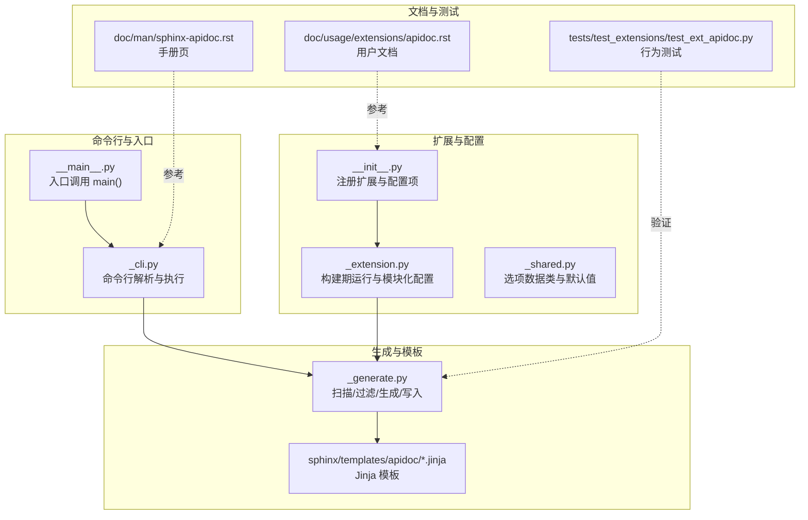
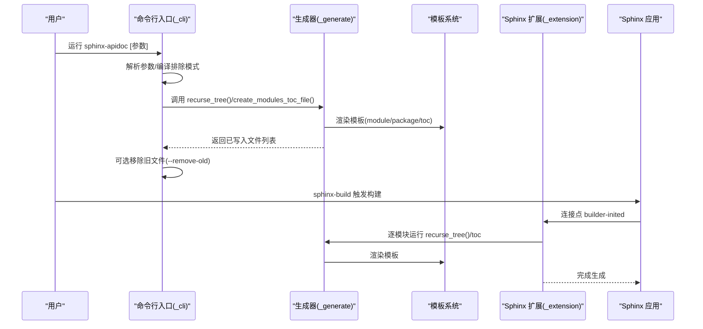
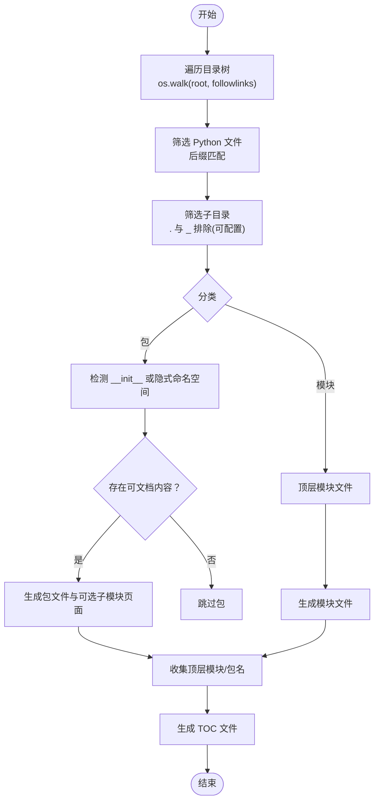
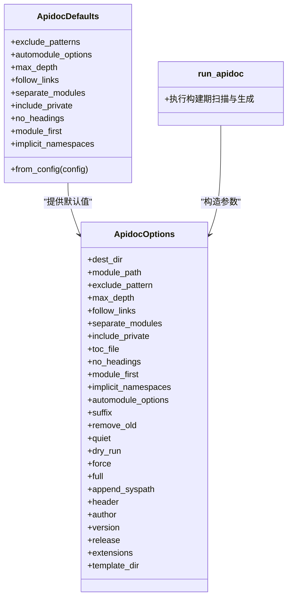
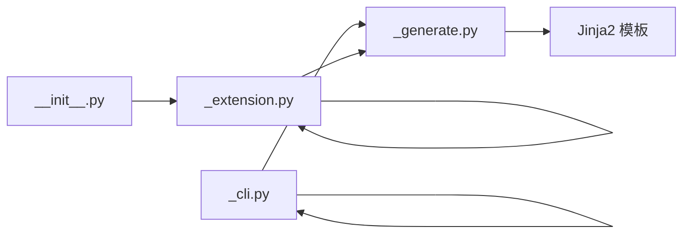

# API 文档扩展 (apidoc)

<cite>
**本文引用的文件**
- [sphinx/ext/apidoc/__init__.py](file://sphinx/ext/apidoc/__init__.py)
- [sphinx/ext/apidoc/_cli.py](file://sphinx/ext/apidoc/_cli.py)
- [sphinx/ext/apidoc/_generate.py](file://sphinx/ext/apidoc/_generate.py)
- [sphinx/ext/apidoc/_shared.py](file://sphinx/ext/apidoc/_shared.py)
- [sphinx/ext/apidoc/_extension.py](file://sphinx/ext/apidoc/_extension.py)
- [sphinx/ext/apidoc/__main__.py](file://sphinx/ext/apidoc/__main__.py)
- [doc/man/sphinx-apidoc.rst](file://doc/man/sphinx-apidoc.rst)
- [doc/usage/extensions/apidoc.rst](file://doc/usage/extensions/apidoc.rst)
- [tests/test_extensions/test_ext_apidoc.py](file://tests/test_extensions/test_ext_apidoc.py)
</cite>

## 目录
1. [简介](#简介)
2. [项目结构](#项目结构)
3. [核心组件](#核心组件)
4. [架构总览](#架构总览)
5. [详细组件分析](#详细组件分析)
6. [依赖分析](#依赖分析)
7. [性能考虑](#性能考虑)
8. [故障排查指南](#故障排查指南)
9. [结论](#结论)
10. [附录](#附录)

## 简介
本文件系统性阐述 Sphinx API 文档扩展（apidoc）的工作原理与使用方法，覆盖以下主题：
- 如何扫描 Python 包结构并生成模块文档
- 命令行工具 sphinx-apidoc 的参数与行为
- 模块、包与子包的文档生成规则
- 模板系统的自定义与修改
- TOC（目录树）生成逻辑与嵌套结构
- 复杂项目结构的处理策略与性能优化建议
- 配置项与构建期集成的最佳实践

## 项目结构
apidoc 扩展由“命令行入口”“配置解析”“扫描与生成”“模板渲染”“Sphinx 扩展集成”等模块组成，遵循“分层职责、清晰边界”的设计。

图示来源
- [sphinx/ext/apidoc/_cli.py:24-252](file://sphinx/ext/apidoc/_cli.py#L24-L252)
- [sphinx/ext/apidoc/_generate.py:36-105](file://sphinx/ext/apidoc/_generate.py#L36-L105)
- [sphinx/ext/apidoc/_extension.py:43-91](file://sphinx/ext/apidoc/_extension.py#L43-L91)
- [sphinx/ext/apidoc/__init__.py:28-66](file://sphinx/ext/apidoc/__init__.py#L28-L66)
- [doc/man/sphinx-apidoc.rst:1-179](file://doc/man/sphinx-apidoc.rst#L1-L179)
- [doc/usage/extensions/apidoc.rst:1-173](file://doc/usage/extensions/apidoc.rst#L1-L173)
- [tests/test_extensions/test_ext_apidoc.py:1-800](file://tests/test_extensions/test_ext_apidoc.py#L1-L800)

章节来源
- [sphinx/ext/apidoc/_cli.py:24-252](file://sphinx/ext/apidoc/_cli.py#L24-L252)
- [sphinx/ext/apidoc/_generate.py:236-346](file://sphinx/ext/apidoc/_generate.py#L236-L346)
- [sphinx/ext/apidoc/_extension.py:43-91](file://sphinx/ext/apidoc/_extension.py#L43-L91)
- [sphinx/ext/apidoc/__init__.py:28-66](file://sphinx/ext/apidoc/__init__.py#L28-L66)
- [doc/man/sphinx-apidoc.rst:1-179](file://doc/man/sphinx-apidoc.rst#L1-L179)
- [doc/usage/extensions/apidoc.rst:1-173](file://doc/usage/extensions/apidoc.rst#L1-L173)
- [tests/test_extensions/test_ext_apidoc.py:1-800](file://tests/test_extensions/test_ext_apidoc.py#L1-L800)

## 核心组件
- 命令行接口：解析参数、编译排除模式、调用扫描与生成流程、可选地生成完整项目骨架
- 扫描与生成：遍历目录树、识别包与模块、过滤私有/隐藏项、生成 .rst 文件与 TOC
- 模板系统：基于 Jinja2 的模块/包/TOC 模板，支持用户自定义模板目录
- Sphinx 扩展集成：在构建阶段自动运行，支持多模块配置与默认值继承
- 配置与默认值：集中管理 apidoc_* 配置项，支持从配置文件读取默认值

章节来源
- [sphinx/ext/apidoc/_cli.py:255-306](file://sphinx/ext/apidoc/_cli.py#L255-L306)
- [sphinx/ext/apidoc/_generate.py:274-346](file://sphinx/ext/apidoc/_generate.py#L274-L346)
- [sphinx/ext/apidoc/_shared.py:36-100](file://sphinx/ext/apidoc/_shared.py#L36-L100)
- [sphinx/ext/apidoc/_extension.py:43-91](file://sphinx/ext/apidoc/_extension.py#L43-L91)
- [sphinx/ext/apidoc/__init__.py:28-66](file://sphinx/ext/apidoc/__init__.py#L28-L66)

## 架构总览
下图展示 apidoc 在命令行与构建期两种运行路径的交互关系。

图示来源
- [sphinx/ext/apidoc/_cli.py:255-279](file://sphinx/ext/apidoc/_cli.py#L255-L279)
- [sphinx/ext/apidoc/_generate.py:274-346](file://sphinx/ext/apidoc/_generate.py#L274-L346)
- [sphinx/ext/apidoc/_extension.py:43-91](file://sphinx/ext/apidoc/_extension.py#L43-L91)

## 详细组件分析

### 命令行工具与参数
- 主要参数
  - 输出目录 -o/--output-dir：必须，不存在则创建
  - 排除模式 EXCLUDE_PATTERN：支持文件/目录的 fnmatch 风格
  - 最大深度 -d/--maxdepth：控制 TOC 的最大层级
  - 强制覆盖 -f/--force：允许覆盖现有文件
  - 符号链接 -l/--follow-links：跟随符号链接
  - 干跑 -n/--dry-run：仅打印计划操作
  - 单独页面 -e/--separate：每个模块单独一页
  - 私有模块 -P/--private：包含以 _ 开头的模块
  - TOC 文件名 --tocfile/-T/--no-toc：控制是否生成 TOC 及文件名
  - 无标题 -E/--no-headings：不在模块/包文件顶部生成标题
  - 模块优先 -M/--module-first：模块文档排在子模块之前
  - 隐式命名空间 --implicit-namespaces：启用 PEP 420
  - 自动模块选项 --automodule-options：传递给 automodule 指令
  - 后缀 -s/--suffix：输出文件后缀，默认 rst
  - 移除旧文件 --remove-old：删除输出目录中不再生成的文件
  - 全量项目 -F/--full：使用 sphinx-quickstart 生成完整项目骨架
  - 模板目录 -t/--templatedir：自定义模板目录
- 环境变量
  - SPHINX_APIDOC_OPTIONS：逗号分隔的 automodule 选项集合

章节来源
- [sphinx/ext/apidoc/_cli.py:24-252](file://sphinx/ext/apidoc/_cli.py#L24-L252)
- [doc/man/sphinx-apidoc.rst:33-172](file://doc/man/sphinx-apidoc.rst#L33-L172)
- [sphinx/ext/apidoc/_generate.py:23-32](file://sphinx/ext/apidoc/_generate.py#L23-L32)

### 包/模块扫描与生成规则
- 目录遍历与过滤
  - 使用 os.walk 遍历，支持 followlinks
  - 仅保留 Python 源文件（含扩展模块后缀）
  - 忽略隐藏目录（.）与私有目录（_），除非启用 include_private
  - 支持隐式命名空间（PEP 420）：非包目录但存在可文档内容时仍生成
- 包与模块识别
  - 包：包含 __init__.* 的目录；或启用隐式命名空间时的“空包”
  - 模块：顶层 Python 文件（不含 __init__）
- 生成策略
  - 包：生成包文件（含子包/子模块 toctree、模块内容 automodule）
  - 模块：生成模块文件（automodule 指令）
  - TOC：生成 modules.* 文件，按 max_depth 控制层级
- 排除机制
  - 文件/目录匹配 fnmatch 模式
  - 对包：若仅剩 __init__ 或被排除，则可能跳过
  - 对模块：以 _ 开头且未启用 include_private 则跳过

图示来源
- [sphinx/ext/apidoc/_generate.py:236-346](file://sphinx/ext/apidoc/_generate.py#L236-L346)
- [sphinx/ext/apidoc/_generate.py:207-234](file://sphinx/ext/apidoc/_generate.py#L207-L234)

章节来源
- [sphinx/ext/apidoc/_generate.py:236-346](file://sphinx/ext/apidoc/_generate.py#L236-L346)
- [sphinx/ext/apidoc/_generate.py:207-234](file://sphinx/ext/apidoc/_generate.py#L207-L234)

### TOC 树（目录树）生成逻辑
- 顶层去重：对模块名进行排序与前缀去重，避免重复引用
- 上下文：包含项目标题、最大深度、文档名列表
- 渲染：使用 toc.rst.jinja 模板生成 TOC 文件
- 嵌套结构：通过 maxdepth 控制 toctree 展开层级；包文件内部的 toctree 再次组织子模块/子包

章节来源
- [sphinx/ext/apidoc/_generate.py:177-204](file://sphinx/ext/apidoc/_generate.py#L177-L204)
- [tests/test_extensions/test_ext_apidoc.py:480-498](file://tests/test_extensions/test_ext_apidoc.py#L480-L498)

### 模板系统与自定义
- 默认模板目录：sphinx/templates/apidoc
- 支持的模板文件（来自手册页）：module.rst.jinja、package.rst.jinja、toc.rst.jinja、root_doc.rst.jinja、conf.py.jinja、Makefile.jinja、Makefile.new.jinja、make.bat.jinja、make.bat.new.jinja
- 自定义方式：通过 -t/--templatedir 指定用户模板目录；用户模板优先于默认模板
- 测试验证：用户模板可覆盖默认模板，测试用例展示了模板选择与渲染结果

章节来源
- [doc/man/sphinx-apidoc.rst:146-163](file://doc/man/sphinx-apidoc.rst#L146-L163)
- [sphinx/ext/apidoc/_generate.py:36-105](file://sphinx/ext/apidoc/_generate.py#L36-L105)
- [tests/test_extensions/test_ext_apidoc.py:64-97](file://tests/test_extensions/test_ext_apidoc.py#L64-L97)

### Sphinx 扩展集成与配置
- 扩展注册：在 setup 中添加 apidoc_* 配置项，连接 builder-inited 事件
- 构建期运行：run_apidoc 读取 apidoc_modules 列表，逐个模块执行扫描与生成
- 配置项：apidoc_modules、apidoc_exclude_patterns、apidoc_max_depth、apidoc_follow_links、apidoc_separate_modules、apidoc_include_private、apidoc_no_headings、apidoc_module_first、apidoc_implicit_namespaces、apidoc_automodule_options
- 默认值来源：Config → ApidocDefaults.from_config()

图示来源
- [sphinx/ext/apidoc/_shared.py:36-100](file://sphinx/ext/apidoc/_shared.py#L36-L100)
- [sphinx/ext/apidoc/_extension.py:43-91](file://sphinx/ext/apidoc/_extension.py#L43-L91)
- [sphinx/ext/apidoc/__init__.py:28-66](file://sphinx/ext/apidoc/__init__.py#L28-L66)

章节来源
- [sphinx/ext/apidoc/__init__.py:28-66](file://sphinx/ext/apidoc/__init__.py#L28-L66)
- [sphinx/ext/apidoc/_extension.py:43-91](file://sphinx/ext/apidoc/_extension.py#L43-L91)
- [doc/usage/extensions/apidoc.rst:38-173](file://doc/usage/extensions/apidoc.rst#L38-L173)

### 命令行入口与执行流程
- 入口脚本：__main__.py 调用 _cli.main(argv)
- 参数解析：get_parser 定义所有命令行选项
- 执行主流程：_parse_args 正规化参数 → recurse_tree 扫描 → create_modules_toc_file 生成 TOC → 可选移除旧文件

章节来源
- [sphinx/ext/apidoc/__main__.py:1-10](file://sphinx/ext/apidoc/__main__.py#L1-L10)
- [sphinx/ext/apidoc/_cli.py:255-306](file://sphinx/ext/apidoc/_cli.py#L255-L306)
- [sphinx/ext/apidoc/_cli.py:267-279](file://sphinx/ext/apidoc/_cli.py#L267-L279)

## 依赖分析
- 组件耦合
  - _cli 依赖 _generate 的扫描与生成函数
  - _extension 依赖 _generate 的递归扫描与 TOC 生成
  - _generate 依赖模板系统与日志工具
  - 扩展通过 setup 注册配置项并在构建期触发
- 外部依赖
  - argparse、pathlib、fnmatch、re、locale、sphinx.locale、sphinx.util.osutil、sphinx.util.template
- 循环依赖
  - 未发现直接循环导入；各模块职责清晰

图示来源
- [sphinx/ext/apidoc/_cli.py:14-17](file://sphinx/ext/apidoc/_cli.py#L14-L17)
- [sphinx/ext/apidoc/_generate.py:10-14](file://sphinx/ext/apidoc/_generate.py#L10-L14)
- [sphinx/ext/apidoc/_extension.py:10-17](file://sphinx/ext/apidoc/_extension.py#L10-L17)
- [sphinx/ext/apidoc/__init__.py:16-32](file://sphinx/ext/apidoc/__init__.py#L16-L32)

章节来源
- [sphinx/ext/apidoc/_cli.py:1-357](file://sphinx/ext/apidoc/_cli.py#L1-L357)
- [sphinx/ext/apidoc/_generate.py:1-357](file://sphinx/ext/apidoc/_generate.py#L1-L357)
- [sphinx/ext/apidoc/_extension.py:1-264](file://sphinx/ext/apidoc/_extension.py#L1-L264)
- [sphinx/ext/apidoc/__init__.py:1-67](file://sphinx/ext/apidoc/__init__.py#L1-L67)

## 性能考虑
- 符号链接遍历：开启 -l/--follow-links 可能扩大扫描范围，建议在大型仓库中谨慎使用
- 排除模式：合理设置 EXCLUDE_PATTERN，减少不必要的文件扫描与 IO
- 干跑与增量：使用 -n/--dry-run 预览生成结果；结合 --remove-old 与文件时间戳，避免不必要的重建
- 模板渲染：自定义模板应保持简洁，避免复杂计算导致渲染耗时增加
- 并行安全：扩展声明并行读写安全，可在多进程构建环境中稳定运行

## 故障排查指南
- “模块有副作用”警告：apidoc 生成的 .rst 使用 autodoc，在构建时会导入模块。请确保脚本入口受保护（如 if __name__ == '__main__'）
- 无法创建输出目录：确认 -o 目录权限与路径正确
- 未生成 TOC：检查 --no-toc 是否误用；确认模块列表非空
- 私有模块未生成：未启用 -P/--private 时，以 _ 开头的模块会被跳过
- 隐式命名空间问题：未启用 --implicit-namespaces 时，非包目录不会生成文档
- 旧文件未清理：--remove-old 与 -F/--full 不兼容；两者同时使用时需注意

章节来源
- [doc/man/sphinx-apidoc.rst:24-32](file://doc/man/sphinx-apidoc.rst#L24-L32)
- [sphinx/ext/apidoc/_cli.py:78-83](file://sphinx/ext/apidoc/_cli.py#L78-L83)
- [sphinx/ext/apidoc/_cli.py:108-114](file://sphinx/ext/apidoc/_cli.py#L108-L114)
- [sphinx/ext/apidoc/_cli.py:104-113](file://sphinx/ext/apidoc/_cli.py#L104-L113)
- [sphinx/ext/apidoc/_cli.py:172-187](file://sphinx/ext/apidoc/_cli.py#L172-L187)

## 结论
apidoc 提供了从 Python 包结构到 Sphinx 文档的自动化桥梁。通过命令行与构建期扩展两种方式，既能快速生成文档，也能融入持续集成流程。配合合理的排除策略、模板定制与配置项，可满足从简单项目到复杂多模块工程的文档需求。

## 附录

### 命令行速查
- 基本用法：sphinx-apidoc -o OUTPUT_PATH MODULE_PATH [EXCLUDE_PATTERN ...]
- 关键参数：-d、-f、-l、-n、-e、-P、--tocfile/-T、-E、-M、--implicit-namespaces、--automodule-options、-s、--remove-old、-F、-t

章节来源
- [doc/man/sphinx-apidoc.rst:7-81](file://doc/man/sphinx-apidoc.rst#L7-L81)

### 配置项一览
- apidoc_modules：模块描述列表（path、destination、exclude_patterns、max_depth、follow_links、separate_modules、include_private、no_headings、module_first、implicit_namespaces、automodule_options）
- apidoc_exclude_patterns、apidoc_max_depth、apidoc_follow_links、apidoc_separate_modules、apidoc_include_private、apidoc_no_headings、apidoc_module_first、apidoc_implicit_namespaces、apidoc_automodule_options

章节来源
- [doc/usage/extensions/apidoc.rst:41-173](file://doc/usage/extensions/apidoc.rst#L41-L173)