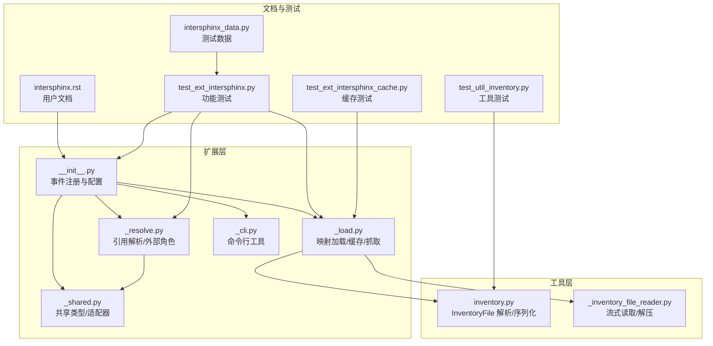
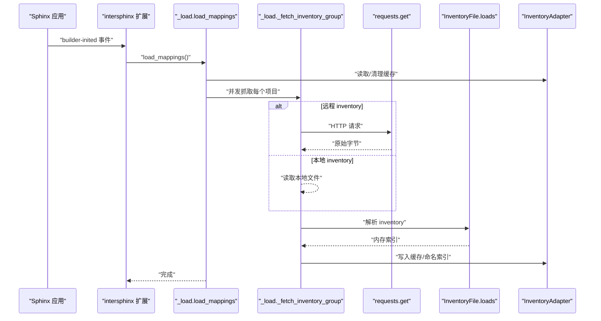
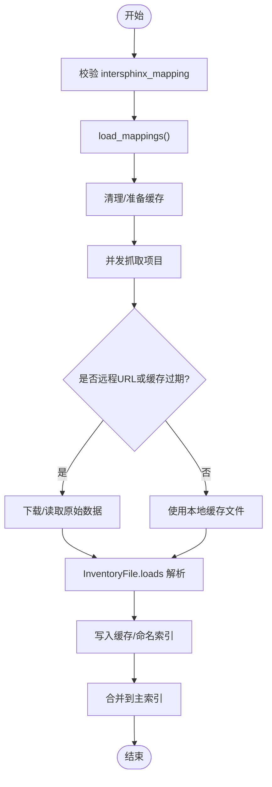
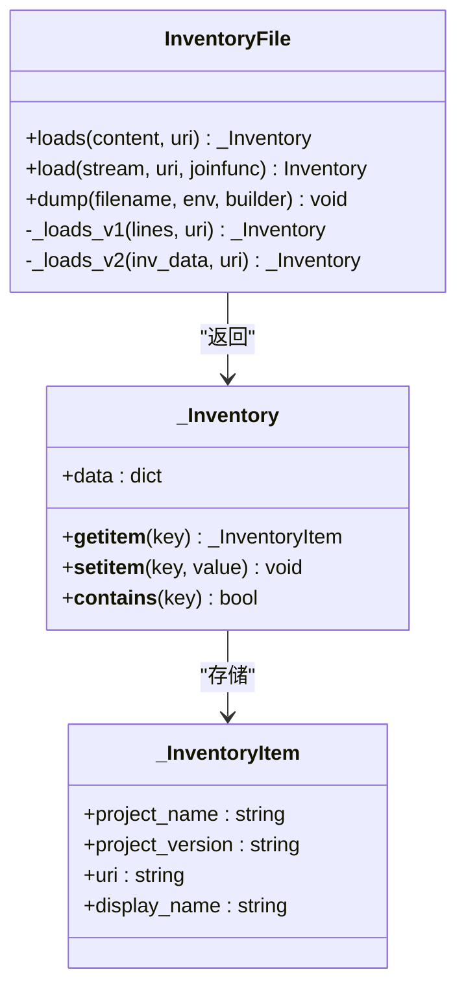
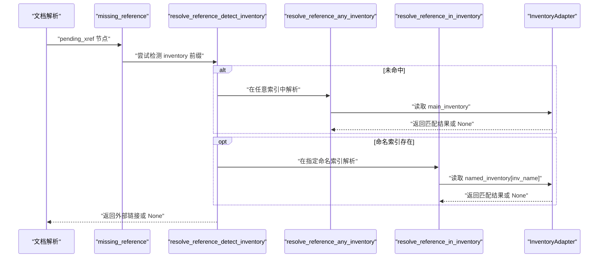
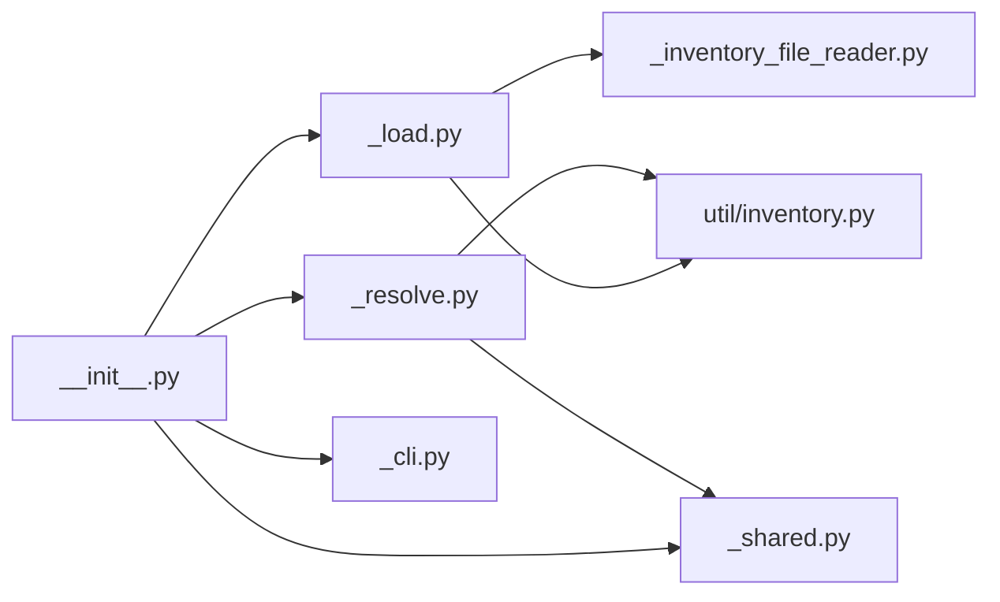

# 交叉引用扩展（intersphinx）

<cite>
**本文档引用的文件**
- [sphinx/ext/intersphinx/__init__.py](file://sphinx/ext/intersphinx/__init__.py)
- [sphinx/ext/intersphinx/_load.py](file://sphinx/ext/intersphinx/_load.py)
- [sphinx/ext/intersphinx/_resolve.py](file://sphinx/ext/intersphinx/_resolve.py)
- [sphinx/ext/intersphinx/_shared.py](file://sphinx/ext/intersphinx/_shared.py)
- [sphinx/ext/intersphinx/_cli.py](file://sphinx/ext/intersphinx/_cli.py)
- [sphinx/util/inventory.py](file://sphinx/util/inventory.py)
- [sphinx/util/_inventory_file_reader.py](file://sphinx/util/_inventory_file_reader.py)
- [doc/usage/extensions/intersphinx.rst](file://doc/usage/extensions/intersphinx.rst)
- [tests/test_ext_intersphinx/test_ext_intersphinx.py](file://tests/test_ext_intersphinx/test_ext_intersphinx.py)
- [tests/test_ext_intersphinx/test_ext_intersphinx_cache.py](file://tests/test_ext_intersphinx/test_ext_intersphinx_cache.py)
- [tests/test_util/intersphinx_data.py](file://tests/test_util/intersphinx_data.py)
- [tests/test_util/test_util_inventory.py](file://tests/test_util/test_util_inventory.py)
</cite>

## 目录
1. [简介](#简介)
2. [项目结构](#项目结构)
3. [核心组件](#核心组件)
4. [架构总览](#架构总览)
5. [详细组件分析](#详细组件分析)
6. [依赖关系分析](#依赖关系分析)
7. [性能考量](#性能考量)
8. [故障排除指南](#故障排除指南)
9. [结论](#结论)
10. [附录](#附录)

## 简介
本文件系统性阐述 Sphinx 交叉引用扩展（intersphinx）如何实现跨项目文档引用与链接。内容涵盖：
- 远程对象索引（objects.inv）的格式与生成流程
- 远程索引的加载与本地缓存机制
- 各类引用角色的使用方法（如 :py:class:、:cpp:class: 等）
- 配置选项与自定义映射规则
- 大型项目间交叉引用的最佳实践
- 缓存管理、网络请求优化与故障排除

## 项目结构
intersphinx 扩展由以下模块组成：
- 扩展入口与事件注册：负责配置项添加、事件连接与扩展元数据导出
- 加载与缓存：负责校验映射、并发抓取、解析与缓存更新
- 解析与重写：负责缺失引用解析、外部角色解析与节点替换
- 共享类型与适配器：统一缓存与命名索引的数据结构
- CLI 工具：用于检查与打印远端或本地 inventory 内容
- 库函数：负责 inventory 文件格式解析与序列化

图表来源
- [sphinx/ext/intersphinx/__init__.py:66-88](file://sphinx/ext/intersphinx/__init__.py#L66-L88)
- [sphinx/ext/intersphinx/_load.py:38-83](file://sphinx/ext/intersphinx/_load.py#L38-L83)
- [sphinx/ext/intersphinx/_resolve.py:343-348](file://sphinx/ext/intersphinx/_resolve.py#L343-L348)
- [sphinx/ext/intersphinx/_shared.py:114-149](file://sphinx/ext/intersphinx/_shared.py#L114-L149)
- [sphinx/ext/intersphinx/_cli.py:15-58](file://sphinx/ext/intersphinx/_cli.py#L15-L58)
- [sphinx/util/inventory.py:43-208](file://sphinx/util/inventory.py#L43-L208)
- [sphinx/util/_inventory_file_reader.py:23-77](file://sphinx/util/_inventory_file_reader.py#L23-L77)
- [doc/usage/extensions/intersphinx.rst:52-268](file://doc/usage/extensions/intersphinx.rst#L52-L268)
- [tests/test_ext_intersphinx/test_ext_intersphinx.py:1-946](file://tests/test_ext_intersphinx/test_ext_intersphinx.py#L1-L946)
- [tests/test_ext_intersphinx/test_ext_intersphinx_cache.py:1-320](file://tests/test_ext_intersphinx/test_ext_intersphinx_cache.py#L1-L320)
- [tests/test_util/intersphinx_data.py:1-73](file://tests/test_util/intersphinx_data.py#L1-L73)
- [tests/test_util/test_util_inventory.py:1-76](file://tests/test_util/test_util_inventory.py#L1-L76)

章节来源
- [sphinx/ext/intersphinx/__init__.py:66-88](file://sphinx/ext/intersphinx/__init__.py#L66-L88)
- [doc/usage/extensions/intersphinx.rst:52-268](file://doc/usage/extensions/intersphinx.rst#L52-L268)

## 核心组件
- 扩展入口与事件注册
  - 添加配置项：intersphinx_mapping、intersphinx_resolve_self、intersphinx_cache_limit、intersphinx_timeout、intersphinx_disabled_reftypes
  - 注册事件：config-inited（校验映射）、builder-inited（加载映射）、source-read（安装调度器）、missing-reference（解析缺失引用）
  - 安装后转换器：IntersphinxRoleResolver
- 加载与缓存
  - 校验并规范化 intersphinx_mapping
  - 并发抓取多个项目的 inventory，支持本地文件与远程 URL
  - 基于时间戳的缓存策略，支持过期控制与本地缓存文件复用
  - 解析 inventory（版本 1/2），支持 zlib 压缩与锚点处理
- 解析与重写
  - 对未解析的引用尝试在外部 inventory 中查找
  - 支持 external/external+ 角色，允许限定域与项目名
  - 按域与对象类型匹配，支持大小写不敏感匹配（如 std:term/std:label）
- 共享类型与适配器
  - _IntersphinxProject：封装项目名、目标 URI 与多个 inventory 位置
  - InventoryAdapter：统一访问缓存、主索引与命名索引
- CLI 工具
  - inspect_main：打印 inventory 的条目清单，便于排查问题

章节来源
- [sphinx/ext/intersphinx/__init__.py:66-88](file://sphinx/ext/intersphinx/__init__.py#L66-L88)
- [sphinx/ext/intersphinx/_load.py:38-83](file://sphinx/ext/intersphinx/_load.py#L38-L83)
- [sphinx/ext/intersphinx/_resolve.py:343-348](file://sphinx/ext/intersphinx/_resolve.py#L343-L348)
- [sphinx/ext/intersphinx/_shared.py:114-149](file://sphinx/ext/intersphinx/_shared.py#L114-L149)
- [sphinx/ext/intersphinx/_cli.py:15-58](file://sphinx/ext/intersphinx/_cli.py#L15-L58)

## 架构总览
intersphinx 的工作流分为“构建期”和“运行期”两个阶段：
- 构建期
  - 校验与规范化 intersphinx_mapping
  - 并发抓取远程 inventory 或读取本地 inventory
  - 解析 inventory，写入缓存与命名/主索引
- 运行期
  - 文档解析时，对缺失引用触发 missing-reference 事件
  - 尝试在外部 inventory 中解析，必要时按域与对象类型匹配
  - 将 pending_xref 节点替换为外部链接

图表来源
- [sphinx/ext/intersphinx/__init__.py:79-83](file://sphinx/ext/intersphinx/__init__.py#L79-L83)
- [sphinx/ext/intersphinx/_load.py:139-209](file://sphinx/ext/intersphinx/_load.py#L139-L209)
- [sphinx/ext/intersphinx/_load.py:241-335](file://sphinx/ext/intersphinx/_load.py#L241-L335)
- [sphinx/util/inventory.py:43-68](file://sphinx/util/inventory.py#L43-L68)

## 详细组件分析

### 组件一：映射加载与缓存（_load）
职责
- 校验 intersphinx_mapping 的格式与唯一性
- 并发抓取多个项目的 inventory，支持镜像回退
- 解析 inventory（版本 1/2），写入缓存与命名/主索引
- 控制缓存有效期与本地缓存文件复用

关键流程
- 映射校验：确保键非空、值为二元组、URI 唯一且非空、inventory 位置合法
- 并发抓取：ThreadPoolExecutor 并行处理各项目；优先使用本地缓存文件（当满足时间条件）
- 解析与写入：调用 InventoryFile.loads，将结果写入缓存与命名索引；合并到主索引

图表来源
- [sphinx/ext/intersphinx/_load.py:38-137](file://sphinx/ext/intersphinx/_load.py#L38-L137)
- [sphinx/ext/intersphinx/_load.py:139-209](file://sphinx/ext/intersphinx/_load.py#L139-L209)
- [sphinx/ext/intersphinx/_load.py:241-335](file://sphinx/ext/intersphinx/_load.py#L241-L335)
- [sphinx/util/inventory.py:43-68](file://sphinx/util/inventory.py#L43-L68)

章节来源
- [sphinx/ext/intersphinx/_load.py:38-137](file://sphinx/ext/intersphinx/_load.py#L38-L137)
- [sphinx/ext/intersphinx/_load.py:139-209](file://sphinx/ext/intersphinx/_load.py#L139-L209)
- [sphinx/ext/intersphinx/_load.py:241-335](file://sphinx/ext/intersphinx/_load.py#L241-L335)

### 组件二：inventory 文件格式与解析（util/inventory）
职责
- 定义 InventoryFile 类，支持版本 1 与版本 2 的 inventory 文件
- 版本 2 使用 zlib 压缩，解析头信息后逐行解压解析
- 提供 dump 方法生成标准格式的 inventory 文件

格式要点
- 版本 1：每行包含 name、type、location，自动补全锚点
- 版本 2：头三行分别为项目名、版本、压缩标记；主体为 zlib 压缩文本，逐行解析为 (name, domain:objtype, priority, location, display_name)

图表来源
- [sphinx/util/inventory.py:43-208](file://sphinx/util/inventory.py#L43-L208)
- [sphinx/util/inventory.py:210-333](file://sphinx/util/inventory.py#L210-L333)

章节来源
- [sphinx/util/inventory.py:43-208](file://sphinx/util/inventory.py#L43-L208)
- [sphinx/util/inventory.py:210-333](file://sphinx/util/inventory.py#L210-L333)

### 组件三：引用解析与外部角色（_resolve）
职责
- 对 pending_xref 节点进行解析：先在任意索引中尝试，再按域与对象类型匹配
- 支持 external/external+ 角色，允许限定 inventory 与域
- 处理大小写不敏感匹配（std:term/std:label）
- 生成外部链接节点，设置 reftitle 与显示名

流程
- detect_inventory：若直接解析失败，尝试拆分 inv_name:new_target 并在指定命名索引中解析
- resolve_reference_any_inventory / resolve_reference_in_inventory：在主索引或命名索引中按域与对象类型查找
- _create_element_from_result：构造 nodes.reference，处理相对路径与显示名

图表来源
- [sphinx/ext/intersphinx/_resolve.py:305-341](file://sphinx/ext/intersphinx/_resolve.py#L305-L341)
- [sphinx/ext/intersphinx/_resolve.py:284-303](file://sphinx/ext/intersphinx/_resolve.py#L284-L303)
- [sphinx/ext/intersphinx/_resolve.py:260-282](file://sphinx/ext/intersphinx/_resolve.py#L260-L282)
- [sphinx/ext/intersphinx/_shared.py:114-149](file://sphinx/ext/intersphinx/_shared.py#L114-L149)

章节来源
- [sphinx/ext/intersphinx/_resolve.py:305-341](file://sphinx/ext/intersphinx/_resolve.py#L305-L341)
- [sphinx/ext/intersphinx/_resolve.py:284-303](file://sphinx/ext/intersphinx/_resolve.py#L284-L303)
- [sphinx/ext/intersphinx/_resolve.py:260-282](file://sphinx/ext/intersphinx/_resolve.py#L260-L282)

### 组件四：共享类型与适配器（_shared）
职责
- 定义不可变的 _IntersphinxProject，封装项目名、目标 URI 与多个 inventory 位置
- 提供 InventoryAdapter，统一访问缓存、主索引与命名索引，并支持清空

章节来源
- [sphinx/ext/intersphinx/_shared.py:44-112](file://sphinx/ext/intersphinx/_shared.py#L44-L112)
- [sphinx/ext/intersphinx/_shared.py:114-149](file://sphinx/ext/intersphinx/_shared.py#L114-L149)

### 组件五：CLI 工具（_cli）
职责
- inspect_main：打印 inventory 条目清单，支持本地文件与 URL
- 便于排查跨项目链接问题

章节来源
- [sphinx/ext/intersphinx/_cli.py:15-58](file://sphinx/ext/intersphinx/_cli.py#L15-L58)

## 依赖关系分析
- 扩展入口依赖加载、解析、共享模块与 CLI
- 加载模块依赖 util/inventory 与网络请求库
- 解析模块依赖共享适配器与 docutils/nodes
- util/inventory 依赖 zlib 与 posixpath

图表来源
- [sphinx/ext/intersphinx/__init__.py:43-59](file://sphinx/ext/intersphinx/__init__.py#L43-L59)
- [sphinx/ext/intersphinx/_load.py:14-19](file://sphinx/ext/intersphinx/_load.py#L14-L19)
- [sphinx/util/inventory.py:1-333](file://sphinx/util/inventory.py#L1-L333)
- [sphinx/util/_inventory_file_reader.py:1-77](file://sphinx/util/_inventory_file_reader.py#L1-L77)
- [sphinx/ext/intersphinx/_resolve.py:1-34](file://sphinx/ext/intersphinx/_resolve.py#L1-L34)

章节来源
- [sphinx/ext/intersphinx/__init__.py:43-59](file://sphinx/ext/intersphinx/__init__.py#L43-L59)
- [sphinx/ext/intersphinx/_load.py:14-19](file://sphinx/ext/intersphinx/_load.py#L14-L19)
- [sphinx/util/inventory.py:1-333](file://sphinx/util/inventory.py#L1-L333)
- [sphinx/util/_inventory_file_reader.py:1-77](file://sphinx/util/_inventory_file_reader.py#L1-L77)
- [sphinx/ext/intersphinx/_resolve.py:1-34](file://sphinx/ext/intersphinx/_resolve.py#L1-L34)

## 性能考量
- 并发抓取：通过 ThreadPoolExecutor 并行处理多个项目的 inventory 抓取，减少构建时间
- 缓存策略：基于天数限制的缓存过期控制；本地缓存文件可直接复用以避免网络请求
- 流式解压：InventoryFileReader 支持混合文本与压缩文本的流式读取，降低内存占用
- 选择性禁用：通过 intersphinx_disabled_reftypes 控制某些域或类型的解析，减少不必要的查找

章节来源
- [sphinx/ext/intersphinx/_load.py:176-191](file://sphinx/ext/intersphinx/_load.py#L176-L191)
- [sphinx/ext/intersphinx/_load.py:250-258](file://sphinx/ext/intersphinx/_load.py#L250-L258)
- [sphinx/util/_inventory_file_reader.py:23-77](file://sphinx/util/_inventory_file_reader.py#L23-L77)
- [doc/usage/extensions/intersphinx.rst:182-214](file://doc/usage/extensions/intersphinx.rst#L182-L214)

## 故障排除指南
常见问题与定位方法
- 无法解析外部引用
  - 检查 intersphinx_mapping 是否正确配置，确认项目名与 inventory 位置
  - 使用 external/external+ 角色限定 inventory 与域，验证目标是否存在
- inventory 版本不兼容
  - 确认远端 inventory 版本为 1 或 2；版本 1 会自动补全锚点
- 缓存过期或失效
  - 调整 intersphinx_cache_limit；必要时删除本地缓存目录重新抓取
- 网络超时或代理
  - 设置 intersphinx_timeout；检查 HTTP_PROXY 环境变量
- Basic Auth 密钥泄露风险
  - URL 中的用户名密码会被剥离；日志输出会遮蔽密码部分

实用工具
- inspect_main：打印 inventory 条目，快速定位目标
- 单元测试覆盖了多种场景：重定向、大小写不敏感匹配、禁用域、缓存更新等

章节来源
- [doc/usage/extensions/intersphinx.rst:246-268](file://doc/usage/extensions/intersphinx.rst#L246-L268)
- [tests/test_ext_intersphinx/test_ext_intersphinx.py:81-161](file://tests/test_ext_intersphinx/test_ext_intersphinx.py#L81-L161)
- [tests/test_ext_intersphinx/test_ext_intersphinx.py:526-577](file://tests/test_ext_intersphinx/test_ext_intersphinx.py#L526-L577)
- [tests/test_ext_intersphinx/test_ext_intersphinx.py:579-617](file://tests/test_ext_intersphinx/test_ext_intersphinx.py#L579-L617)
- [sphinx/ext/intersphinx/_cli.py:15-58](file://sphinx/ext/intersphinx/_cli.py#L15-L58)

## 结论
intersphinx 通过标准化的 inventory 文件格式与完善的加载/解析/缓存机制，实现了跨项目文档的无缝链接。结合 external 角色与灵活的配置选项，可在大型项目间高效建立稳定的交叉引用体系。建议在生产环境中合理设置缓存与超时参数，并利用 CLI 工具与测试用例保障链接质量。

## 附录

### A. inventory 文件格式与生成
- 版本 1
  - 头两行包含项目名与版本
  - 每行格式：name type location
  - 自动补全锚点（模块与普通对象分别追加 #module-{name} 与 #{name}）
- 版本 2
  - 头三行为：项目名、版本、压缩标记
  - 主体为 zlib 压缩文本，逐行解析为：name domain:objtype priority location display_name
  - 支持 display_name 为 “-” 表示使用 name 作为显示名
  - 支持 location 末尾为 “$” 时替换为 name，以节省空间

章节来源
- [sphinx/util/inventory.py:70-172](file://sphinx/util/inventory.py#L70-L172)
- [tests/test_util/intersphinx_data.py:17-43](file://tests/test_util/intersphinx_data.py#L17-L43)
- [tests/test_util/test_util_inventory.py:40-72](file://tests/test_util/test_util_inventory.py#L40-L72)

### B. 引用角色与使用方法
- fallback 解析
  - 当引用在当前文档中未找到时，自动在外部 inventory 中查找
- external/external+ 角色
  - external:domain:reftype:`target` 或 external:reftype:`target`
  - external+invname:domain:reftype:`target` 或 external+invname:reftype:`target`
  - 支持在默认域与 std 域之间选择

章节来源
- [doc/usage/extensions/intersphinx.rst:215-245](file://doc/usage/extensions/intersphinx.rst#L215-L245)
- [sphinx/ext/intersphinx/_resolve.py:369-484](file://sphinx/ext/intersphinx/_resolve.py#L369-L484)

### C. 配置选项与自定义映射
- intersphinx_mapping
  - 格式：{name: (target_uri, inventory_locations)}
  - inventory_locations 可为 None（默认 objects.inv）、本地路径或完整 URL
  - 支持多候选位置，按顺序尝试直至成功
- intersphinx_resolve_self
  - 当设置为某项目名时，强制将该名称的引用解析为当前项目
- intersphinx_cache_limit
  - 缓存天数；负值表示永久缓存
- intersphinx_timeout
  - 网络请求超时秒数；None 表示无限制
- intersphinx_disabled_reftypes
  - 禁用特定域或类型的外部解析

章节来源
- [doc/usage/extensions/intersphinx.rst:59-214](file://doc/usage/extensions/intersphinx.rst#L59-L214)
- [sphinx/ext/intersphinx/_load.py:211-227](file://sphinx/ext/intersphinx/_load.py#L211-L227)

### D. 最佳实践
- 在本地开发时优先使用本地 inventory 文件，发布前切换为远程 inventory
- 为关键外部项目配置镜像站点，提高可用性
- 合理设置 intersphinx_disabled_reftypes，避免对内部文档的干扰
- 定期清理缓存，确保链接指向最新版本

章节来源
- [doc/usage/extensions/intersphinx.rst:112-135](file://doc/usage/extensions/intersphinx.rst#L112-L135)
- [doc/usage/extensions/intersphinx.rst:182-214](file://doc/usage/extensions/intersphinx.rst#L182-L214)