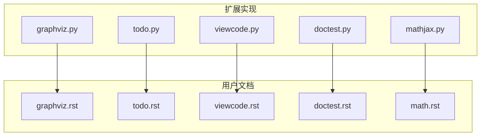
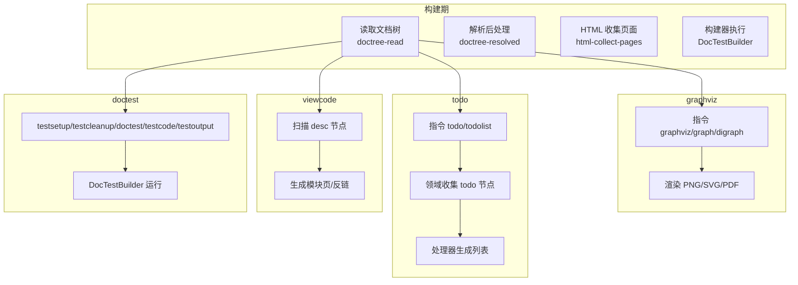
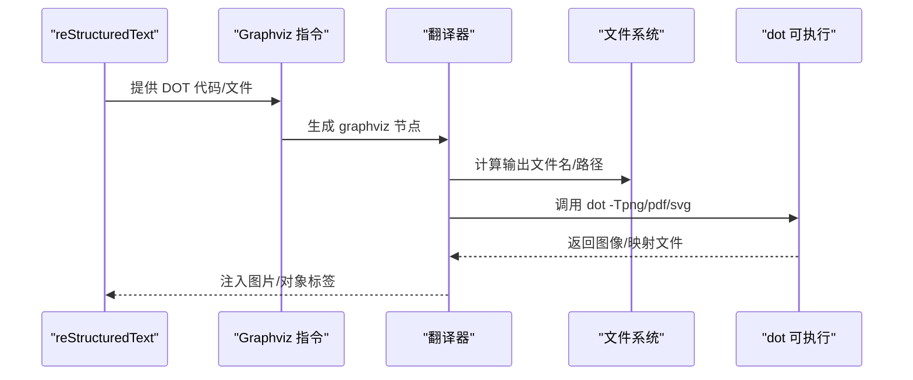
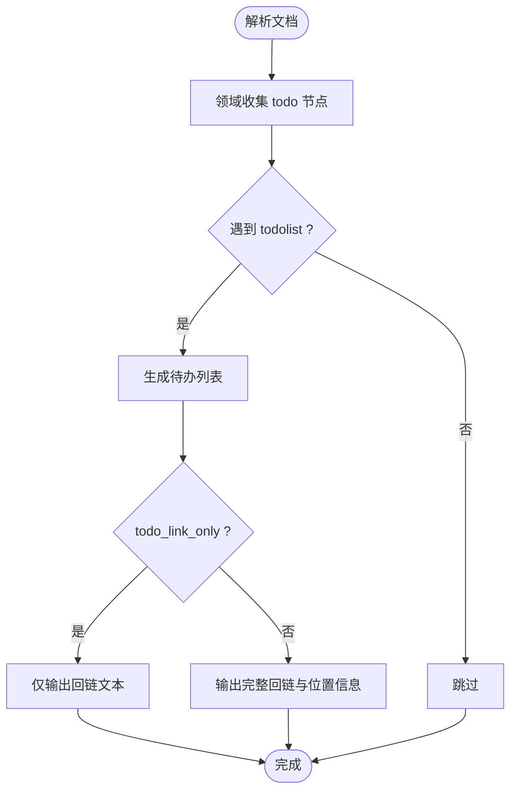
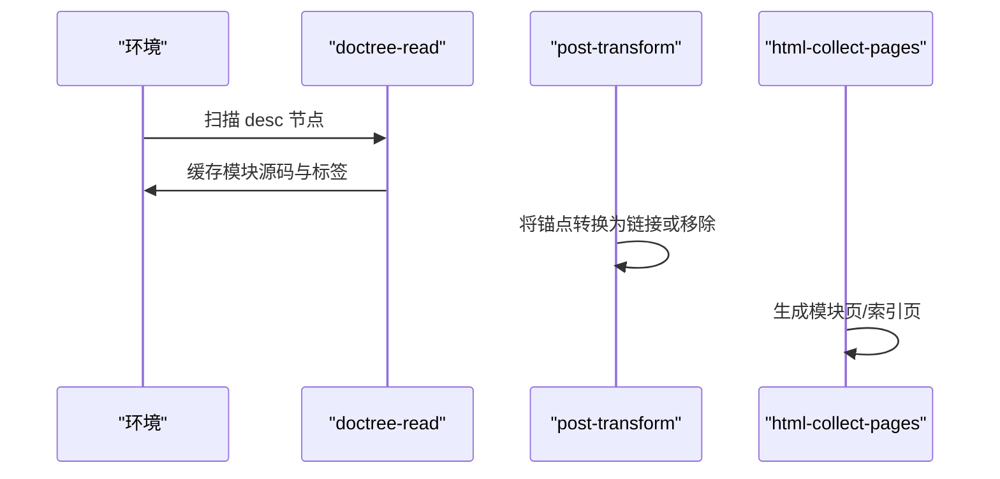
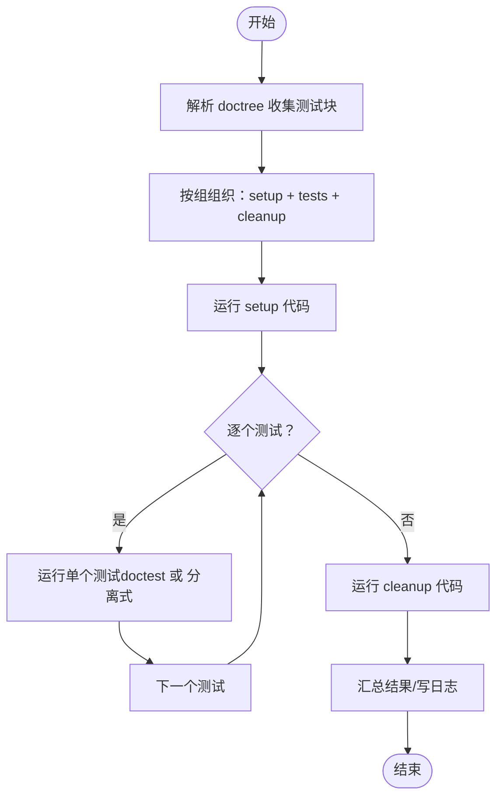
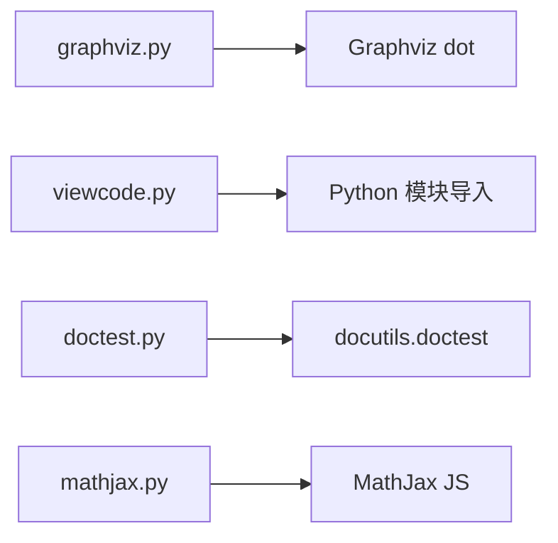

# 其他内置扩展

<cite>
**本文引用的文件**
- [graphviz.py](file://sphinx/ext/graphviz.py)
- [graphviz.rst](file://doc/usage/extensions/graphviz.rst)
- [todo.py](file://sphinx/ext/todo.py)
- [todo.rst](file://doc/usage/extensions/todo.rst)
- [viewcode.py](file://sphinx/ext/viewcode.py)
- [viewcode.rst](file://doc/usage/extensions/viewcode.rst)
- [doctest.py](file://sphinx/ext/doctest.py)
- [doctest.rst](file://doc/usage/extensions/doctest.rst)
- [mathjax.py](file://sphinx/ext/mathjax.py)
- [math.rst](file://doc/usage/extensions/math.rst)
</cite>

## 目录
1. [简介](#简介)
2. [项目结构](#项目结构)
3. [核心组件](#核心组件)
4. [架构总览](#架构总览)
5. [详细组件分析](#详细组件分析)
6. [依赖分析](#依赖分析)
7. [性能考量](#性能考量)
8. [故障排查指南](#故障排查指南)
9. [结论](#结论)
10. [附录](#附录)

## 简介
本文件系统性梳理 Sphinx 的其他内置扩展：graphviz、todo、viewcode、doctest（MathJax 数学渲染在 math.rst 中详述，本文聚焦其配置与集成）。内容涵盖：
- graphviz 的 DOT 图形绘制、渲染选项与输出格式
- todo 的待办管理与条件显示机制
- viewcode 的源码高亮与链接生成
- doctest 的文档测试与执行流程
- 各扩展的配置项、使用场景与组合实践
- 性能与最佳实践建议

## 项目结构
围绕“其他内置扩展”的关键文件分布如下：
- 扩展实现：sphinx/ext/*.py
- 使用文档：doc/usage/extensions/*.rst
- 测试用例：tests/test_ext_*（部分示例）

图表来源
- [graphviz.py](file://sphinx/ext/graphviz.py)
- [todo.py](file://sphinx/ext/todo.py)
- [viewcode.py](file://sphinx/ext/viewcode.py)
- [doctest.py](file://sphinx/ext/doctest.py)
- [mathjax.py](file://sphinx/ext/mathjax.py)
- [graphviz.rst](file://doc/usage/extensions/graphviz.rst)
- [todo.rst](file://doc/usage/extensions/todo.rst)
- [viewcode.rst](file://doc/usage/extensions/viewcode.rst)
- [doctest.rst](file://doc/usage/extensions/doctest.rst)
- [math.rst](file://doc/usage/extensions/math.rst)

章节来源
- [graphviz.py](file://sphinx/ext/graphviz.py)
- [todo.py](file://sphinx/ext/todo.py)
- [viewcode.py](file://sphinx/ext/viewcode.py)
- [doctest.py](file://sphinx/ext/doctest.py)
- [mathjax.py](file://sphinx/ext/mathjax.py)
- [graphviz.rst](file://doc/usage/extensions/graphviz.rst)
- [todo.rst](file://doc/usage/extensions/todo.rst)
- [viewcode.rst](file://doc/usage/extensions/viewcode.rst)
- [doctest.rst](file://doc/usage/extensions/doctest.rst)
- [math.rst](file://doc/usage/extensions/math.rst)

## 核心组件
- graphviz：提供 graphviz/graph/digraph 指令，将 DOT 语言渲染为 PNG/SVG 或 PDF；支持布局参数、对齐、标题、类名等选项；通过外部工具 dot 渲染。
- todo：提供 todo/todolist 指令与领域，按配置决定是否包含待办；支持“仅链接”“警告”等行为；在解析阶段收集节点并在最终页面插入列表。
- viewcode：在 Python 对象描述旁添加“查看源码”链接；生成模块级独立页面并插入反向链接；支持事件钩子以自定义源码定位与导入跟随策略。
- doctest：提供 testsetup/testcleanup/doctest/testcode/testoutput 指令；构建器按组运行测试，支持全局 setup/cleanup、失败即停、版本条件跳过、标志裁剪等。

章节来源
- [graphviz.py](file://sphinx/ext/graphviz.py)
- [todo.py](file://sphinx/ext/todo.py)
- [viewcode.py](file://sphinx/ext/viewcode.py)
- [doctest.py](file://sphinx/ext/doctest.py)

## 架构总览
下图展示各扩展在构建流程中的参与点与交互：

图表来源
- [graphviz.py](file://sphinx/ext/graphviz.py)
- [todo.py](file://sphinx/ext/todo.py)
- [viewcode.py](file://sphinx/ext/viewcode.py)
- [doctest.py](file://sphinx/ext/doctest.py)

## 详细组件分析

### graphviz 扩展
- 功能要点
  - 指令族：graphviz（内联或外链 DOT）、graph（无向图便捷版）、digraph（有向图便捷版）
  - 渲染：HTML 输出 PNG/SVG；LaTeX 输出 PDF；支持对齐、标题、替代文本、CSS 类等
  - 配置：graphviz_dot（dot 可执行路径）、graphviz_dot_args（附加参数）、graphviz_output_format（PNG/SVG）
- 数据流与处理
  - 解析阶段：指令收集代码/文件路径，构造节点
  - 访问阶段：根据输出格式调用渲染函数，必要时修正 SVG 相对链接
  - 错误处理：缺失可执行、dot 退出错误、输出文件不存在时抛出异常
- 使用场景
  - 架构图、流程图、依赖关系图
  - 文档中嵌入可交互 SVG（需正确设置 target 属性）

图表来源
- [graphviz.py](file://sphinx/ext/graphviz.py)

章节来源
- [graphviz.py](file://sphinx/ext/graphviz.py)
- [graphviz.rst](file://doc/usage/extensions/graphviz.rst)

### todo 扩展
- 功能要点
  - 指令：todo（告示样式）、todolist（全项目待办列表）
  - 域：记录每个文档的 todo 节点，支持清理与合并
  - 处理器：在 doctree-resolved 阶段替换 todolist 节点，按配置决定是否显示与链接形式
  - 配置：todo_include_todos（是否包含）、todo_link_only（仅链接）、todo_emit_warnings（是否警告）
- 条件显示机制
  - 若未启用包含，则直接跳过渲染；否则生成带源码位置的回链
- 使用场景
  - 开发过程中的临时备注、待完善条目、跨文档追踪

图表来源
- [todo.py](file://sphinx/ext/todo.py)

章节来源
- [todo.py](file://sphinx/ext/todo.py)
- [todo.rst](file://doc/usage/extensions/todo.rst)

### viewcode 扩展
- 功能要点
  - 在 Python 描述节点旁插入“查看源码”锚点
  - 生成模块页面（高亮代码），并插入反向链接
  - 仅支持 HTML 相关构建器（除 singlehtml，默认不支持 epub）
  - 配置：viewcode_follow_imported_members、viewcode_enable_epub、viewcode_line_numbers
- 关键流程
  - doctree-read：扫描 desc 节点，尝试定位模块源码并缓存标签边界
  - post-transform：将锚点转换为可点击链接或移除（非支持构建器）
  - html-collect-pages：生成模块页与索引页
- 事件钩子
  - viewcode-find-source：自定义源码定位
  - viewcode-follow-imported：解析导入属性的真实模块

图表来源
- [viewcode.py](file://sphinx/ext/viewcode.py)

章节来源
- [viewcode.py](file://sphinx/ext/viewcode.py)
- [viewcode.rst](file://doc/usage/extensions/viewcode.rst)

### doctest 扩展
- 功能要点
  - 指令族：testsetup（组初始化）、testcleanup（组收尾）、doctest（交互式风格）、testcode/testoutput（分离式）
  - 组模型：每组包含若干 setup、若干测试（doctest 或 testcode/testoutput 对），以及 cleanup
  - 构建器：DocTestBuilder 按组运行，支持全局 setup/cleanup、失败即停、按 Python 版本条件跳过、标志裁剪
  - 配置：doctest_default_flags、doctest_show_successes、doctest_path、doctest_global_setup、doctest_global_cleanup、doctest_test_doctest_blocks、doctest_fail_fast
- 执行流程
  - 收集：遍历 doctree，按分组规则提取代码块
  - 运行：先运行 setup，再逐个测试，最后运行 cleanup
  - 报告：汇总失败/尝试次数，支持快速失败

图表来源
- [doctest.py](file://sphinx/ext/doctest.py)

章节来源
- [doctest.py](file://sphinx/ext/doctest.py)
- [doctest.rst](file://doc/usage/extensions/doctest.rst)

### MathJax（数学渲染）
- 功能要点
  - HTML 中通过 MathJax 实时渲染 LaTeX 数学表达式
  - 默认加载 v4；可通过配置选择 v2/v3/v4 或自定义路径
  - 支持内联/块级公式包装、方程编号、可选的异步/延迟加载
- 配置要点
  - mathjax_path（CDN 或本地路径）
  - mathjax_options（如 integrity、async/defer）
  - mathjax4_config / mathjax3_config / mathjax2_config（JSON 配置）
  - mathjax_config_path（外部 .js 配置文件）
- 使用场景
  - 在线文档的数学公式实时渲染，无需预编译图像

章节来源
- [mathjax.py](file://sphinx/ext/mathjax.py)
- [math.rst](file://doc/usage/extensions/math.rst)

## 依赖分析
- 内部耦合
  - graphviz：依赖外部 dot 工具；HTML/LaTeX/Texinfo/Text/Man 输出适配器分别处理
  - todo：领域与处理器强耦合，依赖配置控制显示
  - viewcode：与 Python 域紧密协作；通过事件钩子扩展源码定位
  - doctest：与 docutils doctest 引擎集成；构建器负责执行与汇总
- 外部依赖
  - graphviz：Graphviz dot
  - imgmath：LaTeX、dvipng/dvisvgm
  - MathJax：浏览器端 JS 库（默认 CDN）

图表来源
- [graphviz.py](file://sphinx/ext/graphviz.py)
- [viewcode.py](file://sphinx/ext/viewcode.py)
- [doctest.py](file://sphinx/ext/doctest.py)
- [mathjax.py](file://sphinx/ext/mathjax.py)

章节来源
- [graphviz.py](file://sphinx/ext/graphviz.py)
- [viewcode.py](file://sphinx/ext/viewcode.py)
- [doctest.py](file://sphinx/ext/doctest.py)
- [mathjax.py](file://sphinx/ext/mathjax.py)

## 性能考量
- graphviz
  - 外部进程开销：dot 调用次数与 DOT 复杂度成正比；建议复用输出、避免频繁变更
  - SVG 相对链接修正：仅在 SVG 输出时进行一次 XML 解析与重写
  - 输出格式：SVG 更利于交互但体积更大；PNG 适合静态展示
- todo
  - 列表生成：仅在启用包含时生成；避免在大型项目中开启不必要的警告
- viewcode
  - 导入副作用：构建时会实际导入模块；需保护脚本入口
  - 页面生成：仅在支持的 HTML 构建器上生成；epub 默认关闭以减少无关页面
  - 线号：开启行号会增加页面体积与处理时间
- doctest
  - 测试数量与复杂度直接影响构建时间；建议分组、使用失败即停、按版本条件跳过
  - 全局 setup/cleanup 仅一次执行，合理利用可减少重复工作

## 故障排查指南
- graphviz
  - 现象：无法渲染或报错“dot 命令不可用”
  - 排查：确认 graphviz_dot 指向有效可执行文件；检查 graphviz_dot_args 是否正确
  - 现象：SVG 链接失效
  - 排查：确保 SVG 中设置了合适的 target 属性（如 “_top”）
- todo
  - 现象：todo/todolist 未显示
  - 排查：确认 todo_include_todos 已启用；检查文档中是否正确使用指令
- viewcode
  - 现象：未生成模块页或链接无效
  - 排查：确认构建器支持；若为 epub，需启用 viewcode_enable_epub；检查模块导入是否产生副作用
  - 现象：找不到源码
  - 排查：通过 viewcode-find-source 事件提供源码与标签映射
- doctest
  - 现象：测试未执行或被跳过
  - 排查：检查 skipif 表达式、pyversion 条件、分组分配；确认 doctest_test_doctest_blocks 设置
  - 现象：失败过多导致构建缓慢
  - 排查：启用 doctest_fail_fast 快速停止；拆分大文档为多个小文档

章节来源
- [graphviz.py](file://sphinx/ext/graphviz.py)
- [todo.py](file://sphinx/ext/todo.py)
- [viewcode.py](file://sphinx/ext/viewcode.py)
- [doctest.py](file://sphinx/ext/doctest.py)

## 结论
- graphviz、todo、viewcode、doctest 四个扩展分别覆盖“可视化图示”“待办管理”“源码链接”“文档测试”四大主题
- 合理配置与组合使用可显著提升文档质量与维护效率
- 注意外部依赖与构建性能，按需启用特性并优化执行路径

## 附录
- 配置示例与使用场景（摘自官方文档）
  - graphviz
    - graphviz_dot：指定 dot 可执行路径
    - graphviz_dot_args：全局图/节点/边属性设置
    - graphviz_output_format：PNG/SVG 二选一
  - todo
    - todo_include_todos：是否包含待办
    - todo_link_only：仅输出回链
    - todo_emit_warnings：是否发出警告
  - viewcode
    - viewcode_follow_imported_members：是否跟随导入成员
    - viewcode_enable_epub：是否在 epub 中启用
    - viewcode_line_numbers：是否显示行号
  - doctest
    - doctest_default_flags：默认 doctest 选项
    - doctest_show_successes：是否报告成功
    - doctest_path：追加到 sys.path
    - doctest_global_setup/global_cleanup：全局初始化/清理
    - doctest_test_doctest_blocks：是否测试标准 doctest 块
    - doctest_fail_fast：失败即停
  - MathJax
    - mathjax_path：CDN 或本地路径
    - mathjax_options：script 标签选项（如 integrity、async/defer）
    - mathjax4_config / mathjax3_config / mathjax2_config：MathJax 配置字典
    - mathjax_config_path：外部 .js 配置文件

章节来源
- [graphviz.rst](file://doc/usage/extensions/graphviz.rst)
- [todo.rst](file://doc/usage/extensions/todo.rst)
- [viewcode.rst](file://doc/usage/extensions/viewcode.rst)
- [doctest.rst](file://doc/usage/extensions/doctest.rst)
- [math.rst](file://doc/usage/extensions/math.rst)