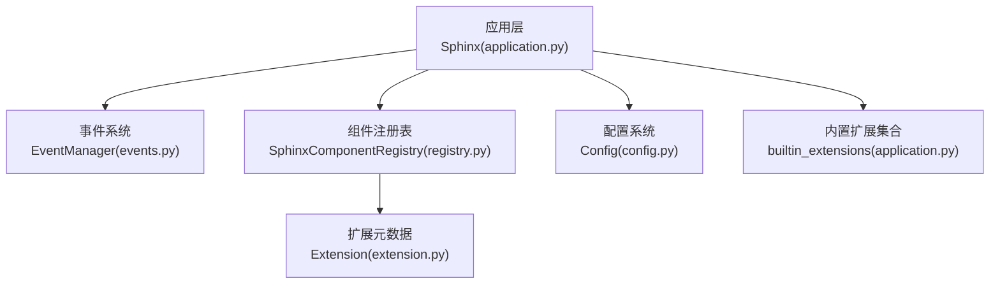
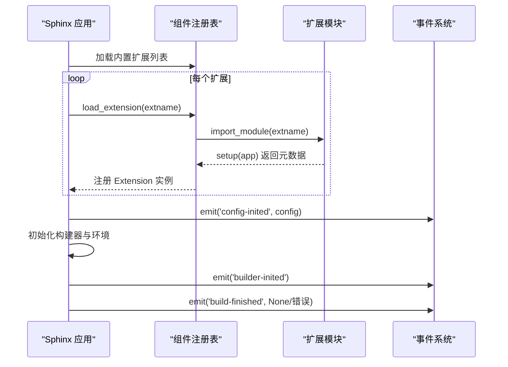
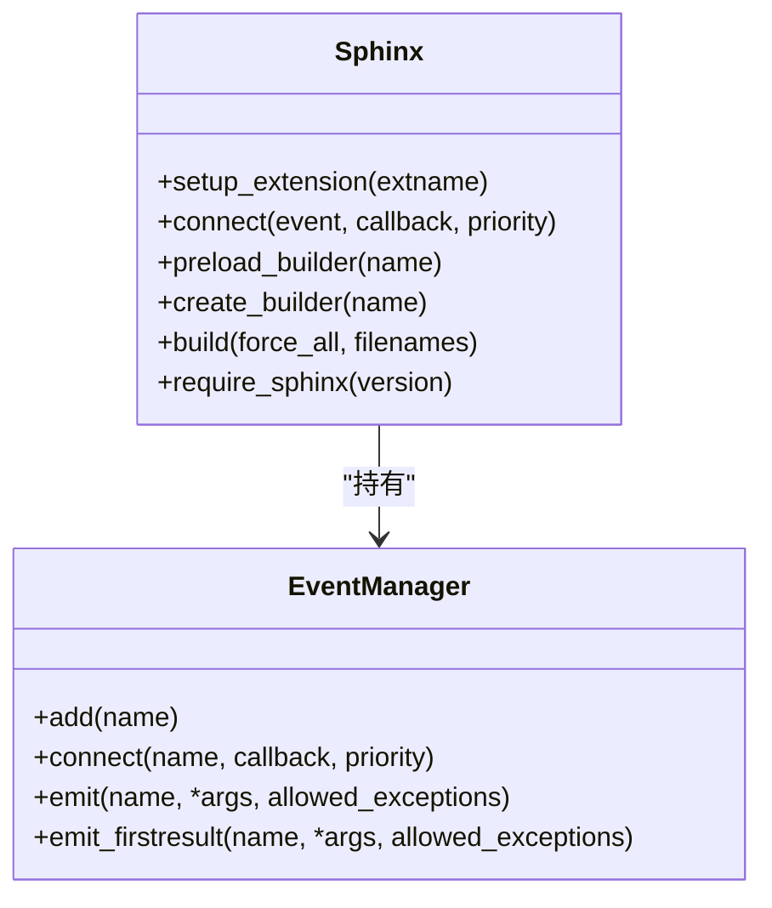
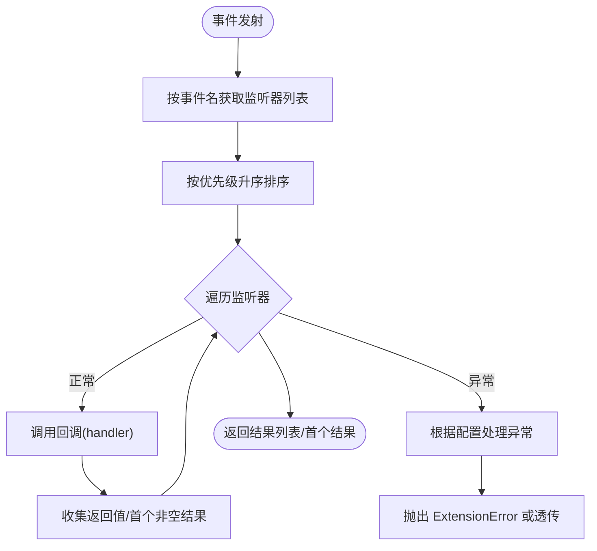
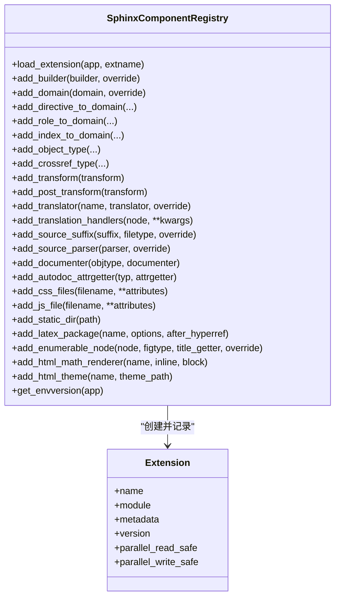
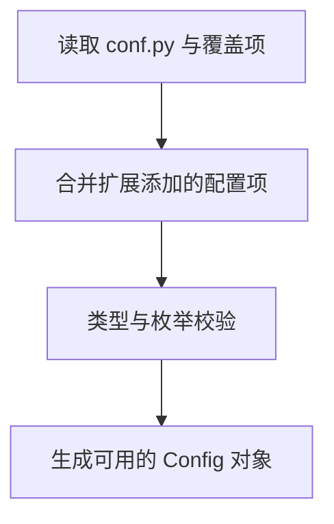
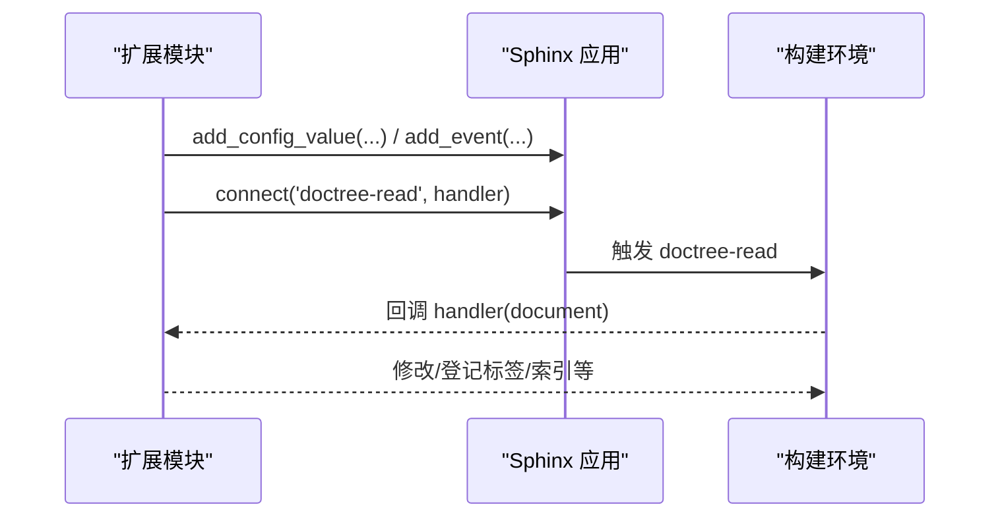
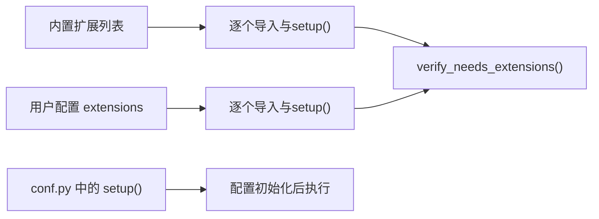

# 扩展架构原理

<cite>
**本文引用的文件**
- [application.py](file://sphinx/application.py)
- [events.py](file://sphinx/events.py)
- [registry.py](file://sphinx/registry.py)
- [extension.py](file://sphinx/extension.py)
- [config.py](file://sphinx/config.py)
- [appapi.rst](file://doc/extdev/appapi.rst)
- [eventapi.rst](file://doc/extdev/eventapi.rst)
- [builderapi.rst](file://doc/extdev/builderapi.rst)
- [index.rst](file://doc/extdev/index.rst)
- [autodoc/__init__.py](file://sphinx/ext/autodoc/__init__.py)
- [graphviz.py](file://sphinx/ext/graphviz.py)
- [autosectionlabel.py](file://sphinx/ext/autosectionlabel.py)
- [test_extension.py](file://tests/test_extensions/test_extension.py)
</cite>

## 目录
1. [引言](#引言)
2. [项目结构](#项目结构)
3. [核心组件](#核心组件)
4. [架构总览](#架构总览)
5. [详细组件分析](#详细组件分析)
6. [依赖关系分析](#依赖关系分析)
7. [性能考量](#性能考量)
8. [故障排查指南](#故障排查指南)
9. [结论](#结论)
10. [附录](#附录)

## 引言
本文件系统性阐述 Sphinx 扩展架构的设计理念与实现机制，重点覆盖以下主题：
- 扩展系统的整体设计理念与插件机制
- 扩展的注册流程、生命周期管理与事件驱动架构
- 扩展配置系统的工作原理（含 setup() 的作用与初始化过程）
- 扩展间的依赖关系与加载顺序
- 扩展开发最佳实践与设计模式
- 扩展调试技巧与常见问题解决方案

## 项目结构
Sphinx 的扩展能力由应用层、事件系统、组件注册表与内置扩展共同构成。下图展示了与扩展相关的核心模块及其交互关系。

**图表来源**
- [application.py:148-341](file://sphinx/application.py#L148-L341)
- [events.py:72-486](file://sphinx/events.py#L72-L486)
- [registry.py:72-628](file://sphinx/registry.py#L72-L628)
- [extension.py:23-95](file://sphinx/extension.py#L23-L95)
- [config.py:196-915](file://sphinx/config.py#L196-L915)

**章节来源**
- [application.py:78-141](file://sphinx/application.py#L78-L141)
- [appapi.rst:14-106](file://doc/extdev/appapi.rst#L14-L106)
- [index.rst:19-41](file://doc/extdev/index.rst#L19-L41)

## 核心组件
- 应用层（Sphinx）：负责扩展加载、事件分发、构建器初始化与构建生命周期管理。
- 事件系统（EventManager）：提供事件注册、优先级调度与异常传播机制。
- 组件注册表（SphinxComponentRegistry）：统一管理扩展向框架注册的各类组件（构建器、域、指令、角色、转换等）。
- 扩展元数据（Extension）：封装扩展版本、并行安全标记等信息，并在依赖校验中使用。
- 配置系统（Config）：集中管理配置项与扩展列表，支持增量重建策略与类型约束。

**章节来源**
- [application.py:148-341](file://sphinx/application.py#L148-L341)
- [events.py:72-486](file://sphinx/events.py#L72-L486)
- [registry.py:72-628](file://sphinx/registry.py#L72-L628)
- [extension.py:23-95](file://sphinx/extension.py#L23-L95)
- [config.py:196-915](file://sphinx/config.py#L196-L915)

## 架构总览
Sphinx 在启动阶段按固定顺序加载扩展：内置扩展 → 用户配置扩展 → 配置文件作为扩展。随后初始化构建器、环境与写入器，并通过事件系统驱动各阶段处理。

**图表来源**
- [application.py:292-325](file://sphinx/application.py#L292-L325)
- [registry.py:531-599](file://sphinx/registry.py#L531-L599)
- [events.py:405-457](file://sphinx/events.py#L405-L457)

**章节来源**
- [application.py:292-341](file://sphinx/application.py#L292-L341)
- [registry.py:531-599](file://sphinx/registry.py#L531-L599)
- [index.rst:100-163](file://doc/extdev/index.rst#L100-L163)

## 详细组件分析

### 组件一：应用层（Sphinx）与扩展加载
- 负责读取配置、初始化国际化、版本检查、加载内置与用户扩展、预加载构建器、创建项目与环境、初始化构建器并触发事件。
- 提供扩展加载入口：setup_extension() 委托给注册表完成导入与 setup() 调用。
- 生命周期事件贯穿初始化、构建与收尾阶段，扩展通过 connect() 订阅感兴趣事件。

**图表来源**
- [application.py:497-800](file://sphinx/application.py#L497-L800)
- [events.py:72-486](file://sphinx/events.py#L72-L486)

**章节来源**
- [application.py:165-341](file://sphinx/application.py#L165-L341)
- [appapi.rst:14-106](file://doc/extdev/appapi.rst#L14-L106)

### 组件二：事件系统（EventManager）
- 内置核心事件集定义于 core_events；扩展可通过 add() 注册自定义事件名。
- 支持优先级排序回调；异常时可选择透传或统一包装为 ExtensionError。
- 提供 emit() 与 emit_firstresult() 两种发射模式以满足不同场景。

**图表来源**
- [events.py:405-486](file://sphinx/events.py#L405-L486)

**章节来源**
- [events.py:50-95](file://sphinx/events.py#L50-L95)
- [eventapi.rst:6-10](file://doc/extdev/eventapi.rst#L6-L10)

### 组件三：组件注册表（SphinxComponentRegistry）
- 统一管理扩展注册的组件：构建器、域、指令、角色、索引、对象类型、转换、翻译处理器、LaTeX 包、数学渲染器、静态目录等。
- 提供 load_extension() 完成扩展导入、setup() 调用与元数据解析；并维护扩展版本与并行安全标记。
- 提供 get_envversion() 用于环境一致性校验。

**图表来源**
- [registry.py:72-628](file://sphinx/registry.py#L72-L628)
- [extension.py:23-40](file://sphinx/extension.py#L23-L40)

**章节来源**
- [registry.py:531-599](file://sphinx/registry.py#L531-L599)
- [extension.py:41-95](file://sphinx/extension.py#L41-L95)

### 组件四：扩展配置系统（Config）
- 集中管理配置项、默认值、重建策略与类型约束（ENUM、有效类型集合）。
- 支持从 conf.py 读取配置并合并扩展提供的配置值；提供 add_config_value() 接口。
- 与扩展依赖校验配合，通过 needs_extensions 与 verify_needs_extensions() 进行版本要求检查。

**图表来源**
- [config.py:196-200](file://sphinx/config.py#L196-L200)
- [registry.py:602-618](file://sphinx/registry.py#L602-L618)

**章节来源**
- [config.py:196-915](file://sphinx/config.py#L196-L915)
- [registry.py:602-628](file://sphinx/registry.py#L602-L628)

### 组件五：扩展示例与实践
- 自动文档扩展（autodoc）：在 setup() 中注册配置项与自定义事件，体现“配置 + 事件”的典型模式。
- Graphviz 扩展：演示如何定义节点、指令与翻译器挂钩，展示扩展对 Writer 的集成方式。
- 自动章节标签扩展（autosectionlabel）：通过订阅 doctree-read 事件在文档树上登记标签，体现事件驱动的数据增强。

**图表来源**
- [autodoc/__init__.py:140-200](file://sphinx/ext/autodoc/__init__.py#L140-L200)
- [autosectionlabel.py:73-87](file://sphinx/ext/autosectionlabel.py#L73-L87)
- [graphviz.py:114-192](file://sphinx/ext/graphviz.py#L114-L192)

**章节来源**
- [autodoc/__init__.py:140-200](file://sphinx/ext/autodoc/__init__.py#L140-L200)
- [autosectionlabel.py:73-87](file://sphinx/ext/autosectionlabel.py#L73-L87)
- [graphviz.py:114-200](file://sphinx/ext/graphviz.py#L114-L200)

## 依赖关系分析
- 扩展加载顺序
  - 内置扩展：由内置常量列表定义，确保基础功能先就绪。
  - 用户扩展：来自配置中的 extensions 列表，按顺序加载。
  - 配置文件作为扩展：若存在 setup()，在配置初始化后执行。
- 依赖校验
  - 通过 verify_needs_extensions() 校验 needs_extensions 中声明的扩展版本是否满足。
  - 若未加载或版本不足，抛出版本要求错误。

**图表来源**
- [application.py:292-325](file://sphinx/application.py#L292-L325)
- [extension.py:41-85](file://sphinx/extension.py#L41-L85)

**章节来源**
- [application.py:292-325](file://sphinx/application.py#L292-L325)
- [extension.py:41-95](file://sphinx/extension.py#L41-L95)
- [test_extension.py:17-35](file://tests/test_extensions/test_extension.py#L17-L35)

## 性能考量
- 并行安全标记
  - parallel_read_safe 与 parallel_write_safe 控制并行读写行为，避免扩展在不安全状态下并发执行。
  - 未显式声明时，读取阶段会发出警告，写入阶段默认允许并行。
- 环境版本与增量重建
  - 扩展通过 env_version 标记其在环境中存储的数据结构版本，确保缓存一致性。
  - 配置项的 rebuild 字段决定变更后是否需要重新构建对应部分。
- 事件回调优先级
  - 合理设置优先级，避免长耗时回调阻塞关键路径；必要时拆分为多个事件或异步处理。

[本节为通用指导，无需特定文件来源]

## 故障排查指南
- 扩展导入失败
  - 现象：无法导入扩展模块。
  - 处理：检查扩展名称拼写、Python 路径与依赖；查看日志中的原始异常堆栈。
- setup() 缺失或返回类型不正确
  - 现象：扩展无 setup() 或返回非字典/None。
  - 处理：确保返回字典或 None；遵循元数据键规范（version、env_version、parallel_*）。
- 版本要求不满足
  - 现象：needs_extensions 声明的扩展版本不足或未加载。
  - 处理：安装/升级目标扩展至满足版本；确认扩展已出现在 extensions 列表。
- 事件异常
  - 现象：事件回调抛出异常导致构建中断。
  - 处理：启用调试模式（pdb）或捕获 allowed_exceptions；定位具体回调并修复。
- 并行安全警告
  - 现象：读取阶段出现并行安全警告。
  - 处理：为扩展设置 parallel_read_safe=True 并实现必要的环境合并/清理逻辑。

**章节来源**
- [registry.py:531-599](file://sphinx/registry.py#L531-L599)
- [extension.py:41-95](file://sphinx/extension.py#L41-L95)
- [events.py:405-457](file://sphinx/events.py#L405-L457)
- [index.rst:165-228](file://doc/extdev/index.rst#L165-L228)

## 结论
Sphinx 的扩展架构以“事件驱动 + 组件注册 + 配置管理”为核心，通过严格的加载顺序与依赖校验保障构建稳定性。开发者应充分利用 setup()、事件系统与注册表接口，在保证并行安全的前提下实现功能增强与定制化输出。

[本节为总结，无需特定文件来源]

## 附录
- 开发者参考
  - 应用 API：Sphinx 类的公共方法与属性
  - 事件 API：EventManager 的事件注册与发射
  - 构建器 API：Builder 的生命周期与工作流
  - 扩展元数据：version、env_version、parallel_* 的语义与使用

**章节来源**
- [appapi.rst:14-106](file://doc/extdev/appapi.rst#L14-L106)
- [eventapi.rst:6-10](file://doc/extdev/eventapi.rst#L6-L10)
- [builderapi.rst:8-92](file://doc/extdev/builderapi.rst#L8-L92)
- [index.rst:165-228](file://doc/extdev/index.rst#L165-L228)