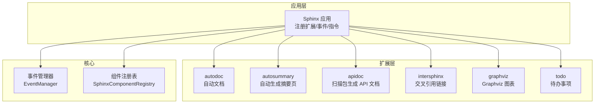
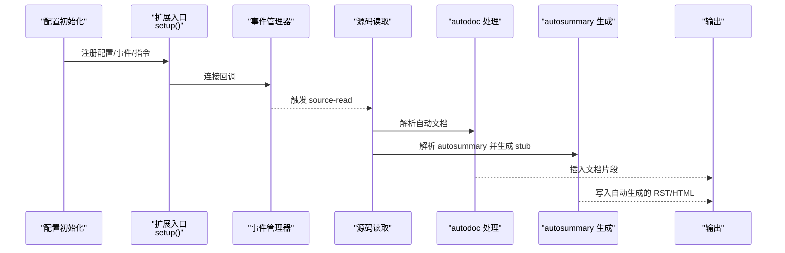
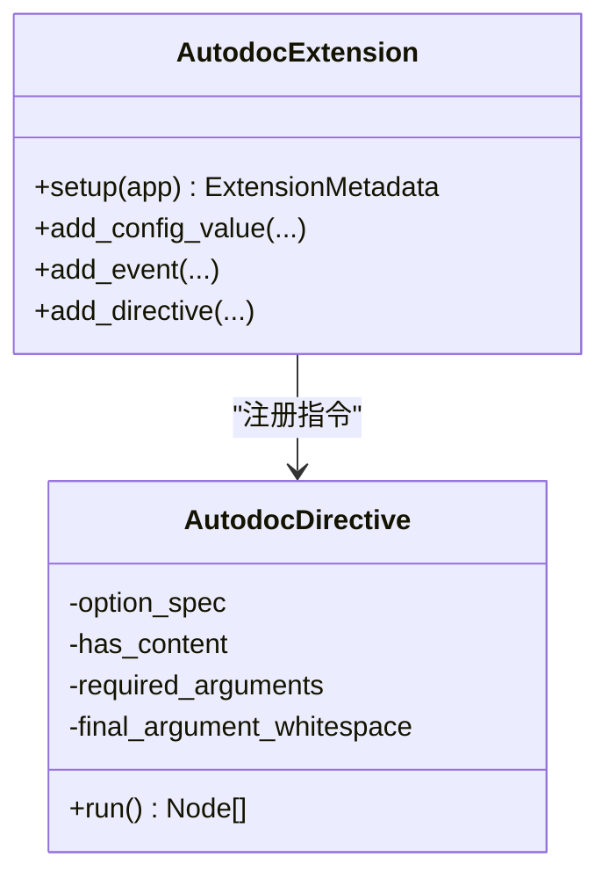
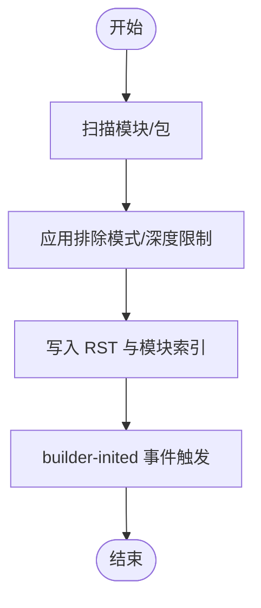
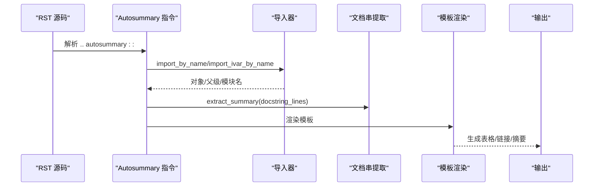
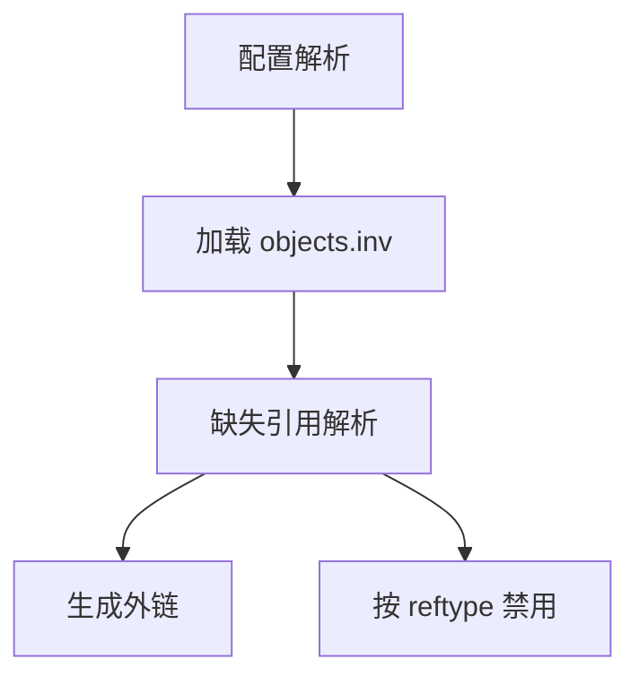
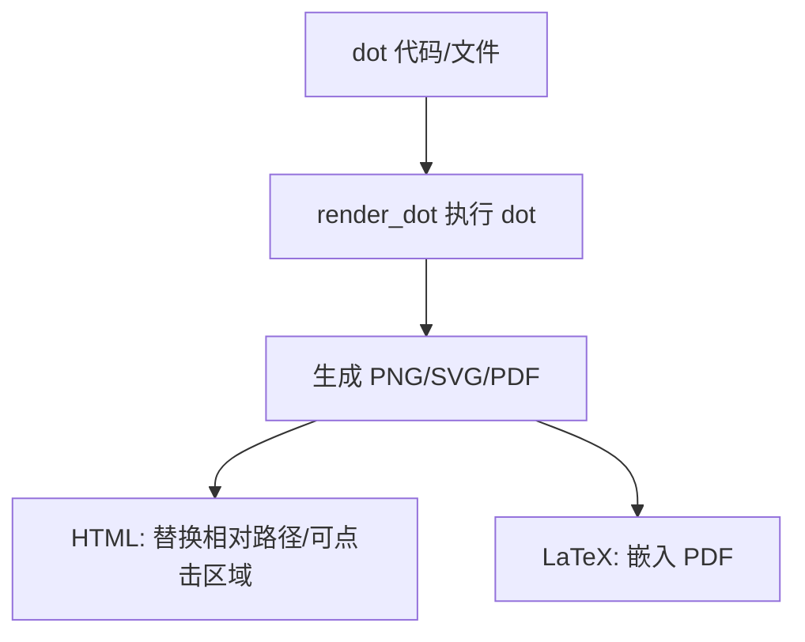
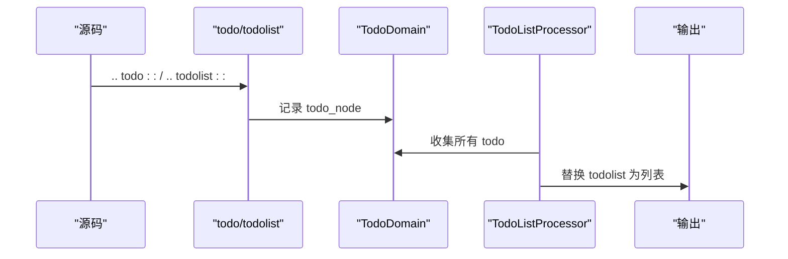
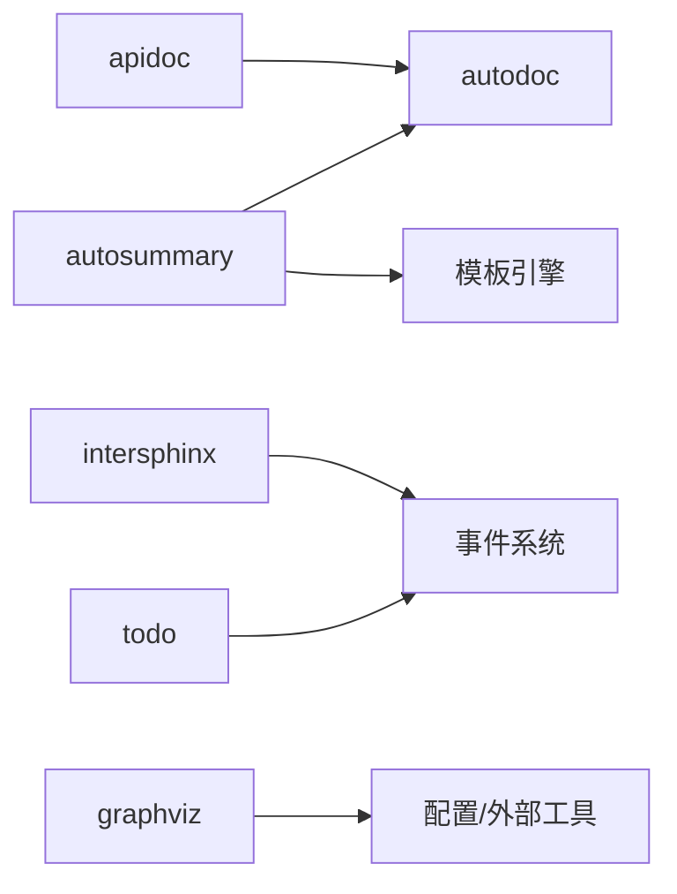

# 扩展系统

<cite>
**本文引用的文件**
- [sphinx/ext/autodoc/__init__.py](file://sphinx/ext/autodoc/__init__.py)
- [sphinx/ext/autosummary/__init__.py](file://sphinx/ext/autosummary/__init__.py)
- [sphinx/ext/autosummary/generate.py](file://sphinx/ext/autosummary/generate.py)
- [sphinx/ext/apidoc/__init__.py](file://sphinx/ext/apidoc/__init__.py)
- [sphinx/ext/intersphinx/__init__.py](file://sphinx/ext/intersphinx/__init__.py)
- [sphinx/ext/graphviz.py](file://sphinx/ext/graphviz.py)
- [sphinx/ext/todo.py](file://sphinx/ext/todo.py)
- [sphinx/ext/autodoc/_directive.py](file://sphinx/ext/autodoc/_directive.py)
- [sphinx/application.py](file://sphinx/application.py)
- [sphinx/events.py](file://sphinx/events.py)
- [doc/usage/extensions/autodoc.rst](file://doc/usage/extensions/autodoc.rst)
- [doc/usage/extensions/autosummary.rst](file://doc/usage/extensions/autosummary.rst)
- [doc/usage/extensions/apidoc.rst](file://doc/usage/extensions/apidoc.rst)
- [doc/usage/extensions/intersphinx.rst](file://doc/usage/extensions/intersphinx.rst)
- [doc/usage/extensions/graphviz.rst](file://doc/usage/extensions/graphviz.rst)
- [doc/usage/extensions/todo.rst](file://doc/usage/extensions/todo.rst)
</cite>

## 目录
1. [引言](#引言)
2. [项目结构](#项目结构)
3. [核心组件](#核心组件)
4. [架构总览](#架构总览)
5. [详细组件分析](#详细组件分析)
6. [依赖关系分析](#依赖关系分析)
7. [性能考量](#性能考量)
8. [故障排查指南](#故障排查指南)
9. [结论](#结论)
10. [附录](#附录)

## 引言
本文件系统性阐述 Sphinx 扩展体系的设计与实现，重点覆盖自动文档（autodoc）、API 文档生成（apidoc）、自动摘要（autosummary）、交叉引用（intersphinx）、图可视化（graphviz）、待办事项（todo）等扩展，并给出事件驱动机制、指令注册流程、模板系统、配置最佳实践与性能优化建议。目标是帮助读者在理解扩展架构的同时，高效地使用与定制扩展。

## 项目结构
Sphinx 将扩展按功能划分为多个子模块，每个扩展通常包含一个入口文件（setup 函数与配置项注册）、可选的 CLI 工具、以及与核心应用交互的事件与节点定义。下图展示与本文相关的扩展模块及其在应用生命周期中的位置：

图表来源
- [sphinx/application.py:148-200](file://sphinx/application.py#L148-L200)
- [sphinx/events.py:72-120](file://sphinx/events.py#L72-L120)

章节来源
- [sphinx/application.py:78-141](file://sphinx/application.py#L78-L141)
- [sphinx/events.py:50-95](file://sphinx/events.py#L50-L95)

## 核心组件
- 应用与扩展注册：Sphinx 在初始化时加载内置扩展与主题，随后通过扩展入口的 setup 函数注册配置项、事件监听器、指令与域等。
- 事件系统：扩展通过 EventManager 订阅核心事件（如 config-inited、builder-inited、source-read、missing-reference 等），在构建流程中插入行为。
- 指令与域：扩展通过 add_directive/add_node/add_domain 等接口向应用注册，使 rST 源码中可直接使用扩展提供的语法元素。
- 配置项：扩展通过 add_config_value 注册配置项，支持运行时校验与默认值设置。

章节来源
- [sphinx/application.py:148-200](file://sphinx/application.py#L148-L200)
- [sphinx/events.py:72-120](file://sphinx/events.py#L72-L120)

## 架构总览
下图展示扩展在构建流程中的典型交互路径：从配置初始化到源码读取、再到解析与渲染阶段，扩展通过事件钩子参与各环节。

图表来源
- [sphinx/ext/autodoc/__init__.py:140-213](file://sphinx/ext/autodoc/__init__.py#L140-L213)
- [sphinx/ext/autosummary/__init__.py:192-265](file://sphinx/ext/autosummary/__init__.py#L192-L265)
- [sphinx/ext/autosummary/generate.py:116-154](file://sphinx/ext/autosummary/generate.py#L116-L154)
- [sphinx/events.py:101-120](file://sphinx/events.py#L101-L120)

## 详细组件分析

### 自动文档扩展（autodoc）
- 设计理念
  - 基于对象导入与签名/文档串提取，将代码注释转换为文档树节点，避免重复维护。
  - 支持多种对象类型（模块、类、函数、属性、数据等），并通过选项控制成员选择、继承、排序等。
- 关键机制
  - 指令注册：新式（推荐）通过 add_directive('auto' + objtype, AutodocDirective)；旧式通过 add_autodocumenter 注册 Documenter 类族。
  - 事件钩子：autodoc-before-process-signature、autodoc-process-docstring、autodoc-process-signature、autodoc-skip-member、autodoc-process-bases 等。
  - 配置项：autoclass_content、autodoc_member_order、autodoc_class_signature、autodoc_default_options、autodoc_docstring_signature、autodoc_mock_imports、autodoc_typehints、autodoc_type_aliases、autodoc_typehints_format、autodoc_warningiserror、autodoc_inherit_docstrings、autodoc_preserve_defaults、autodoc_use_type_comments、autodoc_use_legacy_class_based 等。
- 代码生成与解析
  - AutodocDirective 负责解析参数、合并默认选项、调用 _auto_document_object 生成内容，再嵌入到 doctree。
  - 与类型提示、签名清理、文档串预处理等配合，确保输出一致且可读。
- 交叉引用处理
  - 通过对象描述转换（object-description-transform）合并类型提示，提升跨语言/跨域引用质量。

图表来源
- [sphinx/ext/autodoc/_directive.py:49-119](file://sphinx/ext/autodoc/_directive.py#L49-L119)
- [sphinx/ext/autodoc/__init__.py:140-213](file://sphinx/ext/autodoc/__init__.py#L140-L213)

章节来源
- [sphinx/ext/autodoc/__init__.py:140-213](file://sphinx/ext/autodoc/__init__.py#L140-L213)
- [sphinx/ext/autodoc/_directive.py:49-119](file://sphinx/ext/autodoc/_directive.py#L49-L119)
- [doc/usage/extensions/autodoc.rst:1-120](file://doc/usage/extensions/autodoc.rst#L1-L120)

### API 文档扩展（apidoc）
- 功能概述
  - 扫描目录树，识别 Python 模块/包，生成对应 RST 文件与模块索引，供 autodoc 使用。
  - 可配置深度、排除模式、是否跟随符号链接、是否单独模块页面、是否包含私有模块、是否模块优先等。
- 关键机制
  - 依赖 autodoc：通过 app.setup_extension('sphinx.ext.autodoc') 强制启用。
  - builder-inited 事件触发 run_apidoc，扫描并写入生成文件。
  - 配置项：apidoc_exclude_patterns、apidoc_max_depth、apidoc_follow_links、apidoc_separate_modules、apidoc_include_private、apidoc_no_headings、apidoc_module_first、apidoc_implicit_namespaces、apidoc_automodule_options、apidoc_modules 等。
- 与 autodoc 的协作
  - 生成的 RST 中包含 automodule/autoclass 等指令，由 autodoc 在后续构建中解析。

图表来源
- [sphinx/ext/apidoc/__init__.py:28-67](file://sphinx/ext/apidoc/__init__.py#L28-L67)

章节来源
- [sphinx/ext/apidoc/__init__.py:28-67](file://sphinx/ext/apidoc/__init__.py#L28-L67)
- [doc/usage/extensions/apidoc.rst:1-173](file://doc/usage/extensions/apidoc.rst#L1-L173)

### 自动摘要扩展（autosummary）
- 功能概述
  - 生成“摘要列表”表格，包含对象链接与简短摘要；可生成 stub 页面并支持模板定制。
  - 提供 autosummary 指令与 :autolink: 角色，增强智能链接能力。
- 关键机制
  - 指令解析：Autosummary.run 获取 items，生成表格节点；若含 toctree，则插入隐藏 toctree。
  - 导入与文档串抽取：import_by_name/import_ivar_by_name 安全导入对象，extract_summary 从 docstring 提取首段。
  - 模板系统：AutosummaryRenderer 基于 Jinja2 模板渲染，支持 base.rst、module.rst、class.rst、function.rst、method.rst、attribute.rst 等。
  - 自动生成：sphinx-autogen 或 autosummary_generate 控制是否自动生成 stub 页面。
- 与 autodoc 的集成
  - 通过 _get_documenter 选择合适的 Documenter 类型，复用 autodoc 的签名与文档串处理钩子。

图表来源
- [sphinx/ext/autosummary/__init__.py:192-265](file://sphinx/ext/autosummary/__init__.py#L192-L265)
- [sphinx/ext/autosummary/__init__.py:284-384](file://sphinx/ext/autosummary/__init__.py#L284-L384)
- [sphinx/ext/autosummary/generate.py:116-154](file://sphinx/ext/autosummary/generate.py#L116-L154)

章节来源
- [sphinx/ext/autosummary/__init__.py:1-120](file://sphinx/ext/autosummary/__init__.py#L1-L120)
- [sphinx/ext/autosummary/__init__.py:192-265](file://sphinx/ext/autosummary/__init__.py#L192-L265)
- [sphinx/ext/autosummary/generate.py:116-154](file://sphinx/ext/autosummary/generate.py#L116-L154)
- [doc/usage/extensions/autosummary.rst:1-120](file://doc/usage/extensions/autosummary.rst#L1-L120)

### 交叉引用扩展（intersphinx）
- 功能概述
  - 通过 objects.inv 映射远程项目的对象名到相对 URL，实现跨项目链接与回退解析。
- 关键机制
  - 配置：intersphinx_mapping（项目标识 -> (基础URI, 库文件路径或元组)）、intersphinx_resolve_self、intersphinx_cache_limit、intersphinx_timeout、intersphinx_disabled_reftypes。
  - 事件：config-inited 校验映射、builder-inited 加载映射、source-read 安装分发器、missing-reference 缺失引用时解析。
  - 角色：:external: 仅在外部查找；支持限定具体项目键。
- 性能与缓存
  - 支持缓存与超时控制，减少网络开销；支持镜像站点轮询。

图表来源
- [sphinx/ext/intersphinx/__init__.py:66-88](file://sphinx/ext/intersphinx/__init__.py#L66-L88)

章节来源
- [sphinx/ext/intersphinx/__init__.py:66-88](file://sphinx/ext/intersphinx/__init__.py#L66-L88)
- [doc/usage/extensions/intersphinx.rst:1-120](file://doc/usage/extensions/intersphinx.rst#L1-L120)

### 图可视化扩展（graphviz）
- 功能概述
  - 在文档中内联 Graphviz dot 代码，生成 PNG/SVG（HTML）或 PDF（LaTeX）图像；支持外部文件与布局参数。
- 关键机制
  - 指令：graphviz、graph、digraph；支持 alt、align、caption、layout、name、class 等选项。
  - 渲染：render_dot 调用 dot 命令生成图像；HTML 输出处理 SVG 相对路径；LaTeX 输出嵌入 PDF。
  - 配置：graphviz_dot、graphviz_dot_args、graphviz_output_format；自动注入 graphviz.css。
- 错误处理
  - 子进程异常、输出文件不存在、dot 路径缺失等均抛出 GraphvizError 并记录警告。

图表来源
- [sphinx/ext/graphviz.py:275-352](file://sphinx/ext/graphviz.py#L275-L352)
- [sphinx/ext/graphviz.py:512-537](file://sphinx/ext/graphviz.py#L512-L537)

章节来源
- [sphinx/ext/graphviz.py:114-192](file://sphinx/ext/graphviz.py#L114-L192)
- [sphinx/ext/graphviz.py:275-352](file://sphinx/ext/graphviz.py#L275-L352)
- [sphinx/ext/graphviz.py:512-537](file://sphinx/ext/graphviz.py#L512-L537)
- [doc/usage/extensions/graphviz.rst:1-120](file://doc/usage/extensions/graphviz.rst#L1-L120)

### 待办事项扩展（todo）
- 功能概述
  - 提供 todo 与 todolist 指令，支持条件输出与全局列表；可发出 todo-defined 事件。
- 关键机制
  - 节点与域：todo_node、todolist；TodoDomain 维护各文档的 todo 列表。
  - 处理器：TodoListProcessor 在 doctree-resolved 阶段收集并替换 todolist 节点。
  - 配置：todo_include_todos、todo_link_only、todo_emit_warnings。
- 与引用解析
  - 在处理器中对 todo 内容进行引用解析，保证跨文档链接正确。

图表来源
- [sphinx/ext/todo.py:98-150](file://sphinx/ext/todo.py#L98-L150)
- [sphinx/ext/todo.py:226-251](file://sphinx/ext/todo.py#L226-L251)

章节来源
- [sphinx/ext/todo.py:69-150](file://sphinx/ext/todo.py#L69-L150)
- [sphinx/ext/todo.py:226-251](file://sphinx/ext/todo.py#L226-L251)
- [doc/usage/extensions/todo.rst:1-71](file://doc/usage/extensions/todo.rst#L1-L71)

### 事件与指令注册（通用机制）
- 事件管理
  - EventManager 维护事件与监听器列表，支持优先级；核心事件包括 config-inited、builder-inited、source-read、missing-reference、doctree-resolved 等。
- 指令注册
  - 扩展通过 app.add_directive 注册指令类；AutodocDirective 作为统一入口处理 auto* 指令。
- 领域与节点
  - 扩展通过 app.add_node/add_domain 向应用注册节点与领域，以支持跨文档引用与索引。

章节来源
- [sphinx/events.py:72-120](file://sphinx/events.py#L72-L120)
- [sphinx/ext/autodoc/_directive.py:49-119](file://sphinx/ext/autodoc/_directive.py#L49-L119)
- [sphinx/application.py:148-200](file://sphinx/application.py#L148-L200)

## 依赖关系分析
- 扩展间耦合
  - apidoc 强依赖 autodoc（通过 setup_extension）。
  - autosummary 与 autodoc 共享导入与文档串处理逻辑，模板系统独立但可共享变量。
  - intersphinx 与应用事件紧密耦合，贯穿 source-read 与 missing-reference。
  - graphviz 与应用配置耦合，依赖外部工具 dot。
  - todo 与应用域/节点耦合，依赖 doctree-resolved 事件。
- 外部依赖
  - graphviz 依赖 Graphviz 工具链；intersphinx 依赖网络访问与缓存策略。

图表来源
- [sphinx/ext/apidoc/__init__.py:28-67](file://sphinx/ext/apidoc/__init__.py#L28-L67)
- [sphinx/ext/autosummary/__init__.py:192-265](file://sphinx/ext/autosummary/__init__.py#L192-L265)
- [sphinx/ext/intersphinx/__init__.py:66-88](file://sphinx/ext/intersphinx/__init__.py#L66-L88)
- [sphinx/ext/graphviz.py:512-537](file://sphinx/ext/graphviz.py#L512-L537)
- [sphinx/ext/todo.py:226-251](file://sphinx/ext/todo.py#L226-L251)

章节来源
- [sphinx/ext/apidoc/__init__.py:28-67](file://sphinx/ext/apidoc/__init__.py#L28-L67)
- [sphinx/ext/autosummary/__init__.py:192-265](file://sphinx/ext/autosummary/__init__.py#L192-L265)
- [sphinx/ext/intersphinx/__init__.py:66-88](file://sphinx/ext/intersphinx/__init__.py#L66-L88)
- [sphinx/ext/graphviz.py:512-537](file://sphinx/ext/graphviz.py#L512-L537)
- [sphinx/ext/todo.py:226-251](file://sphinx/ext/todo.py#L226-L251)

## 性能考量
- autodoc
  - 使用 autodoc_mock_imports 减少第三方库导入开销；合理设置 autodoc_preserve_defaults 与 autodoc_use_type_comments。
  - 通过 autodoc_use_legacy_class_based 控制新旧两种文档器路径的性能差异。
- autosummary
  - 合理使用 autosummary_generate 与 autosummary_generate_overwrite，避免重复生成；利用 autosummary_filename_map 避免大小写冲突导致的文件系统问题。
  - 模板渲染成本较高时，尽量简化模板与过滤器。
- apidoc
  - 设置 apidoc_max_depth 与 apidoc_exclude_patterns，减少扫描范围；开启 apidoc_separate_modules 时注意生成文件数量。
- intersphinx
  - 合理设置 intersphinx_cache_limit 与 intersphinx_timeout；必要时使用本地镜像 inventory。
- graphviz
  - 控制 graphviz_output_format（PNG vs SVG）与 graphviz_dot_args，减少渲染时间；避免复杂布局与大图。
- todo
  - 默认关闭 todo_include_todos，仅在需要时开启；避免大量 todo 导致的额外处理。

## 故障排查指南
- autodoc
  - 导入失败：检查 sys.path 与 autodoc_mock_imports；确认模块无副作用。
  - 文档串格式：确保 docstring 符合 reStructuredText；必要时启用 napoleon 预处理。
  - 事件钩子：检查 autodoc-process-docstring/autodoc-process-signature 等事件连接顺序。
- autosummary
  - stub 未生成：确认 autosummary_generate 与 :toctree: 选项；检查模板路径与 autosummary_filename_map。
  - 导入错误：查看 ImportExceptionGroup 的聚合错误信息，定位具体 ImportError/AttributeError。
- apidoc
  - 生成文件缺失：核对 apidoc_modules、destination、exclude_patterns；确认已触发 builder-inited。
- intersphinx
  - 外链失效：使用 python -m sphinx.ext.intersphinx 检查 inventory；检查代理与鉴权设置。
- graphviz
  - dot 命令不可用：检查 graphviz_dot 与 graphviz_dot_args；确认 dot 已安装并可执行。
- todo
  - 列表为空：确认 todo_include_todos 为 True；检查 todolist 是否被替换。

章节来源
- [doc/usage/extensions/autodoc.rst:17-120](file://doc/usage/extensions/autodoc.rst#L17-L120)
- [doc/usage/extensions/autosummary.rst:160-220](file://doc/usage/extensions/autosummary.rst#L160-L220)
- [doc/usage/extensions/apidoc.rst:38-120](file://doc/usage/extensions/apidoc.rst#L38-L120)
- [doc/usage/extensions/intersphinx.rst:246-268](file://doc/usage/extensions/intersphinx.rst#L246-L268)
- [doc/usage/extensions/graphviz.rst:204-249](file://doc/usage/extensions/graphviz.rst#L204-L249)
- [doc/usage/extensions/todo.rst:36-71](file://doc/usage/extensions/todo.rst#L36-L71)

## 结论
Sphinx 扩展系统以事件驱动为核心，通过统一的应用接口注册配置、指令、域与节点，形成高度模块化的文档生成生态。autodoc、autosummary、apidoc、intersphinx、graphviz、todo 等扩展各司其职，既可独立使用，也可协同工作，满足从代码到文档、从静态到动态、从本地到远程的多样化需求。遵循本文的配置与性能建议，可在保证质量的同时显著提升构建效率。

## 附录
- 自定义扩展开发要点
  - 在扩展入口中使用 app.add_config_value/add_event/add_directive/add_node/add_domain 注册所需组件。
  - 通过 app.connect 订阅核心事件（如 config-inited、builder-inited、source-read、missing-reference、doctree-resolved），在合适阶段插入逻辑。
  - 指令类应遵循 SphinxDirective 接口规范，必要时复用 autodoc/autosummary 的导入与解析工具。
  - 模板系统建议基于 jinja2，结合应用的模板加载器与国际化支持。
  - 注意并发安全：声明 parallel_read_safe/parallel_write_safe，避免在多进程场景下的竞态条件。
- 配置最佳实践
  - 明确区分“默认配置”与“项目特定配置”，通过 confoverrides 与命令行参数灵活覆盖。
  - 对大型项目启用缓存与增量构建策略，减少重复计算。
  - 对外部依赖（如 graphviz、intersphinx）提供本地化替代方案，提升离线可用性。