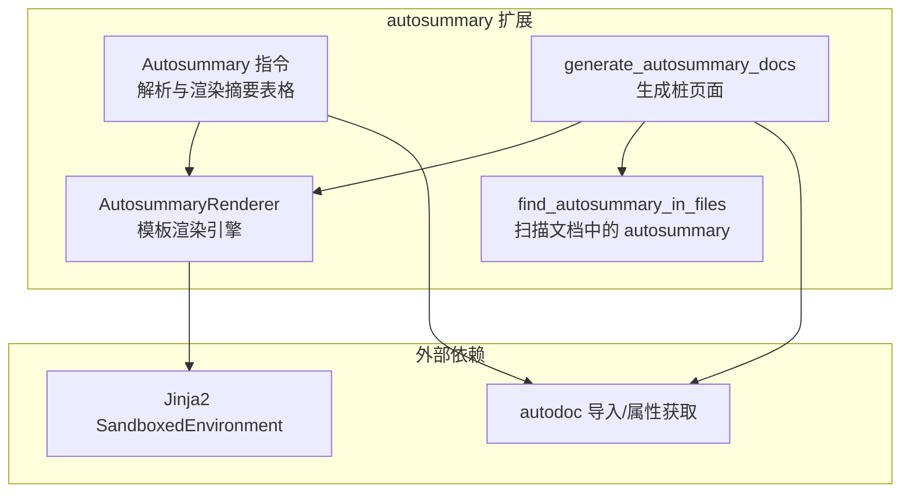
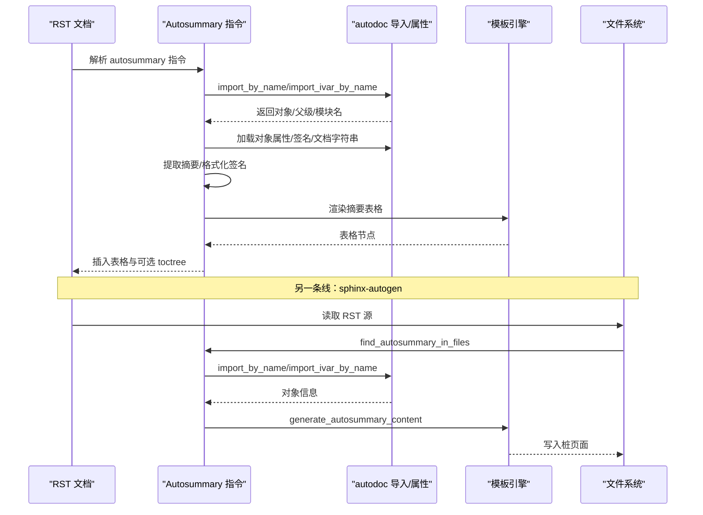
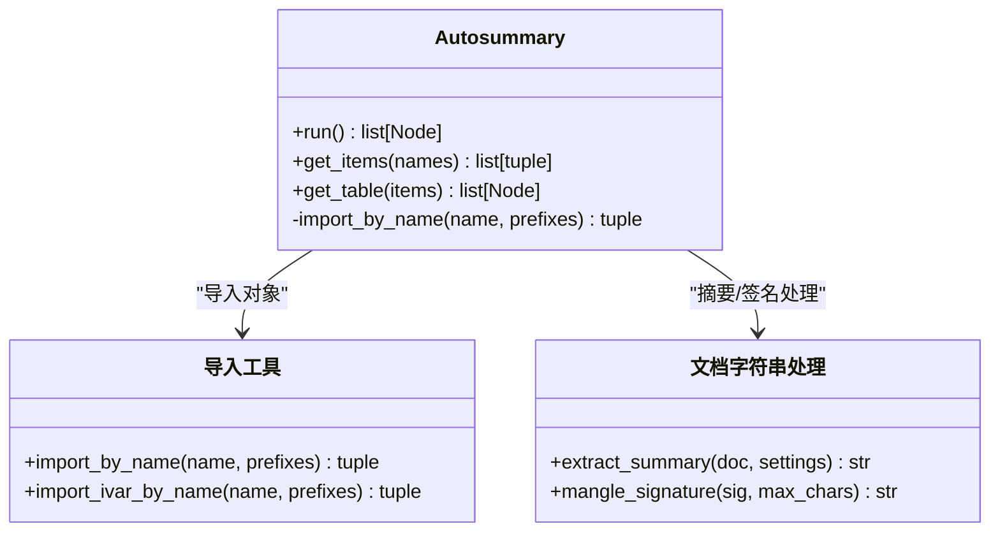
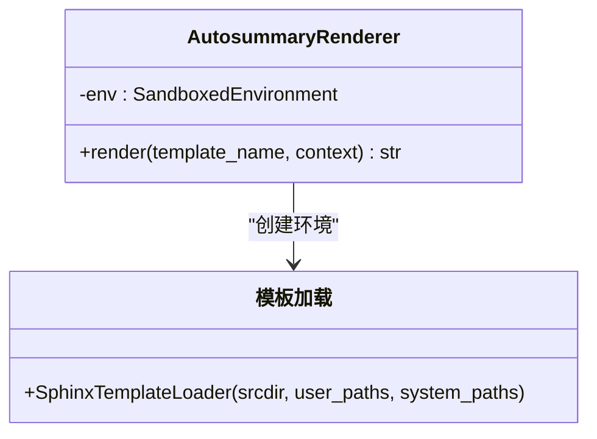
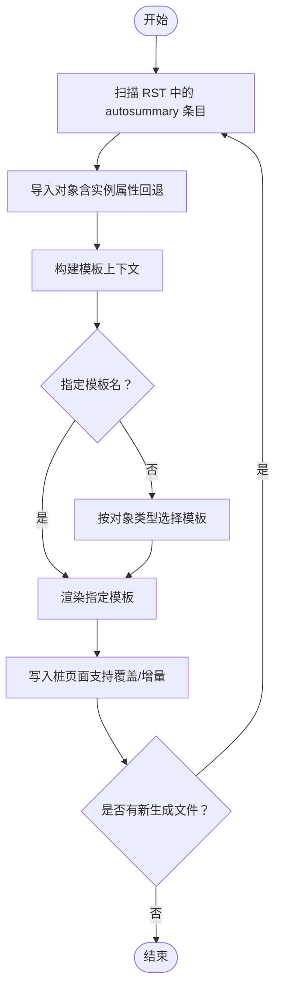
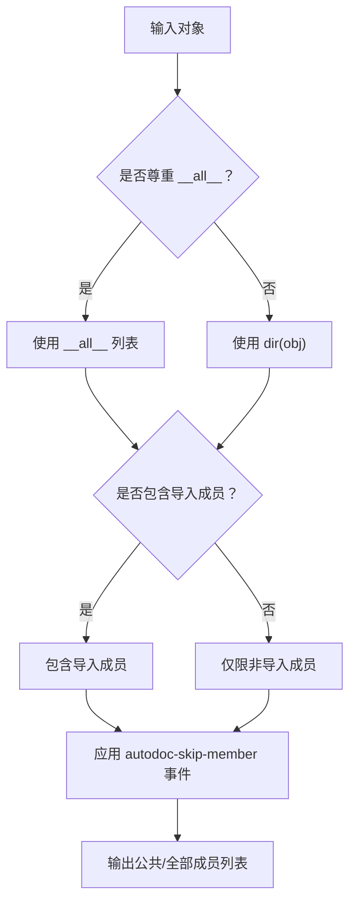
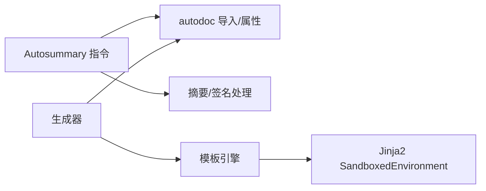

# 自动摘要扩展 (autosummary)

<cite>
**本文引用的文件**
- [autosummary/__init__.py](file://sphinx/ext/autosummary/__init__.py)
- [autosummary/generate.py](file://sphinx/ext/autosummary/generate.py)
- [autosummary 文档（usage/extensions/autosummary.rst）](file://doc/usage/extensions/autosummary.rst)
- [pyproject.toml](file://pyproject.toml)
- [测试：test_ext_autosummary.py](file://tests/test_ext_autosummary/test_ext_autosummary.py)
- [测试：test_ext_autosummary_imports.py](file://tests/test_ext_autosummary/test_ext_autosummary_imports.py)
</cite>

## 目录
1. [简介](#简介)
2. [项目结构](#项目结构)
3. [核心组件](#核心组件)
4. [架构总览](#架构总览)
5. [详细组件分析](#详细组件分析)
6. [依赖分析](#依赖分析)
7. [性能考量](#性能考量)
8. [故障排查指南](#故障排查指南)
9. [结论](#结论)
10. [附录](#附录)

## 简介
本文件面向 Sphinx 自动摘要扩展（autosummary），系统性阐述其模板系统与代码生成机制，覆盖以下主题：
- autosummary 指令如何解析、导入对象并生成摘要表格
- autosummary 生成器（sphinx-autogen）如何扫描文档中的 autosummary 指令并生成“桩页面”（stub pages）
- 内置模板与可定制模板变量、过滤器及 Jinja2 语法应用
- 模块成员自动发现与筛选规则（含 __all__、导入成员、私有成员等）
- 与其他扩展（尤其是 autodoc）的集成方式
- 复杂项目的摘要生成策略与性能优化建议

## 项目结构
autosummary 扩展由两部分组成：
- 指令实现：负责在文档中渲染摘要表格，并可选地生成 toctree
- 生成器：负责扫描文档、导入对象、渲染模板并输出桩页面

图示来源
- [autosummary/__init__.py:192-433](file://sphinx/ext/autosummary/__init__.py#L192-L433)
- [autosummary/generate.py:116-154](file://sphinx/ext/autosummary/generate.py#L116-L154)
- [autosummary/generate.py:610-734](file://sphinx/ext/autosummary/generate.py#L610-L734)

章节来源
- [autosummary/__init__.py:192-433](file://sphinx/ext/autosummary/__init__.py#L192-L433)
- [autosummary/generate.py:116-154](file://sphinx/ext/autosummary/generate.py#L116-L154)
- [autosummary/generate.py:610-734](file://sphinx/ext/autosummary/generate.py#L610-L734)

## 核心组件
- Autosummary 指令类：解析 autosummary 指令内容，导入对象，提取签名与摘要，构造表格节点；支持 toctree 输出。
- AutosummaryRenderer：基于 SandboxedEnvironment 的模板渲染器，注册常用过滤器，按对象类型或显式模板名选择模板。
- generate_autosummary_docs：扫描文档、导入对象、调用模板渲染并写入桩页面，支持递归生成。
- find_autosummary_in_files：从 RST 源码中提取 autosummary 条目（名称、toctree 路径、模板名、是否递归）。

章节来源
- [autosummary/__init__.py:192-433](file://sphinx/ext/autosummary/__init__.py#L192-L433)
- [autosummary/generate.py:116-154](file://sphinx/ext/autosummary/generate.py#L116-L154)
- [autosummary/generate.py:610-734](file://sphinx/ext/autosummary/generate.py#L610-L734)

## 架构总览
autosummary 的工作流分为两条主线：
- 文档内摘要表格生成：Autosummary 指令读取内容，逐项导入对象，提取签名与摘要，渲染为表格节点，并可附加 toctree。
- 桩页面生成：sphinx-autogen 扫描文档中的 autosummary 指令，导入对象，按对象类型选择模板，渲染后写入目标目录。

图示来源
- [autosummary/__init__.py:212-264](file://sphinx/ext/autosummary/__init__.py#L212-L264)
- [autosummary/generate.py:610-734](file://sphinx/ext/autosummary/generate.py#L610-L734)

## 详细组件分析

### 组件一：Autosummary 指令（摘要表格生成）
- 选项与行为
  - 支持 toctree、caption、signatures/nosignatures、template、recursive 等选项。
  - 当存在 toctree 时，会检查生成的文档是否存在，缺失则发出警告；当存在 caption 但无 toctree 时发出警告。
- 导入与属性加载
  - 使用 import_by_name/import_ivar_by_name 导入对象，支持实例属性回退。
  - 基于对象类型选择文档化器，加载签名与文档字符串。
- 摘要与签名处理
  - 摘要提取遵循“第一段落/首句”的规则，并对常见缩写与字面量标记进行处理。
  - 签名压缩采用清理与截断策略，支持 long/short/none 三种显示模式。
- 表格渲染
  - 将列一（名称/签名）与列二（摘要）分别解析为 RST 并嵌入表格行。

图示来源
- [autosummary/__init__.py:192-433](file://sphinx/ext/autosummary/__init__.py#L192-L433)

章节来源
- [autosummary/__init__.py:212-264](file://sphinx/ext/autosummary/__init__.py#L212-L264)
- [autosummary/__init__.py:284-384](file://sphinx/ext/autosummary/__init__.py#L284-L384)
- [autosummary/__init__.py:386-433](file://sphinx/ext/autosummary/__init__.py#L386-L433)
- [autosummary/__init__.py:522-582](file://sphinx/ext/autosummary/__init__.py#L522-L582)
- [autosummary/__init__.py:460-520](file://sphinx/ext/autosummary/__init__.py#L460-L520)

### 组件二：AutosummaryRenderer（模板渲染）
- 模板加载
  - 使用 SphinxTemplateLoader，优先用户 templates_path，其次系统模板路径（位于包内）。
  - 若指定模板名不存在，则尝试“autosummary/<objtype>.rst”，否则回退到 base.rst。
- 过滤器
  - 注册 escape/e（RST 转义）、underline（标题下划线）等过滤器。
  - 启用 i18n 扩展（若存在翻译器）。
- 上下文
  - 传入 autosummary_context 配置字典作为模板上下文，供自定义模板使用。

图示来源
- [autosummary/generate.py:116-154](file://sphinx/ext/autosummary/generate.py#L116-L154)

章节来源
- [autosummary/generate.py:116-154](file://sphinx/ext/autosummary/generate.py#L116-L154)

### 组件三：生成桩页面（sphinx-autogen）
- 扫描与入口
  - find_autosummary_in_files：从 RST 文件中提取 autosummary 条目（名称、toctree、模板、递归）。
  - generate_autosummary_docs：对每个条目导入对象，生成内容并写入文件；支持递归追加新生成的文件。
- 成员发现与筛选
  - ModuleScanner：基于 autodoc 事件与配置，结合 __all__、导入成员、私有成员等规则筛选成员。
  - _get_members/_get_module_attrs：按类型分组收集函数/类/异常/方法/属性/模块等。
- 模板选择与渲染
  - generate_autosummary_content：根据对象类型选择模板名或显式模板，填充上下文并渲染。

图示来源
- [autosummary/generate.py:739-800](file://sphinx/ext/autosummary/generate.py#L739-L800)
- [autosummary/generate.py:610-734](file://sphinx/ext/autosummary/generate.py#L610-L734)
- [autosummary/generate.py:280-413](file://sphinx/ext/autosummary/generate.py#L280-L413)

章节来源
- [autosummary/generate.py:739-800](file://sphinx/ext/autosummary/generate.py#L739-L800)
- [autosummary/generate.py:610-734](file://sphinx/ext/autosummary/generate.py#L610-L734)
- [autosummary/generate.py:280-413](file://sphinx/ext/autosummary/generate.py#L280-L413)

### 组件四：内置模板与模板变量、过滤器
- 内置模板
  - autosummary/base.rst（回退模板）
  - autosummary/module.rst、class.rst、function.rst、attribute.rst、method.rst
- 模板变量
  - name、objname、fullname、objtype、module、class、underline、members、inherited_members、functions、classes、exceptions、methods、attributes、modules 等。
- 模板过滤器
  - escape/e、underline（用于 RST 安全转义与标题下划线）

章节来源
- [autosummary 文档（usage/extensions/autosummary.rst）:299-415](file://doc/usage/extensions/autosummary.rst#L299-L415)

### 组件五：模块成员自动发现与筛选
- 规则概览
  - 是否尊重 __all__：受 autosummary_ignore_module_all 控制。
  - 是否包含导入成员：受 autosummary_imported_members 控制。
  - 私有成员默认不展示，除非显式包含。
  - 通过 autodoc-skip-member 事件可进一步控制跳过。
- 关键实现
  - members_of/dir/dir(__all__) 与 getall 的配合。
  - _get_members/_get_module_attrs/_get_modules 的分类型收集。
  - ModuleScanner 的事件驱动筛选。

图示来源
- [autosummary/generate.py:265-278](file://sphinx/ext/autosummary/generate.py#L265-L278)
- [autosummary/generate.py:204-220](file://sphinx/ext/autosummary/generate.py#L204-L220)
- [autosummary/generate.py:528-560](file://sphinx/ext/autosummary/generate.py#L528-L560)

章节来源
- [autosummary/generate.py:265-278](file://sphinx/ext/autosummary/generate.py#L265-L278)
- [autosummary/generate.py:204-220](file://sphinx/ext/autosummary/generate.py#L204-L220)
- [autosummary/generate.py:528-560](file://sphinx/ext/autosummary/generate.py#L528-L560)

### 组件六：与其他扩展的集成
- 与 autodoc 的关系
  - autosummary 在摘要提取与签名处理上复用 autodoc 的钩子（autodoc-process-docstring、autodoc-process-signature）。
  - 导入与属性获取复用 autodoc 的导入器与成员发现工具。
- 与 autosectionlabel 的关系
  - autosummary 的 toctree 生成与默认角色（autolink）可与 autosectionlabel 协同使用，提升交叉引用体验。
- 与 apidoc 的关系
  - apidoc 与 autosummary 分别负责“索引生成”和“桩页面生成”，可配合使用。

章节来源
- [autosummary 文档（usage/extensions/autosummary.rst）:63-66](file://doc/usage/extensions/autosummary.rst#L63-L66)
- [autosummary 文档（usage/extensions/autosummary.rst）:416-439](file://doc/usage/extensions/autosummary.rst#L416-L439)

## 依赖分析
- 模块间耦合
  - Autosummary 指令依赖 autodoc 的导入与属性获取能力，以及文档字符串解析工具。
  - 生成器依赖模板引擎与 autodoc 的成员发现与事件系统。
- 外部依赖
  - Jinja2（SandboxedEnvironment）用于安全渲染。
  - SphinxTemplateLoader 提供模板路径解析与 i18n 支持。
- 可能的循环依赖
  - 导入流程中对当前模块前缀的检测与告警，避免在摘要中包含自身模块导致的循环引用问题。

图示来源
- [autosummary/__init__.py:613-765](file://sphinx/ext/autosummary/__init__.py#L613-L765)
- [autosummary/generate.py:116-154](file://sphinx/ext/autosummary/generate.py#L116-L154)

章节来源
- [autosummary/__init__.py:613-765](file://sphinx/ext/autosummary/__init__.py#L613-L765)
- [autosummary/generate.py:116-154](file://sphinx/ext/autosummary/generate.py#L116-L154)

## 性能考量
- 模板渲染
  - 使用 SandboxedEnvironment 保证安全性，但会带来一定开销；尽量减少模板复杂度与不必要的过滤器调用。
- 导入与分析
  - 大型项目中，频繁导入第三方库会显著增加时间；可通过 autosummary_mock_imports 预先模拟难以导入的模块。
- 生成范围
  - 合理设置 autosummary_generate 与生成目录，避免对无关文件进行扫描与渲染。
- 递归生成
  - 递归扫描包层级时，注意模块数量与导入成本；必要时限制扫描深度或仅对关键模块启用递归。
- 缓存与增量
  - 生成器支持覆盖/增量写入，合理利用 autosummary_generate_overwrite 与已存在文件比较，减少重复写入。

## 故障排查指南
- 常见问题与定位
  - “无法导入对象”：检查对象名称、模块路径与导入前缀；确认 autosummary_mock_imports 设置。
  - “缺少桩文件”：确认 autosummary_generate 或 toctree 选项是否正确设置；检查生成目录权限与命名冲突。
  - “摘要为空”：确认对象文档字符串存在且符合预期；检查 autodoc-process-docstring 钩子是否被修改。
  - “循环导入告警”：避免在 autosummary 中列出当前模块本身，移除冗余前缀。
- 日志与警告
  - 生成器与指令均会记录详细警告信息，包括导入失败原因与缺失文件提示，便于快速定位问题。

章节来源
- [autosummary 文档（usage/extensions/autosummary.rst）:188-281](file://doc/usage/extensions/autosummary.rst#L188-L281)
- [autosummary/__init__.py:221-264](file://sphinx/ext/autosummary/__init__.py#L221-L264)
- [autosummary/generate.py:664-700](file://sphinx/ext/autosummary/generate.py#L664-L700)

## 结论
autosummary 通过“指令渲染 + 生成器”的双轨机制，实现了从文档内摘要表格到桩页面的完整自动化。其模板系统灵活、可扩展性强，结合 autodoc 的导入与属性发现能力，能够高效支撑大型项目的 API 文档生成。实践中应重视导入模拟、成员筛选与模板优化，以获得稳定、高效的生成体验。

## 附录

### 自定义模板开发指南与最佳实践
- 模板位置与加载
  - 将自定义模板放置于 templates_path 下的 autosummary 子目录，命名规范与内置模板一致。
  - 通过 autosummary_context 注入额外上下文变量，满足复杂页面需求。
- 模板变量与过滤器
  - 使用 name/fullname/objtype 等变量控制页面结构；使用 escape/e 与 underline 过滤器确保 RST 安全与标题美观。
- 模板选择策略
  - 优先按对象类型选择模板（如 module/class/function/method/attribute），必要时通过 :template: 显式指定。
- 最佳实践
  - 保持模板简洁，避免过度复杂逻辑；将复杂处理下沉至 Python 侧（如自定义过滤器或钩子）。
  - 对第三方库使用 autosummary_mock_imports，减少导入失败带来的渲染中断。

章节来源
- [autosummary 文档（usage/extensions/autosummary.rst）:282-415](file://doc/usage/extensions/autosummary.rst#L282-L415)
- [autosummary/generate.py:116-154](file://sphinx/ext/autosummary/generate.py#L116-L154)

### 与其他扩展的集成要点
- 与 autodoc
  - 共享导入与属性获取逻辑，复用文档字符串处理钩子，确保摘要一致性。
- 与 autosectionlabel
  - 利用 toctree 与默认角色增强交叉引用与导航体验。
- 与 apidoc
  - apidoc 生成索引，autosummary 生成桩页面，二者配合可覆盖“索引—详情页”的完整文档链路。

章节来源
- [autosummary 文档（usage/extensions/autosummary.rst）:416-439](file://doc/usage/extensions/autosummary.rst#L416-L439)

### 复杂项目的摘要生成策略与性能优化建议
- 策略
  - 分层扫描：先主模块，再子包；对第三方包使用 mock。
  - 限定生成范围：仅对关键模块启用递归；关闭不必要的 toctree。
  - 增量生成：保留旧文件，仅更新变更内容。
- 性能
  - 减少模板复杂度；合并相似模板；使用 autosummary_context 避免重复计算。
  - 合理设置 autosummary_imported_members 与 autosummary_ignore_module_all，缩小成员集合。

章节来源
- [autosummary/generate.py:610-734](file://sphinx/ext/autosummary/generate.py#L610-L734)
- [autosummary 文档（usage/extensions/autosummary.rst）:188-281](file://doc/usage/extensions/autosummary.rst#L188-L281)