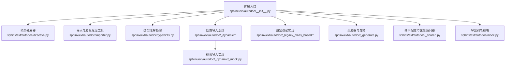
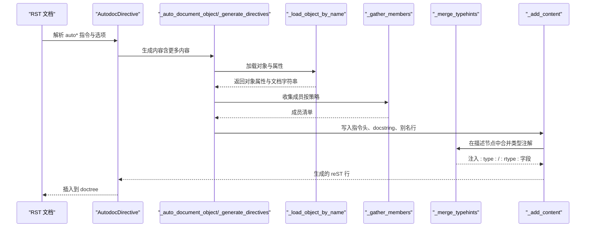
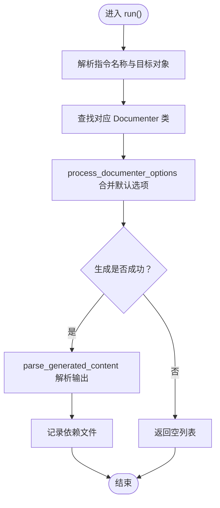
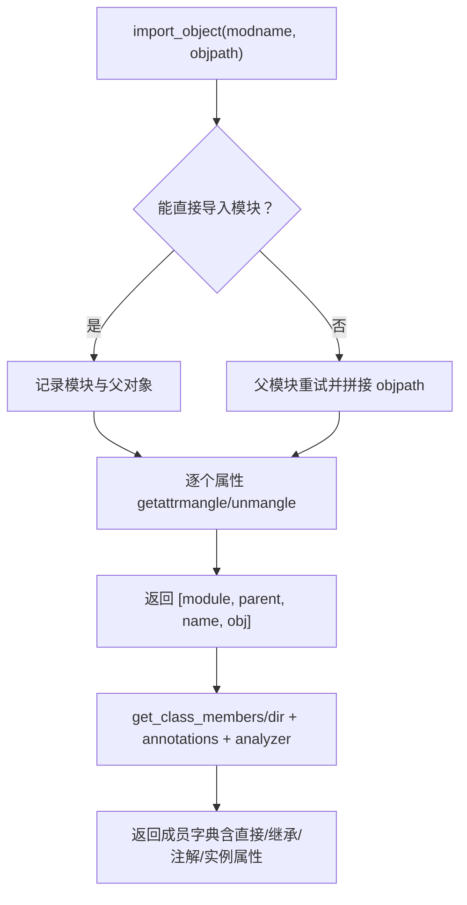
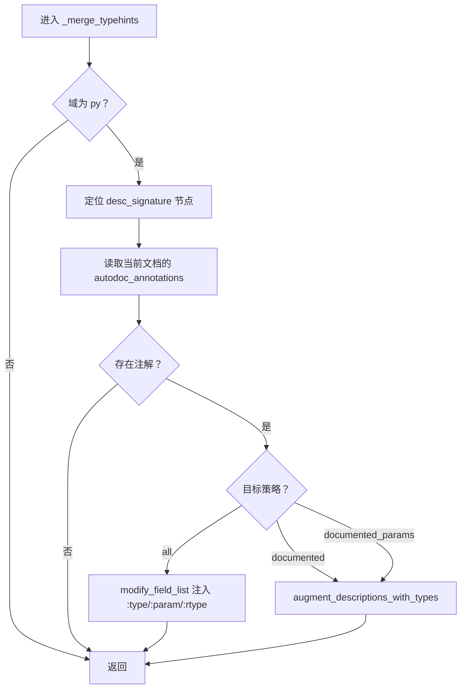
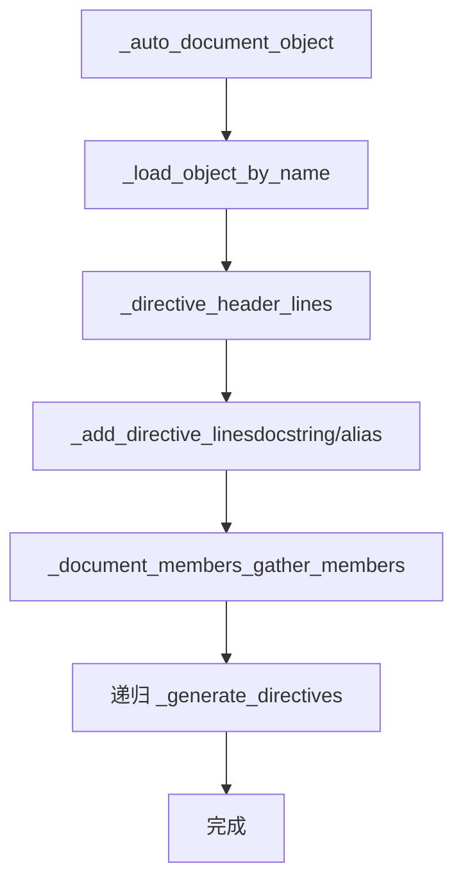
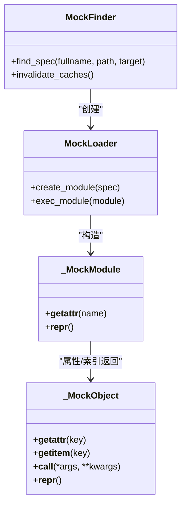
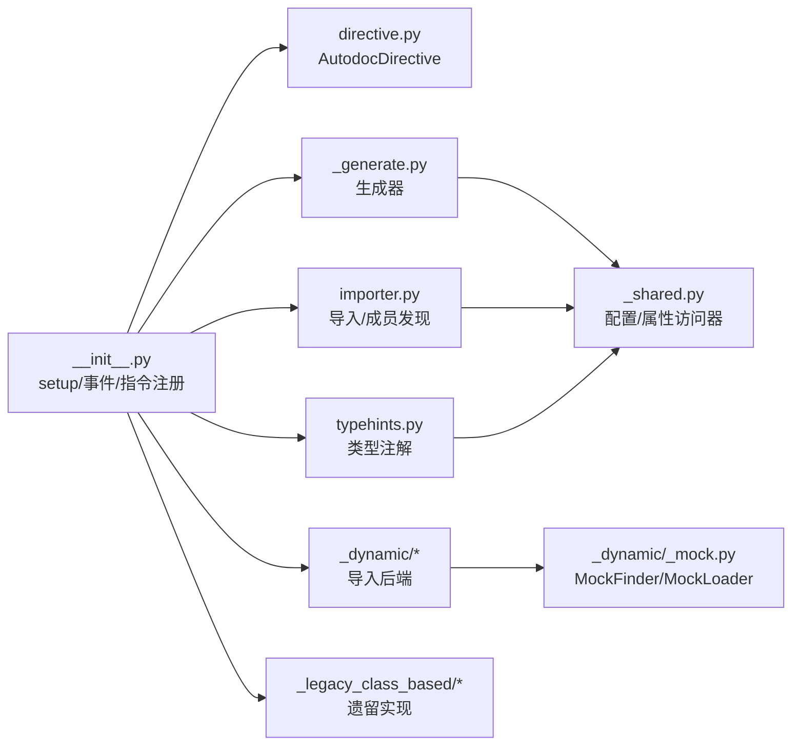

# 自动文档扩展 (autodoc)

<cite>
**本文引用的文件**
- [sphinx/ext/autodoc/__init__.py](file://sphinx/ext/autodoc/__init__.py)
- [sphinx/ext/autodoc/directive.py](file://sphinx/ext/autodoc/directive.py)
- [sphinx/ext/autodoc/importer.py](file://sphinx/ext/autodoc/importer.py)
- [sphinx/ext/autodoc/mock.py](file://sphinx/ext/autodoc/mock.py)
- [sphinx/ext/autodoc/typehints.py](file://sphinx/ext/autodoc/typehints.py)
- [sphinx/ext/autodoc/_generate.py](file://sphinx/ext/autodoc/_generate.py)
- [sphinx/ext/autodoc/_shared.py](file://sphinx/ext/autodoc/_shared.py)
- [sphinx/ext/autodoc/_dynamic/_mock.py](file://sphinx/ext/autodoc/_dynamic/_mock.py)
- [sphinx/ext/autodoc/_legacy_class_based/__init__.py](file://sphinx/ext/autodoc/_legacy_class_based/__init__.py)
- [sphinx/ext/autodoc/_dynamic/__init__.py](file://sphinx/ext/autodoc/_dynamic/__init__.py)
- [doc/usage/extensions/autodoc.rst](file://doc/usage/extensions/autodoc.rst)
- [doc/usage/configuration.rst](file://doc/usage/configuration.rst)
- [tests/test_ext_autodoc/test_ext_autodoc.py](file://tests/test_ext_autodoc/test_ext_autodoc.py)
- [tests/test_ext_autodoc/test_ext_autodoc_configs.py](file://tests/test_ext_autodoc/test_ext_autodoc_configs.py)
- [tests/test_ext_autodoc/test_ext_autodoc_typehints.py](file://tests/test_ext_autodoc/test_ext_autodoc_typehints.py)
- [tests/test_ext_autodoc/test_ext_autodoc_mock.py](file://tests/test_ext_autodoc/test_ext_autodoc_mock.py)
</cite>

## 目录
1. [简介](#简介)
2. [项目结构](#项目结构)
3. [核心组件](#核心组件)
4. [架构总览](#架构总览)
5. [详细组件分析](#详细组件分析)
6. [依赖分析](#依赖分析)
7. [性能考虑](#性能考虑)
8. [故障排除指南](#故障排除指南)
9. [结论](#结论)
10. [附录](#附录)

## 简介
本文件系统性阐述 Sphinx 自动文档扩展（autodoc）的工作原理与使用方法，覆盖从 Python 源码自动抽取文档信息、对象导入与成员发现、文档字符串解析、类型注解与签名生成、以及模拟导入（mock）机制在文档构建中的作用。同时给出配置项详解、性能优化建议、实际使用示例与常见问题排查路径。

## 项目结构
autodoc 扩展由“动态导入后端”和“遗留类式实现”两条实现路径组成，并通过统一入口注册指令与事件，形成可插拔的文档生成流水线。

图表来源
- [sphinx/ext/autodoc/__init__.py:140-254](file://sphinx/ext/autodoc/__init__.py#L140-L254)
- [sphinx/ext/autodoc/directive.py:124-179](file://sphinx/ext/autodoc/directive.py#L124-L179)
- [sphinx/ext/autodoc/importer.py:48-324](file://sphinx/ext/autodoc/importer.py#L48-L324)
- [sphinx/ext/autodoc/typehints.py:25-216](file://sphinx/ext/autodoc/typehints.py#L25-L216)
- [sphinx/ext/autodoc/_generate.py:31-407](file://sphinx/ext/autodoc/_generate.py#L31-L407)
- [sphinx/ext/autodoc/_shared.py:24-163](file://sphinx/ext/autodoc/_shared.py#L24-L163)
- [sphinx/ext/autodoc/_dynamic/_mock.py:23-221](file://sphinx/ext/autodoc/_dynamic/_mock.py#L23-L221)
- [sphinx/ext/autodoc/mock.py:1-14](file://sphinx/ext/autodoc/mock.py#L1-L14)

章节来源
- [sphinx/ext/autodoc/__init__.py:140-254](file://sphinx/ext/autodoc/__init__.py#L140-L254)
- [sphinx/ext/autodoc/directive.py:124-179](file://sphinx/ext/autodoc/directive.py#L124-L179)
- [sphinx/ext/autodoc/importer.py:48-324](file://sphinx/ext/autodoc/importer.py#L48-L324)
- [sphinx/ext/autodoc/typehints.py:25-216](file://sphinx/ext/autodoc/typehints.py#L25-L216)
- [sphinx/ext/autodoc/_generate.py:31-407](file://sphinx/ext/autodoc/_generate.py#L31-L407)
- [sphinx/ext/autodoc/_shared.py:24-163](file://sphinx/ext/autodoc/_shared.py#L24-L163)
- [sphinx/ext/autodoc/_dynamic/_mock.py:23-221](file://sphinx/ext/autodoc/_dynamic/_mock.py#L23-L221)
- [sphinx/ext/autodoc/mock.py:1-14](file://sphinx/ext/autodoc/mock.py#L1-L14)

## 核心组件
- 扩展入口与事件注册：负责添加配置项、事件与指令注册；根据配置选择“动态后端”或“遗留类式实现”。
- 指令分发器：将 RST 中的 auto* 指令转换为具体 Documenter 并生成内容。
- 导入与成员发现：安全导入模块/对象、解析成员、处理枚举、slots、注解与实例属性。
- 类型注解与签名：记录类型注解、在描述节点中插入类型字段、支持短名/全限定名格式。
- 动态导入后端：提供对象加载、成员收集、依赖记录与渲染管线。
- 共享配置与属性访问器：封装配置读取、不可变配置对象与自定义 getattr 路由。
- 模拟导入：拦截导入链路，用 Mock 对象/模块替换缺失依赖，避免构建失败。

章节来源
- [sphinx/ext/autodoc/__init__.py:140-254](file://sphinx/ext/autodoc/__init__.py#L140-L254)
- [sphinx/ext/autodoc/directive.py:124-179](file://sphinx/ext/autodoc/directive.py#L124-L179)
- [sphinx/ext/autodoc/importer.py:48-324](file://sphinx/ext/autodoc/importer.py#L48-L324)
- [sphinx/ext/autodoc/typehints.py:25-216](file://sphinx/ext/autodoc/typehints.py#L25-L216)
- [sphinx/ext/autodoc/_generate.py:31-407](file://sphinx/ext/autodoc/_generate.py#L31-L407)
- [sphinx/ext/autodoc/_shared.py:24-163](file://sphinx/ext/autodoc/_shared.py#L24-L163)
- [sphinx/ext/autodoc/_dynamic/_mock.py:23-221](file://sphinx/ext/autodoc/_dynamic/_mock.py#L23-L221)

## 架构总览
下图展示从 RST 指令到最终渲染的关键流程：指令解析 → 选项处理 → 文档对象加载 → 成员收集 → 文档字符串与类型注解注入 → 渲染输出。

图表来源
- [sphinx/ext/autodoc/directive.py:137-179](file://sphinx/ext/autodoc/directive.py#L137-L179)
- [sphinx/ext/autodoc/_generate.py:31-195](file://sphinx/ext/autodoc/_generate.py#L31-L195)
- [sphinx/ext/autodoc/typehints.py:45-86](file://sphinx/ext/autodoc/typehints.py#L45-L86)

## 详细组件分析

### 组件一：指令与选项处理（AutodocDirective）
- 职责：解析 auto* 指令、组装 Documenter 参数、调用 Documenter.generate、解析生成内容并返回节点。
- 关键点：选项规范兼容、默认选项合并、错误日志与回退。

图表来源
- [sphinx/ext/autodoc/directive.py:137-179](file://sphinx/ext/autodoc/directive.py#L137-L179)
- [sphinx/ext/autodoc/directive.py:87-111](file://sphinx/ext/autodoc/directive.py#L87-L111)

章节来源
- [sphinx/ext/autodoc/directive.py:124-179](file://sphinx/ext/autodoc/directive.py#L124-L179)
- [sphinx/ext/autodoc/directive.py:87-111](file://sphinx/ext/autodoc/directive.py#L87-L111)

### 组件二：导入与成员发现（importer）
- 职责：安全导入模块/对象、逐层 getattr、处理枚举、slots、注解与实例属性；支持分析器补充实例属性。
- 关键点：异常恢复与详细错误消息、mangle/unmangle 名称映射、继承 docstring 控制。

图表来源
- [sphinx/ext/autodoc/importer.py:48-130](file://sphinx/ext/autodoc/importer.py#L48-L130)
- [sphinx/ext/autodoc/importer.py:140-324](file://sphinx/ext/autodoc/importer.py#L140-L324)

章节来源
- [sphinx/ext/autodoc/importer.py:48-130](file://sphinx/ext/autodoc/importer.py#L48-L130)
- [sphinx/ext/autodoc/importer.py:140-324](file://sphinx/ext/autodoc/importer.py#L140-L324)

### 组件三：类型注解与签名（typehints）
- 职责：记录类型注解、在描述节点中插入 :type:/ :rtype: 字段；支持“仅描述”“全部”“仅已描述参数”等目标策略。
- 关键点：与渲染模式（短名/全限定名）配合；对返回值类型抑制策略。

图表来源
- [sphinx/ext/autodoc/typehints.py:45-86](file://sphinx/ext/autodoc/typehints.py#L45-L86)
- [sphinx/ext/autodoc/typehints.py:101-160](file://sphinx/ext/autodoc/typehints.py#L101-L160)
- [sphinx/ext/autodoc/typehints.py:162-216](file://sphinx/ext/autodoc/typehints.py#L162-L216)

章节来源
- [sphinx/ext/autodoc/typehints.py:25-216](file://sphinx/ext/autodoc/typehints.py#L25-L216)

### 组件四：动态生成与渲染（_generate）
- 职责：加载对象、生成指令头、写入 docstring 与别名行、递归生成成员、记录依赖。
- 关键点：模块源文件依赖、final 标记、检查模块归属（避免误引进行为）。

图表来源
- [sphinx/ext/autodoc/_generate.py:31-74](file://sphinx/ext/autodoc/_generate.py#L31-L74)
- [sphinx/ext/autodoc/_generate.py:197-244](file://sphinx/ext/autodoc/_generate.py#L197-L244)
- [sphinx/ext/autodoc/_generate.py:246-320](file://sphinx/ext/autodoc/_generate.py#L246-L320)

章节来源
- [sphinx/ext/autodoc/_generate.py:31-407](file://sphinx/ext/autodoc/_generate.py#L31-L407)

### 组件五：共享配置与属性访问器（_shared）
- 职责：不可变配置容器、渲染模式推导、自定义 getattr 路由。
- 关键点：所有配置项一次性注入，禁止运行时修改；attrgetter 可扩展以适配特殊类型。

章节来源
- [sphinx/ext/autodoc/_shared.py:24-163](file://sphinx/ext/autodoc/_shared.py#L24-L163)

### 组件六：模拟导入（_dynamic/_mock）
- 职责：拦截导入链路，用 MockModule/MockObject 替换缺失模块/对象；支持子类化与装饰器参数保留。
- 关键点：MetaPathFinder + Loader；上下文管理器启用/禁用；检测 ismock/ismockmodule。

图表来源
- [sphinx/ext/autodoc/_dynamic/_mock.py:23-113](file://sphinx/ext/autodoc/_dynamic/_mock.py#L23-L113)
- [sphinx/ext/autodoc/_dynamic/_mock.py:131-174](file://sphinx/ext/autodoc/_dynamic/_mock.py#L131-L174)

章节来源
- [sphinx/ext/autodoc/_dynamic/_mock.py:23-221](file://sphinx/ext/autodoc/_dynamic/_mock.py#L23-L221)
- [sphinx/ext/autodoc/mock.py:1-14](file://sphinx/ext/autodoc/mock.py#L1-L14)

## 依赖分析
- 扩展入口与事件：注册配置项、事件与指令；连接类型注解合并钩子。
- 指令与生成器：通过 DocumenterBridge 传递环境、报告器、选项与依赖集合。
- 导入与成员发现：依赖动态导入器、成员查找器、注解与实例属性分析器。
- 类型注解：依赖渲染模式与类型别名配置，在对象描述变换阶段注入字段。
- 模拟导入：通过 sys.meta_path 插桩，影响后续 import_object 流程。

图表来源
- [sphinx/ext/autodoc/__init__.py:140-254](file://sphinx/ext/autodoc/__init__.py#L140-L254)
- [sphinx/ext/autodoc/directive.py:124-179](file://sphinx/ext/autodoc/directive.py#L124-L179)
- [sphinx/ext/autodoc/_generate.py:31-195](file://sphinx/ext/autodoc/_generate.py#L31-L195)
- [sphinx/ext/autodoc/importer.py:48-324](file://sphinx/ext/autodoc/importer.py#L48-L324)
- [sphinx/ext/autodoc/typehints.py:25-216](file://sphinx/ext/autodoc/typehints.py#L25-L216)
- [sphinx/ext/autodoc/_dynamic/_mock.py:131-174](file://sphinx/ext/autodoc/_dynamic/_mock.py#L131-L174)

章节来源
- [sphinx/ext/autodoc/__init__.py:140-254](file://sphinx/ext/autodoc/__init__.py#L140-L254)
- [sphinx/ext/autodoc/_generate.py:31-195](file://sphinx/ext/autodoc/_generate.py#L31-L195)
- [sphinx/ext/autodoc/importer.py:48-324](file://sphinx/ext/autodoc/importer.py#L48-L324)
- [sphinx/ext/autodoc/typehints.py:25-216](file://sphinx/ext/autodoc/typehints.py#L25-L216)
- [sphinx/ext/autodoc/_dynamic/_mock.py:131-174](file://sphinx/ext/autodoc/_dynamic/_mock.py#L131-L174)

## 性能考虑
- 避免不必要的导入：仅在需要时解析模块源文件；利用依赖记录减少无效重读。
- 限制成员扫描范围：合理使用 members/exclude-members/inherited-members/private-members/special-members 等选项。
- 启用并行构建：扩展声明 parallel_read_safe=True，提升多线程构建效率。
- 减少类型注解解析开销：在 autodoc_typehints 设置为 'none' 或 'signature' 时，避免描述区注入。
- 使用 autodoc_mock_imports：对大型第三方库使用模拟导入，避免真实导入带来的 IO 与初始化成本。

## 故障排除指南
- 导入失败与异常传播
  - 现象：构建时报错“failed to import”，并附带真实异常堆栈。
  - 处理：确认 sys.path 正确；必要时使用 autodoc_mock_imports 模拟缺失模块。
- 模块级 __all__ 与导入成员
  - 现象：automodule 未列出某些成员。
  - 处理：若模块定义了 __all__，可使用 ignore-module-all；或开启 imported-members 控制只文档化本模块定义的成员。
- 继承 docstring 与成员可见性
  - 现象：基类成员未显示或被过滤。
  - 处理：使用 inherited-members 控制继承层级；结合 undoc-members 查看全部成员。
- 类型注解未注入
  - 现象：函数/方法签名缺少类型信息。
  - 处理：检查 autodoc_typehints 设置；确保启用 autodoc_use_type_comments 或类型注释可用。
- 模拟导入未生效
  - 现象：仍出现 ImportError。
  - 处理：确认 autodoc_mock_imports 列表包含完整模块前缀；在测试中验证 mock 上下文正确启用。

章节来源
- [sphinx/ext/autodoc/importer.py:95-129](file://sphinx/ext/autodoc/importer.py#L95-L129)
- [doc/usage/extensions/autodoc.rst:63-100](file://doc/usage/extensions/autodoc.rst#L63-L100)
- [tests/test_ext_autodoc/test_ext_autodoc_configs.py:636-708](file://tests/test_ext_autodoc/test_ext_autodoc_configs.py#L636-L708)
- [tests/test_ext_autodoc/test_ext_autodoc_mock.py:21-48](file://tests/test_ext_autodoc/test_ext_autodoc_mock.py#L21-L48)

## 结论
autodoc 通过“动态导入后端 + 统一指令接口”的设计，实现了对 Python 代码的自动化文档抽取。其核心优势在于：
- 强大的成员发现与文档字符串解析能力；
- 灵活的类型注解与签名生成；
- 完善的模拟导入机制保障构建稳定性；
- 可配置的选项体系满足不同项目需求。

建议在大型项目中结合缓存、并行构建与合理的成员筛选策略，以获得最佳性能与可维护性。

## 附录

### 常用 autodoc 指令与选项速查
- automodule：文档化模块及其成员，常用选项 members、exclude-members、imported-members、undoc-members、private-members、special-members、inherited-members、member-order、show-inheritance、no-index/no-index-entry。
- autoclass/autoexception：文档化类/异常及其成员，常用选项 members、exclude-members、inherited-members、undoc-members、private-members、special-members、member-order、show-inheritance、class-doc-from。
- autofunction/automethod/autoclass/autodata/autoproperty：分别用于函数、方法、类、数据、属性的自动文档化。

章节来源
- [doc/usage/extensions/autodoc.rst:283-800](file://doc/usage/extensions/autodoc.rst#L283-L800)

### 配置项详解（节选）
- autoclass_content：控制类主体内容来源（class/both/init）。
- autodoc_member_order：成员排序方式（alphabetical/bysource/groupwise）。
- autodoc_class_signature：类签名显示方式（mixed/separated）。
- autodoc_default_options：全局默认指令选项字典。
- autodoc_docstring_signature：是否使用 docstring 中的签名。
- autodoc_mock_imports：模拟导入的模块名列表。
- autodoc_typehints：类型注解注入策略（signature/description/none/both）。
- autodoc_typehints_description_target：类型注解注入目标（all/documented/documented_params）。
- autodoc_type_aliases：类型别名映射。
- autodoc_typehints_format：类型显示格式（short/fully-qualified）。
- autodoc_inherit_docstrings：是否继承父类 docstring。
- autodoc_preserve_defaults：是否保留默认值。
- autodoc_use_type_comments：是否使用类型注释。
- autodoc_use_legacy_class_based：是否使用遗留类式实现。

章节来源
- [sphinx/ext/autodoc/__init__.py:140-197](file://sphinx/ext/autodoc/__init__.py#L140-L197)
- [doc/usage/configuration.rst:199-200](file://doc/usage/configuration.rst#L199-L200)

### 实际使用示例（路径参考）
- 自动文档化模块与成员：[doc/usage/extensions/autodoc.rst:283-525](file://doc/usage/extensions/autodoc.rst#L283-L525)
- 自动文档化类与成员：[doc/usage/extensions/autodoc.rst:526-800](file://doc/usage/extensions/autodoc.rst#L526-L800)
- 类型注解注入示例（描述区）：[tests/test_ext_autodoc/test_ext_autodoc_typehints.py:324-365](file://tests/test_ext_autodoc/test_ext_autodoc_typehints.py#L324-L365)
- 模拟导入示例（测试）：[tests/test_ext_autodoc/test_ext_autodoc_configs.py:636-708](file://tests/test_ext_autodoc/test_ext_autodoc_configs.py#L636-L708)