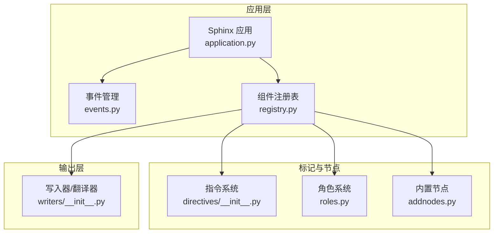
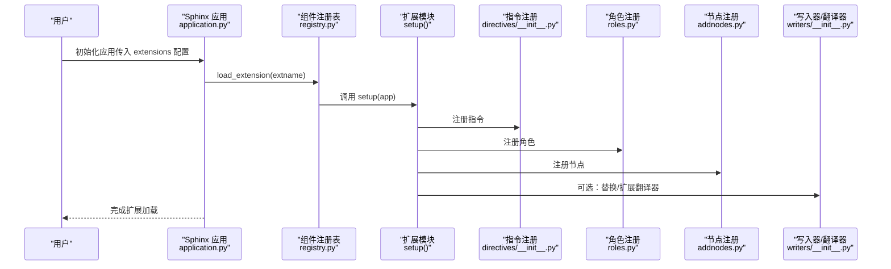
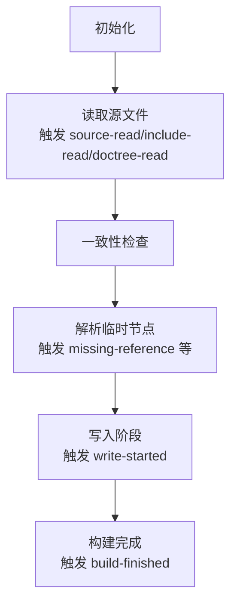
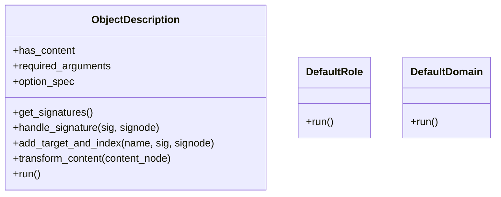
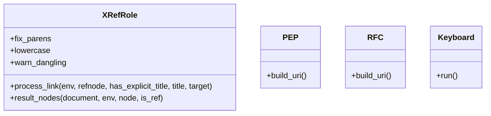
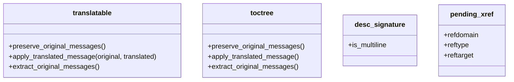
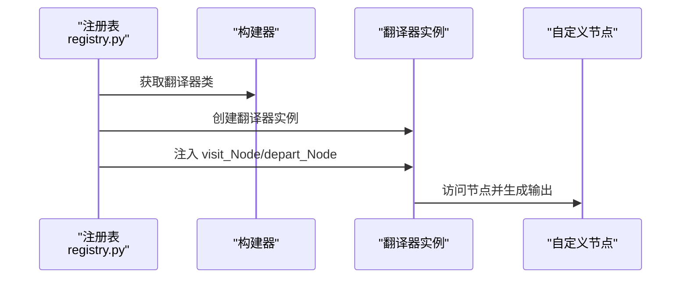
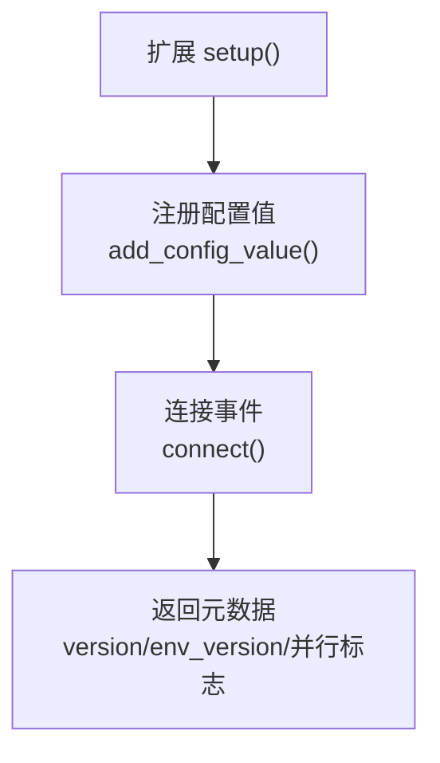
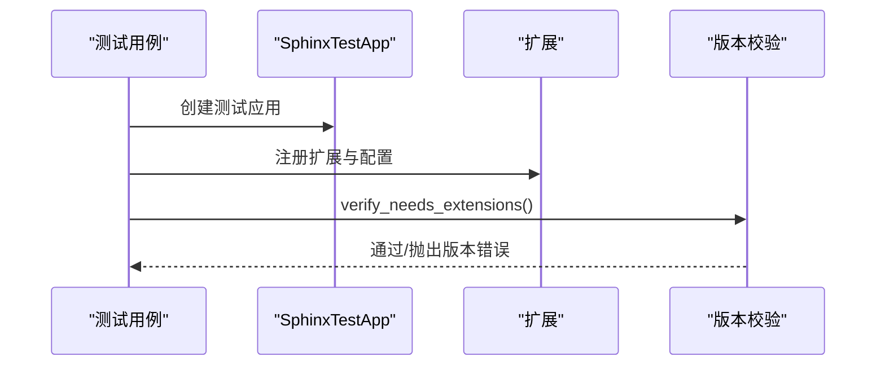
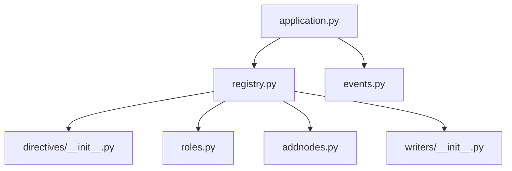

# 自定义扩展开发

<cite>
**本文引用的文件**
- [application.py](file://sphinx/application.py)
- [events.py](file://sphinx/events.py)
- [directives/__init__.py](file://sphinx/directives/__init__.py)
- [roles.py](file://sphinx/roles.py)
- [addnodes.py](file://sphinx/addnodes.py)
- [registry.py](file://sphinx/registry.py)
- [writers/__init__.py](file://sphinx/writers/__init__.py)
- [extdev/index.rst](file://doc/extdev/index.rst)
- [extdev/testing.rst](file://doc/extdev/testing.rst)
- [pyproject.toml](file://pyproject.toml)
- [test_extensions/test_extension.py](file://tests/test_extensions/test_extension.py)
- [ext/autosectionlabel.py](file://sphinx/ext/autosectionlabel.py)
</cite>

## 目录
1. [简介](#简介)
2. [项目结构](#项目结构)
3. [核心组件](#核心组件)
4. [架构总览](#架构总览)
5. [详细组件分析](#详细组件分析)
6. [依赖分析](#依赖分析)
7. [性能考虑](#性能考虑)
8. [故障排查指南](#故障排查指南)
9. [结论](#结论)
10. [附录](#附录)

## 简介
本指南面向希望开发自定义 Sphinx 扩展的工程师与技术文档作者。内容覆盖从项目结构、扩展生命周期与事件处理、指令与角色注册、节点系统与自定义节点、翻译器与自定义输出格式、扩展配置设计与实现、测试策略与调试技巧，到打包、分发与版本管理的最佳实践。文档以 Sphinx 源码与官方开发文档为依据，结合实际示例文件，帮助读者快速构建高质量的可复用扩展。

## 项目结构
Sphinx 将扩展能力通过应用对象、组件注册表、事件系统、指令与角色、节点系统以及写入器（翻译器）等模块协同实现。下图展示了与扩展开发相关的核心模块及其职责：

图表来源
- [application.py:148-347](file://sphinx/application.py#L148-L347)
- [events.py:72-100](file://sphinx/events.py#L72-L100)
- [registry.py:72-155](file://sphinx/registry.py#L72-L155)
- [directives/__init__.py:369-385](file://sphinx/directives/__init__.py#L369-L385)
- [roles.py:630-650](file://sphinx/roles.py#L630-L650)
- [addnodes.py:575-625](file://sphinx/addnodes.py#L575-L625)
- [writers/__init__.py:1-2](file://sphinx/writers/__init__.py#L1-L2)

章节来源
- [application.py:148-347](file://sphinx/application.py#L148-L347)
- [registry.py:72-155](file://sphinx/registry.py#L72-L155)

## 核心组件
- 应用对象（Sphinx）：负责初始化、加载扩展、创建构建器、触发事件、协调构建流程。
- 事件管理（EventManager）：提供事件注册、回调调度、异常传播与优先级控制。
- 组件注册表（SphinxComponentRegistry）：集中管理构建器、域、指令、角色、变换、翻译器等组件，并支持动态加载扩展。
- 指令与角色：扩展 reStructuredText 语法，提供新的标记语义与渲染行为。
- 节点系统：在 doctree 中表达结构化信息，支持自定义节点与翻译器处理。
- 写入器/翻译器：将 doctree 转换为目标输出格式（HTML/LaTeX/XML 等）。

章节来源
- [application.py:497-528](file://sphinx/application.py#L497-L528)
- [events.py:44-100](file://sphinx/events.py#L44-L100)
- [registry.py:531-595](file://sphinx/registry.py#L531-L595)
- [directives/__init__.py:369-385](file://sphinx/directives/__init__.py#L369-L385)
- [roles.py:630-650](file://sphinx/roles.py#L630-L650)
- [addnodes.py:575-625](file://sphinx/addnodes.py#L575-L625)

## 架构总览
下图展示了扩展加载与构建阶段的关键交互：

图表来源
- [application.py:292-325](file://sphinx/application.py#L292-L325)
- [registry.py:531-595](file://sphinx/registry.py#L531-L595)
- [directives/__init__.py:369-385](file://sphinx/directives/__init__.py#L369-L385)
- [roles.py:630-650](file://sphinx/roles.py#L630-L650)
- [addnodes.py:575-625](file://sphinx/addnodes.py#L575-L625)

## 详细组件分析

### 扩展生命周期与事件处理
- 生命周期阶段：初始化 → 读取源文件 → 一致性检查 → 解析临时节点 → 写入输出。
- 关键事件：配置已就绪、构建器已就绪、环境更新、写入开始、构建完成等。
- 回调注册：通过应用对象或事件管理器注册回调，支持优先级与允许的异常列表。
- 典型用法：在扩展中监听 doctree-read、env-updated 等事件进行二次处理。

图表来源
- [application.py:434-451](file://sphinx/application.py#L434-L451)
- [events.py:51-69](file://sphinx/events.py#L51-L69)

章节来源
- [application.py:434-451](file://sphinx/application.py#L434-L451)
- [events.py:51-69](file://sphinx/events.py#L51-L69)

### 指令（directive）注册与实现
- 注册入口：扩展的 setup() 函数中调用 app.add_directive(...) 或通过注册表添加到域。
- 基类与通用描述：ObjectDescription 提供统一的对象签名与内容处理框架；DefaultRole/DefaultDomain 支持默认角色与域设置。
- 运行流程：解析参数与选项、生成签名节点、解析内容、触发转换事件、生成索引与目标节点。
- 示例参考：标准指令注册与事件定义位于指令模块的 setup()。

图表来源
- [directives/__init__.py:44-315](file://sphinx/directives/__init__.py#L44-L315)
- [directives/__init__.py:317-367](file://sphinx/directives/__init__.py#L317-L367)

章节来源
- [directives/__init__.py:369-385](file://sphinx/directives/__init__.py#L369-L385)

### 角色（role）注册与实现
- 注册入口：扩展的 setup() 函数中调用 app.add_role(...) 或通过注册表添加到域。
- 通用角色：generic_docroles 映射基础样式节点；specific_docroles 提供特定语义角色（如 PEP、CVE、CWE、RFC、键盘键位等）。
- 参考实现：XRefRole 及其子类用于跨引用；SphinxRole/ReferenceRole 提供可定制的渲染逻辑。
- 示例参考：角色模块的 setup() 完成本地角色与规范角色的注册。

图表来源
- [roles.py:43-180](file://sphinx/roles.py#L43-L180)
- [roles.py:287-330](file://sphinx/roles.py#L287-L330)
- [roles.py:478-514](file://sphinx/roles.py#L478-L514)

章节来源
- [roles.py:630-650](file://sphinx/roles.py#L630-L650)

### 节点系统与自定义节点
- 内置节点：Sphinx 在 addnodes.py 中定义了大量节点（如 toctree、desc_*、pending_xref、index 等），用于表达文档结构与元数据。
- 注册方式：扩展通过 app.add_node(...) 注册自定义节点，使其被翻译器识别。
- 可翻译节点：translatable 接口要求保留原始消息、应用翻译消息、提取原始消息，确保国际化流程正确。
- 示例参考：addnodes.setup() 完成大量节点的注册。

图表来源
- [addnodes.py:20-50](file://sphinx/addnodes.py#L20-L50)
- [addnodes.py:58-94](file://sphinx/addnodes.py#L58-L94)
- [addnodes.py:134-155](file://sphinx/addnodes.py#L134-L155)
- [addnodes.py:493-502](file://sphinx/addnodes.py#L493-L502)

章节来源
- [addnodes.py:575-625](file://sphinx/addnodes.py#L575-L625)

### 翻译器（写入器）扩展与自定义输出格式
- 替换翻译器：通过注册表为指定构建器设置自定义翻译器类。
- 注册节点处理函数：为自定义节点提供 visit_* 与 depart_* 处理器，翻译器实例会注入这些方法。
- 输出格式：写入器/翻译器负责遍历 doctree 并生成目标格式（HTML/LaTeX/XML 等）。
- 示例参考：注册表提供 add_translator 与 add_translation_handlers 方法。

图表来源
- [registry.py:385-442](file://sphinx/registry.py#L385-L442)
- [writers/__init__.py:1-2](file://sphinx/writers/__init__.py#L1-L2)

章节来源
- [registry.py:385-442](file://sphinx/registry.py#L385-L442)

### 扩展配置系统设计与实现
- 配置值注册：扩展通过 app.add_config_value(...) 注册配置项，支持类型约束与作用域（如 'env'）。
- 版本与并行安全：扩展元数据包含 version、env_version、parallel_read_safe、parallel_write_safe 等字段，用于版本要求校验与并行执行安全。
- 示例参考：自动章节标签扩展在 setup() 中注册配置并连接事件。

图表来源
- [extdev/index.rst:172-228](file://doc/extdev/index.rst#L172-L228)
- [ext/autosectionlabel.py:73-87](file://sphinx/ext/autosectionlabel.py#L73-L87)

章节来源
- [extdev/index.rst:172-228](file://doc/extdev/index.rst#L172-L228)
- [ext/autosectionlabel.py:73-87](file://sphinx/ext/autosectionlabel.py#L73-L87)

### 扩展测试策略与调试技巧
- 测试框架：使用 pytest 与 sphinx.testing 提供的夹具与工具进行单元测试。
- 需求扩展版本校验：通过 verify_needs_extensions() 校验扩展版本需求，未满足时抛出版本错误。
- 调试建议：利用事件管理器的日志记录、断点调试、最小可复现根目录（test root）与增量构建策略定位问题。

图表来源
- [test_extensions/test_extension.py:16-36](file://tests/test_extensions/test_extension.py#L16-L36)
- [extdev/testing.rst:16-33](file://doc/extdev/testing.rst#L16-L33)

章节来源
- [test_extensions/test_extension.py:16-36](file://tests/test_extensions/test_extension.py#L16-L36)
- [extdev/testing.rst:16-33](file://doc/extdev/testing.rst#L16-L33)

### 扩展打包、分发与版本管理最佳实践
- 项目元数据：使用 pyproject.toml 定义项目名称、版本、依赖、脚本入口等。
- 依赖与分类：遵循 classifiers 与依赖声明，确保兼容性与可发现性。
- 发布与验证：使用打包工具与 twine 进行上传前验证，关注依赖组（test/package/types 等）以保证质量门禁。

章节来源
- [pyproject.toml:1-332](file://pyproject.toml#L1-L332)

## 依赖分析
扩展加载与组件装配的依赖关系如下：

图表来源
- [application.py:292-325](file://sphinx/application.py#L292-L325)
- [registry.py:531-595](file://sphinx/registry.py#L531-L595)

章节来源
- [application.py:292-325](file://sphinx/application.py#L292-L325)
- [registry.py:531-595](file://sphinx/registry.py#L531-L595)

## 性能考虑
- 并行安全：合理设置 parallel_read_safe 与 parallel_write_safe，避免在共享状态上产生竞态。
- 环境缓存：利用 env_version 与环境序列化机制，减少重复计算与 I/O。
- 事件回调：避免在高频事件（如 doctree-read）中执行重负载操作，必要时延迟或批处理。
- 节点与变换：尽量使用轻量节点与高效变换，减少 doctree 深度与复杂度。

## 故障排查指南
- 版本不匹配：当扩展声明的 needs_sphinx 或 needs_extensions 不满足时，构建会提前失败。检查扩展元数据与依赖版本。
- 事件回调异常：事件管理器会在回调抛出异常时包装为 ExtensionError 并附带模块名，便于定位。
- 扩展未加载：确认扩展模块存在且包含有效的 setup() 返回值，检查 extensions 列表与导入路径。
- 翻译器缺失：若自定义节点未注册处理函数，翻译器访问时可能报错，需通过注册表注入 visit/depart 方法。

章节来源
- [events.py:444-456](file://sphinx/events.py#L444-L456)
- [registry.py:531-595](file://sphinx/registry.py#L531-L595)

## 结论
通过理解 Sphinx 的应用对象、事件系统、组件注册表、指令/角色与节点系统以及写入器/翻译器机制，开发者可以高效地设计与实现自定义扩展。遵循配置与元数据约定、采用并行安全与增量构建策略、配合完善的测试与调试流程，能够显著提升扩展的稳定性与可维护性。同时，借助 pyproject.toml 的标准化打包与分发流程，可确保扩展在社区中的可发现性与兼容性。

## 附录
- 开发者文档索引：参见官方开发文档对扩展 API 的系统化说明与教程索引。
- 实战示例：可参考内置扩展（如自动章节标签）的实现，学习配置注册、事件连接与元数据返回的模式。

章节来源
- [extdev/index.rst:1-256](file://doc/extdev/index.rst#L1-L256)