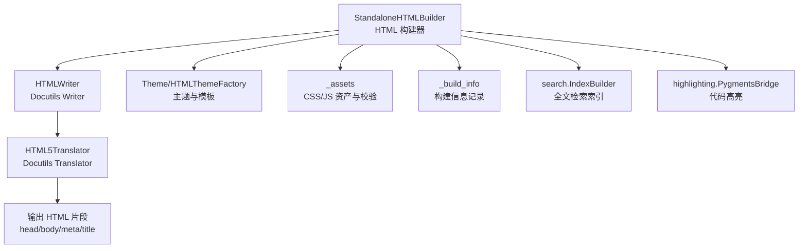
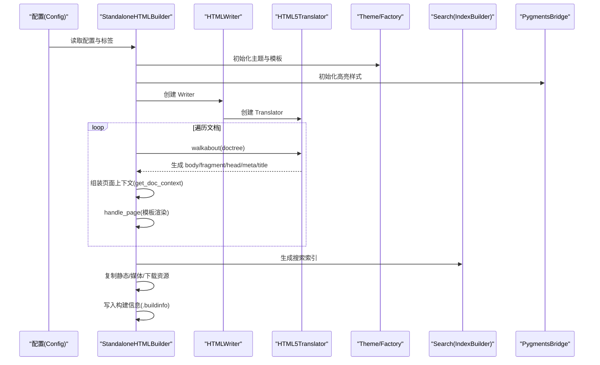
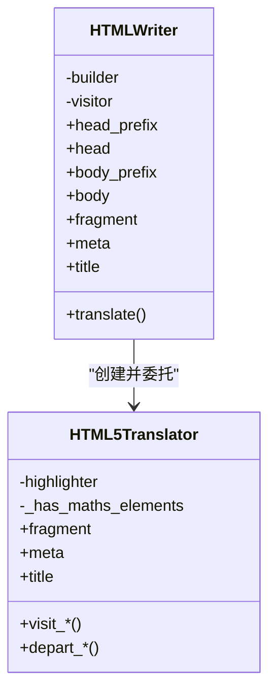
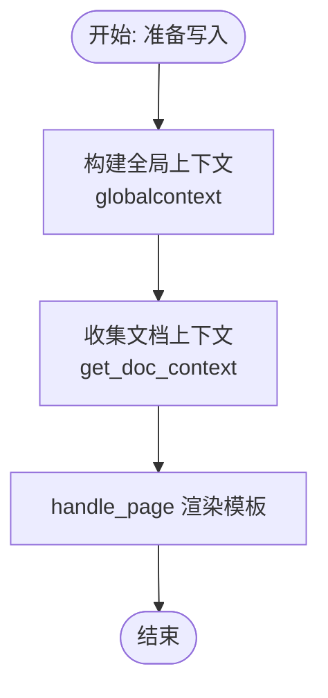
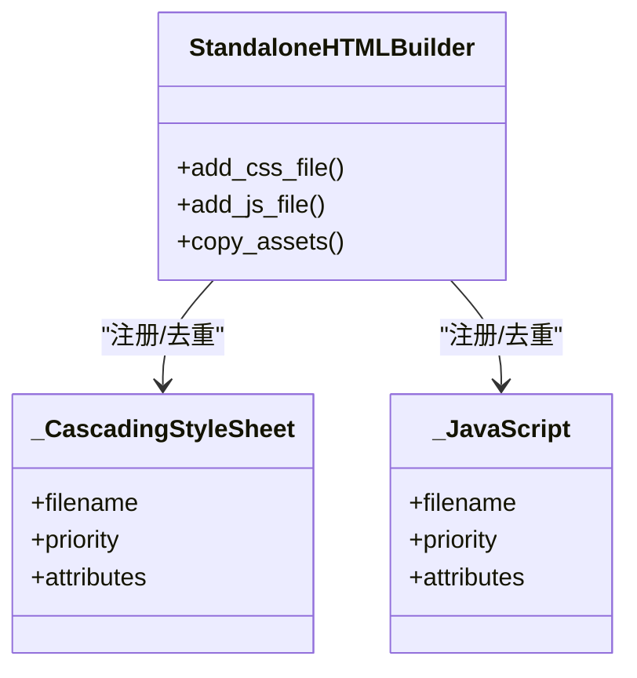
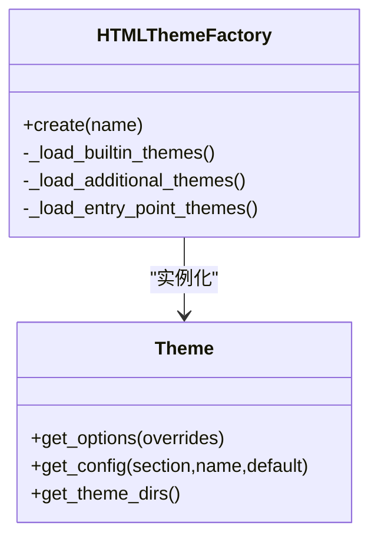
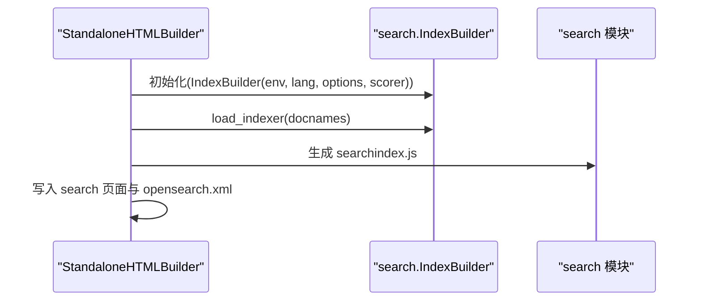
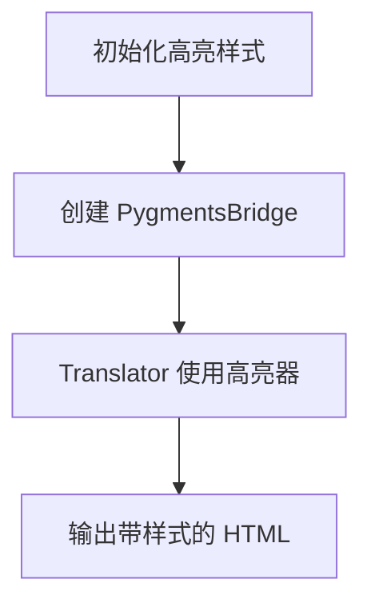
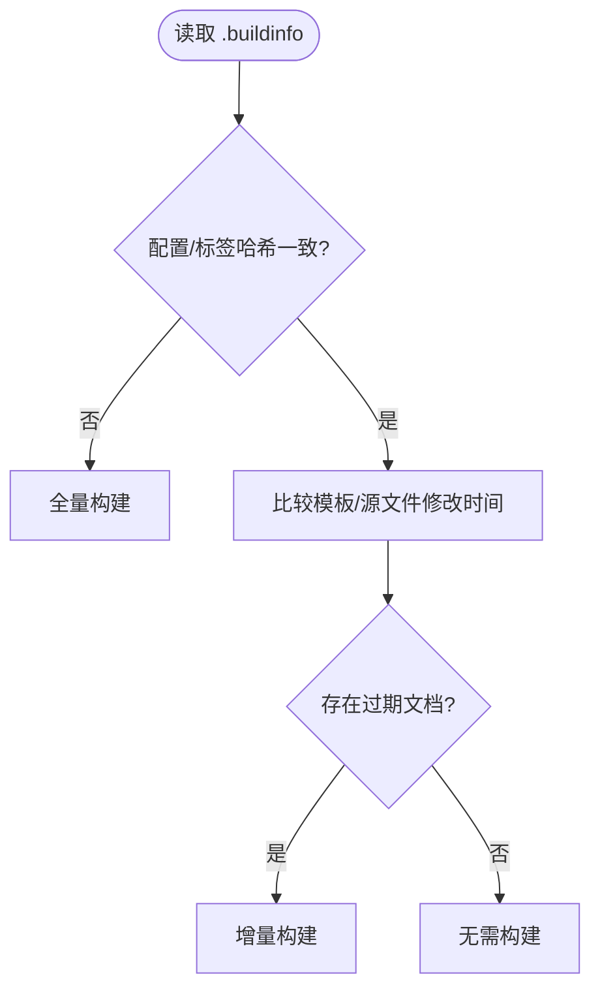
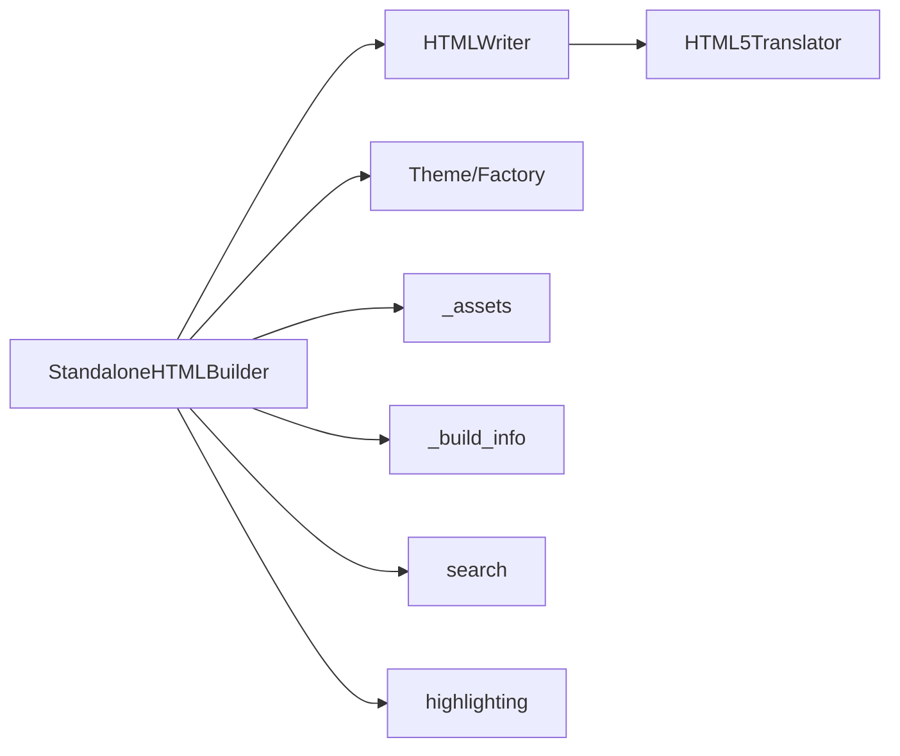

# HTML 构建器

<cite>
**本文引用的文件**
- [sphinx\builders\html\__init__.py](file://sphinx/builders/html/__init__.py)
- [sphinx\writers\html.py](file://sphinx/writers/html.py)
- [sphinx\writers\html5.py](file://sphinx/writers/html5.py)
- [sphinx\builders\html\_assets.py](file://sphinx/builders/html/_assets.py)
- [sphinx\builders\html\_build_info.py](file://sphinx/builders/html/_build_info.py)
- [sphinx\theming.py](file://sphinx/theming.py)
- [sphinx\themes\basic\theme.toml](file://sphinx/themes/basic/theme.toml)
- [sphinx\themes\basic\layout.html](file://sphinx/themes/basic/layout.html)
- [sphinx\config.py](file://sphinx/config.py)
- [sphinx\search\__init__.py](file://sphinx/search/__init__.py)
- [sphinx\highlighting.py](file://sphinx/highlighting.py)
</cite>

## 目录
1. [简介](#简介)
2. [项目结构](#项目结构)
3. [核心组件](#核心组件)
4. [架构总览](#架构总览)
5. [详细组件分析](#详细组件分析)
6. [依赖分析](#依赖分析)
7. [性能考虑](#性能考虑)
8. [故障排查指南](#故障排查指南)
9. [结论](#结论)
10. [附录](#附录)

## 简介
本文件面向 Sphinx 的 HTML 构建器（StandaloneHTMLBuilder），系统性阐述其工作原理与实现细节，覆盖文档树转换、模板渲染、静态资源处理、输出结构组织、导航与索引生成、搜索功能、主题系统集成、配置项与优化策略，并提供常见问题排查与性能调优建议。目标读者既包括需要深入理解构建流程的技术人员，也包括希望正确配置与优化 HTML 输出的使用者。

## 项目结构
围绕 HTML 构建器的关键模块与职责如下：
- 构建器与控制流：StandaloneHTMLBuilder 负责读取配置、初始化模板与主题、准备全局上下文、写入文档、生成附加页面、复制静态与媒体资源、完成收尾（索引、搜索、构建信息）。
- 文档树转换与翻译：HTMLWriter 负责创建访问者（HTML5Translator），遍历 doctree 并收集 head/body 片段；HTML5Translator 将节点映射为 HTML 标签与类名，处理代码高亮、数学公式、表格、对象描述等。
- 主题与模板：Theme 与 HTMLThemeFactory 提供主题解析、样式表与侧边栏模板加载；basic 主题提供默认布局与选项示例。
- 资源与校验：_assets 提供 CSS/JS 资产封装与文件校验；_build_info 记录构建元数据以支持增量构建。
- 搜索与高亮：search 提供多语言分词与索引格式；highlighting 提供 Pygments 桥接与词法高亮。

**图示来源**
- [sphinx\builders\html\__init__.py](file://sphinx/builders/html/__init__.py)
- [sphinx\writers\html.py](file://sphinx/writers/html.py)
- [sphinx\writers\html5.py](file://sphinx/writers/html5.py)
- [sphinx\builders\html\_assets.py](file://sphinx/builders/html/_assets.py)
- [sphinx\builders\html\_build_info.py](file://sphinx/builders/html/_build_info.py)
- [sphinx\theming.py](file://sphinx/theming.py)
- [sphinx\search\__init__.py](file://sphinx/search/__init__.py)
- [sphinx\highlighting.py](file://sphinx/highlighting.py)

**章节来源**
- [sphinx\builders\html\__init__.py](file://sphinx/builders/html/__init__.py)
- [sphinx\writers\html.py](file://sphinx/writers/html.py)
- [sphinx\writers\html5.py](file://sphinx/writers/html5.py)
- [sphinx\theming.py](file://sphinx/theming.py)

## 核心组件
- StandaloneHTMLBuilder：负责构建生命周期管理、模板与主题初始化、全局上下文准备、文档写入、附加页面生成、静态资源复制、索引与搜索收尾、构建信息记录。
- HTMLWriter：基于 Docutils 的 Writer，委托给 HTML5Translator 生成片段与元信息。
- HTML5Translator：Docutils 的 HTML5 访问者，负责节点到 HTML 的映射、代码高亮、数学公式、表格、对象描述等。
- Theme/HTMLThemeFactory：主题工厂与主题对象，解析 theme.toml，合并继承链，提供样式表、侧边栏模板与 Pygments 主题选项。
- _assets：不可变资产包装器（CSS/JS），支持优先级、属性与校验和计算。
- _build_info：构建信息文件的读写与比较，用于增量构建判断。
- search：多语言搜索预处理、索引序列化与加载。
- highlighting：Pygments 桥接，选择词法器与样式，执行高亮。

**章节来源**
- [sphinx\builders\html\__init__.py](file://sphinx/builders/html/__init__.py)
- [sphinx\writers\html.py](file://sphinx/writers/html.py)
- [sphinx\writers\html5.py](file://sphinx/writers/html5.py)
- [sphinx\builders\html\_assets.py](file://sphinx/builders/html/_assets.py)
- [sphinx\builders\html\_build_info.py](file://sphinx/builders/html/_build_info.py)
- [sphinx\theming.py](file://sphinx/theming.py)
- [sphinx\search\__init__.py](file://sphinx/search/__init__.py)
- [sphinx\highlighting.py](file://sphinx/highlighting.py)

## 架构总览
下图展示从配置到输出的端到端流程，包括文档树转换、模板渲染、资源处理与索引生成。

**图示来源**
- [sphinx\builders\html\__init__.py](file://sphinx/builders/html/__init__.py)
- [sphinx\writers\html.py](file://sphinx/writers/html.py)
- [sphinx\writers\html5.py](file://sphinx/writers/html5.py)
- [sphinx\theming.py](file://sphinx/theming.py)
- [sphinx\search\__init__.py](file://sphinx/search/__init__.py)
- [sphinx\highlighting.py](file://sphinx/highlighting.py)

## 详细组件分析

### 文档树转换与 HTML 生成
- HTMLWriter：重载 Docutils Writer，禁用内嵌样式表，委托 Translator 收集 head/body/fragment 等输出部件。
- HTML5Translator：实现节点到 HTML 的映射，处理标题、段落、列表、表格、代码块、对象描述签名、数学公式、图像等；维护片段缓冲与元信息，标记是否包含数学元素以便后续处理。

**图示来源**
- [sphinx\writers\html.py](file://sphinx/writers/html.py)
- [sphinx\writers\html5.py](file://sphinx/writers/html5.py)

**章节来源**
- [sphinx\writers\html.py](file://sphinx/writers/html.py)
- [sphinx\writers\html5.py](file://sphinx/writers/html5.py)

### 模板渲染与页面上下文
- StandaloneHTMLBuilder.prepare_writing：构建全局上下文（globalcontext），注入项目信息、样式表、脚本、语言、主题选项、关系链接等；决定“最后更新”格式、logo/favicon 处理等。
- StandaloneHTMLBuilder.get_doc_context：为单页收集上下文，包括上一页/下一页、父级路径、标题、元数据、本地 TOC、显示 TOC 标志、源码链接等。
- 模板层：basic 主题 layout.html 定义 doctype、relbar、sidebar、css/js 注入、link 标签、footer 等区块；通过宏与块扩展实现可定制性。

**图示来源**
- [sphinx\builders\html\__init__.py](file://sphinx/builders/html/__init__.py)
- [sphinx\themes\basic\layout.html](file://sphinx/themes/basic/layout.html)

**章节来源**
- [sphinx\builders\html\__init__.py](file://sphinx/builders/html/__init__.py)
- [sphinx\themes\basic\layout.html](file://sphinx/themes/basic/layout.html)

### 静态资源处理与资产系统
- _assets：定义不可变的 _CascadingStyleSheet 与 _JavaScript 包装器，支持优先级、属性与去重；提供本地文件校验和计算（排除回车符差异）。
- StandaloneHTMLBuilder.init_css_files/init_js_files：注册内置样式与脚本、扩展注册的样式/脚本、用户自定义样式/脚本；按优先级排序；支持暗色样式媒体查询。
- 资源复制：在 finish 阶段复制下载文件、静态文件、额外文件至 _downloads/_static 等目录。

**图示来源**
- [sphinx\builders\html\_assets.py](file://sphinx/builders/html/_assets.py)
- [sphinx\builders\html\__init__.py](file://sphinx/builders/html/__init__.py)

**章节来源**
- [sphinx\builders\html\_assets.py](file://sphinx/builders/html/_assets.py)
- [sphinx\builders\html\__init__.py](file://sphinx/builders/html/__init__.py)

### 主题系统与布局
- Theme：解析 theme.toml，合并继承链，提供 stylesheets、sidebars、Pygments 默认/暗色样式等；支持 options 覆盖。
- HTMLThemeFactory：加载内置主题、用户主题路径与入口点主题，构建主题注册表；根据 html_theme 与 html_theme_options 实例化 Theme。
- basic 主题：示例 theme.toml 展示继承、样式表、侧边栏与主题选项；layout.html 定义 relbar、sidebar、css/js 注入、link 标签等。

**图示来源**
- [sphinx\theming.py](file://sphinx/theming.py)
- [sphinx\themes\basic\theme.toml](file://sphinx/themes/basic/theme.toml)

**章节来源**
- [sphinx\theming.py](file://sphinx/theming.py)
- [sphinx\themes\basic\theme.toml](file://sphinx/themes/basic/theme.toml)
- [sphinx\themes\basic\layout.html](file://sphinx/themes/basic/layout.html)

### 搜索功能与索引
- StandaloneHTMLBuilder.prepare_writing：根据 html_search_language 与 html_search_options 初始化 IndexBuilder；加载已有索引。
- StandaloneHTMLBuilder.gen_additional_pages：生成 search 页面与 OpenSearch XML（当启用 html_use_opensearch 且搜索可用时）。
- search：提供多语言预处理（停用词、分词器、词干提取）、索引序列化为 JavaScript（_JavaScriptIndex）。

**图示来源**
- [sphinx\builders\html\__init__.py](file://sphinx/builders/html/__init__.py)
- [sphinx\search\__init__.py](file://sphinx/search/__init__.py)

**章节来源**
- [sphinx\builders\html\__init__.py](file://sphinx/builders/html/__init__.py)
- [sphinx\search\__init__.py](file://sphinx/search/__init__.py)

### 代码高亮与数学渲染
- StandaloneHTMLBuilder.init_highlighter：根据配置与主题选择 Pygments 样式（默认/暗色），创建 PygmentsBridge。
- HTML5Translator：在 visit_desc_signature_line 等处生成带链接的定义片段；在代码块高亮中使用 PygmentsBridge。
- highlighting：提供词法器选择、样式解析、高亮输出。

**图示来源**
- [sphinx\builders\html\__init__.py](file://sphinx/builders/html/__init__.py)
- [sphinx\writers\html5.py](file://sphinx/writers/html5.py)
- [sphinx\highlighting.py](file://sphinx/highlighting.py)

**章节来源**
- [sphinx\builders\html\__init__.py](file://sphinx/builders/html/__init__.py)
- [sphinx\writers\html5.py](file://sphinx/writers/html5.py)
- [sphinx\highlighting.py](file://sphinx/highlighting.py)

### 构建信息与增量构建
- StandaloneHTMLBuilder.get_outdated_docs：比较 .buildinfo 与当前配置/标签，若不一致则触发全量构建；否则按模板修改时间与源文件修改时间判断过期文档。
- _build_info：记录配置哈希与标签哈希，支持版本检查与相等性比较。

**图示来源**
- [sphinx\builders\html\__init__.py](file://sphinx/builders/html/__init__.py)
- [sphinx\builders\html\_build_info.py](file://sphinx/builders/html/_build_info.py)

**章节来源**
- [sphinx\builders\html\__init__.py](file://sphinx/builders/html/__init__.py)
- [sphinx\builders\html\_build_info.py](file://sphinx/builders/html/_build_info.py)

## 依赖分析
- 构建器对 Writer/Translator 的依赖：HTMLWriter 仅持有对 Builder 的引用，实际转换由 Translator 完成。
- 主题系统对配置与注册表的依赖：HTMLThemeFactory 依据 html_theme 与 html_theme_options、主题路径与入口点加载 Theme。
- 资产系统对文件系统的依赖：_assets 对本地文件进行校验与 CRC32 校验和计算，禁止带查询字符串的本地路径。
- 搜索与高亮对第三方库的依赖：search 依赖多语言模块；highlighting 依赖 Pygments。

**图示来源**
- [sphinx\builders\html\__init__.py](file://sphinx/builders/html/__init__.py)
- [sphinx\writers\html.py](file://sphinx/writers/html.py)
- [sphinx\writers\html5.py](file://sphinx/writers/html5.py)
- [sphinx\theming.py](file://sphinx/theming.py)
- [sphinx\builders\html\_assets.py](file://sphinx/builders/html/_assets.py)
- [sphinx\builders\html\_build_info.py](file://sphinx/builders/html/_build_info.py)
- [sphinx\search\__init__.py](file://sphinx/search/__init__.py)
- [sphinx\highlighting.py](file://sphinx/highlighting.py)

**章节来源**
- [sphinx\builders\html\__init__.py](file://sphinx/builders/html/__init__.py)
- [sphinx\writers\html.py](file://sphinx/writers/html.py)
- [sphinx\writers\html5.py](file://sphinx/writers/html5.py)
- [sphinx\theming.py](file://sphinx/theming.py)
- [sphinx\builders\html\_assets.py](file://sphinx/builders/html/_assets.py)
- [sphinx\builders\html\_build_info.py](file://sphinx/builders/html/_build_info.py)
- [sphinx\search\__init__.py](file://sphinx/search/__init__.py)
- [sphinx\highlighting.py](file://sphinx/highlighting.py)

## 性能考虑
- 增量构建：利用 .buildinfo 与模板/源文件修改时间判断，避免不必要的重建。
- 资源加载顺序：CSS/JS 按优先级加载，用户自定义资源后置，减少覆盖成本。
- 校验与缓存：_assets 的校验和计算采用缓存，避免重复 IO；本地资源路径禁止查询字符串，确保稳定校验。
- 搜索索引：按语言与选项初始化 IndexBuilder，避免无效扫描；生成 searchindex.js 与 opensearch.xml 时仅在需要时写入。
- 代码高亮：统一样式与词法器选择，减少运行时开销；在主题中提供暗色样式媒体查询，避免重复样式。

[本节为通用性能建议，不直接分析具体文件]

## 故障排查指南
- 模板未生效或主题缺失
  - 检查 html_theme 与 html_theme_path 是否正确；确认主题目录包含 theme.toml 与 layout.html。
  - 参考：[主题工厂与主题对象](file://sphinx/theming.py)
- CSS/JS 加载异常
  - 确认资源路径不包含查询字符串；检查 add_css_file/add_js_file 的优先级与去重逻辑。
  - 参考：[_assets 资产封装与校验](file://sphinx/builders/html/_assets.py)
- 搜索结果为空或语言错误
  - 检查 html_search_language 与 html_search_options；确认 IndexBuilder 初始化与索引生成。
  - 参考：[搜索模块](file://sphinx/search/__init__.py)
- 代码高亮样式不匹配
  - 检查 pygments_style 与主题的 pygments_style/default/dark 设置；确认 PygmentsBridge 初始化。
  - 参考：[高亮桥接](file://sphinx/highlighting.py)
- 增量构建未触发
  - 检查 .buildinfo 是否被破坏；确认配置/标签哈希是否变化；核对模板与源文件修改时间。
  - 参考：[构建信息](file://sphinx/builders/html/_build_info.py)

**章节来源**
- [sphinx\theming.py](file://sphinx/theming.py)
- [sphinx\builders\html\_assets.py](file://sphinx/builders/html/_assets.py)
- [sphinx\search\__init__.py](file://sphinx/search/__init__.py)
- [sphinx\highlighting.py](file://sphinx/highlighting.py)
- [sphinx\builders\html\_build_info.py](file://sphinx/builders/html/_build_info.py)

## 结论
Sphinx HTML 构建器通过清晰的构建阶段划分、可插拔的主题与模板系统、严谨的资源与索引管理，实现了高质量的静态 HTML 输出。理解其文档树转换、模板渲染、主题与资产系统、搜索与高亮机制，有助于在实践中进行正确的配置、优化与排错。

[本节为总结性内容，不直接分析具体文件]

## 附录

### HTML 输出结构组织要点
- 页面布局：由主题 layout.html 定义 doctype、relbar、sidebar、css/js 注入、link 标签、footer 等。
- 导航生成：通过 relations 与环境中的 titles/toc 构建 prev/next/parents 链接。
- 搜索功能：生成 search 页面与 searchindex.js，可选 opensearch.xml。
- 主题系统：通过 theme.toml 指定样式表、侧边栏模板与 Pygments 样式。

**章节来源**
- [sphinx\themes\basic\layout.html](file://sphinx/themes/basic/layout.html)
- [sphinx\builders\html\__init__.py](file://sphinx/builders/html/__init__.py)
- [sphinx\search\__init__.py](file://sphinx/search/__init__.py)

### HTML 构建器配置选项概览（与实现关联）
- html_baseurl：用于生成 canonical 链接（在模板中注入）。
- html_use_opensearch：控制是否生成 opensearch.xml。
- html_search_language、html_search_options、html_search_scorer：控制搜索语言与选项。
- html_style、html_theme、html_theme_options：控制样式与主题行为。
- html_static_path、html_extra_path：控制静态与额外资源复制。
- html_file_suffix、html_link_suffix：控制输出与链接后缀。
- html_last_updated_fmt、html_last_updated_use_utc：控制“最后更新”格式与时区。
- html_show_copyright、html_show_sphinx、html_show_sourcelink、html_copy_source、html_sourcelink_suffix：控制页脚与源码链接。
- html_domain_indices、html_split_index：控制域索引生成与拆分。
- pygments_style：控制代码高亮样式。

**章节来源**
- [sphinx\builders\html\__init__.py](file://sphinx/builders/html/__init__.py)
- [sphinx\themes\basic\theme.toml](file://sphinx/themes/basic/theme.toml)
- [sphinx\config.py](file://sphinx/config.py)