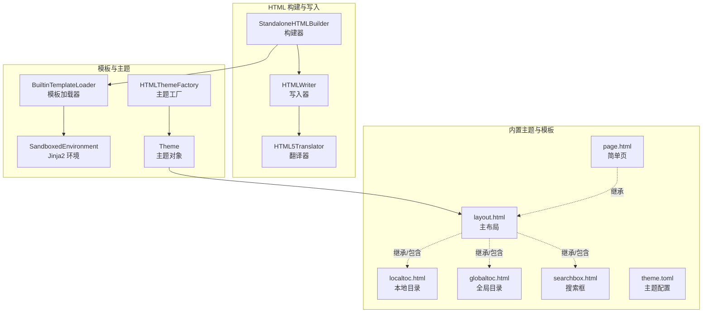
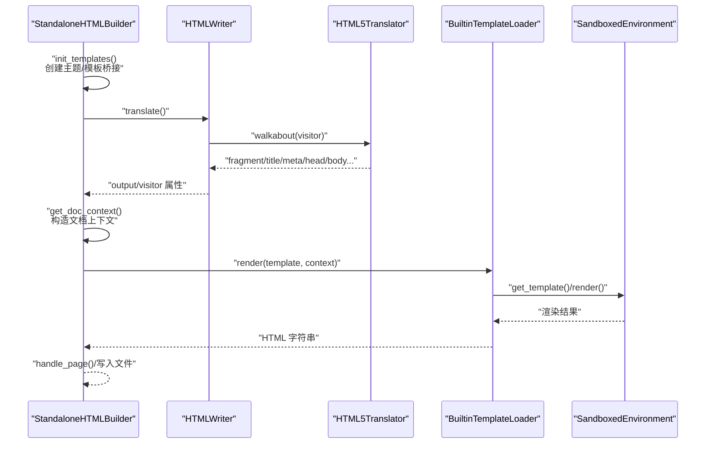
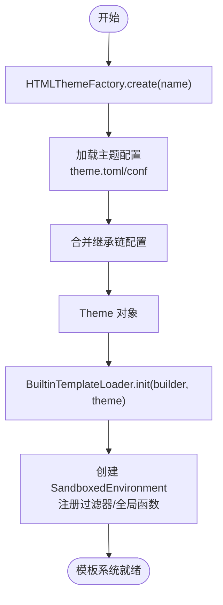
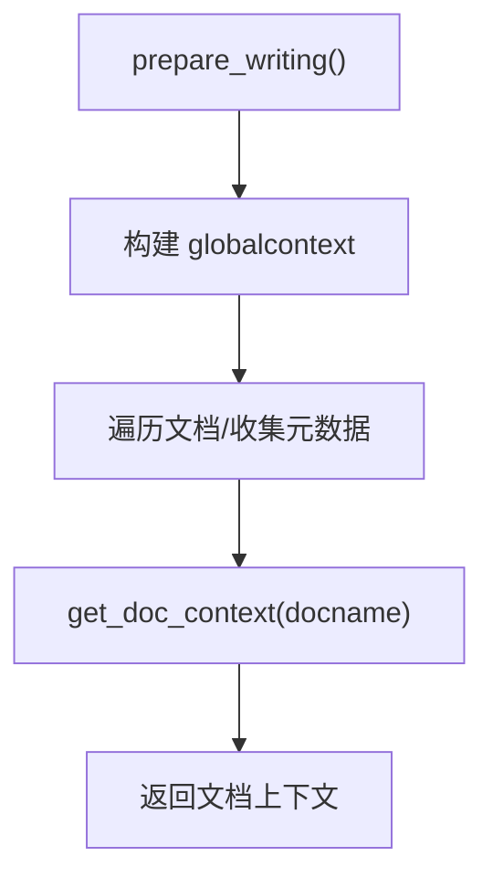
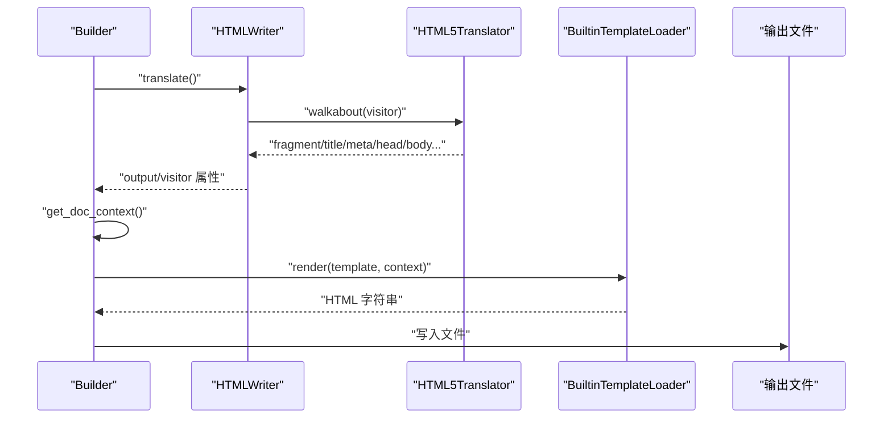
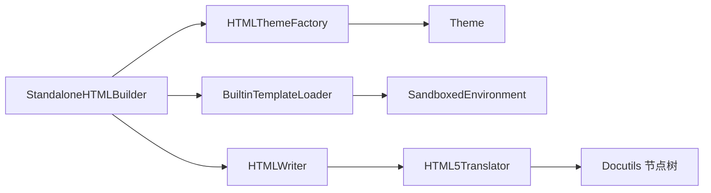

# HTML 模板系统

<cite>
**本文引用的文件**
- [sphinx/builders/html/__init__.py](file://sphinx/builders/html/__init__.py)
- [sphinx/writers/html.py](file://sphinx/writers/html.py)
- [sphinx/writers/html5.py](file://sphinx/writers/html5.py)
- [sphinx/jinja2glue.py](file://sphinx/jinja2glue.py)
- [sphinx/theming.py](file://sphinx/theming.py)
- [sphinx/util/template.py](file://sphinx/util/template.py)
- [sphinx/themes/basic/layout.html](file://sphinx/themes/basic/layout.html)
- [sphinx/themes/basic/theme.toml](file://sphinx/themes/basic/theme.toml)
- [sphinx/themes/basic/localtoc.html](file://sphinx/themes/basic/localtoc.html)
- [sphinx/themes/basic/globaltoc.html](file://sphinx/themes/basic/globaltoc.html)
- [sphinx/themes/basic/searchbox.html](file://sphinx/themes/basic/searchbox.html)
- [sphinx/themes/basic/page.html](file://sphinx/themes/basic/page.html)
</cite>

## 目录
1. [简介](#简介)
2. [项目结构](#项目结构)
3. [核心组件](#核心组件)
4. [架构总览](#架构总览)
5. [详细组件分析](#详细组件分析)
6. [依赖分析](#依赖分析)
7. [性能考虑](#性能考虑)
8. [故障排查指南](#故障排查指南)
9. [结论](#结论)
10. [附录](#附录)

## 简介
本文件系统性阐述 Sphinx 的 HTML 模板系统，覆盖模板初始化流程、Jinja2 模板桥接机制与主题系统集成；详解全局上下文与文档上下文的构建逻辑；说明模板继承、宏与块替换机制；并提供模板自定义指南、调试技巧与性能优化建议。目标是帮助读者从零理解 Sphinx 如何将 Docutils 节点树渲染为最终 HTML 页面。

## 项目结构
围绕 HTML 模板系统的关键目录与文件如下：
- 构建器与写入器：负责收集上下文、创建翻译器、触发模板渲染与输出。
- Jinja2 桥接层：封装模板加载、过滤器、国际化与沙箱环境。
- 主题系统：解析 theme.toml/conf，支持多级继承与样式/侧边栏配置。
- 内置主题与模板：提供基础布局、侧边栏与页面模板，支撑模板继承与块替换。



**图表来源**
- [sphinx/builders/html/__init__.py](file://sphinx/builders/html/__init__.py)
- [sphinx/writers/html.py](file://sphinx/writers/html.py)
- [sphinx/writers/html5.py](file://sphinx/writers/html5.py)
- [sphinx/jinja2glue.py](file://sphinx/jinja2glue.py)
- [sphinx/theming.py](file://sphinx/theming.py)
- [sphinx/themes/basic/layout.html](file://sphinx/themes/basic/layout.html)
- [sphinx/themes/basic/theme.toml](file://sphinx/themes/basic/theme.toml)
- [sphinx/themes/basic/localtoc.html](file://sphinx/themes/basic/localtoc.html)
- [sphinx/themes/basic/globaltoc.html](file://sphinx/themes/basic/globaltoc.html)
- [sphinx/themes/basic/searchbox.html](file://sphinx/themes/basic/searchbox.html)
- [sphinx/themes/basic/page.html](file://sphinx/themes/basic/page.html)

**章节来源**
- [sphinx/builders/html/__init__.py](file://sphinx/builders/html/__init__.py)
- [sphinx/jinja2glue.py](file://sphinx/jinja2glue.py)
- [sphinx/theming.py](file://sphinx/theming.py)
- [sphinx/themes/basic/layout.html](file://sphinx/themes/basic/layout.html)
- [sphinx/themes/basic/theme.toml](file://sphinx/themes/basic/theme.toml)

## 核心组件
- 构建器（StandaloneHTMLBuilder）
  - 初始化模板系统、高亮器、CSS/JS 资源。
  - 构建全局上下文（globalcontext），并按需生成文档上下文（get_doc_context）。
  - 触发写入器与翻译器，完成节点到 HTML 的转换与模板渲染。
- 写入器与翻译器（HTMLWriter / HTML5Translator）
  - HTMLWriter 将文档交给翻译器遍历，收集片段、标题、元信息等。
  - HTML5Translator 实现 Sphinx 自定义节点的访问与 HTML 输出。
- 模板桥接（BuiltinTemplateLoader / SandboxedEnvironment）
  - 提供模板路径链、i18n 扩展、过滤器与工具函数。
  - 支持“!”前缀强制从系统模板路径搜索，实现主题优先策略。
- 主题系统（HTMLThemeFactory / Theme）
  - 解析 theme.toml/conf，支持多级继承、样式表与侧边栏配置。
  - 合并主题选项，暴露给模板全局变量。

**章节来源**
- [sphinx/builders/html/__init__.py](file://sphinx/builders/html/__init__.py)
- [sphinx/writers/html.py](file://sphinx/writers/html.py)
- [sphinx/writers/html5.py](file://sphinx/writers/html5.py)
- [sphinx/jinja2glue.py](file://sphinx/jinja2glue.py)
- [sphinx/theming.py](file://sphinx/theming.py)

## 架构总览
下图展示从构建器到模板渲染的整体流程：构建器准备上下文与资源，创建翻译器遍历节点，写入器收集片段，随后通过模板桥接渲染最终 HTML。



**图表来源**
- [sphinx/builders/html/__init__.py](file://sphinx/builders/html/__init__.py)
- [sphinx/writers/html.py](file://sphinx/writers/html.py)
- [sphinx/writers/html5.py](file://sphinx/writers/html5.py)
- [sphinx/jinja2glue.py](file://sphinx/jinja2glue.py)

## 详细组件分析

### 模板初始化与主题系统集成
- 主题工厂与加载
  - 工厂扫描内置主题目录、用户指定路径与入口点主题，建立名称到路径/模块的映射。
  - 创建主题时沿继承链加载配置，合并样式表、侧边栏与 Pygments 风格设置。
- 模板桥接初始化
  - 基于主题目录链与用户模板路径构建加载器链，支持“!”前缀强制从系统路径搜索。
  - 启用 i18n 扩展，注册常用过滤器与全局函数（如 tobool、toint、todim、slice_index、accesskey、idgen、warning）。
- 构建器初始化模板
  - 通过工厂创建主题，再创建模板桥接并调用 init，注入 builder 与 theme。



**图表来源**
- [sphinx/theming.py](file://sphinx/theming.py)
- [sphinx/jinja2glue.py](file://sphinx/jinja2glue.py)
- [sphinx/builders/html/__init__.py](file://sphinx/builders/html/__init__.py)

**章节来源**
- [sphinx/theming.py](file://sphinx/theming.py)
- [sphinx/jinja2glue.py](file://sphinx/jinja2glue.py)
- [sphinx/builders/html/__init__.py](file://sphinx/builders/html/__init__.py)

### 全局上下文与文档上下文
- 全局上下文（globalcontext）
  - 包含项目元数据、版本信息、语言标签、脚本与样式资源列表、主题选项、额外上下文等。
  - 来源于构建器 prepare_writing 阶段，一次性生成，贯穿所有页面。
- 文档上下文（get_doc_context）
  - 计算上一页/下一页/父级导航、标题、元信息、本地 TOC 片段、显示条件等。
  - 仅针对当前文档生成，用于页面级渲染。



**图表来源**
- [sphinx/builders/html/__init__.py](file://sphinx/builders/html/__init__.py)

**章节来源**
- [sphinx/builders/html/__init__.py](file://sphinx/builders/html/__init__.py)

### 模板继承、宏与块替换
- 模板继承
  - 基础布局 layout.html 定义 doctype、html/head/body 结构与多个可替换块（如 htmltitle、css、scripts、body、footer 等）。
  - 子模板（如 page.html）通过 extends "layout.html" 继承，并在相应块中插入内容。
- 宏与工具
  - relbar、sidebar、script、css 等宏封装常见 UI 结构，提升复用性。
  - 过滤器与全局函数（tobool、toint、todim、slice_index、accesskey、idgen、warning）在模板中直接使用。
- 侧边栏与目录
  - localtoc.html 展示本地 TOC；globaltoc.html 使用 toctree 指令生成全局目录。
  - searchbox.html 提供快速搜索表单。

```mermaid
graph TB
L["layout.html"]
P["page.html"]
LT["localtoc.html"]
GT["globaltoc.html"]
SB["searchbox.html"]
P --> |"extends"| L
L -. 包含/替换 .->|"block body"| P
L -. 包含 .-> LT
L -. 包含 .-> GT
L -. 包含 .-> SB
```

**图表来源**
- [sphinx/themes/basic/layout.html](file://sphinx/themes/basic/layout.html)
- [sphinx/themes/basic/page.html](file://sphinx/themes/basic/page.html)
- [sphinx/themes/basic/localtoc.html](file://sphinx/themes/basic/localtoc.html)
- [sphinx/themes/basic/globaltoc.html](file://sphinx/themes/basic/globaltoc.html)
- [sphinx/themes/basic/searchbox.html](file://sphinx/themes/basic/searchbox.html)

**章节来源**
- [sphinx/themes/basic/layout.html](file://sphinx/themes/basic/layout.html)
- [sphinx/themes/basic/page.html](file://sphinx/themes/basic/page.html)
- [sphinx/themes/basic/localtoc.html](file://sphinx/themes/basic/localtoc.html)
- [sphinx/themes/basic/globaltoc.html](file://sphinx/themes/basic/globaltoc.html)
- [sphinx/themes/basic/searchbox.html](file://sphinx/themes/basic/searchbox.html)

### 模板渲染流程与节点到 HTML 的转换
- 写入器与翻译器
  - HTMLWriter 在 translate 中创建翻译器并遍历文档，收集 head_prefix、stylesheet、head、body 等片段。
  - HTML5Translator 实现 Sphinx 自定义节点访问，输出符合 HTML5 的结构化内容。
- 渲染与输出
  - 构建器在写入文档后，调用 get_doc_context 生成上下文，再通过模板桥接渲染，最后写入文件。



**图表来源**
- [sphinx/writers/html.py](file://sphinx/writers/html.py)
- [sphinx/writers/html5.py](file://sphinx/writers/html5.py)
- [sphinx/builders/html/__init__.py](file://sphinx/builders/html/__init__.py)
- [sphinx/jinja2glue.py](file://sphinx/jinja2glue.py)

**章节来源**
- [sphinx/writers/html.py](file://sphinx/writers/html.py)
- [sphinx/writers/html5.py](file://sphinx/writers/html5.py)
- [sphinx/builders/html/__init__.py](file://sphinx/builders/html/__init__.py)
- [sphinx/jinja2glue.py](file://sphinx/jinja2glue.py)

### 主题配置与选项
- theme.toml
  - 定义继承链、样式表列表、侧边栏模板、默认与深色模式下的 Pygments 风格。
  - 可选 options 段落提供主题开关与尺寸参数。
- 主题选项合并
  - 构建器将主题选项与用户配置合并，作为模板全局变量（如 theme_xxx）注入。

**章节来源**
- [sphinx/themes/basic/theme.toml](file://sphinx/themes/basic/theme.toml)
- [sphinx/builders/html/__init__.py](file://sphinx/builders/html/__init__.py)
- [sphinx/theming.py](file://sphinx/theming.py)

## 依赖分析
- 组件耦合
  - 构建器依赖主题工厂与模板桥接；模板桥接依赖 Jinja2 环境与过滤器；写入器依赖翻译器；翻译器依赖 Docutils 节点。
- 外部依赖
  - Jinja2（沙箱环境、i18n 扩展、过滤器）、Docutils（节点树与 writer/translator）。
- 循环依赖
  - 当前设计以“构建器 → 写入器/翻译器 → 模板桥接”单向传递，未见循环依赖迹象。



**图表来源**
- [sphinx/builders/html/__init__.py](file://sphinx/builders/html/__init__.py)
- [sphinx/theming.py](file://sphinx/theming.py)
- [sphinx/jinja2glue.py](file://sphinx/jinja2glue.py)
- [sphinx/writers/html.py](file://sphinx/writers/html.py)
- [sphinx/writers/html5.py](file://sphinx/writers/html5.py)

**章节来源**
- [sphinx/builders/html/__init__.py](file://sphinx/builders/html/__init__.py)
- [sphinx/theming.py](file://sphinx/theming.py)
- [sphinx/jinja2glue.py](file://sphinx/jinja2glue.py)
- [sphinx/writers/html.py](file://sphinx/writers/html.py)
- [sphinx/writers/html5.py](file://sphinx/writers/html5.py)

## 性能考虑
- 模板缓存与增量构建
  - 模板桥接记录最新模板修改时间，若模板较新则触发全量重建，避免陈旧缓存导致的渲染不一致。
- 资源加载顺序
  - CSS/JS 文件按优先级与注册顺序加入，确保扩展与用户自定义资源正确覆盖默认资源。
- 渲染路径优化
  - 通过最小化重复计算（如 TOC 片段、标题片段）与合理使用过滤器，减少模板渲染开销。
- 并行与增量
  - 构建器允许并行处理，结合增量判断（基于模板与源文件时间戳）可显著缩短构建时间。

**章节来源**
- [sphinx/builders/html/__init__.py](file://sphinx/builders/html/__init__.py)
- [sphinx/jinja2glue.py](file://sphinx/jinja2glue.py)

## 故障排查指南
- 模板未找到
  - 检查模板路径链与“!”前缀使用；确认模板存在于主题目录或用户模板路径。
- 主题配置错误
  - 确认 theme.toml 存在且包含 [theme] 段与 inherit；检查 options 是否拼写正确。
- 上下文缺失
  - 若页面缺少主题变量或资源，请核对构建器是否正确合并主题选项与全局上下文。
- 渲染异常
  - 查看写入器与翻译器输出片段，定位具体节点；必要时启用调试日志或使用模板 debug 过滤器输出上下文。

**章节来源**
- [sphinx/jinja2glue.py](file://sphinx/jinja2glue.py)
- [sphinx/theming.py](file://sphinx/theming.py)
- [sphinx/builders/html/__init__.py](file://sphinx/builders/html/__init__.py)

## 结论
Sphinx 的 HTML 模板系统以“构建器-写入器-翻译器-模板桥接-主题系统”的分层架构实现：构建器负责上下文与资源管理，写入器与翻译器负责节点到 HTML 的转换，模板桥接提供安全可控的渲染环境，主题系统则通过配置驱动模板继承与外观定制。该体系既保证了灵活性（可自定义模板与主题），又兼顾了安全性（沙箱环境与严格路径搜索）与可维护性（清晰的职责分离与增量构建）。

## 附录

### 模板自定义指南
- 修改现有模板
  - 在项目 templates_path 下新增同名模板文件，模板桥接会优先使用用户模板。
  - 使用“!”前缀可强制从系统模板路径搜索，便于在不复制完整模板的情况下进行局部覆盖。
- 创建全新模板
  - 新建 layout.html 并通过 extends 继承基础布局；在相应块中插入内容或包含侧边栏模板。
  - 在 theme.toml 中声明继承链、样式表与侧边栏模板，确保主题选项生效。
- 块替换与宏使用
  - 利用 relbar、sidebar、script、css 等宏简化常用 UI 结构；在子模板中重写对应块实现定制。

**章节来源**
- [sphinx/jinja2glue.py](file://sphinx/jinja2glue.py)
- [sphinx/themes/basic/layout.html](file://sphinx/themes/basic/layout.html)
- [sphinx/themes/basic/theme.toml](file://sphinx/themes/basic/theme.toml)