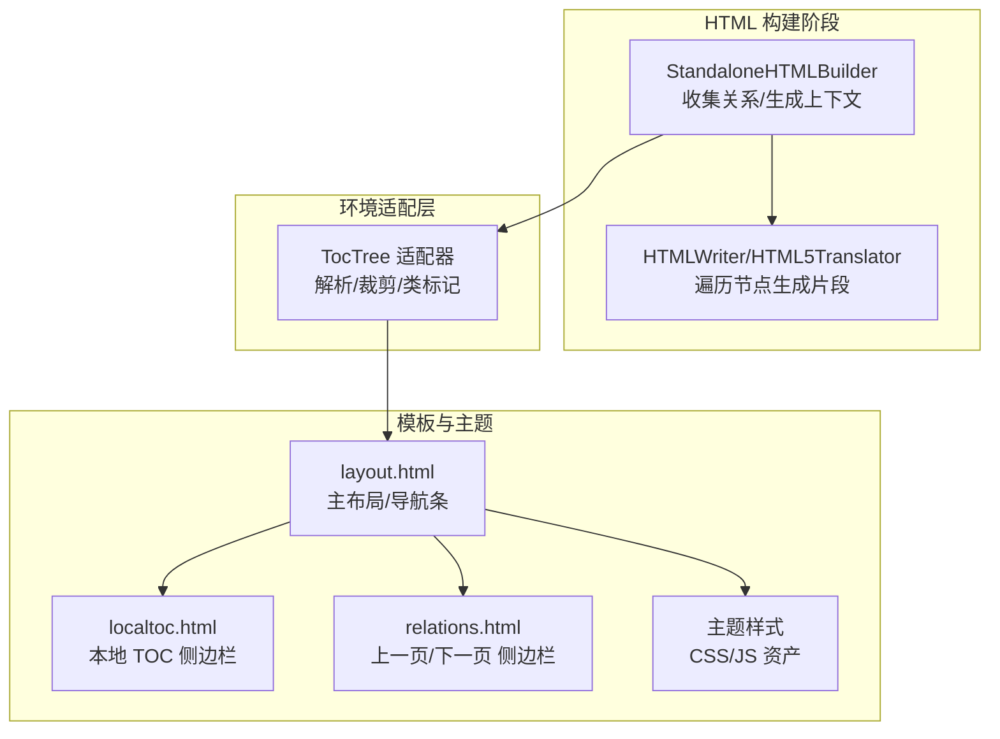
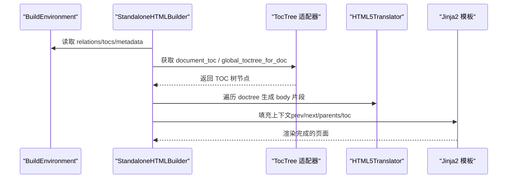
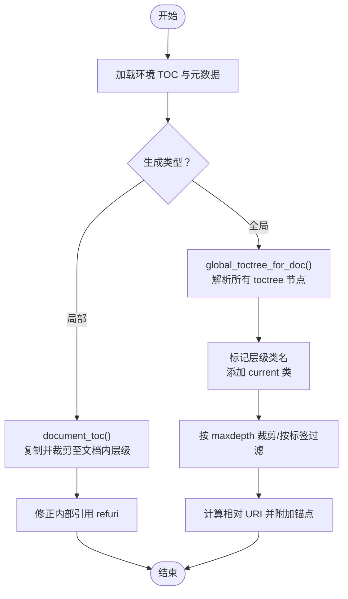
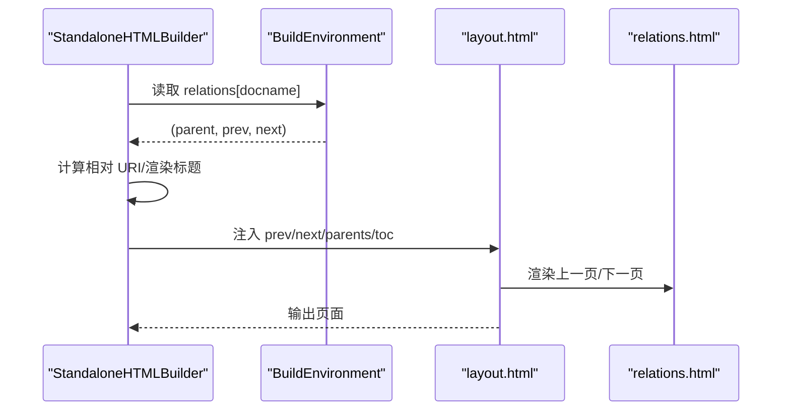
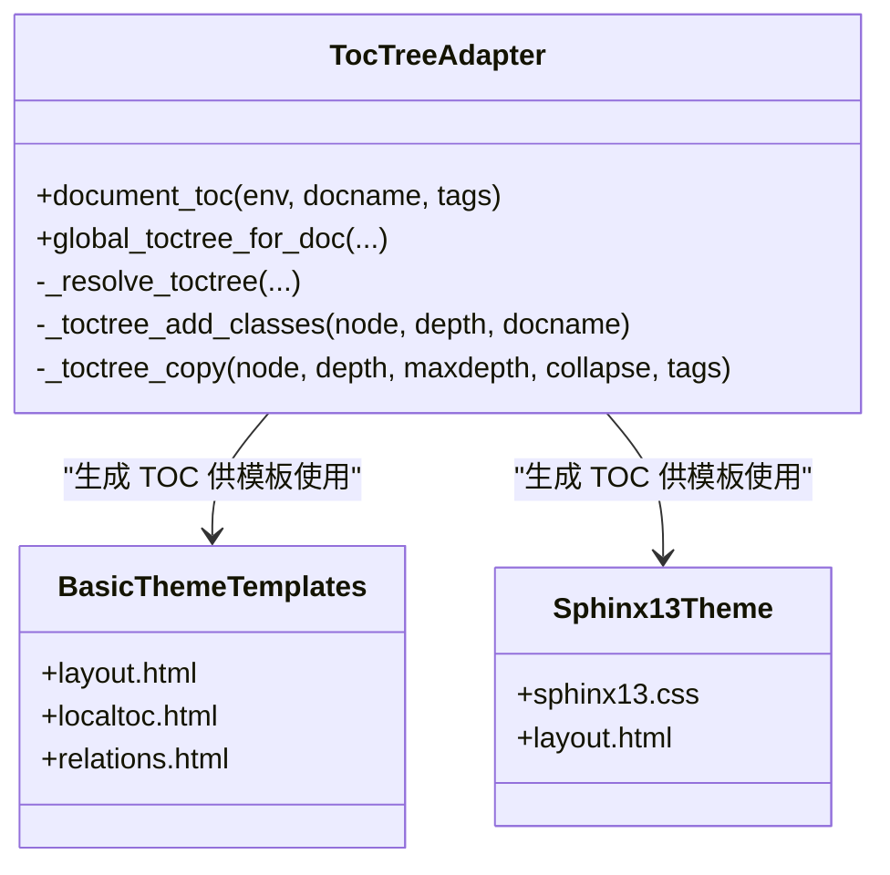
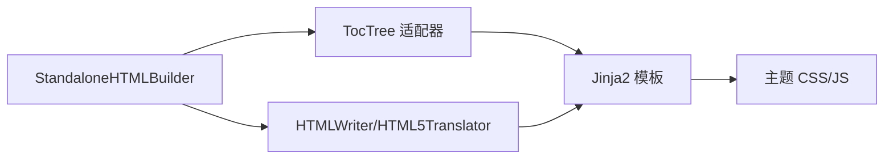

# 导航生成系统

<cite>
**本文档引用的文件**
- [sphinx\builders\html\__init__.py](file://sphinx/builders/html/__init__.py)
- [sphinx\environment\adapters\toctree.py](file://sphinx/environment/adapters/toctree.py)
- [sphinx\themes\basic\layout.html](file://sphinx/themes/basic/layout.html)
- [sphinx\themes\basic\localtoc.html](file://sphinx/themes/basic/localtoc.html)
- [sphinx\themes\basic\relations.html](file://sphinx/themes/basic/relations.html)
- [sphinx\writers\html.py](file://sphinx/writers/html.py)
- [doc\_themes\sphinx13\layout.html](file://doc/_themes/sphinx13/layout.html)
- [doc\_themes\sphinx13\static\sphinx13.css](file://doc/_themes/sphinx13/static/sphinx13.css)
- [tests\roots\test-root\_templates\layout.html](file://tests/roots/test-root/_templates/layout.html)
- [tests\roots\test-root\_templates\customsb.html](file://tests/roots/test-root/_templates/customsb.html)
- [tests\roots\test-toctree-empty\_templates\localtoc.html](file://tests/roots/test-toctree-empty/_templates/localtoc.html)
- [tests\roots\test-root\_templates\contentssb.html](file://tests/roots/test-root/_templates/contentssb.html)
- [tests\test_environment\test_environment_toctree.py](file://tests/test_environment/test_environment_toctree.py)
- [doc\usage\theming.rst](file://doc/usage/theming.rst)
</cite>

## 目录
1. [简介](#简介)
2. [项目结构](#项目结构)
3. [核心组件](#核心组件)
4. [架构总览](#架构总览)
5. [详细组件分析](#详细组件分析)
6. [依赖关系分析](#依赖关系分析)
7. [性能考虑](#性能考虑)
8. [故障排除指南](#故障排除指南)
9. [结论](#结论)

## 简介
本文件面向 Sphinx HTML 导航生成系统，聚焦于目录树（TOC）的生成与渲染、导航链接的构建（上一页/下一页/父级）、导航菜单的层级结构与样式控制，并提供可定制化选项与性能优化建议。内容基于代码库中的 HTML 构建器、环境适配器、模板与主题实现进行深入解析。

## 项目结构
围绕导航生成的关键模块分布如下：
- HTML 构建器：负责收集关系信息、生成本地/全局 TOC、填充模板上下文并输出页面。
- 环境适配器：提供 TOC 解析、裁剪、类标记等能力，支撑构建器生成导航树。
- 模板与主题：提供布局、侧边栏、导航条等 UI 结构与样式。
- 测试用例：验证 TOC 行为、模板集成与主题选项。

**图表来源**
- [sphinx\builders\html\__init__.py](file://sphinx/builders/html/__init__.py)
- [sphinx\environment\adapters\toctree.py](file://sphinx/environment/adapters/toctree.py)
- [sphinx\themes\basic\layout.html](file://sphinx/themes/basic/layout.html)
- [sphinx\themes\basic\localtoc.html](file://sphinx/themes/basic/localtoc.html)
- [sphinx\themes\basic\relations.html](file://sphinx/themes/basic/relations.html)
- [sphinx\writers\html.py](file://sphinx/writers/html.py)

**章节来源**
- [sphinx\builders\html\__init__.py](file://sphinx/builders/html/__init__.py)
- [sphinx\environment\adapters\toctree.py](file://sphinx/environment/adapters/toctree.py)
- [sphinx\themes\basic\layout.html](file://sphinx/themes/basic/layout.html)
- [sphinx\themes\basic\localtoc.html](file://sphinx/themes/basic/localtoc.html)
- [sphinx\themes\basic\relations.html](file://sphinx/themes/basic/relations.html)
- [sphinx\writers\html.py](file://sphinx/writers/html.py)

## 核心组件
- HTML 构建器（StandaloneHTMLBuilder）
  - 收集文档间关系（prev/next/parents），生成本地 TOC 片段，填充全局/文档上下文，调用模板渲染页面。
- TOC 适配器（TocTree）
  - 解析 toctree 节点，按深度裁剪、按标签过滤、添加层级类名与当前页标记，支持标题仅显示模式与折叠控制。
- 主题模板（basic）
  - 提供主布局、导航条、侧边栏（本地 TOC、关系链接）等结构；通过 toctree() 模板函数生成导航树。
- 写入器（HTMLWriter/HTML5Translator）
  - 遍历 doctree，生成 HTML 片段，供构建器拼装到最终页面。

**章节来源**
- [sphinx\builders\html\__init__.py](file://sphinx/builders/html/__init__.py)
- [sphinx\environment\adapters\toctree.py](file://sphinx/environment/adapters/toctree.py)
- [sphinx\themes\basic\layout.html](file://sphinx/themes/basic/layout.html)
- [sphinx\themes\basic\localtoc.html](file://sphinx/themes/basic/localtoc.html)
- [sphinx\themes\basic\relations.html](file://sphinx/themes/basic/relations.html)
- [sphinx\writers\html.py](file://sphinx/writers/html.py)

## 架构总览
导航生成从“文档关系”和“TOC 树”两个维度协同工作：
- 文档关系：由构建器根据环境关系表计算 prev/next/parents，注入模板上下文。
- TOC 树：由适配器解析 toctree 指令，生成本地/全局树，支持深度裁剪、标题仅显示、折叠与可见性控制。

**图表来源**
- [sphinx\builders\html\__init__.py](file://sphinx/builders/html/__init__.py)
- [sphinx\environment\adapters\toctree.py](file://sphinx/environment/adapters/toctree.py)
- [sphinx\writers\html.py](file://sphinx/writers/html.py)

## 详细组件分析

### 全局 TOC 与局部 TOC 的生成机制
- 局部 TOC（document_toc）
  - 仅包含文档内的章节项，不包含祖先或兄弟节点。
  - 生成后会修正内部引用的 refuri，确保锚点正确。
- 全局 TOC（global_toctree_for_doc）
  - 从主 doctree 中解析所有 toctree 节点，按配置裁剪深度、标题仅显示、折叠与可见性。
  - 对每个 toctree 节点进行“标记-裁剪”两阶段处理，避免层级标记与深度裁剪相互干扰。
  - 为每个引用设置相对 URI，保证跨文档链接正确。

**图表来源**
- [sphinx\environment\adapters\toctree.py](file://sphinx/environment/adapters/toctree.py)

**章节来源**
- [sphinx\environment\adapters\toctree.py](file://sphinx/environment/adapters/toctree.py)

### 导航链接的创建过程（上一页、下一页、父级）
- 关系收集
  - 构建器从环境关系表中获取 prev/next/parents，计算相对 URI 并渲染标题片段。
- 上一页/下一页
  - 在模板中通过 next/prev 字段生成“下一页/上一页”链接，同时在 head 中注入 rel="next"/"prev"。
- 父级页面
  - parents 列表逐级向上回溯，生成“返回上级”的链接序列，最终移除指向根文档的冗余项。

**图表来源**
- [sphinx\builders\html\__init__.py](file://sphinx/builders/html/__init__.py)
- [sphinx\themes\basic\layout.html](file://sphinx/themes/basic/layout.html)
- [sphinx\themes\basic\relations.html](file://sphinx/themes/basic/relations.html)

**章节来源**
- [sphinx\builders\html\__init__.py](file://sphinx/builders/html/__init__.py)
- [sphinx\themes\basic\layout.html](file://sphinx/themes/basic/layout.html)
- [sphinx\themes\basic\relations.html](file://sphinx/themes/basic/relations.html)

### 导航菜单的层级结构与样式控制
- 层级结构
  - 适配器为每个层级添加 toctree-lX 类名，当前页分支添加 current 类，便于样式区分。
- 样式控制
  - 主题通过 CSS 变量与类名控制导航外观；basic 主题提供侧边栏模板；sphinx13 主题提供额外样式与图标。
  - 可通过主题选项控制全局 TOC 折叠与包含隐藏项等行为。

**图表来源**
- [sphinx\environment\adapters\toctree.py](file://sphinx/environment/adapters/toctree.py)
- [sphinx\themes\basic\layout.html](file://sphinx/themes/basic/layout.html)
- [sphinx\themes\basic\localtoc.html](file://sphinx/themes/basic/localtoc.html)
- [sphinx\themes\basic\relations.html](file://sphinx/themes/basic/relations.html)
- [doc\_themes\sphinx13\layout.html](file://doc/_themes/sphinx13/layout.html)
- [doc\_themes\sphinx13\static\sphinx13.css](file://doc/_themes/sphinx13/static/sphinx13.css)

**章节来源**
- [sphinx\environment\adapters\toctree.py](file://sphinx/environment/adapters/toctree.py)
- [sphinx\themes\basic\layout.html](file://sphinx/themes/basic/layout.html)
- [sphinx\themes\basic\localtoc.html](file://sphinx/themes/basic/localtoc.html)
- [sphinx\themes\basic\relations.html](file://sphinx/themes/basic/relations.html)
- [doc\_themes\sphinx13\layout.html](file://doc/_themes/sphinx13/layout.html)
- [doc\_themes\sphinx13\static\sphinx13.css](file://doc/_themes/sphinx13/static/sphinx13.css)

### 导航自定义选项
- 模板层面
  - 可在自定义 layout.html 中扩展侧边栏，如同时显示本地 TOC 与全局 TOC。
  - 可通过 toctree() 函数传入参数控制标题仅显示、最大深度、折叠与包含隐藏项。
- 主题层面
  - 通过主题选项控制全局 TOC 折叠与包含隐藏项等行为。
- 示例路径
  - 自定义布局扩展：[tests\roots\test-root\_templates\layout.html](file://tests/roots/test-root/_templates/layout.html)
  - 侧边栏模板示例：[tests\roots\test-root\_templates\customsb.html](file://tests/roots/test-root/_templates/customsb.html)
  - 本地 TOC 模板示例：[tests\roots\test-toctree-empty\_templates\localtoc.html](file://tests/roots/test-toctree-empty/_templates/localtoc.html)
  - 内容侧边栏示例：[tests\roots\test-root\_templates\contentssb.html](file://tests/roots/test-root/_templates/contentssb.html)

**章节来源**
- [tests\roots\test-root\_templates\layout.html](file://tests/roots/test-root/_templates/layout.html)
- [tests\roots\test-root\_templates\customsb.html](file://tests/roots/test-root/_templates/customsb.html)
- [tests\roots\test-toctree-empty\_templates\localtoc.html](file://tests/roots/test-toctree-empty/_templates/localtoc.html)
- [tests\roots\test-root\_templates\contentssb.html](file://tests/roots/test-root/_templates/contentssb.html)
- [doc\usage\theming.rst](file://doc/usage/theming.rst)

## 依赖关系分析
- 构建器依赖环境适配器生成 TOC，再由写入器遍历 doctree 产出片段，最后由模板渲染完整页面。
- 模板依赖构建器提供的上下文（prev/next/parents/toc）与主题资源（CSS/JS）。

**图表来源**
- [sphinx\builders\html\__init__.py](file://sphinx/builders/html/__init__.py)
- [sphinx\environment\adapters\toctree.py](file://sphinx/environment/adapters/toctree.py)
- [sphinx\writers\html.py](file://sphinx/writers/html.py)

**章节来源**
- [sphinx\builders\html\__init__.py](file://sphinx/builders/html/__init__.py)
- [sphinx\environment\adapters\toctree.py](file://sphinx/environment/adapters/toctree.py)
- [sphinx\writers\html.py](file://sphinx/writers/html.py)

## 性能考虑
- TOC 裁剪与类标记分离：先标记层级与当前页，再按 maxdepth 裁剪，减少重复遍历成本。
- 深度优先复制：_toctree_copy_seq 在遍历时根据深度与折叠状态决定是否保留子节点，避免不必要的深拷贝。
- 关系计算缓存：构建器在 prepare_writing 阶段一次性收集 relations，避免在渲染时重复计算。
- 模板片段渲染：render_partial 仅渲染单个节点片段，降低大文档渲染开销。

**章节来源**
- [sphinx\environment\adapters\toctree.py](file://sphinx/environment/adapters/toctree.py)
- [sphinx\builders\html\__init__.py](file://sphinx/builders/html/__init__.py)

## 故障排除指南
- TOC 缺失或为空
  - 检查 toctree 指令是否正确声明、文档是否存在标题、是否被排除/未包含。
  - 参考测试用例对空 TOC 的处理与断言路径。
- 循环引用警告
  - 当 toctree 中出现父子链路循环，系统会记录警告并忽略该引用。
- 引用目标不存在
  - 若 toctree 指向的文档不存在或被排除，会记录相应警告并跳过该条目。
- 上一页/下一页缺失
  - 确认 relations 是否存在对应关系，检查 relations 的生成与传递流程。

**章节来源**
- [sphinx\environment\adapters\toctree.py](file://sphinx/environment/adapters/toctree.py)
- [tests\test_environment\test_environment_toctree.py](file://tests/test_environment/test_environment_toctree.py)

## 结论
Sphinx 的导航生成系统以“文档关系 + TOC 树”为核心，通过构建器、适配器与模板的协作，实现了灵活且可定制的导航体验。全局 TOC 与局部 TOC 各司其职，配合层级类名与主题样式，既满足多层级文档的浏览需求，又允许用户通过模板与主题选项进行精细化控制。结合裁剪策略与片段渲染，系统在功能与性能之间取得良好平衡。