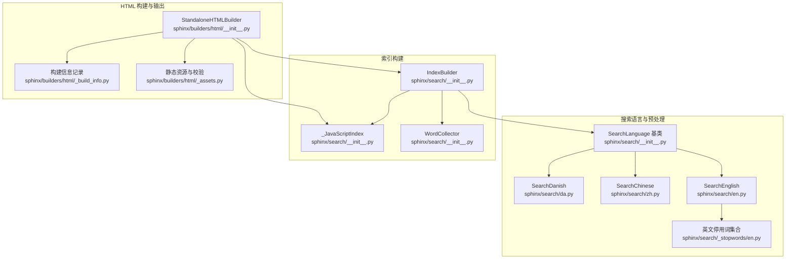
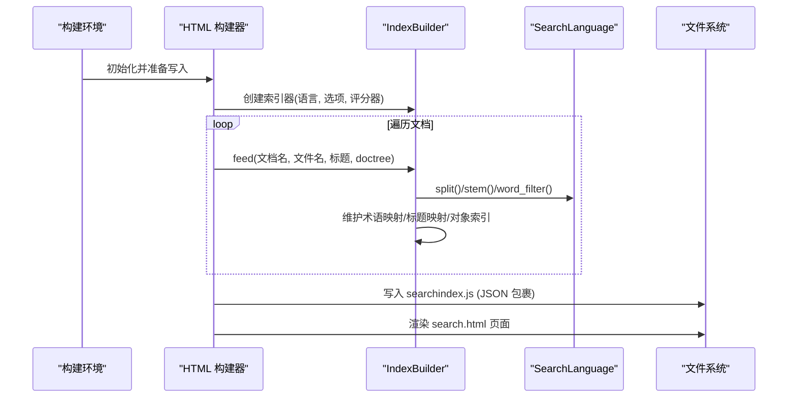
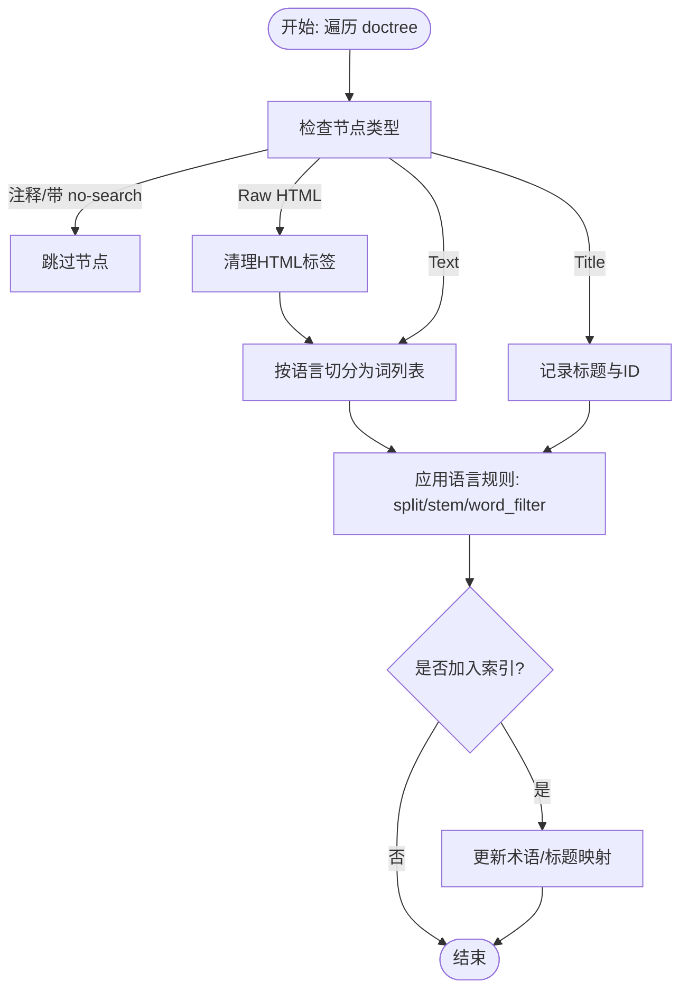
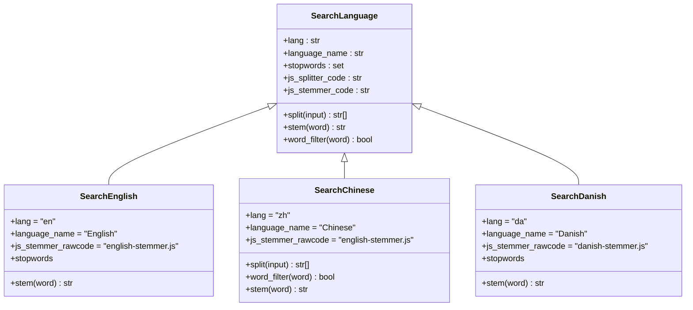
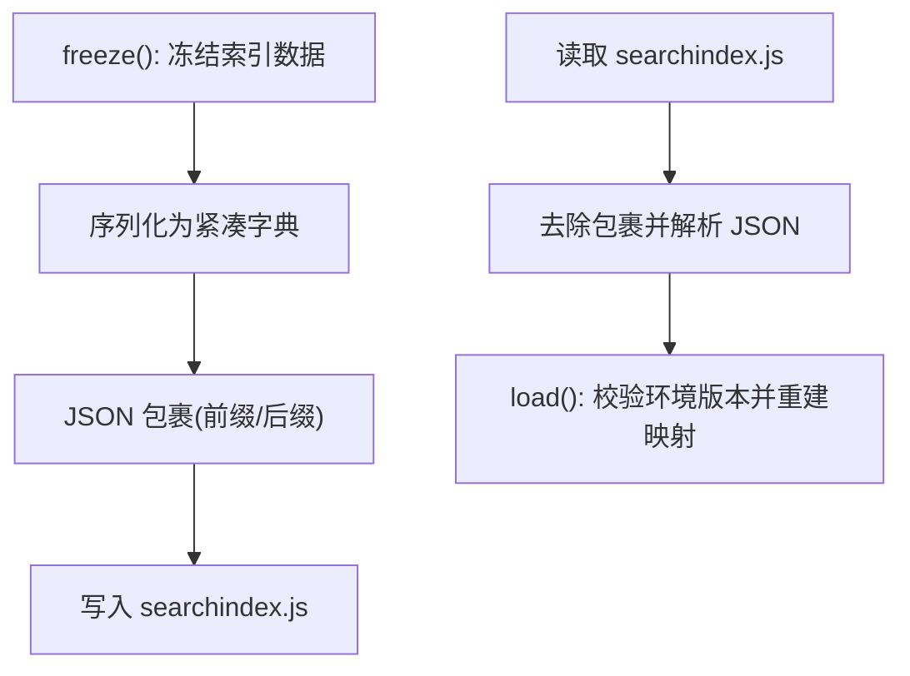
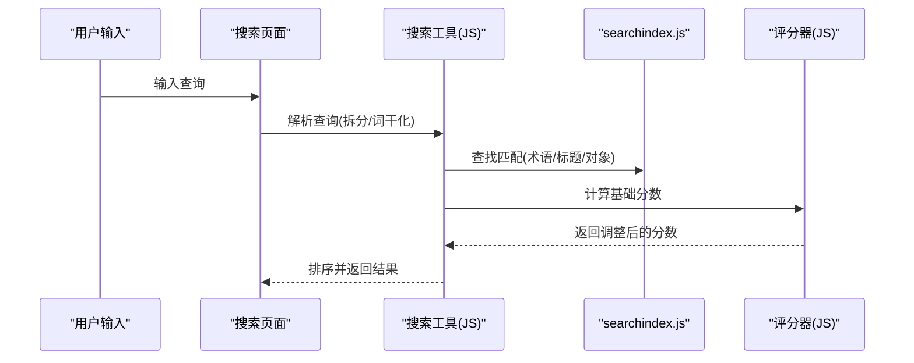
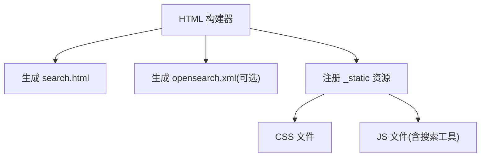
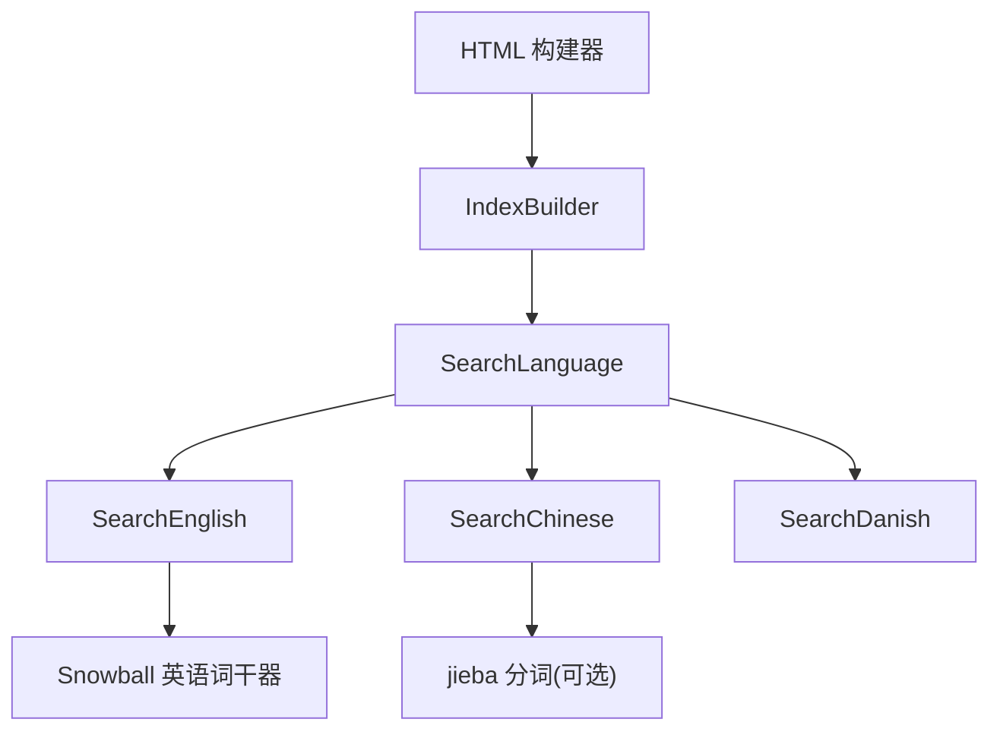

# 搜索功能实现

<cite>
**本文档引用的文件**
- [sphinx\search\__init__.py](file://sphinx\search\__init__.py)
- [sphinx\search\en.py](file://sphinx\search\en.py)
- [sphinx\search\zh.py](file://sphinx\search\zh.py)
- [sphinx\search\da.py](file://sphinx\search\da.py)
- [sphinx\search\_stopwords\en.py](file://sphinx\search\_stopwords\en.py)
- [sphinx\builders\html\__init__.py](file://sphinx\builders\html\__init__.py)
- [sphinx\builders\html\_assets.py](file://sphinx\builders\html\_assets.py)
- [sphinx\builders\html\_build_info.py](file://sphinx\builders\html\_build_info.py)
- [sphinx\config.py](file://sphinx\config.py)
- [doc\usage\configuration.rst](file://doc\usage\configuration.rst)
- [tests\test_search.py](file://tests\test_search.py)
</cite>

## 目录
1. [简介](#简介)
2. [项目结构](#项目结构)
3. [核心组件](#核心组件)
4. [架构总览](#架构总览)
5. [详细组件分析](#详细组件分析)
6. [依赖关系分析](#依赖关系分析)
7. [性能考虑](#性能考虑)
8. [故障排除指南](#故障排除指南)
9. [结论](#结论)
10. [附录](#附录)

## 简介
本文件系统性阐述 Sphinx HTML 搜索功能的实现机制，覆盖以下方面：
- 搜索索引构建：文本提取、分词与词干化、停用词过滤、索引存储格式
- 搜索算法与相关性评分：全文检索、标题优先级、对象索引、可插拔评分器
- 搜索界面与交互：搜索页面生成、搜索表单、结果展示与历史记录
- 配置选项：搜索语言、停用词、搜索范围与评分器
- 性能优化与用户体验建议

## 项目结构
围绕搜索功能的关键模块分布如下：
- 搜索语言与预处理：sphinx/search 下的多语言实现与停用词集合
- 索引构建器：sphinx/search/__init__.py 中的 IndexBuilder 与 WordCollector
- HTML 构建与搜索集成：sphinx/builders/html/__init__.py 负责生成 searchindex.js 并注入页面
- 静态资源与校验：_assets.py 提供资源清单，_build_info.py 记录构建信息
- 配置与测试：doc/usage/configuration.rst 定义配置项，tests/test_search.py 验证行为

**图表来源**
- [sphinx\search\__init__.py:42-121](file://sphinx\search\__init__.py#L42-L121)
- [sphinx\search\en.py:11-23](file://sphinx\search\en.py#L11-L23)
- [sphinx\search\zh.py:38-77](file://sphinx\search\zh.py#L38-L77)
- [sphinx\search\da.py:11-23](file://sphinx\search\da.py#L11-L23)
- [sphinx\search\_stopwords\en.py:6-181](file://sphinx\search\_stopwords\en.py#L6-L181)
- [sphinx\builders\html\__init__.py:109-135](file://sphinx\builders\html\__init__.py#L109-L135)
- [sphinx\builders\html\_assets.py:15-109](file://sphinx\builders\html\_assets.py#L15-L109)
- [sphinx\builders\html\_build_info.py:18-80](file://sphinx\builders\html\_build_info.py#L18-L80)

**章节来源**
- [sphinx\search\__init__.py:42-121](file://sphinx\search\__init__.py#L42-L121)
- [sphinx\builders\html\__init__.py:109-135](file://sphinx\builders\html\__init__.py#L109-L135)

## 核心组件
- SearchLanguage 抽象基类：定义语言特定的分词、词干化、停用词与前端 JS 适配（拆分器与词干器代码）
- 多语言实现：English、Chinese、Danish 等，基于 Snowball 或第三方分词库（如 jieba）
- IndexBuilder：从 doctrees 收集词汇，应用语言规则进行分词/词干化/过滤，构建术语映射、标题映射、对象索引与索引条目
- WordCollector：遍历节点，抽取正文、标题、元关键字等文本，支持跳过 no-search 类节点
- _JavaScriptIndex：以 JSON 包裹形式序列化搜索索引，便于浏览器端直接执行注册
- StandaloneHTMLBuilder：在构建阶段创建 IndexBuilder，收集文档并生成 searchindex.js，同时渲染搜索页面

**章节来源**
- [sphinx\search\__init__.py:42-121](file://sphinx\search\__init__.py#L42-L121)
- [sphinx\search\en.py:11-23](file://sphinx\search\en.py#L11-L23)
- [sphinx\search\zh.py:38-77](file://sphinx\search\zh.py#L38-L77)
- [sphinx\search\da.py:11-23](file://sphinx\search\da.py#L11-L23)
- [sphinx\builders\html\__init__.py:428-441](file://sphinx\builders\html\__init__.py#L428-L441)

## 架构总览
下图展示了从文档到搜索索引再到页面集成的整体流程。

**图表来源**
- [sphinx\builders\html\__init__.py:428-441](file://sphinx\builders\html\__init__.py#L428-L441)
- [sphinx\builders\html\__init__.py:682-684](file://sphinx\builders\html\__init__.py#L682-L684)
- [sphinx\search\__init__.py:260-551](file://sphinx\search\__init__.py#L260-L551)

## 详细组件分析

### 文本提取与预处理（WordCollector 与 IndexBuilder）
- 节点访问策略：
  - 忽略注释与带 no-search 类的元素
  - 对原始 HTML 片段进行简单清理（移除样式与脚本标签），再提取文本
  - 正文节点与标题节点分别收集到 words 与 title_words
  - 元 meta 的 name=keywords 且匹配语言时，作为关键词加入
- 语言规则应用：
  - split：默认按单词正则切分；中文使用 jieba 分词与拉丁字符提取
  - stem：调用对应语言的词干器（Snowball 或自定义）
  - word_filter：过滤纯数字与停用词；中文对短词有额外长度要求
- 索引构建：
  - 维护 terms 与 titleterms 到文档名集合的映射
  - 收集对象索引与索引条目，用于“对象结果”与“交叉引用索引”

**图表来源**
- [sphinx\search\__init__.py:209-258](file://sphinx\search\__init__.py#L209-L258)
- [sphinx\search\__init__.py:592-637](file://sphinx\search\__init__.py#L592-L637)
- [sphinx\search\zh.py:56-77](file://sphinx\search\zh.py#L56-L77)

**章节来源**
- [sphinx\search\__init__.py:209-258](file://sphinx\search\__init__.py#L209-L258)
- [sphinx\search\__init__.py:592-637](file://sphinx\search\__init__.py#L592-L637)
- [sphinx\search\zh.py:56-77](file://sphinx\search\zh.py#L56-L77)

### 词干处理与停用词（SearchLanguage 及语言实现）
- 英语：使用 Snowball 英语词干器，停用词来自独立集合
- 中文：优先 jieba 分词；保留拉丁字符片段；对可能被过度词干化的拉丁词做保护
- 其他语言：同理，均提供对应的词干器与停用词集合

**图表来源**
- [sphinx\search\__init__.py:42-121](file://sphinx\search\__init__.py#L42-L121)
- [sphinx\search\en.py:11-23](file://sphinx\search\en.py#L11-L23)
- [sphinx\search\zh.py:38-77](file://sphinx\search\zh.py#L38-L77)
- [sphinx\search\da.py:11-23](file://sphinx\search\da.py#L11-L23)
- [sphinx\search\_stopwords\en.py:6-181](file://sphinx\search\_stopwords\en.py#L6-L181)

**章节来源**
- [sphinx\search\en.py:11-23](file://sphinx\search\en.py#L11-L23)
- [sphinx\search\zh.py:38-77](file://sphinx\search\zh.py#L38-L77)
- [sphinx\search\da.py:11-23](file://sphinx\search\da.py#L11-L23)
- [sphinx\search\_stopwords\en.py:6-181](file://sphinx\search\_stopwords\en.py#L6-L181)

### 索引存储与序列化（_JavaScriptIndex 与 IndexBuilder.dump/load）
- 存储格式：JSON 包裹的字符串，前缀与后缀标识，便于浏览器端直接执行注册
- 冻结数据：IndexBuilder.freeze 将内存中的映射转换为紧凑的字典结构，包含文档名、文件名、标题、术语映射、对象索引、索引条目等
- 加载与兼容性：load 方法会校验环境版本一致性，避免旧格式导致的不一致

**图表来源**
- [sphinx\search\__init__.py:355-462](file://sphinx\search\__init__.py#L355-L462)
- [sphinx\search\__init__.py:168-184](file://sphinx\search\__init__.py#L168-L184)

**章节来源**
- [sphinx\search\__init__.py:168-184](file://sphinx\search\__init__.py#L168-L184)
- [sphinx\search\__init__.py:355-462](file://sphinx\search\__init__.py#L355-L462)

### 搜索算法与相关性评分
- 全文搜索：基于 terms 与 titleterms 映射，计算查询词命中文档集合的交并
- 标题优先：标题词映射单独维护，标题命中优先于正文命中
- 对象索引：域对象（如函数、类）生成对象索引，支持更细粒度的结果分类
- 可插拔评分器：通过 html_search_scorer 配置加载自定义 JavaScript 评分器，允许对每个结果进行二次打分

**图表来源**
- [doc\usage\configuration.rst:2160-2178](file://doc\usage\configuration.rst#L2160-L2178)
- [sphinx\builders\html\__init__.py:428-441](file://sphinx\builders\html\__init__.py#L428-L441)

**章节来源**
- [doc\usage\configuration.rst:2160-2178](file://doc\usage\configuration.rst#L2160-L2178)
- [sphinx\builders\html\__init__.py:428-441](file://sphinx\builders\html\__init__.py#L428-L441)

### 搜索界面生成（search.html 与静态资源）
- 搜索页面：由 HTML 构建器在完成文档写入后生成，模板名称固定
- 静态资源：构建器统一管理 CSS/JS 注册与优先级，确保搜索相关脚本按序加载
- OpenSearch：可选生成 opensearch.xml，便于浏览器集成

**图表来源**
- [sphinx\builders\html\__init__.py:707-721](file://sphinx\builders\html\__init__.py#L707-L721)
- [sphinx\builders\html\__init__.py:289-304](file://sphinx\builders\html\__init__.py#L289-L304)
- [sphinx\builders\html\_assets.py:15-109](file://sphinx\builders\html\_assets.py#L15-L109)

**章节来源**
- [sphinx\builders\html\__init__.py:707-721](file://sphinx\builders\html\__init__.py#L707-L721)
- [sphinx\builders\html\__init__.py:289-304](file://sphinx\builders\html\__init__.py#L289-L304)
- [sphinx\builders\html\_assets.py:15-109](file://sphinx\builders\html\_assets.py#L15-L109)

### 配置选项与扩展点
- html_search_language：选择搜索语言（如 en、zh、da 等）
- html_search_options：针对日语/中文的分词器选项（例如 jieba 字典路径）
- html_search_scorer：自定义 JavaScript 评分器文件路径
- 构建缓存与增量：通过 .buildinfo 记录配置与标签哈希，判断是否需要全量重建

**章节来源**
- [doc\usage\configuration.rst:2093-2178](file://doc\usage\configuration.rst#L2093-L2178)
- [sphinx\builders\html\_build_info.py:18-80](file://sphinx\builders\html\_build_info.py#L18-L80)
- [sphinx\config.py:196-200](file://sphinx\config.py#L196-L200)

## 依赖关系分析
- 模块耦合：
  - IndexBuilder 依赖 SearchLanguage 实现语言规则
  - HTML 构建器依赖 IndexBuilder 生成搜索索引
  - 搜索语言实现依赖外部分词库（如 snowballstemmer、jieba）
- 外部依赖：
  - PyStemmer（可选）加速英语等语言的词干化
  - 浏览器端 JS 评分器与词干器代码由构建期注入

**图表来源**
- [sphinx\builders\html\__init__.py:428-441](file://sphinx\builders\html\__init__.py#L428-L441)
- [sphinx\search\__init__.py:296-311](file://sphinx\search\__init__.py#L296-L311)
- [sphinx\search\en.py:17-23](file://sphinx\search\en.py#L17-L23)
- [sphinx\search\zh.py:47-54](file://sphinx\search\zh.py#L47-L54)

**章节来源**
- [sphinx\builders\html\__init__.py:428-441](file://sphinx\builders\html\__init__.py#L428-L441)
- [sphinx\search\__init__.py:296-311](file://sphinx\search\__init__.py#L296-L311)

## 性能考虑
- 词干化加速：安装 PyStemmer 可显著提升英语等语言的构建速度
- 选择合适语言：中文/日文分词器可能较重，建议仅在需要时启用
- 增量构建：利用 .buildinfo 与构建信息对比，避免不必要的全量索引重建
- 资源加载顺序：确保搜索相关 JS 在 DOM 就绪后尽早可用，减少首屏等待

**章节来源**
- [doc\usage\configuration.rst:2077-2086](file://doc\usage\configuration.rst#L2077-L2086)
- [sphinx\builders\html\_build_info.py:18-80](file://sphinx\builders\html\_build_info.py#L18-L80)

## 故障排除指南
- 搜索索引不更新：检查 .buildinfo 是否与当前配置一致，必要时触发全量重建
- 语言不生效：确认 html_search_language 设置正确，且对应语言模块已加载
- 自定义评分器无效：核对 html_search_scorer 路径与接口签名，确保文件存在于配置目录
- 测试验证：通过测试用例比对生成的 searchindex.js 与基准文件，定位差异

**章节来源**
- [sphinx\builders\html\_build_info.py:25-46](file://sphinx\builders\html\_build_info.py#L25-L46)
- [tests\test_search.py:477-485](file://tests\test_search.py#L477-L485)

## 结论
Sphinx 的 HTML 搜索功能通过“语言规则 + 索引构建 + 前端检索”的分层设计，实现了跨语言、可扩展的全文检索能力。其优势在于：
- 语言规则与索引构建解耦，易于扩展新语言
- 可插拔评分器满足不同场景下的相关性需求
- 与 HTML 构建流程深度集成，保证索引与页面的一致性

## 附录
- 相关配置项参考：html_search_language、html_search_options、html_search_scorer
- 测试用例参考：tests/test_search.py 中对搜索索引与语言行为的断言

**章节来源**
- [doc\usage\configuration.rst:2093-2178](file://doc\usage\configuration.rst#L2093-L2178)
- [tests\test_search.py:103-131](file://tests\test_search.py#L103-L131)