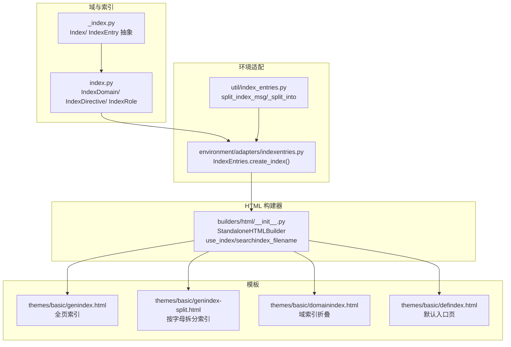
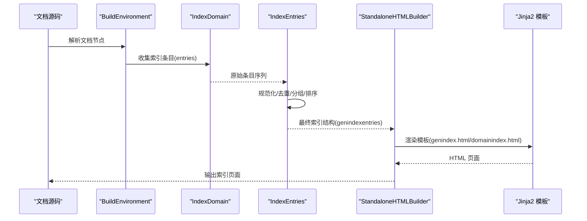
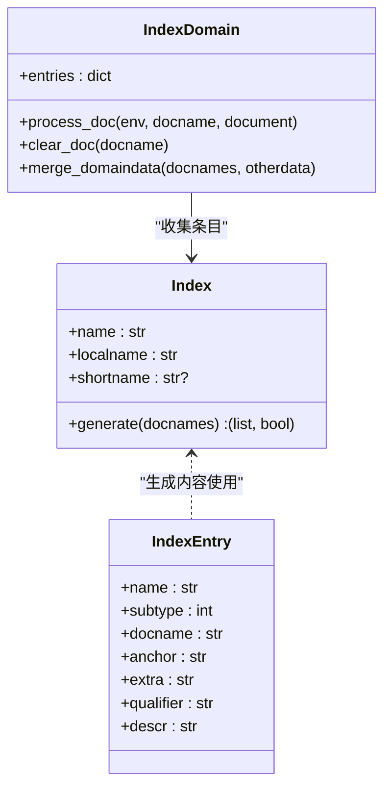
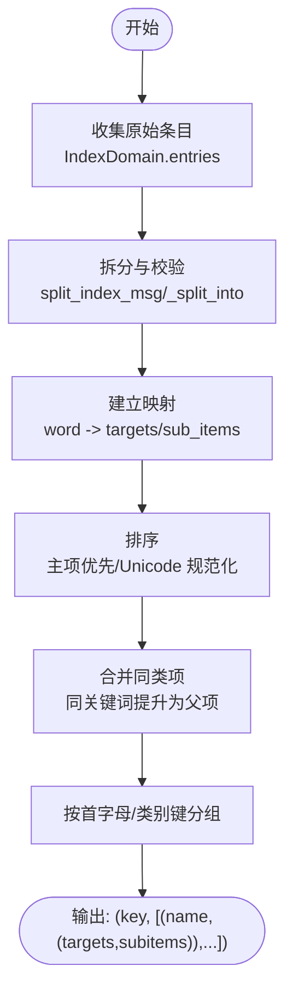
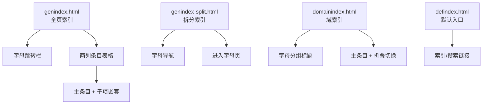
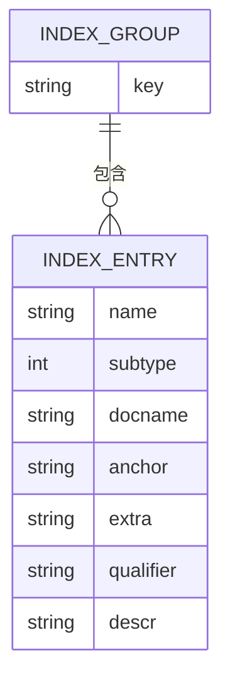
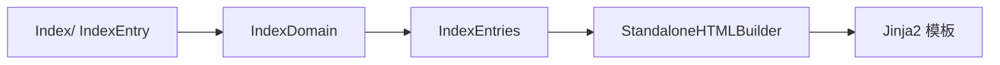

# 索引生成系统

<cite>
**本文引用的文件**
- [sphinx/domains/_index.py](file://sphinx/domains/_index.py)
- [sphinx/domains/index.py](file://sphinx/domains/index.py)
- [sphinx/environment/adapters/indexentries.py](file://sphinx/environment/adapters/indexentries.py)
- [sphinx/util/index_entries.py](file://sphinx/util/index_entries.py)
- [sphinx/builders/html/__init__.py](file://sphinx/builders/html/__init__.py)
- [sphinx/themes/basic/genindex.html](file://sphinx/themes/basic/genindex.html)
- [sphinx/themes/basic/genindex-split.html](file://sphinx/themes/basic/genindex-split.html)
- [sphinx/themes/basic/domainindex.html](file://sphinx/themes/basic/domainindex.html)
- [sphinx/themes/basic/defindex.html](file://sphinx/themes/basic/defindex.html)
- [tests/test_search.py](file://tests/test_search.py)
- [tests/roots/test-toctree-index/index.rst](file://tests/roots/test-toctree-index/index.rst)
</cite>

## 目录
1. [简介](#简介)
2. [项目结构](#项目结构)
3. [核心组件](#核心组件)
4. [架构总览](#架构总览)
5. [详细组件分析](#详细组件分析)
6. [依赖分析](#依赖分析)
7. [性能考虑](#性能考虑)
8. [故障排查指南](#故障排查指南)
9. [结论](#结论)
10. [附录](#附录)

## 简介
本文件系统性阐述 Sphinx 的 HTML 索引生成体系，覆盖通用索引与域（Domain）特定索引的生成流程、索引条目的收集与分类、索引页面的布局与交互（含字母分组、条目列表与折叠）、索引数据结构与检索机制、可定制化选项以及性能优化与用户体验建议。目标读者既包括需要理解实现细节的开发者，也包括希望正确配置与使用索引功能的使用者。

## 项目结构
围绕索引生成的关键模块分布如下：
- 域与索引定义：域内通用索引与各领域特定索引的抽象与实现
- 环境适配器：从已解析文档中收集并规范化索引条目
- HTML 构建器：负责生成索引页面、选择模板与输出格式
- 模板系统：定义通用索引、拆分索引与域索引的渲染结构
- 工具函数：处理索引条目语法解析与拆分

**图表来源**
- [sphinx/domains/_index.py:55-109](file://sphinx/domains/_index.py#L55-L109)
- [sphinx/domains/index.py:31-131](file://sphinx/domains/index.py#L31-L131)
- [sphinx/environment/adapters/indexentries.py:54-197](file://sphinx/environment/adapters/indexentries.py#L54-L197)
- [sphinx/util/index_entries.py:4-27](file://sphinx/util/index_entries.py#L4-L27)
- [sphinx/builders/html/__init__.py:109-137](file://sphinx/builders/html/__init__.py#L109-L137)
- [sphinx/themes/basic/genindex.html:1-69](file://sphinx/themes/basic/genindex.html#L1-L69)
- [sphinx/themes/basic/genindex-split.html:1-34](file://sphinx/themes/basic/genindex-split.html#L1-L34)
- [sphinx/themes/basic/domainindex.html:1-49](file://sphinx/themes/basic/domainindex.html#L1-L49)
- [sphinx/themes/basic/defindex.html:1-29](file://sphinx/themes/basic/defindex.html#L1-L29)

**章节来源**
- [sphinx/domains/_index.py:1-109](file://sphinx/domains/_index.py#L1-L109)
- [sphinx/domains/index.py:1-131](file://sphinx/domains/index.py#L1-L131)
- [sphinx/environment/adapters/indexentries.py:1-268](file://sphinx/environment/adapters/indexentries.py#L1-L268)
- [sphinx/util/index_entries.py:1-28](file://sphinx/util/index_entries.py#L1-L28)
- [sphinx/builders/html/__init__.py:1-200](file://sphinx/builders/html/__init__.py#L1-L200)
- [sphinx/themes/basic/genindex.html:1-69](file://sphinx/themes/basic/genindex.html#L1-L69)
- [sphinx/themes/basic/genindex-split.html:1-34](file://sphinx/themes/basic/genindex-split.html#L1-L34)
- [sphinx/themes/basic/domainindex.html:1-49](file://sphinx/themes/basic/domainindex.html#L1-L49)
- [sphinx/themes/basic/defindex.html:1-29](file://sphinx/themes/basic/defindex.html#L1-L29)

## 核心组件
- 索引抽象与条目模型
  - Index/ IndexEntry 定义了域特定索引的接口与条目字段，支持主/子条目、描述、限定词等
- 通用索引域与指令/角色
  - IndexDomain 负责收集文档中的索引条目；IndexDirective/IndexRole 提供 rST 指令与角色用于声明索引
- 索引条目收集与归类
  - IndexEntries.create_index 将来自 IndexDomain 的原始条目规范化、去重、分组与排序，并生成最终索引结构
- HTML 构建与模板渲染
  - StandaloneHTMLBuilder 控制是否生成索引、索引文件名、搜索索引格式等；模板负责展示字母分组、条目列表与折叠交互

**章节来源**
- [sphinx/domains/_index.py:55-109](file://sphinx/domains/_index.py#L55-L109)
- [sphinx/domains/index.py:31-131](file://sphinx/domains/index.py#L31-L131)
- [sphinx/environment/adapters/indexentries.py:54-197](file://sphinx/environment/adapters/indexentries.py#L54-L197)
- [sphinx/builders/html/__init__.py:109-137](file://sphinx/builders/html/__init__.py#L109-L137)

## 架构总览
下图展示了从文档解析到索引页面渲染的整体流程：

**图表来源**
- [sphinx/domains/index.py:48-62](file://sphinx/domains/index.py#L48-L62)
- [sphinx/environment/adapters/indexentries.py:54-197](file://sphinx/environment/adapters/indexentries.py#L54-L197)
- [sphinx/builders/html/__init__.py:109-137](file://sphinx/builders/html/__init__.py#L109-L137)
- [sphinx/themes/basic/genindex.html:1-69](file://sphinx/themes/basic/genindex.html#L1-L69)
- [sphinx/themes/basic/domainindex.html:1-49](file://sphinx/themes/basic/domainindex.html#L1-L49)

## 详细组件分析

### 通用索引与域特定索引
- 通用索引（Index）
  - 通过 generate 返回“字母分组 + 条目列表”的结构，条目类型为 IndexEntry，支持主/子条目、描述、限定词等
- 域特定索引（IndexDomain）
  - 在文档处理阶段扫描 addnodes.index，调用工具函数拆分条目语法，错误时记录警告并丢弃无效条目
  - 以文档为单位维护 entries 列表，供后续构建器消费

**图表来源**
- [sphinx/domains/_index.py:55-109](file://sphinx/domains/_index.py#L55-L109)
- [sphinx/domains/index.py:31-131](file://sphinx/domains/index.py#L31-L131)

**章节来源**
- [sphinx/domains/_index.py:17-109](file://sphinx/domains/_index.py#L17-L109)
- [sphinx/domains/index.py:31-131](file://sphinx/domains/index.py#L31-L131)

### 索引条目收集与分类
- 输入来源
  - IndexDomain 在文档处理阶段遍历 addnodes.index，提取 entries 并调用 split_index_msg 进行语法校验与拆分
- 归类与排序
  - IndexEntries.create_index 将条目映射到内部结构，按主/子项组织，支持“同关键词合并”（如函数重载）与多语言排序
  - 分组键优先使用 category_key，否则按首字符大写与 Unicode 规范化后首字母分组，非字母与特殊符号统一归入“Symbols”
- 输出结构
  - 返回列表，每个元素为 (分组键, 条目列表)，条目包含主链接、子项、类别键等

**图表来源**
- [sphinx/environment/adapters/indexentries.py:54-197](file://sphinx/environment/adapters/indexentries.py#L54-L197)
- [sphinx/util/index_entries.py:4-27](file://sphinx/util/index_entries.py#L4-L27)

**章节来源**
- [sphinx/environment/adapters/indexentries.py:54-197](file://sphinx/environment/adapters/indexentries.py#L54-L197)
- [sphinx/util/index_entries.py:4-27](file://sphinx/util/index_entries.py#L4-L27)

### 索引页面布局设计
- 全页索引（genindex.html）
  - 展示字母跳转栏、按列排列的条目表格，支持子项嵌套列表
- 拆分索引（genindex-split.html）
  - 首页仅列出字母导航，点击进入对应字母页
- 域索引（domainindex.html）
  - 支持字母分组标题与条目行，主条目带折叠切换图标，折叠状态由配置控制
- 默认入口（defindex.html）
  - 提供索引与搜索的快捷入口链接

**图表来源**
- [sphinx/themes/basic/genindex.html:1-69](file://sphinx/themes/basic/genindex.html#L1-L69)
- [sphinx/themes/basic/genindex-split.html:1-34](file://sphinx/themes/basic/genindex-split.html#L1-L34)
- [sphinx/themes/basic/domainindex.html:1-49](file://sphinx/themes/basic/domainindex.html#L1-L49)
- [sphinx/themes/basic/defindex.html:1-29](file://sphinx/themes/basic/defindex.html#L1-L29)

**章节来源**
- [sphinx/themes/basic/genindex.html:1-69](file://sphinx/themes/basic/genindex.html#L1-L69)
- [sphinx/themes/basic/genindex-split.html:1-34](file://sphinx/themes/basic/genindex-split.html#L1-L34)
- [sphinx/themes/basic/domainindex.html:1-49](file://sphinx/themes/basic/domainindex.html#L1-L49)
- [sphinx/themes/basic/defindex.html:1-29](file://sphinx/themes/basic/defindex.html#L1-L29)

### 索引数据结构与检索机制
- 数据结构
  - 条目：IndexEntry（名称、子类型、文档名、锚点、额外信息、限定词、描述）
  - 索引：(分组键, 条目列表) 的有序结构；条目内部包含主链接列表与子项映射
- 检索机制
  - 构建阶段：IndexEntries.create_index 统一处理，确保排序与分组稳定
  - 模板渲染：根据分组键与条目结构直接渲染 HTML
  - 测试验证：通过冻结（freeze）后的字典结构断言，确保序列化一致性与确定性排序

**图表来源**
- [sphinx/domains/_index.py:17-53](file://sphinx/domains/_index.py#L17-L53)
- [sphinx/environment/adapters/indexentries.py:54-197](file://sphinx/environment/adapters/indexentries.py#L54-L197)

**章节来源**
- [sphinx/domains/_index.py:17-53](file://sphinx/domains/_index.py#L17-L53)
- [sphinx/environment/adapters/indexentries.py:54-197](file://sphinx/environment/adapters/indexentries.py#L54-L197)
- [tests/test_search.py:202-485](file://tests/test_search.py#L202-L485)

### 索引自定义选项
- 通用索引开关与文件名
  - use_index：是否生成索引页面
  - searchindex_filename：搜索索引文件名（与索引页面不同）
- 域索引折叠
  - domainindex.html 中通过配置控制是否启用折叠（collapse_index），折叠状态在模板中注入 JavaScript 配置
- 字母分组与排序
  - create_index 支持按 category_key 分组；默认按 Unicode 规范化后的首字母分组，非字母与特殊符号归入“Symbols”

**章节来源**
- [sphinx/builders/html/__init__.py:121-137](file://sphinx/builders/html/__init__.py#L121-L137)
- [sphinx/themes/basic/domainindex.html:6-10](file://sphinx/themes/basic/domainindex.html#L6-L10)
- [sphinx/environment/adapters/indexentries.py:253-267](file://sphinx/environment/adapters/indexentries.py#L253-L267)

## 依赖分析
- 组件耦合
  - Index 与 IndexEntry 为纯数据结构与接口，低耦合
  - IndexDomain 依赖工具函数进行条目拆分与校验
  - IndexEntries 依赖 IndexDomain 的 entries 与构建器相对路径计算
  - HTML 构建器负责选择模板与输出文件名
- 外部依赖
  - Jinja2 模板引擎用于渲染
  - 文档树节点 addnodes.index 作为输入载体

**图表来源**
- [sphinx/domains/_index.py:55-109](file://sphinx/domains/_index.py#L55-L109)
- [sphinx/domains/index.py:31-131](file://sphinx/domains/index.py#L31-L131)
- [sphinx/environment/adapters/indexentries.py:54-197](file://sphinx/environment/adapters/indexentries.py#L54-L197)
- [sphinx/builders/html/__init__.py:109-137](file://sphinx/builders/html/__init__.py#L109-L137)

**章节来源**
- [sphinx/domains/_index.py:55-109](file://sphinx/domains/_index.py#L55-L109)
- [sphinx/domains/index.py:31-131](file://sphinx/domains/index.py#L31-L131)
- [sphinx/environment/adapters/indexentries.py:54-197](file://sphinx/environment/adapters/indexentries.py#L54-L197)
- [sphinx/builders/html/__init__.py:109-137](file://sphinx/builders/html/__init__.py#L109-L137)

## 性能考虑
- 收集与归类阶段
  - 合理利用分组与排序的确定性，避免重复排序开销
  - 对长文档树，尽量减少不必要的条目拆分与校验失败
- 模板渲染
  - 使用拆分索引（genindex-split.html）降低单页体积，提升首屏加载速度
  - 域索引启用折叠（collapse_index）减少初始渲染负担
- 构建器配置
  - 仅在需要时开启索引生成（use_index），避免不必要 IO
  - 控制条目数量与层级，避免过深的子项嵌套导致渲染复杂度上升

[本节为通用指导，无需具体文件分析]

## 故障排查指南
- 索引条目无效或被丢弃
  - 现象：某些索引条目未出现在最终索引中
  - 排查：检查条目语法是否符合 split_index_msg 的要求；查看日志警告
- 分组异常或排序错乱
  - 现象：字母分组不正确或顺序异常
  - 排查：确认 category_key 是否设置；检查 Unicode 规范化与首字母提取逻辑
- 折叠功能未生效
  - 现象：域索引未显示折叠图标或无法展开
  - 排查：确认模板中是否注入 collapse_index 配置；检查静态资源与脚本加载
- 索引页面未生成
  - 现象：未生成 genindex 或 domainindex 页面
  - 排查：确认 use_index 开关；检查 toctree 中是否包含索引页

**章节来源**
- [sphinx/domains/index.py:56-58](file://sphinx/domains/index.py#L56-L58)
- [sphinx/environment/adapters/indexentries.py:138-147](file://sphinx/environment/adapters/indexentries.py#L138-L147)
- [sphinx/themes/basic/domainindex.html:6-10](file://sphinx/themes/basic/domainindex.html#L6-L10)
- [tests/roots/test-toctree-index/index.rst:9-14](file://tests/roots/test-toctree-index/index.rst#L9-L14)

## 结论
Sphinx 的索引生成体系以“域内通用索引 + 各领域特定索引”为核心，结合环境适配器对条目进行规范化与分组排序，再由 HTML 构建器与模板完成页面渲染。通过拆分索引、折叠与分组策略，既能保证索引的可读性与性能，又能满足多语言与多领域的定制需求。测试用例进一步验证了索引结构的稳定性与确定性。

[本节为总结性内容，无需具体文件分析]

## 附录
- 相关配置与行为
  - use_index：控制是否生成索引
  - searchindex_filename：搜索索引文件名
  - collapse_index：域索引折叠开关
- 示例与参考
  - toctree 中包含索引页的示例

**章节来源**
- [sphinx/builders/html/__init__.py:121-137](file://sphinx/builders/html/__init__.py#L121-L137)
- [sphinx/themes/basic/domainindex.html:6-10](file://sphinx/themes/basic/domainindex.html#L6-L10)
- [tests/roots/test-toctree-index/index.rst:9-14](file://tests/roots/test-toctree-index/index.rst#L9-L14)