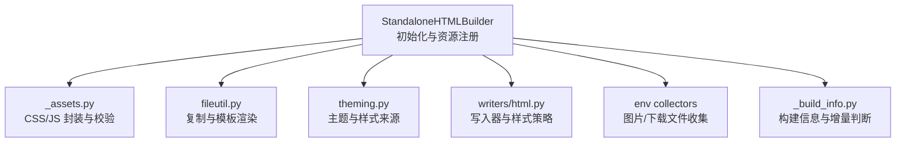
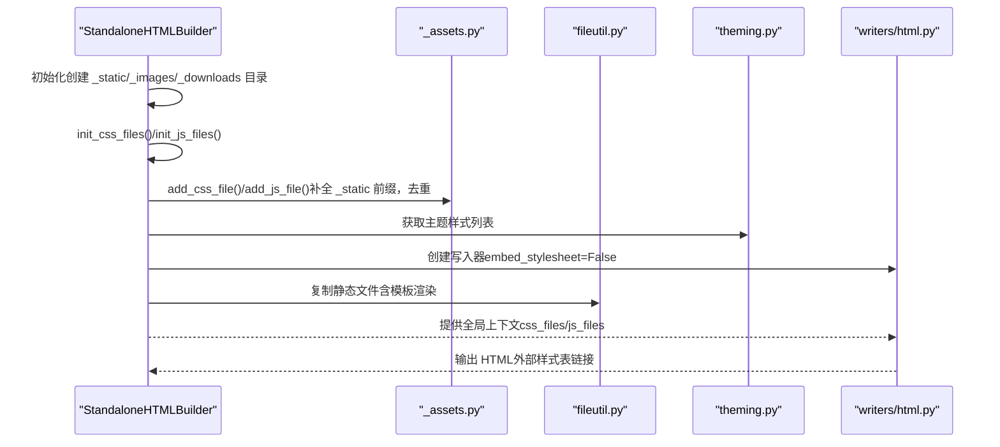
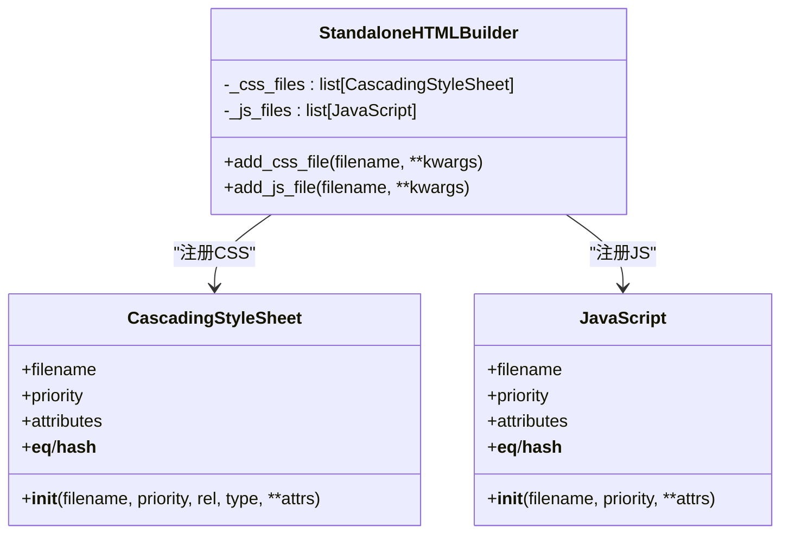
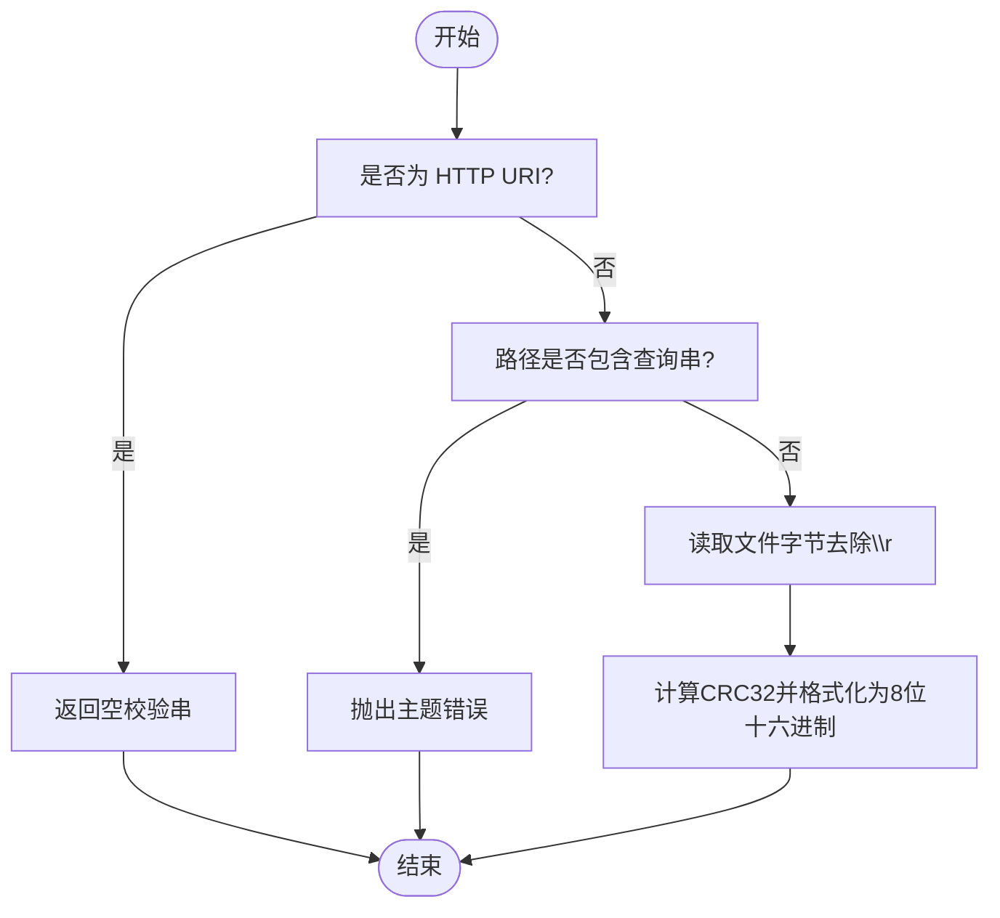
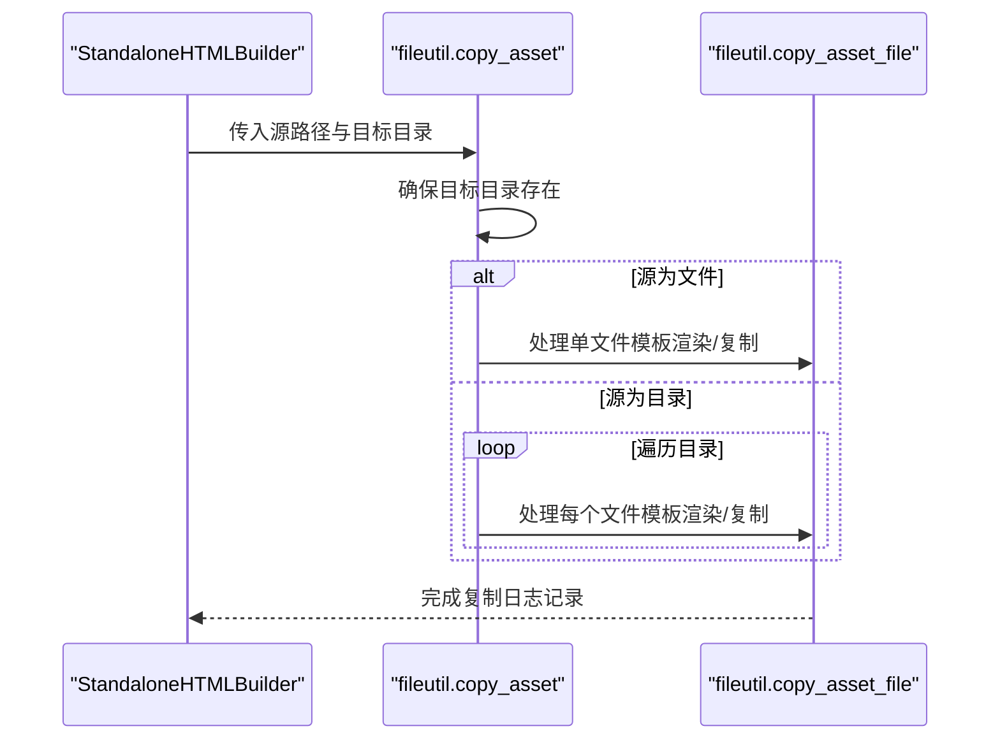
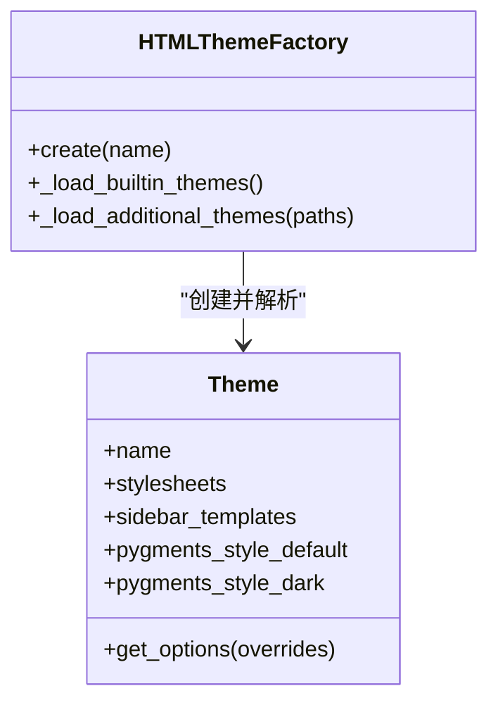
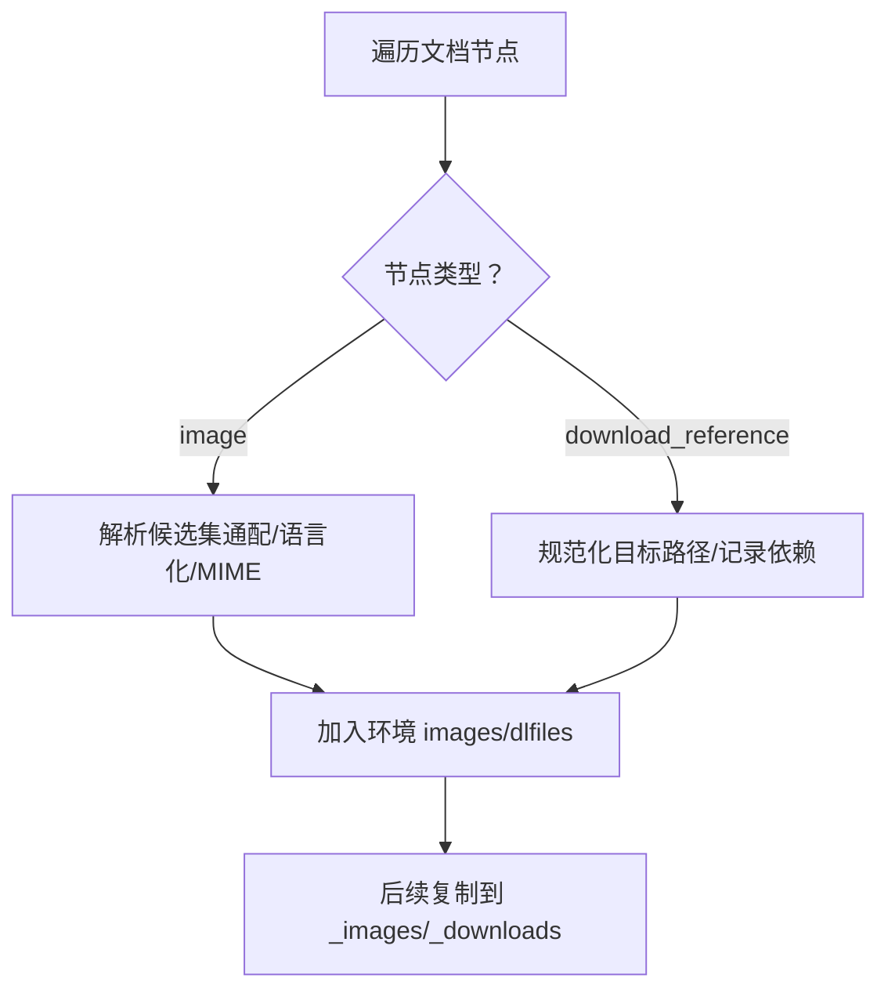
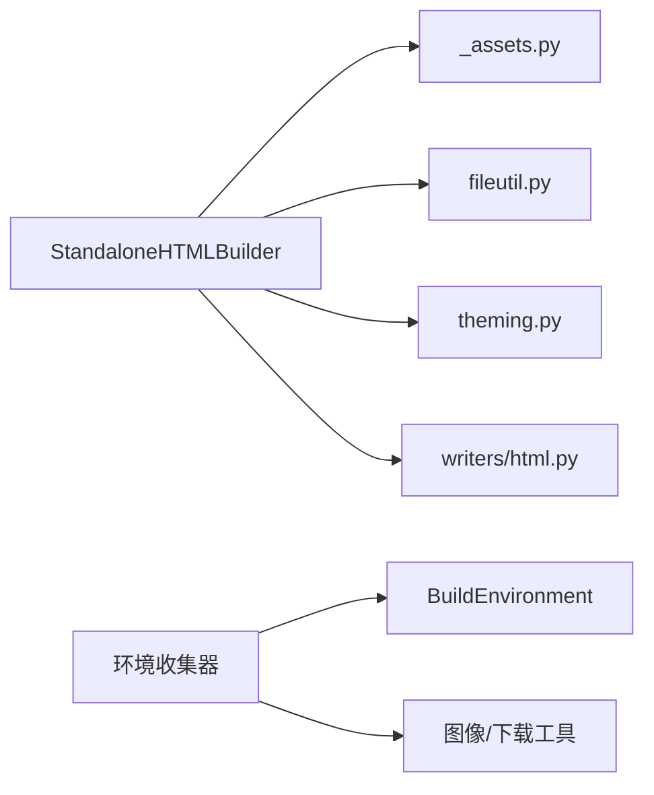

# 静态资源管理

<cite>
**本文引用的文件**
- [sphinx/builders/html/_assets.py](file://sphinx/builders/html/_assets.py)
- [sphinx/builders/html/__init__.py](file://sphinx/builders/html/__init__.py)
- [sphinx/environment/adapters/asset.py](file://sphinx/environment/adapters/asset.py)
- [sphinx/environment/collectors/asset.py](file://sphinx/environment/collectors/asset.py)
- [sphinx/util/fileutil.py](file://sphinx/util/fileutil.py)
- [sphinx/writers/html.py](file://sphinx/writers/html.py)
- [sphinx/theming.py](file://sphinx/theming.py)
- [sphinx/builders/html/_build_info.py](file://sphinx/builders/html/_build_info.py)
</cite>

## 目录
1. [简介](#简介)
2. [项目结构](#项目结构)
3. [核心组件](#核心组件)
4. [架构总览](#架构总览)
5. [详细组件分析](#详细组件分析)
6. [依赖分析](#依赖分析)
7. [性能考虑](#性能考虑)
8. [故障排查指南](#故障排查指南)
9. [结论](#结论)
10. [附录：资源自定义与最佳实践](#附录资源自定义与最佳实践)

## 简介
本文件系统性阐述 Sphinx HTML 构建过程中“静态资源”的管理机制，覆盖以下关键主题：
- CSS 与 JavaScript 的注册、优先级排序与去重逻辑
- 静态文件复制流程（含 _static 目录处理与路径映射）
- 资源优化策略（文件校验和、缓存控制、CDN 集成建议）
- 资源自定义指南（添加自定义样式与脚本）
- 资源加载顺序与性能优化最佳实践

## 项目结构
围绕静态资源管理的相关模块主要分布在以下位置：
- 构建器与资源注册：sphinx/builders/html/
- 资源复制工具：sphinx/util/fileutil.py
- 主题与样式来源：sphinx/theming.py
- 环境收集与图像下载：sphinx/environment/collectors/asset.py、sphinx/environment/adapters/asset.py
- 写入器与样式嵌入策略：sphinx/writers/html.py
- 构建信息与增量构建：sphinx/builders/html/_build_info.py

图表来源
- [sphinx/builders/html/__init__.py:109-320](file://sphinx/builders/html/__init__.py#L109-L320)
- [sphinx/builders/html/_assets.py:15-136](file://sphinx/builders/html/_assets.py#L15-L136)
- [sphinx/util/fileutil.py:37-169](file://sphinx/util/fileutil.py#L37-L169)
- [sphinx/theming.py:58-150](file://sphinx/theming.py#L58-L150)
- [sphinx/writers/html.py:23-63](file://sphinx/writers/html.py#L23-L63)
- [sphinx/environment/collectors/asset.py:33-186](file://sphinx/environment/collectors/asset.py#L33-L186)
- [sphinx/builders/html/_build_info.py:18-80](file://sphinx/builders/html/_build_info.py#L18-L80)

章节来源
- [sphinx/builders/html/__init__.py:109-320](file://sphinx/builders/html/__init__.py#L109-L320)
- [sphinx/builders/html/_assets.py:15-136](file://sphinx/builders/html/_assets.py#L15-L136)
- [sphinx/util/fileutil.py:37-169](file://sphinx/util/fileutil.py#L37-L169)
- [sphinx/theming.py:58-150](file://sphinx/theming.py#L58-L150)
- [sphinx/writers/html.py:23-63](file://sphinx/writers/html.py#L23-L63)
- [sphinx/environment/collectors/asset.py:33-186](file://sphinx/environment/collectors/asset.py#L33-L186)
- [sphinx/builders/html/_build_info.py:18-80](file://sphinx/builders/html/_build_info.py#L18-L80)

## 核心组件
- 资源封装与校验
  - CSS 封装：_CascadingStyleSheet，支持优先级、属性字典与不可变语义
  - JS 封装：_JavaScript，支持优先级与属性字典
  - 文件校验：基于本地文件内容计算 CRC32，生成 8 位十六进制校验串；对 HTTP URI 不生成校验；禁止带查询串的本地路径
- 构建器资源注册
  - CSS 注册：add_css_file，自动补全 _static 前缀，按优先级与属性去重
  - JS 注册：add_js_file，自动补全 _static 前缀，按优先级与属性去重
  - 初始化顺序：内置样式 → 主题样式 → 扩展注册 → 用户配置
- 复制与模板渲染
  - 支持递归复制目录、模板变量渲染、强制覆盖策略
- 主题与样式来源
  - 主题解析与样式列表获取，支持多层继承与选项覆盖
- 环境收集
  - 图片候选集选择、语言化图片匹配、下载文件路径规范化
- 写入器策略
  - 默认不内嵌样式表，由模板上下文注入外部链接
- 构建信息
  - 记录配置哈希与标签哈希，用于增量构建判断

章节来源
- [sphinx/builders/html/_assets.py:15-136](file://sphinx/builders/html/_assets.py#L15-L136)
- [sphinx/builders/html/__init__.py:282-311](file://sphinx/builders/html/__init__.py#L282-L311)
- [sphinx/util/fileutil.py:37-169](file://sphinx/util/fileutil.py#L37-L169)
- [sphinx/theming.py:58-150](file://sphinx/theming.py#L58-L150)
- [sphinx/environment/collectors/asset.py:33-186](file://sphinx/environment/collectors/asset.py#L33-L186)
- [sphinx/writers/html.py:23-63](file://sphinx/writers/html.py#L23-L63)
- [sphinx/builders/html/_build_info.py:18-80](file://sphinx/builders/html/_build_info.py#L18-L80)

## 架构总览
下图展示从资源注册到最终输出的关键交互：

图表来源
- [sphinx/builders/html/__init__.py:139-320](file://sphinx/builders/html/__init__.py#L139-L320)
- [sphinx/builders/html/_assets.py:282-311](file://sphinx/builders/html/_assets.py#L282-L311)
- [sphinx/util/fileutil.py:101-169](file://sphinx/util/fileutil.py#L101-L169)
- [sphinx/theming.py:200-250](file://sphinx/theming.py#L200-L250)
- [sphinx/writers/html.py:23-63](file://sphinx/writers/html.py#L23-L63)

## 详细组件分析

### 组件一：CSS/JS 资源注册与去重
- 设计要点
  - 使用不可变对象承载资源元数据，确保一致性与可比较性
  - 通过优先级与属性集合参与去重判定，避免重复插入
  - 自动补全 _static 前缀，统一相对路径
- 关键流程
  - 初始化阶段：内置样式 → 主题样式 → 扩展注册 → 用户配置
  - 运行时：扩展或页面可动态追加资源，仍遵循去重与优先级规则

图表来源
- [sphinx/builders/html/_assets.py:15-109](file://sphinx/builders/html/_assets.py#L15-L109)
- [sphinx/builders/html/__init__.py:282-311](file://sphinx/builders/html/__init__.py#L282-L311)

章节来源
- [sphinx/builders/html/_assets.py:15-109](file://sphinx/builders/html/_assets.py#L15-L109)
- [sphinx/builders/html/__init__.py:260-311](file://sphinx/builders/html/__init__.py#L260-L311)

### 组件二：文件校验与缓存控制
- 校验机制
  - 仅对本地文件进行校验，HTTP URI 返回空校验串
  - 禁止本地路径包含查询字符串，避免歧义
  - 对文件内容去除回车后计算 CRC32，生成 8 位小写十六进制串
  - 使用缓存装饰器减少重复计算
- 缓存控制建议
  - 可在模板中拼接校验串作为版本参数，实现强缓存与变更失效
  - 对 CDN 场景，建议以校验串命名文件名或使用子目录版本化

图表来源
- [sphinx/builders/html/_assets.py:111-136](file://sphinx/builders/html/_assets.py#L111-L136)

章节来源
- [sphinx/builders/html/_assets.py:111-136](file://sphinx/builders/html/_assets.py#L111-L136)

### 组件三：静态文件复制与模板渲染
- 功能特性
  - 支持单文件与目录复制，递归遍历并排除匹配项
  - 模板文件检测与渲染：根据后缀推断目标文件名
  - 强制覆盖开关，避免意外覆盖已有内容
  - 错误回调钩子，便于记录与继续处理
- 与 _static 的关系
  - 资源注册时统一补全 _static 前缀
  - 复制阶段将静态资源写入输出目录对应子目录

图表来源
- [sphinx/util/fileutil.py:101-169](file://sphinx/util/fileutil.py#L101-L169)
- [sphinx/builders/html/__init__.py:644-648](file://sphinx/builders/html/__init__.py#L644-L648)

章节来源
- [sphinx/util/fileutil.py:37-169](file://sphinx/util/fileutil.py#L37-L169)
- [sphinx/builders/html/__init__.py:644-648](file://sphinx/builders/html/__init__.py#L644-L648)

### 组件四：主题与样式来源
- 主题解析
  - 支持 theme.toml 与 theme.conf，多层继承链合并
  - 提供样式列表、侧边栏模板、Pygments 主题等配置
- 样式注入
  - 构建器在初始化时读取主题样式列表，并按固定优先级注入

图表来源
- [sphinx/theming.py:58-150](file://sphinx/theming.py#L58-L150)

章节来源
- [sphinx/theming.py:58-150](file://sphinx/theming.py#L58-L150)
- [sphinx/builders/html/__init__.py:211-220](file://sphinx/builders/html/__init__.py#L211-L220)

### 组件五：环境收集与路径映射
- 图像收集
  - 解析节点中的候选集，支持通配符、语言化文件与 MIME 类型选择
  - 将原始 URI 映射到唯一文件名，便于集中复制
- 下载文件
  - 规范化本地与远程路径，记录依赖关系

图表来源
- [sphinx/environment/collectors/asset.py:48-175](file://sphinx/environment/collectors/asset.py#L48-L175)
- [sphinx/environment/adapters/asset.py:17-22](file://sphinx/environment/adapters/asset.py#L17-L22)

章节来源
- [sphinx/environment/collectors/asset.py:33-186](file://sphinx/environment/collectors/asset.py#L33-L186)
- [sphinx/environment/adapters/asset.py:13-22](file://sphinx/environment/adapters/asset.py#L13-L22)

### 组件六：写入器与样式嵌入策略
- 写入器行为
  - 默认关闭内嵌样式表，由模板上下文提供外部链接
  - 通过访问全局上下文中的 css_files/js_files 控制输出

章节来源
- [sphinx/writers/html.py:23-63](file://sphinx/writers/html.py#L23-L63)
- [sphinx/builders/html/__init__.py:518-559](file://sphinx/builders/html/__init__.py#L518-L559)

### 组件七：构建信息与增量构建
- 构建信息
  - 记录配置哈希与标签哈希，版本号与字段校验
- 增量构建
  - 若构建信息不一致，触发全量重建并备份旧文件

章节来源
- [sphinx/builders/html/_build_info.py:18-80](file://sphinx/builders/html/_build_info.py#L18-L80)
- [sphinx/builders/html/__init__.py:332-359](file://sphinx/builders/html/__init__.py#L332-L359)

## 依赖分析
- 耦合关系
  - StandaloneHTMLBuilder 依赖 _assets（资源封装）、fileutil（复制）、theming（主题）、writers（写入策略）
  - 环境收集器依赖环境与工具函数，负责资源发现与依赖记录
- 去重与排序
  - 资源对象通过相等性与哈希参与列表去重，优先级决定最终顺序
- 外部依赖
  - 内置主题目录、入口点主题、模板引擎（SphinxRenderer）

图表来源
- [sphinx/builders/html/__init__.py:28-63](file://sphinx/builders/html/__init__.py#L28-L63)
- [sphinx/environment/collectors/asset.py:1-28](file://sphinx/environment/collectors/asset.py#L1-L28)

章节来源
- [sphinx/builders/html/__init__.py:28-63](file://sphinx/builders/html/__init__.py#L28-L63)
- [sphinx/environment/collectors/asset.py:1-28](file://sphinx/environment/collectors/asset.py#L1-L28)

## 性能考虑
- 资源加载顺序
  - 内置样式优先于主题样式，主题样式优先于扩展注册，扩展优先于用户配置
  - 通过优先级与去重避免重复请求，减少网络往返
- 复制与模板渲染
  - 递归复制时使用排除匹配器，避免无关文件进入输出
  - 模板渲染仅在必要时执行，避免重复写入
- 校验与缓存
  - 使用校验串作为版本参数，结合浏览器缓存策略实现长效缓存
  - 对 CDN 场景，建议采用内容指纹命名文件或子目录版本化
- 增量构建
  - 构建信息一致性检查可避免不必要的全量复制

[本节为通用指导，无需列出具体文件来源]

## 故障排查指南
- 资源路径问题
  - 本地资源路径禁止包含查询字符串，否则抛出主题错误
  - 确认资源已正确补全 _static 前缀并存在于输出目录
- 校验失败
  - 校验串为空可能表示资源为远程 URI 或文件缺失
  - 检查文件是否存在且可读
- 复制异常
  - 模板渲染冲突：目标文件已存在且内容不同，需启用强制覆盖或清理目标
  - 权限不足或磁盘空间不足导致复制失败
- 增量构建
  - 构建信息不一致会触发全量重建，检查配置与标签变化

章节来源
- [sphinx/builders/html/_assets.py:111-136](file://sphinx/builders/html/_assets.py#L111-L136)
- [sphinx/util/fileutil.py:74-96](file://sphinx/util/fileutil.py#L74-L96)
- [sphinx/builders/html/_build_info.py:32-40](file://sphinx/builders/html/_build_info.py#L32-L40)

## 结论
Sphinx 的 HTML 静态资源管理以“资源封装 + 注册去重 + 主题来源 + 复制渲染 + 构建信息”为核心闭环，既保证了资源加载顺序与去重，又提供了校验与缓存控制能力。通过合理利用优先级、模板渲染与校验串，可在本地与 CDN 场景下实现高效稳定的资源交付。

[本节为总结性内容，无需列出具体文件来源]

## 附录：资源自定义与最佳实践

### 如何添加自定义样式与脚本
- 添加 CSS
  - 在扩展或应用初始化时调用资源注册接口，设置优先级与属性
  - 优先级示例：扩展注册使用默认值，用户配置使用更高优先级以覆盖
- 添加 JS
  - 同 CSS 流程，注意将文件置于 _static 目录并由注册接口自动补全前缀
- 主题集成
  - 通过主题配置提供样式列表，构建器会在初始化阶段注入

章节来源
- [sphinx/builders/html/__init__.py:260-311](file://sphinx/builders/html/__init__.py#L260-L311)
- [sphinx/theming.py:76-90](file://sphinx/theming.py#L76-L90)

### 资源加载顺序最佳实践
- 内置样式（高优先级）→ 主题样式（中优先级）→ 扩展注册（低优先级）→ 用户配置（最低优先级）
- 通过优先级与去重确保最终顺序稳定，避免重复加载

章节来源
- [sphinx/builders/html/__init__.py:260-311](file://sphinx/builders/html/__init__.py#L260-L311)

### 缓存控制与 CDN 集成
- 使用校验串作为版本参数，结合浏览器缓存策略实现长效缓存
- CDN 场景建议以校验串命名文件或使用子目录版本化，确保变更生效

章节来源
- [sphinx/builders/html/_assets.py:111-136](file://sphinx/builders/html/_assets.py#L111-L136)