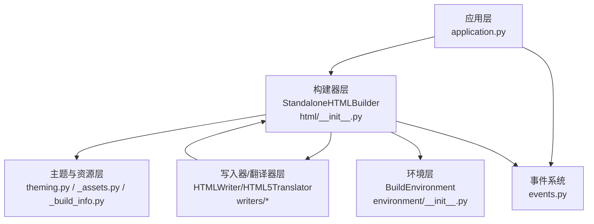
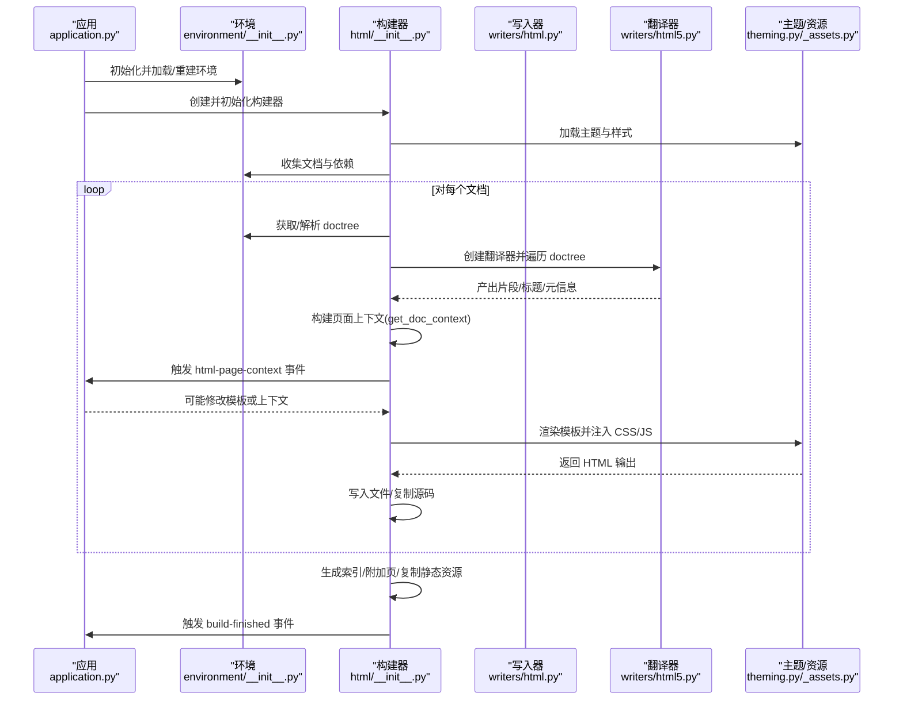
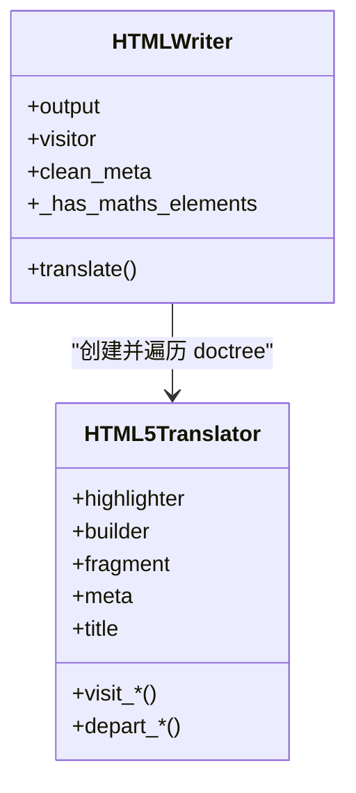
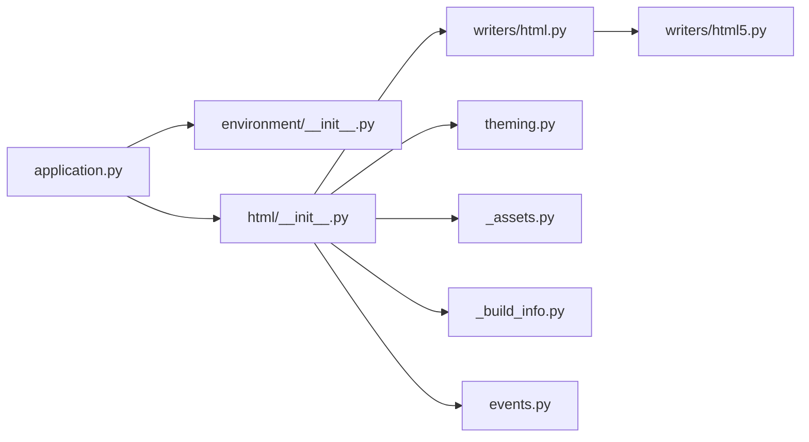

# 页面生成流程

<cite>
**本文档引用的文件**
- [sphinx\builders\html\__init__.py](file://sphinx/builders/html/__init__.py)
- [sphinx\writers\html5.py](file://sphinx/writers/html5.py)
- [sphinx\writers\html.py](file://sphinx/writers/html.py)
- [sphinx\application.py](file://sphinx/application.py)
- [sphinx\events.py](file://sphinx/events.py)
- [sphinx\environment\__init__.py](file://sphinx/environment/__init__.py)
- [sphinx\builders\html\_assets.py](file://sphinx/builders/html/_assets.py)
- [sphinx\builders\html\_build_info.py](file://sphinx/builders/html/_build_info.py)
- [sphinx\theming.py](file://sphinx/theming.py)
</cite>

## 目录
1. [简介](#简介)
2. [项目结构](#项目结构)
3. [核心组件](#核心组件)
4. [架构总览](#架构总览)
5. [详细组件分析](#详细组件分析)
6. [依赖关系分析](#依赖关系分析)
7. [性能考虑](#性能考虑)
8. [故障排除指南](#故障排除指南)
9. [结论](#结论)

## 简介
本文件面向 Sphinx HTML 页面生成流程，系统性阐述从文档树（doctree）到最终 HTML 页面的完整转换过程，重点覆盖以下方面：
- 文档树遍历与翻译器使用
- 片段渲染与局部节点输出
- 页面上下文构建（元数据、标题、内容、TOC、关系链接等）
- 页面事件系统（生成前后钩子）
- 页面自定义选项（模板选择、CSS/JS 注入、侧边栏配置）
- 性能优化策略与错误处理机制

## 项目结构
围绕 HTML 页面生成的关键模块与职责如下：
- 构建器层：负责扫描源文件、构建环境、调度写入、生成索引与附加页、复制静态资源等
- 写入器/翻译器层：将 doctree 转换为 HTML 字符串
- 应用与事件层：提供扩展点与事件回调
- 主题与资源层：主题加载、样式与脚本注入、校验与缓存
- 环境层：维护文档元数据、交叉引用解析、依赖追踪

图表来源
- [sphinx\application.py:420-494](file://sphinx/application.py#L420-L494)
- [sphinx\builders\html\__init__.py:109-185](file://sphinx/builders/html/__init__.py#L109-L185)
- [sphinx\writers\html.py:23-63](file://sphinx/writers/html.py#L23-L63)
- [sphinx\writers\html5.py:46-68](file://sphinx/writers/html5.py#L46-L68)
- [sphinx\environment\__init__.py:101-132](file://sphinx/environment/__init__.py#L101-L132)
- [sphinx\events.py:72-100](file://sphinx/events.py#L72-L100)
- [sphinx\theming.py:152-189](file://sphinx/theming.py#L152-L189)
- [sphinx\builders\html\_assets.py:15-61](file://sphinx/builders/html/_assets.py#L15-L61)
- [sphinx\builders\html\_build_info.py:18-79](file://sphinx/builders/html/_build_info.py#L18-L79)

章节来源
- [sphinx\builders\html\__init__.py:109-185](file://sphinx/builders/html/__init__.py#L109-L185)
- [sphinx\application.py:420-494](file://sphinx/application.py#L420-L494)

## 核心组件
- StandaloneHTMLBuilder：HTML 构建器，负责准备全局上下文、写入单个文档、生成额外页面、复制静态资源、写入构建信息等
- HTMLWriter/HTML5Translator：将 doctree 遍历并输出为 HTML 片段；HTMLWriter 负责收集片段与元信息
- BuildEnvironment：维护文档元数据、标题、目录树、交叉引用、依赖等
- Theme/HTMLThemeFactory：主题加载与配置合并，支持继承链与选项覆盖
- 资源管理：CSS/JS 注入、校验、优先级排序、查询参数版本戳
- 事件系统：在构建生命周期中提供钩子，如 html-collect-pages、html-page-context 等

章节来源
- [sphinx\builders\html\__init__.py:109-185](file://sphinx/builders/html/__init__.py#L109-L185)
- [sphinx\writers\html.py:23-63](file://sphinx/writers/html.py#L23-L63)
- [sphinx\writers\html5.py:46-68](file://sphinx/writers/html5.py#L46-L68)
- [sphinx\environment\__init__.py:101-132](file://sphinx/environment/__init__.py#L101-L132)
- [sphinx\theming.py:152-189](file://sphinx/theming.py#L152-L189)
- [sphinx\builders\html\_assets.py:15-61](file://sphinx/builders/html/_assets.py#L15-L61)
- [sphinx\builders\html\_build_info.py:18-79](file://sphinx/builders/html/_build_info.py#L18-L79)

## 架构总览
下图展示从应用初始化到页面写出的端到端流程：

图表来源
- [sphinx\application.py:434-494](file://sphinx/application.py#L434-L494)
- [sphinx\builders\html\__init__.py:427-666](file://sphinx/builders/html/__init__.py#L427-L666)
- [sphinx\writers\html.py:32-63](file://sphinx/writers/html.py#L32-L63)
- [sphinx\writers\html5.py:55-68](file://sphinx/writers/html5.py#L55-L68)
- [sphinx\environment\__init__.py:668-717](file://sphinx/environment/__init__.py#L668-L717)
- [sphinx\events.py:405-457](file://sphinx/events.py#L405-L457)
- [sphinx\theming.py:251-265](file://sphinx/theming.py#L251-L265)

## 详细组件分析

### 组件一：StandaloneHTMLBuilder（HTML 构建器）
- 初始化阶段
  - 创建构建信息对象，准备静态/下载/图片目录
  - 初始化模板引擎、高亮器、CSS/JS 列表
  - 解析配置项（文件后缀、链接后缀、索引开关等）
- 准备阶段（prepare_writing）
  - 构建搜索索引器
  - 收集域索引（domain_indices）
  - 格式化“最后更新”时间
  - 合并主题与用户配置到全局上下文 globalcontext
- 文档写入（write_doc）
  - 设置 doctree 的 settings
  - 使用 HTML5Translator 遍历 doctree，生成 body 与 clean_meta
  - 调用 get_doc_context 构建页面上下文
  - 触发 handle_page（含 html-page-context 钩子）
- 页面写出（handle_page）
  - 复制全局上下文，注入 pathto、hasdoc、toctree、sidebars 等辅助函数
  - 计算 CSS/JS 的链接与版本戳（查询参数）
  - 排序 CSS/JS（按 priority）
  - 渲染模板并写入文件
  - 可选复制源文件用于“显示源码”
- 附加页与索引生成
  - gen_indices：通用索引与域索引
  - gen_pages_from_extensions：通过 html-collect-pages 事件收集扩展生成的页面
  - gen_additional_pages：附加页、搜索页、OpenSearch XML
- 资源复制
  - 复制静态文件、额外文件、主题静态资源、logo/favicon
  - 写入 .buildinfo 以支持增量构建

章节来源
- [sphinx\builders\html\__init__.py:139-185](file://sphinx/builders/html/__init__.py#L139-L185)
- [sphinx\builders\html\__init__.py:427-559](file://sphinx/builders/html/__init__.py#L427-L559)
- [sphinx\builders\html\__init__.py:650-666](file://sphinx/builders/html/__init__.py#L650-L666)
- [sphinx\builders\html\__init__.py:1070-1258](file://sphinx/builders/html/__init__.py#L1070-L1258)
- [sphinx\builders\html\__init__.py:686-761](file://sphinx/builders/html/__init__.py#L686-L761)
- [sphinx\builders\html\__init__.py:694-706](file://sphinx/builders/html/__init__.py#L694-L706)
- [sphinx\builders\html\__init__.py:913-948](file://sphinx/builders/html/__init__.py#L913-L948)
- [sphinx\builders\html\__init__.py:950-954](file://sphinx/builders/html/__init__.py#L950-L954)

### 组件二：HTMLWriter 与 HTML5Translator（遍历与片段生成）
- HTMLWriter.translate
  - 创建翻译器并遍历 doctree，收集 head_prefix、stylesheet、head、body 前后缀、fragment、meta、title 等
  - 提取 clean_meta 与数学元素标记
- HTML5Translator.visit_* / depart_*
  - 实现各类节点访问器，将 doctree 节点映射为 HTML 片段
  - 处理代码块高亮、图像尺寸与缩放链接、标题编号与永久链接、表格/图注编号等
  - 支持多语言与主题选项（如可折叠 admonition）

图表来源
- [sphinx\writers\html.py:23-63](file://sphinx/writers/html.py#L23-L63)
- [sphinx\writers\html5.py:46-68](file://sphinx/writers/html5.py#L46-L68)

章节来源
- [sphinx\writers\html.py:32-63](file://sphinx/writers/html.py#L32-L63)
- [sphinx\writers\html5.py:604-631](file://sphinx/writers/html5.py#L604-L631)
- [sphinx\writers\html5.py:771-797](file://sphinx/writers/html5.py#L771-L797)

### 组件三：页面上下文构建（get_doc_context）
- 关系链接（prev/next/parents）与 rellinks
- 标题渲染（render_partial）
- 源文件名与拷贝控制
- 元数据（env.metadata）
- 局部 TOC 与全局 TOC 树
- 显示 TOC 的条件判断

章节来源
- [sphinx\builders\html\__init__.py:564-642](file://sphinx/builders/html/__init__.py#L564-L642)

### 组件四：页面事件系统（事件钩子）
- html-collect-pages：扩展可动态注册额外页面
- html-page-context：允许修改模板名、上下文（如替换模板）
- build-finished：构建完成时触发，可用于收尾任务

章节来源
- [sphinx\events.py:50-69](file://sphinx/events.py#L50-L69)
- [sphinx\events.py:405-457](file://sphinx/events.py#L405-L457)
- [sphinx\builders\html\__init__.py:694-706](file://sphinx/builders/html/__init__.py#L694-L706)
- [sphinx\builders\html\__init__.py:1187-1191](file://sphinx/builders/html/__init__.py#L1187-L1191)
- [sphinx\application.py:444-451](file://sphinx/application.py#L444-L451)

### 组件五：页面自定义选项
- 模板选择与上下文
  - toctree 辅助函数、pathto/hasdoc 工具、sidebars 列表
  - 通过 html-page-context 可替换模板名
- CSS 注入
  - 默认 pygments.css、暗色主题样式、主题样式表
  - 扩展注册与用户配置的 css_files（带 priority）
  - 链接自动附加版本戳（查询参数），避免缓存问题
- JavaScript 注入
  - 默认文档工具脚本、翻译脚本、MathJax（由数学渲染器决定）
  - 扩展注册与用户配置的 js_files（带 priority）
- 侧边栏与主题
  - 主题 sidebar_templates 与用户 html_sidebars 配置
  - 主题继承链与选项覆盖

章节来源
- [sphinx\builders\html\__init__.py:1070-1258](file://sphinx/builders/html/__init__.py#L1070-L1258)
- [sphinx\builders\html\__init__.py:260-311](file://sphinx/builders/html/__init__.py#L260-L311)
- [sphinx\builders\html\__init__.py:1040-1064](file://sphinx/builders/html/__init__.py#L1040-L1064)
- [sphinx\builders\html\_assets.py:15-109](file://sphinx/builders/html/_assets.py#L15-L109)
- [sphinx\builders\html\_assets.py:111-136](file://sphinx/builders/html/_assets.py#L111-L136)
- [sphinx\theming.py:58-144](file://sphinx/theming.py#L58-L144)

### 组件六：片段渲染与局部节点输出（render_partial）
- 将单个 doctree 节点包装为临时文档，应用 writer 的变换，再遍历生成 fragment 与 title
- 用于标题与 TOC 的局部渲染

章节来源
- [sphinx\builders\html\__init__.py:409-425](file://sphinx/builders/html/__init__.py#L409-L425)

## 依赖关系分析
- 构建器依赖于应用层的事件系统与配置，以及环境层提供的元数据与 doctree
- 写入器/翻译器依赖于构建器提供的高亮器、路径计算与资源上下文
- 主题与资源层为模板渲染提供样式与脚本，并进行校验与缓存
- 构建信息（.buildinfo）用于增量构建与一致性检查

图表来源
- [sphinx\application.py:420-494](file://sphinx/application.py#L420-L494)
- [sphinx\builders\html\__init__.py:109-185](file://sphinx/builders/html/__init__.py#L109-L185)
- [sphinx\writers\html.py:23-63](file://sphinx/writers/html.py#L23-L63)
- [sphinx\writers\html5.py:46-68](file://sphinx/writers/html5.py#L46-L68)
- [sphinx\theming.py:152-189](file://sphinx/theming.py#L152-L189)
- [sphinx\builders\html\_assets.py:15-61](file://sphinx/builders/html/_assets.py#L15-L61)
- [sphinx\builders\html\_build_info.py:18-79](file://sphinx/builders/html/_build_info.py#L18-L79)
- [sphinx\events.py:72-100](file://sphinx/events.py#L72-L100)

章节来源
- [sphinx\builders\html\__init__.py:188-190](file://sphinx/builders/html/__init__.py#L188-L190)
- [sphinx\builders\html\_build_info.py:25-45](file://sphinx/builders/html/_build_info.py#L25-L45)

## 性能考虑
- 增量构建
  - 通过 .buildinfo 比较配置与标签哈希，仅重建变更目标
  - 模板修改检测：若模板较新则全量重建
- 资源缓存与版本戳
  - CSS/JS 文件计算 CRC32 作为查询参数，避免浏览器缓存问题
  - 缓存函数减少重复计算
- 并行与任务队列
  - 构建器内部使用任务队列并行复制静态资源与生成索引
- 本地化与搜索
  - 搜索索引按需写入临时文件再原子替换，避免损坏
- 图像与下载文件
  - 仅在需要时生成缩放链接，避免不必要的包裹

章节来源
- [sphinx\builders\html\__init__.py:332-404](file://sphinx/builders/html/__init__.py#L332-L404)
- [sphinx\builders\html\__init__.py:950-954](file://sphinx/builders/html/__init__.py#L950-L954)
- [sphinx\builders\html\__init__.py:913-948](file://sphinx/builders/html/__init__.py#L913-L948)
- [sphinx\builders\html\__init__.py:1272-1288](file://sphinx/builders/html/__init__.py#L1272-L1288)
- [sphinx\builders\html\_assets.py:126-136](file://sphinx/builders/html/_assets.py#L126-L136)
- [sphinx\builders\html\__init__.py:961-988](file://sphinx/builders/html/__init__.py#L961-L988)

## 故障排除指南
- 主题兼容性
  - 若模板使用已废弃字段导致渲染异常，会提示使用新字段（如从 style 迁移到 styles）
- 资源路径与权限
  - 复制静态/额外文件失败会记录警告；检查路径是否存在、是否位于输出目录内
- 搜索索引加载
  - 索引加载失败不会中断构建，但会发出警告；确保磁盘空间与权限正确
- 数学渲染器
  - 未选择或未知的数学渲染器会导致配置错误；需在可用渲染器中选择
- 模板渲染异常
  - Unicode 错误时会给出明确提示，检查配置中的非 ASCII 字段编码
- 事件异常
  - 事件处理器抛出异常会被捕获并转为扩展错误，定位具体处理器模块

章节来源
- [sphinx\builders\html\__init__.py:1209-1238](file://sphinx/builders/html/__init__.py#L1209-L1238)
- [sphinx\builders\html\__init__.py:1350-1362](file://sphinx/builders/html/__init__.py#L1350-L1362)
- [sphinx\builders\html\__init__.py:932-934](file://sphinx/builders/html/__init__.py#L932-L934)
- [sphinx\builders\html\__init__.py:1000-1010](file://sphinx/builders/html/__init__.py#L1000-L1010)
- [sphinx\events.py:440-456](file://sphinx/events.py#L440-L456)

## 结论
Sphinx 的 HTML 页面生成流程以 StandaloneHTMLBuilder 为核心，结合 BuildEnvironment 的元数据与 doctree、HTMLWriter/HTML5Translator 的节点遍历与片段生成、Theme/Assets 的样式与脚本注入，以及事件系统的扩展能力，形成完整的端到端流水线。通过 .buildinfo 实现增量构建、资源版本戳避免缓存问题、并行任务提升效率，配合完善的错误处理与事件钩子，既保证了可扩展性也兼顾了稳定性与性能。