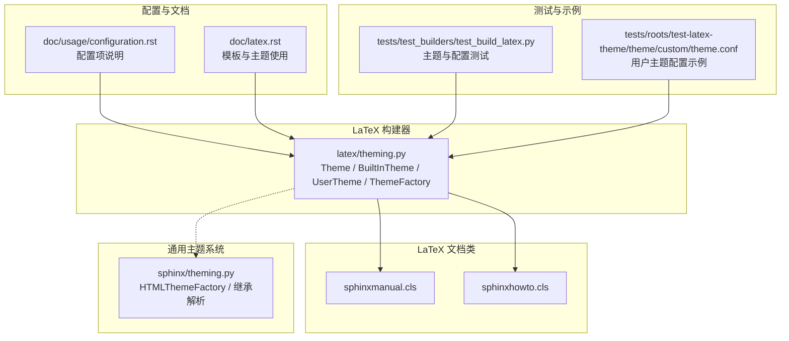
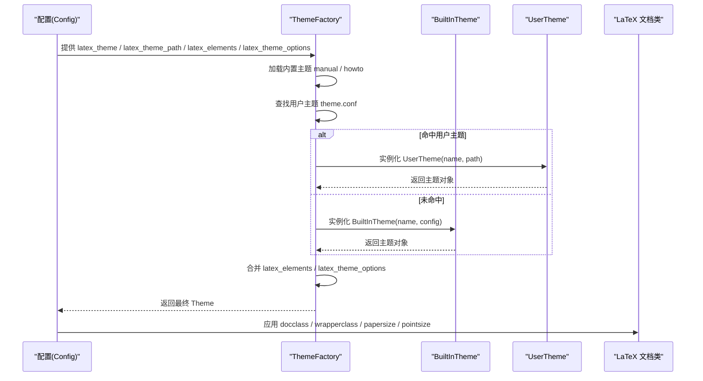
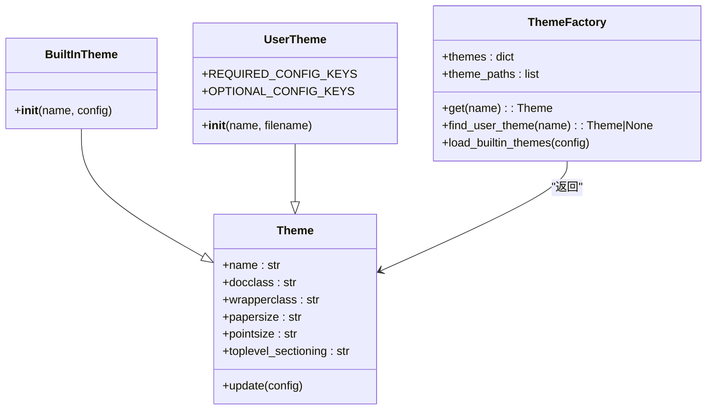
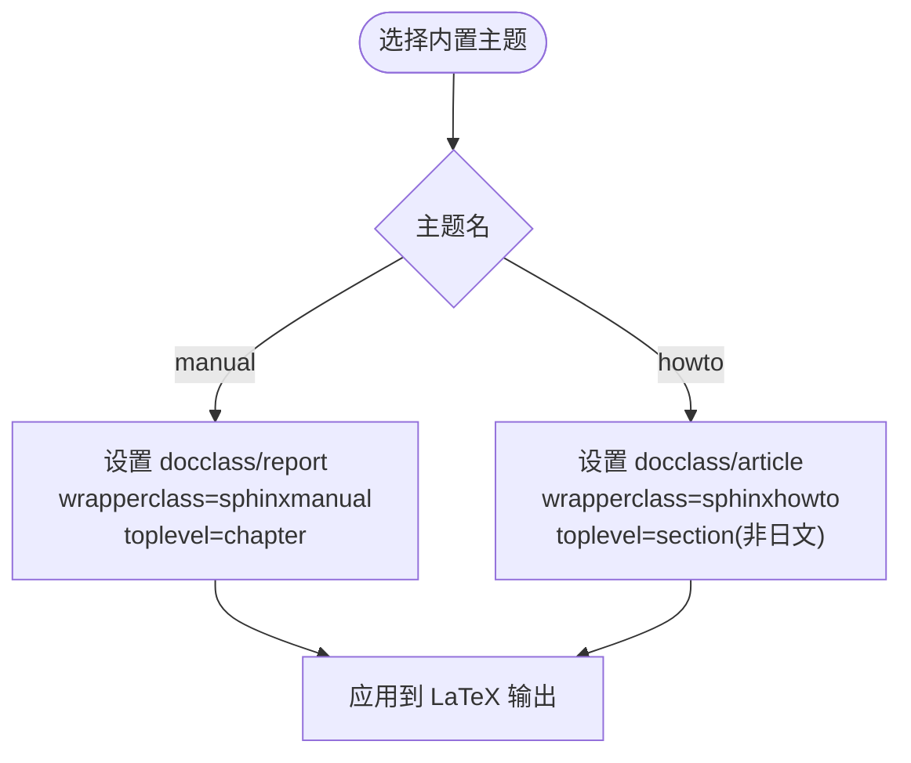
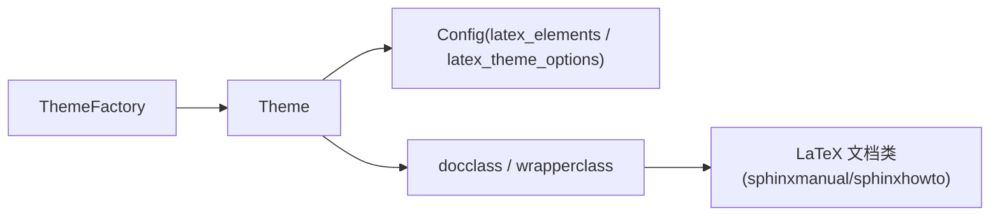

# LaTeX 主题系统

<cite>
**本文引用的文件**
- [sphinx/builders/latex/theming.py](file://sphinx/builders/latex/theming.py)
- [sphinx/theming.py](file://sphinx/theming.py)
- [sphinx/texinputs/sphinxmanual.cls](file://sphinx/texinputs/sphinxmanual.cls)
- [sphinx/texinputs/sphinxhowto.cls](file://sphinx/texinputs/sphinxhowto.cls)
- [doc/usage/configuration.rst](file://doc/usage/configuration.rst)
- [doc/latex.rst](file://doc/latex.rst)
- [tests/test_builders/test_build_latex.py](file://tests/test_builders/test_build_latex.py)
- [tests/roots/test-latex-theme/theme/custom/theme.conf](file://tests/roots/test-latex-theme/theme/custom/theme.conf)
</cite>

## 目录
1. [引言](#引言)
2. [项目结构](#项目结构)
3. [核心组件](#核心组件)
4. [架构总览](#架构总览)
5. [详细组件分析](#详细组件分析)
6. [依赖分析](#依赖分析)
7. [性能考虑](#性能考虑)
8. [故障排查指南](#故障排查指南)
9. [结论](#结论)
10. [附录](#附录)

## 引言
本文件面向 Sphinx LaTeX 主题系统，聚焦于 Theme 与 ThemeFactory 的设计与实现，系统性阐述主题加载、继承与定制机制；详解内置主题 manual、howto 的特性与适用场景；说明主题配置项（文档类选择、纸张尺寸、字体大小、版式设置等）；解释主题模板系统与 Jinja2 模板在 LaTeX 构建中的使用；并提供自定义主题开发指南与兼容性建议。

## 项目结构
围绕 LaTeX 主题系统的关键代码与资源分布如下：
- LaTeX 主题核心：位于 builders/latex/theming.py，包含 Theme、BuiltInTheme、UserTheme、ThemeFactory 等类与工厂方法。
- HTML 主题体系：位于 sphinx/theming.py，包含 Theme、HTMLThemeFactory、主题配置解析与继承链处理逻辑，便于理解通用主题机制。
- LaTeX 文档类：位于 sphinx/texinputs，包含 sphinxmanual.cls 与 sphinxhowto.cls，分别对应 manual 与 howto 主题的包装文档类。
- 配置与用法：位于 doc/usage/configuration.rst 与 doc/latex.rst，提供配置项说明与模板使用指引。
- 测试与示例：位于 tests/roots/test-latex-theme 与 tests/test_builders/test_build_latex.py，展示主题加载、配置覆盖与构建产物验证。

**图示来源**
- [sphinx/builders/latex/theming.py:20-136](file://sphinx/builders/latex/theming.py#L20-L136)
- [sphinx/texinputs/sphinxmanual.cls:1-129](file://sphinx/texinputs/sphinxmanual.cls#L1-L129)
- [sphinx/texinputs/sphinxhowto.cls:1-103](file://sphinx/texinputs/sphinxhowto.cls#L1-L103)
- [sphinx/theming.py:152-316](file://sphinx/theming.py#L152-L316)
- [doc/usage/configuration.rst:3275-3316](file://doc/usage/configuration.rst#L3275-L3316)
- [doc/latex.rst:1973-1995](file://doc/latex.rst#L1973-L1995)
- [tests/test_builders/test_build_latex.py:265-385](file://tests/test_builders/test_build_latex.py#L265-L385)
- [tests/roots/test-latex-theme/theme/custom/theme.conf:1-7](file://tests/roots/test-latex-theme/theme/custom/theme.conf#L1-L7)

**章节来源**
- [sphinx/builders/latex/theming.py:1-136](file://sphinx/builders/latex/theming.py#L1-L136)
- [sphinx/theming.py:152-316](file://sphinx/theming.py#L152-L316)
- [sphinx/texinputs/sphinxmanual.cls:1-129](file://sphinx/texinputs/sphinxmanual.cls#L1-L129)
- [sphinx/texinputs/sphinxhowto.cls:1-103](file://sphinx/texinputs/sphinxhowto.cls#L1-L103)
- [doc/usage/configuration.rst:3275-3316](file://doc/usage/configuration.rst#L3275-L3316)
- [doc/latex.rst:1973-1995](file://doc/latex.rst#L1973-L1995)
- [tests/test_builders/test_build_latex.py:265-385](file://tests/test_builders/test_build_latex.py#L265-L385)
- [tests/roots/test-latex-theme/theme/custom/theme.conf:1-7](file://tests/roots/test-latex-theme/theme/custom/theme.conf#L1-L7)

## 核心组件
- Theme（LaTeX）
  - 表示一组 LaTeX 配置，包含文档类、包装类、纸张尺寸、字体大小、顶层章节级别等。
  - 支持从 latex_elements 与 latex_theme_options 覆盖默认值。
- BuiltInTheme（LaTeX）
  - 内置主题，根据名称映射到具体文档类与包装类，并设置顶层章节级别。
- UserTheme（LaTeX）
  - 用户自定义主题，通过 theme.conf 解析必需与可选键，支持错误提示与缺失处理。
- ThemeFactory（LaTeX）
  - 工厂类，负责内置主题加载与用户主题查找，支持从 latex_theme_path 定位用户主题并实例化。

**章节来源**
- [sphinx/builders/latex/theming.py:20-136](file://sphinx/builders/latex/theming.py#L20-L136)

## 架构总览
LaTeX 主题系统以 ThemeFactory 为中心，按以下流程工作：
- 初始化时加载内置主题 manual 与 howto。
- 根据主题名优先使用内置主题，否则在 latex_theme_path 下查找用户主题配置文件 theme.conf。
- 将用户配置与全局配置（latex_elements、latex_theme_options）合并，得到最终主题对象。
- 构建阶段由 LaTeX 文档类（sphinxmanual.cls 或 sphinxhowto.cls）应用主题设置。

**图示来源**
- [sphinx/builders/latex/theming.py:101-136](file://sphinx/builders/latex/theming.py#L101-L136)
- [sphinx/texinputs/sphinxmanual.cls:1-129](file://sphinx/texinputs/sphinxmanual.cls#L1-L129)
- [sphinx/texinputs/sphinxhowto.cls:1-103](file://sphinx/texinputs/sphinxhowto.cls#L1-L103)

## 详细组件分析

### Theme 与 ThemeFactory（LaTeX）
- 设计要点
  - Theme 聚合主题配置，提供 update 合并用户配置的能力。
  - BuiltInTheme 基于名称推导 docclass/wrapperclass，并根据语言环境调整顶层章节级别。
  - UserTheme 通过 configparser 读取 theme.conf，校验必需项并容错可选项。
  - ThemeFactory 负责内置主题注册与用户主题发现，支持警告日志与路径遍历。
- 关键行为
  - 主题选择顺序：内置 > 用户主题 > 默认 Theme(name)。
  - 配置覆盖顺序：latex_elements > latex_theme_options > 用户 theme.conf > 内置默认值。
- 错误处理
  - 缺少 [theme] 段或必需键时抛出 ThemeError 并记录警告。
  - 用户主题路径不存在或非文件时跳过。

**图示来源**
- [sphinx/builders/latex/theming.py:20-136](file://sphinx/builders/latex/theming.py#L20-L136)

**章节来源**
- [sphinx/builders/latex/theming.py:20-136](file://sphinx/builders/latex/theming.py#L20-L136)

### 内置主题：manual 与 howto
- manual
  - 文档类映射：默认 report（日文文档默认 jreport），包装类 sphinxmanual。
  - 顶层章节级别：chapter。
  - 适用场景：手册、书籍类文档，需要分章编号与目录层级。
- howto
  - 文档类映射：默认 article（日文文档默认 jarticle），包装类 sphinxhowto。
  - 顶层章节级别：非日文为 section（无 \chapter），日文仍为 chapter。
  - 适用场景：文章、教程、快速上手文档，强调段落与小节组织。
- 文档类差异
  - sphinxmanual.cls：两面打印、章节编号与目录深度默认更偏向长文档。
  - sphinxhowto.cls：单面/两面可选、目录深度更深以适应短文档。

**图示来源**
- [sphinx/builders/latex/theming.py:53-68](file://sphinx/builders/latex/theming.py#L53-L68)
- [sphinx/texinputs/sphinxmanual.cls:1-129](file://sphinx/texinputs/sphinxmanual.cls#L1-L129)
- [sphinx/texinputs/sphinxhowto.cls:1-103](file://sphinx/texinputs/sphinxhowto.cls#L1-L103)

**章节来源**
- [sphinx/builders/latex/theming.py:53-68](file://sphinx/builders/latex/theming.py#L53-L68)
- [sphinx/texinputs/sphinxmanual.cls:1-129](file://sphinx/texinputs/sphinxmanual.cls#L1-L129)
- [sphinx/texinputs/sphinxhowto.cls:1-103](file://sphinx/texinputs/sphinxhowto.cls#L1-L103)

### 主题配置项与覆盖机制
- 可配置项
  - latex_theme：选择内置主题 manual 或 howto。
  - latex_theme_options：主题特定选项，如 papersize、pointsize。
  - latex_elements：LaTeX 元素字典，如 papersize、pointsize。
  - latex_docclass：映射 howto/manual 到真实文档类名。
  - latex_theme_path：用户主题目录列表。
- 覆盖优先级
  - latex_elements 与 latex_theme_options 覆盖用户 theme.conf 中同名键。
  - 用户 theme.conf 覆盖内置默认值。
- 示例验证
  - 测试覆盖了 latex_elements 与 latex_theme_options 对构建产物的影响，验证纸张与字号生效。

**章节来源**
- [doc/usage/configuration.rst:3275-3316](file://doc/usage/configuration.rst#L3275-L3316)
- [tests/test_builders/test_build_latex.py:348-385](file://tests/test_builders/test_build_latex.py#L348-L385)
- [tests/roots/test-latex-theme/theme/custom/theme.conf:1-7](file://tests/roots/test-latex-theme/theme/custom/theme.conf#L1-L7)

### 主题模板系统与 Jinja2 模板
- 模板位置与扩展名
  - 支持在项目 _templates/ 下放置 .jinja 扩展名的模板文件，用于生成 LaTeX 源。
  - 支持额外表渲染模板：longtable.tex.jinja、tabulary.tex.jinja、tabular.tex.jinja。
- 使用建议
  - 仅在需要精细控制 LaTeX 输出时使用自定义模板。
  - 注意模板变量不稳定且未公开文档，升级时需关注兼容性。
- 相关文档
  - 详见 doc/latex.rst 中关于实验性模板功能的说明。

**章节来源**
- [doc/latex.rst:1973-1995](file://doc/latex.rst#L1973-L1995)

### 自定义主题开发指南
- 文件结构
  - 在 latex_theme_path 指定的目录下创建子目录，作为主题名。
  - 在主题目录内放置 theme.conf，定义 [theme] 段与必需键 docclass、wrapperclass。
  - 可选键：papersize、pointsize、toplevel_sectioning。
- 配置示例
  - 参考 tests/roots/test-latex-theme/theme/custom/theme.conf，展示如何设置文档类、包装类与纸张/字号。
- 开发建议
  - 保持与内置主题一致的键名，确保覆盖链路正常工作。
  - 如需国际化或特殊文档类映射，结合 latex_docclass 与语言设置进行适配。
  - 使用 latex_theme_path 注册主题并在构建前验证配置文件存在与格式正确。

**章节来源**
- [sphinx/builders/latex/theming.py:104-136](file://sphinx/builders/latex/theming.py#L104-L136)
- [tests/roots/test-latex-theme/theme/custom/theme.conf:1-7](file://tests/roots/test-latex-theme/theme/custom/theme.conf#L1-L7)

## 依赖分析
- 组件耦合
  - ThemeFactory 依赖 Config 与 latex_theme_path，负责主题发现与实例化。
  - Theme.update 依赖 Config 的 latex_elements 与 latex_theme_options。
  - 文档类 sphinxmanual.cls / sphinxhowto.cls 依赖底层文档类（report/article 等）与 Sphinx 包装命令。
- 外部依赖
  - LaTeX 引擎与文档类生态（report/article/jreport/jsbook 等）。
  - 配置项 latex_docclass 与语言设置影响文档类选择。

**图示来源**
- [sphinx/builders/latex/theming.py:34-44](file://sphinx/builders/latex/theming.py#L34-L44)
- [sphinx/texinputs/sphinxmanual.cls:1-129](file://sphinx/texinputs/sphinxmanual.cls#L1-L129)
- [sphinx/texinputs/sphinxhowto.cls:1-103](file://sphinx/texinputs/sphinxhowto.cls#L1-L103)

**章节来源**
- [sphinx/builders/latex/theming.py:34-44](file://sphinx/builders/latex/theming.py#L34-L44)
- [sphinx/texinputs/sphinxmanual.cls:1-129](file://sphinx/texinputs/sphinxmanual.cls#L1-L129)
- [sphinx/texinputs/sphinxhowto.cls:1-103](file://sphinx/texinputs/sphinxhowto.cls#L1-L103)

## 性能考虑
- 主题加载
  - 用户主题查找按路径顺序扫描，建议精简 latex_theme_path，避免过多无效目录。
  - 避免在主题配置中引入重型依赖，减少构建时间。
- 配置覆盖
  - 合理使用 latex_theme_options 与 latex_elements，避免重复覆盖导致的调试成本。
- 模板使用
  - 自定义模板仅在必要时启用，避免过度定制带来的维护与兼容成本。

## 故障排查指南
- 常见问题
  - 主题未找到：检查 latex_theme 是否拼写正确，以及 latex_theme_path 下是否存在对应主题目录与 theme.conf。
  - 缺少必需键：UserTheme 在缺少 [theme] 段或必需键时会抛出 ThemeError，请对照 theme.conf 示例补齐。
  - 配置不生效：确认覆盖顺序，优先检查 latex_elements 与 latex_theme_options 是否与主题键冲突。
- 日志与告警
  - 用户主题加载失败会记录警告，注意查看构建输出中的 warning 信息。
- 验证方法
  - 通过测试用例风格断言构建产物中是否包含期望的文档类与纸张/字号参数，参考测试文件中的断言模式。

**章节来源**
- [sphinx/builders/latex/theming.py:125-135](file://sphinx/builders/latex/theming.py#L125-L135)
- [tests/test_builders/test_build_latex.py:265-385](file://tests/test_builders/test_build_latex.py#L265-L385)

## 结论
Sphinx LaTeX 主题系统以 ThemeFactory 为核心，结合内置与用户主题，通过明确的覆盖链路与配置项，实现了灵活的主题选择与定制能力。内置 manual 与 howto 主题分别面向长文档与短文档场景，配合 LaTeX 文档类实现稳定的排版效果。通过合理的配置与最小化定制，可在保证兼容性的前提下满足多样化的出版需求。

## 附录
- 相关配置项速览
  - latex_theme：选择 manual 或 howto。
  - latex_theme_options：主题特定选项（如 papersize、pointsize）。
  - latex_elements：LaTeX 元素字典（如 papersize、pointsize）。
  - latex_docclass：映射 howto/manual 到真实文档类。
  - latex_theme_path：用户主题目录列表。
- 模板与主题
  - 在 _templates/ 下使用 .jinja 模板扩展 LaTeX 输出。
  - 用户主题通过 theme.conf 定义基础配置。

**章节来源**
- [doc/usage/configuration.rst:3275-3316](file://doc/usage/configuration.rst#L3275-L3316)
- [doc/latex.rst:1973-1995](file://doc/latex.rst#L1973-L1995)