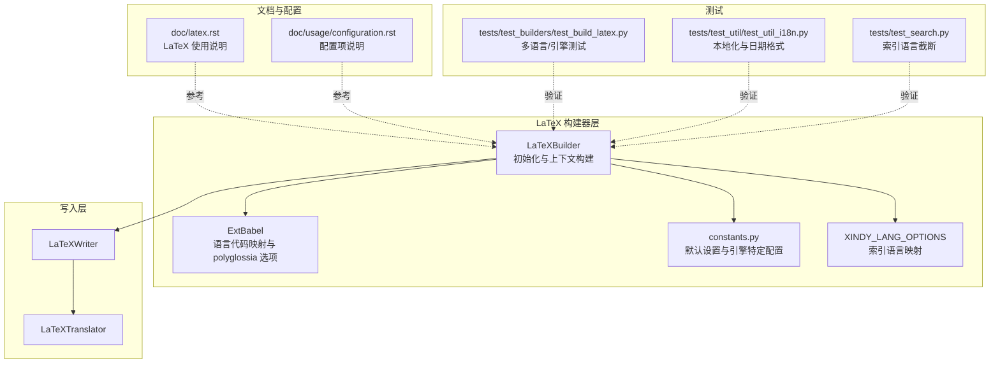
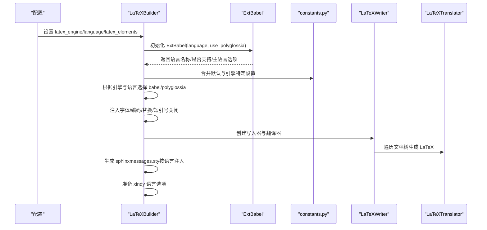
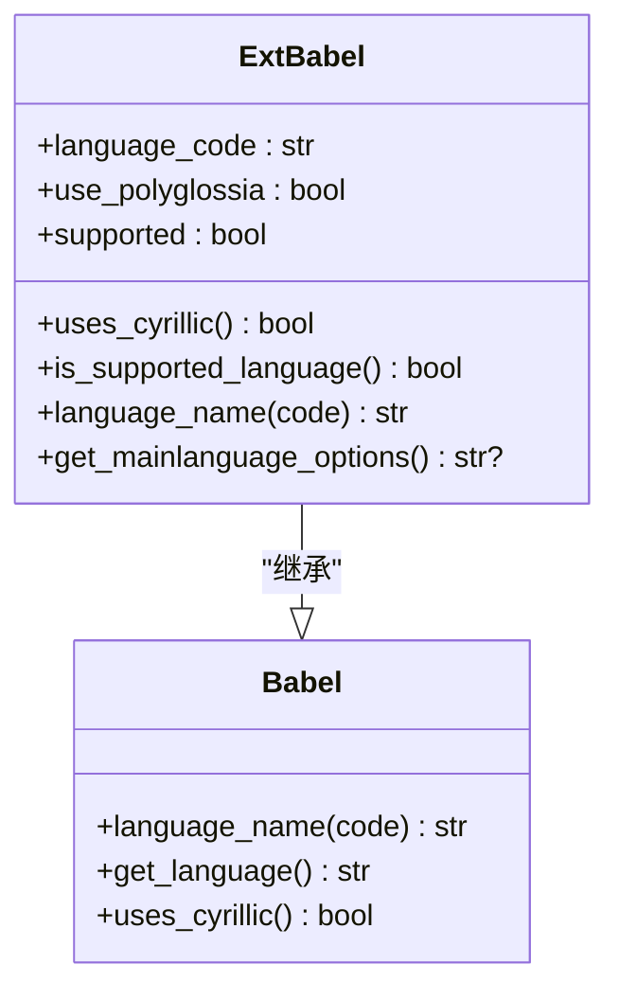
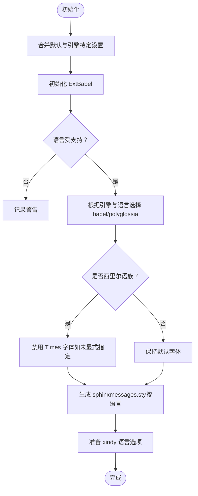
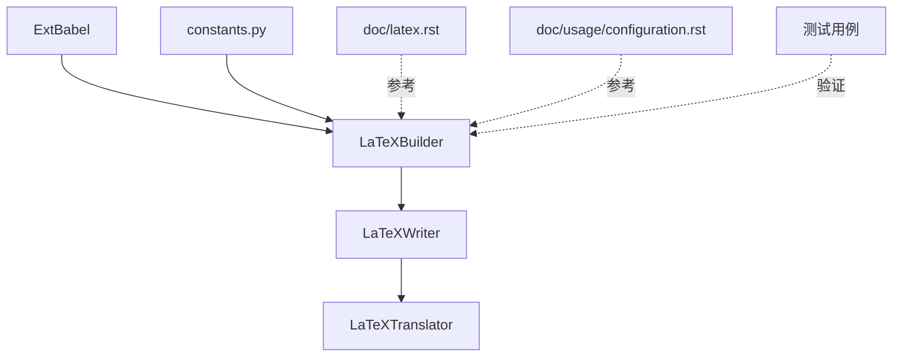

# LaTeX 国际化支持

<cite>
**本文档引用的文件**
- [sphinx\builders\latex\util.py](file://sphinx\builders\latex\util.py)
- [sphinx\builders\latex\__init__.py](file://sphinx\builders\latex\__init__.py)
- [sphinx\builders\latex\constants.py](file://sphinx\builders\latex\constants.py)
- [sphinx\writers\latex.py](file://sphinx\writers\latex.py)
- [doc\latex.rst](file://doc\latex.rst)
- [doc\usage\configuration.rst](file://doc\usage\configuration.rst)
- [tests\test_builders\test_build_latex.py](file://tests\test_builders\test_build_latex.py)
- [tests\test_util\test_util_i18n.py](file://tests\test_util\test_util_i18n.py)
- [tests\test_search.py](file://tests\test_search.py)
</cite>

## 目录
1. [简介](#简介)
2. [项目结构](#项目结构)
3. [核心组件](#核心组件)
4. [架构总览](#架构总览)
5. [详细组件分析](#详细组件分析)
6. [依赖关系分析](#依赖关系分析)
7. [性能考虑](#性能考虑)
8. [故障排除指南](#故障排除指南)
9. [结论](#结论)
10. [附录](#附录)

## 简介
本文件系统性阐述 Sphinx LaTeX 构建器的国际化功能，重点围绕 ExtBabel 类的实现与应用，覆盖多语言支持、语言代码映射、区域设置处理、不同 LaTeX 引擎（pdflatex、xelatex、lualatex）的语言支持差异、polyglossia 与 babel 的使用策略、西里尔字母与希腊字母等特殊字符集支持、索引语言设置（xindy）以及本地化日期格式处理。同时提供多语言项目的配置示例与常见问题解决方案，帮助读者在实际项目中正确配置与排错。

## 项目结构
围绕 LaTeX 国际化的核心代码主要分布在以下模块：
- 构建器与上下文：LaTeXBuilder、常量与默认设置、索引语言映射
- 多语言适配：ExtBabel 类（继承自 docutils Babel）
- 写入器：LaTeXWriter 与翻译器（LaTeXTranslator）
- 文档与配置：LaTeX 使用手册与配置项说明
- 测试用例：验证多语言、引擎差异与消息样式生成

**图表来源**
- [sphinx\builders\latex\__init__.py:110-137](file://sphinx\builders\latex\__init__.py#L110-L137)
- [sphinx\builders\latex\util.py:8-49](file://sphinx\builders\latex\util.py#L8-L49)
- [sphinx\builders\latex\constants.py:73-210](file://sphinx\builders\latex\constants.py#L73-L210)
- [sphinx\writers\latex.py:75-102](file://sphinx\writers\latex.py#L75-L102)
- [doc\latex.rst:120-192](file://doc\latex.rst#L120-L192)
- [doc\usage\configuration.rst:515-571](file://doc\usage\configuration.rst#L515-L571)
- [tests\test_builders\test_build_latex.py:744-965](file://tests\test_builders\test_build_latex.py#L744-L965)
- [tests\test_util\test_util_i18n.py:61-97](file://tests\test_util\test_util_i18n.py#L61-L97)
- [tests\test_search.py:365-374](file://tests\test_search.py#L365-L374)

**章节来源**
- [sphinx\builders\latex\__init__.py:110-137](file://sphinx\builders\latex\__init__.py#L110-L137)
- [sphinx\builders\latex\util.py:8-49](file://sphinx\builders\latex\util.py#L8-L49)
- [sphinx\builders\latex\constants.py:73-210](file://sphinx\builders\latex\constants.py#L73-L210)
- [sphinx\writers\latex.py:75-102](file://sphinx\writers\latex.py#L75-L102)
- [doc\latex.rst:120-192](file://doc\latex.rst#L120-L192)
- [doc\usage\configuration.rst:515-571](file://doc\usage\configuration.rst#L515-L571)
- [tests\test_builders\test_build_latex.py:744-965](file://tests\test_builders\test_build_latex.py#L744-L965)
- [tests\test_util\test_util_i18n.py:61-97](file://tests\test_util\test_util_i18n.py#L61-L97)
- [tests\test_search.py:365-374](file://tests\test_search.py#L365-L374)

## 核心组件
- ExtBabel 类：扩展 docutils Babel，负责语言名称映射、是否使用西里尔语族判断、polyglossia 主语言选项生成与未知语言回退策略。
- LaTeXBuilder：初始化 ExtBabel、根据引擎与语言选择 babel 或 polyglossia、注入字体与编码设置、生成消息样式 sphinxmessages.sty、配置 xindy。
- constants.py：定义默认设置与各引擎（pdflatex、xelatex、lualatex）的差异化配置，含字体包、编码、shorthandoff 等。
- 写入器与翻译器：LaTeXWriter 负责创建翻译器并遍历文档树输出 LaTeX；LaTeXTranslator 实现节点到 LaTeX 的转换。
- 测试用例：覆盖多语言、引擎差异、消息样式注入、日期格式本地化、索引语言截断等场景。

**章节来源**
- [sphinx\builders\latex\util.py:8-49](file://sphinx\builders\latex\util.py#L8-L49)
- [sphinx\builders\latex\__init__.py:215-273](file://sphinx\builders\latex\__init__.py#L215-L273)
- [sphinx\builders\latex\constants.py:73-210](file://sphinx\builders\latex\constants.py#L73-L210)
- [sphinx\writers\latex.py:75-102](file://sphinx\writers\latex.py#L75-L102)
- [tests\test_builders\test_build_latex.py:744-965](file://tests\test_builders\test_build_latex.py#L744-L965)

## 架构总览
下图展示从配置到最终 LaTeX 输出的关键流程，包括语言检测、引擎选择、包与字体配置、消息样式注入以及索引准备。

**图表来源**
- [sphinx\builders\latex\__init__.py:175-273](file://sphinx\builders\latex\__init__.py#L175-L273)
- [sphinx\builders\latex\util.py:11-48](file://sphinx\builders\latex\util.py#L11-L48)
- [sphinx\builders\latex\constants.py:125-210](file://sphinx\builders\latex\constants.py#L125-L210)
- [sphinx\writers\latex.py:95-101](file://sphinx\writers\latex.py#L95-L101)

## 详细组件分析

### ExtBabel 类分析
ExtBabel 继承自 docutils 的 Babel，扩展了对语言名称映射、西里尔语族识别、polyglossia 主语言选项生成与未知语言回退逻辑。

关键行为与规则：
- cyrillic_languages 列表：定义使用西里尔文字的语言集合。
- language_name：当语言为 ngerman 且使用 polyglossia 时，返回 german 以适配新正字法；若语言代码以 zh 开头，回退至英语但标记为“受支持”；否则标记不支持并回退英语。
- get_mainlanguage_options：针对德语生成 spelling 选项（新正字法或旧正字法），其他语言返回空。
- is_supported_language：返回是否支持当前语言。

**图表来源**
- [sphinx\builders\latex\util.py:8-49](file://sphinx\builders\latex\util.py#L8-L49)

**章节来源**
- [sphinx\builders\latex\util.py:8-49](file://sphinx\builders\latex\util.py#L8-L49)

### LaTeXBuilder 初始化与多语言配置
LaTeXBuilder 在初始化阶段完成：
- 初始化上下文（合并默认设置与引擎特定设置）
- 初始化 ExtBabel 并检查语言支持
- 根据引擎与语言选择 babel 或 polyglossia，并注入相应设置
- 处理西里尔语族与字体替换
- 生成消息样式 sphinxmessages.sty（按语言注入标题与标签）
- 配置 xindy 语言选项与脚本

**图表来源**
- [sphinx\builders\latex\__init__.py:175-273](file://sphinx\builders\latex\__init__.py#L175-L273)
- [sphinx\builders\latex\__init__.py:421-446](file://sphinx\builders\latex\__init__.py#L421-L446)

**章节来源**
- [sphinx\builders\latex\__init__.py:175-273](file://sphinx\builders\latex\__init__.py#L175-L273)
- [sphinx\builders\latex\__init__.py:421-446](file://sphinx\builders\latex\__init__.py#L421-L446)

### 不同 LaTeX 引擎的语言支持差异
- pdflatex：默认使用 babel；支持 UTF-8 输入与 Unicode 字符声明；对西里尔与希腊字符通过字体替换与编码包支持；默认字体包在西里尔语族下会被禁用。
- xelatex：默认使用 polyglossia；通过 fontspec 与 OpenType 字体（FreeSerif/Sans/Mono）提供更好的希腊/西里尔支持；可选启用 xeCJK 支持中文。
- lualatex：默认使用 polyglossia；行为与 xelatex 类似；法语默认回退到 babel（版本变更历史见文档）。

**章节来源**
- [doc\latex.rst:120-192](file://doc\latex.rst#L120-L192)
- [doc\latex.rst:374-406](file://doc\latex.rst#L374-L406)
- [sphinx\builders\latex\constants.py:125-210](file://sphinx\builders\latex\constants.py#L125-L210)
- [sphinx\builders\latex\__init__.py:548-556](file://sphinx\builders\latex\__init__.py#L548-L556)

### polyglossia 与 babel 的使用策略
- 默认策略：xelatex/lualatex 使用 polyglossia；pdflatex 使用 babel。
- 特殊语言/引擎组合：法语在 xelatex/lualatex 下默认使用 babel；中文在 xelatex 下默认使用 babel 并启用 xeCJK。
- 德语在 polyglossia 下区分新/旧正字法，通过主语言选项 spelling=new 或 spelling=old 控制。

**章节来源**
- [doc\latex.rst:120-192](file://doc\latex.rst#L120-L192)
- [sphinx\builders\latex\constants.py:188-210](file://sphinx\builders\latex\constants.py#L188-L210)
- [sphinx\builders\latex\util.py:37-48](file://sphinx\builders\latex\util.py#L37-L48)

### 西里尔字母、希腊字母与其他特殊字符集支持
- pdflatex：通过字体编码（X2、T2A）与字体替换宏包支持西里尔；通过 LGR 编码支持希腊字母；必要时启用字体替换与 textalpha。
- xelatex/lualatex：通过 fontspec 与 OpenType 字体原生支持希腊/西里尔；可选设置 greekfont/greekfontsf/greekfonttt。
- 中文：xelatex 下可启用 xeCJK 并调整 verbatim 环境格式。

**章节来源**
- [doc\latex.rst:374-406](file://doc\latex.rst#L374-L406)
- [sphinx\builders\latex\constants.py:10-72](file://sphinx\builders\latex\constants.py#L10-L72)
- [sphinx\builders\latex\constants.py:199-209](file://sphinx\builders\latex\constants.py#L199-L209)

### 索引语言设置（xindy）
LaTeXBuilder 提供 XINDY_LANG_OPTIONS 映射，将语言前缀映射到 xindy 模块与编码：
- 拉丁语系：按语言映射到对应 xindy 模块（如 english、german-din5007、french 等）。
- 西里尔语系：包含白俄罗斯语、保加利亚语、马其顿语、蒙古语、俄语、塞尔维亚语、乌克兰语等。
- 希腊语：仅适用于 xelatex/lualatex（pdflatex 不支持）。
- 其他：未知语言回退到 general 模块。

此外，还定义 XINDY_CYRILLIC_SCRIPTS 用于判断是否需要额外的 cyrLICRutf8.xdy 模块。

**章节来源**
- [sphinx\builders\latex\__init__.py:48-103](file://sphinx\builders\latex\__init__.py#L48-L103)
- [sphinx\builders\latex\__init__.py:421-446](file://sphinx\builders\latex\__init__.py#L421-L446)

### 本地化日期格式处理
Sphinx 在 LaTeX 构建过程中使用本地化日期格式：
- 通过 format_date 对日期进行本地化渲染，支持多种 strftime 格式与区域化输出。
- 当语言未知或为空时，回退到英语格式。
- 该能力由 util.i18n 提供，LaTeXBuilder 在生成上下文时调用 format_date 以设置日期变量。

**章节来源**
- [tests\test_util\test_util_i18n.py:61-97](file://tests\test_util\test_util_i18n.py#L61-L97)
- [sphinx\builders\latex\__init__.py:193-197](file://sphinx\builders\latex\__init__.py#L193-L197)

### 索引语言截断与构建
- 索引构建器会根据语言代码进行截断（例如 zh 与 zh_CN 都映射到 zh），确保索引按语言分组正确。
- 这一行为在测试中得到验证，确保不同语言变体不会导致重复或错误的索引条目。

**章节来源**
- [tests\test_search.py:365-374](file://tests\test_search.py#L365-L374)

## 依赖关系分析
- LaTeXBuilder 依赖 ExtBabel 完成语言映射与 polyglossia 选项生成。
- LaTeXBuilder 依赖 constants.py 提供默认设置与引擎特定配置。
- 写入器与翻译器链路负责将文档树转换为 LaTeX 输出。
- 测试用例覆盖多语言、引擎差异、消息样式注入与日期格式等关键路径。

**图表来源**
- [sphinx\builders\latex\__init__.py:110-137](file://sphinx\builders\latex\__init__.py#L110-L137)
- [sphinx\builders\latex\util.py:8-49](file://sphinx\builders\latex\util.py#L8-L49)
- [sphinx\builders\latex\constants.py:73-210](file://sphinx\builders\latex\constants.py#L73-L210)
- [sphinx\writers\latex.py:75-102](file://sphinx\writers\latex.py#L75-L102)

**章节来源**
- [sphinx\builders\latex\__init__.py:110-137](file://sphinx\builders\latex\__init__.py#L110-L137)
- [sphinx\builders\latex\util.py:8-49](file://sphinx\builders\latex\util.py#L8-L49)
- [sphinx\builders\latex\constants.py:73-210](file://sphinx\builders\latex\constants.py#L73-L210)
- [sphinx\writers\latex.py:75-102](file://sphinx\writers\latex.py#L75-L102)

## 性能考虑
- 选择合适的 LaTeX 引擎：xelatex/lualatex 在处理复杂字体与多语言时通常更高效，且无需复杂的字体替换。
- 合理使用 xindy：仅在需要高性能索引排序时启用，避免不必要的构建时间开销。
- 避免重复加载包：LaTeXBuilder 已内置默认设置，尽量通过 latex_elements 覆盖而非重复引入相同包。
- 本地化日期与消息样式：这些步骤在构建早期执行，对整体性能影响有限，但应避免频繁修改导致的重建。

## 故障排除指南
- 语言不受支持：
  - 现象：出现“无已知 Babel 选项”的警告。
  - 处理：确认 language 配置是否为受支持语言；必要时降级到英语或修正语言代码。
  - 参考：[测试用例:883-900](file://tests\test_builders\test_build_latex.py#L883-L900)
- 德语正字法问题：
  - 现象：polyglossia 下德语拼写选项不正确。
  - 处理：确认语言代码（如 de-1901）以触发旧正字法；否则默认新正字法。
  - 参考：[测试用例:940-958](file://tests\test_builders\test_build_latex.py#L940-L958)
- 西里尔语族字体异常：
  - 现象：pdflatex 下 Times 字体与西里尔字符冲突。
  - 处理：LaTeXBuilder 已自动禁用 Times 字体；如需自定义字体，请在 latex_elements 中显式设置 fontpkg。
  - 参考：[LaTeXBuilder 初始化:257-262](file://sphinx\builders\latex\__init__.py#L257-L262)
- 希腊/西里尔字符显示异常：
  - 现象：pdflatex 下希腊或西里尔字符缺失。
  - 处理：切换到 xelatex/lualatex；或在 pdflatex 下启用 LGR/X2 编码与字体替换。
  - 参考：[LaTeX 使用手册:374-406](file://doc\latex.rst#L374-L406)
- 法语在 xelatex/lualatex 下仍使用 polyglossia：
  - 现象：默认回退到 babel。
  - 处理：如需强制 polyglossia，可在 latex_elements 中手动设置 polyglossia。
  - 参考：[引擎特定设置:188-198](file://sphinx\builders\latex\constants.py#L188-L198)
- 中文与 verbatim 空格问题：
  - 现象：xeCJK 与 fancyvrb 的空格差异。
  - 处理：LaTeXBuilder 已设置 formatcom 参数；如仍有问题，可进一步微调 latex_elements。
  - 参考：[引擎特定设置:199-205](file://sphinx\builders\latex\constants.py#L199-L205)
- 索引语言不匹配：
  - 现象：不同语言变体导致索引混乱。
  - 处理：确认语言代码前缀映射；zh 与 zh_CN 将统一映射到 zh。
  - 参考：[索引语言映射:48-103](file://sphinx\builders\latex\__init__.py#L48-L103)

**章节来源**
- [tests\test_builders\test_build_latex.py:883-900](file://tests\test_builders\test_build_latex.py#L883-L900)
- [tests\test_builders\test_build_latex.py:940-958](file://tests\test_builders\test_build_latex.py#L940-L958)
- [sphinx\builders\latex\__init__.py:257-262](file://sphinx\builders\latex\__init__.py#L257-L262)
- [doc\latex.rst:374-406](file://doc\latex.rst#L374-L406)
- [sphinx\builders\latex\constants.py:188-205](file://sphinx\builders\latex\constants.py#L188-L205)
- [sphinx\builders\latex\__init__.py:48-103](file://sphinx\builders\latex\__init__.py#L48-L103)

## 结论
Sphinx 的 LaTeX 国际化支持通过 ExtBabel 与 LaTeXBuilder 的协同工作，实现了对多语言、多引擎、多字符集的全面覆盖。pdflatex 提供稳定的 babel 支持与字体替换机制；xelatex/lualatex 则借助 polyglossia 与 fontspec 提供更优的字体与字符集支持。配合 xindy 的索引语言映射与本地化消息样式生成，用户可以构建高质量的多语言 PDF 文档。遵循本文档提供的配置建议与故障排除方法，可显著提升构建稳定性与输出质量。

## 附录

### 多语言项目配置示例
- 英语（默认）：无需额外设置，LaTeXBuilder 自动选择 pdflatex 与 babel。
- 德语（polyglossia 新正字法）：设置 language=de，引擎为 xelatex/lualatex，默认生成 spelling=new。
- 德语（polyglossia 旧正字法）：设置 language=de-1901，引擎为 xelatex/lualatex，默认生成 spelling=old。
- 法语（xelatex/lualatex 回退到 babel）：设置 language=fr，引擎为 xelatex/lualatex，默认使用 babel。
- 中文（xelatex）：设置 language=zh，引擎为 xelatex，默认使用 babel 并启用 xeCJK。
- 西里尔语族（pdflatex）：设置 language=ru/bg 等，LaTeXBuilder 自动禁用 Times 字体并启用字体替换。
- 希腊语（xelatex/lualatex）：设置 language=el，引擎为 xelatex/lualatex，默认启用字体替换与 greekfont。

**章节来源**
- [doc\usage\configuration.rst:515-571](file://doc\usage\configuration.rst#L515-L571)
- [doc\latex.rst:120-192](file://doc\latex.rst#L120-L192)
- [sphinx\builders\latex\constants.py:188-209](file://sphinx\builders\latex\constants.py#L188-L209)
- [sphinx\builders\latex\__init__.py:548-556](file://sphinx\builders\latex\__init__.py#L548-L556)