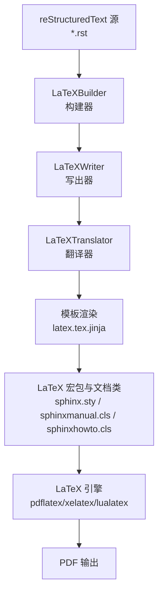
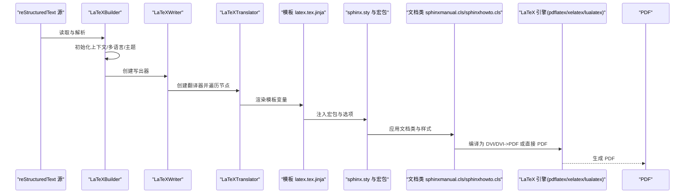
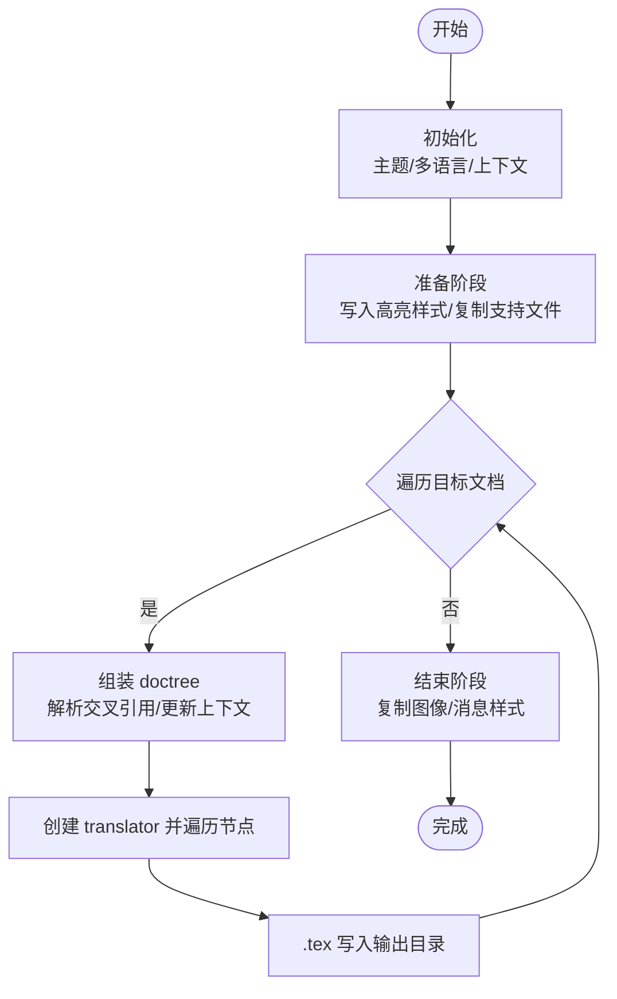
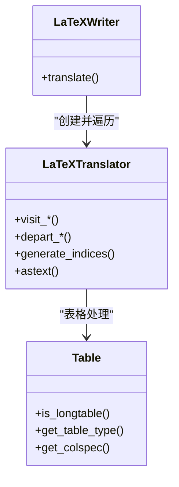
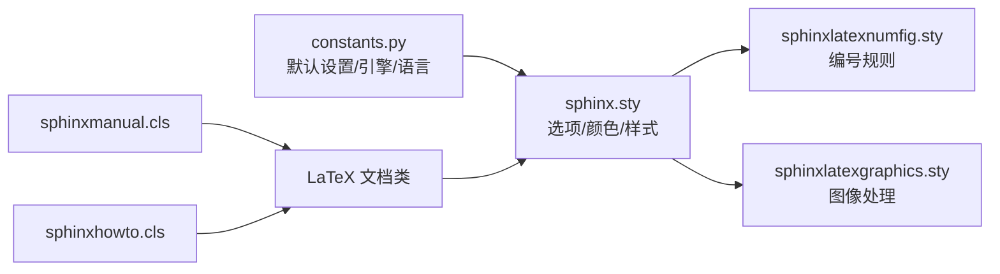
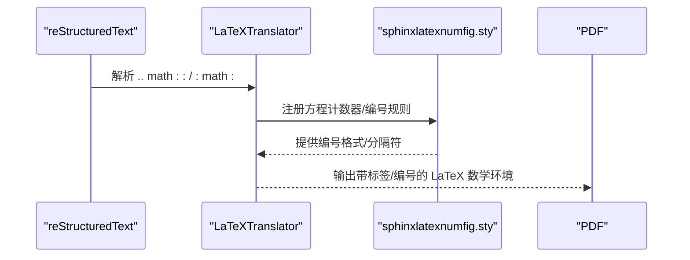
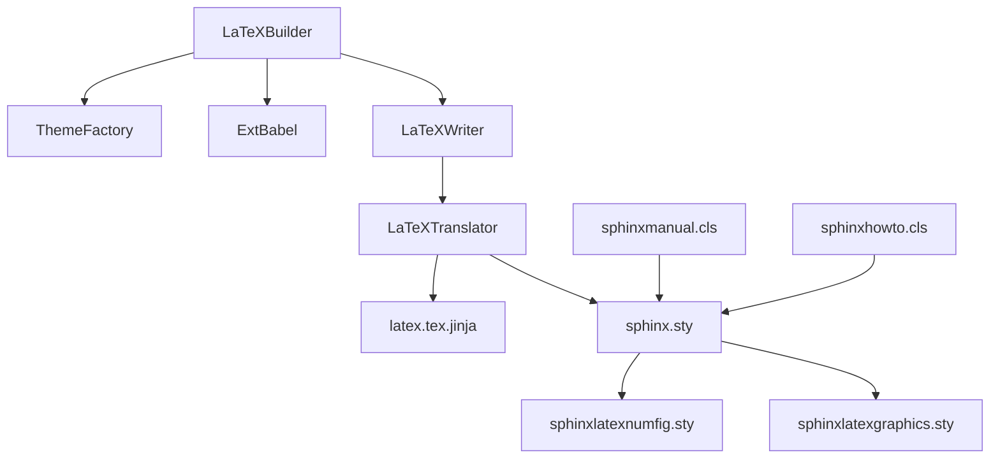

# LaTeX 构建器

<cite>
**本文档引用的文件**
- [sphinx\builders\latex\__init__.py](file://sphinx\builders\latex\__init__.py)
- [sphinx\writers\latex.py](file://sphinx\writers\latex.py)
- [sphinx\builders\latex\constants.py](file://sphinx\builders\latex\constants.py)
- [sphinx\builders\latex\theming.py](file://sphinx\builders\latex\theming.py)
- [sphinx\builders\latex\util.py](file://sphinx\builders\latex\util.py)
- [sphinx\builders\latex\nodes.py](file://sphinx\builders\latex\nodes.py)
- [sphinx\texinputs\sphinxmanual.cls](file://sphinx\texinputs\sphinxmanual.cls)
- [sphinx\texinputs\sphinxhowto.cls](file://sphinx\texinputs\sphinxhowto.cls)
- [sphinx\texinputs\sphinx.sty](file://sphinx\texinputs\sphinx.sty)
- [sphinx\texinputs\sphinxlatexnumfig.sty](file://sphinx\texinputs\sphinxlatexnumfig.sty)
- [sphinx\texinputs\sphinxlatexgraphics.sty](file://sphinx\texinputs\sphinxlatexgraphics.sty)
- [sphinx\templates\latex\latex.tex.jinja](file://sphinx\templates\latex\latex.tex.jinja)
- [tests\test_builders\test_build_latex.py](file://tests\test_builders\test_build_latex.py)
- [tests\roots\test-latex-equations\equations.rst](file://tests\roots\test-latex-equations\equations.rst)
- [tests\roots\test-latex-equations\conf.py](file://tests\roots\test-latex-equations\conf.py)
</cite>

## 目录
1. [简介](#简介)
2. [项目结构](#项目结构)
3. [核心组件](#核心组件)
4. [架构总览](#架构总览)
5. [详细组件分析](#详细组件分析)
6. [依赖关系分析](#依赖关系分析)
7. [性能考量](#性能考量)
8. [故障排查指南](#故障排查指南)
9. [结论](#结论)
10. [附录](#附录)

## 简介
本文件面向使用 Sphinx 的作者与维护者，系统性阐述 LaTeX 构建器从 reStructuredText 到 LaTeX 源码再到 PDF 的完整转换流程；详解 LaTeX 宏包系统、文档类选择与主题配置；覆盖数学公式、图表、交叉引用与索引生成机制；并给出 LaTeX 配置项（字体、页面布局、边距、语言）的深入说明与 PDF 生成优化建议及常见编译问题的解决方案。

## 项目结构
围绕 LaTeX 构建器的关键代码与资源分布如下：
- 构建器入口与控制流：sphinx\builders\latex\__init__.py
- 写出器与翻译器：sphinx\writers\latex.py
- 常量与默认设置：sphinx\builders\latex\constants.py
- 主题与文档类：sphinx\builders\latex\theming.py
- 多语言辅助：sphinx\builders\latex\util.py
- LaTeX 节点扩展：sphinx\builders\latex\nodes.py
- LaTeX 文档类：sphinx\texinputs\sphinxmanual.cls、sphinx\texinputs\sphinxhowto.cls
- 核心宏包：sphinx\texinputs\sphinx.sty、sphinx\texinputs\sphinxlatexnumfig.sty、sphinx\texinputs\sphinxlatexgraphics.sty
- 模板：sphinx\templates\latex\latex.tex.jinja
- 测试用例与示例：tests\test_builders\test_build_latex.py、tests\roots\test-latex-equations\*

图示来源
- [sphinx\builders\latex\__init__.py:110-646](file://sphinx\builders\latex\__init__.py#L110-L646)
- [sphinx\writers\latex.py:75-102](file://sphinx\writers\latex.py#L75-L102)
- [sphinx\templates\latex\latex.tex.jinja:1-110](file://sphinx\templates\latex\latex.tex.jinja#L1-L110)

章节来源
- [sphinx\builders\latex\__init__.py:110-646](file://sphinx\builders\latex\__init__.py#L110-L646)
- [sphinx\writers\latex.py:75-102](file://sphinx\writers\latex.py#L75-L102)
- [sphinx\templates\latex\latex.tex.jinja:1-110](file://sphinx\templates\latex\latex.tex.jinja#L1-L110)

## 核心组件
- LaTeXBuilder：负责收集文档树、装配目录树、解析交叉引用、写入 .tex 文件、复制支持文件与附加文件、生成高亮样式表等。
- LaTeXWriter：Docutils Writer，委托给 LaTeXTranslator 进行节点遍历与输出。
- LaTeXTranslator：SphinxTranslator 子类，将 Docutils 节点映射为 LaTeX 命令与环境，处理表格、浮动体、索引、目录深度、编号策略等。
- Theme/ThemeFactory：主题与文档类管理，支持内置 manual/howto 与用户自定义主题，合并 latex_elements 与 latex_theme_options。
- Constants：默认 LaTeX 设置字典、引擎特定附加设置、语言特定设置、babel/shorthand 配置。
- LaTeX 模板：latex.tex.jinja 将上下文变量注入到最终 .tex 输出。
- LaTeX 宏包：sphinx.sty 及其子宏包（编号、图形、列表、容器、样式等）提供 Sphinx 特定功能与兼容性。

章节来源
- [sphinx\builders\latex\__init__.py:110-646](file://sphinx\builders\latex\__init__.py#L110-L646)
- [sphinx\writers\latex.py:75-102](file://sphinx\writers\latex.py#L75-L102)
- [sphinx\builders\latex\constants.py:73-219](file://sphinx\builders\latex\constants.py#L73-L219)
- [sphinx\builders\latex\theming.py:20-136](file://sphinx\builders\latex\theming.py#L20-L136)
- [sphinx\texinputs\sphinx.sty:1-200](file://sphinx\texinputs\sphinx.sty#L1-L200)
- [sphinx\templates\latex\latex.tex.jinja:1-110](file://sphinx\templates\latex\latex.tex.jinja#L1-L110)

## 架构总览
下图展示从源码到 PDF 的端到端流程，以及关键组件之间的交互：

图示来源
- [sphinx\builders\latex\__init__.py:289-350](file://sphinx\builders\latex\__init__.py#L289-L350)
- [sphinx\writers\latex.py:95-102](file://sphinx\writers\latex.py#L95-L102)
- [sphinx\templates\latex\latex.tex.jinja:1-110](file://sphinx\templates\latex\latex.tex.jinja#L1-L110)
- [sphinx\texinputs\sphinx.sty:1-200](file://sphinx\texinputs\sphinx.sty#L1-L200)
- [sphinx\texinputs\sphinxmanual.cls:1-129](file://sphinx\texinputs\sphinxmanual.cls#L1-L129)
- [sphinx\texinputs\sphinxhowto.cls:1-103](file://sphinx\texinputs\sphinxhowto.cls#L1-L103)

## 详细组件分析

### LaTeXBuilder 工作流
- 初始化阶段：建立主题工厂、初始化 LaTeX 转义、准备 babel/polyglossia、计算日期与 logo、合并 latex_elements。
- 文档数据初始化：校验 latex_documents 并提取标题信息。
- 准备阶段：写入高亮样式表、复制支持文件（含 Makefile/latexmkrc 预设）、复制附加文件。
- 写入阶段：对每个目标文档：
  - 获取 doctree，内联 toctree，解析交叉引用，替换远端引用为可读文本。
  - 更新 doccontext 与全局 context（包、表样式、日期、logo 等）。
  - 创建 translator，遍历节点，输出 .tex。
- 结束阶段：复制图像与消息样式文件（用于多语言标题与格式化）。

图示来源
- [sphinx\builders\latex\__init__.py:127-420](file://sphinx\builders\latex\__init__.py#L127-L420)

章节来源
- [sphinx\builders\latex\__init__.py:127-420](file://sphinx\builders\latex\__init__.py#L127-L420)

### LaTeXWriter 与 LaTeXTranslator
- LaTeXWriter：封装 Docutils Writer，创建 translator 并收集输出。
- LaTeXTranslator：
  - 维护节级计数、目录深度、编号深度、多语言命令重定义。
  - 表格处理：自动选择 longtable/tabular/tabulary，列宽与列类型推断。
  - 图像处理：安全缩放与尺寸限制，适配表格中的图。
  - 数学公式：支持带标签与不带标签的公式，配合 sphinxlatexnumfig.sty 实现跨章节编号。
  - 索引生成：按域与索引类型生成索引条目与页码引用。
  - 标签与超链接：生成锚点与标签，支持跨文件引用。

图示来源
- [sphinx\writers\latex.py:75-102](file://sphinx\writers\latex.py#L75-L102)
- [sphinx\writers\latex.py:337-800](file://sphinx\writers\latex.py#L337-L800)
- [sphinx\writers\latex.py:107-195](file://sphinx\writers\latex.py#L107-L195)

章节来源
- [sphinx\writers\latex.py:75-102](file://sphinx\writers\latex.py#L75-L102)
- [sphinx\writers\latex.py:337-800](file://sphinx\writers\latex.py#L337-L800)

### LaTeX 宏包系统与文档类
- 默认设置与引擎差异：constants.py 提供不同引擎（pdflatex/xelatex/lualatex/platex/uplatex）的默认宏包、字体与编码设置，并在特定语言（如 zh/fr/el）应用额外选项。
- 文档类：sphinxmanual.cls 与 sphinxhowto.cls 分别对应 report/article 风格，提供标题页、目录、索引与参考文献的排版钩子。
- 核心宏包 sphinx.sty：统一选项处理、颜色系统、表格风格（booktabs/borderless/colorrows）、代码块与内联字面量、主题样式注入、几何参数等。
- 子宏包：
  - sphinxlatexnumfig.sty：跨章节编号与分隔符配置。
  - sphinxlatexgraphics.sty：图像安全插入、表格中图的处理。

图示来源
- [sphinx\builders\latex\constants.py:73-219](file://sphinx\builders\latex\constants.py#L73-L219)
- [sphinx\texinputs\sphinx.sty:1-200](file://sphinx\texinputs\sphinx.sty#L1-L200)
- [sphinx\texinputs\sphinxlatexnumfig.sty:1-136](file://sphinx\texinputs\sphinxlatexnumfig.sty#L1-L136)
- [sphinx\texinputs\sphinxlatexgraphics.sty:1-124](file://sphinx\texinputs\sphinxlatexgraphics.sty#L1-L124)
- [sphinx\texinputs\sphinxmanual.cls:1-129](file://sphinx\texinputs\sphinxmanual.cls#L1-L129)
- [sphinx\texinputs\sphinxhowto.cls:1-103](file://sphinx\texinputs\sphinxhowto.cls#L1-L103)

章节来源
- [sphinx\builders\latex\constants.py:73-219](file://sphinx\builders\latex\constants.py#L73-L219)
- [sphinx\texinputs\sphinx.sty:1-200](file://sphinx\texinputs\sphinx.sty#L1-L200)
- [sphinx\texinputs\sphinxlatexnumfig.sty:1-136](file://sphinx\texinputs\sphinxlatexnumfig.sty#L1-L136)
- [sphinx\texinputs\sphinxlatexgraphics.sty:1-124](file://sphinx\texinputs\sphinxlatexgraphics.sty#L1-L124)
- [sphinx\texinputs\sphinxmanual.cls:1-129](file://sphinx\texinputs\sphinxmanual.cls#L1-L129)
- [sphinx\texinputs\sphinxhowto.cls:1-103](file://sphinx\texinputs\sphinxhowto.cls#L1-L103)

### 主题与文档类选择
- 主题：BuiltInTheme 支持 manual/howto，默认文档类由 latex_docclass 映射；UserTheme 支持通过 theme.conf 自定义。
- latex_theme_options：允许覆盖 papersize、pointsize 等；latex_elements：覆盖底层 LaTeX 设置（如 fontenc、babel、geometry 等）。
- latex_toplevel_sectioning：控制顶层节级（part/chapter/section），影响目录深度与编号策略。

章节来源
- [sphinx\builders\latex\theming.py:20-136](file://sphinx\builders\latex\theming.py#L20-L136)
- [sphinx\builders\latex\__init__.py:575-587](file://sphinx\builders\latex\__init__.py#L575-L587)

### 数学公式处理
- 公式节点：LaTeXTranslator 将 :math: 与 .. math:: 节点转为 LaTeX 数学环境；支持带标签与不带标签。
- 编号与引用：sphinxlatexnumfig.sty 在 begin{document} 后重定义计数器与 \thefigure/\thetable/\theliteralblock 等，实现跨章节编号与分隔符配置；LaTeXBuilder 与 Translator 协同生成标签与引用。
- 测试验证：测试用例覆盖带标签与不带标签的公式、跨文档引用等场景。

图示来源
- [sphinx\writers\latex.py:554-604](file://sphinx\writers\latex.py#L554-L604)
- [sphinx\texinputs\sphinxlatexnumfig.sty:1-136](file://sphinx\texinputs\sphinxlatexnumfig.sty#L1-L136)
- [tests\roots\test-latex-equations\equations.rst:1-21](file://tests\roots\test-latex-equations\equations.rst#L1-L21)

章节来源
- [sphinx\writers\latex.py:554-604](file://sphinx\writers\latex.py#L554-L604)
- [sphinx\texinputs\sphinxlatexnumfig.sty:1-136](file://sphinx\texinputs\sphinxlatexnumfig.sty#L1-L136)
- [tests\roots\test-latex-equations\equations.rst:1-21](file://tests\roots\test-latex-equations\equations.rst#L1-L21)

### 图表插入与表格处理
- 图像：sphinxlatexgraphics.sty 提供安全缩放与尺寸限制，避免过宽或过高导致的排版问题；表格中的图采用 sphinxfigure-in-table 环境。
- 表格：LaTeXTranslator 的 Table 类根据内容与样式自动选择 longtable/tabular/tabulary；支持 colwidths、booktabs、borderless、colorrows 等选项。

章节来源
- [sphinx\texinputs\sphinxlatexgraphics.sty:1-124](file://sphinx\texinputs\sphinxlatexgraphics.sty#L1-L124)
- [sphinx\writers\latex.py:107-195](file://sphinx\writers\latex.py#L107-L195)

### 交叉引用与索引生成
- 交叉引用：LaTeXBuilder 在解析阶段替换远端引用为可读文本；LaTeXTranslator 生成标签与超链接。
- 索引：LaTeXTranslator 依据 latex_domain_indices 与各域的索引类生成索引条目与页码引用；模板中注入索引环境与打印命令。

章节来源
- [sphinx\builders\latex\__init__.py:399-415](file://sphinx\builders\latex\__init__.py#L399-L415)
- [sphinx\writers\latex.py:554-604](file://sphinx\writers\latex.py#L554-L604)

### LaTeX 配置选项详解
- latex_engine：pdflatex/xelatex/lualatex/platex/uplatex，默认值按语言与文档类型推断。
- latex_documents：定义根文档、输出文件名、标题、作者与主题。
- latex_logo：页眉/标题区徽标。
- latex_appendices：附加章节列表。
- latex_use_latex_multicolumn：是否使用 LaTeX 原生 multicolumn。
- latex_use_xindy：是否启用 xindy（xelatex/lualatex 默认启用）。
- latex_toplevel_sectioning：顶层节级（part/chapter/section）。
- latex_domain_indices：是否生成域索引。
- latex_show_urls/latex_show_pagerefs：URL 与页码引用显示策略。
- latex_elements：底层 LaTeX 设置（fontenc、babel、geometry、preamble 等）。
- latex_additional_files：复制到输出目录的额外文件。
- latex_table_style：表格样式（booktabs、borderless、colorrows）。
- latex_theme/latex_theme_options/latex_theme_path：主题选择与覆盖。
- latex_docclass：手动/小册子文档类映射（按语言与引擎）。

章节来源
- [sphinx\builders\latex\__init__.py:590-646](file://sphinx\builders\latex\__init__.py#L590-L646)
- [sphinx\builders\latex\__init__.py:575-587](file://sphinx\builders\latex\__init__.py#L575-L587)
- [sphinx\builders\latex\constants.py:73-219](file://sphinx\builders\latex\constants.py#L73-L219)

## 依赖关系分析
- 构建器依赖：LaTeXBuilder 依赖 ThemeFactory、ExtBabel、常量与模板渲染器；调用 LaTeXWriter/Translator 完成节点遍历与输出。
- 写出器依赖：LaTeXWriter 依赖 LaTeXBuilder；LaTeXTranslator 依赖主题、babel、高亮桥接器与模板渲染器。
- 宏包依赖：模板注入 sphinx.sty 与若干子宏包；文档类加载底层 LaTeX class 并提供钩子。

图示来源
- [sphinx\builders\latex\__init__.py:110-200](file://sphinx\builders\latex\__init__.py#L110-L200)
- [sphinx\writers\latex.py:75-102](file://sphinx\writers\latex.py#L75-L102)
- [sphinx\texinputs\sphinx.sty:1-200](file://sphinx\texinputs\sphinx.sty#L1-L200)

章节来源
- [sphinx\builders\latex\__init__.py:110-200](file://sphinx\builders\latex\__init__.py#L110-L200)
- [sphinx\writers\latex.py:75-102](file://sphinx\writers\latex.py#L75-L102)

## 性能考量
- 表格渲染：优先使用 tabulary 以提升长表格与自适应列宽的稳定性；合理设置 colwidths 与列类型减少 LaTeX 报警。
- 图像处理：避免过大图像；利用安全缩放避免溢出；必要时手动指定 width/height。
- 编号与索引：仅在需要时启用域索引；控制 numfig 与数学编号范围，减少 LaTeX 编译时间。
- 字体与编码：xelatex/lualatex 下尽量使用系统字体与 polyglossia，减少字体替换开销。
- 并行与增量：LaTeXBuilder 支持并行写入，注意避免输出冲突；合理组织 latex_documents 以减少无关文件编译。

## 故障排查指南
- 语言与字体问题
  - 使用 xelatex/lualatex 时，若出现希腊字符或中日文排版异常，检查 constants 中针对语言的附加设置（如 xeCJK、el 对应字体）。
  - 若 babel/polyglossia 不支持的语言被指定，会发出警告；请修正 language 或使用 polyglossia 选项。
- 编码与字符
  - pdflatex 默认启用 utf8extra 与 nobreakspace 处理；确保输入文件为 UTF-8。
- 表格与浮动体
  - 长表格自动切换 longtable；若出现列类型冲突，检查列规格与样式组合。
- 数学公式
  - 带标签公式需确保标签唯一；跨章节编号由 sphinxlatexnumfig.sty 控制，确认 numfig 与 math_numfig 配置。
- 索引与交叉引用
  - 确认 latex_domain_indices 与各域索引类已正确生成；检查引用目标是否存在。
- PDF 生成
  - xindy 与 hyperref 冲突时，模板会关闭 hyperref 的索引补丁；确保使用正确的 make/latexmk 配置。
  - 若出现“重复目标”警告，检查 hyperref 与索引宏包顺序。

章节来源
- [sphinx\builders\latex\constants.py:125-219](file://sphinx\builders\latex\constants.py#L125-L219)
- [sphinx\writers\latex.py:554-604](file://sphinx\writers\latex.py#L554-L604)
- [sphinx\templates\latex\latex.tex.jinja:22-29](file://sphinx\templates\latex\latex.tex.jinja#L22-L29)

## 结论
Sphinx LaTeX 构建器通过严谨的节点翻译、宏包系统与文档类协作，实现了从 reStructuredText 到高质量 PDF 的端到端流程。借助灵活的主题与配置体系，用户可在字体、页面布局、语言支持与数学/图表/索引等方面进行精细定制。遵循本文档的配置与优化建议，可显著提升编译效率与输出质量。

## 附录
- 测试用例参考
  - 主题与语言设置：tests/test_builders/test_build_latex.py
  - 数学公式与编号：tests/roots/test-latex-equations/*

章节来源
- [tests\test_builders\test_build_latex.py:348-385](file://tests\test_builders\test_build_latex.py#L348-L385)
- [tests\roots\test-latex-equations\conf.py:1-2](file://tests\roots\test-latex-equations\conf.py#L1-L2)
- [tests\roots\test-latex-equations\equations.rst:1-21](file://tests\roots\test-latex-equations\equations.rst#L1-L21)