# LaTeX 翻译器

<cite>
**本文档引用的文件**
- [sphinx\writers\latex.py](file://sphinx/writers/latex.py)
- [sphinx\builders\latex\__init__.py](file://sphinx/builders/latex/__init__.py)
- [sphinx\builders\latex\nodes.py](file://sphinx/builders/latex/nodes.py)
- [sphinx\builders\latex\constants.py](file://sphinx/builders/latex/constants.py)
- [sphinx\util\texescape.py](file://sphinx/util/texescape.py)
</cite>

## 目录
1. [简介](#简介)
2. [项目结构](#项目结构)
3. [核心组件](#核心组件)
4. [架构总览](#架构总览)
5. [详细组件分析](#详细组件分析)
6. [依赖分析](#依赖分析)
7. [性能考虑](#性能考虑)
8. [故障排查指南](#故障排查指南)
9. [结论](#结论)
10. [附录](#附录)

## 简介
本文件面向 Sphinx 的 LaTeX 翻译器，系统性阐述从 Docutils 节点到 LaTeX 代码的转换流程与实现细节。重点覆盖以下方面：
- LaTeXTranslator 的工作原理与控制流
- 各类 Docutils 节点（文本、标题、列表、表格、代码块、图像、交叉引用、索引、数学公式等）的处理逻辑
- 自定义节点的设计与使用
- LaTeX 命令生成规则、特殊字符转义与编码策略
- 数学公式、图像嵌入、交叉引用与索引生成
- 性能优化建议与调试方法

## 项目结构
围绕 LaTeX 构建与翻译的关键模块如下：
- 构建器：负责组装 doctree、准备上下文、写入输出、复制支持文件
- 翻译器：将 Docutils 节点树遍历并生成 LaTeX 文本
- 节点扩展：补充 LaTeX 特定的节点类型
- 常量与默认设置：LaTeX 引擎、字体、宏包、几何参数等
- LaTeX 转义工具：统一处理特殊字符与 Unicode 映射

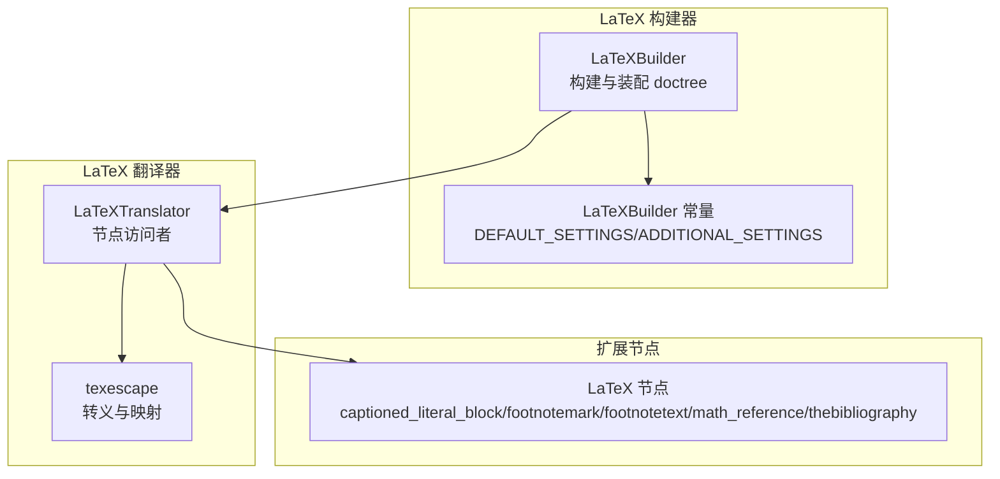

**图表来源**
- [sphinx\builders\latex\__init__.py:110-126](file://sphinx/builders/latex/__init__.py#L110-L126)
- [sphinx\writers\latex.py:337-498](file://sphinx/writers/latex.py#L337-L498)
- [sphinx\builders\latex\nodes.py:8-44](file://sphinx/builders/latex/nodes.py#L8-L44)
- [sphinx\builders\latex\constants.py:73-123](file://sphinx/builders/latex/constants.py#L73-L123)

**章节来源**
- [sphinx\builders\latex\__init__.py:110-126](file://sphinx/builders/latex/__init__.py#L110-L126)
- [sphinx\writers\latex.py:337-498](file://sphinx/writers/latex.py#L337-L498)
- [sphinx\builders\latex\nodes.py:8-44](file://sphinx/builders/latex/nodes.py#L8-L44)
- [sphinx\builders\latex\constants.py:73-123](file://sphinx/builders/latex/constants.py#L73-L123)

## 核心组件
- LaTeXBuilder：LaTeX 输出的构建入口，负责 doctree 组装、主题与上下文初始化、模板变量更新、样式表与支持文件复制、最终写入 .tex 文件。
- LaTeXTranslator：继承自 SphinxTranslator，实现对 Docutils 节点的访问与渲染，维护状态栈（如表格、列表、标题层级）、生成 LaTeX 命令序列、处理高亮与转义。
- LaTeX 节点扩展：在 LaTeX 环境中需要的特殊节点，如带标题的代码块容器、脚注标记/文本、数学公式引用、参考文献容器等。
- LaTeX 转义工具：按不同 LaTeX 引擎（pdflatex/xelatex/lualatex）提供字符映射与转义策略，确保输出稳定。

**章节来源**
- [sphinx\builders\latex\__init__.py:289-350](file://sphinx/builders/latex/__init__.py#L289-L350)
- [sphinx\writers\latex.py:337-498](file://sphinx/writers/latex.py#L337-L498)
- [sphinx\builders\latex\nodes.py:8-44](file://sphinx/builders/latex/nodes.py#L8-L44)
- [sphinx\util\texescape.py:106-122](file://sphinx/util/texescape.py#L106-L122)

## 架构总览
LaTeX 构建流程概览：
- 初始化：构建器读取配置，初始化 Babel、多语言、主题与上下文，准备模板变量。
- 组装 doctree：内联 toctree、解析交叉引用、处理附加章节。
- 创建翻译器：为每个目标文档创建 LaTeXTranslator 并遍历节点树。
- 渲染输出：调用模板渲染 LaTeX 主体、索引与尾部内容，写入 .tex 文件。
- 复制资源：复制高亮样式、额外文件、支持文件与图标。

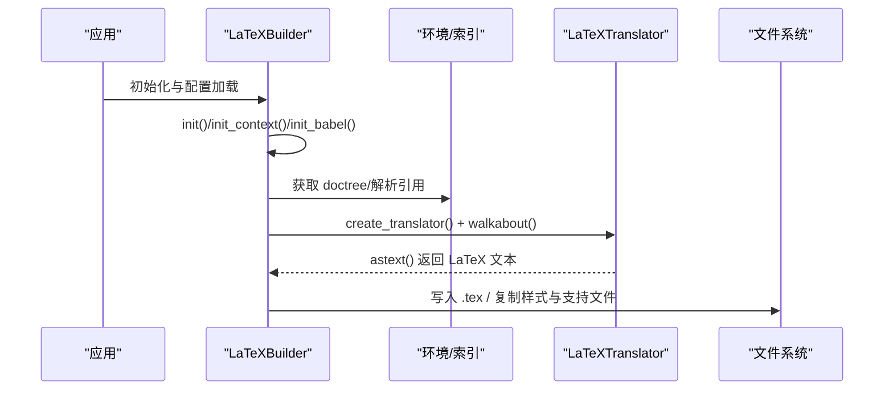

**图表来源**
- [sphinx\builders\latex\__init__.py:127-350](file://sphinx/builders/latex/__init__.py#L127-L350)
- [sphinx\writers\latex.py:95-101](file://sphinx/writers/latex.py#L95-L101)

**章节来源**
- [sphinx\builders\latex\__init__.py:127-350](file://sphinx/builders/latex/__init__.py#L127-L350)

## 详细组件分析

### LaTeXTranslator 类与控制流
- 状态管理：维护标题层级、列表/表格/标题/脚注/最小页面等标志位；通过 bodystack 与 context 栈管理嵌套结构。
- 上下文与主题：复制 builder.context，结合主题与配置（如 numfig、tocdepth、secnumdepth）生成元素字典。
- 访问者模式：为每种 Docutils 节点实现 visit_* / depart_* 方法，按需生成 LaTeX 命令或容器。
- 高亮与转义：使用 PygmentsBridge 生成代码高亮片段；使用 texescape.escape 进行字符转义；URI 编码遵循 hyperref 约束。

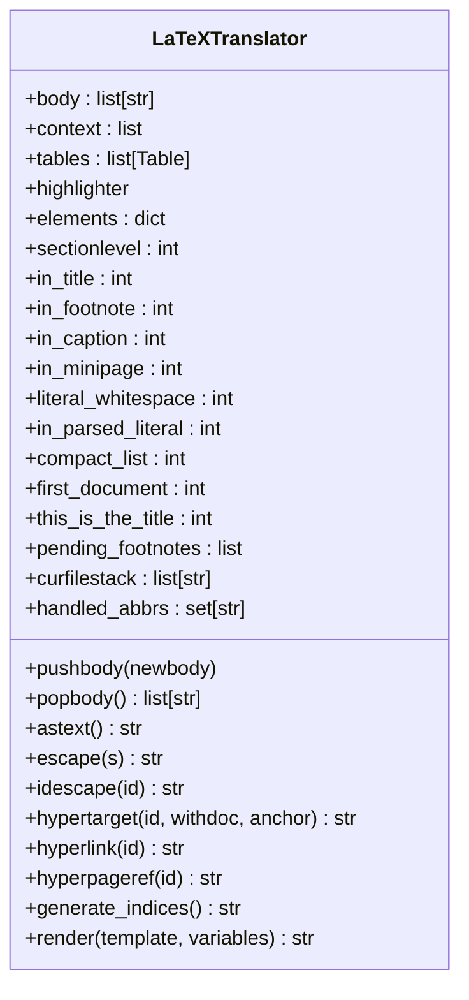

**图表来源**
- [sphinx\writers\latex.py:337-514](file://sphinx/writers/latex.py#L337-L514)

**章节来源**
- [sphinx\writers\latex.py:337-514](file://sphinx/writers/latex.py#L337-L514)

### 文本节点与字符转义
- visit_Text：对 Text 节点进行编码与空白处理，支持保留等宽空格与换行。
- encode：根据是否处于等宽上下文，替换换行与空格以避免 LaTeX 报错。
- encode_uri：对链接 URI 进行编码，保留 ~、-、' 等字符原义。
- texescape.escape：按引擎类型选择映射表，处理特殊字符、ASCII 曲引号、连字符、Unicode 符号等。

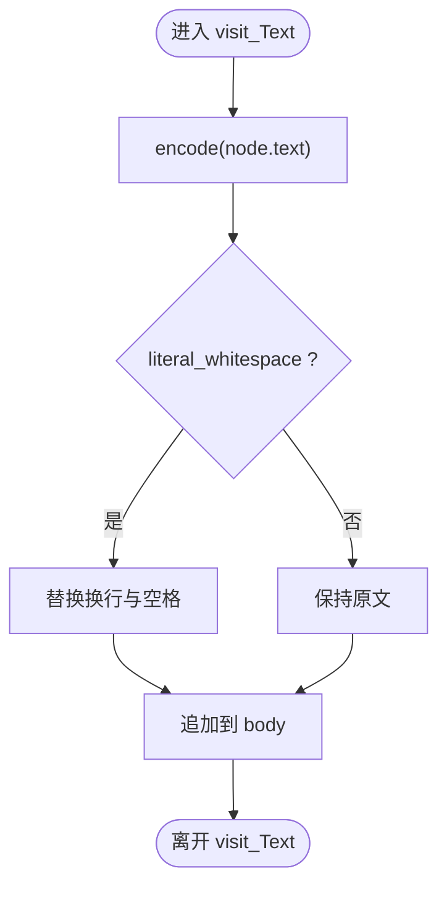

**图表来源**
- [sphinx\writers\latex.py:2487-2512](file://sphinx/writers/latex.py#L2487-L2512)
- [sphinx\writers\latex.py:2487-2505](file://sphinx/writers/latex.py#L2487-L2505)
- [sphinx\util\texescape.py:106-122](file://sphinx/util/texescape.py#L106-L122)

**章节来源**
- [sphinx\writers\latex.py:2487-2512](file://sphinx/writers/latex.py#L2487-L2512)
- [sphinx\writers\latex.py:2495-2505](file://sphinx/writers/latex.py#L2495-L2505)
- [sphinx\util\texescape.py:106-122](file://sphinx/util/texescape.py#L106-L122)

### 标题节点处理
- visit_title：根据父节点类型选择命令（如 section、topic、sidebar、table），并插入超链接标签。
- depart_title：关闭上下文，处理表格标题的延迟输出。
- 标题层级：基于主题与配置调整顶层节级别，支持 part/chapter/section 等映射。

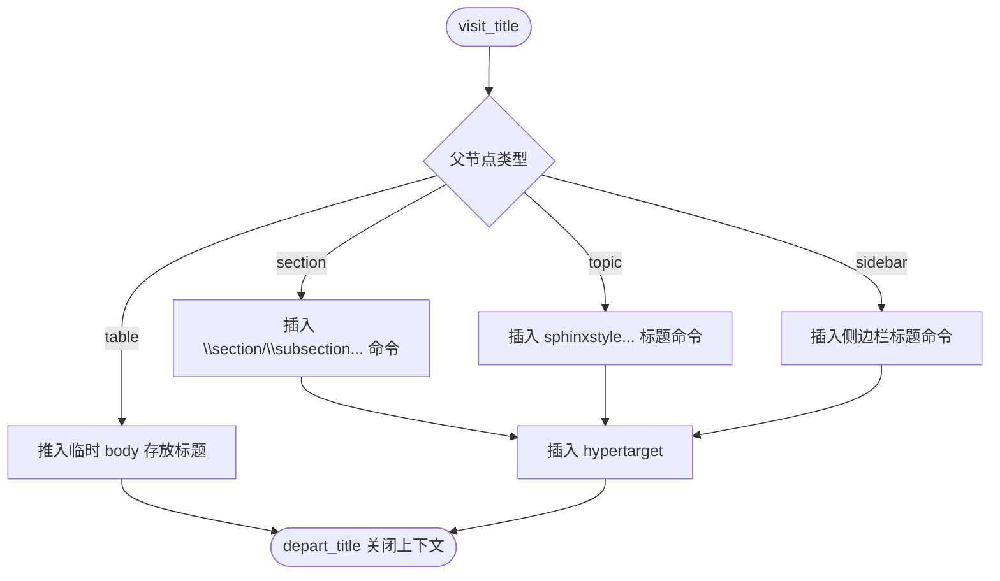

**图表来源**
- [sphinx\writers\latex.py:721-784](file://sphinx/writers/latex.py#L721-L784)

**章节来源**
- [sphinx\writers\latex.py:721-784](file://sphinx/writers/latex.py#L721-L784)

### 列表节点处理
- 无序列表：使用 itemize 环境。
- 有序列表：使用 enumerate 环境，按嵌套层级生成枚举计数器，支持前缀/后缀与起始编号。
- 定义列表：使用 description 环境。
- 行列列表：使用 multicol + itemize 实现多列布局。
- 列表项：插入 \item{}，避免与下一个 [ 开头的文本冲突。

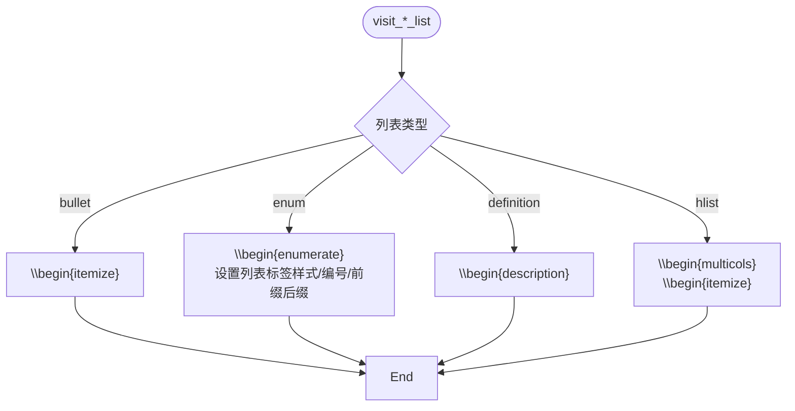

**图表来源**
- [sphinx\writers\latex.py:1450-1492](file://sphinx/writers/latex.py#L1450-L1492)
- [sphinx\writers\latex.py:1588-1601](file://sphinx/writers/latex.py#L1588-L1601)

**章节来源**
- [sphinx\writers\latex.py:1450-1492](file://sphinx/writers/latex.py#L1450-L1492)
- [sphinx\writers\latex.py:1588-1601](file://sphinx/writers/latex.py#L1588-L1601)

### 表格节点处理
- Table/TableCell 数据结构：记录行列、合并单元格、列规格、宽度、样式（booktabs/borderless/standard/colorrows）。
- 环境选择：根据长表格需求、列宽/列规格、是否包含 verbatim 决定使用 longtable、tabulary 或 tabular。
- 单元格：支持多行/多列合并、对齐、变宽列 varwidth、跨线/竖线宏。
- 标题：表格标题延迟到 depart_table，渲染时传入标签。

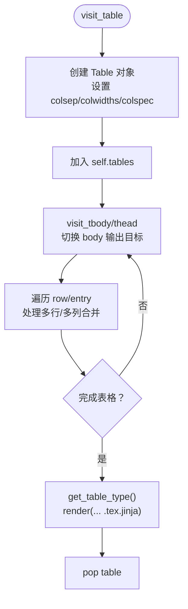

**图表来源**
- [sphinx\writers\latex.py:107-195](file://sphinx/writers/latex.py#L107-L195)
- [sphinx\writers\latex.py:1170-1246](file://sphinx/writers/latex.py#L1170-L1246)

**章节来源**
- [sphinx\writers\latex.py:107-195](file://sphinx/writers/latex.py#L107-L195)
- [sphinx\writers\latex.py:1170-1246](file://sphinx/writers/latex.py#L1170-L1246)

### 代码块节点处理
- 解析字面量：若源文本与纯文本不一致，视为解析字面量，使用 sphinxalltt。
- 语法高亮：通过 PygmentsBridge 生成高亮代码，按引擎注入对应 Verbatim 环境。
- 长代码分块：超过阈值时拆分为多个长代码块环境，保持行号连续。
- 表格内代码：提升为 sphinxVerbatimintable，避免 tabulary 问题。
- 脚注内代码：使用专用设置与环境。

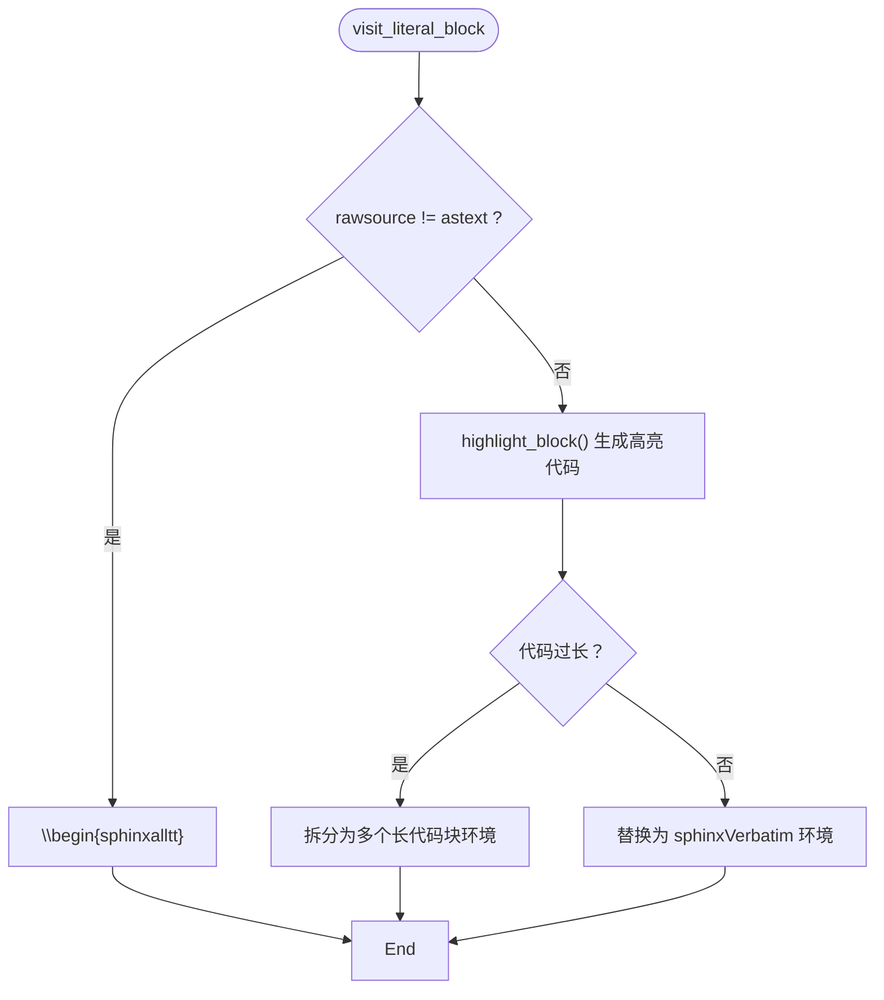

**图表来源**
- [sphinx\writers\latex.py:2216-2318](file://sphinx/writers/latex.py#L2216-L2318)

**章节来源**
- [sphinx\writers\latex.py:2216-2318](file://sphinx/writers/latex.py#L2216-L2318)

### 图像与图形节点处理
- 图像尺寸：支持 px、pt、百分比、CSS 单位，转换为 LaTeX 长度。
- 对齐与浮动：支持居中、左右对齐；在段落外默认浮动；表格内使用专用容器。
- 超链接：若图像被包裹在链接中，采用相应命令。
- 文件名转义：对路径中的 # 进行 catcode 处理，避免 LaTeX 解释错误。

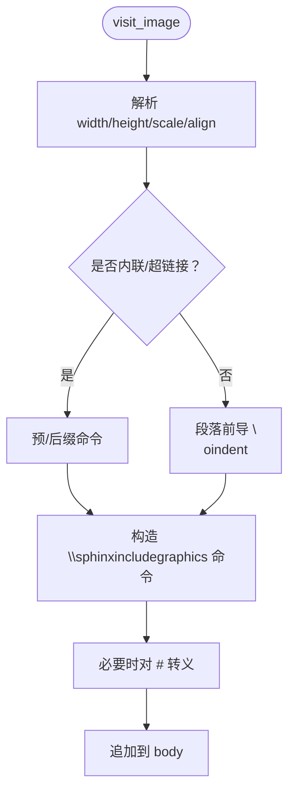

**图表来源**
- [sphinx\writers\latex.py:1625-1708](file://sphinx/writers/latex.py#L1625-L1708)

**章节来源**
- [sphinx\writers\latex.py:1625-1708](file://sphinx/writers/latex.py#L1625-L1708)

### 数学公式处理
- 行内公式：使用 \( ... \) 包裹。
- 行间公式：支持自动编号（可选），支持标签与引用；支持 no-wrap 选项直接输出。
- 公式引用：支持自定义格式化字符串，否则使用 \eqref。

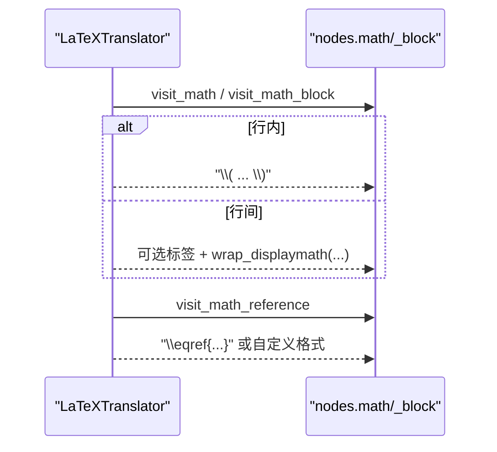

**图表来源**
- [sphinx\writers\latex.py:2527-2566](file://sphinx/writers/latex.py#L2527-L2566)

**章节来源**
- [sphinx\writers\latex.py:2527-2566](file://sphinx/writers/latex.py#L2527-L2566)

### 交叉引用与目标
- 目标：生成 \phantomsection（若非标题内）与 \label，跳过索引与方程内部的目标。
- 引用：支持同文档、跨文档、外部 URI；根据上下文插入 \sphinxsamedocref/\sphinxcrossref/\sphinxhref 等命令；可选页码引用。
- 数字化引用：支持数字引用格式化字符串。

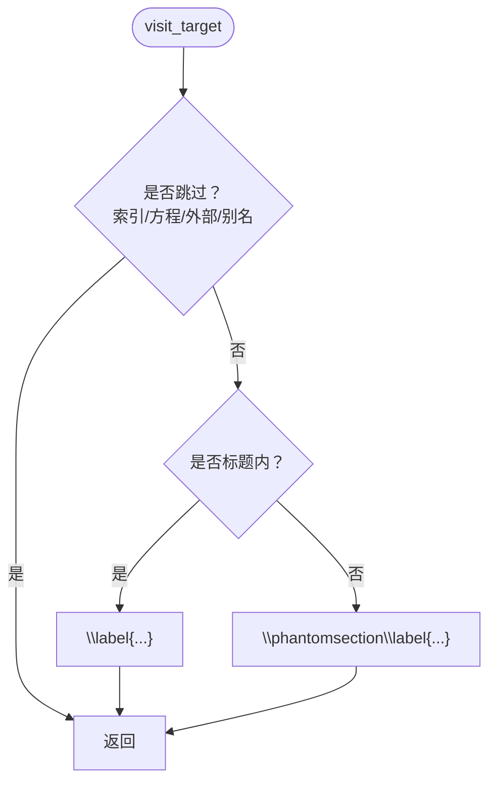

**图表来源**
- [sphinx\writers\latex.py:1834-1888](file://sphinx/writers/latex.py#L1834-L1888)

**章节来源**
- [sphinx\writers\latex.py:1970-2030](file://sphinx/writers/latex.py#L1970-L2030)
- [sphinx\writers\latex.py:2032-2054](file://sphinx/writers/latex.py#L2032-L2054)
- [sphinx\writers\latex.py:1834-1888](file://sphinx/writers/latex.py#L1834-L1888)

### 索引生成
- 支持 single/pair/triple/see/seealso 等条目类型，按语言与风格进行转义与排序键处理。
- 使用 \spxentry/\sphinxleftcurlybrace 等命令保证索引条目正确显示与排序。
- 最终在 astext 中渲染为 sphinxtheindex 环境。

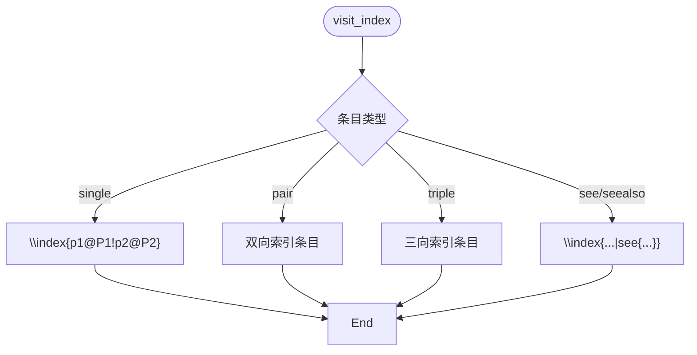

**图表来源**
- [sphinx\writers\latex.py:1897-1959](file://sphinx/writers/latex.py#L1897-L1959)

**章节来源**
- [sphinx\writers\latex.py:1897-1959](file://sphinx/writers/latex.py#L1897-L1959)
- [sphinx\writers\latex.py:508-513](file://sphinx/writers/latex.py#L508-L513)

### 自定义节点与扩展
- captioned_literal_block：用于带标题的代码块容器。
- footnotemark/footnotetext：分离脚注标记与脚注文本，便于控制脚注位置。
- math_reference：公式引用节点。
- thebibliography：参考文献容器，配合 cite/citeref 使用。
- HYPERLINK_SUPPORT_NODES：定义支持超链接的目标节点集合。

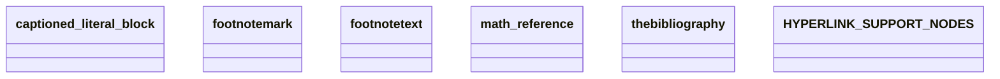

**图表来源**
- [sphinx\builders\latex\nodes.py:8-44](file://sphinx/builders/latex/nodes.py#L8-L44)

**章节来源**
- [sphinx\builders\latex\nodes.py:8-44](file://sphinx/builders/latex/nodes.py#L8-L44)

## 依赖分析
- LaTeXBuilder 依赖：
  - LaTeXTranslator：作为默认翻译器
  - LaTeXBuilder 常量：DEFAULT_SETTINGS/ADDITIONAL_SETTINGS 提供默认宏包与字体配置
  - ExtBabel：多语言与 babel/polyglossia 设置
  - PygmentsBridge：代码高亮样式
  - 模板渲染：LaTeXRenderer
- LaTeXTranslator 依赖：
  - texescape：字符转义
  - sphinx.sty 宏包与样式：通过 elements 注入
  - 高亮样式：sphinxhighlight.sty
  - LaTeX 节点扩展：自定义节点

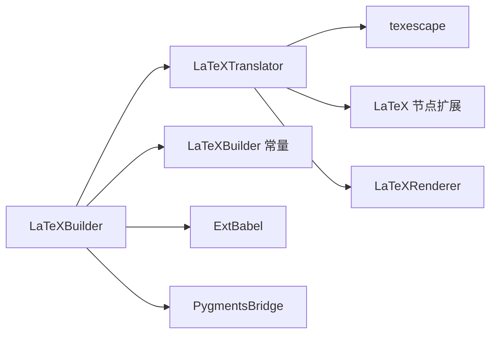

**图表来源**
- [sphinx\builders\latex\__init__.py:127-214](file://sphinx/builders/latex/__init__.py#L127-L214)
- [sphinx\writers\latex.py:337-498](file://sphinx/writers/latex.py#L337-L498)

**章节来源**
- [sphinx\builders\latex\__init__.py:127-214](file://sphinx/builders/latex/__init__.py#L127-L214)
- [sphinx\writers\latex.py:337-498](file://sphinx/writers/latex.py#L337-L498)

## 性能考虑
- 代码高亮分块：长代码块按阈值拆分，减少单段 Verbatim 的复杂度，提高编译稳定性。
- 表格渲染：优先使用 tabulary/longtable 适配长表格，避免 tabulary 在嵌套场景的问题；在表格内强制使用 sphinxVerbatimintable。
- 字符转义：按引擎选择映射表，避免不必要的 Unicode 转换；URI 编码仅做必要替换。
- 模板渲染：尽量复用模板变量，减少重复计算；仅在需要时渲染索引与尾部内容。

[本节为通用指导，无需特定文件引用]

## 故障排查指南
- LaTeX 编译报错“没有可结束的行”：检查等宽上下文中换行与空格替换是否正确。
- 图片路径包含 # 导致编译失败：确认已对 # 进行 catcode 处理。
- 表格列规格与 tabulary 冲突：当给出 colspec 使用了 L/R/J/C/T 时发出警告并忽略。
- 深度嵌套表格：超过限制会抛出 UnsupportedError。
- 数学公式引用格式无效：检查 math_eqref_format 是否包含 number 占位符。
- 交叉引用页码：确认 latex_show_pagerefs 已启用且不在生产列表中。

**章节来源**
- [sphinx\writers\latex.py:1216-1238](file://sphinx/writers/latex.py#L1216-L1238)
- [sphinx\writers\latex.py:1177-1180](file://sphinx/writers/latex.py#L1177-L1180)
- [sphinx\writers\latex.py:2556-2561](file://sphinx/writers/latex.py#L2556-L2561)
- [sphinx\writers\latex.py:1987-1990](file://sphinx/writers/latex.py#L1987-L1990)

## 结论
LaTeXTranslator 将 Docutils 节点树高效转换为 LaTeX 文本，结合 LaTeXBuilder 的上下文与模板系统，形成完整的 LaTeX 输出流水线。通过自定义节点、严格的字符转义与高亮策略、以及对表格/图像/交叉引用/索引/数学公式等复杂结构的专门处理，实现了高质量的 PDF 输出能力。遵循本文档的优化与调试建议，可进一步提升构建效率与输出稳定性。

[本节为总结，无需特定文件引用]

## 附录
- LaTeX 引擎与默认设置：不同引擎（pdflatex/xelatex/lualatex/platex/uplatex）提供不同的宏包、字体与编码配置。
- LaTeX 常量：DEFAULT_SETTINGS/ADDITIONAL_SETTINGS/SHORTHANDOFF 提供默认宏包、几何参数、字体与语言支持。

**章节来源**
- [sphinx\builders\latex\constants.py:73-123](file://sphinx/builders/latex/constants.py#L73-L123)
- [sphinx\builders\latex\constants.py:125-210](file://sphinx/builders/latex/constants.py#L125-L210)
- [sphinx\builders\latex\constants.py:213-218](file://sphinx/builders/latex/constants.py#L213-L218)