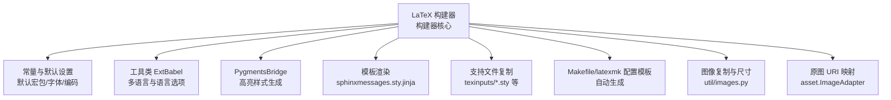
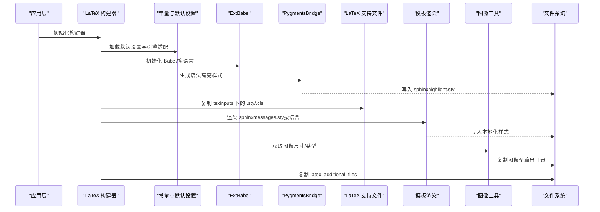
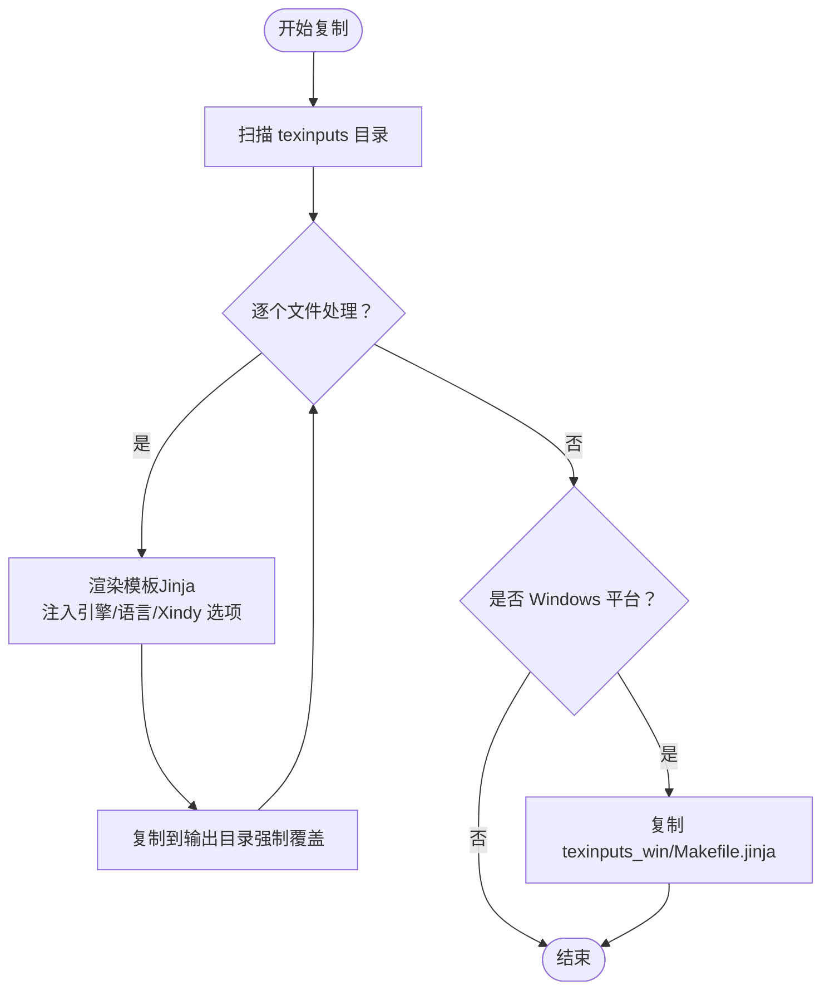
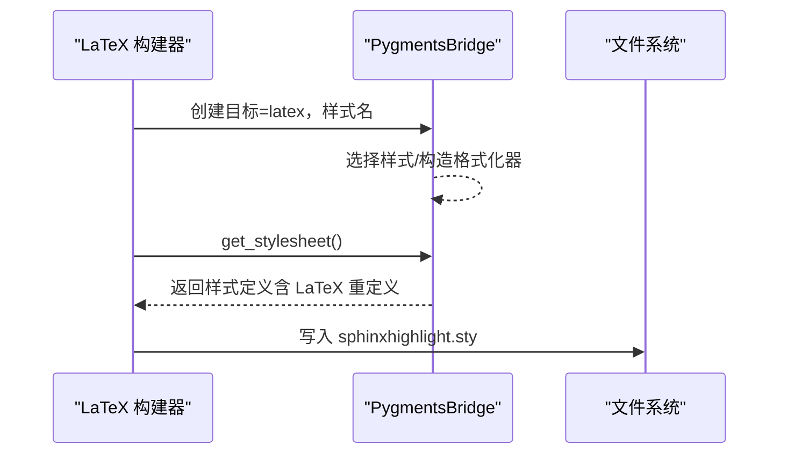
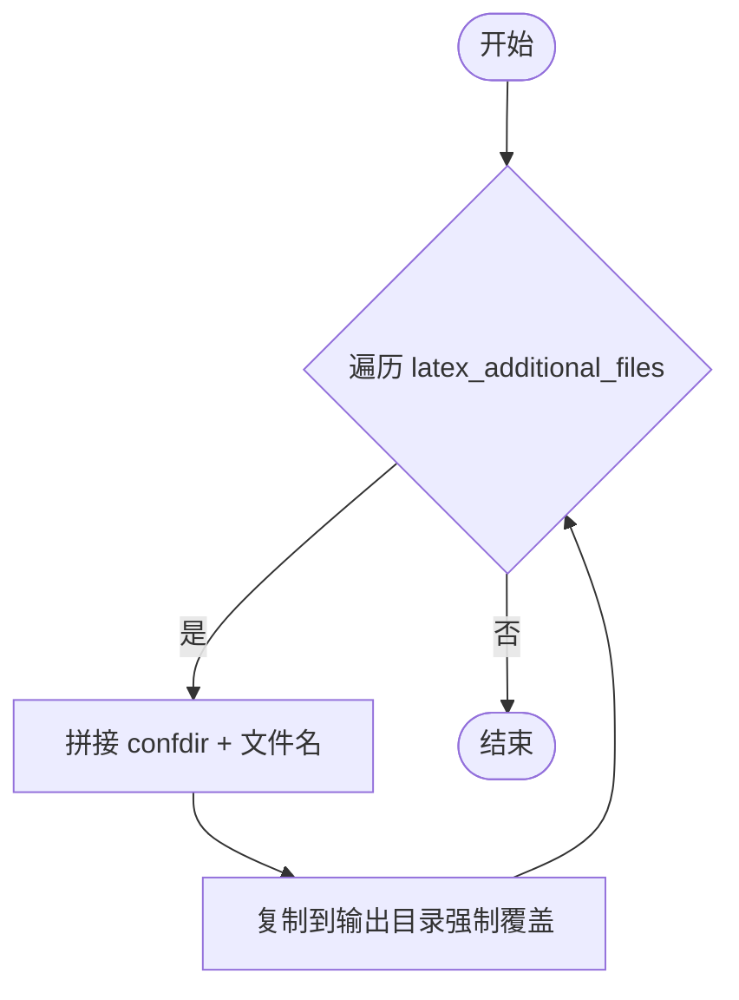
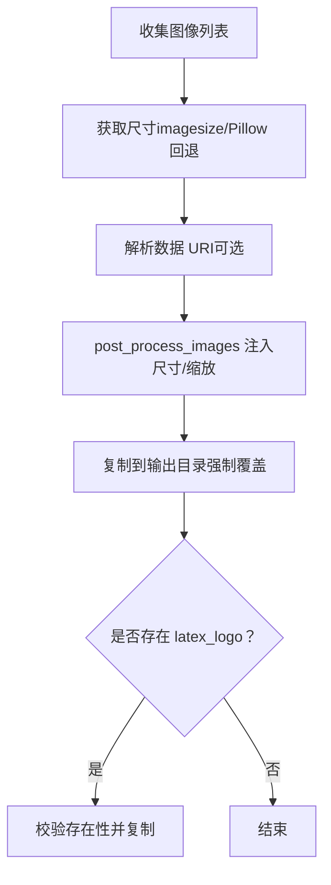
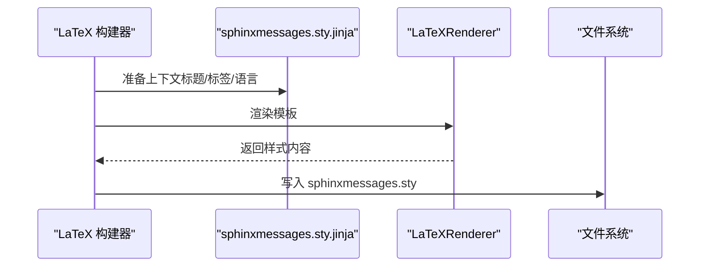
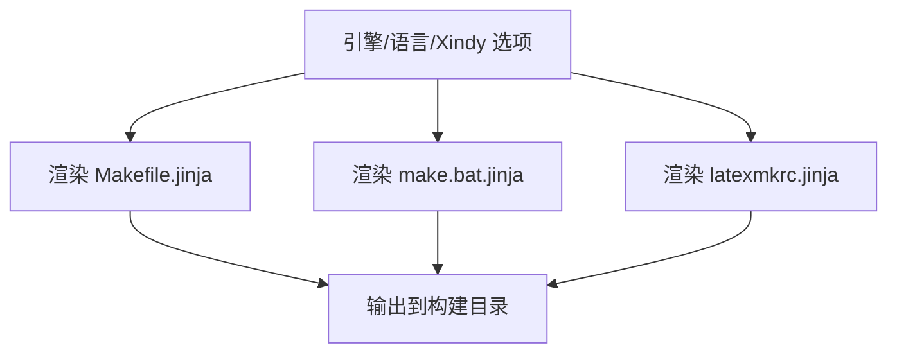
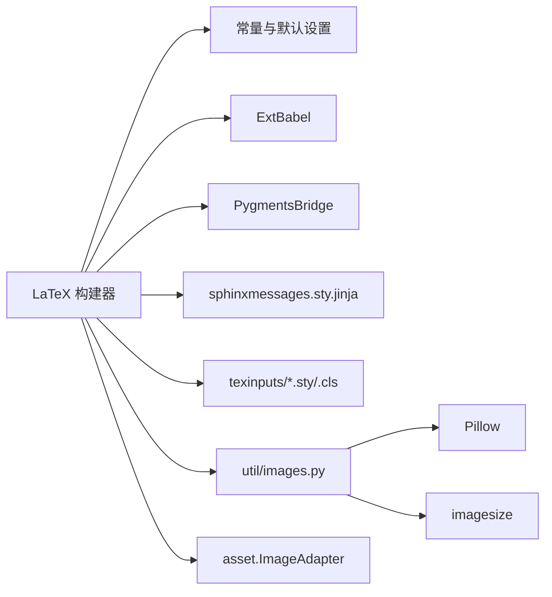

# LaTeX 资源管理

<cite>
**本文引用的文件**
- [LaTeX 构建器核心](file://sphinx/builders/latex/__init__.py)
- [LaTeX 常量与默认设置](file://sphinx/builders/latex/constants.py)
- [LaTeX 构建器工具类](file://sphinx/builders/latex/util.py)
- [Pygments 高亮桥接](file://sphinx/highlighting.py)
- [Pygments 样式定义](file://sphinx/pygments_styles.py)
- [LaTeX 模板：消息样式](file://sphinx/templates/latex/sphinxmessages.sty.jinja)
- [LaTeX 输入：主 Makefile 模板](file://sphinx/texinputs/Makefile.jinja)
- [LaTeX 输入：Windows 批处理模板](file://sphinx/texinputs/make.bat.jinja)
- [LaTeX 输入：latexmk 配置模板](file://sphinx/texinputs/latexmkrc.jinja)
- [LaTeX 包：sphinx.sty](file://sphinx/texinputs/sphinx.sty)
- [图像工具函数](file://sphinx/util/images.py)
- [环境适配器：图像映射](file://sphinx/environment/adapters/asset.py)
</cite>

## 目录
1. [简介](#简介)
2. [项目结构](#项目结构)
3. [核心组件](#核心组件)
4. [架构总览](#架构总览)
5. [详细组件分析](#详细组件分析)
6. [依赖关系分析](#依赖关系分析)
7. [性能考量](#性能考量)
8. [故障排除指南](#故障排除指南)
9. [结论](#结论)
10. [附录](#附录)

## 简介
本文件系统性阐述 Sphinx LaTeX 构建器的资源管理系统，覆盖以下主题：
- 支持文件复制机制：LaTeX 宏包、样式文件与模板的自动部署
- Pygments 语法高亮样式的生成与集成
- 额外文件（latex_additional_files）的处理流程与安全注意事项
- 图像文件的处理、缩放与格式转换机制
- 消息目录的生成与本地化支持
- Makefile 与 latexmkrc 的自动生成与配置
- 资源优化技巧与常见问题排查

## 项目结构
围绕 LaTeX 构建器的资源管理，涉及如下关键模块：
- 构建器入口与生命周期控制：LaTeX 构建器负责初始化上下文、复制支持文件、写入样式表、复制图像与消息目录、完成阶段复制附加文件等
- 默认设置与引擎适配：常量模块提供不同 LaTeX 引擎（pdflatex/xelatex/lualatex/ptex/uplatex）下的默认宏包、字体与编码策略
- 工具类：扩展 Babel 支持多语言与正斜杠短横线处理
- 高亮系统：PygmentsBridge 将语法高亮样式注入到 LaTeX 输出中
- 模板与输入：LaTeX 模板与 texinputs 目录中的样式文件、Makefile/latexmk 配置模板
- 图像处理：图像类型推断、尺寸获取与复制；原图 URI 映射
- 本地化：基于 Babel/polyglossia 的消息目录样式文件生成

图表来源
- [LaTeX 构建器核心:110-524](file://sphinx/builders/latex/__init__.py#L110-L524)
- [LaTeX 常量与默认设置:73-218](file://sphinx/builders/latex/constants.py#L73-L218)
- [LaTeX 构建器工具类:8-49](file://sphinx/builders/latex/util.py#L8-L49)
- [Pygments 高亮桥接:98-238](file://sphinx/highlighting.py#L98-L238)
- [LaTeX 模板：消息样式:1-22](file://sphinx/templates/latex/sphinxmessages.sty.jinja#L1-L22)
- [LaTeX 输入：主 Makefile 模板:1-94](file://sphinx/texinputs/Makefile.jinja#L1-L94)
- [LaTeX 输入：Windows 批处理模板:1-51](file://sphinx/texinputs/make.bat.jinja#L1-L51)
- [LaTeX 输入：latexmk 配置模板:1-33](file://sphinx/texinputs/latexmkrc.jinja#L1-L33)
- [图像工具函数:41-160](file://sphinx/util/images.py#L41-L160)
- [环境适配器：图像映射:13-23](file://sphinx/environment/adapters/asset.py#L13-L23)

章节来源
- [LaTeX 构建器核心:110-524](file://sphinx/builders/latex/__init__.py#L110-L524)
- [LaTeX 常量与默认设置:73-218](file://sphinx/builders/latex/constants.py#L73-L218)

## 核心组件
- LaTeX 构建器（LaTeXBuilder）
  - 初始化上下文、Babel 多语言支持、多字语言字体替换策略
  - 写入语法高亮样式文件（sphinxhighlight.sty）
  - 复制支持文件（texinputs 下的 .sty/.cls 等）
  - 复制附加文件（latex_additional_files）
  - 复制图像与 logo
  - 生成消息目录样式（sphinxmessages.sty）
- 常量与默认设置（DEFAULT_SETTINGS/ADDITIONAL_SETTINGS）
  - 提供不同引擎（pdflatex/xelatex/lualatex/ptex/uplatex）的默认宏包、字体与编码
  - 针对特定语言（如 zh/fr/el）的特殊设置
- 工具类（ExtBabel）
  - 语言名称映射、是否使用西里尔文字、polyglossia 选项
- 高亮系统（PygmentsBridge）
  - 选择样式（SphinxStyle/NoneStyle/第三方），生成 LaTeX 样式定义并注入额外重定义
- 模板与输入
  - sphinxmessages.sty.jinja：按语言生成本地化标题与标签
  - Makefile.jinja/make.bat.jinja/latexmkrc.jinja：自动生成构建脚本与索引配置
- 图像处理
  - 图像类型与 MIME 推断、尺寸获取、数据 URI 解析
  - 原始图像 URI 映射，确保输出路径正确

章节来源
- [LaTeX 构建器核心:127-524](file://sphinx/builders/latex/__init__.py#L127-L524)
- [LaTeX 常量与默认设置:73-218](file://sphinx/builders/latex/constants.py#L73-L218)
- [LaTeX 构建器工具类:8-49](file://sphinx/builders/latex/util.py#L8-L49)
- [Pygments 高亮桥接:98-238](file://sphinx/highlighting.py#L98-L238)
- [LaTeX 模板：消息样式:1-22](file://sphinx/templates/latex/sphinxmessages.sty.jinja#L1-L22)
- [LaTeX 输入：主 Makefile 模板:1-94](file://sphinx/texinputs/Makefile.jinja#L1-L94)
- [LaTeX 输入：Windows 批处理模板:1-51](file://sphinx/texinputs/make.bat.jinja#L1-L51)
- [LaTeX 输入：latexmk 配置模板:1-33](file://sphinx/texinputs/latexmkrc.jinja#L1-L33)
- [图像工具函数:41-160](file://sphinx/util/images.py#L41-L160)
- [环境适配器：图像映射:13-23](file://sphinx/environment/adapters/asset.py#L13-L23)

## 架构总览
下图展示 LaTeX 构建器在资源管理方面的关键交互：

图表来源
- [LaTeX 构建器核心:127-524](file://sphinx/builders/latex/__init__.py#L127-L524)
- [LaTeX 常量与默认设置:73-218](file://sphinx/builders/latex/constants.py#L73-L218)
- [LaTeX 构建器工具类:8-49](file://sphinx/builders/latex/util.py#L8-L49)
- [Pygments 高亮桥接:98-238](file://sphinx/highlighting.py#L98-L238)
- [LaTeX 模板：消息样式:1-22](file://sphinx/templates/latex/sphinxmessages.sty.jinja#L1-L22)
- [LaTeX 输入：主 Makefile 模板:1-94](file://sphinx/texinputs/Makefile.jinja#L1-L94)
- [LaTeX 输入：Windows 批处理模板:1-51](file://sphinx/texinputs/make.bat.jinja#L1-L51)
- [LaTeX 输入：latexmk 配置模板:1-33](file://sphinx/texinputs/latexmkrc.jinja#L1-L33)
- [图像工具函数:41-160](file://sphinx/util/images.py#L41-L160)

## 详细组件分析

### 支持文件复制机制（LaTeX 宏包、样式文件与模板）
- 复制范围
  - texinputs 目录下的所有样式文件（.sty）、文档类（.cls）与辅助文件
  - Windows 平台下复制 texinputs_win/Makefile.jinja
  - 使用模板渲染（Jinja）与上下文变量（引擎、xindy 选项等）进行条件化生成
- 关键流程
  - 读取包内 texinputs 目录，遍历非隐藏文件
  - 对每个文件调用复制接口，传入渲染上下文与强制覆盖标志
  - Windows 特例：复制旧版 Makefile.jinja 以兼容历史行为
- 影响因素
  - latex_engine 与 latex_use_xindy 配置决定模板变量
  - 语言与字体编码影响字体替换与希腊字母支持

图表来源
- [LaTeX 构建器核心:422-457](file://sphinx/builders/latex/__init__.py#L422-L457)
- [LaTeX 输入：主 Makefile 模板:1-94](file://sphinx/texinputs/Makefile.jinja#L1-L94)
- [LaTeX 输入：Windows 批处理模板:1-51](file://sphinx/texinputs/make.bat.jinja#L1-L51)

章节来源
- [LaTeX 构建器核心:422-457](file://sphinx/builders/latex/__init__.py#L422-L457)

### Pygments 语法高亮样式文件的生成与集成
- 生成流程
  - 构建器在准备阶段创建 PygmentsBridge，目标为 LaTeX
  - 调用 get_stylesheet() 获取样式定义，并追加 LaTeX 特定重定义
  - 写入输出目录的 sphinxhighlight.sty 文件
- 样式选择
  - 默认使用 SphinxStyle，可切换为 none 或第三方样式模块
  - 样式注入时包含针对 LaTeX 的字符转义与保护定义
- 集成点
  - 由构建器在 prepare_writing 阶段执行
  - LaTeX writer 在翻译过程中使用该样式文件

图表来源
- [LaTeX 构建器核心:275-291](file://sphinx/builders/latex/__init__.py#L275-L291)
- [Pygments 高亮桥接:98-238](file://sphinx/highlighting.py#L98-L238)
- [Pygments 样式定义:24-37](file://sphinx/pygments_styles.py#L24-L37)

章节来源
- [LaTeX 构建器核心:275-291](file://sphinx/builders/latex/__init__.py#L275-L291)
- [Pygments 高亮桥接:98-238](file://sphinx/highlighting.py#L98-L238)
- [Pygments 样式定义:24-37](file://sphinx/pygments_styles.py#L24-L37)

### 额外文件（latex_additional_files）的处理流程与安全考虑
- 处理流程
  - 遍历 latex_additional_files 列表
  - 从 confdir 拼接源路径，复制到输出目录，文件名保持不变
  - 使用强制覆盖复制，避免增量构建差异导致的遗漏
- 安全考虑
  - 仅复制显式配置的文件，不递归扫描目录
  - 源路径来自 confdir，避免相对路径越界
  - 建议在 CI 中校验额外文件列表，防止误注入敏感文件

图表来源
- [LaTeX 构建器核心:459-467](file://sphinx/builders/latex/__init__.py#L459-L467)

章节来源
- [LaTeX 构建器核心:459-467](file://sphinx/builders/latex/__init__.py#L459-L467)

### 图像文件的处理、缩放与格式转换机制
- 类型与尺寸
  - 通过 imagesize 库优先获取尺寸；若失败且可用 Pillow，则回退到 PIL
  - 支持常见格式：PNG/JPEG/GIF/SVG/WebP 等
  - 数据 URI 解析用于内联图像
- 缩放与定位
  - LaTeX 构建器在写入阶段调用图像后处理器（post_process_images），将尺寸与缩放信息注入文档树
  - 支持 CSS3 长度单位（如 ch/rem/vw/vh/vmin/vmax/Q）在测试中验证
- 复制策略
  - 逐个复制 images 映射中的源路径到输出目录
  - 若 logo 配置存在，校验文件存在性并复制
- 原图 URI 映射
  - 通过 ImageAdapter 将别名或重定向后的原始 URI 还原，保证日志与错误信息指向真实源

图表来源
- [LaTeX 构建器核心:469-503](file://sphinx/builders/latex/__init__.py#L469-L503)
- [图像工具函数:41-160](file://sphinx/util/images.py#L41-L160)
- [环境适配器：图像映射:13-23](file://sphinx/environment/adapters/asset.py#L13-L23)

章节来源
- [LaTeX 构建器核心:469-503](file://sphinx/builders/latex/__init__.py#L469-L503)
- [图像工具函数:41-160](file://sphinx/util/images.py#L41-L160)
- [环境适配器：图像映射:13-23](file://sphinx/environment/adapters/asset.py#L13-L23)

### 消息目录的生成与本地化支持
- 生成时机
  - 构建器 finish 阶段写入本地化消息样式文件 sphinxmessages.sty
- 上下文内容
  - 标题与标签：图、表、代码块等命名
  - 语言切换：若启用 babel/polyglossia，则注入对应语言的 \addto\captions
- 渲染方式
  - 使用 LaTeXRenderer 渲染 sphinxmessages.sty.jinja 模板
  - 模板中使用 Jinja 表达式进行本地化字符串转义与拼接

图表来源
- [LaTeX 构建器核心:505-523](file://sphinx/builders/latex/__init__.py#L505-L523)
- [LaTeX 模板：消息样式:1-22](file://sphinx/templates/latex/sphinxmessages.sty.jinja#L1-L22)

章节来源
- [LaTeX 构建器核心:505-523](file://sphinx/builders/latex/__init__.py#L505-L523)
- [LaTeX 模板：消息样式:1-22](file://sphinx/templates/latex/sphinxmessages.sty.jinja#L1-L22)

### Makefile 与 latexmkrc 的自动生成与配置
- 自动生成
  - 构建器根据当前引擎与 xindy 设置，将模板渲染为 Makefile/latexmkrc/make.bat
- 关键变量
  - LATEXOPTS/XINDYOPTS：传递给 latexmk 的额外选项
  - 引擎分支：pdflatex/xelatex/lualatex/platex/uplatex 的命令与参数
  - xindy：根据语言与西里尔语脚本设置模块与规则
- 目标
  - 提供一键编译（all/all-pdf/all-dvi/all-ps）、打包（zip/tar/gz/bz2/xz）与清理（clean）

图表来源
- [LaTeX 构建器核心:422-457](file://sphinx/builders/latex/__init__.py#L422-L457)
- [LaTeX 输入：主 Makefile 模板:1-94](file://sphinx/texinputs/Makefile.jinja#L1-L94)
- [LaTeX 输入：Windows 批处理模板:1-51](file://sphinx/texinputs/make.bat.jinja#L1-L51)
- [LaTeX 输入：latexmk 配置模板:1-33](file://sphinx/texinputs/latexmkrc.jinja#L1-L33)

章节来源
- [LaTeX 构建器核心:422-457](file://sphinx/builders/latex/__init__.py#L422-L457)
- [LaTeX 输入：主 Makefile 模板:1-94](file://sphinx/texinputs/Makefile.jinja#L1-L94)
- [LaTeX 输入：Windows 批处理模板:1-51](file://sphinx/texinputs/make.bat.jinja#L1-L51)
- [LaTeX 输入：latexmk 配置模板:1-33](file://sphinx/texinputs/latexmkrc.jinja#L1-L33)

## 依赖关系分析
- 构建器对常量与工具类的依赖
  - DEFAULT_SETTINGS/ADDITIONAL_SETTINGS 决定宏包、字体与编码策略
  - ExtBabel 提供语言与 polyglossia/babel 选项
- 高亮系统与模板渲染
  - PygmentsBridge 生成样式并写入 sphinxhighlight.sty
  - sphinxmessages.sty.jinja 依赖 Babel/polyglossia 语言选项
- 图像处理链路
  - imagesize 与 Pillow 共同保障尺寸获取
  - ImageAdapter 保证日志与错误信息指向原始源

图表来源
- [LaTeX 构建器核心:110-524](file://sphinx/builders/latex/__init__.py#L110-L524)
- [LaTeX 常量与默认设置:73-218](file://sphinx/builders/latex/constants.py#L73-L218)
- [LaTeX 构建器工具类:8-49](file://sphinx/builders/latex/util.py#L8-L49)
- [Pygments 高亮桥接:98-238](file://sphinx/highlighting.py#L98-L238)
- [LaTeX 模板：消息样式:1-22](file://sphinx/templates/latex/sphinxmessages.sty.jinja#L1-L22)
- [LaTeX 包：sphinx.sty:1-800](file://sphinx/texinputs/sphinx.sty#L1-L800)
- [图像工具函数:41-160](file://sphinx/util/images.py#L41-L160)
- [环境适配器：图像映射:13-23](file://sphinx/environment/adapters/asset.py#L13-L23)

章节来源
- [LaTeX 构建器核心:110-524](file://sphinx/builders/latex/__init__.py#L110-L524)
- [LaTeX 常量与默认设置:73-218](file://sphinx/builders/latex/constants.py#L73-L218)
- [LaTeX 构建器工具类:8-49](file://sphinx/builders/latex/util.py#L8-L49)
- [Pygments 高亮桥接:98-238](file://sphinx/highlighting.py#L98-L238)
- [LaTeX 模板：消息样式:1-22](file://sphinx/templates/latex/sphinxmessages.sty.jinja#L1-L22)
- [LaTeX 包：sphinx.sty:1-800](file://sphinx/texinputs/sphinx.sty#L1-L800)
- [图像工具函数:41-160](file://sphinx/util/images.py#L41-L160)
- [环境适配器：图像映射:13-23](file://sphinx/environment/adapters/asset.py#L13-L23)

## 性能考量
- 复制策略
  - 强制覆盖复制确保一致性，但可能增加磁盘 IO；建议在增量构建场景中结合文件时间戳判断
- 图像处理
  - imagesize 优先，回退到 PIL；对于大量图像建议预处理或缓存尺寸
  - 避免重复复制相同图像（同一源多次出现）
- 模板渲染
  - Makefile/latexmk 配置模板仅在首次生成或变更时生效，减少重复渲染开销
- 高亮样式
  - 仅在样式变化时重新生成 sphinxhighlight.sty，避免不必要的写入

## 故障排除指南
- 无法找到支持文件
  - 确认包内 texinputs 目录存在且未被外部覆盖
  - 检查复制上下文（引擎/语言/Xindy）是否正确
- 语法高亮样式异常
  - 检查 pygments_style 配置与样式模块导入
  - 确保 sphinxhighlight.sty 存在且未被外部修改
- 本地化标签不生效
  - 确认 babel/polyglossia 已启用且语言代码有效
  - 检查 sphinxmessages.sty 是否成功写入
- 图像复制失败
  - 检查源路径是否在 confdir 下，避免路径越界
  - 确认目标输出目录权限
- 附加文件未被复制
  - 核对 latex_additional_files 列表项是否存在于 confdir
  - 确认复制流程未被过滤或跳过

章节来源
- [LaTeX 构建器核心:459-467](file://sphinx/builders/latex/__init__.py#L459-L467)
- [LaTeX 构建器核心:469-503](file://sphinx/builders/latex/__init__.py#L469-L503)
- [LaTeX 构建器核心:505-523](file://sphinx/builders/latex/__init__.py#L505-L523)
- [LaTeX 构建器核心:422-457](file://sphinx/builders/latex/__init__.py#L422-L457)

## 结论
Sphinx LaTeX 构建器通过“模板渲染 + 强制覆盖复制”的策略，实现了对 LaTeX 宏包、样式文件、构建脚本与本地化消息的自动化部署。配合 Pygments 的高亮样式生成与图像工具链，构建器在多语言、多引擎环境下提供了稳健的资源管理能力。遵循本文的流程与最佳实践，可显著提升构建稳定性与可维护性。

## 附录
- 相关配置键
  - latex_engine、latex_documents、latex_logo、latex_appendices、latex_use_latex_multicolumn、latex_use_xindy、latex_show_urls、latex_show_pagerefs、latex_elements、latex_additional_files、latex_table_style、latex_theme、latex_theme_options、latex_theme_path、latex_docclass
- 参考文件
  - LaTeX 包：sphinx.sty（样式与选项定义）
  - 模板：sphinxmessages.sty.jinja（本地化标签）
  - 构建脚本：Makefile.jinja、make.bat.jinja、latexmkrc.jinja

章节来源
- [LaTeX 构建器核心:590-646](file://sphinx/builders/latex/__init__.py#L590-L646)
- [LaTeX 包：sphinx.sty:1-800](file://sphinx/texinputs/sphinx.sty#L1-L800)
- [LaTeX 模板：消息样式:1-22](file://sphinx/templates/latex/sphinxmessages.sty.jinja#L1-L22)
- [LaTeX 输入：主 Makefile 模板:1-94](file://sphinx/texinputs/Makefile.jinja#L1-L94)
- [LaTeX 输入：Windows 批处理模板:1-51](file://sphinx/texinputs/make.bat.jinja#L1-L51)
- [LaTeX 输入：latexmk 配置模板:1-33](file://sphinx/texinputs/latexmkrc.jinja#L1-L33)