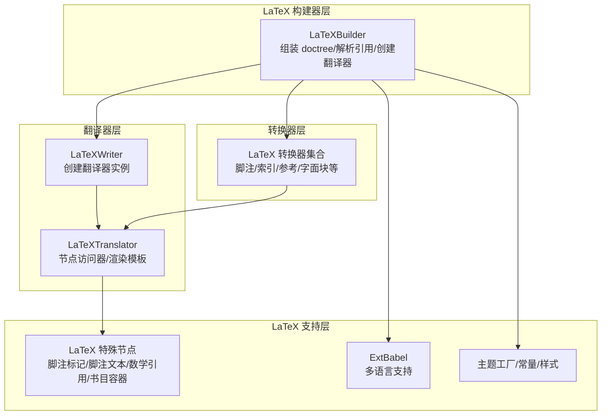
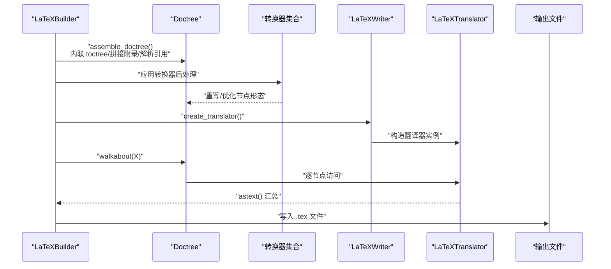
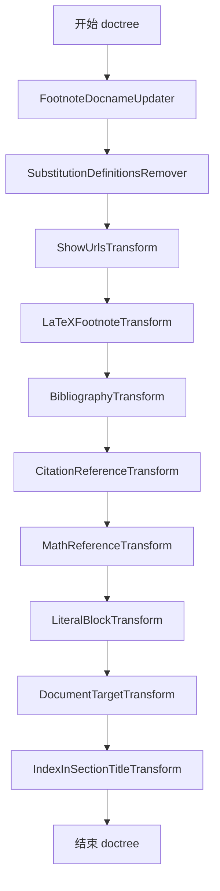
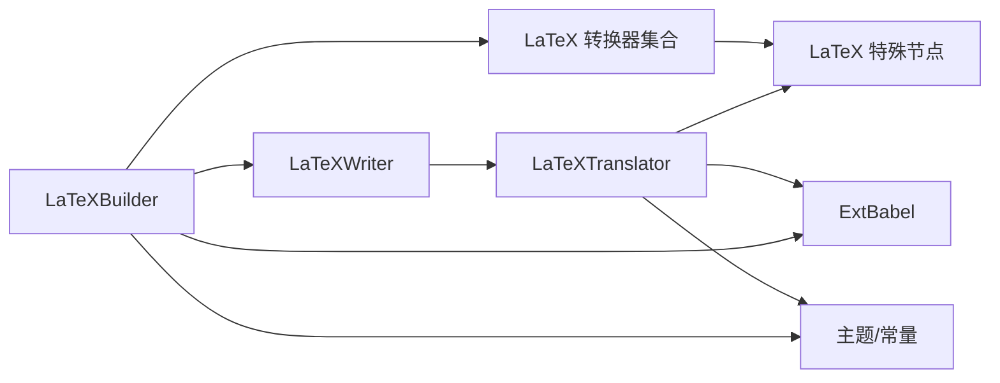

# LaTeX 转换器

<cite>
**本文档引用的文件**
- [sphinx/builders/latex/__init__.py](file://sphinx/builders/latex/__init__.py)
- [sphinx/builders/latex/transforms.py](file://sphinx/builders/latex/transforms.py)
- [sphinx/builders/latex/nodes.py](file://sphinx/builders/latex/nodes.py)
- [sphinx/builders/latex/util.py](file://sphinx/builders/latex/util.py)
- [sphinx/builders/latex/constants.py](file://sphinx/builders/latex/constants.py)
- [sphinx/builders/latex/theming.py](file://sphinx/builders/latex/theming.py)
- [sphinx/writers/latex.py](file://sphinx/writers/latex.py)
</cite>

## 目录
1. [简介](#简介)
2. [项目结构](#项目结构)
3. [核心组件](#核心组件)
4. [架构总览](#架构总览)
5. [详细组件分析](#详细组件分析)
6. [依赖关系分析](#依赖关系分析)
7. [性能考虑](#性能考虑)
8. [故障排查指南](#故障排查指南)
9. [结论](#结论)

## 简介
本文件系统性阐述 Sphinx LaTeX 构建器的转换器体系，覆盖文档树后处理、节点重写与结构优化、特殊节点（待处理引用、交叉引用、标签）的转换逻辑、转换器执行顺序与依赖关系、扩展与自定义方式、错误处理与调试方法，以及最佳实践与性能优化建议。目标是帮助读者在不深入阅读源码的前提下，理解并高效使用与扩展 LaTeX 转换器系统。

## 项目结构
LaTeX 转换器由“构建器 + 转换器 + 翻译器”三层协作构成：
- 构建器：负责收集文档、解析引用、装配 doctree、创建翻译器并驱动遍历输出。
- 转换器：对 doctree 进行后处理，重写节点、优化结构、统一特殊节点形态。
- 翻译器：将 doctree 节点映射到 LaTeX 输出，生成最终 TeX 文本。

图表来源
- [sphinx/builders/latex/__init__.py:110-416](file://sphinx/builders/latex/__init__.py#L110-L416)
- [sphinx/builders/latex/transforms.py:645-662](file://sphinx/builders/latex/transforms.py#L645-L662)
- [sphinx/writers/latex.py:75-102](file://sphinx/writers/latex.py#L75-L102)

章节来源
- [sphinx/builders/latex/__init__.py:110-416](file://sphinx/builders/latex/__init__.py#L110-L416)
- [sphinx/builders/latex/transforms.py:645-662](file://sphinx/builders/latex/transforms.py#L645-L662)
- [sphinx/writers/latex.py:75-102](file://sphinx/writers/latex.py#L75-L102)

## 核心组件
- LaTeXBuilder：负责 doctree 组装、引用解析、主题上下文更新、创建翻译器并驱动 walkabout 输出。
- LaTeX 转换器集合：在 doctree 上执行后处理，重写节点形态、统一引用与索引结构。
- LaTeXTranslator：将 doctree 节点映射为 LaTeX 输出，渲染模板并生成最终 TeX 文本。
- LaTeX 特殊节点：脚注标记/脚注文本、数学引用、字面块容器、书目容器等。
- 多语言与主题：ExtBabel 提供语言与 polyglossia/babel 配置；主题工厂管理文档类与排版选项。

章节来源
- [sphinx/builders/latex/__init__.py:110-416](file://sphinx/builders/latex/__init__.py#L110-L416)
- [sphinx/builders/latex/transforms.py:645-662](file://sphinx/builders/latex/transforms.py#L645-L662)
- [sphinx/builders/latex/nodes.py:8-45](file://sphinx/builders/latex/nodes.py#L8-L45)
- [sphinx/builders/latex/util.py:8-49](file://sphinx/builders/latex/util.py#L8-L49)
- [sphinx/builders/latex/theming.py:20-136](file://sphinx/builders/latex/theming.py#L20-L136)

## 架构总览
LaTeX 构建流程的关键步骤如下：
1. 初始化：构建器初始化上下文、Babel、多语言设置。
2. 组装 doctree：内联 toctree、拼接附录、解析引用。
3. 后处理：应用转换器（脚注、索引、参考、字面块、URL 展开等）。
4. 创建翻译器：基于主题与配置创建 LaTeXTranslator。
5. 遍历与输出：walkabout 遍历 doctree，LaTeXTranslator 将节点转为 LaTeX 文本，渲染模板并写出文件。

图表来源
- [sphinx/builders/latex/__init__.py:369-416](file://sphinx/builders/latex/__init__.py#L369-L416)
- [sphinx/builders/latex/transforms.py:645-662](file://sphinx/builders/latex/transforms.py#L645-L662)
- [sphinx/writers/latex.py:95-102](file://sphinx/writers/latex.py#L95-L102)

章节来源
- [sphinx/builders/latex/__init__.py:369-416](file://sphinx/builders/latex/__init__.py#L369-L416)
- [sphinx/writers/latex.py:95-102](file://sphinx/writers/latex.py#L95-L102)

## 详细组件分析

### 转换器集合与执行顺序
LaTeX 转换器通过 Sphinx 的转换框架注册，按优先级顺序执行。以下列出关键转换器及其职责与优先级（数值越小越早执行）：
- FootnoteDocnameUpdater（优先级 700）：为脚注与脚注引用节点补充 docname。
- SubstitutionDefinitionsRemover（优先级 > 参考处理）：移除 substitution_definition 节点。
- ShowUrlsTransform（优先级 400）：展开 URL 为内联文本或脚注，并重排脚注编号。
- LaTeXFootnoteTransform（优先级 600）：将受限区域脚注替换为脚注标记与脚注文本，整合脚注定义与引用，移动表格标题脚注至表体首部。
- BibliographyTransform（优先级 750）：将 citation 节点收集到文档尾部的 thebibliography 容器。
- CitationReferenceTransform（优先级 5）：将 citation 域的 pending_xref 转换为 citation_reference。
- MathReferenceTransform（优先级 5）：将 math 域的 pending_xref 转换为 math_reference。
- LiteralBlockTransform（优先级 400）：将容器字面块转换为带标题的字面块容器。
- DocumentTargetTransform（优先级 400）：为每个文档首节添加 :doc 标签。
- IndexInSectionTitleTransform（优先级 400）：将索引节点从章节标题中移出，避免与大写处理冲突。

图表来源
- [sphinx/builders/latex/transforms.py:34-662](file://sphinx/builders/latex/transforms.py#L34-L662)

章节来源
- [sphinx/builders/latex/transforms.py:34-662](file://sphinx/builders/latex/transforms.py#L34-L662)

### 特殊节点转换逻辑
- 待处理引用（pending_xref）
  - CitationReferenceTransform：将 citation 域的 pending_xref 转换为 citation_reference，便于 LaTeX 端统一处理。
  - MathReferenceTransform：将 math 域的 eq/numref 类型 pending_xref 转换为 math_reference。
  - 两者均在引用解析前执行，确保后续解析阶段能直接识别这些节点类型。
- 交叉引用与标签
  - LaTeXBuilder 在解析引用后，对远端文档的 :ref: 替换为强调文本与目标文档标题，保证跨文档引用可读性。
  - LaTeXTranslator 的 visit_target/depart_target 会根据节点类型与上下文决定是否生成超链接标签，避免与索引、公式等冲突。
- 字面块与标题
  - LiteralBlockTransform 将容器字面块转换为带标题的字面块容器，便于后续翻译器处理标题与高亮。
- 脚注与脚注引用
  - LaTeXFootnoteTransform 将受限区域（如标题、表格标题、术语）中的脚注引用替换为脚注标记，并将脚注定义移至受限区域外或表体首部；对重复引用替换为脚注标记并标记“已引用”，同时移除未引用脚注。
  - ShowUrlsTransform 将外部 URL 展开为脚注或内联文本，并在需要时重排脚注编号。
- 索引与书目
  - IndexInSectionTitleTransform 将索引节点从章节标题中移出，避免与 LaTeX 的大写处理冲突。
  - BibliographyTransform 将所有 citation 节点收集到 thebibliography 容器，便于 LaTeX 端统一渲染。

章节来源
- [sphinx/builders/latex/transforms.py:534-578](file://sphinx/builders/latex/transforms.py#L534-L578)
- [sphinx/builders/latex/transforms.py:580-591](file://sphinx/builders/latex/transforms.py#L580-L591)
- [sphinx/builders/latex/transforms.py:593-604](file://sphinx/builders/latex/transforms.py#L593-L604)
- [sphinx/builders/latex/transforms.py:606-643](file://sphinx/builders/latex/transforms.py#L606-L643)
- [sphinx/builders/latex/transforms.py:196-360](file://sphinx/builders/latex/transforms.py#L196-L360)
- [sphinx/builders/latex/transforms.py:58-168](file://sphinx/builders/latex/transforms.py#L58-L168)
- [sphinx/builders/latex/__init__.py:398-415](file://sphinx/builders/latex/__init__.py#L398-L415)
- [sphinx/writers/latex.py:1834-1888](file://sphinx/writers/latex.py#L1834-L1888)

### LaTeX 特殊节点
LaTeX 构建器新增了若干节点类型以适配 LaTeX 输出：
- captioned_literal_block：带标题的字面块容器。
- footnotemark：脚注标记节点。
- footnotetext：脚注文本节点。
- math_reference：数学公式引用节点。
- thebibliography：书目容器节点。

这些节点在翻译器中被显式处理，确保与 LaTeX 环境与宏命令正确对应。

章节来源
- [sphinx/builders/latex/nodes.py:8-45](file://sphinx/builders/latex/nodes.py#L8-L45)
- [sphinx/writers/latex.py:2193-2214](file://sphinx/writers/latex.py#L2193-L2214)

### 多语言与主题支持
- ExtBabel：扩展 docutils 的 Babel，提供语言检测、polyglossia 选项、西里尔语支持判断与回退策略。
- 主题工厂：内置 manual/howto 主题，支持用户自定义主题配置；根据引擎与语言自动选择文档类与分节级别。
- 默认设置与附加设置：根据 latex_engine 与语言组合选择字体包、编码、polyglossia/babel 等默认配置。

章节来源
- [sphinx/builders/latex/util.py:8-49](file://sphinx/builders/latex/util.py#L8-L49)
- [sphinx/builders/latex/theming.py:20-136](file://sphinx/builders/latex/theming.py#L20-L136)
- [sphinx/builders/latex/constants.py:73-219](file://sphinx/builders/latex/constants.py#L73-L219)

### 翻译器节点访问器要点
- 结构与布局：处理章节、段落、列表、表格、图像、图注等，结合主题与配置生成 LaTeX 环境与命令。
- 引用与标签：生成超链接标签、页码引用、跨文档引用、术语引用等。
- 数学与代码：处理行内/块级数学、代码高亮与长代码分块输出。
- 索引与目录：生成索引条目、目录深度控制、章节编号深度控制。
- 错误与兼容：对不支持的节点抛出 UnsupportedError，对异常尺寸警告并忽略无效单位。

章节来源
- [sphinx/writers/latex.py:337-514](file://sphinx/writers/latex.py#L337-L514)
- [sphinx/writers/latex.py:1142-1162](file://sphinx/writers/latex.py#L1142-L1162)
- [sphinx/writers/latex.py:1625-1711](file://sphinx/writers/latex.py#L1625-L1711)
- [sphinx/writers/latex.py:1970-2031](file://sphinx/writers/latex.py#L1970-L2031)
- [sphinx/writers/latex.py:2131-2165](file://sphinx/writers/latex.py#L2131-L2165)
- [sphinx/writers/latex.py:2216-2323](file://sphinx/writers/latex.py#L2216-L2323)

## 依赖关系分析
- 构建器依赖
  - 转换器模块：在构建器初始化时注册转换器。
  - 翻译器模块：在写入阶段创建翻译器实例并驱动遍历。
  - 特殊节点模块：在翻译器中导入以支持节点访问。
- 转换器依赖
  - docutils 节点与匹配器：用于查找与重写节点。
  - Sphinx 内置节点与域：用于引用与数学节点的转换。
- 翻译器依赖
  - 模板渲染器：渲染 LaTeX 模板变量。
  - 高亮桥接：调用 PygmentsBridge 生成代码高亮。
  - LaTeX 常量与主题：读取默认设置与主题参数。

图表来源
- [sphinx/builders/latex/__init__.py:590-646](file://sphinx/builders/latex/__init__.py#L590-L646)
- [sphinx/builders/latex/transforms.py:645-662](file://sphinx/builders/latex/transforms.py#L645-L662)
- [sphinx/writers/latex.py:75-102](file://sphinx/writers/latex.py#L75-L102)
- [sphinx/builders/latex/nodes.py:8-45](file://sphinx/builders/latex/nodes.py#L8-L45)
- [sphinx/builders/latex/util.py:8-49](file://sphinx/builders/latex/util.py#L8-L49)
- [sphinx/builders/latex/theming.py:20-136](file://sphinx/builders/latex/theming.py#L20-L136)

章节来源
- [sphinx/builders/latex/__init__.py:590-646](file://sphinx/builders/latex/__init__.py#L590-L646)
- [sphinx/builders/latex/transforms.py:645-662](file://sphinx/builders/latex/transforms.py#L645-L662)
- [sphinx/writers/latex.py:75-102](file://sphinx/writers/latex.py#L75-L102)

## 性能考虑
- 代码高亮分块：长代码块按固定大小分块输出，减少单段 Verbatim 环境体积，提升编译性能。
- 表格渲染优化：根据表格内容与列规格自动选择环境（longtable/tabular/tabulary），避免不兼容的列类型导致的警告与回退。
- 脚注重排：仅在需要时重排脚注编号，避免不必要的遍历与修改。
- 图像尺寸计算：统一转换为 LaTeX 长度单位，避免无效单位引发的警告与回退。
- 模板渲染：优先使用 jinja 模板，必要时回退到旧版模板，减少模板切换成本。

章节来源
- [sphinx/writers/latex.py:2266-2318](file://sphinx/writers/latex.py#L2266-L2318)
- [sphinx/writers/latex.py:1170-1246](file://sphinx/writers/latex.py#L1170-L1246)
- [sphinx/writers/latex.py:1614-1619](file://sphinx/writers/latex.py#L1614-L1619)

## 故障排查指南
- 未知配置键
  - 构建器会在初始化阶段验证 latex_elements 键值，未知键会被记录警告并忽略。
- 语言不支持
  - ExtBabel 对语言进行支持性检查，若不支持则记录警告并回退到英语。
- LaTeX 不支持的节点
  - 翻译器遇到不支持的节点会抛出 UnsupportedError，需检查文档或扩展是否引入了不兼容节点。
- 无效尺寸单位
  - 图像尺寸转换失败时记录警告并忽略该尺寸，确保输出可用。
- 引用解析问题
  - 若跨文档引用无法解析，LaTeXBuilder 会将 :ref: 替换为强调文本与目标文档标题，避免编译错误。
- 脚注编号冲突
  - ShowUrlsTransform 会重排脚注编号，确保编号连续且不与已有脚注冲突。

章节来源
- [sphinx/builders/latex/__init__.py:526-532](file://sphinx/builders/latex/__init__.py#L526-L532)
- [sphinx/builders/latex/util.py:20-35](file://sphinx/builders/latex/util.py#L20-L35)
- [sphinx/writers/latex.py:1177-1180](file://sphinx/writers/latex.py#L1177-L1180)
- [sphinx/writers/latex.py:1617-1619](file://sphinx/writers/latex.py#L1617-L1619)
- [sphinx/builders/latex/__init__.py:398-415](file://sphinx/builders/latex/__init__.py#L398-L415)
- [sphinx/builders/latex/transforms.py:143-168](file://sphinx/builders/latex/transforms.py#L143-L168)

## 结论
LaTeX 转换器系统通过“构建器 + 转换器 + 翻译器”的分层设计，实现了对 doctree 的后处理、节点重写与结构优化，确保输出符合 LaTeX 的严格语法与排版要求。通过对特殊节点（脚注、引用、索引、书目、字面块）的专门处理，以及对多语言与主题的支持，系统具备良好的可扩展性与稳定性。遵循本文档的扩展与调试建议，可在不破坏整体架构的前提下，安全地定制转换行为并优化性能。