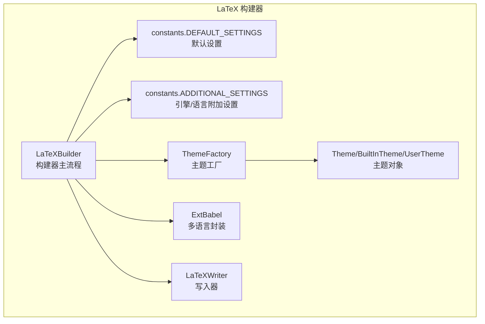
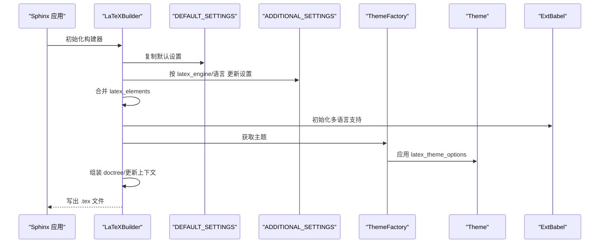
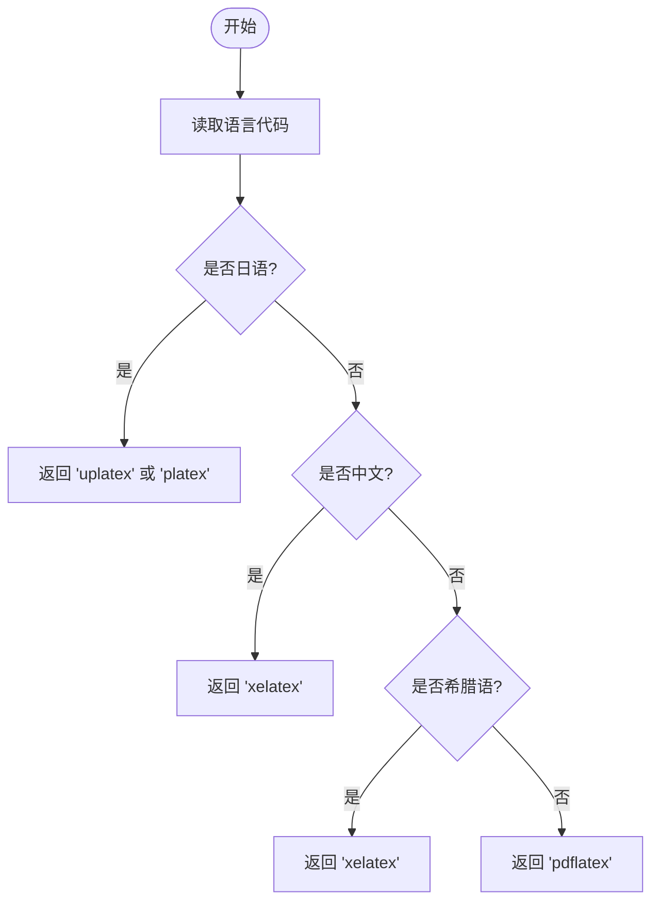
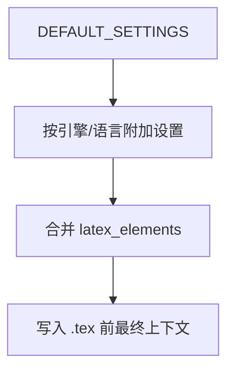
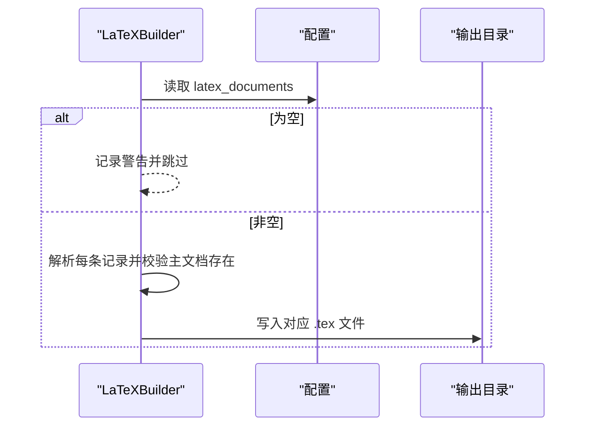
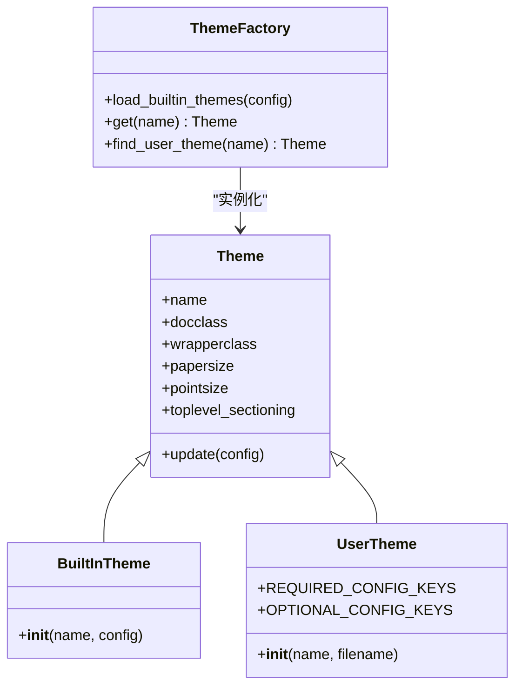
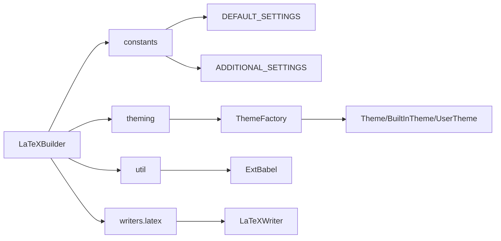

# LaTeX 配置系统

<cite>
**本文档引用的文件**
- [sphinx\builders\latex\__init__.py](file://sphinx\builders\latex\__init__.py)
- [sphinx\builders\latex\constants.py](file://sphinx\builders\latex\constants.py)
- [sphinx\builders\latex\theming.py](file://sphinx\builders\latex\theming.py)
- [sphinx\builders\latex\util.py](file://sphinx\builders\latex\util.py)
- [sphinx\writers\latex.py](file://sphinx\writers\latex.py)
- [sphinx\config.py](file://sphinx\config.py)
- [sphinx\texinputs\sphinxmanual.cls](file://sphinx\texinputs\sphinxmanual.cls)
- [sphinx\texinputs\sphinxhowto.cls](file://sphinx\texinputs\sphinxhowto.cls)
</cite>

## 目录
1. [简介](#简介)
2. [项目结构](#项目结构)
3. [核心组件](#核心组件)
4. [架构总览](#架构总览)
5. [详细组件分析](#详细组件分析)
6. [依赖分析](#依赖分析)
7. [性能考虑](#性能考虑)
8. [故障排查指南](#故障排查指南)
9. [结论](#结论)
10. [附录](#附录)

## 简介
本文件系统性阐述 Sphinx LaTeX 构建器的配置体系，重点覆盖以下方面：
- latex_engine 选择机制与各引擎（pdflatex、xelatex、lualatex、platex、uplatex）对文档生成的影响
- latex_elements 配置字典的使用方法（字体、页面布局、颜色方案、自定义宏包）
- latex_documents 配置结构与输出文件命名规则
- latex_theme 与 latex_theme_options 的主题定制能力
- 多语言（日语、中文、希腊语等）的默认配置与最佳实践

## 项目结构
围绕 LaTeX 构建器的关键模块如下：
- 构建器入口与流程控制：sphinx\builders\latex\__init__.py
- 默认与附加设置常量：sphinx\builders\latex\constants.py
- 主题工厂与主题对象：sphinx\builders\latex\theming.py
- 多语言支持工具：sphinx\builders\latex\util.py
- LaTeX 写入器与翻译器：sphinx\writers\latex.py
- 配置系统与类型校验：sphinx\config.py
- LaTeX 文档类（manual/howto）：sphinx\texinputs\sphinxmanual.cls、sphinx\texinputs\sphinxhowto.cls

**图表来源**
- [sphinx\builders\latex\__init__.py:110-646](file://sphinx\builders\latex\__init__.py#L110-L646)
- [sphinx\builders\latex\constants.py:73-210](file://sphinx\builders\latex\constants.py#L73-L210)
- [sphinx\builders\latex\theming.py:20-136](file://sphinx\builders\latex\theming.py#L20-L136)
- [sphinx\builders\latex\util.py:8-49](file://sphinx\builders\latex\util.py#L8-L49)
- [sphinx\writers\latex.py:75-102](file://sphinx\writers\latex.py#L75-L102)

**章节来源**
- [sphinx\builders\latex\__init__.py:110-646](file://sphinx\builders\latex\__init__.py#L110-L646)
- [sphinx\builders\latex\constants.py:73-210](file://sphinx\builders\latex\constants.py#L73-L210)
- [sphinx\builders\latex\theming.py:20-136](file://sphinx\builders\latex\theming.py#L20-L136)
- [sphinx\builders\latex\util.py:8-49](file://sphinx\builders\latex\util.py#L8-L49)
- [sphinx\writers\latex.py:75-102](file://sphinx\writers\latex.py#L75-L102)

## 核心组件
- LaTeXBuilder：负责初始化上下文、多语言处理、主题应用、文档树组装、写入与资源复制等全流程。
- constants.DEFAULT_SETTINGS/ADDITIONAL_SETTINGS：提供默认 LaTeX 设置与按引擎/语言的差异化设置。
- ThemeFactory/Theme：管理内置与用户自定义主题，并将 latex_theme_options 合并到主题对象。
- ExtBabel：封装 docutils Babel，提供语言检测、正则化语言名、多语选项等。
- LaTeXWriter/LaTeXTranslator：将 Docutils 节点树转换为 LaTeX 文本。

**章节来源**
- [sphinx\builders\latex\__init__.py:110-200](file://sphinx\builders\latex\__init__.py#L110-L200)
- [sphinx\builders\latex\constants.py:73-210](file://sphinx\builders\latex\constants.py#L73-L210)
- [sphinx\builders\latex\theming.py:20-136](file://sphinx\builders\latex\theming.py#L20-L136)
- [sphinx\builders\latex\util.py:8-49](file://sphinx\builders\latex\util.py#L8-L49)
- [sphinx\writers\latex.py:75-102](file://sphinx\writers\latex.py#L75-L102)

## 架构总览
LaTeX 配置系统通过“默认设置 + 引擎/语言附加设置 + 用户配置 + 主题选项”的叠加方式，最终形成模板变量上下文，驱动 LaTeX 输出。

**图表来源**
- [sphinx\builders\latex\__init__.py:175-214](file://sphinx\builders\latex\__init__.py#L175-L214)
- [sphinx\builders\latex\constants.py:125-210](file://sphinx\builders\latex\constants.py#L125-L210)
- [sphinx\builders\latex\theming.py:115-123](file://sphinx\builders\latex\theming.py#L115-L123)
- [sphinx\builders\latex\util.py:11-35](file://sphinx\builders\latex\util.py#L11-L35)

## 详细组件分析

### latex_engine 选择机制与影响
- 默认策略：根据语言自动推荐引擎
  - 日语：优先 uplatex（或 platex）
  - 中文：优先 xelatex
  - 希腊语：优先 xelatex
  - 其他：默认 pdflatex
- 引擎差异对设置的影响：
  - pdflatex：默认使用 babel、T1 字体编码、输入编码等；对西里尔字母有字体替换逻辑
  - xelatex/lualatex：默认使用 polyglossia、fontspec、xeCJK（中文）等
  - platex/uplatex：面向 Japanese TeX，使用 dvipdfmx 选项与特定几何宏包
- 关键实现位置：
  - 默认引擎选择函数
  - 引擎与语言组合的附加设置表
  - 构建器初始化时合并附加设置

**图表来源**
- [sphinx\builders\latex\__init__.py:548-556](file://sphinx\builders\latex\__init__.py#L548-L556)
- [sphinx\builders\latex\constants.py:125-210](file://sphinx\builders\latex\constants.py#L125-L210)

**章节来源**
- [sphinx\builders\latex\__init__.py:548-556](file://sphinx\builders\latex\__init__.py#L548-L556)
- [sphinx\builders\latex\constants.py:125-210](file://sphinx\builders\latex\constants.py#L125-L210)
- [sphinx\builders\latex\__init__.py:224-274](file://sphinx\builders\latex\__init__.py#L224-L274)

### latex_elements 配置字典详解
- 作用：覆盖默认 LaTeX 设置，用于字体、页面布局、宏包、索引/目录、标题页等
- 可用键（示例）：papersize、pointsize、fontenc、fontpkg、babel、polyglossia、geometry、hyperref、preamble、extrapackages 等
- 合并顺序：先复制 DEFAULT_SETTINGS，再按 latex_engine/语言附加设置更新，最后叠加 latex_elements
- 键有效性检查：未知键会被警告并忽略
- 实际生效范围：影响模板上下文，进而影响最终 .tex 输出

**图表来源**
- [sphinx\builders\latex\__init__.py:175-186](file://sphinx\builders\latex\__init__.py#L175-L186)
- [sphinx\builders\latex\constants.py:73-123](file://sphinx\builders\latex\constants.py#L73-L123)
- [sphinx\builders\latex\__init__.py:526-532](file://sphinx\builders\latex\__init__.py#L526-L532)

**章节来源**
- [sphinx\builders\latex\__init__.py:175-186](file://sphinx\builders\latex\__init__.py#L175-L186)
- [sphinx\builders\latex\__init__.py:526-532](file://sphinx\builders\latex\__init__.py#L526-L532)
- [sphinx\builders\latex\constants.py:73-123](file://sphinx\builders\latex\constants.py#L73-L123)

### latex_documents 配置结构与输出命名
- 结构：列表项为 (主文档名, 输出文件名, 标题, 作者, 主题名[, 是否仅目录])
- 默认行为：若未配置，会给出警告且不生成任何文档
- 输出文件名：默认基于项目名生成，可自定义
- 主题名：决定使用 manual 还是 howto 文档类，以及顶层章节级别

**图表来源**
- [sphinx\builders\latex\__init__.py:151-174](file://sphinx\builders\latex\__init__.py#L151-L174)
- [sphinx\builders\latex\__init__.py:575-587](file://sphinx\builders\latex\__init__.py#L575-L587)

**章节来源**
- [sphinx\builders\latex\__init__.py:151-174](file://sphinx\builders\latex\__init__.py#L151-L174)
- [sphinx\builders\latex\__init__.py:575-587](file://sphinx\builders\latex\__init__.py#L575-L587)

### latex_theme 与 latex_theme_options
- latex_theme：选择内置主题（manual、howto）或用户自定义主题
- latex_theme_options：允许覆盖主题的可更新键（如 papersize、pointsize）
- 主题加载顺序：内置主题 → 用户主题配置文件 → 合并 latex_theme_options

**图表来源**
- [sphinx\builders\latex\theming.py:20-136](file://sphinx\builders\latex\theming.py#L20-L136)

**章节来源**
- [sphinx\builders\latex\theming.py:20-136](file://sphinx\builders\latex\theming.py#L20-L136)
- [sphinx\builders\latex\__init__.py:304-330](file://sphinx\builders\latex\__init__.py#L304-L330)

### 多语言与字体/排版细节
- 多语言支持：ExtBabel 封装 docutils Babel，提供语言名规范化、正则化语言名、多语选项（如德语新旧拼写）
- 西里尔字母与希腊字母：pdflatex 下对字体替换与编码进行特殊处理；xelatex/lualatex 对希腊语提供专用字体设置
- 中文：xelatex 下启用 xeCJK 并调整 verbatim 格式参数
- 法语：xelatex/lualatex 默认使用 babel 而非 polyglossia

**章节来源**
- [sphinx\builders\latex\util.py:8-49](file://sphinx\builders\latex\util.py#L8-L49)
- [sphinx\builders\latex\constants.py:188-210](file://sphinx\builders\latex\constants.py#L188-L210)
- [sphinx\builders\latex\__init__.py:224-274](file://sphinx\builders\latex\__init__.py#L224-L274)

### LaTeX 文档类与顶层章节
- 文档类：manual 使用 sphinxmanual.cls，howto 使用 sphinxhowto.cls
- 顶层章节：manual 默认 chapter，howto 在非日语情况下默认 section

**章节来源**
- [sphinx\texinputs\sphinxmanual.cls:1-129](file://sphinx\texinputs\sphinxmanual.cls#L1-L129)
- [sphinx\texinputs\sphinxhowto.cls:1-103](file://sphinx\texinputs\sphinxhowto.cls#L1-L103)
- [sphinx\builders\latex\theming.py:53-68](file://sphinx\builders\latex\theming.py#L53-L68)

## 依赖分析
- LaTeXBuilder 依赖：
  - constants 提供默认与附加设置
  - theming 提供主题解析与合并
  - util 提供多语言封装
  - writers 提供写入器
- 配置系统：
  - config 提供 ENUM 类型校验与配置值注册
- LaTeX 文档类：
  - sphinxmanual.cls / sphinxhowto.cls 定义顶层章节与标题页样式

**图表来源**
- [sphinx\builders\latex\__init__.py:14-33](file://sphinx\builders\latex\__init__.py#L14-L33)
- [sphinx\builders\latex\constants.py:1-219](file://sphinx\builders\latex\constants.py#L1-L219)
- [sphinx\builders\latex\theming.py:1-136](file://sphinx\builders\latex\theming.py#L1-L136)
- [sphinx\builders\latex\util.py:1-49](file://sphinx\builders\latex\util.py#L1-L49)
- [sphinx\writers\latex.py:1-102](file://sphinx\writers\latex.py#L1-L102)

**章节来源**
- [sphinx\builders\latex\__init__.py:14-33](file://sphinx\builders\latex\__init__.py#L14-L33)
- [sphinx\config.py:75-92](file://sphinx\config.py#L75-L92)

## 性能考虑
- 合并设置与上下文更新在单次构建中执行一次，复杂度与文档数量线性相关
- 多语言与字体替换逻辑仅在 pdflatex 下对特定编码生效，避免不必要的处理
- 主题与宏包合并发生在写入前，尽量减少重复计算

## 故障排查指南
- 未配置 latex_documents：构建器会发出警告且不生成任何文档
- 未知 latex_elements 键：会被忽略并记录警告
- 未知 latex_theme_options 键：会被忽略并记录警告
- logo 文件不存在：会在复制阶段抛出错误
- 无效语言代码：ExtBabel 会回退到英语并标记不受支持

**章节来源**
- [sphinx\builders\latex\__init__.py:151-174](file://sphinx\builders\latex\__init__.py#L151-L174)
- [sphinx\builders\latex\__init__.py:526-539](file://sphinx\builders\latex\__init__.py#L526-L539)
- [sphinx\builders\latex\__init__.py:493-503](file://sphinx\builders\latex\__init__.py#L493-L503)
- [sphinx\builders\latex\util.py:20-35](file://sphinx\builders\latex\util.py#L20-L35)

## 结论
Sphinx LaTeX 配置系统通过“默认设置 + 引擎/语言附加设置 + 用户配置 + 主题选项”的分层叠加，实现了灵活而可控的 LaTeX 输出。合理选择 latex_engine、正确配置 latex_elements 与 latex_documents，并结合 latex_theme_options，可在不同语言与文档类型下获得一致且高质量的 PDF 输出。

## 附录

### 配置项速查（LaTeX 相关）
- latex_engine：引擎选择（pdflatex、xelatex、lualatex、platex、uplatex）
- latex_documents：文档清单与输出命名
- latex_elements：覆盖默认 LaTeX 设置
- latex_theme / latex_theme_options：主题与主题选项
- latex_use_xindy：索引工具偏好
- latex_table_style：表格样式（booktabs、borderless、colorrows 等）
- latex_show_urls / latex_show_pagerefs：链接与页码显示策略
- latex_logo / latex_additional_files：徽标与附加文件
- latex_docclass：针对语言的文档类映射

**章节来源**
- [sphinx\builders\latex\__init__.py:598-639](file://sphinx\builders\latex\__init__.py#L598-L639)
- [sphinx\builders\latex\__init__.py:575-587](file://sphinx\builders\latex\__init__.py#L575-L587)
- [sphinx\builders\latex\constants.py:73-123](file://sphinx\builders\latex\constants.py#L73-L123)