# 其他构建器

<cite>
**本文引用的文件**
- [epub3.py](file://sphinx/builders/epub3.py)
- [_epub_base.py](file://sphinx/builders/_epub_base.py)
- [manpage.py](file://sphinx/builders/manpage.py)
- [text.py](file://sphinx/builders/text.py)
- [xml.py](file://sphinx/builders/xml.py)
- [linkcheck.py](file://sphinx/builders/linkcheck.py)
- [dirhtml.py](file://sphinx/builders/dirhtml.py)
- [singlehtml.py](file://sphinx/builders/singlehtml.py)
- [gettext.py](file://sphinx/builders/gettext.py)
- [content.opf.jinja](file://sphinx/templates/epub3/content.opf.jinja)
- [message.pot.jinja](file://sphinx/templates/gettext/message.pot.jinja)
</cite>

## 目录
1. [简介](#简介)
2. [项目结构](#项目结构)
3. [核心组件](#核心组件)
4. [架构总览](#架构总览)
5. [详细组件分析](#详细组件分析)
6. [依赖分析](#依赖分析)
7. [性能考虑](#性能考虑)
8. [故障排查指南](#故障排查指南)
9. [结论](#结论)
10. [附录](#附录)

## 简介
本文件系统化梳理 Sphinx 的“其他构建器”，覆盖以下主题：
- EPUB3 构建器：电子书生成机制（内容结构、封面与元数据、导航与目录、压缩打包）、阅读器兼容性要点与配置项
- Manpage 构建器：Unix 手册页生成流程（输入清单、页面写入、章节目录）
- Text 构建器：纯文本输出特性与适用场景（章节编号、换行风格、并行写入）
- XML 构建器：Docutils 原生 XML 与伪 XML 导出、可定制的 pretty 输出
- Linkcheck 构建器：外部链接验证机制（并发检查、重定向与速率限制、锚点校验）
- 特殊用途构建器：DirHTML、SingleHTML、Gettext 的配置与使用方法

## 项目结构
这些构建器位于 sphinx/builders 下，部分继承自通用基类或 HTML 构建体系，部分独立实现。EPUB3 构建器基于 EPUB 基类；Manpage、Text、XML、Linkcheck、DirHTML、SingleHTML、Gettext 各自实现 Builder 接口或相关父类。

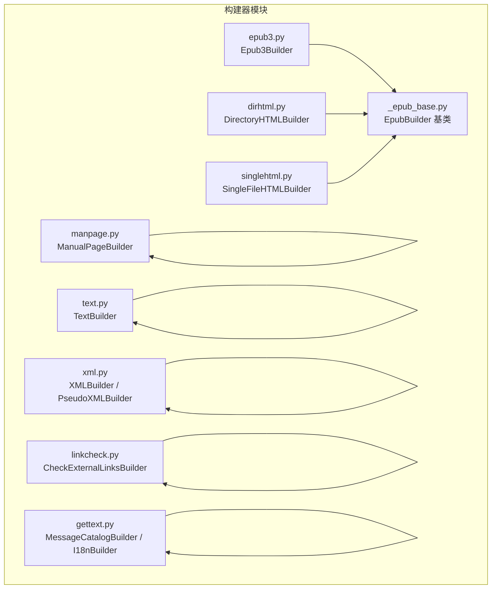

图表来源
- [epub3.py:74-364](file://sphinx/builders/epub3.py#L74-L364)
- [_epub_base.py:129-810](file://sphinx/builders/_epub_base.py#L129-L810)
- [manpage.py:32-140](file://sphinx/builders/manpage.py#L32-L140)
- [text.py:24-90](file://sphinx/builders/text.py#L24-L90)
- [xml.py:24-122](file://sphinx/builders/xml.py#L24-L122)
- [linkcheck.py:83-862](file://sphinx/builders/linkcheck.py#L83-L862)
- [dirhtml.py:19-51](file://sphinx/builders/dirhtml.py#L19-L51)
- [singlehtml.py:31-224](file://sphinx/builders/singlehtml.py#L31-L224)
- [gettext.py:157-365](file://sphinx/builders/gettext.py#L157-L365)

章节来源
- [epub3.py:1-364](file://sphinx/builders/epub3.py#L1-L364)
- [_epub_base.py:1-810](file://sphinx/builders/_epub_base.py#L1-L810)
- [manpage.py:1-140](file://sphinx/builders/manpage.py#L1-L140)
- [text.py:1-90](file://sphinx/builders/text.py#L1-L90)
- [xml.py:1-122](file://sphinx/builders/xml.py#L1-L122)
- [linkcheck.py:1-862](file://sphinx/builders/linkcheck.py#L1-L862)
- [dirhtml.py:1-51](file://sphinx/builders/dirhtml.py#L1-L51)
- [singlehtml.py:1-224](file://sphinx/builders/singlehtml.py#L1-L224)
- [gettext.py:1-365](file://sphinx/builders/gettext.py#L1-L365)

## 核心组件
- EPUB3 构建器：负责生成 EPUB 文件，包含 mimetype、container.xml、content.opf、toc.ncx、nav.xhtml，并最终打包为 .epub
- Manpage 构建器：根据配置清单生成手册页（groff），支持章节目录与作者信息
- Text 构建器：将文档树转换为纯文本，支持章节编号与换行风格
- XML 构建器：输出 Docutils 原生 XML 或伪 XML，支持 pretty 输出与属性规范化
- Linkcheck 构建器：扫描文档中的外部链接，多线程并发检查，记录状态与结果
- DirHTML/SingeHTML：URL 与输出路径策略的变体，分别生成目录型 URL 与单页 HTML
- Gettext 构建器：提取可翻译消息，生成 POT 模板文件

章节来源
- [epub3.py:74-364](file://sphinx/builders/epub3.py#L74-L364)
- [manpage.py:32-140](file://sphinx/builders/manpage.py#L32-L140)
- [text.py:24-90](file://sphinx/builders/text.py#L24-L90)
- [xml.py:24-122](file://sphinx/builders/xml.py#L24-L122)
- [linkcheck.py:83-862](file://sphinx/builders/linkcheck.py#L83-L862)
- [dirhtml.py:19-51](file://sphinx/builders/dirhtml.py#L19-L51)
- [singlehtml.py:31-224](file://sphinx/builders/singlehtml.py#L31-L224)
- [gettext.py:157-365](file://sphinx/builders/gettext.py#L157-L365)

## 架构总览
EPUB3 构建器在 EPUB 基类之上扩展了 EPUB3 特有元数据与模板渲染逻辑；Manpage、Text、XML、Linkcheck、DirHTML、SingleHTML、Gettext 各自实现 Builder 接口的不同职责。下图展示 EPUB3 与其他构建器的关系及关键流程。

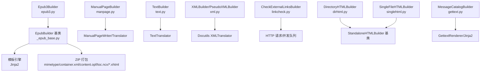

图表来源
- [epub3.py:74-364](file://sphinx/builders/epub3.py#L74-L364)
- [_epub_base.py:129-810](file://sphinx/builders/_epub_base.py#L129-L810)
- [manpage.py:32-140](file://sphinx/builders/manpage.py#L32-L140)
- [text.py:24-90](file://sphinx/builders/text.py#L24-L90)
- [xml.py:24-122](file://sphinx/builders/xml.py#L24-L122)
- [linkcheck.py:83-862](file://sphinx/builders/linkcheck.py#L83-L862)
- [dirhtml.py:19-51](file://sphinx/builders/dirhtml.py#L19-L51)
- [singlehtml.py:31-224](file://sphinx/builders/singlehtml.py#L31-L224)
- [gettext.py:157-365](file://sphinx/builders/gettext.py#L157-L365)

## 详细组件分析

### EPUB3 构建器（Epub3Builder）
- 内容结构与元数据
  - 通过模板渲染生成 content.opf、toc.ncx、nav.xhtml、mimetype、container.xml
  - 元数据字段包括标题、作者、语言、出版者、版权、标识符、日期、版本等
  - 支持 EPUB 版本、书写方向、滚动轴、ibooks:version 等属性
- 封面处理
  - 可配置封面图片与 HTML 模板，自动插入到 spine 与 manifest
  - 生成封面专用页面并加入引导条目
- 导航与目录
  - 从根文档与 toctree 提取导航节点，构建 navlist/navpoints
  - 控制 TOC 深度与是否包含隐藏条目
- 链接与可见 URL
  - 修复片段标识符中的冒号问题，避免阅读器误判协议
  - 可选将外部链接以脚注或内联形式显示
- 图像处理
  - 可选使用 Pillow 转换与缩放图像，支持矢量图识别
- 打包
  - 使用 ZIP 压缩，mimetype 必须不压缩且作为第一个条目

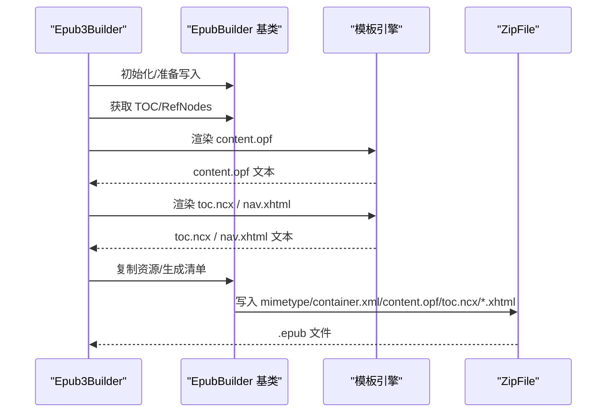

图表来源
- [epub3.py:92-100](file://sphinx/builders/epub3.py#L92-L100)
- [_epub_base.py:512-810](file://sphinx/builders/_epub_base.py#L512-L810)
- [content.opf.jinja:1-51](file://sphinx/templates/epub3/content.opf.jinja#L1-L51)

章节来源
- [epub3.py:74-364](file://sphinx/builders/epub3.py#L74-L364)
- [_epub_base.py:129-810](file://sphinx/builders/_epub_base.py#L129-L810)
- [content.opf.jinja:1-51](file://sphinx/templates/epub3/content.opf.jinja#L1-L51)

### Manpage 构建器（ManualPageBuilder）
- 输入与配置
  - 读取 man_pages 列表，每项包含文档名、名称、描述、作者列表、章节
  - 支持按章节创建子目录（man1、man2…）或直接输出到根目录
- 文档树处理
  - 获取 doctree，内联 toctree，解析交叉引用
  - 移除悬空引用节点，应用嵌套内联变换
- 输出
  - 使用 ManualPageWriter/Translator 生成纯文本手册页
  - 写入 UTF-8 文件，文件名为 name.section

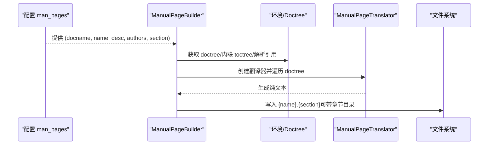

图表来源
- [manpage.py:54-104](file://sphinx/builders/manpage.py#L54-L104)

章节来源
- [manpage.py:32-140](file://sphinx/builders/manpage.py#L32-L140)

### Text 构建器（TextBuilder）
- 输出特性
  - 每个文档生成一个 .txt 文件
  - 支持章节编号、分隔字符、换行风格（unix/mac/windows）
  - 并行写入（allow_parallel），按需判断过期文档
- 写入流程
  - 创建 TextTranslator，遍历 doctree，输出 body
  - 写入 UTF-8 文件，失败时记录警告

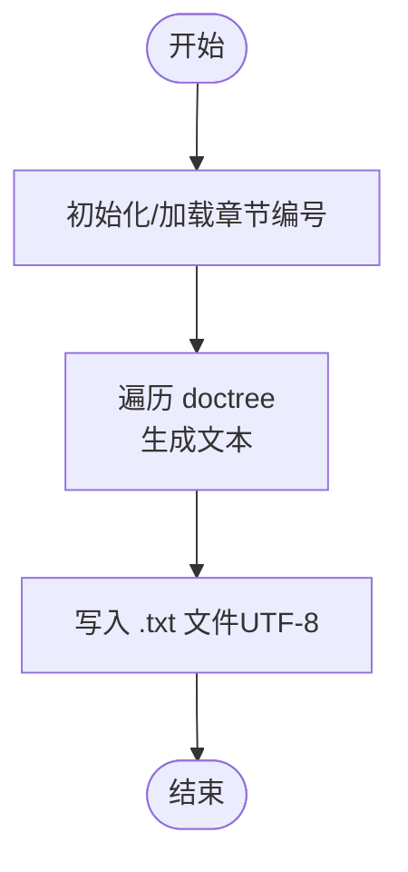

图表来源
- [text.py:39-72](file://sphinx/builders/text.py#L39-L72)

章节来源
- [text.py:24-90](file://sphinx/builders/text.py#L24-L90)

### XML 构建器（XMLBuilder / PseudoXMLBuilder）
- Docutils 原生 XML
  - 使用 Docutils XMLTranslator 输出 XML，支持 pretty 输出与声明
  - 对属性值中的元组进行列表化，避免底层库格式化问题
- 伪 XML
  - 用于调试与显示，直接调用 doctree.pformat()

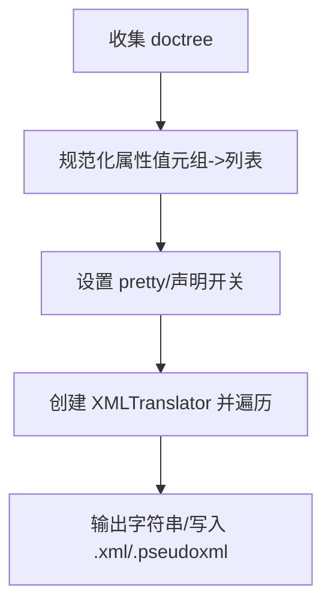

图表来源
- [xml.py:60-108](file://sphinx/builders/xml.py#L60-L108)

章节来源
- [xml.py:24-122](file://sphinx/builders/xml.py#L24-L122)

### Linkcheck 构建器（CheckExternalLinksBuilder）
- 收集与预处理
  - 在文档树中收集参考、图像、原始节点中的 URI
  - 触发 linkcheck-process-uri 事件允许扩展注入/改写
- 并发检查
  - 多工作线程优先尝试 HEAD，必要时回退 GET
  - 支持重试、超时、TLS 验证、忽略重定向、锚点校验
  - 速率限制与指数退避，尊重 Retry-After
- 结果输出
  - 生成 output.txt（人类可读）与 output.json（机器可读）
  - 统计 broken 与 timeout 数量，影响退出码

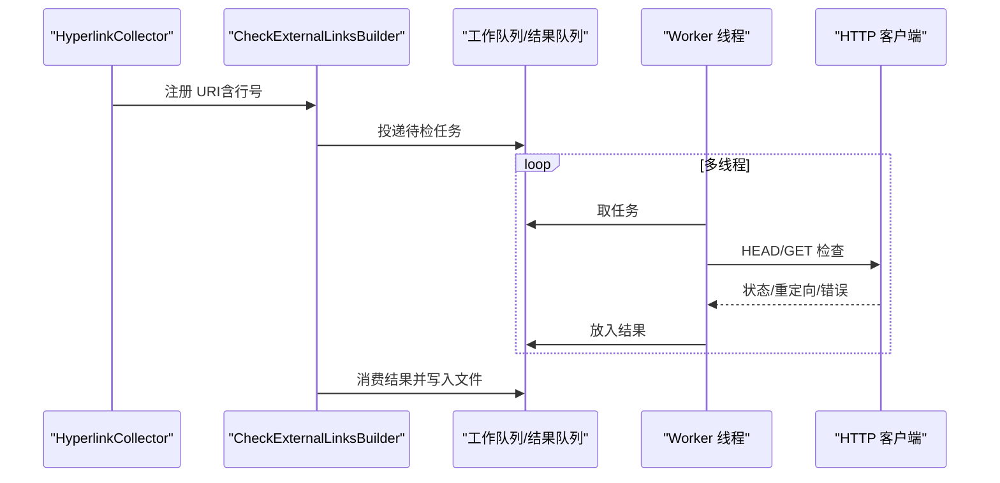

图表来源
- [linkcheck.py:219-422](file://sphinx/builders/linkcheck.py#L219-L422)
- [linkcheck.py:499-734](file://sphinx/builders/linkcheck.py#L499-L734)

章节来源
- [linkcheck.py:83-862](file://sphinx/builders/linkcheck.py#L83-L862)

### DirHTML 构建器（DirectoryHTMLBuilder）
- URL 与输出路径策略
  - 将每个页面输出为 index.html，URL 不带 .html 后缀
  - index 页面返回空路径，末段为 index 的页面去除末尾 “/index”

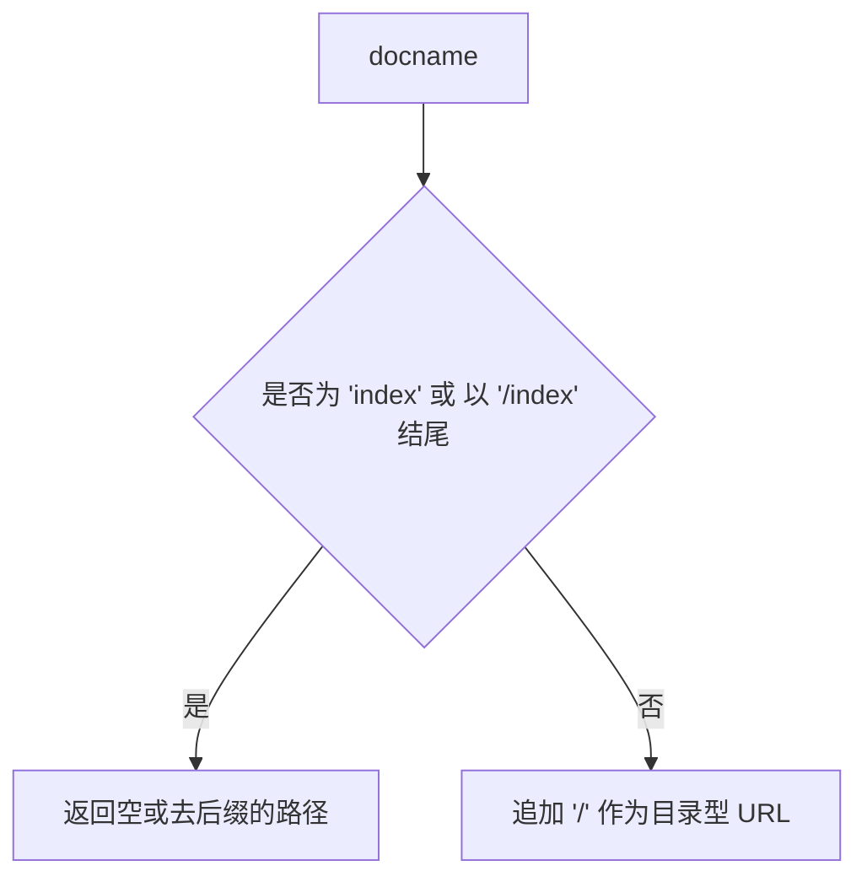

图表来源
- [dirhtml.py:27-38](file://sphinx/builders/dirhtml.py#L27-L38)

章节来源
- [dirhtml.py:19-51](file://sphinx/builders/dirhtml.py#L19-L51)

### SingleHTML 构建器（SingleFileHTMLBuilder）
- 单页策略
  - 将整棵文档树内联到单一 HTML 页面，所有内部引用指向同一页锚点
  - 重写 get_target_uri/get_relative_uri 以统一锚点
- 目录与编号
  - 合并各文档的章节编号与图编号，避免 ID 冲突
  - 生成全局 TOC 作为侧边栏或页面内容
- 输出
  - 写入序列化与最终文档，复制静态/额外文件，生成构建信息与索引

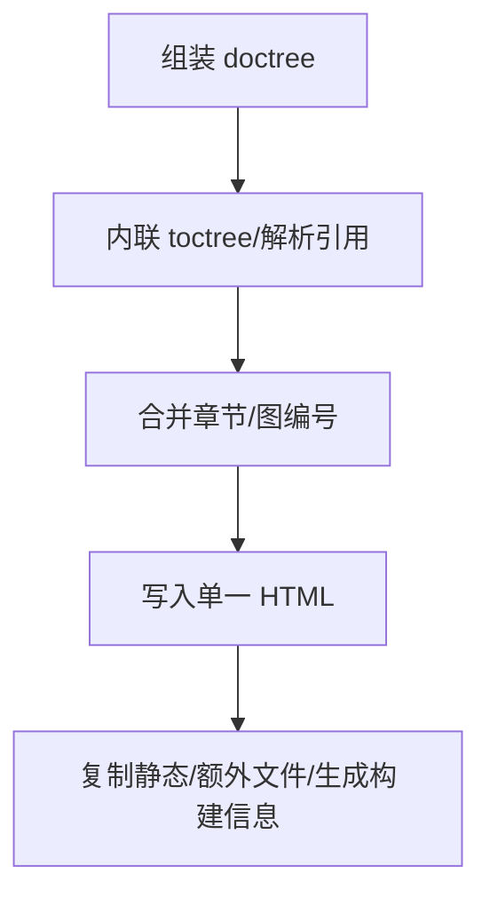

图表来源
- [singlehtml.py:91-187](file://sphinx/builders/singlehtml.py#L91-L187)

章节来源
- [singlehtml.py:31-224](file://sphinx/builders/singlehtml.py#L31-L224)

### Gettext 构建器（MessageCatalogBuilder）
- 消息提取
  - 遍历文档树与 toctree，提取可翻译文本，记录源位置与唯一 ID
  - 支持索引条目的可翻译提取
- 模板渲染
  - 使用 GettextRenderer（Jinja2）渲染 message.pot.jinja
  - 支持位置信息与 UUID 输出控制
- 输出
  - 生成 .pot 文件，按 textdomain 分类存放

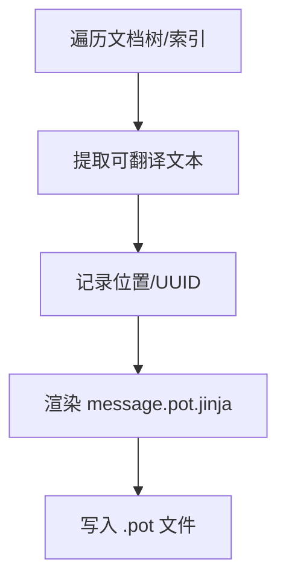

图表来源
- [gettext.py:179-330](file://sphinx/builders/gettext.py#L179-L330)
- [message.pot.jinja:1-34](file://sphinx/templates/gettext/message.pot.jinja#L1-L34)

章节来源
- [gettext.py:157-365](file://sphinx/builders/gettext.py#L157-L365)
- [message.pot.jinja:1-34](file://sphinx/templates/gettext/message.pot.jinja#L1-L34)

## 依赖分析
- 继承与组合
  - Epub3Builder 继承 EpubBuilder，后者提供 EPUB 元数据、清单、打包等通用能力
  - DirectoryHTMLBuilder/SingleFileHTMLBuilder 继承 StandaloneHTMLBuilder，复用 HTML 构建生态
  - Gettext 构建器基于 Builder 与模板系统
  - Linkcheck 构建器基于 DummyBuilder，配合并发与网络请求
- 外部依赖
  - EPUB 图像处理依赖 Pillow（可选）
  - XMLBuilder 依赖 Docutils XMLTranslator
  - Linkcheck 依赖 requests 会话与并发队列

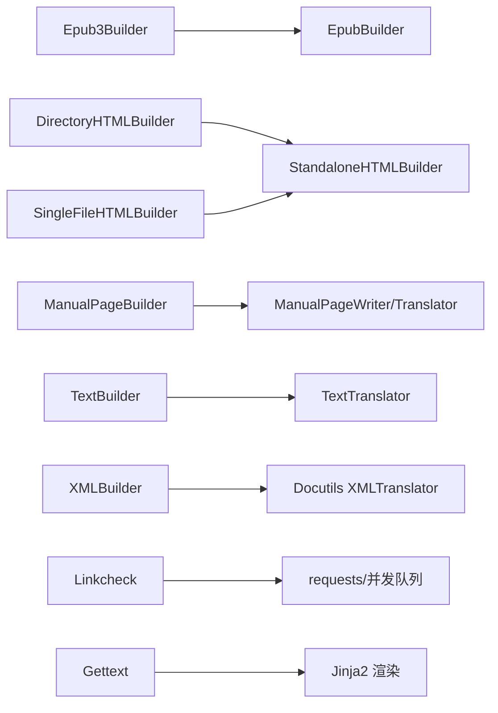

图表来源
- [epub3.py:74-364](file://sphinx/builders/epub3.py#L74-L364)
- [_epub_base.py:129-810](file://sphinx/builders/_epub_base.py#L129-L810)
- [dirhtml.py:19-51](file://sphinx/builders/dirhtml.py#L19-L51)
- [singlehtml.py:31-224](file://sphinx/builders/singlehtml.py#L31-L224)
- [manpage.py:32-140](file://sphinx/builders/manpage.py#L32-L140)
- [text.py:24-90](file://sphinx/builders/text.py#L24-L90)
- [xml.py:24-122](file://sphinx/builders/xml.py#L24-L122)
- [linkcheck.py:83-862](file://sphinx/builders/linkcheck.py#L83-L862)
- [gettext.py:157-365](file://sphinx/builders/gettext.py#L157-L365)

章节来源
- [epub3.py:74-364](file://sphinx/builders/epub3.py#L74-L364)
- [_epub_base.py:129-810](file://sphinx/builders/_epub_base.py#L129-L810)
- [dirhtml.py:19-51](file://sphinx/builders/dirhtml.py#L19-L51)
- [singlehtml.py:31-224](file://sphinx/builders/singlehtml.py#L31-L224)
- [manpage.py:32-140](file://sphinx/builders/manpage.py#L32-L140)
- [text.py:24-90](file://sphinx/builders/text.py#L24-L90)
- [xml.py:24-122](file://sphinx/builders/xml.py#L24-L122)
- [linkcheck.py:83-862](file://sphinx/builders/linkcheck.py#L83-L862)
- [gettext.py:157-365](file://sphinx/builders/gettext.py#L157-L365)

## 性能考虑
- 并行写入
  - Text、XML、Gettext 构建器均支持并行写入（allow_parallel/并行安全）
- 并发检查
  - Linkcheck 使用多线程队列，合理设置 linkcheck_workers，避免对目标站点造成压力
- 图像处理
  - EPUB 图像可使用 Pillow 进行格式转换与缩放，建议在需要时启用以减小体积
- 输出优化
  - XMLBuilder 的 xml_pretty 可控制输出大小与可读性权衡

## 故障排查指南
- EPUB3
  - 若阅读器报错，检查 content.opf 中语言、标识符、版本、封面与 spine 是否匹配
  - 确认 mimetype 为不压缩且为第一个条目
- Manpage
  - man_pages 中引用的文档不存在会发出警告；确认文档名与作者列表格式
- Text/XML
  - 写入失败会记录警告；检查 outdir 权限与磁盘空间
- Linkcheck
  - broken/timeout 记录在 output.txt/json；根据行号定位问题链接
  - 调整 linkcheck_timeout、linkcheck_retries、linkcheck_workers
  - 对特定站点配置 linkcheck_request_headers、linkcheck_auth
- DirHTML/SingleHTML
  - URL 与锚点冲突时，检查 get_target_uri/get_relative_uri 行为
- Gettext
  - POT 文件未更新可能因头部时间戳未变化；确认 SOURCE_DATE_EPOCH 或修改时间

章节来源
- [linkcheck.py:96-217](file://sphinx/builders/linkcheck.py#L96-L217)
- [_epub_base.py:512-810](file://sphinx/builders/_epub_base.py#L512-L810)
- [manpage.py:42-104](file://sphinx/builders/manpage.py#L42-L104)
- [text.py:60-72](file://sphinx/builders/text.py#L60-L72)
- [xml.py:60-92](file://sphinx/builders/xml.py#L60-L92)
- [dirhtml.py:27-38](file://sphinx/builders/dirhtml.py#L27-L38)
- [singlehtml.py:42-52](file://sphinx/builders/singlehtml.py#L42-L52)
- [gettext.py:210-227](file://sphinx/builders/gettext.py#L210-L227)

## 结论
Sphinx 的其他构建器覆盖了从电子书、手册页、纯文本、XML 导出到外部链接验证与国际化消息提取的完整链路。EPUB3 构建器在 EPUB 基类上提供了丰富的元数据与模板渲染能力；Manpage、Text、XML、Linkcheck、DirHTML、SingleHTML、Gettext 各司其职，满足多样化的发布与质量保障需求。通过合理配置与并发策略，可在保证质量的同时提升构建效率。

## 附录
- EPUB3 关键配置项（示例）
  - epub_language、epub_title、epub_author、epub_publisher、epub_copyright、epub_uid、epub_identifier、epub_scheme、epub_version
  - epub_cover、epub_pre_files、epub_post_files、epub_css_files、epub_tocdepth、epub_tocscope、epub_show_urls、epub_writing_mode
- Manpage 关键配置项
  - man_pages、man_make_section_directory、man_show_urls
- Text 关键配置项
  - text_sectionchars、text_newlines、text_add_secnumbers、text_secnumber_suffix
- XML 关键配置项
  - xml_pretty
- Linkcheck 关键配置项
  - linkcheck_workers、linkcheck_timeout、linkcheck_retries、linkcheck_request_headers、linkcheck_auth、linkcheck_anchors、linkcheck_anchors_ignore、linkcheck_allowed_redirects、linkcheck_ignore、linkcheck_exclude_documents、linkcheck_rate_limit_timeout、linkcheck_report_timeouts_as_broken
- DirHTML/SingleHTML 关键配置项
  - 由各自构建器注册（如 singlehtml_sidebars）
- Gettext 关键配置项
  - gettext_compact、gettext_location、gettext_uuid、gettext_auto_build、gettext_additional_targets、gettext_last_translator、gettext_language_team