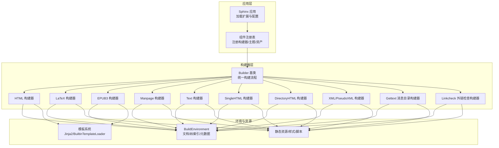
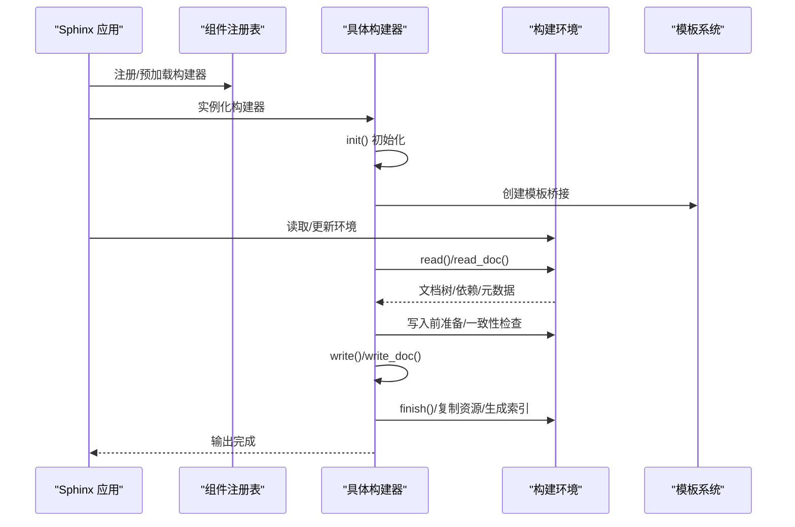
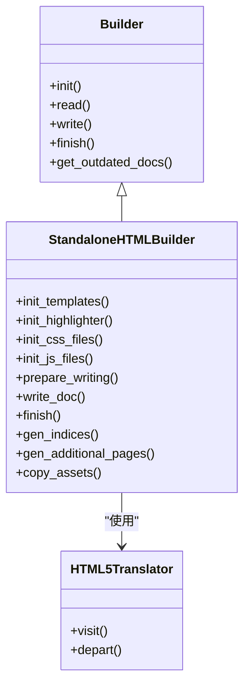
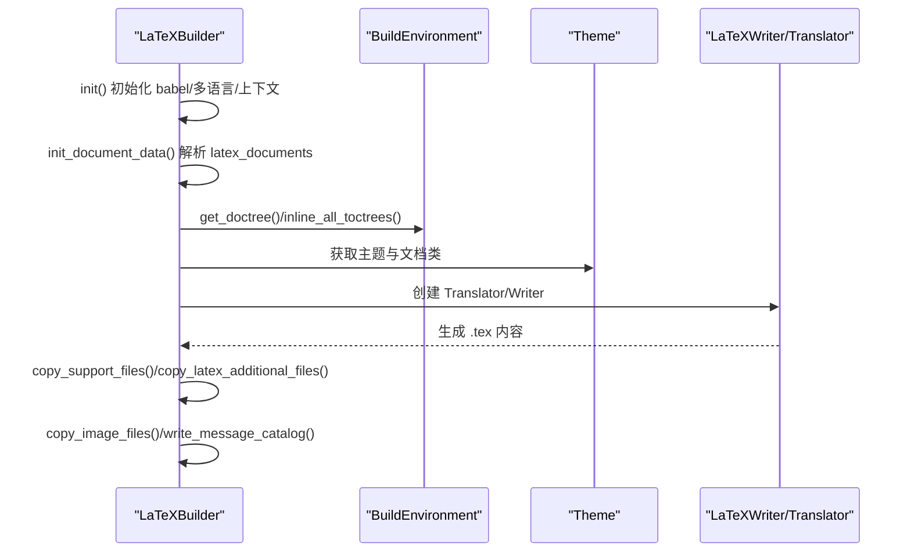
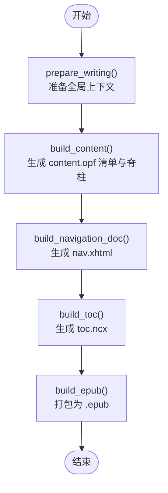
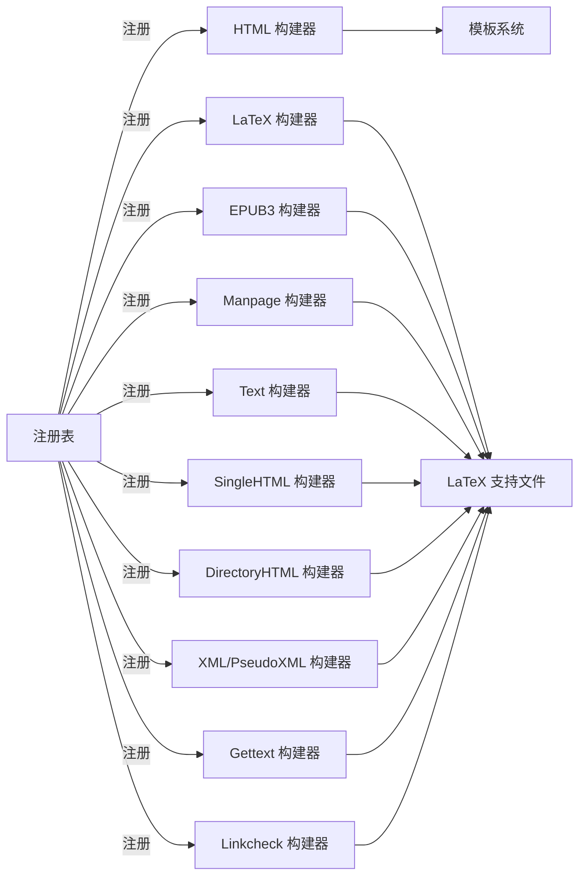

# 构建器系统

<cite>
**本文引用的文件**
- [sphinx\builders\__init__.py](file://sphinx/builders/__init__.py)
- [sphinx\builders\html\__init__.py](file://sphinx/builders/html/__init__.py)
- [sphinx\builders\latex\__init__.py](file://sphinx/builders/latex/__init__.py)
- [sphinx\builders\manpage.py](file://sphinx/builders/manpage.py)
- [sphinx\builders\text.py](file://sphinx/builders/text.py)
- [sphinx\builders\epub3.py](file://sphinx/builders/epub3.py)
- [sphinx\builders\_epub_base.py](file://sphinx/builders/_epub_base.py)
- [sphinx\builders\dirhtml.py](file://sphinx/builders/dirhtml.py)
- [sphinx\builders\singlehtml.py](file://sphinx/builders/singlehtml.py)
- [sphinx\builders\xml.py](file://sphinx/builders/xml.py)
- [sphinx\builders\gettext.py](file://sphinx/builders/gettext.py)
- [sphinx\builders\linkcheck.py](file://sphinx/builders/linkcheck.py)
- [sphinx\application.py](file://sphinx/application.py)
- [sphinx\registry.py](file://sphinx/registry.py)
</cite>

## 目录
1. [简介](#简介)
2. [项目结构](#项目结构)
3. [核心组件](#核心组件)
4. [架构总览](#架构总览)
5. [详细组件分析](#详细组件分析)
6. [依赖关系分析](#依赖关系分析)
7. [性能考虑](#性能考虑)
8. [故障排除指南](#故障排除指南)
9. [结论](#结论)
10. [附录](#附录)

## 简介
本文件系统性阐述 Sphinx 的构建器（Builder）体系：从架构原理到多格式输出机制，覆盖 HTML、LaTeX、EPUB、Manpage、Text 等主流构建器的实现细节与配置要点，并提供自定义构建器开发指南、性能优化建议与常见问题排查方法。目标是帮助读者在理解内部工作机理的同时，高效地扩展与维护构建流程。

## 项目结构
Sphinx 将“构建器”作为输出格式的抽象实现，统一由基类管理构建生命周期，各具体构建器按需实现读取、写入、资源复制等步骤。核心目录与文件如下：
- 构建器基类与通用流程：sphinx/builders/__init__.py
- HTML 构建器：sphinx/builders/html/__init__.py
- LaTeX 构建器：sphinx/builders/latex/__init__.py
- 其他构建器：manpage、text、epub3、dirhtml、singlehtml、xml、gettext、linkcheck
- 应用入口与扩展注册：sphinx/application.py、sphinx/registry.py

图表来源
- [sphinx\application.py:78-141](file://sphinx/application.py#L78-L141)
- [sphinx\registry.py:72-196](file://sphinx/registry.py#L72-L196)
- [sphinx\builders\__init__.py:64-126](file://sphinx/builders/__init__.py#L64-L126)

章节来源
- [sphinx\application.py:78-141](file://sphinx/application.py#L78-L141)
- [sphinx\registry.py:72-196](file://sphinx/registry.py#L72-L196)

## 核心组件
- Builder 基类：定义构建器的统一接口与生命周期（初始化、读取、一致性检查、解析引用、写入、完成），并提供模板桥接、国际化编译、并行任务等通用能力。
- 具体构建器：按输出格式实现 read/write/finish 等方法，负责特定的模板渲染、资源复制、索引生成、打包等。
- 组件注册表：集中管理构建器、主题、CSS/JS 资产、LaTeX 宏包、翻译器映射等，支持扩展动态注册与覆盖。
- 应用入口：Sphinx 应用负责加载内置扩展、注册构建器、触发配置事件与构建流程。

章节来源
- [sphinx\builders\__init__.py:64-126](file://sphinx/builders/__init__.py#L64-L126)
- [sphinx\registry.py:72-196](file://sphinx/registry.py#L72-L196)
- [sphinx\application.py:78-141](file://sphinx/application.py#L78-L141)

## 架构总览
下图展示从应用启动到构建完成的关键阶段与交互：

图表来源
- [sphinx\builders\__init__.py:319-467](file://sphinx/builders/__init__.py#L319-L467)
- [sphinx\builders\__init__.py:469-577](file://sphinx/builders/__init__.py#L469-L577)
- [sphinx\builders\__init__.py:705-750](file://sphinx/builders/__init__.py#L705-L750)

## 详细组件分析

### HTML 构建器（StandaloneHTMLBuilder）
- 角色与特性
  - 输出独立 HTML 页面，支持主题、样式、脚本、搜索索引、下载源码、图片复制等。
  - 支持并行写入，具备增量构建判断与 build_info 对比。
- 关键实现点
  - 主题与模板：通过 HTMLThemeFactory 与模板桥接初始化主题上下文。
  - 静态资源：CSS/JS 文件注册与优先级控制；支持用户自定义与扩展注入。
  - 搜索索引：IndexBuilder 构建搜索索引与检索页面。
  - 导航与索引：生成通用索引、域索引、搜索页、OpenSearch 描述文件。
  - 图片与下载：复制图片与下载文件至输出目录。
  - 页面上下文：收集父子关系、前后页、标题、元信息、本地 TOC 等。
- 配置要点
  - html_theme、html_theme_options、html_static_path、html_extra_path、html_css_files、html_js_files、html_search_* 等。
  - html_domain_indices、html_last_updated_fmt、html_use_opensearch、html_copy_source 等。

图表来源
- [sphinx\builders\html\__init__.py:109-189](file://sphinx/builders/html/__init__.py#L109-L189)
- [sphinx\builders\html\__init__.py:427-559](file://sphinx/builders/html/__init__.py#L427-L559)
- [sphinx\builders\html\__init__.py:644-721](file://sphinx/builders/html/__init__.py#L644-L721)

章节来源
- [sphinx\builders\html\__init__.py:109-189](file://sphinx/builders/html/__init__.py#L109-L189)
- [sphinx\builders\html\__init__.py:427-559](file://sphinx/builders/html/__init__.py#L427-L559)
- [sphinx\builders\html\__init__.py:644-721](file://sphinx/builders/html/__init__.py#L644-L721)

### LaTeX 构建器（LaTeXBuilder）
- 角色与特性
  - 生成 LaTeX 源文件，供 LaTeX 引擎编译为 PDF；支持多语言、字体/宏包、表格样式、索引与目录等。
- 工作流程
  - 初始化：babel/polyglossia、多语言设置、主题与模板变量、高亮样式文件。
  - 文档数据：解析 latex_documents 配置，组装 doctree 并解析交叉引用。
  - 写入：生成 .tex 文件，复制支持文件与额外文件，复制图片与徽标。
  - 完成：复制图像、写入消息目录样式文件。
- 关键配置
  - latex_engine、latex_documents、latex_elements、latex_table_style、latex_theme、latex_use_xindy 等。

图表来源
- [sphinx\builders\latex\__init__.py:110-138](file://sphinx/builders/latex/__init__.py#L110-L138)
- [sphinx\builders\latex\__init__.py:299-350](file://sphinx/builders/latex/__init__.py#L299-L350)
- [sphinx\builders\latex\__init__.py:417-524](file://sphinx/builders/latex/__init__.py#L417-L524)

章节来源
- [sphinx\builders\latex\__init__.py:110-138](file://sphinx/builders/latex/__init__.py#L110-L138)
- [sphinx\builders\latex\__init__.py:299-350](file://sphinx/builders/latex/__init__.py#L299-L350)
- [sphinx\builders\latex\__init__.py:417-524](file://sphinx/builders/latex/__init__.py#L417-L524)

### EPUB3 构建器（Epub3Builder）
- 角色与特性
  - 生成 EPUB3 文件，包含 mimetype、container.xml、content.opf、nav.xhtml、toc.ncx 等元信息文件，并最终打包为 .epub。
- 关键实现
  - 基于 EpubBuilder（通用 EPUB 能力），重写 handle_finish 流程，生成导航与目录。
  - 内容元数据、清单项、脊柱顺序、封面与导览条目等。
  - 图像处理：可选 Pillow 转换与尺寸调整。
- 配置要点
  - epub_* 系列配置（主题、语言、UID、封面、预/后置文件、目录深度、显示链接方式等）。

图表来源
- [sphinx\builders\epub3.py:92-101](file://sphinx/builders/epub3.py#L92-L101)
- [sphinx\builders\_epub_base.py:557-696](file://sphinx/builders/_epub_base.py#L557-L696)
- [sphinx\builders\_epub_base.py:767-794](file://sphinx/builders/_epub_base.py#L767-L794)

章节来源
- [sphinx\builders\epub3.py:74-101](file://sphinx/builders/epub3.py#L74-L101)
- [sphinx\builders\_epub_base.py:557-696](file://sphinx/builders/_epub_base.py#L557-L696)
- [sphinx\builders\_epub_base.py:767-794](file://sphinx/builders/_epub_base.py#L767-L794)

### Manpage 构建器（ManualPageBuilder）
- 角色与特性
  - 生成 Unix/Linux 手册页（groff 格式），支持按 section 分目录输出。
- 关键实现
  - 读取 man_pages 配置，内联 toctree，解析引用，移除待定交叉引用节点，应用嵌套内联转换，输出纯文本格式。

章节来源
- [sphinx\builders\manpage.py:32-107](file://sphinx/builders/manpage.py#L32-L107)

### Text 构建器（TextBuilder）
- 角色与特性
  - 生成纯文本文件，支持段落换行风格、章节编号等配置。
- 关键实现
  - 每个文档单独输出一个 .txt 文件，使用 TextTranslator 进行转换。

章节来源
- [sphinx\builders\text.py:24-74](file://sphinx/builders/text.py#L24-L74)

### DirectoryHTML 与 SingleHTML 构建器
- DirectoryHTML
  - URL 以目录形式呈现，不带 .html 后缀；适合对 SEO 友好的目录化链接。
- SingleHTML
  - 将整站内容合并为单页 HTML，支持 TOC 合并与节号别名化，避免 refid 冲突。

章节来源
- [sphinx\builders\dirhtml.py:19-39](file://sphinx/builders/dirhtml.py#L19-L39)
- [sphinx\builders\singlehtml.py:31-99](file://sphinx/builders/singlehtml.py#L31-L99)

### XML/PseudoXML 构建器
- 角色与特性
  - 输出原生 Docutils XML 或伪 XML，便于调试与二次处理。
- 关键实现
  - 使用 Docutils XMLTranslator，支持 pretty 输出与 doctype 声明。

章节来源
- [sphinx\builders\xml.py:24-95](file://sphinx/builders/xml.py#L24-L95)

### Gettext 消息目录构建器
- 角色与特性
  - 提取可翻译文本，生成 .pot 文件；支持模板提取与版本控制策略。
- 关键实现
  - 从 doctree 与 toctree 中提取可翻译片段，按域组织，渲染模板输出。

章节来源
- [sphinx\builders\gettext.py:239-330](file://sphinx/builders/gettext.py#L239-L330)

### Linkcheck 外链检查构建器
- 角色与特性
  - 收集文档中的外部链接，多线程并发检查可用性，输出文本与 JSON 报告。
- 关键实现
  - 通过后处理变换收集链接，按域名限速与重试策略执行 HEAD/GET 请求，记录状态与重定向。

章节来源
- [sphinx\builders\linkcheck.py:83-111](file://sphinx/builders/linkcheck.py#L83-L111)
- [sphinx\builders\linkcheck.py:219-289](file://sphinx/builders/linkcheck.py#L219-L289)
- [sphinx\builders\linkcheck.py:297-422](file://sphinx/builders/linkcheck.py#L297-L422)

## 依赖关系分析
- 构建器注册与发现
  - 应用启动时加载内置扩展（含构建器），注册表集中管理构建器映射，支持通过入口点动态加载。
- 组件耦合
  - 构建器依赖模板系统（Jinja2/BuiltinTemplateLoader）、主题工厂、高亮器、资源复制工具等。
  - LaTeX/EPUB/Manpage 等构建器依赖各自 Writer/Translator 与支持文件。
- 并发与任务
  - 构建器可利用并行任务执行写入与收尾任务，提高吞吐量。

图表来源
- [sphinx\registry.py:72-196](file://sphinx/registry.py#L72-L196)
- [sphinx\application.py:78-141](file://sphinx/application.py#L78-L141)

章节来源
- [sphinx\registry.py:72-196](file://sphinx/registry.py#L72-L196)
- [sphinx\application.py:78-141](file://sphinx/application.py#L78-L141)

## 性能考虑
- 并行构建
  - 在支持的构建器上启用并行读取与写入，减少 CPU 密集型阶段等待时间。
- 增量构建
  - 利用 build_info、模板修改时间、源文件 mtime 对比，仅重建过期目标。
- 资源处理
  - 图片复制与转换（如 EPUB 的 Pillow 转换）应按需开启，避免不必要的 I/O。
- 搜索与索引
  - HTML 搜索索引与 OpenSearch 描述文件仅在需要时生成，减少输出体积与时间。
- LaTeX 编译
  - 合理选择 latex_engine（pdflatex/xelatex/lualatex）与字体/宏包，避免复杂宏包导致编译缓慢。

## 故障排除指南
- 构建器未注册或名称错误
  - 确认构建器已通过入口点或扩展正确注册；检查构建器 name 属性与调用名称一致。
- 模板或主题相关警告
  - 检查主题选项与样式文件路径；确认模板桥接配置有效。
- LaTeX 编译失败
  - 校验 latex_engine 与语言设置；确保所需宏包存在；检查 latex_documents 配置与文档类。
- EPUB 打包异常
  - 确认 content.opf 与 spine 正确生成；检查媒体类型与忽略列表；验证封面与导览条目。
- 外链检查误报
  - 调整 linkcheck_* 配置（超时、重试、忽略模式、锚点规则、TLS 验证）。

章节来源
- [sphinx\builders\latex\__init__.py:526-540](file://sphinx/builders/latex/__init__.py#L526-L540)
- [sphinx\builders\linkcheck.py:348-350](file://sphinx/builders/linkcheck.py#L348-L350)

## 结论
Sphinx 构建器系统以 Builder 基类为核心，通过统一的构建生命周期与组件注册机制，实现了对多种输出格式的一致支持。HTML/LaTeX/EPUB/Manpage/Text 等构建器在模板、资源、索引与打包等方面各有侧重，同时共享并行、增量与国际化等通用能力。遵循本文的配置与优化建议，可显著提升构建效率与产物质量；遇到问题时，可依据故障排除指南快速定位与解决。

## 附录
- 自定义构建器开发步骤
  - 继承 Builder，实现 name/format/epilog、init/read/write/finish 等方法。
  - 在 setup 中通过 app.add_builder 注册；必要时通过 app.add_config_value 添加配置项。
  - 如需自定义翻译器，可通过 app.set_translator 或注册表映射进行替换。
- 最佳实践
  - 明确构建器的 allow_parallel 与 supported_image_types，合理设置并行度。
  - 使用 get_outdated_docs 精准判定重建范围，结合 build_info 与模板变更检测。
  - 对大体量项目，优先采用增量构建与并行写入；对 LaTeX/EPUB 等耗时流程，提前准备资源与缓存。