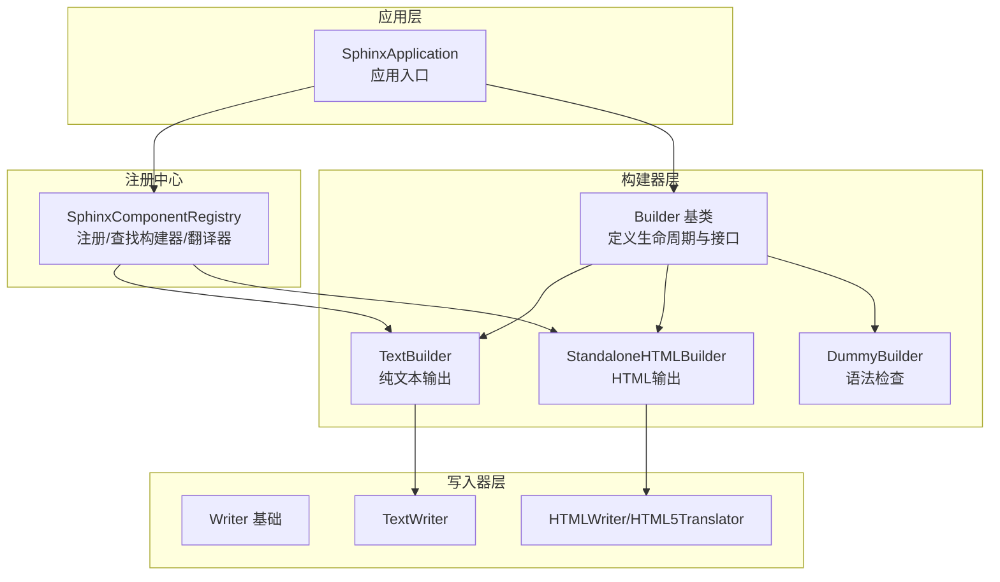
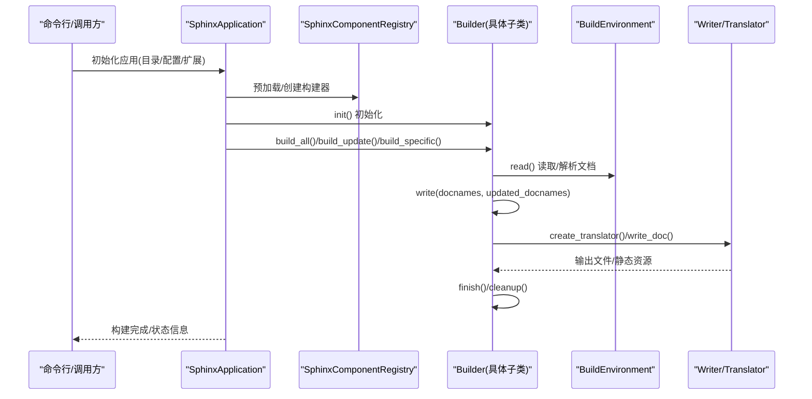
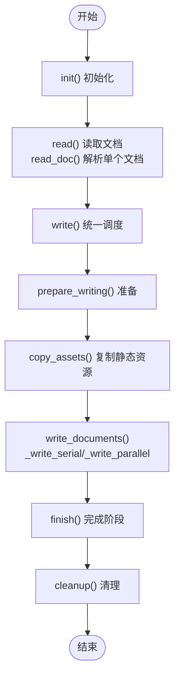
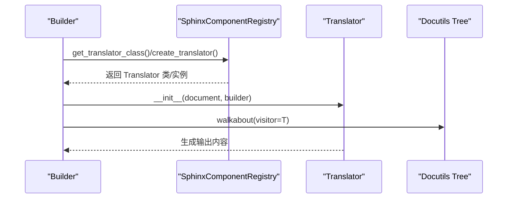
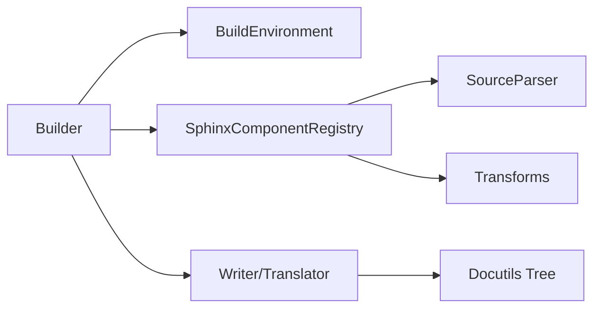

# 自定义构建器开发

<cite>
**本文档引用的文件**
- [sphinx\builders\__init__.py](file://sphinx/builders/__init__.py)
- [sphinx\application.py](file://sphinx/application.py)
- [sphinx\registry.py](file://sphinx/registry.py)
- [sphinx\builders\text.py](file://sphinx/builders/text.py)
- [sphinx\builders\html\__init__.py](file://sphinx/builders/html/__init__.py)
- [sphinx\builders\dummy.py](file://sphinx/builders/dummy.py)
- [sphinx\writers\__init__.py](file://sphinx/writers/__init__.py)
- [tests\test_writers\test_api_translator.py](file://tests/test_writers/test_api_translator.py)
- [tests\test_builders\test_build_text.py](file://tests/test_builders/test_build_text.py)
</cite>

## 目录
1. [简介](#简介)
2. [项目结构](#项目结构)
3. [核心组件](#核心组件)
4. [架构总览](#架构总览)
5. [详细组件分析](#详细组件分析)
6. [依赖分析](#依赖分析)
7. [性能考虑](#性能考虑)
8. [故障排除指南](#故障排除指南)
9. [结论](#结论)
10. [附录](#附录)

## 简介
本指南面向希望在Sphinx中开发自定义构建器的开发者，系统讲解构建器基类的设计原理与关键接口方法，如何继承Builder基类并实现必要抽象方法，构建器生命周期管理（初始化、读取文档、写入输出、清理），翻译器（Translator）的作用与自定义翻译器开发方法，以及构建器注册机制与扩展点的使用方式。文档还提供了从简单文本输出到复杂格式转换的完整示例路径，帮助读者快速上手。

## 项目结构
Sphinx的构建器体系围绕Builder基类展开，不同格式的构建器（如HTML、纯文本、Dummy等）均继承自该基类。应用层通过SphinxApplication协调构建流程，组件注册中心负责构建器与翻译器的注册与查找。

图示来源
- [sphinx\application.py](file://sphinx/application.py)
- [sphinx\builders\__init__.py](file://sphinx/builders/__init__.py)
- [sphinx\registry.py](file://sphinx/registry.py)
- [sphinx\builders\text.py](file://sphinx/builders/text.py)
- [sphinx\builders\html\__init__.py](file://sphinx/builders/html/__init__.py)
- [sphinx\builders\dummy.py](file://sphinx/builders/dummy.py)
- [sphinx\writers\__init__.py](file://sphinx/writers/__init__.py)

章节来源
- [sphinx\application.py](file://sphinx/application.py)
- [sphinx\builders\__init__.py](file://sphinx/builders/__init__.py)
- [sphinx\registry.py](file://sphinx/registry.py)

## 核心组件
- Builder基类：定义构建器的生命周期方法、环境与事件集成、并行写入策略、目标URI生成、过期文档检测等通用能力。
- 具体构建器：如TextBuilder、StandaloneHTMLBuilder、DummyBuilder，覆盖各自格式的输出细节。
- 应用层Sphinx：负责加载配置、创建构建器实例、触发构建流程、事件分发与收尾。
- 注册中心SphinxComponentRegistry：维护构建器、翻译器、源解析器、变换等组件映射，支持动态注册与替换。

章节来源
- [sphinx\builders\__init__.py](file://sphinx/builders/__init__.py)
- [sphinx\application.py](file://sphinx/application.py)
- [sphinx\registry.py](file://sphinx/registry.py)

## 架构总览
下图展示了Sphinx构建器的高层架构与交互关系：

图示来源
- [sphinx\application.py](file://sphinx/application.py)
- [sphinx\builders\__init__.py](file://sphinx/builders/__init__.py)
- [sphinx\registry.py](file://sphinx/registry.py)

## 详细组件分析

### Builder基类设计与生命周期
- 生命周期阶段
  - 初始化阶段：init()，用于模板/主题/高亮/资源等初始化。
  - 读取阶段：read() 调用 read_doc() 解析单个文档；支持串行/并行两种模式。
  - 写入阶段：write() 统一调度 prepare_writing/copy_assets/write_documents；write_doc() 实际输出。
  - 完成阶段：finish() 生成索引/附加页面/复制静态资源；cleanup() 清理临时资源。
- 关键抽象方法
  - get_outdated_docs()：返回过期文档集合或描述性字符串。
  - get_target_uri()/get_relative_uri()：生成目标URI。
  - write_doc()：实际输出单个文档。
- 并行控制
  - allow_parallel 控制是否允许并行写入。
  - 内置并行读取/写入逻辑，自动选择串行或并行执行路径。
- 翻译器集成
  - get_translator_class()/create_translator() 从注册中心获取/实例化翻译器。
  - 默认翻译器由具体构建器的 default_translator_class 指定。

图示来源
- [sphinx\builders\__init__.py](file://sphinx/builders/__init__.py)

章节来源
- [sphinx\builders\__init__.py](file://sphinx/builders/__init__.py)

### 继承Builder并实现必要抽象方法
- 步骤
  - 继承Builder，设置 name/format/epilog 等类属性。
  - 实现 get_outdated_docs()：返回过期文档集合或描述性字符串。
  - 实现 get_target_uri()/get_relative_uri()：根据格式生成目标URI。
  - 实现 write_doc()：创建翻译器，遍历doctree，写出目标文件。
  - 可选：重写 init()/prepare_writing()/copy_assets()/finish()/cleanup()。
- 示例参考
  - TextBuilder：最简实现，输出纯文本，演示了基本流程与配置项注册。
  - StandaloneHTMLBuilder：复杂实现，包含模板/主题/高亮/索引/静态资源等。
  - DummyBuilder：仅做语法检查，不生成文件。

章节来源
- [sphinx\builders\text.py](file://sphinx/builders/text.py)
- [sphinx\builders\html\__init__.py](file://sphinx/builders/html/__init__.py)
- [sphinx\builders\dummy.py](file://sphinx/builders/dummy.py)

### 翻译器（Translator）的作用与自定义
- 作用
  - 将Docutils节点树（doctree）转换为目标格式（HTML、纯文本等）。
  - Builder通过 create_translator() 获取翻译器实例，再 walkabout(doctree) 遍历节点。
- 自定义翻译器
  - 在注册中心通过 add_translator() 为特定构建器替换默认翻译器。
  - 也可通过 add_translation_handlers() 为特定节点添加自定义访问器。
- 测试验证
  - 测试用例展示了如何为不同构建器设置不同的翻译器类，并在运行时生效。

图示来源
- [sphinx\builders\__init__.py](file://sphinx/builders/__init__.py)
- [sphinx\registry.py](file://sphinx/registry.py)
- [tests\test_writers\test_api_translator.py](file://tests/test_writers/test_api_translator.py)

章节来源
- [sphinx\registry.py](file://sphinx/registry.py)
- [tests\test_writers\test_api_translator.py](file://tests/test_writers/test_api_translator.py)

### 构建器注册机制与扩展点
- 注册方式
  - 在扩展setup()中调用 app.add_builder(YourBuilder) 完成注册。
  - 注册中心维护 builders 映射，按名称创建实例。
- 扩展点
  - add_translator()：为指定构建器替换翻译器。
  - add_translation_handlers()：为节点添加访问/离开处理函数。
  - add_source_parser()/add_source_suffix()：扩展源解析器与后缀映射。
  - add_transform()/add_post_transform()：注入变换。
- 应用层集成
  - SphinxApplication 在初始化时预加载/创建构建器，并触发 builder-inited 事件。

章节来源
- [sphinx\registry.py](file://sphinx/registry.py)
- [sphinx\application.py](file://sphinx/application.py)

### 完整自定义构建器示例

#### 示例一：简单文本输出（基于TextBuilder）
- 关键点
  - 设置 name/format/epilog，启用并行。
  - 实现 get_outdated_docs() 判断过期。
  - 实现 get_target_uri() 返回空字符串（文本无链接）。
  - 实现 write_doc()：创建TextTranslator，遍历doctree，写入UTF-8文件。
  - 在setup()中注册构建器与配置项。
- 参考路径
  - [sphinx\builders\text.py](file://sphinx/builders/text.py)
  - [tests\test_builders\test_build_text.py](file://tests/test_builders/test_build_text.py)

章节来源
- [sphinx\builders\text.py](file://sphinx/builders/text.py)
- [tests\test_builders\test_build_text.py](file://tests/test_builders/test_build_text.py)

#### 示例二：复杂HTML输出（基于StandaloneHTMLBuilder）
- 关键点
  - 初始化模板/主题/高亮/样式/脚本等。
  - 实现 get_outdated_docs() 基于 .buildinfo/模板修改时间/源文件修改时间判断。
  - 实现 prepare_writing()/copy_assets()/write_doc()/finish() 的完整流水线。
  - 支持域索引、通用索引、附加页面、下载文件、图片复制等。
- 参考路径
  - [sphinx\builders\html\__init__.py](file://sphinx/builders/html/__init__.py)

章节来源
- [sphinx\builders\html\__init__.py](file://sphinx/builders/html/__init__.py)

#### 示例三：语法检查（基于DummyBuilder）
- 关键点
  - 不生成任何文件，仅进行语法检查。
  - get_outdated_docs() 返回所有文档以触发检查。
- 参考路径
  - [sphinx\builders\dummy.py](file://sphinx/builders/dummy.py)

章节来源
- [sphinx\builders\dummy.py](file://sphinx/builders/dummy.py)

## 依赖分析
- 组件耦合
  - Builder与SphinxComponentRegistry强耦合：通过注册中心获取翻译器、源解析器、变换等。
  - Builder与BuildEnvironment：读取/解析文档、依赖追踪、一致性检查。
  - Builder与Writer/Translator：通过walkabout遍历节点，生成目标格式。
- 外部依赖
  - Docutils节点树与变换链。
  - Jinja2模板（HTML构建器）。
  - Pygments高亮（HTML构建器）。
- 循环依赖
  - 未发现直接循环依赖；注册中心作为统一入口避免了循环引用。

图示来源
- [sphinx\builders\__init__.py](file://sphinx/builders/__init__.py)
- [sphinx\registry.py](file://sphinx/registry.py)

章节来源
- [sphinx\builders\__init__.py](file://sphinx/builders/__init__.py)
- [sphinx\registry.py](file://sphinx/registry.py)

## 性能考虑
- 并行读取/写入
  - 通过 parallel_available 与 _app.parallel 判断是否启用并行；并行写入可显著提升大规模项目构建速度。
- 缓存与增量
  - 使用 doctree 缓存与 .buildinfo 比较，减少重复解析与输出。
  - get_outdated_docs() 精准识别过期文档，避免全量重建。
- 资源复制
  - 静态资源复制采用进度条与状态迭代器，提升用户体验与可观测性。
- 翻译器缓存
  - 首次文档写入时预热模板/缓存，后续并行写入复用。

## 故障排除指南
- 构建器未注册
  - 症状：无法通过名称创建构建器。
  - 排查：确认扩展setup()中已调用 app.add_builder()，并在配置中启用该扩展。
- 翻译器缺失
  - 症状：AttributeError 提示找不到翻译器。
  - 排查：确认 default_translator_class 是否正确设置，或通过 app.set_translator() 替换。
- 过期文档判断异常
  - 症状：频繁全量重建或遗漏更新。
  - 排查：检查 get_outdated_docs() 的时间戳比较逻辑，确保 .buildinfo 与模板修改时间正确。
- 并行写入问题
  - 症状：并行写入失败或输出不一致。
  - 排查：确认 allow_parallel 与并行任务的幂等性；必要时回退到串行写入。

章节来源
- [sphinx\builders\__init__.py](file://sphinx/builders/__init__.py)
- [sphinx\registry.py](file://sphinx/registry.py)

## 结论
通过继承Builder基类并遵循其生命周期规范，开发者可以快速实现自定义构建器。结合SphinxComponentRegistry的注册与替换机制，可以灵活定制翻译器与节点处理逻辑。对于复杂格式（如HTML），StandaloneHTMLBuilder提供了完善的实现范式；对于简单场景（如纯文本或语法检查），TextBuilder/DummyBuilder则展示了最小可行方案。建议在实现过程中充分利用并行与缓存机制，以获得更好的构建性能与体验。

## 附录
- 常用配置项（示例）
  - 文本构建器：text_sectionchars、text_newlines、text_add_secnumbers、text_secnumber_suffix。
  - HTML构建器：html_style、html_theme、html_additional_pages、html_use_opensearch 等。
- 参考实现路径
  - [sphinx\builders\text.py](file://sphinx/builders/text.py)
  - [sphinx\builders\html\__init__.py](file://sphinx/builders/html/__init__.py)
  - [sphinx\builders\dummy.py](file://sphinx/builders/dummy.py)
  - [tests\test_builders\test_build_text.py](file://tests/test_builders/test_build_text.py)
  - [tests\test_writers\test_api_translator.py](file://tests/test_writers/test_api_translator.py)