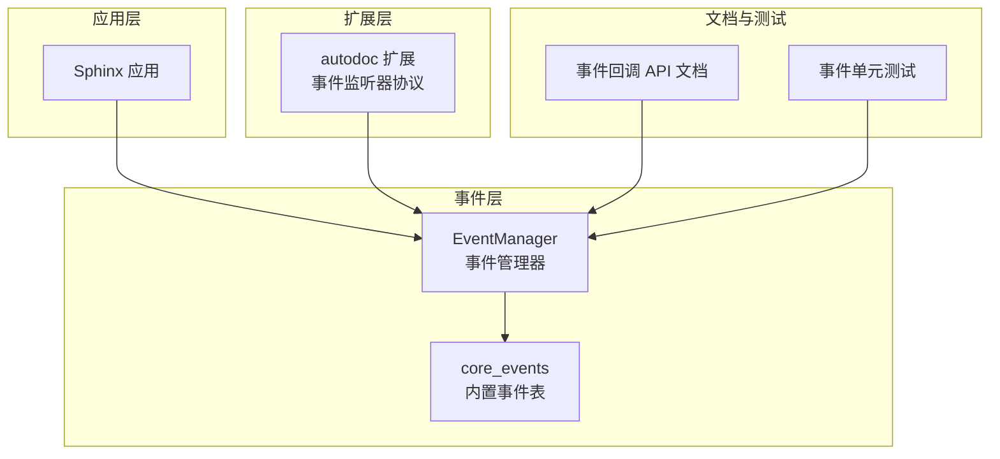
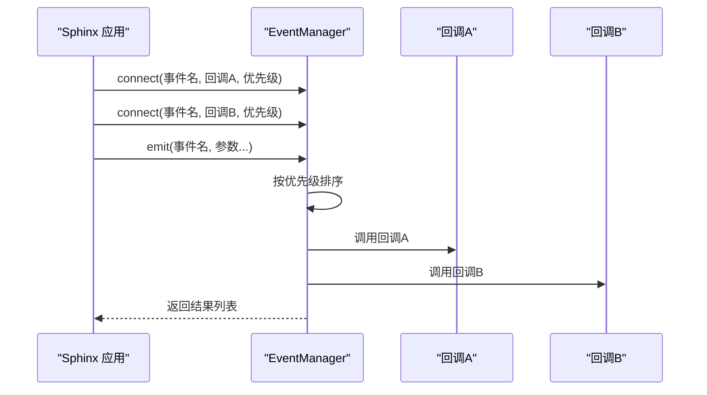
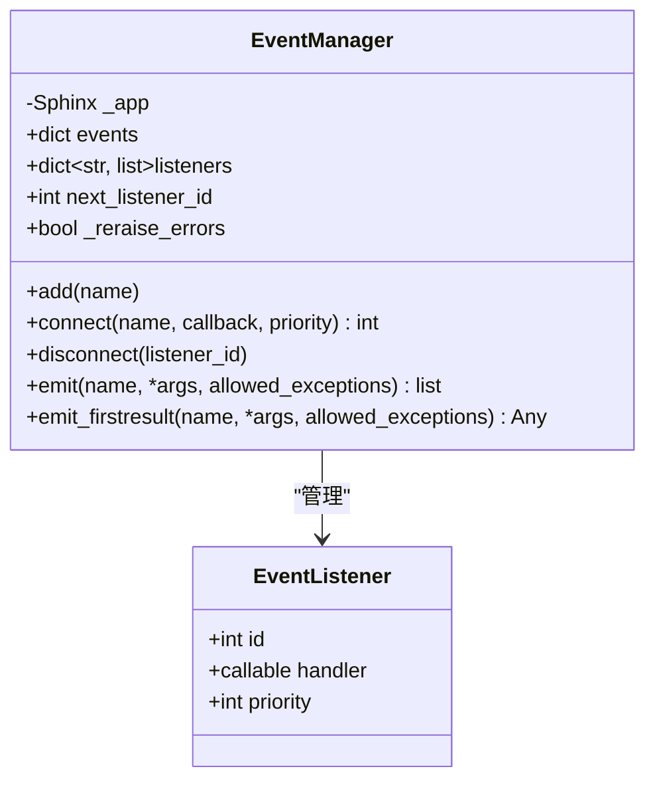
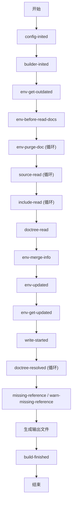
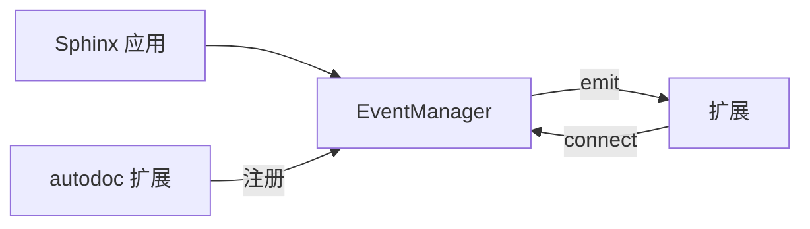

# 事件系统

<cite>
**本文引用的文件**
- [sphinx/events.py](file://sphinx/events.py)
- [sphinx/application.py](file://sphinx/application.py)
- [sphinx/ext/autodoc/_event_listeners.py](file://sphinx/ext/autodoc/_event_listeners.py)
- [sphinx/ext/autodoc/__init__.py](file://sphinx/ext/autodoc/__init__.py)
- [doc/extdev/event_callbacks.rst](file://doc/extdev/event_callbacks.rst)
- [doc/extdev/eventapi.rst](file://doc/extdev/eventapi.rst)
- [tests/test_events.py](file://tests/test_events.py)
- [tests/test_ext_autodoc/autodoc_util.py](file://tests/test_ext_autodoc/autodoc_util.py)
</cite>

## 目录
1. [引言](#引言)
2. [项目结构](#项目结构)
3. [核心组件](#核心组件)
4. [架构总览](#架构总览)
5. [详细组件分析](#详细组件分析)
6. [依赖分析](#依赖分析)
7. [性能考虑](#性能考虑)
8. [故障排查指南](#故障排查指南)
9. [结论](#结论)
10. [附录](#附录)

## 引言
本文件系统性地阐述 Sphinx 的事件驱动架构与实现机制，聚焦于事件管理器（EventManager）的设计与用法，覆盖事件注册、优先级、传播规则、错误处理与扩展开发最佳实践。文档同时给出事件回调签名、内置事件类型与触发时机说明，并通过序列图与流程图帮助读者理解事件在文档构建生命周期中的作用。

## 项目结构
围绕事件系统的相关代码主要分布在以下模块：
- 核心事件管理：sphinx/events.py
- 应用入口与事件桥接：sphinx/application.py
- 自动文档扩展事件监听器协议与工厂：sphinx/ext/autodoc/_event_listeners.py、sphinx/ext/autodoc/__init__.py
- 文档与测试：doc/extdev/event_callbacks.rst、doc/extdev/eventapi.rst、tests/test_events.py、tests/test_ext_autodoc/autodoc_util.py

图表来源
- [sphinx/application.py:251](file://sphinx/application.py#L251)
- [sphinx/events.py:72](file://sphinx/events.py#L72)
- [sphinx/ext/autodoc/_event_listeners.py:15](file://sphinx/ext/autodoc/_event_listeners.py#L15)
- [doc/extdev/event_callbacks.rst:1](file://doc/extdev/event_callbacks.rst#L1)
- [tests/test_events.py:1](file://tests/test_events.py#L1)

章节来源
- [sphinx/events.py:50](file://sphinx/events.py#L50)
- [sphinx/application.py:251](file://sphinx/application.py#L251)

## 核心组件
- EventManager：负责事件注册、优先级排序、回调执行与异常传播控制。支持两类发射方式：
  - emit：返回所有回调结果列表
  - emit_firstresult：返回首个非空结果
- EventListener：内部用于记录监听器的标识、处理器与优先级
- core_events：内置事件名到参数描述的映射表，定义了核心构建生命周期事件

章节来源
- [sphinx/events.py:44](file://sphinx/events.py#L44)
- [sphinx/events.py:50](file://sphinx/events.py#L50)
- [sphinx/events.py:72](file://sphinx/events.py#L72)
- [sphinx/events.py:405](file://sphinx/events.py#L405)
- [sphinx/events.py:459](file://sphinx/events.py#L459)

## 架构总览
事件系统采用“应用层桥接 + 事件管理器”的分层设计：
- Sphinx 应用持有 EventManager 实例，并在关键构建阶段主动发出事件
- 扩展通过 app.connect 注册回调；EventManager 按优先级顺序调用
- 允许指定 allowed_exceptions 让特定异常直接透传，或由应用统一转换为 ExtensionError

图表来源
- [sphinx/application.py:792](file://sphinx/application.py#L792)
- [sphinx/events.py:363](file://sphinx/events.py#L363)
- [sphinx/events.py:405](file://sphinx/events.py#L405)

## 详细组件分析

### EventManager 类
- 职责
  - 维护事件名到监听器列表的映射
  - 提供 add/connect/disconnect/emit/emit_firstresult 等接口
  - 控制异常传播策略（允许透传的异常类型）
- 关键行为
  - connect：分配唯一监听器 ID，按 priority 排序存储
  - emit：遍历排序后的监听器，收集返回值；对异常进行统一处理
  - emit_firstresult：遇到首个非空结果即返回
  - add：扩展自定义事件名（仅允许扩展，不可覆盖内置）

图表来源
- [sphinx/events.py:44](file://sphinx/events.py#L44)
- [sphinx/events.py:72](file://sphinx/events.py#L72)
- [sphinx/events.py:363](file://sphinx/events.py#L363)
- [sphinx/events.py:405](file://sphinx/events.py#L405)
- [sphinx/events.py:459](file://sphinx/events.py#L459)

章节来源
- [sphinx/events.py:72](file://sphinx/events.py#L72)
- [sphinx/events.py:363](file://sphinx/events.py#L363)
- [sphinx/events.py:405](file://sphinx/events.py#L405)
- [sphinx/events.py:459](file://sphinx/events.py#L459)

### 内置事件与触发时机
以下事件贯穿构建生命周期，典型触发顺序见下节“事件流”：
- config-inited：配置初始化完成
- builder-inited：构建器创建完成
- env-get-outdated/env-before-read-docs/env-purge-doc/env-merge-info/env-updated/env-get-updated/env-check-consistency
- source-read/include-read/doctree-read
- env-merge-info/env-updated/env-get-updated/env-check-consistency
- write-started
- doctree-resolved/missing-reference/warn-missing-reference
- build-finished

章节来源
- [doc/extdev/event_callbacks.rst:27](file://doc/extdev/event_callbacks.rst#L27)
- [doc/extdev/event_callbacks.rst:85](file://doc/extdev/event_callbacks.rst#L85)
- [sphinx/events.py:50](file://sphinx/events.py#L50)

### 事件回调签名与用途
- config-inited(app, config)
- builder-inited(app)
- env-get-outdated(app, env, added, changed, removed) -> Sequence[str]
- env-before-read-docs(app, env, docnames)
- env-purge-doc(app, env, docname)
- source-read(app, docname, content)
- include-read(app, relative_path, parent_docname, content)
- doctree-read(app, doctree)
- env-merge-info(app, env, docnames, other)
- env-updated(app, env) -> Iterable[str]
- env-get-updated(app, env) -> Iterable[str]
- env-check-consistency(app, env)
- write-started(app, builder)
- doctree-resolved(app, doctree, docname)
- missing-reference(app, env, node, contnode) -> reference|None
- warn-missing-reference(app, domain, node) -> bool|None
- build-finished(app, exception)
- html-collect-pages(app) -> Iterable[(pagename, context, template)]
- html-page-context(app, pagename, templatename, context, doctree) -> str|None
- linkcheck-process-uri(app, uri) -> str|None
- object-description-transform(app, domain, objtype, contentnode)
- autodoc-process-docstring(...)、autodoc-before-process-signature(...)、autodoc-process-signature(...)、autodoc-process-bases(...)、autodoc-skip-member(...)
- viewcode-find-source(...)、viewcode-follow-imported(...)

章节来源
- [doc/extdev/event_callbacks.rst:88](file://doc/extdev/event_callbacks.rst#L88)
- [doc/extdev/event_callbacks.rst:357](file://doc/extdev/event_callbacks.rst#L357)
- [sphinx/ext/autodoc/_event_listeners.py:15](file://sphinx/ext/autodoc/_event_listeners.py#L15)
- [sphinx/ext/autodoc/__init__.py](file://sphinx/ext/autodoc/__init__.py)

### 事件优先级机制与传播规则
- 优先级
  - connect 支持 priority 参数，默认值为 500
  - 监听器按 priority 升序执行，数值越小越早执行
- 传播规则
  - emit：收集所有回调返回值，异常统一转换为 ExtensionError（除非允许透传）
  - emit_firstresult：返回第一个非空结果，否则返回 None
  - allowed_exceptions：可指定允许透传的异常类型，便于调试或特殊处理
  - app.pdb：若启用调试模式，异常将直接抛出而非转换

章节来源
- [sphinx/events.py:363](file://sphinx/events.py#L363)
- [sphinx/events.py:405](file://sphinx/events.py#L405)
- [sphinx/events.py:459](file://sphinx/events.py#L459)
- [tests/test_events.py:19](file://tests/test_events.py#L19)
- [tests/test_events.py:35](file://tests/test_events.py#L35)

### 事件监听器的注册与注销
- 注册
  - app.connect(event, callback, priority=500) 或 app.events.connect(...)
  - 可通过 app.add_event(name) 注册自定义事件
- 注销
  - 使用 connect 返回的 listener_id 调用 app.disconnect(listener_id) 或 app.events.disconnect(...)

章节来源
- [sphinx/application.py:792](file://sphinx/application.py#L792)
- [sphinx/application.py:820](file://sphinx/application.py#L820)
- [sphinx/application.py:942](file://sphinx/application.py#L942)
- [sphinx/events.py:394](file://sphinx/events.py#L394)

### 事件流与构建阶段

图表来源
- [doc/extdev/event_callbacks.rst:32](file://doc/extdev/event_callbacks.rst#L32)
- [doc/extdev/event_callbacks.rst:79](file://doc/extdev/event_callbacks.rst#L79)

## 依赖分析
- Sphinx 应用持有 EventManager 并在构建关键节点发出事件
- 扩展通过 app.connect 注册回调，EventManager 仅保存处理器引用，避免强耦合
- 自动文档扩展提供专用事件监听器协议，便于类型安全与复用

图表来源
- [sphinx/application.py:251](file://sphinx/application.py#L251)
- [sphinx/application.py:792](file://sphinx/application.py#L792)
- [sphinx/ext/autodoc/_event_listeners.py:15](file://sphinx/ext/autodoc/_event_listeners.py#L15)

章节来源
- [sphinx/application.py:251](file://sphinx/application.py#L251)
- [sphinx/ext/autodoc/_event_listeners.py:15](file://sphinx/ext/autodoc/_event_listeners.py#L15)

## 性能考虑
- 优先级排序：每次 emit 均对监听器列表按 priority 排序，建议合理设置优先级以减少不必要的重排
- 回调数量：过多回调会线性增加执行时间，应按需注册并及时注销
- allowed_exceptions：仅在确有需要时使用，避免频繁异常路径影响性能
- 大型构建：在并行模式下，某些事件（如 env-merge-info）会在子进程中多次触发，注意避免重复工作

## 故障排查指南
- 回调异常
  - 默认情况下，异常会被转换为 ExtensionError 并携带模块信息
  - 若启用 app.pdb，则异常直接抛出，便于调试
- 允许透传异常
  - 使用 allowed_exceptions 指定可透传的异常类型，使测试或调试更灵活
- 监听器未生效
  - 确认事件名正确且已注册（内置事件名来自 core_events）
  - 检查优先级是否导致执行顺序不符合预期
- 自定义事件
  - 使用 app.add_event(name) 注册后方可 emit

章节来源
- [sphinx/events.py:405](file://sphinx/events.py#L405)
- [sphinx/events.py:459](file://sphinx/events.py#L459)
- [tests/test_events.py:35](file://tests/test_events.py#L35)

## 结论
Sphinx 的事件系统通过 EventManager 将应用层与扩展层解耦，提供高可扩展的构建生命周期钩子。借助优先级与异常透传机制，开发者可在不侵入核心流程的前提下，灵活拦截与修改文档构建过程。遵循本文的最佳实践，可显著提升扩展开发效率与稳定性。

## 附录

### 事件使用示例（步骤化）
- 在扩展 setup 中注册事件回调
  - 使用 app.connect('事件名', 回调函数, priority)
- 在回调中处理参数并按需返回值
  - 对于 emit_firstresult 场景，返回首个非空结果
- 清理资源
  - 在合适时机使用 app.disconnect(监听器ID) 注销回调

章节来源
- [doc/extdev/event_callbacks.rst:9](file://doc/extdev/event_callbacks.rst#L9)
- [sphinx/application.py:792](file://sphinx/application.py#L792)

### 自动文档扩展事件监听器
- 提供 cut_lines、between 等工厂函数，便于在 autodoc-process-docstring 事件中处理 docstring
- 通过协议定义回调签名，确保类型安全与一致性

章节来源
- [sphinx/ext/autodoc/_event_listeners.py:80](file://sphinx/ext/autodoc/_event_listeners.py#L80)
- [sphinx/ext/autodoc/__init__.py](file://sphinx/ext/autodoc/__init__.py)

### 测试参考
- 事件优先级测试：验证升序执行顺序
- 事件异常透传测试：验证 allowed_exceptions 行为
- 自定义事件注册测试：验证 add 与 emit 的配合

章节来源
- [tests/test_events.py:19](file://tests/test_events.py#L19)
- [tests/test_ext_autodoc/autodoc_util.py:22](file://tests/test_ext_autodoc/autodoc_util.py#L22)