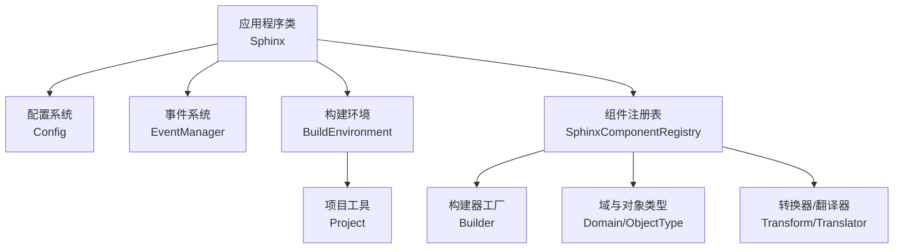
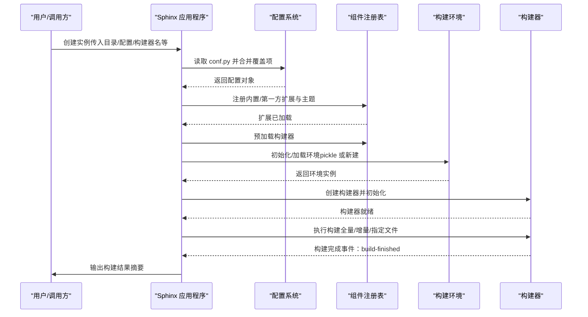
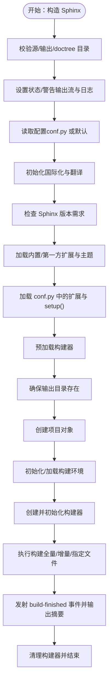
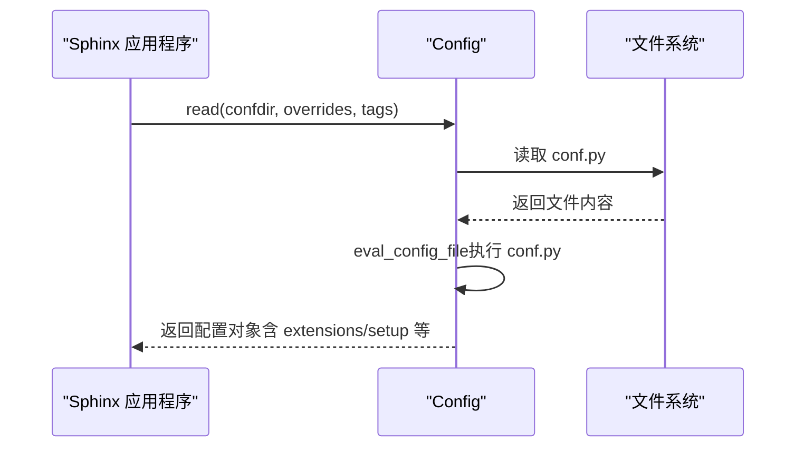
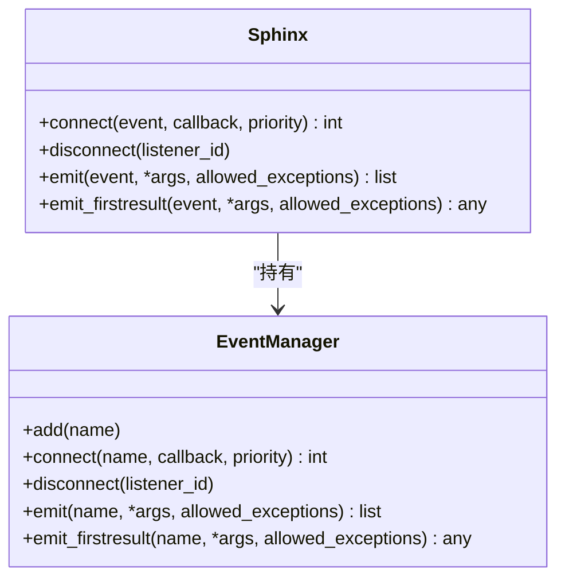
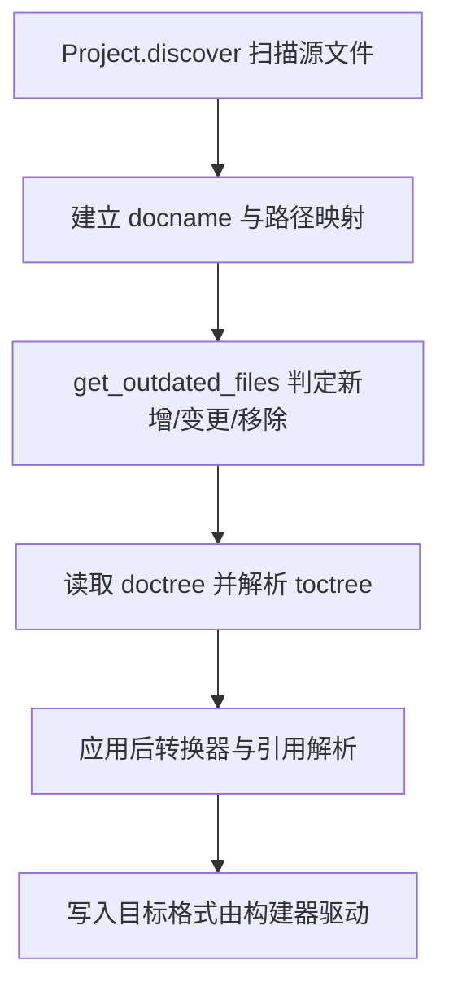
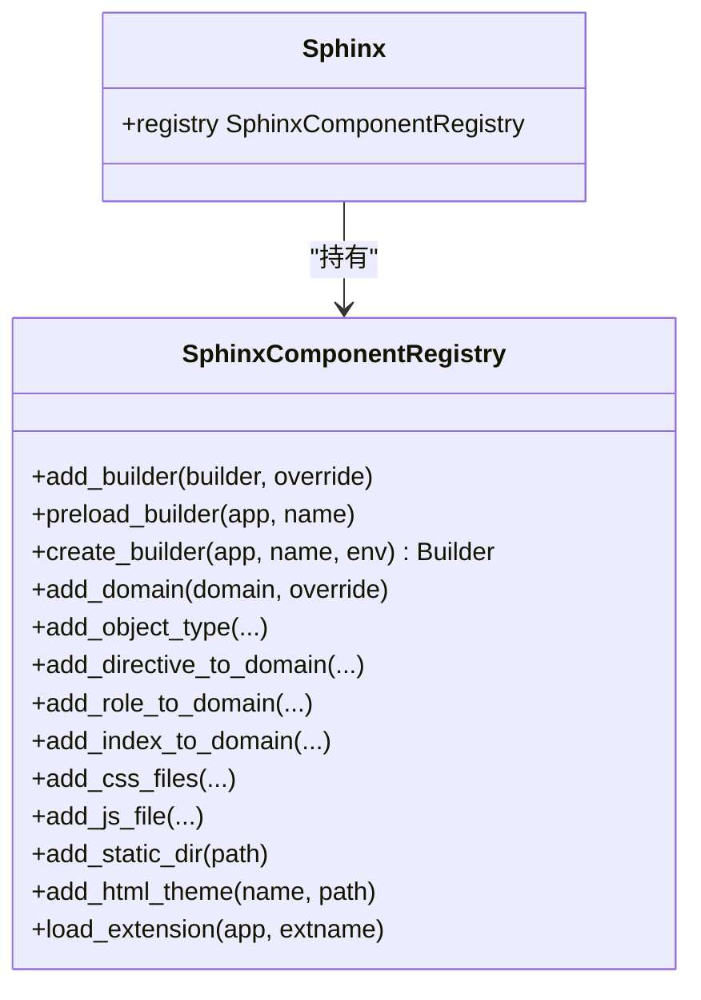
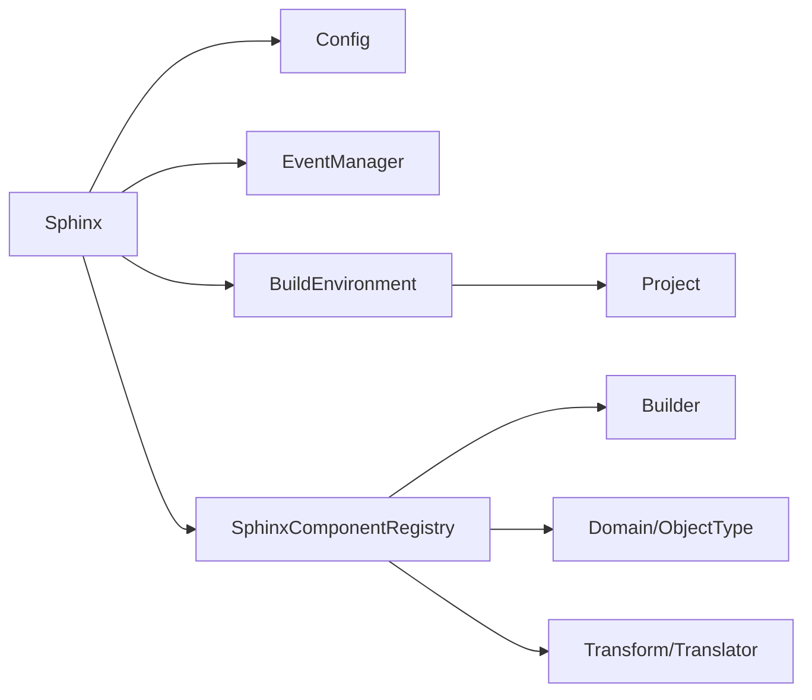

# 应用程序类

<cite>
**本文引用的文件**
- [application.py](file://sphinx/application.py)
- [config.py](file://sphinx/config.py)
- [events.py](file://sphinx/events.py)
- [environment/__init__.py](file://sphinx/environment/__init__.py)
- [project.py](file://sphinx/project.py)
- [registry.py](file://sphinx/registry.py)
- [__init__.py](file://sphinx/__init__.py)
- [test_config.py](file://tests/test_config/test_config.py)
- [test_environment.py](file://tests/test_environment/test_environment.py)
</cite>

## 目录
1. [简介](#简介)
2. [项目结构](#项目结构)
3. [核心组件](#核心组件)
4. [架构总览](#架构总览)
5. [详细组件分析](#详细组件分析)
6. [依赖分析](#依赖分析)
7. [性能考虑](#性能考虑)
8. [故障排查指南](#故障排查指南)
9. [结论](#结论)
10. [附录](#附录)

## 简介
本文件面向希望深入理解 Sphinx 应用程序类（Sphinx）的开发者与维护者，系统阐述其在文档构建中的核心作用、生命周期管理机制、构造函数参数与初始化流程、配置加载策略、扩展加载与注册、以及与构建器、环境、事件系统的协作方式。文档同时提供可操作的使用示例与最佳实践，帮助读者正确地在项目中使用 Sphinx 应用程序类进行高效、稳定的文档构建。

## 项目结构
围绕应用程序类的关键模块与职责如下：
- 应用程序类：负责应用级生命周期、配置加载、扩展加载、构建器选择与初始化、事件系统桥接、国际化与日志设置等。
- 配置系统：负责从 conf.py 加载配置、合并覆盖项、类型校验与默认值管理。
- 事件系统：统一的事件发布/订阅机制，贯穿构建各阶段。
- 构建环境：源文件发现、增量构建判断、域与索引数据管理、doctree 解析与引用解析。
- 项目工具：源文件路径与文档名之间的映射、扫描与去重。
- 组件注册表：集中管理构建器、域、指令、角色、转换器、翻译器等组件的注册与创建。

图示来源
- [application.py:148-340](file://sphinx/application.py#L148-L340)
- [config.py:196-493](file://sphinx/config.py#L196-L493)
- [events.py:72-486](file://sphinx/events.py#L72-L486)
- [environment/__init__.py:101-320](file://sphinx/environment/__init__.py#L101-L320)
- [project.py:23-129](file://sphinx/project.py#L23-L129)
- [registry.py:72-628](file://sphinx/registry.py#L72-L628)

章节来源
- [application.py:148-340](file://sphinx/application.py#L148-L340)
- [config.py:196-493](file://sphinx/config.py#L196-L493)
- [events.py:72-486](file://sphinx/events.py#L72-L486)
- [environment/__init__.py:101-320](file://sphinx/environment/__init__.py#L101-L320)
- [project.py:23-129](file://sphinx/project.py#L23-L129)
- [registry.py:72-628](file://sphinx/registry.py#L72-L628)

## 核心组件
- 应用程序类（Sphinx）
  - 负责应用级生命周期：构造、配置加载、扩展加载、构建器创建、构建执行、清理。
  - 提供扩展接口：注册构建器、节点、指令、角色、域、对象类型、转换器、CSS/JS 文件、主题等。
  - 事件接口：统一连接、断开、发射事件。
  - 国际化与日志：加载翻译、设置日志级别与输出流。
- 配置系统（Config）
  - 定义大量配置项及其默认值、重建条件与类型约束。
  - 支持从 conf.py 读取、命令行覆盖、类型转换与错误报告。
- 事件系统（EventManager）
  - 统一的事件注册、优先级排序、异常传播与调试支持。
- 构建环境（BuildEnvironment）
  - 源文件扫描与去重、增量构建判断、域与索引数据、doctree 读取与解析、toctree 解析。
- 项目工具（Project）
  - 文档名与源文件路径互转、匹配与去重、不可读文件警告。
- 组件注册表（SphinxComponentRegistry）
  - 统一注册与创建构建器、域、对象类型、指令/角色、转换器、翻译器、资源等。

章节来源
- [application.py:148-870](file://sphinx/application.py#L148-L870)
- [config.py:196-493](file://sphinx/config.py#L196-L493)
- [events.py:72-486](file://sphinx/events.py#L72-L486)
- [environment/__init__.py:101-320](file://sphinx/environment/__init__.py#L101-L320)
- [project.py:23-129](file://sphinx/project.py#L23-L129)
- [registry.py:72-628](file://sphinx/registry.py#L72-L628)

## 架构总览
Sphinx 应用程序类作为中枢，串联配置、事件、环境与构建器。初始化阶段完成配置加载与扩展注册，随后创建构建器并进入构建阶段；构建完成后根据状态输出总结信息并清理。

图示来源
- [application.py:165-340](file://sphinx/application.py#L165-L340)
- [config.py:338-353](file://sphinx/config.py#L338-L353)
- [registry.py:173-196](file://sphinx/registry.py#L173-L196)
- [environment/__init__.py:258-295](file://sphinx/environment/__init__.py#L258-L295)

章节来源
- [application.py:165-340](file://sphinx/application.py#L165-L340)
- [config.py:338-353](file://sphinx/config.py#L338-L353)
- [registry.py:173-196](file://sphinx/registry.py#L173-L196)
- [environment/__init__.py:258-295](file://sphinx/environment/__init__.py#L258-L295)

## 详细组件分析

### 应用程序类（Sphinx）：构造与生命周期
- 构造函数参数
  - 源目录、配置目录、输出目录、doctree 缓存目录、构建器名称、配置覆盖字典、状态/警告输出流、是否全新环境、警告即错误、标签集合、详细程度、并行度、pdb 调试开关、警告抛异常开关等。
- 初始化流程
  - 目录合法性检查、状态/警告输出流设置、日志初始化、事件管理器创建、消息日志队列、版本号打印。
  - 配置加载：若未指定 confdir 则以 srcdir 为准；否则从 confdir 读取 conf.py 并合并覆盖项；国际化目录编译与加载；版本需求检查。
  - 扩展加载：内置/第一方扩展与主题预加载，再加载 conf.py 中声明的扩展；若 conf.py 含 setup，则调用之。
  - 构建器：预加载构建器，创建并初始化构建器；项目对象创建；环境初始化与后处理；构建器初始化。
- 构建流程
  - 设置读取阶段，按 force_all/filenames 决定全量/特定文件/增量构建；捕获异常删除缓存环境；发射 build-finished 事件；输出构建摘要与 epilog；清理构建器。
- 生命周期属性
  - fresh_env_used：本次构建是否新建了环境。
  - phase：当前构建阶段（由构建器暴露）。

图示来源
- [application.py:165-494](file://sphinx/application.py#L165-L494)

章节来源
- [application.py:165-494](file://sphinx/application.py#L165-L494)

### 配置系统（Config）：加载与校验
- 配置来源与合并
  - 从 conf.py 读取命名空间；对语言等兼容性字段做回退处理；合并命令行覆盖项；支持字符串到类型的安全转换。
- 配置项定义
  - 大量配置项与其默认值、重建条件（env/html/空）、有效类型或枚举集合；提供 add 接口扩展自定义配置。
- 运行期行为
  - 属性访问时优先覆盖项、再 conf.py 值、最后默认值；对未知覆盖项发出警告；序列化时过滤不可缓存值。
- 关键流程
  - read：定位 conf.py 并求值；eval_config_file：在 confdir 下执行 conf.py，捕获语法/运行时错误；convert_*：旧风格到新风格的转换。

图示来源
- [config.py:338-353](file://sphinx/config.py#L338-L353)
- [config.py:565-613](file://sphinx/config.py#L565-L613)

章节来源
- [config.py:196-493](file://sphinx/config.py#L196-L493)
- [config.py:565-613](file://sphinx/config.py#L565-L613)

### 事件系统（EventManager）：事件注册与发射
- 事件注册
  - connect：按事件名注册回调，支持优先级；emit/emit_firstresult：按优先级顺序调用回调，异常处理与调试支持。
- 核心事件
  - 包括 config-inited、builder-inited、env-*、source-read/include-read/doctree-read、write-started、doctree-resolved、missing-reference、warn-missing-reference、build-finished 等。
- 使用建议
  - 在扩展 setup 中通过 app.connect 订阅事件；注意 allowed_exceptions 以允许特定异常透传。

图示来源
- [events.py:72-486](file://sphinx/events.py#L72-L486)
- [application.py:792-870](file://sphinx/application.py#L792-L870)

章节来源
- [events.py:72-486](file://sphinx/events.py#L72-L486)
- [application.py:792-870](file://sphinx/application.py#L792-L870)

### 构建环境（BuildEnvironment）：源文件与增量构建
- 初始化与恢复
  - 从 pickle 加载或新建；校验环境版本与源目录一致性；恢复项目状态；初始化域与设置。
- 源文件发现
  - Project.discover：基于 include/exclude 模式匹配，建立 docname 与路径的双向映射；重复文件警告；不可读文件忽略。
- 增量构建
  - get_outdated_files：基于 found_docs、dependencies、settings 判断新增/变更/移除；config_changed 分支快速全量。
- doctree 读取与解析
  - get_doctree/get_and_resolve_doctree：从 doctreedir 读取并解析 toctree、应用后转换；apply_post_transforms：应用注册的后转换器。
- 域与索引
  - domains 容器统一管理域；merge_info_from 支持并行构建合并全局信息。

图示来源
- [environment/__init__.py:485-554](file://sphinx/environment/__init__.py#L485-L554)
- [project.py:49-92](file://sphinx/project.py#L49-L92)

章节来源
- [environment/__init__.py:101-320](file://sphinx/environment/__init__.py#L101-L320)
- [environment/__init__.py:485-554](file://sphinx/environment/__init__.py#L485-L554)
- [project.py:49-92](file://sphinx/project.py#L49-L92)

### 组件注册表（SphinxComponentRegistry）：扩展与组件管理
- 构建器与翻译器
  - preload_builder/create_builder：通过入口点或显式注册创建构建器；get_translator_class/create_translator：按构建器名获取并装配翻译器。
- 域与对象类型
  - add_domain/add_object_type/add_crossref_type：注册标准域对象类型与交叉引用类型；create_domains：按注册表装配域实例。
- 指令/角色/索引
  - add_directive_to_domain/add_role_to_domain/add_index_to_domain：向域注册指令/角色/索引。
- 资源与主题
  - add_css_files/add_js_file/add_static_dir/add_html_theme：注册样式、脚本、静态目录与主题。
- 扩展加载
  - load_extension：导入扩展模块并调用 setup，记录元数据，处理版本要求与黑名单。

图示来源
- [registry.py:72-628](file://sphinx/registry.py#L72-L628)
- [application.py:209-340](file://sphinx/application.py#L209-L340)

章节来源
- [registry.py:72-628](file://sphinx/registry.py#L72-L628)
- [application.py:209-340](file://sphinx/application.py#L209-L340)

### 应用程序类（Sphinx）：扩展接口与实用方法
- 扩展注册
  - add_builder/add_config_value/add_event/set_translator/add_node/add_enumerable_node/add_directive/add_role/add_generic_role/add_domain/add_directive_to_domain/add_role_to_domain/add_index_to_domain/add_object_type/add_crossref_type/add_transform/add_post_transform/add_js_file/add_css_file/add_static_dir。
- 事件接口
  - connect/disconnect/emit/emit_firstresult：统一事件订阅与发射。
- 版本要求
  - require_sphinx：在扩展中声明所需最低 Sphinx 版本。

章节来源
- [application.py:874-1599](file://sphinx/application.py#L874-L1599)

## 依赖分析
- 应用程序类依赖
  - 配置系统：用于读取 conf.py、合并覆盖项、类型转换与默认值。
  - 事件系统：用于扩展间解耦与构建阶段通知。
  - 构建环境：用于源文件扫描、增量构建、域与索引数据、doctree 解析。
  - 组件注册表：用于扩展加载、构建器/域/指令/角色/转换器/翻译器/资源注册。
  - 项目工具：用于源文件与文档名映射、扫描与去重。
- 关键耦合点
  - 构建器与注册表：通过注册表创建构建器实例。
  - 环境与注册表：环境初始化时需要注册表提供的域与转换器。
  - 应用程序与事件：所有扩展通过应用程序的事件接口进行交互。

图示来源
- [application.py:148-340](file://sphinx/application.py#L148-L340)
- [registry.py:72-628](file://sphinx/registry.py#L72-L628)
- [environment/__init__.py:101-320](file://sphinx/environment/__init__.py#L101-L320)
- [project.py:23-129](file://sphinx/project.py#L23-L129)

章节来源
- [application.py:148-340](file://sphinx/application.py#L148-L340)
- [registry.py:72-628](file://sphinx/registry.py#L72-L628)
- [environment/__init__.py:101-320](file://sphinx/environment/__init__.py#L101-L320)
- [project.py:23-129](file://sphinx/project.py#L23-L129)

## 性能考虑
- 并行与增量
  - parallel 参数控制并行作业数；增量构建通过 get_outdated_files 与 doctree 缓存减少重复工作。
- 环境复用
  - 优先尝试加载已保存的环境 pickle，失败则新建；避免不必要的全量扫描。
- 资源与转换
  - 合理注册翻译器与转换器，避免重复装配；CSS/JS 文件按优先级插入，减少页面渲染负担。
- 配置缓存
  - 配置对象在序列化时过滤不可缓存值，降低 pickle 成本。

## 故障排查指南
- 配置错误
  - 语言字段为 None 的回退与警告；conf.py 语法/运行时错误捕获；未知覆盖项警告。
- 版本不兼容
  - needs_sphinx 与 require_sphinx 抛出版本要求异常。
- 环境不一致
  - 环境版本不匹配或源目录变化导致异常；构建失败时自动删除缓存环境以强制下次全量构建。
- 事件异常
  - 事件回调异常会被包装为 ExtensionError；启用 pdb 可在异常时进入调试。

章节来源
- [config.py:565-613](file://sphinx/config.py#L565-L613)
- [application.py:280-290](file://sphinx/application.py#L280-L290)
- [environment/__init__.py:258-273](file://sphinx/environment/__init__.py#L258-L273)
- [events.py:445-456](file://sphinx/events.py#L445-L456)

## 结论
Sphinx 应用程序类通过清晰的生命周期与强大的扩展接口，将配置、事件、环境与构建器有机整合，既保证了构建的稳定性，也为扩展开发提供了丰富的钩子。遵循本文的最佳实践与排错建议，可在复杂项目中实现高效、可控的文档构建流程。

## 附录
- 使用示例与最佳实践
  - 在 conf.py 中通过 setup(app) 注册事件与扩展；合理设置 parallel 与 doctree 缓存目录；利用增量构建提升效率；在扩展中通过 app.require_sphinx 声明版本需求；通过 add_config_value 与 add_event 提升可维护性。
- 测试参考
  - 配置需求与版本检查测试：[test_config.py:394-415](file://tests/test_config/test_config.py#L394-L415)
  - 环境配置状态与增量构建测试：[test_environment.py:30-75](file://tests/test_environment/test_environment.py#L30-L75)