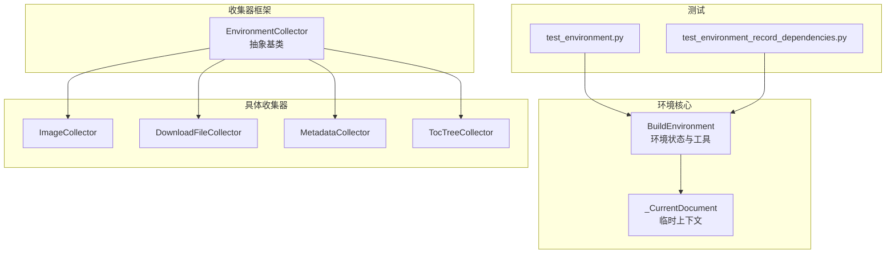
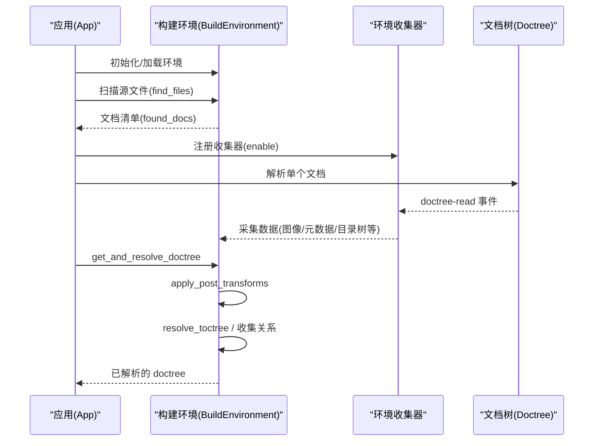
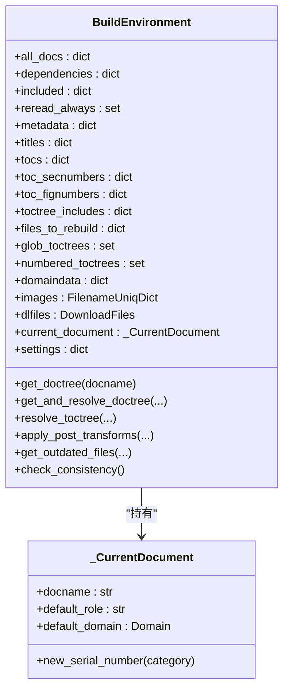
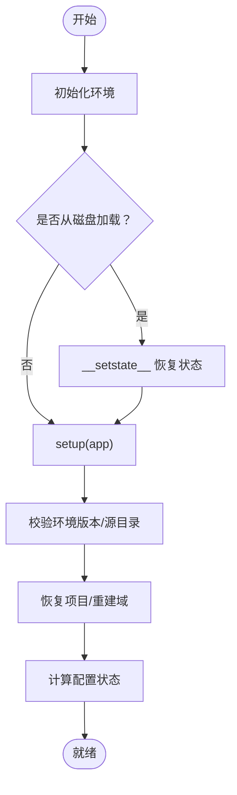
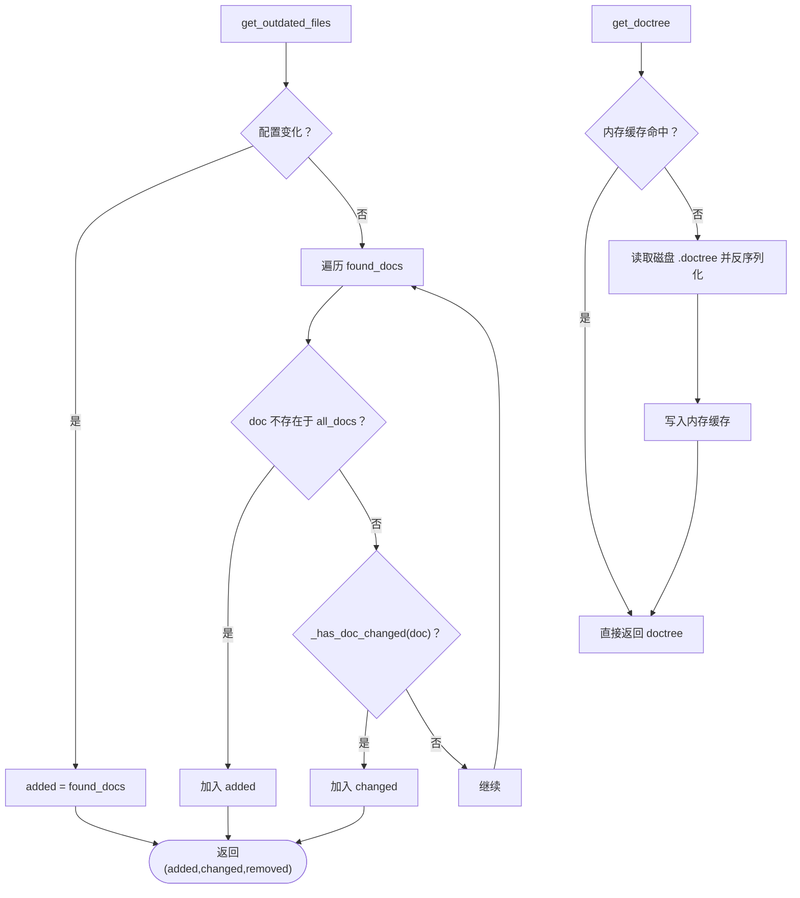
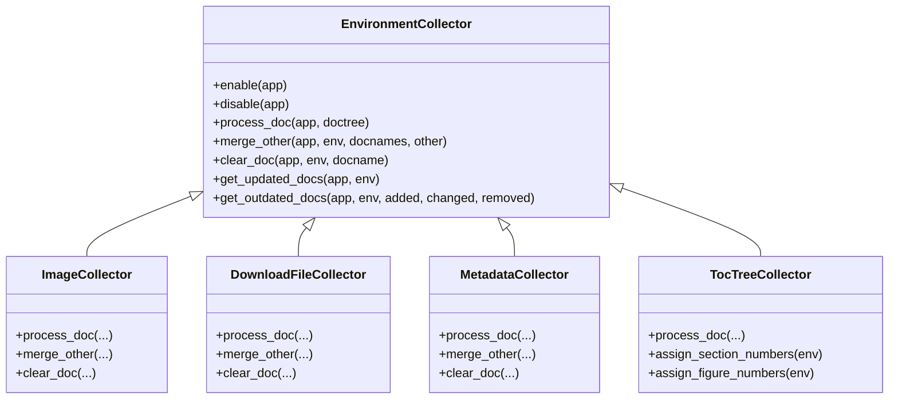
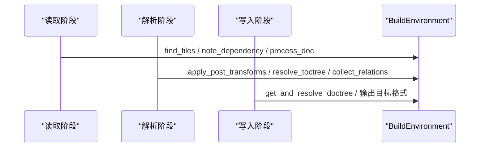
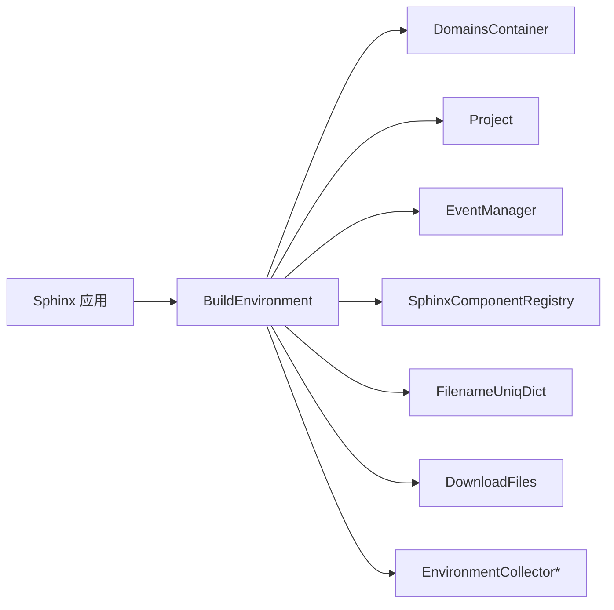

# 构建环境

<cite>
**本文档引用的文件**
- [sphinx/environment/__init__.py](file://sphinx/environment/__init__.py)
- [sphinx/environment/collectors/__init__.py](file://sphinx/environment/collectors/__init__.py)
- [sphinx/environment/collectors/asset.py](file://sphinx/environment/collectors/asset.py)
- [sphinx/environment/collectors/metadata.py](file://sphinx/environment/collectors/metadata.py)
- [sphinx/environment/collectors/toctree.py](file://sphinx/environment/collectors/toctree.py)
- [tests/test_environment/test_environment.py](file://tests/test_environment/test_environment.py)
- [tests/test_environment/test_environment_record_dependencies.py](file://tests/test_environment/test_environment_record_dependencies.py)
</cite>

## 目录
1. [引言](#引言)
2. [项目结构](#项目结构)
3. [核心组件](#核心组件)
4. [架构总览](#架构总览)
5. [详细组件分析](#详细组件分析)
6. [依赖分析](#依赖分析)
7. [性能考虑](#性能考虑)
8. [故障排查指南](#故障排查指南)
9. [结论](#结论)
10. [附录](#附录)

## 引言
本文件系统性阐述 Sphinx 构建环境（BuildEnvironment）的设计与实现，重点覆盖以下方面：
- BuildEnvironment 的职责边界：统一管理文档树、交叉引用、元数据、图像/下载文件、目录树（toctree）、版本化策略与增量构建。
- 初始化、加载与保存机制：pickle 序列化与反序列化、配置状态检测、版本兼容校验。
- 环境收集器（EnvironmentCollector）体系：图像、下载文件、元数据、目录树等数据采集与合并。
- 增量构建与缓存策略：基于时间戳、依赖图与内存缓存的 doctree 读取与解析。
- 多阶段构建流程中的关键角色：读取阶段、解析阶段、写入阶段的数据衔接。

## 项目结构
围绕构建环境的相关模块组织如下：
- 核心类与工具：sphinx/environment/__init__.py 定义 BuildEnvironment、_current_document 上下文、版本化方法与增量判断逻辑。
- 环境收集器框架：sphinx/environment/collectors/__init__.py 定义 EnvironmentCollector 抽象基类及事件钩子。
- 具体收集器实现：asset.py（图像与下载文件）、metadata.py（文档元数据）、toctree.py（目录树与编号分配）。
- 测试用例：tests/test_environment/*.py 验证配置状态、增量构建、依赖记录、对象库存等行为。

**图表来源**
- [sphinx/environment/__init__.py](file://sphinx/environment/__init__.py)
- [sphinx/environment/collectors/__init__.py](file://sphinx/environment/collectors/__init__.py)
- [sphinx/environment/collectors/asset.py](file://sphinx/environment/collectors/asset.py)
- [sphinx/environment/collectors/metadata.py](file://sphinx/environment/collectors/metadata.py)
- [sphinx/environment/collectors/toctree.py](file://sphinx/environment/collectors/toctree.py)
- [tests/test_environment/test_environment.py](file://tests/test_environment/test_environment.py)
- [tests/test_environment/test_environment_record_dependencies.py](file://tests/test_environment/test_environment_record_dependencies.py)

**章节来源**
- [sphinx/environment/__init__.py](file://sphinx/environment/__init__.py)
- [sphinx/environment/collectors/__init__.py](file://sphinx/environment/collectors/__init__.py)
- [sphinx/environment/collectors/asset.py](file://sphinx/environment/collectors/asset.py)
- [sphinx/environment/collectors/metadata.py](file://sphinx/environment/collectors/metadata.py)
- [sphinx/environment/collectors/toctree.py](file://sphinx/environment/collectors/toctree.py)
- [tests/test_environment/test_environment.py](file://tests/test_environment/test_environment.py)
- [tests/test_environment/test_environment_record_dependencies.py](file://tests/test_environment/test_environment_record_dependencies.py)

## 核心组件
- BuildEnvironment：全局构建环境，承载文档清单、依赖图、元数据、域数据、搜索索引、图片/下载文件映射、当前文档上下文等；负责 doctree 的读取、解析、toctree 解析与后处理、一致性检查、增量构建决策。
- EnvironmentCollector：环境收集器抽象，通过事件钩子在 doctree 读取后进行特定数据采集，并支持并行构建时的跨进程数据合并与清理。
- 具体收集器：
  - ImageCollector：采集图像候选集、语言化图像路径、注册依赖与唯一文件名映射。
  - DownloadFileCollector：采集可下载文件路径、注册依赖与唯一文件名映射。
  - MetadataCollector：抽取 docinfo 为文档元数据。
  - TocTreeCollector：构建 TOC、登记 toctree 包含关系、维护编号分配与文件重建集合。

**章节来源**
- [sphinx/environment/__init__.py](file://sphinx/environment/__init__.py)
- [sphinx/environment/collectors/__init__.py](file://sphinx/environment/collectors/__init__.py)
- [sphinx/environment/collectors/asset.py](file://sphinx/environment/collectors/asset.py)
- [sphinx/environment/collectors/metadata.py](file://sphinx/environment/collectors/metadata.py)
- [sphinx/environment/collectors/toctree.py](file://sphinx/environment/collectors/toctree.py)

## 架构总览
构建环境贯穿“读取—解析—写入”三阶段：
- 读取阶段：扫描源文件、建立文档清单与依赖图；各收集器在 doctree-read 事件中采集数据。
- 解析阶段：应用后转换（post-transforms），解析 toctree 节点，生成全局关系与编号。
- 写入阶段：根据增量结果决定重写范围，输出目标格式。

**图表来源**
- [sphinx/environment/__init__.py](file://sphinx/environment/__init__.py)
- [sphinx/environment/collectors/__init__.py](file://sphinx/environment/collectors/__init__.py)

## 详细组件分析

### BuildEnvironment 数据结构与职责
- 文档与依赖
  - all_docs：docname 到最近读取时间（微秒）。
  - dependencies：docname 到其依赖文件集合（相对根目录）。
  - included：docname 到包含它的文档集合。
  - reread_always：总是无条件重读的文档集合。
- 文件元数据与资源
  - metadata：docname 到键值对元数据。
  - images：FilenameUniqDict，绝对路径到唯一文件名映射。
  - dlfiles：DownloadFiles，唯一文件名到实际文件路径映射。
  - original_image_uri：原始图像 URI 映射。
- 目录树与标题
  - titles/longtitles：docname 到标题节点。
  - tocs/toc_num_entries：docname 到 TOC 与条目数。
  - toc_secnumbers/toc_fignumbers：节号/图号映射。
  - toctree_includes/files_to_rebuild/glob_toctrees/numbered_toctrees：目录树包含关系与重建传播。
- 搜索索引
  - 搜索标题、词干映射、索引条目、对象类型索引等。
- 域数据
  - domaindata：域名到域内数据字典。
- 当前文档上下文
  - current_document：临时存储当前文档的默认角色、默认域、高亮语言、自动文档注解等。
- 设置与版本化
  - settings：docutils 默认设置。
  - set_versioning_method：doctree 版本化策略与比较开关。
- 增量构建与一致性
  - get_outdated_files：基于时间戳与依赖判断新增/变更/移除。
  - check_consistency：检查孤立文档、重复父级等。
- doctree 缓存
  - _pickled_doctree_cache：磁盘 pickle 字节缓存。
  - _write_doc_doctree_cache：写阶段读取的 doctree 内存缓存。

**图表来源**
- [sphinx/environment/__init__.py](file://sphinx/environment/__init__.py)

**章节来源**
- [sphinx/environment/__init__.py](file://sphinx/environment/__init__.py)

### 初始化、加载与保存机制
- 初始化
  - 从应用注入 srcdir/doctreedir/config/events/project/version 等。
  - 创建 domains 容器并初始化。
  - 合并配置状态（新配置/扩展变化/配置变化）。
- 加载与保存
  - __getstate__/__setstate__：pickle 序列化时清理不可序列化字段与内存缓存，确保恢复后使用最新磁盘数据。
  - setup：校验环境版本与源目录一致性，恢复 project，重建 domains，更新 settings。
- 配置状态判定
  - _config_status：比较旧/新配置，返回 CONFIG_NEW/OK/CHANGED/EXTENSIONS_CHANGED，并输出差异摘要。

**图表来源**
- [sphinx/environment/__init__.py](file://sphinx/environment/__init__.py)

**章节来源**
- [sphinx/environment/__init__.py](file://sphinx/environment/__init__.py)

### 增量构建与缓存策略
- 增量判断
  - get_outdated_files：若配置变化则全量加入；否则按 _has_doc_changed 判断。
  - _has_doc_changed：检查 reread_always、doctree 是否存在、源文件 mtime、依赖 mtime。
- doctree 缓存
  - get_doctree：优先从内存 _pickled_doctree_cache 读取，否则从磁盘 .doctree 反序列化并回填缓存。
  - get_and_resolve_doctree：优先从 _write_doc_doctree_cache 命中，否则调用 get_doctree；随后应用后转换与 toctree 解析。
- 内存缓存
  - _pickled_doctree_cache：减少重复 IO。
  - _write_doc_doctree_cache：避免重复反序列化同一 doctree。

**图表来源**
- [sphinx/environment/__init__.py](file://sphinx/environment/__init__.py)

**章节来源**
- [sphinx/environment/__init__.py](file://sphinx/environment/__init__.py)

### 环境收集器工作原理
- 事件驱动
  - doctree-read：在文档读取完成后触发，收集器执行 process_doc。
  - env-merge-info：并行构建合并其他环境数据。
  - env-purge-doc：删除指定文档数据。
  - env-get-updated/env-get-outdated：在解析前后返回需要重读的文档列表。
- 清理与合并
  - clear_doc：按 docname 清理对应收集器数据。
  - merge_other：合并来自其他环境的指定文档数据。
- 具体收集器职责
  - ImageCollector：解析 nodes.image，构建 candidates 映射，注册依赖与唯一文件名。
  - DownloadFileCollector：解析 download_reference，注册依赖与唯一文件名。
  - MetadataCollector：抽取 docinfo 为元数据字典。
  - TocTreeCollector：构建 TOC、登记 toctree 包含关系、分配节号/图号并标记需重写的文档。

**图表来源**
- [sphinx/environment/collectors/__init__.py](file://sphinx/environment/collectors/__init__.py)
- [sphinx/environment/collectors/asset.py](file://sphinx/environment/collectors/asset.py)
- [sphinx/environment/collectors/metadata.py](file://sphinx/environment/collectors/metadata.py)
- [sphinx/environment/collectors/toctree.py](file://sphinx/environment/collectors/toctree.py)

**章节来源**
- [sphinx/environment/collectors/__init__.py](file://sphinx/environment/collectors/__init__.py)
- [sphinx/environment/collectors/asset.py](file://sphinx/environment/collectors/asset.py)
- [sphinx/environment/collectors/metadata.py](file://sphinx/environment/collectors/metadata.py)
- [sphinx/environment/collectors/toctree.py](file://sphinx/environment/collectors/toctree.py)

### 多阶段构建中的关键作用
- 读取阶段
  - 扫描源文件、建立文档清单与依赖图；各收集器采集数据并注册依赖。
- 解析阶段
  - apply_post_transforms 应用后转换；resolve_toctree 展开 toctree；collect_relations 生成文档关系。
- 写入阶段
  - 根据增量结果决定重写范围，输出目标格式；搜索索引与域数据在该阶段被写入。

**图表来源**
- [sphinx/environment/__init__.py](file://sphinx/environment/__init__.py)

**章节来源**
- [sphinx/environment/__init__.py](file://sphinx/environment/__init__.py)

## 依赖分析
- BuildEnvironment 对外依赖
  - 应用层：Sphinx、Project、Config、Events、Tags、Registry。
  - 工具层：FilenameUniqDict、DownloadFiles、LoggingReporter、时间戳工具。
  - 子系统：DomainsContainer、SphinxTransformer、toctree 适配器。
- 收集器依赖
  - 通过事件系统与应用交互，不直接依赖具体写入器，保证并行安全。
- 测试验证
  - 配置状态与增量构建：验证 CONFIG_NEW/OK/CHANGED/EXTENSIONS_CHANGED 行为。
  - 依赖记录：验证 note_dependency 在读取阶段生效。
  - 对象库存：验证域数据在环境中的持久化。

**图表来源**
- [sphinx/environment/__init__.py](file://sphinx/environment/__init__.py)

**章节来源**
- [sphinx/environment/__init__.py](file://sphinx/environment/__init__.py)
- [tests/test_environment/test_environment.py](file://tests/test_environment/test_environment.py)
- [tests/test_environment/test_environment_record_dependencies.py](file://tests/test_environment/test_environment_record_dependencies.py)

## 性能考虑
- doctree 缓存
  - 使用 _pickled_doctree_cache 与 _write_doc_doctree_cache 减少重复 IO 与反序列化成本。
- 依赖最小化
  - 仅在必要时重建文档，避免全量扫描；通过 note_dependency 精确追踪外部依赖。
- 并行构建
  - 收集器实现 parallel_read_safe/parallel_write_safe，支持多进程并行读取与写入。
- 版本化策略
  - set_versioning_method 限制不同构建器共享 doctree 目录，避免不一致导致的重复解析。

[本节为通用指导，无需列出具体文件来源]

## 故障排查指南
- 配置变更导致的重建
  - 观察配置状态：新配置、扩展变化、选项变化分别对应不同日志提示与增量行为。
- 依赖缺失或修改
  - 若依赖文件缺失或 mtime 更新，将触发文档变更；检查 note_dependency 注册与文件路径。
- 图像/下载文件不可读
  - 收集器会发出警告；确认文件可读且路径正确。
- 目录树异常
  - 多父级 toctree 会输出提示；检查 toctree 包含关系与自引用。

**章节来源**
- [sphinx/environment/__init__.py](file://sphinx/environment/__init__.py)
- [sphinx/environment/collectors/asset.py](file://sphinx/environment/collectors/asset.py)
- [sphinx/environment/collectors/toctree.py](file://sphinx/environment/collectors/toctree.py)
- [tests/test_environment/test_environment.py](file://tests/test_environment/test_environment.py)

## 结论
BuildEnvironment 是 Sphinx 构建流程的中枢，承担文档清单、依赖图、元数据、资源映射与 toctree 解析等职责。通过事件驱动的环境收集器体系，它实现了对图像、下载文件、元数据与目录树的统一采集与合并；借助 doctree 缓存与增量判断，显著提升构建效率。在多阶段构建中，它连接读取、解析与写入三个阶段，确保数据一致性与可扩展性。

[本节为总结性内容，无需列出具体文件来源]

## 附录
- 使用示例（基于测试）
  - 配置状态与增量构建：验证 CONFIG_NEW/OK/CHANGED/EXTENSIONS_CHANGED 的行为与输出。
  - 依赖记录：在读取阶段调用 note_dependency，确保后续增量判断生效。
  - 对象库存：构建后访问 domaindata/py/objects 与 modules，验证域数据持久化。

**章节来源**
- [tests/test_environment/test_environment.py](file://tests/test_environment/test_environment.py)
- [tests/test_environment/test_environment_record_dependencies.py](file://tests/test_environment/test_environment_record_dependencies.py)